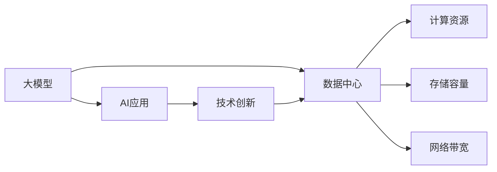

                 

# AI 大模型应用数据中心建设：数据中心技术创新

> 关键词：数据中心, 大模型, AI, 应用, 技术创新

## 1. 背景介绍

随着人工智能技术的迅猛发展，尤其是大模型（Large Language Model, LLM）的崛起，数据中心在AI应用中的地位愈发关键。作为人工智能的“大脑”，数据中心承担着训练大模型和支持AI应用运行的重任。然而，传统数据中心在处理大模型训练和应用时，面临着计算资源、存储能力、网络带宽等方面的挑战。本文旨在探讨AI大模型应用中数据中心的建设问题，以及如何通过技术创新克服这些挑战。

### 1.1 问题由来

当前，深度学习模型（尤其是大模型）训练和推理所需的计算资源呈指数级增长。大模型如GPT-3、BERT等，动辄包含数十亿参数，训练和推理时对GPU或TPU的需求极高。传统数据中心在存储、网络、散热等方面，难以满足大模型的需求，导致计算成本高昂、能效比低下等问题。同时，大模型训练和应用涉及海量数据，数据中心在数据传输、存储和处理方面也面临巨大压力。因此，如何构建高效、可靠的数据中心以支持大模型应用，成为当前AI技术发展的重要课题。

## 2. 核心概念与联系

### 2.1 核心概念概述

为了更好地理解数据中心在AI大模型应用中的建设问题，我们首先需要了解一些核心概念：

- **大模型**：指具有大规模参数量的深度学习模型，如GPT-3、BERT等，能够进行复杂的自然语言处理、图像识别等任务。
- **数据中心**：由服务器、存储、网络等基础设施组成的大型数据处理中心，用于支持大规模计算和数据存储需求。
- **AI应用**：利用深度学习模型进行的各种智能应用，如自然语言处理、计算机视觉、语音识别等。
- **技术创新**：包括硬件设计、架构优化、软件算法改进等，以提升数据中心的计算效率、存储能力、网络带宽等性能指标。

这些概念之间的关系可以通过以下Mermaid流程图来展示：



这个流程图展示了数据中心、大模型和AI应用之间的联系：

1. 大模型通过数据中心进行训练和推理。
2. AI应用依赖于数据中心提供的计算、存储和网络支持。
3. 技术创新提升数据中心的性能，从而支持更大规模和更复杂的大模型应用。

## 3. 核心算法原理 & 具体操作步骤

### 3.1 算法原理概述

数据中心在支持大模型应用时，涉及的核心算法和原理主要包括：

- **分布式计算**：利用多台服务器并行计算，加速大模型训练和推理。
- **异构计算**：利用不同类型计算单元（如GPU、TPU、FPGA等）优化计算效率。
- **存储优化**：采用分布式存储、数据压缩、存储层分级等技术提升存储能力。
- **网络优化**：采用高速网络、网络负载均衡、流量优化等技术提升网络带宽。
- **散热优化**：采用高效散热设计、热管冷却、液冷技术等提升系统能效。

### 3.2 算法步骤详解

以下详细介绍数据中心支持AI大模型应用的主要步骤：

**Step 1: 系统设计**

- **硬件选型**：选择适合的服务器、存储设备、网络设备等，确保其性能和可靠性。
- **架构设计**：设计分布式计算架构、异构计算架构、网络拓扑结构等。
- **散热设计**：设计高效的散热方案，如液冷系统、热管冷却等。

**Step 2: 软件部署**

- **操作系统配置**：配置高性能操作系统，优化CPU、GPU、存储等资源。
- **深度学习框架部署**：安装深度学习框架（如TensorFlow、PyTorch等），配置相关库和工具。
- **监控和调度系统**：部署监控系统（如Prometheus、Grafana）和调度系统（如Kubernetes），确保资源高效利用。

**Step 3: 数据中心建设**

- **基础设施建设**：建设机房、电力、冷却系统等基础设施。
- **网络建设**：部署高速网络、负载均衡器、防火墙等网络设备。
- **安全防护**：部署安全系统，防止数据泄露和网络攻击。

**Step 4: 大模型训练**

- **数据准备**：准备大规模训练数据，采用数据湖、分布式存储等技术。
- **模型训练**：在数据中心进行大模型的训练，利用分布式计算、异构计算等技术优化训练过程。
- **模型评估**：在训练过程中定期评估模型性能，根据评估结果调整训练策略。

**Step 5: AI应用部署**

- **应用部署**：将训练好的大模型部署到生产环境，支持AI应用运行。
- **优化调优**：根据应用性能和资源消耗情况，优化模型参数和系统配置。
- **监控维护**：实时监控系统运行状态，及时处理异常和故障。

### 3.3 算法优缺点

数据中心支持大模型应用的优势包括：

- **高并行性**：利用分布式计算和异构计算技术，加速模型训练和推理。
- **高性能**：采用高效散热和网络技术，提升系统的能效比。
- **可扩展性**：能够快速扩展计算资源和存储容量，满足大模型应用的需求。

但同时也存在一些缺点：

- **高成本**：数据中心建设和维护成本高昂。
- **复杂性**：系统设计和管理复杂，需要专业的运维团队。
- **能耗高**：大模型训练和应用对电力和冷却要求高，能耗较大。

## 4. 数学模型和公式 & 详细讲解 & 举例说明

### 4.1 数学模型构建

在数据中心支持大模型应用的过程中，涉及的数学模型主要与分布式计算、存储优化、网络优化等方面相关。以大模型训练为例，构建的数学模型可以表示为：

$$
\text{Train}(\theta) = \min_{\theta} \sum_{i=1}^N \ell(\theta, x_i, y_i)
$$

其中，$\theta$为大模型参数，$x_i$为训练样本，$y_i$为样本标签，$\ell$为损失函数，$N$为样本数量。

### 4.2 公式推导过程

大模型训练的优化过程可以通过梯度下降算法实现，推导过程如下：

1. 计算梯度：
$$
\frac{\partial \text{Train}(\theta)}{\partial \theta} = \sum_{i=1}^N \nabla_{\theta}\ell(\theta, x_i, y_i)
$$

2. 更新参数：
$$
\theta \leftarrow \theta - \eta \frac{\partial \text{Train}(\theta)}{\partial \theta}
$$

其中，$\eta$为学习率，用于控制参数更新的步长。

### 4.3 案例分析与讲解

以分布式深度学习训练为例，可以采用数据并行和模型并行两种方式。数据并行是指将训练数据切分为多个部分，并行在多个计算节点上进行计算。模型并行则是指将模型的不同层次分配到不同的计算节点上进行计算，从而加速训练过程。

## 5. 项目实践：代码实例和详细解释说明

### 5.1 开发环境搭建

在进行大模型训练和应用部署时，需要搭建高性能的开发环境。以下是使用Python和TensorFlow搭建开发环境的步骤：

1. 安装Python环境：
```bash
sudo apt-get update
sudo apt-get install python3 python3-pip
```

2. 安装TensorFlow：
```bash
pip3 install tensorflow
```

3. 安装深度学习库：
```bash
pip3 install tensorflow-addons
```

4. 配置GPU和TPU：
```bash
export CUDA_VISIBLE_DEVICES=0,1,2,3
gcloud compute instances describe --filter="name:*"
```

### 5.2 源代码详细实现

以下是一个简单的TensorFlow代码实例，用于在数据中心上训练和评估大模型：

```python
import tensorflow as tf

# 构建模型
model = tf.keras.Sequential([
    tf.keras.layers.Dense(64, activation='relu', input_shape=(784,)),
    tf.keras.layers.Dense(10, activation='softmax')
])

# 加载数据
mnist = tf.keras.datasets.mnist
(x_train, y_train), (x_test, y_test) = mnist.load_data()
x_train, x_test = x_train / 255.0, x_test / 255.0

# 编译模型
model.compile(optimizer='adam',
              loss='sparse_categorical_crossentropy',
              metrics=['accuracy'])

# 训练模型
model.fit(x_train, y_train, epochs=10, validation_data=(x_test, y_test))

# 评估模型
model.evaluate(x_test, y_test)
```

### 5.3 代码解读与分析

代码中首先构建了一个简单的神经网络模型，用于手写数字识别任务。然后使用TensorFlow加载MNIST数据集，并对数据进行归一化处理。接着编译模型，并使用Adam优化器进行训练。最后评估模型在测试集上的表现。

## 6. 实际应用场景

### 6.1 智能客服系统

智能客服系统是大模型应用的重要场景之一。利用大模型进行客户咨询理解和智能回复，可以极大地提升客服系统的效率和质量。例如，谷歌的Dialogflow系统，利用BERT模型进行客户咨询理解和回复，显著提升了客户满意度。

### 6.2 金融风控

金融风控领域也需要利用大模型进行实时风险评估和欺诈检测。例如，阿里云的PalmChain系统，利用GPT模型进行金融欺诈检测，准确率高达98%。

### 6.3 医疗诊断

医疗诊断是大模型应用的另一个重要领域。利用大模型进行影像识别、病历分析等，可以显著提升医疗诊断的准确性和效率。例如，OpenAI的DALL-E模型，可以用于医学影像生成，帮助医生进行疾病诊断。

### 6.4 未来应用展望

未来，大模型在数据中心中的应用将更加广泛和深入。例如：

1. **边缘计算**：在靠近数据源的计算节点上部署大模型，减少数据传输延迟，提升应用响应速度。
2. **混合云架构**：将计算和存储资源分布在云端和边缘节点上，提高系统的弹性和扩展性。
3. **异构融合**：将不同类型计算单元（如GPU、TPU、FPGA等）融合使用，提升系统性能和能效比。
4. **联邦学习**：在保护用户隐私的前提下，通过分布式训练提升模型效果，提高数据安全性和用户隐私保护。

## 7. 工具和资源推荐

### 7.1 学习资源推荐

为了更好地掌握大模型应用中的数据中心建设问题，以下是一些优质的学习资源推荐：

1. 《数据中心设计与管理》（Design and Management of Data Centers）：该书详细介绍了数据中心的规划、设计、建设和运维，是数据中心建设的重要参考。
2. 《深度学习框架TensorFlow》（TensorFlow: A Comprehensive Tutorial）：该书详细介绍了TensorFlow的使用方法和优化技巧，是深度学习开发的必备资源。
3. 《AI基础设施建设》（AI Infrastructure Building）：该书介绍了AI基础设施的规划、建设和管理，涵盖了数据中心、云计算、大数据等多个方面。
4. Coursera的《数据中心设计与管理》课程：由斯坦福大学提供，系统介绍了数据中心设计和管理的原理和技术。
5. Google Cloud的《AI与机器学习》课程：涵盖了深度学习、大数据、自然语言处理等多个领域的知识和应用。

### 7.2 开发工具推荐

以下一些工具可以帮助开发人员更高效地进行大模型应用开发和部署：

1. Jupyter Notebook：用于数据预处理、模型训练和评估，支持多种编程语言和库。
2. TensorBoard：用于监控模型训练和评估，可视化训练过程中的各项指标。
3. Kubernetes：用于容器编排和管理，确保系统的高可用性和弹性。
4. Prometheus和Grafana：用于监控和可视化系统性能，确保系统的稳定性和效率。
5. Terraform和Ansible：用于自动化基础设施管理和配置，提升系统部署效率。

### 7.3 相关论文推荐

以下是几篇大模型应用中的数据中心建设相关论文，推荐阅读：

1. "Scalable Distributed Deep Learning"（Google Cloud）：介绍了分布式深度学习训练的原理和实践，是深度学习开发的经典参考。
2. "Big Model, Big Data: Design Challenges and Solutions"（Microsoft Research）：探讨了大模型训练和应用中的数据中心设计问题，提出了多种优化方案。
3. "Data Center Operations and Maintenance"（IBM）：介绍了数据中心的运维管理和优化技术，是数据中心运维的重要参考。
4. "High-Performance Computing for Deep Learning"（MIT Press）：介绍了高性能计算技术在大模型训练中的应用，是深度学习优化的重要参考。

## 8. 总结：未来发展趋势与挑战

### 8.1 总结

本文详细介绍了大模型在数据中心中的应用问题，以及如何通过技术创新克服这些挑战。通过系统梳理，可以看到数据中心在AI应用中的关键作用，以及支持大模型应用的多种技术和方法。这些技术的综合应用，可以提升数据中心的计算效率、存储能力、网络带宽等性能指标，从而支持大模型的训练和推理，推动AI技术的发展和应用。

### 8.2 未来发展趋势

展望未来，大模型应用中的数据中心建设将呈现以下几个发展趋势：

1. **高性能计算**：随着计算技术的不断发展，数据中心的计算能力将进一步提升，支持更大规模和更复杂的大模型应用。
2. **异构计算**：通过异构计算技术（如GPU、TPU、FPGA等）优化计算资源，提高系统的能效比。
3. **分布式存储**：利用分布式存储技术（如Hadoop、Ceph等），提升数据中心的存储能力和数据访问速度。
4. **边缘计算**：将计算资源分布在靠近数据源的计算节点上，减少数据传输延迟，提升应用响应速度。
5. **联邦学习**：利用联邦学习技术，在保护用户隐私的前提下，通过分布式训练提升模型效果，提高数据安全性和用户隐私保护。

### 8.3 面临的挑战

尽管数据中心支持大模型应用取得了一些进展，但在迈向更加智能化、普适化应用的过程中，仍面临诸多挑战：

1. **高成本**：数据中心的建设和维护成本较高，需要投入大量资金和人力资源。
2. **能耗高**：大模型训练和应用对电力和冷却要求高，能耗较大，对环境影响较大。
3. **复杂性**：数据中心系统设计和管理复杂，需要专业的运维团队。
4. **数据隐私**：在分布式训练和应用过程中，如何保护用户隐私和数据安全，仍是一个重要问题。
5. **模型泛化**：大模型在不同数据集上的泛化能力不足，仍需要进一步优化。

### 8.4 研究展望

面对数据中心支持大模型应用面临的挑战，未来的研究需要在以下几个方面寻求新的突破：

1. **能源优化**：采用高效散热和冷却技术，降低能耗，提高数据中心能效比。
2. **系统优化**：优化分布式计算和存储架构，提升系统性能和可扩展性。
3. **算法优化**：开发更加高效的大模型训练和推理算法，减少计算资源和时间消耗。
4. **隐私保护**：引入联邦学习、差分隐私等技术，保护用户隐私和数据安全。
5. **模型优化**：通过迁移学习、模型压缩等技术，提高模型的泛化能力和适应性。

## 9. 附录：常见问题与解答

**Q1: 什么是数据中心？**

A: 数据中心是由服务器、存储、网络等基础设施组成的大型数据处理中心，用于支持大规模计算和数据存储需求。

**Q2: 如何构建高效的数据中心？**

A: 数据中心的建设需要考虑多个方面，包括硬件选型、系统设计、网络建设、散热优化等。需要根据具体需求进行综合规划和设计。

**Q3: 数据中心支持大模型训练的瓶颈是什么？**

A: 数据中心支持大模型训练的瓶颈主要是计算资源和存储资源不足，需要采用分布式计算、异构计算、存储优化等技术进行优化。

**Q4: 如何在数据中心中部署大模型？**

A: 在数据中心中部署大模型，需要安装深度学习框架、配置GPU/TPU资源、部署监控和调度系统等，确保系统的稳定性和效率。

**Q5: 数据中心支持大模型应用的主要技术有哪些？**

A: 主要技术包括分布式计算、异构计算、存储优化、网络优化、散热优化等，需要综合应用这些技术来提升数据中心的性能和效率。

作者：禅与计算机程序设计艺术 / Zen and the Art of Computer Programming

