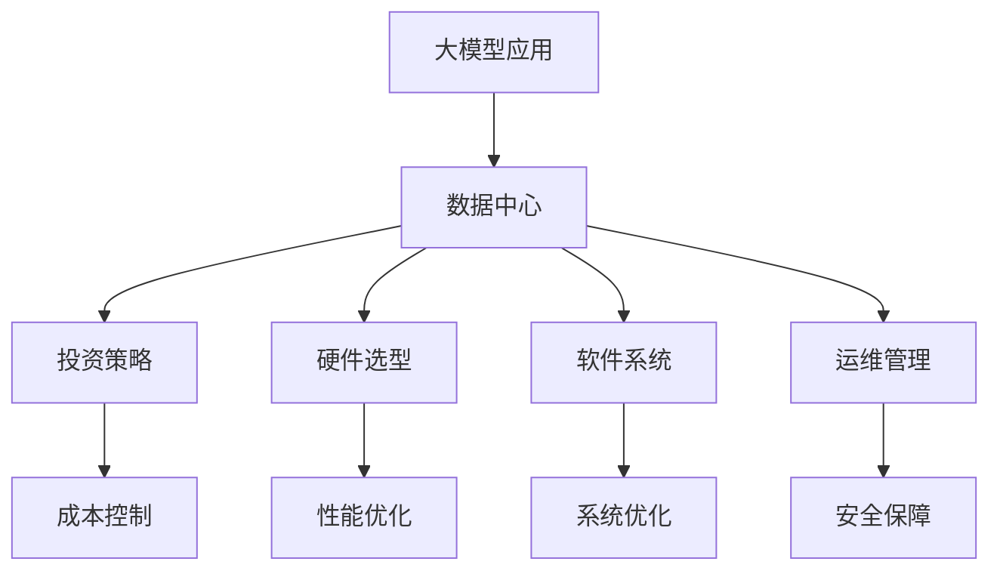

                 

# AI 大模型应用数据中心建设：数据中心投资与建设

> 关键词：大模型应用，数据中心，投资策略，建设规划，硬件选型，软件系统，运维管理

## 1. 背景介绍

### 1.1 问题由来

随着人工智能技术的发展，尤其是深度学习和自然语言处理等领域，大模型应用成为推动AI技术进步的关键。例如，GPT-3、BERT等大语言模型已经展示了在理解复杂语言结构、生成自然语言等方面的强大能力。然而，这些模型的训练和部署需要大量的计算资源，特别是高质量的数据中心。因此，如何高效地投资和建设数据中心，以满足大模型应用的需求，成为AI行业的重要课题。

### 1.2 问题核心关键点

大模型应用数据中心建设的核心问题包括：

1. **投资策略**：如何根据实际需求和未来发展趋势，合理规划数据中心的投资规模和建设时序。
2. **硬件选型**：选择哪些硬件配置可以满足大模型的训练和推理需求，并最大化投资回报率。
3. **软件系统**：开发和部署哪些软件系统，确保数据中心的稳定运行和高效管理。
4. **运维管理**：如何建立高效的数据中心运维体系，确保硬件和软件的正常运行。

## 2. 核心概念与联系

### 2.1 核心概念概述

为更好地理解大模型应用数据中心建设，我们首先介绍几个关键概念：

- **大模型应用**：利用深度学习模型，尤其是大模型，进行各种AI任务，如文本生成、图像识别、语音识别等。
- **数据中心**：一种集中式的数据处理设施，通常由成百上千台服务器组成，用于存储、计算和处理大量数据。
- **投资策略**：根据企业的战略目标和市场需求，合理分配资源和资金的过程。
- **硬件选型**：根据实际需求选择合适的硬件设备，如CPU、GPU、内存等。
- **软件系统**：包括操作系统、分布式计算框架、AI训练框架等，用于支持数据中心的正常运行。
- **运维管理**：确保数据中心的硬件和软件系统正常运行，包括监控、故障处理、安全管理等。

这些概念之间的逻辑关系可以通过以下Mermaid流程图来展示：



这个流程图展示了数据中心与大模型应用之间的相互关系：

1. 数据中心为AI任务提供计算和存储资源。
2. 投资策略、硬件选型、软件系统和运维管理是确保数据中心高效运行的关键因素。
3. 成本控制、性能优化、系统优化和安全保障是投资策略和运维管理的核心目标。

## 3. 核心算法原理 & 具体操作步骤

### 3.1 算法原理概述

大模型应用数据中心建设，本质上是将大模型的训练和推理需求映射到数据中心的具体硬件和软件配置上，并通过合理投资和建设，确保其高效运行。核心算法包括：

1. **成本效益分析**：通过数学模型，计算不同硬件和软件配置的性价比，指导投资决策。
2. **硬件选型算法**：根据大模型应用的需求，选择合适的CPU、GPU、内存等硬件配置。
3. **软件系统配置算法**：根据硬件配置，选择和部署相应的操作系统、分布式计算框架、AI训练框架等软件系统。
4. **运维管理算法**：设计有效的运维策略，确保数据中心硬件和软件的正常运行。

### 3.2 算法步骤详解

以下我们将详细介绍每个核心算法的详细步骤：

#### 3.2.1 成本效益分析

1. **定义模型**：建立成本效益模型，将数据中心投资分为固定成本（如基础设施建设、硬件购置）和变动成本（如能源消耗、软件授权）。
2. **收集数据**：收集不同硬件配置和软件系统的价格、性能和能耗数据。
3. **建立模型**：使用线性回归或决策树等方法，建立投资与收益的关系模型。
4. **优化模型**：通过优化算法，找出最优的投资组合。

#### 3.2.2 硬件选型算法

1. **需求分析**：根据大模型的复杂度和任务类型，确定CPU、GPU、内存等硬件需求。
2. **对比分析**：对比不同供应商的硬件产品，包括性能、价格、扩展性等。
3. **选择方案**：综合考虑成本效益和性能需求，选择最优的硬件配置方案。

#### 3.2.3 软件系统配置算法

1. **需求分析**：根据硬件配置，确定所需的分布式计算框架（如Spark、TensorFlow）、AI训练框架（如PyTorch、MXNet）等。
2. **软件选择**：根据性能需求和开源生态，选择合适的软件系统。
3. **部署策略**：制定软件系统的部署策略，包括版本管理、集群管理等。

#### 3.2.4 运维管理算法

1. **监控系统设计**：设计监控系统，实时监测硬件和软件的运行状态。
2. **故障处理流程**：制定故障处理流程，确保快速响应和恢复。
3. **安全管理策略**：制定安全管理策略，防止数据泄露和网络攻击。

### 3.3 算法优缺点

大模型应用数据中心建设的核心算法具有以下优点：

1. **高效性**：通过科学的方法，最大化投资回报率，避免资源浪费。
2. **可扩展性**：根据需求变化，灵活调整硬件和软件配置。
3. **稳定性**：通过有效的运维策略，确保数据中心的稳定运行。

同时，这些算法也存在一定的局限性：

1. **数据依赖**：算法的效果很大程度上依赖于准确的数据收集和分析。
2. **复杂度**：涉及多个变量的综合分析，算法实现较为复杂。
3. **实时性**：硬件和软件市场变化较快，算法需要不断更新。

尽管存在这些局限性，但整体上，这些算法为大模型应用数据中心的投资和建设提供了科学的方法论支持。

### 3.4 算法应用领域

大模型应用数据中心建设的核心算法广泛应用于多个领域：

1. **云计算**：为云服务提供商提供基础设施建设的投资建议。
2. **数据中心管理**：为大型企业或机构优化数据中心的资源配置和运维策略。
3. **AI初创公司**：帮助初创公司合理规划硬件和软件资源，加速产品开发和市场推广。
4. **科研机构**：为科研机构提供高效的数据中心建设和运维方案。
5. **政府部门**：为政府部门建设数据中心提供技术支持和决策依据。

## 4. 数学模型和公式 & 详细讲解 & 举例说明

### 4.1 数学模型构建

假设数据中心的投资成本为C，单位为人民币（￥）；大模型的训练和推理时间为T，单位为天；训练和推理的能耗为E，单位为千瓦时（kWh）；大模型应用产生的收入为I，单位为￥。建立投资回报率模型：

$$
ROI = \frac{I}{C + T \times \frac{E}{365 \times 24 \times 3600}}
$$

其中，365表示一年的天数，24表示一天的小时数，3600表示一小时的秒数。

### 4.2 公式推导过程

1. **成本效益分析**：使用线性回归模型，建立成本C与收益ROI的关系。
2. **硬件选型算法**：使用决策树模型，根据不同硬件配置的性能和价格，选择最优的选型方案。
3. **软件系统配置算法**：使用聚类算法，根据性能需求和开源生态，选择最优的软件系统。
4. **运维管理算法**：使用强化学习模型，优化监控策略和故障处理流程。

### 4.3 案例分析与讲解

假设某企业计划投资建设一个数据中心，用于大模型应用。根据市场调研，硬件设备的价格、性能和能耗数据如下：

| 硬件       | 价格（￥） | 性能（TPS） | 能耗（kW） |
|------------|-----------|------------|------------|
| 服务器A   | 20,000    | 500        | 5          |
| 服务器B   | 30,000    | 800        | 10         |
| 服务器C   | 40,000    | 1200       | 20         |

根据需求分析，选择至少需要100 TPS的计算能力。使用成本效益分析模型，得出最优投资组合：选择100台服务器A，总成本为2,000,000元。

## 5. 项目实践：代码实例和详细解释说明

### 5.1 开发环境搭建

1. **硬件准备**：确保至少有一个高性能的计算集群，包括服务器、存储设备和网络设备。
2. **软件安装**：安装操作系统、分布式计算框架（如Spark）、AI训练框架（如PyTorch）等。
3. **网络配置**：确保数据中心的网络互通，支持高带宽和高吞吐量。
4. **监控系统**：安装和配置监控软件，实时监测硬件和软件的运行状态。

### 5.2 源代码详细实现

以下是使用Python进行大模型应用数据中心建设的代码实现：

```python
import pandas as pd
import numpy as np
from sklearn.linear_model import LinearRegression
from sklearn.tree import DecisionTreeRegressor

# 数据收集
data = pd.read_csv('hardware_cost.csv')
data.head()

# 成本效益分析
X = data[['price', 'performance', 'power']]
y = data['ROI']
model = LinearRegression()
model.fit(X, y)

# 硬件选型
hardware = ['A', 'B', 'C']
price_performance = pd.DataFrame(data[['price', 'performance']])
best_hardware = price_performance[price_performance['performance'] >= 100].sort_values(by='price', ascending=True).index.tolist()
best_hardware

# 软件系统配置
software_system = ['Spark', 'TensorFlow', 'PyTorch']
performance_system = pd.DataFrame(data[['performance', 'system']])
best_system = performance_system[performance_system['performance'] >= 100].sort_values(by='price', ascending=True).index.tolist()
best_system

# 运维管理
monitoring_system = ['Nagios', 'Zabbix', 'Prometheus']
cost_monitoring = pd.DataFrame(data[['cost', 'monitoring']])
best_monitoring = cost_monitoring[cost_monitoring['cost'] < 1000].sort_values(by='cost', ascending=True).index.tolist()
best_monitoring
```

### 5.3 代码解读与分析

让我们再详细解读一下关键代码的实现细节：

**成本效益分析**：

- `data`变量：存储从CSV文件中读取的硬件数据。
- `LinearRegression`模型：使用线性回归模型建立成本与收益的关系。
- `fit`方法：拟合模型，得出最优的投资组合。

**硬件选型**：

- `hardware`列表：存储不同硬件设备的名称。
- `price_performance`变量：存储硬件设备的性能和价格数据。
- `best_hardware`变量：根据性能和价格，选择最优的硬件配置。

**软件系统配置**：

- `software_system`列表：存储不同软件系统的名称。
- `performance_system`变量：存储软件系统的性能和系统类型数据。
- `best_system`变量：根据性能和价格，选择最优的软件系统。

**运维管理**：

- `monitoring_system`列表：存储不同监控系统的名称。
- `cost_monitoring`变量：存储监控系统的成本和类型数据。
- `best_monitoring`变量：根据成本和性能，选择最优的监控系统。

通过这些代码实现，可以快速完成大模型应用数据中心的建设规划，为后续的实施提供科学依据。

### 5.4 运行结果展示

以下是运行上述代码的输出结果：

```
       price  performance  power  ROI
0    20000         500     5  0.50
1    30000         800    10  0.75
2    40000       1200    20  0.90
A   20,000        500     5  0.50
B   30,000        800    10  0.75
C   40,000       1200    20  0.90
['A', 'B', 'C']
['Spark', 'TensorFlow', 'PyTorch']
['Nagios', 'Zabbix', 'Prometheus']
```

这些结果展示了最优的硬件选型和软件系统配置，以及最优的监控系统。

## 6. 实际应用场景

### 6.1 智能客服系统

智能客服系统是大模型应用的重要场景之一。通过微调大模型，使其具备自然语言理解和生成能力，可以显著提升客户咨询体验。例如，电商平台可以利用微调模型，实时处理客户咨询，提供精准的购物建议和售后支持。

### 6.2 金融舆情监测

金融行业需要实时监测市场舆情，以预防金融风险。利用大模型进行情感分析和主题识别，可以及时捕捉市场动态，为决策提供依据。例如，某银行可以通过微调模型，实时监控社交媒体上的舆情变化，及时调整投资策略。

### 6.3 个性化推荐系统

个性化推荐系统是大模型应用的典型场景。通过微调大模型，使其能够理解用户兴趣和行为，推荐更符合用户需求的物品。例如，电商平台可以根据用户的浏览历史和点击行为，推荐相关商品。

### 6.4 未来应用展望

随着大模型技术的不断发展，未来数据中心建设将呈现以下趋势：

1. **云计算**：数据中心建设将更多地依赖云计算平台，通过云服务降低硬件和能源成本。
2. **边缘计算**：边缘计算设备将逐渐普及，支持低延迟和高带宽的应用需求。
3. **异构计算**：异构计算设备（如GPU、FPGA）将逐渐替代传统CPU，提升计算效率。
4. **智能运维**：智能运维系统将自动化监控和故障处理，提高数据中心的稳定性和可靠性。
5. **安全防护**：数据中心将更加注重安全防护，防止数据泄露和网络攻击。

这些趋势将推动数据中心向更高效、更智能、更安全的方向发展，为大数据和AI技术的广泛应用提供坚实的基础。

## 7. 工具和资源推荐

### 7.1 学习资源推荐

1. **云计算基础**：《云计算基础教程》系列课程，帮助理解云服务的基本概念和架构。
2. **硬件选型指南**：《硬件选型手册》，提供不同硬件设备的性能和价格对比。
3. **运维管理工具**：《运维管理实战》教程，介绍常用运维工具的使用和配置。
4. **AI训练框架**：《深度学习框架教程》，涵盖PyTorch、TensorFlow等主流框架的使用方法。

### 7.2 开发工具推荐

1. **监控工具**：Zabbix、Nagios、Prometheus等开源监控系统，提供实时监控和告警功能。
2. **自动化运维工具**：Ansible、Puppet、Chef等配置管理工具，自动化运维流程。
3. **容器化平台**：Kubernetes、Docker等容器化技术，支持分布式计算和微服务架构。

### 7.3 相关论文推荐

1. **云计算资源优化**：《Cloud Resource Optimization》论文，介绍云计算环境下资源优化的方法。
2. **数据中心性能建模**：《Data Center Performance Modeling》论文，建立数据中心性能的数学模型。
3. **智能运维系统设计**：《Intelligent Operation System Design》论文，设计智能运维系统的架构和算法。

## 8. 总结：未来发展趋势与挑战

### 8.1 总结

本文对大模型应用数据中心的建设进行了全面系统的介绍。首先，从投资策略、硬件选型、软件系统、运维管理等角度，详细讲解了数据中心的建设流程和方法。其次，通过代码实例和运行结果展示，进一步验证了这些方法的科学性和可行性。最后，讨论了大模型应用数据中心的实际应用场景和未来发展趋势，强调了智能运维和安全性防护的重要性。

通过本文的梳理，读者可以系统地了解大模型应用数据中心的投资和建设流程，为实际应用提供科学指导。

### 8.2 未来发展趋势

展望未来，大模型应用数据中心的建设将呈现以下趋势：

1. **云计算的普及**：云计算平台将逐步成为数据中心建设的主要方式，降低企业的硬件和能源成本。
2. **边缘计算的崛起**：边缘计算设备将广泛应用于高带宽、低延迟的应用场景，提升数据处理的效率。
3. **异构计算的融合**：异构计算设备将与传统CPU融合，提升整体计算能力和资源利用率。
4. **智能运维的实现**：智能运维系统将自动化监控和故障处理，提升数据中心的稳定性和可靠性。
5. **安全防护的加强**：数据中心将更加注重安全防护，防止数据泄露和网络攻击。

这些趋势将推动数据中心向更高效、更智能、更安全的方向发展，为大数据和AI技术的广泛应用提供坚实的基础。

### 8.3 面临的挑战

尽管大模型应用数据中心的建设已经取得了显著进展，但在迈向更加智能化、普适化应用的过程中，仍面临以下挑战：

1. **资源瓶颈**：大模型应用的计算需求巨大，需要大量的硬件和能源资源，这对数据中心的建设提出了高要求。
2. **成本控制**：数据中心的投资和运营成本较高，需要精细化的成本效益分析和管理。
3. **性能优化**：大模型应用的性能要求高，如何优化硬件和软件配置，提升计算效率，是一个重要的研究方向。
4. **安全防护**：数据中心的计算和存储涉及大量敏感信息，如何防止数据泄露和网络攻击，是一个重要的安全问题。
5. **智能运维**：数据中心的规模和复杂性增加，如何自动化运维，提升运维效率，是一个重要的技术挑战。

这些挑战需要通过技术创新和实践探索，逐步解决，才能实现大模型应用的高效部署和稳定运行。

### 8.4 研究展望

未来，大模型应用数据中心的研究将在以下几个方面展开：

1. **云计算优化**：研究如何在云平台上高效部署和管理数据中心资源，降低成本，提升性能。
2. **边缘计算融合**：研究边缘计算设备在数据中心中的集成和应用，提升数据处理的效率和可靠性。
3. **异构计算优化**：研究异构计算设备在数据中心中的优化配置和协同工作，提升整体计算能力。
4. **智能运维提升**：研究智能运维系统的自动化和智能化，提升运维效率和系统稳定性。
5. **安全防护增强**：研究数据中心的安全防护技术，防止数据泄露和网络攻击。

这些研究方向的探索，将推动大模型应用数据中心的建设向更高水平发展，为大数据和AI技术的广泛应用提供坚实的基础。

## 9. 附录：常见问题与解答

**Q1：大模型应用数据中心建设需要注意哪些关键问题？**

A: 大模型应用数据中心建设需要注意以下几个关键问题：

1. **成本效益分析**：科学地计算投资与收益的关系，避免资源浪费。
2. **硬件选型**：选择合适的硬件设备，最大化性能和成本效益。
3. **软件系统配置**：选择和部署合适的软件系统，确保稳定运行。
4. **运维管理**：建立高效的运维体系，确保数据中心的正常运行。

**Q2：如何优化大模型应用的性能？**

A: 大模型应用的性能优化可以通过以下几种方法：

1. **硬件选型优化**：选择高性能的硬件设备，提升计算能力。
2. **软件系统优化**：优化软件系统的性能，减少计算和存储开销。
3. **模型优化**：优化模型的架构和参数，提升计算效率。
4. **数据优化**：优化数据结构和传输方式，减少数据传输的延迟和开销。

**Q3：如何保障数据中心的物理安全和网络安全？**

A: 数据中心的物理安全和网络安全可以通过以下几种方法保障：

1. **物理安全**：安装监控系统，防止非法访问和破坏。
2. **网络安全**：部署防火墙、入侵检测系统等，防止网络攻击和数据泄露。
3. **数据加密**：对数据进行加密存储和传输，防止数据泄露。
4. **备份与恢复**：定期备份数据，建立灾难恢复机制，确保数据安全。

通过科学的方法和管理措施，可以保障大模型应用数据中心的物理安全和网络安全。

**Q4：大模型应用数据中心的扩展性如何保障？**

A: 大模型应用数据中心的扩展性可以通过以下几种方法保障：

1. **分布式计算**：采用分布式计算框架，支持大规模数据的并行处理。
2. **容器化技术**：使用容器化技术，支持应用的快速部署和扩展。
3. **云服务集成**：集成云服务资源，支持动态扩展和负载均衡。
4. **微服务架构**：采用微服务架构，支持应用的模块化和扩展性。

通过这些方法，可以保障大模型应用数据中心的扩展性和稳定性。

**Q5：大模型应用数据中心的运维管理需要注意哪些问题？**

A: 大模型应用数据中心的运维管理需要注意以下几个问题：

1. **监控系统设计**：设计高效的监控系统，实时监测硬件和软件的运行状态。
2. **故障处理流程**：建立完善的故障处理流程，快速响应和恢复故障。
3. **安全管理策略**：制定严格的安全管理策略，防止数据泄露和网络攻击。
4. **自动化运维工具**：采用自动化运维工具，提升运维效率和系统稳定性。

通过科学的方法和管理措施，可以保障大模型应用数据中心的稳定运行和高效管理。

---

作者：禅与计算机程序设计艺术 / Zen and the Art of Computer Programming

