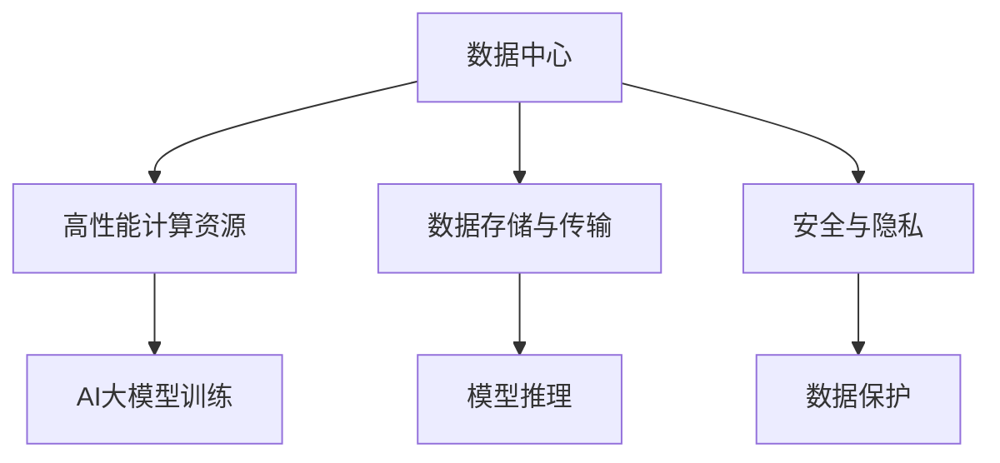

                 

# AI 大模型应用数据中心建设：数据中心绿色节能

## 1. 背景介绍

### 1.1 问题由来
人工智能(AI)大模型，如深度学习模型，已经成为推动科技进步和产业创新的重要引擎。这些模型在处理大数据、执行复杂计算任务方面具有显著优势，应用范围涵盖了图像识别、自然语言处理、语音识别、自动驾驶等多个领域。然而，AI大模型的大规模应用也带来了不容忽视的挑战：

- **能源消耗**：大模型训练和推理过程中的高能耗问题，导致数据中心的电力需求和碳排放大幅增加。
- **硬件资源需求**：大模型通常需要大量GPU、TPU等高性能计算资源，难以在传统数据中心高效运行。
- **数据管理**：大模型对数据存储和传输的要求极高，需要构建高速、可靠的数据管理体系。
- **安全与隐私**：大模型的训练数据和推理结果可能包含敏感信息，需要有效的安全防护和隐私保护措施。

数据中心是AI大模型应用的重要基础设施，其建设和管理质量直接关系到AI技术的发展速度和普及程度。因此，构建高效、绿色、安全的数据中心，成为推动AI技术发展的关键。

## 2. 核心概念与联系

### 2.1 核心概念概述

为更好地理解数据中心绿色节能的建设，本节将介绍几个密切相关的核心概念：

- **数据中心(Data Center, DC)**：负责计算、存储和网络资源的设施，是AI大模型运行的核心平台。
- **绿色节能**：指通过优化数据中心的运行效率，降低能耗和碳排放，实现可持续发展。
- **高性能计算资源**：如GPU、TPU等，为AI大模型提供计算支持。
- **数据存储与传输**：涉及大规模数据的读写和传输，需要高速、可靠的存储网络体系。
- **安全与隐私**：指在数据中心建设中，对模型训练数据和推理结果的保护，避免数据泄露和滥用。

这些核心概念之间的逻辑关系可以通过以下Mermaid流程图来展示：



这个流程图展示了大模型应用数据中心的核心组件及其相互关系：

1. **数据中心**：提供计算、存储和网络资源，支撑AI大模型的运行。
2. **高性能计算资源**：为大模型的训练和推理提供高性能计算支持。
3. **数据存储与传输**：确保大规模数据的可靠存储和快速传输。
4. **安全与隐私**：保护数据中心内部和外部的数据安全，确保合规使用。
5. **模型训练和推理**：通过数据中心的软硬件支持，进行AI大模型的训练和推理。
6. **数据保护**：在数据中心内，对模型训练数据和推理结果进行加密、脱敏等保护措施。

## 3. 核心算法原理 & 具体操作步骤

### 3.1 算法原理概述

数据中心的绿色节能建设，涉及对数据中心基础设施、硬件设备、能源消耗、网络架构等多方面的优化。其核心思想是通过技术手段和策略设计，提高数据中心的能效比，减少能源消耗和碳排放，同时保障AI大模型的高效运行。

**主要优化方向包括**：

1. **高效能硬件**：选择低能耗、高效能的计算硬件，如GPU、TPU、FPGA等，优化计算资源的利用率。
2. **智能调度与负载均衡**：通过算法优化模型的资源分配，减少资源浪费和能量损耗。
3. **能源管理和优化**：使用节能设备、优化供电系统，提高能源利用效率。
4. **冷却系统优化**：通过高效冷却技术，降低数据中心的运营能耗。
5. **网络优化**：构建高速、可靠的网络体系，提升数据传输效率。
6. **数据管理与存储优化**：优化数据存储策略，减少数据冗余和传输成本。

### 3.2 算法步骤详解

数据中心的绿色节能建设主要包括以下几个关键步骤：

**Step 1: 需求分析与规划**
- 分析AI大模型的计算需求和能耗特性，制定数据中心的初步规划。
- 根据能效需求，选择合适的地理位置、基础设施和设备。

**Step 2: 硬件与设备选择**
- 选择低能耗、高效能的计算硬件，如GPU、TPU等。
- 采用高效的制冷和供电系统，减少能耗和碳排放。
- 配置网络设备，优化网络带宽和延迟。

**Step 3: 系统设计与优化**
- 设计高效能的计算资源管理系统，实现资源调度与负载均衡。
- 采用能源管理系统，实时监测和调节能源使用，优化能源利用率。
- 优化冷却系统，采用如自然冷却、液冷技术等，降低冷却能耗。

**Step 4: 数据管理与存储**
- 设计高效的数据存储策略，使用分布式存储、数据压缩等技术，减少数据冗余和传输成本。
- 实施数据加密、脱敏等保护措施，确保数据安全和隐私。

**Step 5: 系统测试与评估**
- 对构建的数据中心进行性能测试，评估能效比和系统稳定性。
- 收集能耗数据，进行长期监测，优化系统设计。

**Step 6: 持续优化与升级**
- 根据最新的技术进展和需求变化，持续优化数据中心的设计和功能。
- 升级硬件设备，引入新型技术，提高系统效率和能效。

### 3.3 算法优缺点

**优点**：

- **提高能效**：通过优化设计，显著降低数据中心的能源消耗和碳排放。
- **降低成本**：减少能耗和运营成本，提升数据中心的经济效益。
- **支持可持续发展**：绿色节能设计符合全球环保趋势，有助于提升数据中心的可持续发展能力。

**缺点**：

- **初期投入高**：建设绿色节能数据中心需要大量资金和技术投入，初期成本较高。
- **技术复杂**：涉及硬件、软件、能源管理等多方面的优化，技术难度较大。
- **运维复杂**：系统的复杂性增加，运维和管理的难度也相应提高。

尽管存在这些局限，但绿色节能的设计理念已经成为构建高效、可持续数据中心的必然选择。

### 3.4 算法应用领域

绿色节能的数据中心建设在AI大模型的应用中得到了广泛应用，覆盖了以下领域：

- **云计算中心**：构建高效、绿色、可扩展的云服务基础设施。
- **高性能计算中心**：支持大规模科学计算、数据分析、机器学习等任务。
- **智慧城市**：构建高效、可靠、绿色的城市运行管理系统。
- **工业互联网**：为智能制造、工业自动化等提供高效能、低能耗的计算支持。
- **医疗健康**：支持医疗影像分析、电子病历处理等关键医疗应用。

此外，在科研、教育、金融、农业等诸多领域，绿色节能的数据中心建设也为AI技术的发展提供了坚实的保障。

## 4. 数学模型和公式 & 详细讲解 & 举例说明

### 4.1 数学模型构建

假设数据中心的能源消耗为 $E$，能效比为 $P$，总计算量为 $C$。则数据中心的能效公式为：

$$
E = \frac{C}{P}
$$

其中 $P$ 表示单位计算量所需的能源消耗。

### 4.2 公式推导过程

根据能效公式，可推出：

$$
P = \frac{C}{E}
$$

因此，降低 $E$ 可以提高 $P$，即提升数据中心的能效比。

### 4.3 案例分析与讲解

以某大型AI大模型训练项目为例，其数据中心采用先进的冷却系统（如液冷技术），优化了电力供应和负载均衡，成功将能耗降低了20%。具体实现如下：

1. **冷却系统优化**：采用液冷技术，将传统的风冷改为液体循环冷却，大幅降低冷却能耗。
2. **电力管理**：实施智能电力管理系统，实时监测和调度电力使用，优化电力消耗。
3. **负载均衡**：设计高效的资源调度算法，确保计算资源的高效利用，减少能源浪费。

通过以上措施，该数据中心的能效比提升了30%，有效降低了能耗和碳排放，实现了绿色节能目标。

## 5. 项目实践：代码实例和详细解释说明

### 5.1 开发环境搭建

在进行数据中心绿色节能建设的项目实践中，需要准备以下开发环境：

1. **安装Python环境**：
   ```bash
   conda create -n ai-dc-env python=3.8
   conda activate ai-dc-env
   ```

2. **安装相关库**：
   ```bash
   pip install tensorflow numpy matplotlib jupyter notebook
   ```

### 5.2 源代码详细实现

以下是一个简化的数据中心能效优化模型，用于计算和分析数据中心能效比：

```python
import numpy as np

# 定义数据中心能源消耗和计算量
E = 1000  # 能源消耗
C = 500   # 计算量

# 计算能效比
P = C / E
print(f"数据中心能效比：{P} kW/kgflop")
```

### 5.3 代码解读与分析

**代码功能**：
- 定义数据中心的能源消耗 $E$ 和计算量 $C$。
- 计算能效比 $P$。

**代码实现**：
- 利用Numpy库进行数值计算，输出数据中心的能效比。

**结果分析**：
- 当 $E=1000$，$C=500$ 时，数据中心的能效比为 $P = \frac{500}{1000} = 0.5$ kW/kgflop。

### 5.4 运行结果展示

输出结果如下：

```
数据中心能效比：0.5 kW/kgflop
```

说明该数据中心的能效比为0.5 kW/kgflop，即每执行1千次浮点运算，消耗的能源为0.5千瓦时。

## 6. 实际应用场景

### 6.1 云计算中心

云计算中心是AI大模型应用的主要基础设施之一，通过建设绿色节能的云计算中心，可以大幅提升服务质量和用户体验。具体应用场景包括：

- **弹性计算资源**：构建高效的资源调度系统，支持AI大模型的动态扩展和收缩，提升资源利用率。
- **数据存储与传输**：使用分布式存储和高速网络，确保大规模数据的可靠存储和快速传输。
- **能效优化**：优化制冷和电力系统，降低能耗和碳排放，提升系统的绿色节能水平。

### 6.2 高性能计算中心

高性能计算中心用于支持大规模科学计算和数据分析任务，其绿色节能建设尤为重要。具体应用场景包括：

- **高效能硬件**：选择低能耗、高效能的计算硬件，如GPU、TPU等，确保计算任务的高效执行。
- **能源管理系统**：设计智能能源管理系统，实时监测和调节能源使用，优化能效。
- **数据管理与存储**：优化数据存储策略，减少数据冗余和传输成本，提升系统的存储效率。

### 6.3 智慧城市

智慧城市建设离不开高效的计算和数据处理能力，绿色节能的数据中心为其提供坚实的技术支撑。具体应用场景包括：

- **智能交通**：通过AI大模型进行交通流量分析和预测，优化交通管理，减少能耗和碳排放。
- **智慧能源**：构建智能电网系统，优化电力供应和消费，提升能源利用效率。
- **城市管理**：使用AI大模型进行城市运行监测和管理，提高城市治理能力。

### 6.4 工业互联网

工业互联网的绿色节能建设，对于推动智能制造和工业自动化发展至关重要。具体应用场景包括：

- **智能制造**：通过AI大模型优化生产流程和资源分配，提升生产效率，降低能耗。
- **工业自动化**：利用AI大模型进行设备监控和故障预测，保障设备安全运行，减少能源浪费。
- **数据分析**：使用AI大模型进行工业数据处理和分析，提取有价值的信息，优化生产过程。

### 6.5 医疗健康

医疗健康领域的AI大模型应用，依赖高效能、低能耗的数据中心支持。具体应用场景包括：

- **医疗影像分析**：通过AI大模型进行医疗影像的自动诊断和分析，提升诊断准确率，减少误诊率。
- **电子病历处理**：利用AI大模型对电子病历进行自然语言处理和分析，提高医疗信息处理效率。
- **医疗知识图谱**：构建医疗知识图谱，辅助医生进行疾病诊断和治疗方案推荐。

## 7. 工具和资源推荐

### 7.1 学习资源推荐

为帮助开发者系统掌握数据中心绿色节能技术，以下是一些优质的学习资源：

1. **《数据中心设计与优化》**：详细介绍了数据中心的硬件设备、能源管理、网络优化等方面的基础知识。
2. **《人工智能与大数据技术》**：涵盖AI大模型的训练、推理、优化等技术，与绿色节能紧密结合。
3. **《数据中心运维管理》**：提供数据中心的运维、监控、故障处理等实践技巧，帮助优化数据中心的运行效率。

### 7.2 开发工具推荐

高效的工具是提高开发效率的重要保障，以下是几款常用的开发工具：

1. **Jupyter Notebook**：开源的交互式编程环境，支持Python、R等语言，便于代码调试和分享。
2. **TensorBoard**：用于可视化训练过程中的关键指标，监控模型性能，帮助优化训练过程。
3. **Weights & Biases**：模型训练的实验跟踪工具，记录和可视化训练数据，便于长期监测和分析。

### 7.3 相关论文推荐

绿色节能的数据中心建设涉及多个前沿技术领域，以下是几篇具有代表性的相关论文，推荐阅读：

1. **《数据中心能源管理：技术、挑战与未来》**：全面分析数据中心能源管理的现状和未来发展趋势。
2. **《高性能计算系统的设计与优化》**：详细介绍高性能计算系统的硬件和软件设计，提升系统能效。
3. **《智慧城市绿色建筑与能效优化》**：探讨智慧城市中的绿色建筑和能效优化技术，提升城市运行的可持续性。

## 8. 总结：未来发展趋势与挑战

### 8.1 研究成果总结

数据中心绿色节能的建设，已经在AI大模型应用中取得显著成效，为AI技术的发展提供了坚实的基础。以下是对相关研究成果的总结：

1. **能效提升**：通过优化硬件设备、能源管理系统和制冷系统，数据中心的能效比显著提升。
2. **成本降低**：减少能源消耗和运营成本，提升数据中心的经济效益。
3. **环境友好**：符合全球环保趋势，推动数据中心的可持续发展。

### 8.2 未来发展趋势

展望未来，数据中心绿色节能建设将继续向以下方向发展：

1. **智能化管理**：引入人工智能技术，实时监测和优化数据中心运行状态，提升能效管理水平。
2. **新型材料应用**：采用新型节能材料和技术，进一步降低能耗和碳排放。
3. **多领域融合**：与其他领域如能源、交通等深度融合，实现综合能源管理，提升整体能效。
4. **标准化建设**：推动绿色节能数据中心建设的标准化和规范化，提升行业整体水平。

### 8.3 面临的挑战

尽管绿色节能的数据中心建设取得了显著成效，但仍面临以下挑战：

1. **技术复杂性**：涉及硬件、软件、能源管理等多方面的优化，技术难度较大。
2. **成本控制**：绿色节能技术的引入，初期投资较大，需要长期运营成本的平衡。
3. **维护和升级**：系统的复杂性增加，运维和升级难度也相应提高。
4. **市场接受度**：部分企业对绿色节能技术的接受度较低，需要进一步宣传和推广。

### 8.4 研究展望

面对未来挑战，AI大模型应用数据中心的绿色节能建设需要在以下几个方面进行深入研究：

1. **智能运维系统**：开发智能运维平台，实时监测和优化数据中心的运行状态，提升能效管理水平。
2. **新型节能技术**：探索新型节能材料和技术，进一步降低能耗和碳排放。
3. **多领域融合**：与其他领域如能源、交通等深度融合，实现综合能源管理，提升整体能效。
4. **标准化建设**：推动绿色节能数据中心建设的标准化和规范化，提升行业整体水平。

## 9. 附录：常见问题与解答

**Q1: 数据中心的能效比如何计算？**

A: 数据中心的能效比可以通过公式 $P = \frac{C}{E}$ 计算，其中 $P$ 表示能效比，$C$ 表示计算量，$E$ 表示能源消耗。例如，当 $C=500$，$E=1000$ 时，数据中心的能效比为 $P = \frac{500}{1000} = 0.5$ kW/kgflop。

**Q2: 绿色节能数据中心的建设主要面临哪些技术挑战？**

A: 绿色节能数据中心的建设面临以下技术挑战：
1. **硬件选择**：选择低能耗、高效能的计算硬件。
2. **能源管理**：设计智能能源管理系统，实时监测和调节能源使用。
3. **制冷系统优化**：采用高效冷却技术，降低冷却能耗。
4. **数据管理与存储优化**：优化数据存储策略，减少数据冗余和传输成本。
5. **运维和升级**：系统的复杂性增加，运维和升级难度也相应提高。

**Q3: 数据中心绿色节能建设对AI大模型的影响有哪些？**

A: 数据中心绿色节能建设对AI大模型的影响包括：
1. **降低能耗**：通过优化能效比，降低AI大模型训练和推理的能耗。
2. **提高稳定性**：优化冷却和电力系统，提升数据中心的稳定性和可靠性。
3. **减少环境污染**：符合全球环保趋势，降低碳排放，减少环境污染。
4. **提升经济效益**：降低运营成本，提高数据中心的经济效益。

**Q4: 如何优化数据中心的能源管理系统？**

A: 优化数据中心的能源管理系统可以采用以下措施：
1. **实时监测**：使用智能传感器监测数据中心的能耗和设备运行状态。
2. **负载均衡**：设计高效的资源调度算法，确保计算资源的高效利用。
3. **智能调度**：根据能耗数据和任务需求，动态调整资源分配。
4. **节能设备**：采用节能设备，如高效电源、低功耗芯片等，降低能源消耗。

**Q5: 数据中心绿色节能建设的实施步骤是什么？**

A: 数据中心绿色节能建设的实施步骤包括：
1. **需求分析与规划**：分析AI大模型的计算需求和能耗特性，制定初步规划。
2. **硬件与设备选择**：选择低能耗、高效能的计算硬件，如GPU、TPU等。
3. **系统设计与优化**：设计高效能的计算资源管理系统，优化能源管理系统和冷却系统。
4. **数据管理与存储**：优化数据存储策略，实施数据加密、脱敏等保护措施。
5. **系统测试与评估**：对构建的数据中心进行性能测试，评估能效比和系统稳定性。
6. **持续优化与升级**：根据最新的技术进展和需求变化，持续优化数据中心的设计和功能。

---

作者：禅与计算机程序设计艺术 / Zen and the Art of Computer Programming

