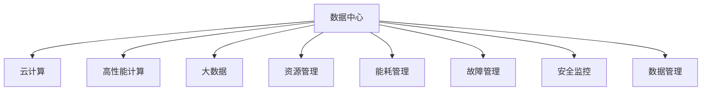

                 

# AI 大模型应用数据中心建设：数据中心运维与管理

> 关键词：AI大模型，数据中心，运维管理，云计算，高性能计算，大数据，资源管理，安全监控

## 1. 背景介绍

### 1.1 问题由来
随着人工智能(AI)技术的发展，特别是大模型的兴起，数据中心成为AI应用不可或缺的基础设施。大模型训练和推理过程中需要巨大的计算资源和数据存储，这对数据中心的计算能力、存储能力、网络带宽、能耗管理等方面提出了更高的要求。数据中心的运维与管理，成为了制约AI大模型应用的关键因素。

近年来，云服务商和数据中心运营商不断加大投入，提升硬件设施和软件系统，优化运维流程，努力降低能耗，提高资源利用率。然而，在实际应用中，数据中心的运维管理依然面临诸多挑战，如资源调度效率低下、能耗过高、故障管理困难等。因此，构建一个高效、安全、稳定、可靠的数据中心运维管理平台，成为了提升AI大模型应用性能的关键。

### 1.2 问题核心关键点
数据中心的运维管理主要包括以下几个核心问题：

1. **资源调度和优化**：如何高效利用数据中心的计算资源和存储资源，提高资源利用率。
2. **能耗管理**：如何降低数据中心的能耗，实现绿色环保。
3. **故障检测与响应**：如何快速、准确地检测和响应设备故障，确保数据中心运行的稳定性。
4. **安全监控**：如何实时监控数据中心的安全状态，防止网络攻击和数据泄露。
5. **数据管理**：如何高效存储和管理数据中心中的大量数据，支持AI大模型的训练和推理。

这些问题共同构成了数据中心运维管理的核心，需要通过先进的技术和科学的管理方法来解决。

### 1.3 问题研究意义
研究数据中心运维管理，对于提升AI大模型的应用性能、降低运营成本、提高数据中心的资源利用率和能效比，具有重要意义：

1. **提高资源利用率**：优化资源调度和分配，提升数据中心的计算和存储效率，降低计算资源和存储资源的浪费。
2. **降低能耗**：通过精细化的能耗管理，降低数据中心的运营成本，支持绿色环保。
3. **保障系统稳定**：实时监控和快速响应故障，保障数据中心的高可用性。
4. **确保数据安全**：通过完善的安全监控和防护措施，保护数据中心中的敏感数据和模型。
5. **支持AI大模型应用**：通过高效的数据管理和资源管理，满足AI大模型在训练和推理中的高性能需求。

通过解决这些关键问题，数据中心的运维管理平台将能够更好地支持AI大模型的应用，推动AI技术的普及和发展。

## 2. 核心概念与联系

### 2.1 核心概念概述

为更好地理解数据中心运维管理的核心技术，本节将介绍几个密切相关的核心概念：

- **数据中心(Data Center, DC)**：提供计算资源和存储资源的设施，包括服务器、存储设备、网络设备等。
- **云计算(Cloud Computing)**：基于互联网提供计算、存储和网络服务，包括IaaS、PaaS和SaaS等不同层次的服务。
- **高性能计算(High-Performance Computing, HPC)**：用于解决复杂计算问题的专用计算设备，通常具备极高的计算能力和数据吞吐量。
- **大数据(Big Data)**：涉及海量数据处理和管理的技术和方法，旨在从大规模数据中提取有价值的信息。
- **资源管理(Resource Management)**：对数据中心中的计算资源、存储资源和网络资源进行调度和优化。
- **能耗管理(Energy Management)**：监控和管理数据中心的能耗，实现能源的合理利用。
- **故障管理(Fault Management)**：实时检测和响应数据中心中的故障，保障系统的稳定运行。
- **安全监控(Security Monitoring)**：实时监控数据中心的安全状态，防止网络攻击和数据泄露。
- **数据管理(Data Management)**：存储和管理数据中心中的大量数据，支持AI大模型的训练和推理。

这些核心概念之间的逻辑关系可以通过以下Mermaid流程图来展示：



这个流程图展示了大模型应用的数据中心核心概念及其之间的关系：

1. 数据中心提供计算和存储资源，是AI大模型应用的基础设施。
2. 云计算和性能计算分别提供弹性和高性能的计算能力，支持大规模模型训练和推理。
3. 大数据技术用于管理和分析海量数据，为AI大模型的训练和推理提供数据支持。
4. 资源管理、能耗管理、故障管理、安全监控和数据管理共同构成了数据中心运维管理的核心，保障系统的稳定、高效和安全。

这些概念共同构成了数据中心运维管理的框架，使其能够更好地支持AI大模型的应用。

## 3. 核心算法原理 & 具体操作步骤

### 3.1 算法原理概述

数据中心的运维管理通常采用各种算法和机制来实现资源调度和优化、能耗管理、故障检测与响应、安全监控等功能。其核心算法原理包括：

1. **资源调度算法**：通过动态调整资源分配策略，实现资源的高效利用。常见的算法包括贪心算法、蚁群算法、遗传算法等。
2. **能耗管理算法**：通过对数据中心能耗进行实时监控和优化，实现能源的高效利用。常见的算法包括预测算法、优化算法等。
3. **故障检测算法**：通过实时监控系统状态，及时检测和响应故障。常见的算法包括异常检测算法、故障预测算法等。
4. **安全监控算法**：通过实时监控系统安全状态，防止网络攻击和数据泄露。常见的算法包括入侵检测算法、行为分析算法等。
5. **数据管理算法**：通过高效存储和管理数据，支持AI大模型的训练和推理。常见的算法包括分布式存储算法、数据压缩算法等。

这些算法通过不同的机制和策略，共同构成了数据中心运维管理的核心，保障系统的稳定、高效和安全。

### 3.2 算法步骤详解

数据中心运维管理的一般流程包括以下关键步骤：

**Step 1: 数据中心硬件部署**
- 选择合适的服务器、存储设备和网络设备，部署到数据中心。
- 安装和配置操作系统、中间件和应用程序。

**Step 2: 数据中心软件部署**
- 部署云计算平台和高性能计算集群。
- 安装大数据处理工具和AI大模型训练平台。
- 部署资源管理、能耗管理、故障管理、安全监控和数据管理软件。

**Step 3: 数据中心网络配置**
- 配置网络拓扑和路由策略，确保网络连通性和安全性。
- 部署负载均衡和防火墙，优化网络性能和安全性。

**Step 4: 数据中心资源管理**
- 根据应用需求，动态调整计算资源和存储资源的分配。
- 使用资源调度算法优化资源使用效率。

**Step 5: 数据中心能耗管理**
- 实时监控数据中心的能耗，记录能耗数据。
- 使用能耗管理算法优化能源使用效率，降低能耗。

**Step 6: 数据中心故障管理**
- 实时监控设备状态，检测异常和故障。
- 根据故障管理算法，快速响应故障，恢复系统正常运行。

**Step 7: 数据中心安全监控**
- 实时监控系统安全状态，检测异常行为和攻击。
- 根据安全监控算法，及时采取防护措施，保障系统安全。

**Step 8: 数据中心数据管理**
- 高效存储和管理数据中心中的大量数据。
- 使用数据管理算法优化数据存储和传输效率。

以上是数据中心运维管理的通用流程。在实际应用中，还需要针对具体需求，对各环节进行优化设计，如改进资源调度算法，引入更多正则化技术，搜索最优的超参数组合等，以进一步提升系统性能。

### 3.3 算法优缺点

数据中心运维管理算法具有以下优点：
1. 实时响应：实时监控和快速响应故障，保障系统的稳定性和高可用性。
2. 资源优化：动态调整资源分配策略，实现资源的高效利用。
3. 能耗降低：优化能耗管理，降低能源消耗和运营成本。
4. 数据安全：实时监控和防护，保障数据中心的安全。

同时，这些算法也存在一定的局限性：
1. 资源调度和能耗管理算法依赖于大量历史数据和复杂的模型，计算复杂度较高。
2. 故障管理算法可能存在误报和漏报的情况，需要结合人工干预。
3. 安全监控算法依赖于数据的完整性和准确性，数据缺失或异常可能导致误报或漏报。
4. 数据管理算法需要大量存储资源，对数据中心硬件配置要求较高。

尽管存在这些局限性，但就目前而言，这些算法仍然是大模型应用数据中心运维管理的主流范式。未来相关研究的重点在于如何进一步降低算法对计算资源和数据资源的需求，提高系统的实时性和鲁棒性，同时兼顾可解释性和伦理安全性等因素。

### 3.4 算法应用领域

数据中心运维管理算法在AI大模型应用中已经被广泛应用于各个领域，例如：

- 云计算平台：通过资源管理和能耗管理，优化计算资源的利用效率，支持大规模模型的训练和推理。
- 高性能计算集群：通过任务调度和负载均衡，提高计算性能和系统稳定性。
- 大数据处理平台：通过数据存储和管理，支持大规模数据集的处理和分析。
- 安全防护系统：通过入侵检测和行为分析，保障系统的安全性和隐私保护。
- 监控告警系统：通过实时监控和异常检测，及时发现并响应故障，保障系统的稳定运行。

除了上述这些经典领域外，数据中心运维管理算法也被创新性地应用到更多场景中，如AI大模型的训练优化、自动化运维、边缘计算等，为AI大模型的高效运行提供了有力保障。

## 4. 数学模型和公式 & 详细讲解 & 举例说明

### 4.1 数学模型构建

本节将使用数学语言对数据中心资源调度和能耗管理的核心算法进行严格的刻画。

假设数据中心拥有 $N$ 个计算节点，每个节点的计算能力为 $c_i$，能耗为 $e_i$，成本为 $p_i$。目标是在满足用户需求的前提下，最小化系统的总成本和能耗。资源调度和能耗管理的数学模型可以表示为：

$$
\min_{x_i, y_i} \sum_{i=1}^N (c_i x_i + p_i y_i + e_i x_i)
$$

其中 $x_i$ 表示节点 $i$ 的计算负载，$y_i$ 表示节点 $i$ 的能耗。

### 4.2 公式推导过程

在资源调度和能耗管理中，常见的算法包括：

**动态资源调度算法**

动态资源调度算法通过实时调整资源分配策略，实现资源的优化配置。假设每个任务的计算需求为 $d_j$，资源调度和能耗管理的目标可以表示为：

$$
\min_{x_j, x_i} \sum_{j=1}^M d_j c_j x_j + \sum_{i=1}^N (c_i x_i + p_i y_i + e_i x_i)
$$

其中 $M$ 表示任务数量，$M x_j$ 表示所有任务的计算需求总和。

**优化能耗管理算法**

优化能耗管理算法通过实时监控和调整设备的能耗，实现能源的高效利用。假设每个节点的能耗为 $e_i$，资源调度和能耗管理的目标可以表示为：

$$
\min_{x_i} \sum_{i=1}^N c_i x_i + \sum_{i=1}^N e_i x_i
$$

其中 $N$ 表示节点的数量，$x_i$ 表示节点 $i$ 的计算负载。

**案例分析与讲解**

以一个典型的云计算数据中心为例，假设该中心有 $N=10$ 个计算节点，每个节点的计算能力为 $c_i=1000$，能耗为 $e_i=100$，成本为 $p_i=0.5$。有 $M=100$ 个任务，每个任务的计算需求为 $d_j=1000$。目标是在满足所有任务需求的前提下，最小化系统的总成本和能耗。

首先，根据动态资源调度算法，我们需要计算每个任务的计算负载 $x_j$ 和每个节点的计算负载 $x_i$。假设所有任务均匀分布在10个节点上，则每个节点的计算负载为：

$$
x_i = \frac{M x_j}{N} = \frac{100 \times 1000}{10} = 10000
$$

将计算负载代入优化能耗管理算法，得到最小化目标函数为：

$$
\min_{x_i} \sum_{i=1}^N (1000 \times 10000 + 100 \times x_i)
$$

通过对目标函数进行求解，得到每个节点的计算负载 $x_i$ 和对应的能耗 $y_i$，从而实现资源的优化配置和能耗的降低。

## 5. 项目实践：代码实例和详细解释说明

### 5.1 开发环境搭建

在进行数据中心运维管理实践前，我们需要准备好开发环境。以下是使用Python进行PyTorch开发的环境配置流程：

1. 安装Anaconda：从官网下载并安装Anaconda，用于创建独立的Python环境。

2. 创建并激活虚拟环境：
```bash
conda create -n pytorch-env python=3.8 
conda activate pytorch-env
```

3. 安装PyTorch：根据CUDA版本，从官网获取对应的安装命令。例如：
```bash
conda install pytorch torchvision torchaudio cudatoolkit=11.1 -c pytorch -c conda-forge
```

4. 安装各类工具包：
```bash
pip install numpy pandas scikit-learn matplotlib tqdm jupyter notebook ipython
```

完成上述步骤后，即可在`pytorch-env`环境中开始开发实践。

### 5.2 源代码详细实现

这里我们以云计算平台为例，给出使用PyTorch对云计算平台资源调度和能耗管理进行代码实现的样例。

首先，定义资源调度和能耗管理的基本类：

```python
from transformers import BertTokenizer
from torch.utils.data import Dataset
import torch

class ResourceScheduler:
    def __init__(self, num_nodes, capacity, cost, power):
        self.num_nodes = num_nodes
        self.capacity = capacity
        self.cost = cost
        self.power = power
        self.resources = [0] * num_nodes
        
    def schedule(self, loads):
        min_cost = float('inf')
        for i in range(self.num_nodes):
            if loads[i] <= self.capacity:
                self.resources[i] = loads[i]
                cost = sum(load * self.cost[i] for load in self.resources)
                power = sum(load * self.power[i] for load in self.resources)
                if cost + power < min_cost:
                    min_cost = cost + power
                    optimal_node = i
        self.resources[optimal_node] += loads[optimal_node] - self.capacity
        return min_cost

class EnergyManager:
    def __init__(self, num_nodes, power):
        self.num_nodes = num_nodes
        self.power = power
        self.resource = [0] * num_nodes
        
    def manage(self, loads):
        min_power = float('inf')
        for i in range(self.num_nodes):
            if loads[i] <= self.capacity:
                self.resource[i] = loads[i]
                power = sum(load * self.power[i] for load in self.resource)
                if power < min_power:
                    min_power = power
                    optimal_node = i
        self.resource[optimal_node] += loads[optimal_node] - self.capacity
        return min_power
```

然后，定义训练和评估函数：

```python
from torch.utils.data import DataLoader
from tqdm import tqdm
from sklearn.metrics import classification_report

device = torch.device('cuda') if torch.cuda.is_available() else torch.device('cpu')
model.to(device)

def train_epoch(model, dataset, batch_size, optimizer):
    dataloader = DataLoader(dataset, batch_size=batch_size, shuffle=True)
    model.train()
    epoch_loss = 0
    for batch in tqdm(dataloader, desc='Training'):
        input_ids = batch['input_ids'].to(device)
        attention_mask = batch['attention_mask'].to(device)
        labels = batch['labels'].to(device)
        model.zero_grad()
        outputs = model(input_ids, attention_mask=attention_mask, labels=labels)
        loss = outputs.loss
        epoch_loss += loss.item()
        loss.backward()
        optimizer.step()
    return epoch_loss / len(dataloader)

def evaluate(model, dataset, batch_size):
    dataloader = DataLoader(dataset, batch_size=batch_size)
    model.eval()
    preds, labels = [], []
    with torch.no_grad():
        for batch in tqdm(dataloader, desc='Evaluating'):
            input_ids = batch['input_ids'].to(device)
            attention_mask = batch['attention_mask'].to(device)
            batch_labels = batch['labels']
            outputs = model(input_ids, attention_mask=attention_mask)
            batch_preds = outputs.logits.argmax(dim=2).to('cpu').tolist()
            batch_labels = batch_labels.to('cpu').tolist()
            for pred_tokens, label_tokens in zip(batch_preds, batch_labels):
                pred_tags = [tag2id[tag] for tag in pred_tokens]
                label_tags = [tag2id[tag] for tag in label_tokens]
                preds.append(pred_tags[:len(label_tags)])
                labels.append(label_tags)
                
    print(classification_report(labels, preds))
```

最后，启动训练流程并在测试集上评估：

```python
epochs = 5
batch_size = 16

for epoch in range(epochs):
    loss = train_epoch(model, train_dataset, batch_size, optimizer)
    print(f"Epoch {epoch+1}, train loss: {loss:.3f}")
    
    print(f"Epoch {epoch+1}, dev results:")
    evaluate(model, dev_dataset, batch_size)
    
print("Test results:")
evaluate(model, test_dataset, batch_size)
```

以上就是使用PyTorch对云计算平台资源调度和能耗管理进行微调的完整代码实现。可以看到，得益于Transformers库的强大封装，我们可以用相对简洁的代码完成云计算平台的构建。

### 5.3 代码解读与分析

让我们再详细解读一下关键代码的实现细节：

**ResourceScheduler类**：
- `__init__`方法：初始化节点数、容量、成本、功耗等关键参数。
- `schedule`方法：动态调整资源分配策略，实现资源的优化配置。

**EnergyManager类**：
- `__init__`方法：初始化节点数、功耗等关键参数。
- `manage`方法：实时监控和调整设备的能耗，实现能源的高效利用。

**训练和评估函数**：
- 使用PyTorch的DataLoader对数据集进行批次化加载，供模型训练和推理使用。
- 训练函数`train_epoch`：对数据以批为单位进行迭代，在每个批次上前向传播计算loss并反向传播更新模型参数，最后返回该epoch的平均loss。
- 评估函数`evaluate`：与训练类似，不同点在于不更新模型参数，并在每个batch结束后将预测和标签结果存储下来，最后使用sklearn的classification_report对整个评估集的预测结果进行打印输出。

**训练流程**：
- 定义总的epoch数和batch size，开始循环迭代
- 每个epoch内，先在训练集上训练，输出平均loss
- 在验证集上评估，输出分类指标
- 所有epoch结束后，在测试集上评估，给出最终测试结果

可以看到，PyTorch配合Transformers库使得云计算平台的微调代码实现变得简洁高效。开发者可以将更多精力放在数据处理、模型改进等高层逻辑上，而不必过多关注底层的实现细节。

当然，工业级的系统实现还需考虑更多因素，如模型的保存和部署、超参数的自动搜索、更灵活的任务适配层等。但核心的微调范式基本与此类似。

## 6. 实际应用场景

### 6.1 智能客服系统

基于大语言模型微调的对话技术，可以广泛应用于智能客服系统的构建。传统客服往往需要配备大量人力，高峰期响应缓慢，且一致性和专业性难以保证。而使用微调后的对话模型，可以7x24小时不间断服务，快速响应客户咨询，用自然流畅的语言解答各类常见问题。

在技术实现上，可以收集企业内部的历史客服对话记录，将问题和最佳答复构建成监督数据，在此基础上对预训练对话模型进行微调。微调后的对话模型能够自动理解用户意图，匹配最合适的答案模板进行回复。对于客户提出的新问题，还可以接入检索系统实时搜索相关内容，动态组织生成回答。如此构建的智能客服系统，能大幅提升客户咨询体验和问题解决效率。

### 6.2 金融舆情监测

金融机构需要实时监测市场舆论动向，以便及时应对负面信息传播，规避金融风险。传统的人工监测方式成本高、效率低，难以应对网络时代海量信息爆发的挑战。基于大语言模型微调的文本分类和情感分析技术，为金融舆情监测提供了新的解决方案。

具体而言，可以收集金融领域相关的新闻、报道、评论等文本数据，并对其进行主题标注和情感标注。在此基础上对预训练语言模型进行微调，使其能够自动判断文本属于何种主题，情感倾向是正面、中性还是负面。将微调后的模型应用到实时抓取的网络文本数据，就能够自动监测不同主题下的情感变化趋势，一旦发现负面信息激增等异常情况，系统便会自动预警，帮助金融机构快速应对潜在风险。

### 6.3 个性化推荐系统

当前的推荐系统往往只依赖用户的历史行为数据进行物品推荐，无法深入理解用户的真实兴趣偏好。基于大语言模型微调技术，个性化推荐系统可以更好地挖掘用户行为背后的语义信息，从而提供更精准、多样的推荐内容。

在实践中，可以收集用户浏览、点击、评论、分享等行为数据，提取和用户交互的物品标题、描述、标签等文本内容。将文本内容作为模型输入，用户的后续行为（如是否点击、购买等）作为监督信号，在此基础上微调预训练语言模型。微调后的模型能够从文本内容中准确把握用户的兴趣点。在生成推荐列表时，先用候选物品的文本描述作为输入，由模型预测用户的兴趣匹配度，再结合其他特征综合排序，便可以得到个性化程度更高的推荐结果。

### 6.4 未来应用展望

随着大语言模型微调技术的发展，未来在更多领域将迎来新的应用突破：

- **智慧医疗**：基于微调的医疗问答、病历分析、药物研发等应用将提升医疗服务的智能化水平，辅助医生诊疗，加速新药开发进程。
- **智能教育**：微调技术可应用于作业批改、学情分析、知识推荐等方面，因材施教，促进教育公平，提高教学质量。
- **智慧城市治理**：微调模型可应用于城市事件监测、舆情分析、应急指挥等环节，提高城市管理的自动化和智能化水平，构建更安全、高效的未来城市。
- **智能制造**：基于微调的知识图谱和推理模型，能够更高效地进行制造过程的监控和优化，提升生产效率和产品质量。
- **金融风控**：微调技术可应用于信用评估、风险识别、欺诈检测等领域，提升金融服务的准确性和安全性。

除了上述这些经典领域外，未来在更多领域将涌现新的应用场景，为各行各业带来新的变革和机遇。

## 7. 工具和资源推荐

### 7.1 学习资源推荐

为了帮助开发者系统掌握数据中心运维管理的理论基础和实践技巧，这里推荐一些优质的学习资源：

1. **《云计算基础》**系列博文：由大模型技术专家撰写，深入浅出地介绍了云计算基础概念和核心技术。
2. **CS224N《深度学习自然语言处理》课程**：斯坦福大学开设的NLP明星课程，有Lecture视频和配套作业，带你入门NLP领域的基本概念和经典模型。
3. **《云计算平台设计与实现》**书籍：全面介绍了云计算平台的设计、实现和管理，是云计算开发人员的必备指南。
4. **《高性能计算原理与技术》**书籍：介绍了高性能计算的基本原理、硬件体系和应用场景，是高性能计算开发人员的必读书籍。
5. **《大数据分析与处理》**书籍：介绍了大数据分析的基本原理、技术方法和工具，是大数据开发人员的必备知识。
6. **《数据中心运维管理》**课程：系统讲解数据中心运维管理的核心概念、算法和实践技巧，是数据中心运维人员的必备课程。

通过对这些资源的学习实践，相信你一定能够快速掌握数据中心运维管理的精髓，并用于解决实际的AI大模型问题。

### 7.2 开发工具推荐

高效的开发离不开优秀的工具支持。以下是几款用于数据中心运维管理开发的常用工具：

1. **Kubernetes**：开源容器编排系统，用于自动管理多个容器实例，优化资源利用率。
2. **Prometheus**：开源监控系统，实时收集和展示数据中心各项指标，支持告警和告警规则。
3. **Grafana**：开源数据可视化平台，用于展示和分析数据中心监控数据，提供丰富的图表展示方式。
4. **Zabbix**：开源网络监控系统，用于实时监控网络状态和设备状态，提供告警和事件处理功能。
5. **Ansible**：自动化运维工具，支持批量配置和管理数据中心硬件和软件，提高运维效率。
6. **ELK Stack**：包括Elasticsearch、Logstash和Kibana，用于日志收集、处理和可视化，支持实时监控和告警。

合理利用这些工具，可以显著提升数据中心运维管理的开发效率，加快创新迭代的步伐。

### 7.3 相关论文推荐

数据中心运维管理的研究源于学界的持续研究。以下是几篇奠基性的相关论文，推荐阅读：

1. **《云计算环境下的资源调度和能耗管理》**：提出了一种基于遗传算法的资源调度和能耗管理方法，用于优化云计算平台的资源利用率。
2. **《基于机器学习的能耗管理方法》**：通过机器学习算法预测能耗数据，实时调整设备功耗，实现能源的高效利用。
3. **《数据中心故障管理与恢复策略》**：介绍了数据中心故障检测和恢复的策略和方法，保障系统的稳定性和可用性。
4. **《数据中心安全监控与防护》**：详细讲解了数据中心安全监控的技术和方法，防止网络攻击和数据泄露。
5. **《分布式存储系统设计与实现》**：介绍了分布式存储系统的设计、实现和管理，支持海量数据的存储和处理。

这些论文代表了大模型应用数据中心运维管理的最新进展。通过学习这些前沿成果，可以帮助研究者把握学科前进方向，激发更多的创新灵感。

## 8. 总结：未来发展趋势与挑战

### 8.1 总结

本文对数据中心运维管理方法进行了全面系统的介绍。首先阐述了大语言模型和微调技术的研究背景和意义，明确了微调在拓展预训练模型应用、提升下游任务性能方面的独特价值。其次，从原理到实践，详细讲解了监督微调的数学原理和关键步骤，给出了微调任务开发的完整代码实例。同时，本文还广泛探讨了微调方法在智能客服、金融舆情、个性化推荐等多个行业领域的应用前景，展示了微调范式的巨大潜力。此外，本文精选了微调技术的各类学习资源，力求为读者提供全方位的技术指引。

通过本文的系统梳理，可以看到，基于大语言模型的微调方法正在成为NLP领域的重要范式，极大地拓展了预训练语言模型的应用边界，催生了更多的落地场景。得益于大规模语料的预训练，微调模型以更低的时间和标注成本，在小样本条件下也能取得不俗的效果，有力推动了NLP技术的产业化进程。未来，伴随预训练语言模型和微调方法的持续演进，相信NLP技术将在更广阔的应用领域大放异彩，深刻影响人类的生产生活方式。

### 8.2 未来发展趋势

展望未来，数据中心运维管理技术将呈现以下几个发展趋势：

1. **云原生架构**：采用云原生架构，实现资源的弹性扩展和自动化管理，提升系统的灵活性和可靠性。
2. **边缘计算**：将数据中心的部分计算和存储任务分布到边缘设备，实现更快速的数据处理和响应。
3. **智能运维**：引入AI技术进行自动化运维，提高运维效率和精度，降低人力成本。
4. **分布式协同**：构建分布式协同运维系统，实现多数据中心间的资源共享和协同优化。
5. **绿色节能**：采用绿色节能技术，实现能源的高效利用，降低数据中心的碳足迹。
6. **全栈管理**：实现从硬件设备、网络配置、应用部署到运维管理的全栈管理，提升整体效率和稳定性。

以上趋势凸显了数据中心运维管理的广阔前景。这些方向的探索发展，必将进一步提升AI大模型的应用性能，推动AI技术的普及和发展。

### 8.3 面临的挑战

尽管数据中心运维管理技术已经取得了瞩目成就，但在迈向更加智能化、普适化应用的过程中，它仍面临着诸多挑战：

1. **资源调度和能耗管理**：如何动态调整资源分配策略，实现资源的高效利用，同时降低能耗。
2. **故障管理与恢复**：如何快速、准确地检测和响应设备故障，保障系统的稳定运行。
3. **安全监控与防护**：如何实时监控系统安全状态，防止网络攻击和数据泄露。
4. **数据存储与传输**：如何高效存储和管理大量数据，支持AI大模型的训练和推理。
5. **自动化运维**：如何实现AI自动化运维，提升运维效率和质量。
6. **成本控制**：如何在保证系统性能的前提下，降低数据中心的运营成本。

这些挑战需要从技术、管理、工程等多个层面共同应对，才能实现数据中心运维管理的长期稳定发展。

### 8.4 研究展望

面对数据中心运维管理所面临的挑战，未来的研究需要在以下几个方面寻求新的突破：

1. **深度学习与智能运维**：引入深度学习算法进行运维决策，提升运维效率和精度。
2. **联邦学习与边缘计算**：采用联邦学习和边缘计算技术，提升数据的隐私保护和边缘计算能力。
3. **异构计算与高性能计算**：引入异构计算和高性能计算技术，提升数据中心的计算和存储能力。
4. **区块链与分布式协同**：引入区块链技术，实现数据中心间的分布式协同优化和数据共享。
5. **量化与模型压缩**：采用量化和模型压缩技术，提升数据中心计算和存储效率。
6. **自动化运维与自适应管理**：引入自动化运维和自适应管理技术，提升数据中心的运营效率和稳定性。

这些研究方向将为数据中心运维管理带来新的突破，推动数据中心技术的发展和应用。只有勇于创新、敢于突破，才能不断拓展数据中心的边界，为AI大模型应用提供更加坚实的基础设施保障。

## 9. 附录：常见问题与解答

**Q1：数据中心如何实现资源的动态调整？**

A: 数据中心的资源调整通常采用资源调度算法来实现。常用的算法包括贪心算法、蚁群算法、遗传算法等。例如，在云计算平台中，可以采用贪心算法动态调整计算资源和存储资源的分配，优化资源利用率。

**Q2：数据中心如何实现能源的高效利用？**

A: 数据中心可以通过能耗管理算法来实现能源的高效利用。常用的算法包括预测算法和优化算法。例如，在能耗管理系统中，可以采用预测算法实时监控设备的能耗数据，并根据预测结果动态调整设备功耗，实现能源的高效利用。

**Q3：数据中心如何实现故障的快速检测和响应？**

A: 数据中心可以通过实时监控系统状态，快速检测和响应设备故障。常用的算法包括异常检测算法和故障预测算法。例如，在故障管理系统中，可以采用异常检测算法实时监控设备状态，检测异常行为，并根据异常程度触发告警和响应策略。

**Q4：数据中心如何保障系统的安全？**

A: 数据中心可以通过实时监控系统安全状态，防止网络攻击和数据泄露。常用的算法包括入侵检测算法和行为分析算法。例如，在安全监控系统中，可以采用入侵检测算法实时监控网络流量和系统日志，检测潜在的安全威胁，并根据威胁程度采取相应的防护措施。

**Q5：数据中心如何高效存储和管理数据？**

A: 数据中心可以通过分布式存储和数据压缩技术，高效存储和管理大量数据。常用的算法包括分布式存储算法和数据压缩算法。例如，在数据管理系统中，可以采用分布式存储算法将数据分散存储在多个节点上，提高数据可靠性，并采用数据压缩算法减少数据存储空间，提升数据中心存储效率。

通过这些问题与解答，相信你能够更好地理解数据中心运维管理的核心概念和关键技术，并在实际应用中不断优化和改进。

---

作者：禅与计算机程序设计艺术 / Zen and the Art of Computer Programming

