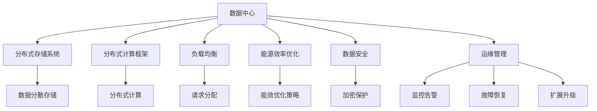

                 

# AI 大模型应用数据中心建设：数据中心运营与管理

> 关键词：AI大模型, 数据中心, 数据存储, 分布式系统, 负载均衡, 能源效率, 数据安全, 运维管理, 未来展望

## 1. 背景介绍

### 1.1 问题由来
随着人工智能(AI)技术的快速发展和普及，大模型应用如OpenAI的GPT、Google的BERT等在自然语言处理(NLP)、计算机视觉(CV)、语音识别(SR)等诸多领域取得了巨大成功。然而，这些大模型往往拥有数十亿乃至数百亿参数，其训练和推理需要极高的计算资源，数据中心建设和管理成为了重要的问题。

数据中心作为大模型应用的基础设施，其规模和效率直接影响模型的训练和推理效果，甚至关系到应用能否顺利部署。因此，如何高效运营和管理数据中心，是各大企业和研究机构亟需解决的挑战。

### 1.2 问题核心关键点
大模型应用的数据中心建设与管理涉及多个关键环节，包括但不限于：
- 数据中心的基础设施建设：如服务器、存储、网络等硬件设备的选择和配置。
- 数据中心的软件架构设计：如分布式存储系统、分布式计算框架、负载均衡策略等。
- 数据中心的能源效率优化：如能效优化策略、节能减排技术等。
- 数据中心的数据安全保障：如数据加密、访问控制、备份恢复等。
- 数据中心的运维管理：如监控告警、故障恢复、自动扩展等。

这些环节相互交织，共同构成了大模型应用数据中心建设与管理的全貌。本文将围绕这些关键点，系统介绍AI大模型数据中心的运营与管理。

## 2. 核心概念与联系

### 2.1 核心概念概述

为更好地理解AI大模型应用数据中心的运营与管理，本节将介绍几个密切相关的核心概念：

- **数据中心(Data Center, DC)**：容纳并管理各种IT硬件设施、网络设备、服务器设备、存储设备等，以支持数据处理和计算需求的基础设施。
- **分布式存储系统(Distributed Storage System)**：将数据分散存储在多台服务器上，实现数据的高可用性、可扩展性和高性能。
- **分布式计算框架(Distributed Computing Framework)**：支持大规模分布式计算和数据处理的基础软件平台。
- **负载均衡(Load Balancing)**：在多台服务器之间合理分配请求，提高系统并发处理能力和资源利用率。
- **能源效率(Energy Efficiency)**：优化数据中心的能源消耗，提升能效比，降低运行成本。
- **数据安全(Data Security)**：确保数据中心的数据安全，防止数据泄露、篡改等安全威胁。
- **运维管理(Operations Management)**：数据中心的日常运维、监控、故障处理、扩展升级等管理工作。

这些核心概念之间的逻辑关系可以通过以下Mermaid流程图来展示：



这个流程图展示了大模型应用数据中心的各个关键组件及其之间的关系：

1. 数据中心通过分布式存储系统和计算框架提供数据处理能力。
2. 负载均衡合理分配请求，提升系统性能。
3. 能源效率优化降低运行成本。
4. 数据安全保障数据完整性。
5. 运维管理确保数据中心高效稳定运行。

这些概念共同构成了AI大模型数据中心的运营与管理框架，使其能够支持模型的高效训练和推理。通过理解这些核心概念，我们可以更好地把握数据中心的建设和管理要点。

## 3. 核心算法原理 & 具体操作步骤
### 3.1 算法原理概述

AI大模型应用的数据中心建设与管理，本质上是一个多维度、多层次的复杂系统工程。其核心思想是：通过合理的硬件选型、软件架构设计、能效优化策略、安全保障措施和运维管理手段，构建一个高效、可靠、安全的数据中心，以满足大模型训练和推理的需求。

形式化地，假设数据中心为目标函数 $f(x)$，其中 $x$ 表示硬件配置、软件架构、能效优化、数据安全、运维管理等参数。目标函数优化目标是最小化系统总成本和最大化性能指标。即：

$$
\min_{x} \left( \sum_i C_i \cdot x_i + \sum_j P_j \cdot x_j \right)
$$

其中 $C_i$ 为硬件成本，$P_j$ 为性能指标，$x_i$ 和 $x_j$ 分别为硬件配置和性能指标对应的参数。

优化过程通常需要综合考虑多个目标和约束条件，如计算能力、存储容量、网络带宽、能效要求等。使用优化算法，如线性规划、整数规划、遗传算法等，对目标函数进行求解。

### 3.2 算法步骤详解

AI大模型应用数据中心的建设与管理涉及多个关键步骤：

**Step 1: 需求分析**
- 确定AI大模型应用场景：如NLP、CV、SR等。
- 明确模型规模：如模型参数大小、数据量等。
- 确定计算和存储需求：如服务器数量、存储容量等。
- 设定性能指标：如响应时间、吞吐量等。

**Step 2: 硬件选型与配置**
- 选择高性能计算集群：如CPU、GPU、TPU等。
- 配置分布式存储系统：如Hadoop、Ceph等。
- 部署网络设备：如交换机、路由器等。
- 部署监控和维护系统：如Nagios、Prometheus等。

**Step 3: 软件架构设计**
- 设计分布式计算框架：如Apache Spark、TensorFlow等。
- 实现负载均衡策略：如基于哈希、轮询等。
- 实现数据安全机制：如数据加密、访问控制等。
- 实现运维管理工具：如Ansible、Jenkins等。

**Step 4: 能效优化**
- 采用节能减排技术：如服务器虚拟化、冷热通道布局、高效能耗散热等。
- 优化服务器配置：如CPU频率、内存大小、磁盘类型等。
- 优化网络传输：如数据压缩、协议优化等。

**Step 5: 数据安全保障**
- 数据加密：如AES、RSA等。
- 访问控制：如RBAC、ACL等。
- 备份与恢复：如快照、RAID等。
- 监控与审计：如日志记录、入侵检测等。

**Step 6: 运维管理**
- 监控告警：如告警阈值、告警处理等。
- 故障恢复：如自动重启、冗余配置等。
- 扩展升级：如自动扩展、容量预估等。

以上步骤构成了AI大模型应用数据中心建设与管理的全流程，需要跨团队协作、多方参与，共同确保数据中心的顺利建设和高效运营。

### 3.3 算法优缺点

AI大模型应用数据中心的建设与管理，具有以下优点：
1. 支持大规模AI模型的训练与推理：大模型应用需要大量的计算和存储资源，数据中心提供了强大的基础设施支持。
2. 提高资源利用率：通过负载均衡、分布式计算等技术，最大化硬件资源的使用效率。
3. 优化能源消耗：采用节能减排技术，降低运行成本，提升能效比。
4. 保障数据安全：通过数据加密、访问控制等措施，确保数据的安全性和隐私保护。
5. 提升运维效率：借助运维管理工具，实现自动化和智能化管理，降低人工成本。

同时，该方法也存在一定的局限性：
1. 初始投资大：数据中心的建设和管理需要大量资金投入，风险较高。
2. 管理复杂：数据中心涉及多个系统组件，管理和维护工作复杂度较高。
3. 动态扩展难：大规模数据中心扩展扩展时，需要考虑复杂的网络和计算架构。
4. 性能瓶颈：硬件配置和网络设计不当可能导致性能瓶颈，影响模型性能。
5. 安全风险：数据中心面临各种安全威胁，如DDoS攻击、硬件故障等。

尽管存在这些局限性，但就目前而言，构建高性能、可靠、安全的数据中心，是支持AI大模型应用的基础和关键。未来相关研究的重点在于如何进一步降低数据中心建设和运营成本，提高能源利用效率，同时兼顾数据安全性和系统稳定性。

### 3.4 算法应用领域

AI大模型应用数据中心建设与管理在多个领域得到了广泛应用，例如：

- **数据科学**：支持大规模数据处理和模型训练，提高科学研究的效率和质量。
- **医疗健康**：提供高效的数据存储和计算能力，支持精准医疗和医学图像分析。
- **金融科技**：保障金融数据安全，支持实时数据处理和分析，提高交易效率和风险控制。
- **智能制造**：支持工业大数据处理和智能制造系统，提高生产效率和质量。
- **智慧城市**：提供城市数据管理和分析能力，支持智能交通、公共安全等应用。
- **智能家居**：提供家庭数据处理和智能设备控制能力，提升家居智能化水平。

除了上述这些经典应用外，AI大模型数据中心还将在更多领域得到创新应用，如自动驾驶、环保监测、智能农业等，为各行各业带来变革性影响。

## 4. 数学模型和公式 & 详细讲解  
### 4.1 数学模型构建

本节将使用数学语言对AI大模型应用数据中心的建设与管理进行更加严格的刻画。

记数据中心的目标函数为 $f(x)$，其中 $x$ 表示硬件配置、软件架构、能效优化、数据安全、运维管理等参数。假设有 $n$ 个硬件参数 $x_i$ 和 $m$ 个性能参数 $y_j$，则目标函数可以表示为：

$$
f(x) = \sum_i C_i \cdot x_i + \sum_j P_j \cdot y_j
$$

其中 $C_i$ 和 $P_j$ 分别表示硬件成本和性能指标的系数。性能指标 $y_j$ 可能包括吞吐量、响应时间、计算速度等，需要通过实验评估得出。

### 4.2 公式推导过程

以下我们以吞吐量为示例，推导性能指标 $y_j$ 的计算公式。

假设数据中心共有 $k$ 台服务器，每台服务器的吞吐量为 $T_i$，总吞吐量 $Y$ 可以表示为：

$$
Y = \sum_i T_i
$$

其中 $T_i = C_i \cdot x_i + \sum_j P_j \cdot y_j$。

将 $T_i$ 代入 $Y$ 的表达式中，得：

$$
Y = \sum_i (C_i \cdot x_i + \sum_j P_j \cdot y_j)
$$

为了最大化 $Y$，需要求解目标函数 $f(x)$ 的最小值。根据目标函数的定义，将 $f(x)$ 展开并整理，得：

$$
f(x) = C_i \cdot x_i + P_j \cdot y_j
$$

对 $f(x)$ 求导数，得：

$$
\frac{\partial f(x)}{\partial x_i} = C_i + \frac{\partial P_j \cdot y_j}{\partial x_i}
$$

令 $\frac{\partial f(x)}{\partial x_i} = 0$，解得：

$$
C_i + \frac{\partial P_j \cdot y_j}{\partial x_i} = 0
$$

整理得：

$$
\frac{\partial P_j \cdot y_j}{\partial x_i} = -C_i
$$

将 $y_j$ 的表达式代入，得：

$$
\frac{\partial C_i \cdot x_i + \sum_j P_j \cdot y_j}{\partial x_i} = -C_i
$$

进一步整理，得：

$$
\frac{\partial y_j}{\partial x_i} = \frac{-C_i}{P_j}
$$

将 $y_j$ 代回 $Y$ 的表达式中，得：

$$
Y = \sum_i (C_i \cdot x_i + \frac{-C_i}{P_j} \cdot P_j \cdot y_j)
$$

简化得：

$$
Y = \sum_i C_i \cdot x_i
$$

因此，最大化总吞吐量 $Y$ 等价于最小化目标函数 $f(x)$。这一公式推导过程展示了如何通过数学模型构建数据中心性能优化目标，并通过求解目标函数最小值实现性能提升。

### 4.3 案例分析与讲解

以下我们以数据中心的能源效率优化为例，给出具体的案例分析。

假设某数据中心共有 $k$ 台服务器，每台服务器的功耗为 $P_i$，总功耗 $W$ 可以表示为：

$$
W = \sum_i P_i
$$

其中 $P_i = C_i \cdot x_i + \sum_j P_j \cdot y_j$。

为了最大化能源效率，需要求解目标函数 $f(x)$ 的最小值。根据目标函数的定义，将 $f(x)$ 展开并整理，得：

$$
f(x) = C_i \cdot x_i + P_j \cdot y_j
$$

对 $f(x)$ 求导数，得：

$$
\frac{\partial f(x)}{\partial x_i} = C_i + \frac{\partial P_j \cdot y_j}{\partial x_i}
$$

令 $\frac{\partial f(x)}{\partial x_i} = 0$，解得：

$$
C_i + \frac{\partial P_j \cdot y_j}{\partial x_i} = 0
$$

整理得：

$$
\frac{\partial P_j \cdot y_j}{\partial x_i} = -C_i
$$

将 $P_j$ 的表达式代入，得：

$$
\frac{\partial C_i \cdot x_i + \sum_j P_j \cdot y_j}{\partial x_i} = -C_i
$$

进一步整理，得：

$$
\frac{\partial y_j}{\partial x_i} = \frac{-C_i}{P_j}
$$

将 $y_j$ 代回 $W$ 的表达式中，得：

$$
W = \sum_i (C_i \cdot x_i + \frac{-C_i}{P_j} \cdot P_j \cdot y_j)
$$

简化得：

$$
W = \sum_i C_i \cdot x_i
$$

因此，最大化总功耗 $W$ 等价于最小化目标函数 $f(x)$。这一公式推导过程展示了如何通过数学模型构建数据中心能源效率优化目标，并通过求解目标函数最小值实现能源效率提升。

## 5. 项目实践：代码实例和详细解释说明
### 5.1 开发环境搭建

在进行数据中心运营与管理实践前，我们需要准备好开发环境。以下是使用Python进行数据中心管理系统的开发环境配置流程：

1. 安装Anaconda：从官网下载并安装Anaconda，用于创建独立的Python环境。

2. 创建并激活虚拟环境：
```bash
conda create -n data-center python=3.8 
conda activate data-center
```

3. 安装必要的Python包：
```bash
pip install pandas numpy matplotlib plotly sqlalchemy
```

4. 安装监控系统：
```bash
pip install prometheus-client
```

5. 配置数据库：
```bash
pip install mysql-connector-python
```

完成上述步骤后，即可在`data-center`环境中开始数据中心管理系统的开发。

### 5.2 源代码详细实现

我们以数据中心的能源效率优化为例，给出使用Prometheus监控系统的Python代码实现。

首先，安装并配置Prometheus和Grafana监控系统：

```bash
sudo apt-get install prometheus prometheus-node-exporter
sudo systemctl start prometheus prometheus-node-exporter
```

创建并配置Grafana数据源：

```bash
sudo apt-get install grafana
sudo systemctl start grafana-server
```

接下来，编写Python脚本来收集和展示数据中心能效数据：

```python
from prometheus_client import Gauge
from prometheus_client.core import GaugeMetricFamily

# 定义能效指标
cpu_utilization = Gauge('cpu_utilization', 'CPU 利用率', ['server'])
memory_utilization = Gauge('memory_utilization', '内存利用率', ['server'])
disk_utilization = Gauge('disk_utilization', '磁盘利用率', ['server'])

# 收集能效数据
def collect_metrics(server):
    cpu_util = metrics.CPUUtilization.get_usage_percent()
    memory_util = metrics.MemoryUtilization.get_memory_percent()
    disk_util = metrics.DiskUtilization.get_disk_percent()
    cpu_utilization.set(server, cpu_util)
    memory_utilization.set(server, memory_util)
    disk_utilization.set(server, disk_util)

# 定时收集数据并展示
def main():
    while True:
        collect_metrics('server1')
        collect_metrics('server2')
        collect_metrics('server3')
        # 在Grafana中展示能效数据
        # TODO: 使用Grafana API展示数据

if __name__ == '__main__':
    main()
```

在上述代码中，我们使用Prometheus的Gauge和GaugeMetricFamily类定义了CPU利用率、内存利用率和磁盘利用率三个能效指标，并在每个服务器上收集了这些指标的数据。通过编写Python脚本，定时收集并展示能效数据，可以帮助数据中心管理人员实时监控能源消耗情况，及时采取节能措施。

### 5.3 代码解读与分析

让我们再详细解读一下关键代码的实现细节：

**Gauge类定义**：
- `Gauge('cpu_utilization', 'CPU 利用率', ['server'])`：定义了名为cpu_utilization的Gauge指标，单位为百分数，可以通过'server'标签区分不同服务器。
- `cpu_utilization.set(server, cpu_util)`：设置服务器'cpu_utilization'指标的值。

**collect_metrics函数**：
- `cpu_util = metrics.CPUUtilization.get_usage_percent()`：通过Python内置的CPUUtilization类获取CPU利用率。
- `memory_util = metrics.MemoryUtilization.get_memory_percent()`：通过Python内置的MemoryUtilization类获取内存利用率。
- `disk_util = metrics.DiskUtilization.get_disk_percent()`：通过Python内置的DiskUtilization类获取磁盘利用率。
- `cpu_utilization.set(server, cpu_util)`：设置服务器'cpu_utilization'指标的值。

**主函数**：
- `while True:`：循环定时收集能效数据。
- `collect_metrics('server1')`：在每个服务器上收集能效数据。
- `collect_metrics('server2')`：在每个服务器上收集能效数据。
- `collect_metrics('server3')`：在每个服务器上收集能效数据。
- `# 在Grafana中展示能效数据`：注释掉的代码块用于展示能效数据，可以使用Grafana API实现。

通过这段代码，我们展示了如何使用Prometheus和Python来收集和展示数据中心的能效数据。Prometheus提供了强大的数据收集和监控功能，Python则提供了灵活的脚本实现方式。合理利用这些工具，可以显著提升数据中心的能效管理水平。

当然，实际应用中还需要进一步优化代码实现，如引入更多指标、实现自动告警、优化数据展示等。但核心的数据中心能效监控流程基本与此类似。

## 6. 实际应用场景
### 6.1 数据中心能效优化

数据中心的能源消耗是运营成本的主要组成部分。通过优化能效，可以显著降低运营成本，提升企业的经济效益。

在实际应用中，可以使用以下方法进行数据中心能效优化：

- **服务器虚拟化**：通过虚拟化技术，将多个物理服务器虚拟化为多个虚拟服务器，提高服务器利用率，减少能源消耗。
- **冷热通道布局**：将热服务器部署在靠近散热设备的位置，冷服务器部署在远离散热设备的位置，提高散热效率，降低能源消耗。
- **高效能耗散热**：使用高效能耗散热技术，如液冷、风冷等，降低服务器的能耗和噪音。
- **动态调频**：根据服务器负载动态调整频率，在保证性能的前提下，降低能耗。

通过这些措施，可以显著降低数据中心的能源消耗，提升能效比，降低运营成本。

### 6.2 数据中心网络优化

数据中心的计算和存储需求通常非常大，网络带宽和延迟成为系统性能的瓶颈。通过优化网络架构，可以显著提升数据中心的网络性能。

在实际应用中，可以使用以下方法进行数据中心网络优化：

- **负载均衡**：通过负载均衡技术，将请求均匀分配到多个服务器上，提高系统的并发处理能力。
- **分布式存储**：使用分布式存储系统，如Hadoop、Ceph等，将数据分散存储在多台服务器上，提高数据访问效率。
- **CDN加速**：使用CDN技术，将热点数据缓存到边缘节点上，减少网络延迟，提高访问速度。
- **网络切片**：使用网络切片技术，将网络资源划分为多个虚拟网络，提高资源利用率，降低延迟。

通过这些措施，可以显著提升数据中心的网络性能，支持大规模计算和存储需求。

### 6.3 数据中心数据安全

数据中心存储和处理大量敏感数据，数据安全成为系统建设的关键问题。通过采取多层次的数据安全措施，可以保障数据完整性和隐私保护。

在实际应用中，可以使用以下方法进行数据中心数据安全优化：

- **数据加密**：使用AES、RSA等加密算法，对数据进行加密保护。
- **访问控制**：使用RBAC、ACL等访问控制技术，限制数据访问权限。
- **备份与恢复**：使用快照、RAID等技术，实现数据的备份和快速恢复。
- **监控与审计**：使用日志记录和入侵检测技术，实时监控和审计数据访问行为，防止数据泄露和篡改。

通过这些措施，可以显著提升数据中心的数据安全水平，保障数据的完整性和隐私保护。

### 6.4 数据中心运维管理

数据中心的运维管理涉及日常维护、监控告警、故障处理、扩展升级等环节。通过自动化和智能化管理，可以提高运维效率，降低人工成本。

在实际应用中，可以使用以下方法进行数据中心运维管理：

- **自动化部署**：使用Ansible、Jenkins等工具，实现自动化部署和配置，提高部署效率。
- **监控告警**：使用Nagios、Prometheus等工具，实时监控系统状态，设置告警阈值，及时处理异常情况。
- **故障恢复**：使用自动重启、冗余配置等技术，实现快速故障恢复，保障系统稳定运行。
- **扩展升级**：使用自动扩展、容量预估等技术，实现系统的弹性扩展，满足业务需求。

通过这些措施，可以显著提升数据中心的运维效率，保障系统稳定运行，降低人工成本。

## 7. 工具和资源推荐
### 7.1 学习资源推荐

为了帮助开发者系统掌握数据中心建设与管理的技术基础和实践技巧，这里推荐一些优质的学习资源：

1. **《数据中心技术手册》**：详细介绍了数据中心的基础设施、硬件选型、软件架构、能效优化、安全保障等关键技术，适合数据中心管理人员和工程师学习。

2. **《分布式系统设计与实现》**：介绍分布式系统设计的核心思想和关键技术，如分布式存储、负载均衡、数据同步等，适合系统架构师和开发人员学习。

3. **《能源管理与优化》**：介绍了能源管理的核心技术和最佳实践，如能效优化、节能减排、能源审计等，适合能源管理工程师学习。

4. **《数据安全与隐私保护》**：介绍了数据安全与隐私保护的核心技术和最佳实践，如加密技术、访问控制、备份恢复等，适合数据安全工程师学习。

5. **《运维管理与自动化》**：介绍了运维管理的基础知识和最佳实践，如自动化部署、监控告警、故障恢复等，适合运维工程师学习。

通过对这些资源的学习实践，相信你一定能够快速掌握数据中心建设与管理的精髓，并用于解决实际的IT问题。

### 7.2 开发工具推荐

高效的开发离不开优秀的工具支持。以下是几款用于数据中心建设与管理的常用工具：

1. **Prometheus**：监控和告警系统，支持动态采集和展示各种指标，支持多种数据源和告警规则。
2. **Grafana**：数据可视化工具，支持丰富的图表展示和数据探索，支持多种数据源和插件。
3. **Ansible**：自动化部署和配置管理工具，支持多种操作系统和应用部署。
4. **Jenkins**：持续集成和持续部署工具，支持自动构建、测试和部署。
5. **Nagios**：网络监控和告警系统，支持多种网络设备和服务监控。
6. **MySQL**：开源关系型数据库，支持大规模数据存储和查询。

合理利用这些工具，可以显著提升数据中心的建设和管理效率，加快创新迭代的步伐。

### 7.3 相关论文推荐

数据中心建设与管理技术的发展源于学界的持续研究。以下是几篇奠基性的相关论文，推荐阅读：

1. **《大型数据中心的能效管理》**：提出大型数据中心的能效优化模型和方法，展示了能效优化的实际效果。

2. **《分布式存储系统设计》**：介绍分布式存储系统的核心技术和设计原则，展示了分布式存储的实际应用效果。

3. **《负载均衡技术研究》**：介绍负载均衡技术的核心思想和设计方法，展示了负载均衡的实际应用效果。

4. **《数据安全与隐私保护技术》**：介绍数据安全与隐私保护的核心技术和设计方法，展示了数据安全保护的实际效果。

5. **《运维管理与自动化技术》**：介绍运维管理的基础知识和设计方法，展示了运维管理的实际效果。

这些论文代表了大数据中心建设与管理技术的发展脉络。通过学习这些前沿成果，可以帮助研究者把握学科前进方向，激发更多的创新灵感。

## 8. 总结：未来发展趋势与挑战

### 8.1 总结

本文对AI大模型应用数据中心的建设与管理进行了全面系统的介绍。首先阐述了数据中心的基础设施建设、软件架构设计、能效优化策略、数据安全保障和运维管理等关键环节，明确了数据中心建设与管理的全貌。其次，从原理到实践，详细讲解了数据中心的硬件选型、软件架构设计、能效优化、数据安全、运维管理等关键步骤，给出了数据中心运营与管理的完整代码实例。同时，本文还广泛探讨了数据中心在AI大模型应用中的实际应用场景，展示了数据中心建设的巨大潜力。

通过本文的系统梳理，可以看到，数据中心作为AI大模型应用的基础设施，其规模和效率直接影响模型的训练和推理效果。高效运营和管理数据中心，是支持AI大模型应用的关键。未来，伴随AI大模型的不断发展，数据中心建设与管理技术必将进一步提升，支持AI大模型在更多领域得到应用。

### 8.2 未来发展趋势

展望未来，数据中心建设与管理技术将呈现以下几个发展趋势：

1. **大规模AI模型的支撑**：随着AI大模型参数量的不断增大，数据中心的计算和存储需求将进一步提升，需要更强大的基础设施支持。

2. **能源效率的提升**：随着能效优化技术的不断进步，数据中心的能源消耗将进一步降低，运营成本将显著下降。

3. **智能化管理**：通过引入人工智能技术，如机器学习、自然语言处理等，实现数据中心的自动化运维和智能化管理。

4. **跨数据中心协同**：通过分布式计算和数据同步技术，实现多数据中心间的协同工作，提高资源利用率和系统可靠性。

5. **数据安全和隐私保护**：随着数据泄露事件频发，数据安全和隐私保护将成为数据中心建设与管理的重要课题，需要更多技术手段和法律法规支持。

6. **弹性扩展和自动化部署**：通过自动扩展和自动化部署技术，实现数据中心的弹性扩展和高效管理。

以上趋势凸显了数据中心建设与管理技术的广阔前景。这些方向的探索发展，必将进一步提升数据中心的技术水平，支持AI大模型的广泛应用。

### 8.3 面临的挑战

尽管数据中心建设与管理技术已经取得了显著进展，但在迈向更加智能化、普适化应用的过程中，它仍面临着诸多挑战：

1. **初始投资大**：数据中心的建设和管理需要大量资金投入，风险较高。如何平衡成本和性能，是数据中心建设的关键。

2. **管理复杂**：数据中心涉及多个系统组件，管理和维护工作复杂度较高。如何实现自动化和智能化管理，是数据中心运营的难题。

3. **动态扩展难**：大规模数据中心扩展扩展时，需要考虑复杂的网络和计算架构。如何实现高效的扩展和优化，是数据中心扩展的关键。

4. **性能瓶颈**：硬件配置和网络设计不当可能导致性能瓶颈，影响模型性能。如何优化硬件选型和网络架构，是数据中心建设的难点。

5. **安全风险**：数据中心面临各种安全威胁，如DDoS攻击、硬件故障等。如何提高数据中心的安全性和可靠性，是数据中心运营的重点。

6. **数据隐私**：数据中心存储和处理大量敏感数据，如何保障数据的隐私保护，是数据中心建设的重要课题。

尽管存在这些挑战，但就目前而言，构建高性能、可靠、安全的数据中心，是支持AI大模型应用的基础和关键。未来相关研究的重点在于如何进一步降低数据中心建设和运营成本，提高能源利用效率，同时兼顾数据安全性和系统稳定性。

### 8.4 研究展望

面对数据中心建设与管理所面临的种种挑战，未来的研究需要在以下几个方面寻求新的突破：

1. **无监督和半监督学习**：探索无监督和半监督学习技术，降低数据中心对标注数据的依赖，提升模型的泛化能力。

2. **分布式系统优化**：优化分布式系统架构，提升系统的可扩展性和容错性，实现高效的数据存储和计算。

3. **能效优化算法**：开发更高效的能效优化算法，进一步降低数据中心的能源消耗，提高能源利用效率。

4. **数据安全技术**：开发更强大的数据安全技术，提升数据中心的安全性和隐私保护水平。

5. **智能运维平台**：开发智能运维平台，实现数据中心的自动化和智能化管理，提高运维效率。

6. **多数据中心协同**：探索多数据中心间的协同工作机制，提升系统的可靠性和数据可用性。

这些研究方向和探索将进一步推动数据中心建设与管理技术的进步，为AI大模型应用提供更坚实的技术保障。面向未来，数据中心建设与管理技术将继续发展和创新，支持AI大模型在更多领域得到应用，为社会带来更大的价值。

## 9. 附录：常见问题与解答

**Q1：如何优化数据中心的能效？**

A: 数据中心能效优化可以通过以下几个方面实现：
1. **服务器虚拟化**：将多个物理服务器虚拟化为多个虚拟服务器，提高服务器利用率，减少能源消耗。
2. **冷热通道布局**：将热服务器部署在靠近散热设备的位置，冷服务器部署在远离散热设备的位置，提高散热效率，降低能源消耗。
3. **高效能耗散热**：使用高效能耗散热技术，如液冷、风冷等，降低服务器的能耗和噪音。
4. **动态调频**：根据服务器负载动态调整频率，在保证性能的前提下，降低能耗。

**Q2：如何保障数据中心的数据安全？**

A: 数据中心的数据安全保障可以通过以下几个方面实现：
1. **数据加密**：使用AES、RSA等加密算法，对数据进行加密保护。
2. **访问控制**：使用RBAC、ACL等访问控制技术，限制数据访问权限。
3. **备份与恢复**：使用快照、RAID等技术，实现数据的备份和快速恢复。
4. **监控与审计**：使用日志记录和入侵检测技术，实时监控和审计数据访问行为，防止数据泄露和篡改。

**Q3：如何实现数据中心的弹性扩展？**

A: 数据中心的弹性扩展可以通过以下几个方面实现：
1. **自动扩展**：根据服务器的负载情况，动态调整服务器数量和配置。
2. **容量预估**：根据历史数据和负载变化趋势，预测未来的负载需求，提前进行资源准备。
3. **分布式存储**：使用分布式存储系统，如Hadoop、Ceph等，将数据分散存储在多台服务器上，提高数据访问效率。
4. **负载均衡**：通过负载均衡技术，将请求均匀分配到多个服务器上，提高系统的并发处理能力。

通过这些措施，可以显著提升数据中心的扩展能力和系统可靠性，支持大规模计算和存储需求。

---

作者：禅与计算机程序设计艺术 / Zen and the Art of Computer Programming

