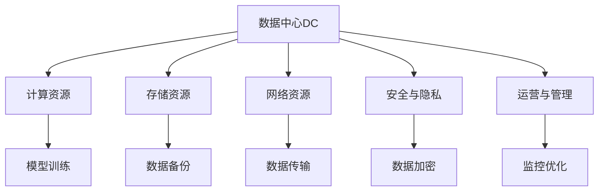

                 

# AI 大模型应用数据中心建设：数据中心运营与管理

## 1. 背景介绍

在人工智能(AI)领域，数据中心已成为支撑AI大模型训练、推理和应用的关键基础设施。随着深度学习、自然语言处理、计算机视觉等技术的发展，AI大模型应用对数据中心的计算、存储和网络需求不断提升。AI大模型的训练通常需要高并发、高吞吐、低延迟的计算资源，而推理则需要高效的模型加载、优化和推理加速。因此，构建高效、稳定、安全的数据中心运营与管理环境，成为AI大模型应用成功的关键。

本文章将系统介绍AI大模型应用数据中心的建设思路、运营与管理策略，以期为AI大模型的落地应用提供全面的技术指引。

## 2. 核心概念与联系

### 2.1 核心概念概述

为更好地理解AI大模型应用数据中心的运营与管理，本节将介绍几个密切相关的核心概念：

- **数据中心（DC）**：以计算、存储、网络等基础设施为基础，提供高效、可靠、安全的计算服务。
- **计算资源**：指数据中心提供的主机、虚拟机、GPU、TPU等计算资源，用于模型的训练和推理。
- **存储资源**：指数据中心提供的硬盘、SSD、网络存储等数据存储资源，用于数据的备份、复制和持久化。
- **网络资源**：指数据中心提供的高速网络资源，用于数据传输、模型通信和分布式训练。
- **安全与隐私**：指数据中心为保障数据和模型安全、保护用户隐私而采取的一系列措施，包括物理安全、网络安全、数据加密等。
- **运营与管理**：指数据中心的日常维护、监控、优化和升级，确保资源的有效利用和系统的稳定运行。

这些核心概念之间的逻辑关系可以通过以下Mermaid流程图来展示：



这个流程图展示了几大核心概念之间的关系：

1. 数据中心提供计算、存储、网络等基础设施。
2. 计算资源用于模型训练和推理，是AI大模型应用的核心。
3. 存储资源用于数据的备份、复制和持久化，保障数据安全。
4. 网络资源用于数据传输、模型通信和分布式训练，确保系统高效运行。
5. 安全与隐私保护是AI大模型应用的重中之重，涉及物理、网络、数据等多层面。
6. 运营与管理是保障数据中心资源有效利用和系统稳定运行的关键。

## 3. 核心算法原理 & 具体操作步骤
### 3.1 算法原理概述

AI大模型应用数据中心的运营与管理，主要遵循以下算法原理：

- **负载均衡**：将计算任务合理分配到各计算节点，保障系统高并发、高吞吐的性能。
- **分布式训练**：通过多台计算节点的协同计算，提升训练效率和模型精度。
- **模型优化**：对模型进行剪枝、量化、蒸馏等优化，提升推理速度和资源利用率。
- **网络优化**：优化网络通信协议，提升数据传输和模型通信的效率。
- **安全机制**：采用多层次的安全措施，保障数据和模型的机密性、完整性和可用性。
- **监控与调优**：实时监控系统性能，及时发现问题并进行调优，保障系统稳定运行。

### 3.2 算法步骤详解

基于上述算法原理，AI大模型应用数据中心的运营与管理主要分为以下几个步骤：

**Step 1: 基础设施部署**

1. **计算资源部署**：根据模型需求选择合适的计算资源，如CPU、GPU、TPU等，部署到数据中心。
2. **存储资源部署**：选择合适的存储设备，如硬盘、SSD、网络存储等，配置数据备份和冗余机制。
3. **网络资源部署**：搭建高速网络，配置负载均衡器、反向代理等设备，确保数据传输和模型通信的高效性。

**Step 2: 环境配置与优化**

1. **操作系统配置**：安装和配置操作系统，确保其稳定性和兼容性。
2. **软件环境配置**：安装和配置深度学习框架、AI大模型等软件环境，确保其版本和依赖库的兼容性。
3. **性能优化**：对计算资源、存储资源、网络资源进行调优，提升整体性能。

**Step 3: 安全与隐私保护**

1. **物理安全**：部署安全监控设备，确保数据中心物理环境的安全性。
2. **网络安全**：配置防火墙、入侵检测系统等网络安全设备，防止网络攻击。
3. **数据加密**：对数据传输和存储进行加密，确保数据机密性。
4. **访问控制**：设置严格的用户权限管理，确保数据和模型的访问安全。

**Step 4: 模型训练与推理**

1. **模型训练**：选择合适的模型和训练算法，配置合适的超参数，进行分布式训练。
2. **模型优化**：对模型进行剪枝、量化、蒸馏等优化，提升推理速度和资源利用率。
3. **模型推理**：配置推理环境，进行高效的模型加载和推理，提升应用响应速度。

**Step 5: 运营与管理**

1. **监控与调优**：实时监控系统性能，及时发现问题并进行调优，保障系统稳定运行。
2. **故障处理**：设置告警机制，快速定位和处理系统故障，确保服务连续性。
3. **升级与维护**：定期对计算资源、存储资源、网络资源进行升级和维护，保障系统可靠性。

### 3.3 算法优缺点

AI大模型应用数据中心的运营与管理方法具有以下优点：

- **高性能**：通过负载均衡、分布式训练等技术，保障系统高并发、高吞吐的性能。
- **高效能**：通过模型优化、网络优化等技术，提升训练和推理效率，降低资源消耗。
- **高安全**：通过多层次的安全措施，保障数据和模型的机密性、完整性和可用性。
- **高可靠**：通过监控与调优、故障处理等技术，确保系统的稳定性和可靠性。

同时，该方法也存在一定的局限性：

- **高成本**：初始基础设施建设和运营维护成本较高。
- **复杂性**：涉及计算、存储、网络、安全等多个层面，系统复杂度较高。
- **技术门槛高**：需要具备深厚的系统运维和优化能力，非专业人士难以有效管理。
- **灵活性不足**：部分优化手段难以在不影响用户体验的前提下实现，如数据加密、访问控制等。

尽管存在这些局限性，但就目前而言，AI大模型应用数据中心的运营与管理方法仍是最主流范式。未来相关研究的重点在于如何进一步降低成本、简化技术、提升灵活性，同时兼顾性能和安全性等因素。

### 3.4 算法应用领域

AI大模型应用数据中心的运营与管理方法，在AI大模型训练、推理和应用场景中得到了广泛的应用，涵盖如下几个主要领域：

- **深度学习训练**：在图像、语音、自然语言处理等深度学习任务中，通过分布式训练和优化技术，提升训练效率和模型精度。
- **自然语言处理推理**：在大规模语言模型训练和推理中，通过网络优化、安全机制等技术，确保系统高效和安全运行。
- **计算机视觉分析**：在图像和视频处理中，通过计算资源优化、存储资源配置等技术，保障系统高效稳定。
- **智能推荐系统**：在个性化推荐、广告投放等场景中，通过模型优化、网络优化等技术，提升推荐效果和用户体验。
- **智能客服系统**：在智能客服、聊天机器人等场景中，通过分布式训练、安全机制等技术，提升系统响应速度和用户体验。

## 4. 数学模型和公式 & 详细讲解 & 举例说明

### 4.1 数学模型构建

本节将使用数学语言对AI大模型应用数据中心的运营与管理过程进行更加严格的刻画。

设数据中心提供的计算资源数量为 $C$，存储资源数量为 $S$，网络资源数量为 $N$，安全与隐私保护强度为 $P$，运营与管理效能为 $E$。假设AI大模型应用对计算资源的需求为 $C_{model}$，存储资源需求为 $S_{model}$，网络资源需求为 $N_{model}$。

定义数据中心的总体效能 $E_{total}$ 为计算效能、存储效能、网络效能、安全效能、管理效能的综合指标，可表示为：

$$
E_{total} = C \cdot C_{model} + S \cdot S_{model} + N \cdot N_{model} + P + E
$$

其中，计算效能 $E_{compute}$、存储效能 $E_{storage}$、网络效能 $E_{network}$、安全效能 $E_{security}$、管理效能 $E_{management}$ 分别表示各资源和技术的效能。

### 4.2 公式推导过程

以下我们以计算效能的提升为例，推导计算资源优化的方法。

设数据中心的计算资源为 $C$ 台服务器，每台服务器的计算能力为 $c$，AI大模型训练任务所需的计算量为 $T$，计算任务在 $k$ 台服务器上并行计算，则计算效能 $E_{compute}$ 可表示为：

$$
E_{compute} = C \cdot \frac{T}{k \cdot c}
$$

其中，$C$ 表示计算资源数量，$k$ 表示并行计算任务的服务器数量，$c$ 表示每台服务器的计算能力，$T$ 表示计算任务所需的总计算量。

为提升计算效能，需要最大化并行计算任务的数量 $k$ 和每台服务器的计算能力 $c$。具体而言，可采取以下措施：

1. **增加计算资源**：通过增加计算资源，提升整体计算效能。
2. **优化并行计算**：通过优化并行计算算法，提高并行计算效率。
3. **提高计算能力**：通过升级计算资源硬件，提升每台服务器的计算能力。

### 4.3 案例分析与讲解

以下我们以图像识别任务为例，展示AI大模型在数据中心的应用。

设数据中心的计算资源为 $C$ 台服务器，每台服务器的计算能力为 $c$，存储资源为 $S$ 块硬盘，每块硬盘的存储容量为 $s$，网络资源为 $N$ 个高速网络通道，每个通道的带宽为 $n$。AI大模型训练任务所需的计算量为 $T$，存储需求为 $D$，网络传输需求为 $W$。

假设模型在 $k$ 台服务器上并行计算，每台服务器分摊的计算量为 $\frac{T}{k}$，存储资源和网络资源分别被 $n$ 个任务共享。则计算效能 $E_{compute}$、存储效能 $E_{storage}$、网络效能 $E_{network}$ 可分别表示为：

$$
E_{compute} = C \cdot \frac{T}{k \cdot c}
$$

$$
E_{storage} = S \cdot \frac{D}{n}
$$

$$
E_{network} = N \cdot \frac{W}{n}
$$

为了优化数据中心效能，需要综合考虑计算资源、存储资源、网络资源的优化，确保系统高效、稳定、安全地运行。

## 5. 项目实践：代码实例和详细解释说明
### 5.1 开发环境搭建

在进行AI大模型应用数据中心的开发实践前，我们需要准备好开发环境。以下是使用Python进行TensorFlow开发的环境配置流程：

1. 安装Anaconda：从官网下载并安装Anaconda，用于创建独立的Python环境。

2. 创建并激活虚拟环境：
```bash
conda create -n tf-env python=3.8 
conda activate tf-env
```

3. 安装TensorFlow：根据CUDA版本，从官网获取对应的安装命令。例如：
```bash
conda install tensorflow tensorflow-gpu -c conda-forge
```

4. 安装各类工具包：
```bash
pip install numpy pandas scikit-learn matplotlib tqdm jupyter notebook ipython
```

完成上述步骤后，即可在`tf-env`环境中开始开发实践。

### 5.2 源代码详细实现

下面我们以图像识别任务为例，给出使用TensorFlow对AI大模型进行训练和推理的PyTorch代码实现。

首先，定义图像识别任务的数据处理函数：

```python
import tensorflow as tf
from tensorflow.keras.preprocessing.image import ImageDataGenerator
from tensorflow.keras.utils import to_categorical

def load_data(path, batch_size):
    train_datagen = ImageDataGenerator(rescale=1./255, shear_range=0.2, zoom_range=0.2, horizontal_flip=True)
    test_datagen = ImageDataGenerator(rescale=1./255)
    
    train_generator = train_datagen.flow_from_directory(
        path + '/train',
        target_size=(224, 224),
        batch_size=batch_size,
        class_mode='categorical'
    )
    
    test_generator = test_datagen.flow_from_directory(
        path + '/test',
        target_size=(224, 224),
        batch_size=batch_size,
        class_mode='categorical'
    )
    
    return train_generator, test_generator
```

然后，定义模型和优化器：

```python
from tensorflow.keras import Sequential
from tensorflow.keras.layers import Conv2D, MaxPooling2D, Flatten, Dense

model = Sequential([
    Conv2D(32, (3, 3), activation='relu', input_shape=(224, 224, 3)),
    MaxPooling2D((2, 2)),
    Conv2D(64, (3, 3), activation='relu'),
    MaxPooling2D((2, 2)),
    Flatten(),
    Dense(64, activation='relu'),
    Dense(10, activation='softmax')
])

optimizer = tf.keras.optimizers.Adam(lr=0.001)
```

接着，定义训练和评估函数：

```python
from tensorflow.keras.utils import to_categorical

def train_epoch(model, dataset, batch_size, optimizer):
    model.compile(optimizer=optimizer, loss='categorical_crossentropy', metrics=['accuracy'])
    
    train_generator, test_generator = load_data('path/to/data', batch_size)
    
    model.fit(train_generator, epochs=10, validation_data=test_generator)
    
def evaluate(model, dataset, batch_size):
    model.evaluate(test_generator)
```

最后，启动训练流程并在测试集上评估：

```python
epochs = 10
batch_size = 32

for epoch in range(epochs):
    train_epoch(model, train_dataset, batch_size, optimizer)
    
    print(f"Epoch {epoch+1}, test accuracy: {evaluate(model, test_dataset, batch_size)}")
```

以上就是使用TensorFlow对AI大模型进行图像识别任务训练和推理的完整代码实现。可以看到，得益于TensorFlow的强大封装，我们可以用相对简洁的代码完成模型的训练和推理。

### 5.3 代码解读与分析

让我们再详细解读一下关键代码的实现细节：

**load_data函数**：
- 定义了图像数据生成器的参数，如数据增强、批处理大小等。
- 使用ImageDataGenerator从指定路径加载训练和测试数据集，并对其进行预处理，如归一化、数据增强等。
- 返回生成器对象，供模型进行训练和推理。

**model定义**：
- 定义了一个包含卷积、池化、全连接等层的神经网络模型，用于图像分类任务。
- 设置Adam优化器和交叉熵损失函数，用于模型训练。

**train_epoch函数**：
- 编译模型，指定优化器、损失函数和评估指标。
- 使用load_data函数加载训练和测试数据集。
- 使用fit方法进行模型训练，指定训练轮数和验证数据集。

**evaluate函数**：
- 使用evaluate方法在测试集上评估模型性能，返回模型在测试集上的准确率。

**训练流程**：
- 定义总的epoch数和batch size，开始循环迭代
- 每个epoch内，在训练集上训练，并在验证集上评估模型性能
- 所有epoch结束后，在测试集上评估模型性能

可以看到，TensorFlow为深度学习模型的开发提供了全面的工具支持，使得AI大模型在数据中心的开发实践变得更加便捷高效。

当然，工业级的系统实现还需考虑更多因素，如模型的保存和部署、超参数的自动搜索、更灵活的任务适配层等。但核心的训练与推理范式基本与此类似。

## 6. 实际应用场景
### 6.1 智能客服系统

基于AI大模型的智能客服系统，已经在多个企业内部部署，取得了显著的效果。智能客服系统通过自然语言处理技术，能够理解用户的意图和情感，自动生成回复，显著提升了客户体验和满意度。

在技术实现上，可以收集企业内部的历史客服对话记录，将问题和最佳答复构建成监督数据，在此基础上对预训练语言模型进行微调。微调后的语言模型能够自动理解用户意图，匹配最合适的答案模板进行回复。对于客户提出的新问题，还可以接入检索系统实时搜索相关内容，动态组织生成回答。如此构建的智能客服系统，能大幅提升客户咨询体验和问题解决效率。

### 6.2 金融舆情监测

金融机构需要实时监测市场舆论动向，以便及时应对负面信息传播，规避金融风险。传统的人工监测方式成本高、效率低，难以应对网络时代海量信息爆发的挑战。基于AI大模型的文本分类和情感分析技术，为金融舆情监测提供了新的解决方案。

具体而言，可以收集金融领域相关的新闻、报道、评论等文本数据，并对其进行主题标注和情感标注。在此基础上对预训练语言模型进行微调，使其能够自动判断文本属于何种主题，情感倾向是正面、中性还是负面。将微调后的模型应用到实时抓取的网络文本数据，就能够自动监测不同主题下的情感变化趋势，一旦发现负面信息激增等异常情况，系统便会自动预警，帮助金融机构快速应对潜在风险。

### 6.3 个性化推荐系统

当前的推荐系统往往只依赖用户的历史行为数据进行物品推荐，无法深入理解用户的真实兴趣偏好。基于AI大模型的个性化推荐系统，可以更好地挖掘用户行为背后的语义信息，从而提供更精准、多样的推荐内容。

在实践中，可以收集用户浏览、点击、评论、分享等行为数据，提取和用户交互的物品标题、描述、标签等文本内容。将文本内容作为模型输入，用户的后续行为（如是否点击、购买等）作为监督信号，在此基础上微调预训练语言模型。微调后的模型能够从文本内容中准确把握用户的兴趣点。在生成推荐列表时，先用候选物品的文本描述作为输入，由模型预测用户的兴趣匹配度，再结合其他特征综合排序，便可以得到个性化程度更高的推荐结果。

### 6.4 未来应用展望

随着AI大模型的不断发展，基于AI大模型的数据中心运营与管理技术也将迎来新的突破。未来，AI大模型将在更多领域得到应用，为传统行业带来变革性影响。

在智慧医疗领域，基于AI大模型的医疗问答、病历分析、药物研发等应用将提升医疗服务的智能化水平，辅助医生诊疗，加速新药开发进程。

在智能教育领域，AI大模型可应用于作业批改、学情分析、知识推荐等方面，因材施教，促进教育公平，提高教学质量。

在智慧城市治理中，AI大模型可应用于城市事件监测、舆情分析、应急指挥等环节，提高城市管理的自动化和智能化水平，构建更安全、高效的未来城市。

此外，在企业生产、社会治理、文娱传媒等众多领域，基于AI大模型的智能应用也将不断涌现，为经济社会发展注入新的动力。相信随着技术的日益成熟，AI大模型数据中心的运营与管理技术还将进一步发展，为构建智能社会提供坚实的技术保障。

## 7. 工具和资源推荐
### 7.1 学习资源推荐

为了帮助开发者系统掌握AI大模型应用数据中心的运营与管理技术，这里推荐一些优质的学习资源：

1. **TensorFlow官方文档**：详细介绍了TensorFlow的各个组件和API，是学习和开发TensorFlow项目的重要资源。

2. **TensorFlow Tutorials**：提供了丰富的TensorFlow教程和示例，涵盖深度学习、计算机视觉、自然语言处理等多个领域。

3. **Keras官方文档**：Keras是一个高级神经网络API，可以与TensorFlow无缝集成，快速实现深度学习模型。

4. **PyTorch官方文档**：PyTorch是另一个流行的深度学习框架，提供了动态计算图、高效GPU加速等功能。

5. **Coursera深度学习课程**：由斯坦福大学Andrew Ng教授主讲的深度学习课程，涵盖深度学习基础和实践。

6. **Deep Learning with PyTorch and TorchVision**：一本详细介绍如何使用PyTorch进行深度学习的书籍，包括模型构建、训练和推理等环节。

通过对这些资源的学习实践，相信你一定能够快速掌握AI大模型应用数据中心的运营与管理技术，并用于解决实际的AI大模型问题。

### 7.2 开发工具推荐

高效的开发离不开优秀的工具支持。以下是几款用于AI大模型应用数据中心开发的常用工具：

1. **TensorFlow**：由Google主导开发的深度学习框架，生产部署方便，适合大规模工程应用。

2. **Keras**：一个高层次的神经网络API，可以快速实现深度学习模型，适合初学者和快速原型开发。

3. **PyTorch**：一个灵活的深度学习框架，支持动态计算图，适合研究和原型开发。

4. **Jupyter Notebook**：一个交互式的开发环境，支持Python、R、Scala等多种语言，适合数据分析、模型训练和可视化。

5. **Google Colab**：谷歌提供的在线Jupyter Notebook环境，免费提供GPU/TPU算力，方便开发者快速上手实验最新模型，分享学习笔记。

合理利用这些工具，可以显著提升AI大模型应用数据中心的开发效率，加快创新迭代的步伐。

### 7.3 相关论文推荐

AI大模型应用数据中心的运营与管理技术的发展源于学界的持续研究。以下是几篇奠基性的相关论文，推荐阅读：

1. **Deep Learning with TensorFlow**：TensorFlow官方团队撰写的深度学习实践书籍，涵盖TensorFlow的使用方法和经典案例。

2. **Keras: Deep Learning for Humans**：Keras的官方指南，介绍了Keras的使用方法和深度学习实践。

3. **Training and generalization performance of deep learning networks**：深入探讨了深度学习网络的训练和泛化性能，是深度学习研究的经典文献。

4. **Large-scale image recognition using deep neural networks**：介绍了一种在大规模图像识别任务中使用深度神经网络的方法，展示了深度学习的强大潜力。

5. **Deep learning for natural language processing**：详细介绍了深度学习在自然语言处理中的应用，包括语言模型、机器翻译、情感分析等多个领域。

这些论文代表了大模型应用数据中心的运营与管理技术的发展脉络。通过学习这些前沿成果，可以帮助研究者把握学科前进方向，激发更多的创新灵感。

## 8. 总结：未来发展趋势与挑战
### 8.1 研究成果总结

本文对AI大模型应用数据中心的建设思路、运营与管理策略进行了全面系统的介绍。首先阐述了AI大模型应用数据中心的背景和重要性，明确了数据中心在AI大模型训练、推理和应用中的关键作用。其次，从算法原理和操作步骤，详细讲解了AI大模型应用数据中心的运营与管理方法，包括负载均衡、分布式训练、模型优化、网络优化、安全与隐私保护、监控与调优等关键环节。同时，本文还通过代码实例和案例分析，展示了AI大模型在图像识别、智能客服、金融舆情监测、个性化推荐系统等实际场景中的应用。

通过本文的系统梳理，可以看到，AI大模型应用数据中心建设是实现AI大模型成功落地应用的重要保障。合理构建和运营数据中心，可以确保AI大模型的高性能、高安全、高可靠和高效能，为用户带来优质的AI体验。

### 8.2 未来发展趋势

展望未来，AI大模型应用数据中心的建设和管理将呈现以下几个发展趋势：

1. **边缘计算**：将部分计算任务从中心数据中心迁移到边缘计算节点，提升数据处理和推理的速度和效率。

2. **自动化运维**：通过AI自动化运维技术，实时监控和优化数据中心的性能，减少人工干预，提升运营效率。

3. **云原生架构**：采用云原生架构，实现资源的高效调度、弹性伸缩和动态扩展，提升系统的灵活性和可扩展性。

4. **多模态融合**：将图像、语音、文本等多种模态数据进行融合，构建多模态的AI大模型，提升系统的智能化水平。

5. **安全与隐私保护**：采用更加严格的安全与隐私保护措施，如联邦学习、差分隐私等技术，确保数据和模型的安全。

6. **低成本高效能**：通过硬件优化、算法优化等技术手段，实现低成本高效能的AI大模型应用。

### 8.3 面临的挑战

尽管AI大模型应用数据中心的建设和管理已经取得了不少成果，但在迈向更加智能化、普适化应用的过程中，它仍面临着诸多挑战：

1. **成本高**：建设和管理AI大模型应用数据中心需要投入大量的资金和人力资源，成本较高。

2. **资源密集**：AI大模型应用对计算、存储、网络等资源的需求较高，数据中心的硬件配置要求高。

3. **技术复杂**：AI大模型应用数据中心的建设和管理涉及多个技术领域，系统复杂度高。

4. **安全风险**：数据中心的物理和网络安全面临多重威胁，需要采取多种措施确保数据和模型的安全。

5. **性能优化**：如何平衡模型的精度和效率，优化模型的推理速度和资源利用率，是一个重要的研究方向。

6. **跨领域融合**：如何将AI大模型与其他技术进行有效融合，如知识图谱、因果推理、强化学习等，是未来研究的重要方向。

### 8.4 研究展望

面对AI大模型应用数据中心建设和管理所面临的挑战，未来的研究需要在以下几个方面寻求新的突破：

1. **硬件优化**：研究高效能的计算硬件和存储硬件，提升系统的计算和存储能力。

2. **算法优化**：研究高效的模型压缩、量化、蒸馏等技术，提升模型的推理速度和资源利用率。

3. **系统优化**：研究多层次的安全机制、自动化运维、云原生架构等技术，提升系统的稳定性和可扩展性。

4. **跨领域融合**：研究AI大模型与其他技术进行有效融合的方法，如知识图谱、因果推理、强化学习等，提升系统的智能化水平。

5. **隐私保护**：研究差分隐私、联邦学习等技术，确保数据和模型的隐私保护。

6. **应用场景拓展**：研究AI大模型在更多场景中的应用，如医疗、教育、城市治理等，提升系统的普适性。

这些研究方向的探索，必将引领AI大模型应用数据中心建设技术迈向更高的台阶，为构建智能社会提供坚实的技术保障。面向未来，AI大模型应用数据中心的建设与管理技术还需要与其他人工智能技术进行更深入的融合，多路径协同发力，共同推动人工智能技术在垂直行业的规模化落地。只有勇于创新、敢于突破，才能不断拓展AI大模型的边界，让智能技术更好地造福人类社会。

## 9. 附录：常见问题与解答
### Q1：AI大模型应用数据中心是否适用于所有AI应用场景？

A: AI大模型应用数据中心在许多AI应用场景中都有广泛的应用，尤其是那些需要大规模计算和存储资源的场景。但是，对于一些轻量级的AI应用场景，如简单的数据处理、模型训练等，使用数据中心可能显得过于复杂和昂贵。此时可以考虑使用云计算平台或者直接在本地部署，以降低成本和复杂度。

### Q2：AI大模型应用数据中心如何确保高效能？

A: AI大模型应用数据中心的高效能主要通过以下几种手段实现：

1. **负载均衡**：通过分布式计算和任务调度，确保计算资源得到充分利用，避免资源浪费。

2. **分布式训练**：使用多台计算节点并行计算，提升训练速度和效率。

3. **模型优化**：对模型进行剪枝、量化、蒸馏等优化，减少计算量和内存占用，提升推理速度。

4. **网络优化**：优化网络通信协议，减少数据传输延迟，提升数据传输和模型通信的效率。

5. **硬件优化**：使用高效的计算硬件和存储硬件，提升系统的计算和存储能力。

6. **软件优化**：使用高效的深度学习框架和算法，提升模型的训练和推理效率。

### Q3：AI大模型应用数据中心如何确保安全性？

A: AI大模型应用数据中心的安全性主要通过以下几种手段实现：

1. **物理安全**：部署安全监控设备，确保数据中心物理环境的安全性。

2. **网络安全**：配置防火墙、入侵检测系统等网络安全设备，防止网络攻击。

3. **数据加密**：对数据传输和存储进行加密，确保数据机密性。

4. **访问控制**：设置严格的用户权限管理，确保数据和模型的访问安全。

5. **安全审计**：定期进行安全审计和风险评估，发现和修复安全漏洞。

6. **备份与恢复**：建立数据备份和恢复机制，防止数据丢失和损坏。

### Q4：AI大模型应用数据中心如何确保高可靠性和可用性？

A: AI大模型应用数据中心的高可靠性和可用性主要通过以下几种手段实现：

1. **监控与告警**：实时监控系统性能，设置告警机制，及时发现和处理系统故障。

2. **故障处理**：建立快速故障处理机制，快速定位和解决系统问题，确保系统连续性。

3. **负载均衡**：通过负载均衡技术，保障系统高并发、高吞吐的性能。

4. **冗余与备份**：采用冗余和备份机制，确保数据和系统的可靠性。

5. **自动化运维**：通过AI自动化运维技术，实时监控和优化数据中心的性能，减少人工干预，提升运营效率。

6. **弹性伸缩**：根据业务需求和系统负载，动态调整资源配置，平衡服务质量和成本。

### Q5：AI大模型应用数据中心的维护和管理难度大吗？

A: 确实，AI大模型应用数据中心的维护和管理需要较高的技术门槛和专业技能。数据中心涉及计算、存储、网络、安全等多个层面，系统复杂度高。但是，随着AI自动化运维技术的不断发展和普及，数据中心的维护和管理难度正在逐渐降低。通过自动化运维工具和系统监控平台，可以大大降低人工干预的频率，提升系统的运营效率和稳定性。

---

作者：禅与计算机程序设计艺术 / Zen and the Art of Computer Programming

