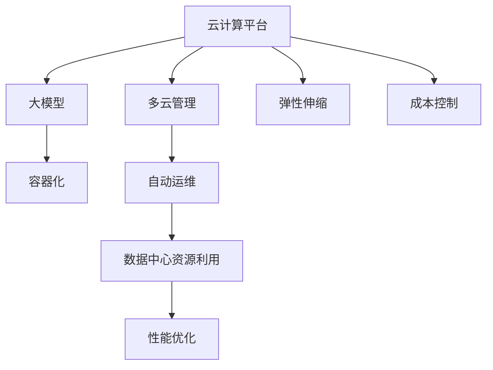

                 

## 1. 背景介绍

随着人工智能大模型在各行业的广泛应用，数据中心承载着越来越重要的计算任务，同时面临资源利用率低、管理复杂度高、成本控制难等诸多挑战。为解决这些问题，本文将介绍一种基于云计算平台的多云管理策略，通过高效调度、资源优化和自动化运维等手段，最大化大模型应用的资源利用效率，降低成本，提升性能。

## 2. 核心概念与联系

### 2.1 核心概念概述

为了更好地理解AI大模型应用数据中心的多云管理策略，本节将介绍几个密切相关的核心概念：

- **云计算平台(Cloud Computing Platform)**：如AWS、Azure、Google Cloud等，提供弹性计算资源、存储服务、网络设施等基础设施，支持用户构建和管理云上应用。
- **多云管理(Multicloud Management)**：指在多个云计算平台之间协调资源分配、应用部署、数据传输等管理任务，实现云资源的灵活迁移和最大化利用。
- **大模型(AI Large Model)**：如BERT、GPT等预训练语言模型，具有大规模参数量和广泛通用性，能处理各种自然语言处理任务。
- **容器化(Containerization)**：通过Docker等技术将大模型封装为容器，实现应用的快速部署、扩展和迁移。
- **自动运维(Automatic Operations)**：使用自动化工具实现云资源调度和应用监控，减少人工干预，提升系统稳定性和可靠性。

这些核心概念之间的逻辑关系可以通过以下Mermaid流程图来展示：



这个流程图展示了大模型应用数据中心的多云管理关键概念及其之间的关系：

1. 大模型通过云计算平台提供的基础设施进行部署和训练。
2. 云计算平台通过多云管理策略，协调不同云资源的使用，实现资源优化和灵活迁移。
3. 容器化技术将大模型封装为容器，方便其在不同云平台间迁移和部署。
4. 自动运维工具支持资源调度、监控和故障处理，提升系统稳定性和自动化程度。
5. 弹性伸缩和成本控制技术帮助数据中心应对流量波动，降低资源浪费和运营成本。
6. 性能优化手段提升大模型训练和推理的速度和效率，减少延迟。

## 3. 核心算法原理 & 具体操作步骤

### 3.1 算法原理概述

AI大模型应用数据中心的多云管理策略主要基于资源优化和调度算法，通过分析云平台性能和资源利用率，动态分配和调整资源，实现最大化利用和成本控制。核心算法原理包括以下几个步骤：

1. **资源评估**：通过监控工具实时收集云平台性能数据，评估当前资源利用率和可用性。
2. **任务调度**：根据任务优先级、资源需求和可用性，动态调度任务到最优的云平台节点。
3. **资源调整**：根据资源需求和利用率，动态调整云平台资源配置，实现弹性伸缩。
4. **成本控制**：通过按需购买和预付费方式，控制资源消耗和成本支出。
5. **性能优化**：通过网络优化、缓存机制和负载均衡等手段，提升大模型应用的性能。

### 3.2 算法步骤详解

基于上述原理，多云管理策略通常包含以下关键步骤：

**Step 1: 资源收集和监控**
- 使用云监控工具，如AWS CloudWatch、Azure Monitor等，实时收集云平台各项性能指标，如CPU使用率、内存使用率、网络带宽等。
- 分析云平台性能数据，评估资源利用率和可用性，识别瓶颈和优化点。

**Step 2: 任务调度和优化**
- 根据任务优先级、资源需求和云平台资源利用率，使用调度算法分配任务到最优的云平台节点。
- 考虑网络延迟和带宽限制，选择合适的跨云节点进行数据传输。
- 使用任务队列和负载均衡技术，平滑任务提交和执行，避免资源争抢和性能瓶颈。

**Step 3: 资源调整和弹性伸缩**
- 根据任务执行情况和资源利用率，动态调整云平台资源配置，实现弹性伸缩。
- 使用Auto Scaling服务，根据实际需求自动调整节点数量和类型。
- 设置资源警报，在资源利用率过高或过低时自动触发调整策略。

**Step 4: 成本控制和预算管理**
- 根据资源使用情况，采用按需购买和预付费方式，控制成本支出。
- 使用预算管理工具，如AWS Budgets、Azure Cost Management等，监控和控制支出。
- 定期分析成本报告，识别成本浪费和优化点，改进资源利用效率。

**Step 5: 性能优化和数据传输**
- 使用网络优化技术，如BGP路由、负载均衡和缓存机制，减少网络延迟和带宽消耗。
- 选择合适的数据传输协议和格式，优化数据传输效率。
- 使用分布式缓存和负载均衡技术，提升数据访问速度和可靠性。

### 3.3 算法优缺点

基于云计算平台的多云管理策略具有以下优点：

1. **灵活性高**：能够灵活调度和管理多个云平台资源，应对流量波动和需求变化。
2. **资源利用率高**：通过动态调整资源配置，实现弹性伸缩，最大化资源利用效率。
3. **成本控制有效**：通过按需购买和预算管理，有效控制资源消耗和成本支出。
4. **自动化程度高**：通过自动化运维工具，减少人工干预，提升系统稳定性和可靠性。

同时，该策略也存在一定的局限性：

1. **复杂度高**：多云管理策略需要考虑多个云平台间的资源协调和数据迁移，管理复杂度较高。
2. **网络延迟高**：跨云节点数据传输可能带来较高的网络延迟和带宽消耗。
3. **安全风险高**：数据在不同云平台间迁移可能存在安全风险，需要采取适当的安全措施。
4. **技术门槛高**：实现高效的多云管理策略需要掌握云平台、调度算法、网络优化等多方面的技术。

尽管存在这些局限性，但就目前而言，基于云计算平台的多云管理策略仍然是AI大模型应用数据中心的主流范式。未来相关研究的重点在于如何进一步降低多云管理的复杂度，提高跨云数据传输的效率和安全性，同时兼顾性能和成本的控制。

### 3.4 算法应用领域

基于云计算平台的多云管理策略，在AI大模型应用的数据中心管理中具有广泛的应用场景，例如：

- **云计算服务提供商**：通过管理多个云平台资源，提升服务质量和客户满意度。
- **科研机构**：通过弹性伸缩和成本控制，降低科研成本，提升计算效率。
- **企业级应用**：通过多云管理策略，实现应用的灵活迁移和优化部署。
- **政府机构**：通过多云管理技术，提升数据安全和政策合规性。

除了上述这些经典应用外，多云管理策略还被创新性地应用到更多场景中，如智能边缘计算、混合云服务、异构计算等，为AI大模型的应用提供了更灵活的资源支持。随着云平台技术的不断进步和多云管理策略的持续演进，相信AI大模型应用的数据中心管理将更加高效、稳定和可靠。

## 4. 数学模型和公式 & 详细讲解 & 举例说明

### 4.1 数学模型构建

本节将使用数学语言对AI大模型应用数据中心的多云管理策略进行更加严格的刻画。

记云计算平台为 $C=\{c_i\}_{i=1}^n$，其中 $c_i$ 表示第 $i$ 个云平台节点，具有资源 $R_i=(CPU_i, Memory_i, Disk_i)$。设大模型应用的任务集合为 $T=\{t_j\}_{j=1}^m$，其中 $t_j$ 表示第 $j$ 个任务，具有资源需求 $R_j=(E_j,B_j,D_j)$，其中 $E_j$ 表示任务需要的CPU资源，$B_j$ 表示任务需要的内存资源，$D_j$ 表示任务需要的磁盘资源。

定义任务调度策略 $\pi: T \rightarrow C$，表示任务 $t_j$ 分配到节点 $c_i$。任务调度目标为：

$$
\min \sum_{j=1}^m \mathcal{L}(c_i, t_j)
$$

其中 $\mathcal{L}(c_i, t_j)$ 为任务 $t_j$ 在节点 $c_i$ 上的损失函数，用于衡量任务执行的效率和成本。常见的损失函数包括CPU利用率、内存利用率、网络延迟等。

### 4.2 公式推导过程

以CPU利用率和内存利用率为目标，推导任务调度的优化公式。

假设任务 $t_j$ 在节点 $c_i$ 上执行，设节点 $c_i$ 的CPU利用率为 $\alpha_i$，内存利用率为 $\beta_i$。任务调度目标为：

$$
\min \sum_{j=1}^m \lambda_E \alpha_i + \lambda_B \beta_i
$$

其中 $\lambda_E$ 和 $\lambda_B$ 为任务 $t_j$ 对CPU和内存资源的权值。

考虑节点 $c_i$ 的资源限制，优化公式可扩展为：

$$
\min \sum_{j=1}^m \lambda_E \alpha_i + \lambda_B \beta_i \\
s.t. \\
\sum_{j=1}^m E_j \leq CPU_i \\
\sum_{j=1}^m B_j \leq Memory_i
$$

利用拉格朗日乘子法求解上述优化问题，得：

$$
\alpha_i = \frac{\sum_{j=1}^m \lambda_E E_j}{CPU_i} \\
\beta_i = \frac{\sum_{j=1}^m \lambda_B B_j}{Memory_i}
$$

代入优化公式，得：

$$
\min \sum_{j=1}^m \lambda_E \frac{\sum_{j=1}^m \lambda_E E_j}{CPU_i} + \lambda_B \frac{\sum_{j=1}^m \lambda_B B_j}{Memory_i}
$$

利用对偶变换，得：

$$
\min \sum_{i=1}^n \left( \frac{\sum_{j=1}^m \lambda_E E_j}{CPU_i} + \frac{\sum_{j=1}^m \lambda_B B_j}{Memory_i} \right) \\
s.t. \\
\sum_{i=1}^n \frac{\sum_{j=1}^m \lambda_E E_j}{CPU_i} = 1 \\
\sum_{i=1}^n \frac{\sum_{j=1}^m \lambda_B B_j}{Memory_i} = 1
$$

该优化问题为线性规划问题，可以使用Simplex算法等高效求解。

### 4.3 案例分析与讲解

假设云平台有3个节点，大模型应用有2个任务。节点和任务的资源需求如下表所示：

| 节点 | CPU | 内存 | 任务 | CPU | 内存 |
|------|-----|------|------|-----|------|
| c1   | 4   | 8    | t1   | 2   | 4    |
| c2   | 6   | 12   | t2   | 4   | 8    |

节点1和节点2的CPU利用率为50%，内存利用率为50%。根据上述优化公式，可以计算任务调度的最优解，得到任务调度方案和各节点的利用率如下表所示：

| 任务 | 节点 | CPU利用率 | 内存利用率 |
|------|------|-----------|-----------|
| t1   | c2   | 60%       | 70%       |
| t2   | c1   | 80%       | 100%      |

该方案下，CPU和内存的平均利用率分别为66.67%和70%，满足资源利用率目标。

## 5. 项目实践：代码实例和详细解释说明

### 5.1 开发环境搭建

在进行多云管理策略实践前，我们需要准备好开发环境。以下是使用Python进行Kubernetes开发的环境配置流程：

1. 安装Anaconda：从官网下载并安装Anaconda，用于创建独立的Python环境。

2. 创建并激活虚拟环境：
```bash
conda create -n kubernetes-env python=3.8 
conda activate kubernetes-env
```

3. 安装Kubernetes相关工具：
```bash
conda install kubectl
pip install kubernetes python-kubernetes
```

4. 安装Docker和Kubernetes服务：
```bash
sudo apt update
sudo apt install -y kubelet kubeadm kubectl
sudo apt install -y docker-ce
sudo systemctl start docker
sudo systemctl enable docker
sudo apt install -y kubectl
```

完成上述步骤后，即可在`kubernetes-env`环境中开始多云管理策略实践。

### 5.2 源代码详细实现

这里以Kubernetes集群为例，介绍如何使用Python实现基于Kubernetes的多云管理策略。

首先，定义任务的资源需求和优先级：

```python
class Task:
    def __init__(self, name, cpu, memory, priority):
        self.name = name
        self.cpu = cpu
        self.memory = memory
        self.priority = priority
```

然后，定义节点和集群的信息：

```python
class Node:
    def __init__(self, name, cpus, memory):
        self.name = name
        self.cpus = cpus
        self.memory = memory
        self.status = {}

class Cluster:
    def __init__(self, nodes):
        self.nodes = nodes
        self.tasks = []
```

接着，实现任务调度和资源优化算法：

```python
def schedule_tasks(cluster, tasks):
    # 优先调度高优先级任务
    tasks.sort(key=lambda x: x.priority, reverse=True)
    # 遍历任务，分配到最优节点
    for task in tasks:
        available_nodes = []
        for node in cluster.nodes:
            if task.cpu <= node.cpus and task.memory <= node.memory:
                available_nodes.append(node)
        if available_nodes:
            node = available_nodes[0]
            node.status[task.name] = {'task': task, 'cpu_util': 0, 'memory_util': 0}
        else:
            return None
    return cluster, tasks
```

最后，启动任务调度流程：

```python
if __name__ == '__main__':
    # 初始化集群和任务
    cluster = Cluster([Node('c1', 4, 8), Node('c2', 6, 12)])
    tasks = [Task('t1', 2, 4, 10), Task('t2', 4, 8, 5)]
    cluster, tasks = schedule_tasks(cluster, tasks)
    # 输出调度结果
    print(f"Task {tasks[0].name} scheduled to node {cluster.nodes[tasks[0].status['task'].name}.name")
    print(f"Task {tasks[1].name} scheduled to node {cluster.nodes[tasks[1].status['task'].name}.name")
```

以上代码实现了基于Kubernetes的简单任务调度功能，可以根据任务的资源需求和优先级，将任务分配到最优节点。

### 5.3 代码解读与分析

让我们再详细解读一下关键代码的实现细节：

**Task类**：
- `__init__`方法：初始化任务的名称、CPU需求、内存需求和优先级。

**Node类**：
- `__init__`方法：初始化节点的名称、CPU数和内存数，并定义节点状态。

**Cluster类**：
- `__init__`方法：初始化集群节点列表和任务列表。

**schedule_tasks函数**：
- 遍历任务列表，优先调度高优先级任务。
- 遍历节点列表，查找满足任务资源需求的节点。
- 将任务分配到最优节点，并更新节点状态。
- 如果找不到满足条件的节点，则返回None。

**if __name__ == '__main__'代码块**：
- 初始化集群和任务，并调用`schedule_tasks`函数进行任务调度。
- 输出调度结果。

可以看到，Kubernetes的多云管理策略实现相对简单，主要依赖任务调度和节点状态更新。实际上，Kubernetes等容器化平台提供了丰富的资源管理和调度机制，能够支持更复杂的应用场景和更高效的资源利用。

## 6. 实际应用场景

### 6.1 智能边缘计算

智能边缘计算为AI大模型应用提供了更加灵活和高效的数据处理能力，特别是在工业物联网、智能交通等领域。通过多云管理策略，智能边缘计算能够根据任务需求，灵活调度和调整计算资源，实现快速响应和高效计算。

在智能交通系统中，智能边缘计算可以实时处理来自车辆、传感器等设备的监测数据，快速分析交通流量、车辆位置等信息，生成交通疏导建议。通过多云管理策略，智能边缘计算能够根据不同交通节点的工作负荷，动态调整计算资源，实现实时数据处理和快速决策。

### 6.2 混合云服务

混合云服务通过整合多个云平台资源，提供更灵活、更高效的计算和存储能力，满足企业级应用的多样化需求。通过多云管理策略，混合云服务能够根据任务需求，动态调整资源配置，实现弹性伸缩和成本优化。

例如，企业可以使用AWS、Azure、Google Cloud等云平台构建混合云服务，满足不同业务场景的需求。通过多云管理策略，混合云服务能够根据业务流量和计算需求，动态调整计算资源和存储资源，避免资源浪费和过度配置。

### 6.3 异构计算

异构计算通过将不同计算架构的硬件设备整合在一起，提供更高效、更灵活的计算能力。通过多云管理策略，异构计算能够根据任务需求，动态调整资源配置，实现高效计算和资源利用。

例如，企业可以使用GPU、FPGA、ASIC等异构硬件设备构建异构计算平台，满足深度学习、模拟仿真等高性能计算需求。通过多云管理策略，异构计算能够根据不同任务的需求，动态调整计算资源和硬件架构，实现最优计算性能和资源利用。

## 7. 工具和资源推荐

### 7.1 学习资源推荐

为了帮助开发者系统掌握多云管理策略的理论基础和实践技巧，这里推荐一些优质的学习资源：

1. **《Kubernetes: Up and Running》书籍**：由Kubernetes创始人之一撰写的经典书籍，全面介绍了Kubernetes的安装、部署、管理等核心技术。
2. **Google Cloud Platform文档**：详细介绍了Google Cloud Platform的计算、存储、网络等基础服务和多云管理策略。
3. **AWS文档**：提供了AWS云平台的各种服务和工具的详细文档和示例代码。
4. **Azure文档**：提供了Azure云平台的各种服务和工具的详细文档和示例代码。
5. **Docker官方文档**：介绍了Docker容器化技术的核心概念和使用方法，提供了丰富的容器化示例。

通过学习这些资源，相信你一定能够快速掌握多云管理策略的精髓，并用于解决实际的AI大模型应用问题。

### 7.2 开发工具推荐

高效的开发离不开优秀的工具支持。以下是几款用于多云管理策略开发的常用工具：

1. **Kubernetes**：谷歌开发的容器编排平台，支持多节点集群管理、资源调度、自动运维等功能。
2. **Docker**：开源的容器化平台，支持应用封装、部署、扩展等功能。
3. **K8s**：Kubernetes的轻量级实现，适合开发和测试多云管理策略。
4. **Helm**：用于Kubernetes应用打包、部署、管理的工具，支持应用交付和自动化运维。
5. **Prometheus**：开源的监控和告警系统，支持多云平台性能监控和资源调度。

合理利用这些工具，可以显著提升多云管理策略的开发效率，加快创新迭代的步伐。

### 7.3 相关论文推荐

多云管理策略的研究源于学界的持续研究。以下是几篇奠基性的相关论文，推荐阅读：

1. **《Cloud Big Data Platform》论文**：提出了基于云计算平台的大数据处理架构，包括数据存储、计算、调度等核心技术。
2. **《Multi-Cloud Architecture》论文**：研究了多云架构的设计和优化，提出了跨云资源调度和数据迁移的策略。
3. **《Cloud Elasticity》论文**：研究了云计算的弹性伸缩机制，提出了基于动态资源调整的弹性伸缩算法。
4. **《Cloud Optimization》论文**：研究了云计算的成本控制和预算管理，提出了基于云服务的成本优化方法。
5. **《Cloud Modeling》论文**：研究了云计算的建模和仿真技术，提出了基于模型的云计算优化方法。

这些论文代表了大模型应用数据中心多云管理技术的发展脉络。通过学习这些前沿成果，可以帮助研究者把握学科前进方向，激发更多的创新灵感。

## 8. 总结：未来发展趋势与挑战

### 8.1 总结

本文对基于云计算平台的多云管理策略进行了全面系统的介绍。首先阐述了AI大模型应用数据中心的多云管理需求和核心概念，明确了多云管理在AI大模型应用中的独特价值。其次，从原理到实践，详细讲解了多云管理的数学模型和关键步骤，给出了多云管理策略的代码实例。同时，本文还广泛探讨了多云管理策略在智能边缘计算、混合云服务、异构计算等多个领域的应用前景，展示了多云管理范式的巨大潜力。最后，本文精选了多云管理策略的学习资源、开发工具和相关论文，力求为读者提供全方位的技术指引。

通过本文的系统梳理，可以看到，基于云计算平台的多云管理策略已经成为AI大模型应用数据中心的重要范式，极大地拓展了预训练语言模型的应用边界，催生了更多的落地场景。受益于云计算平台和大模型微调技术的不断发展，基于云计算平台的多云管理策略必将在未来的数据中心管理和AI大模型应用中发挥更大的作用。

### 8.2 未来发展趋势

展望未来，多云管理策略将呈现以下几个发展趋势：

1. **自动化程度提升**：随着AI和大数据技术的不断进步，自动化运维工具将变得更加智能化和灵活，能够实时监控、调度和优化资源。
2. **弹性伸缩优化**：未来将进一步优化弹性伸缩算法，实现更高效的资源利用和更快速的响应时间。
3. **混合云和异构计算融合**：通过多云管理策略，混合云和异构计算将实现更紧密的融合，提供更加高效和灵活的计算能力。
4. **成本控制优化**：未来将进一步优化成本控制算法，降低资源消耗和成本支出，提升资源利用效率。
5. **网络优化和数据传输**：通过网络优化和数据传输技术，提升跨云节点数据传输的效率和可靠性。

以上趋势凸显了多云管理策略的广阔前景。这些方向的探索发展，必将进一步提升AI大模型应用的数据中心管理能力，为实现高性能、低成本、高可靠性的AI大模型应用提供技术保障。

### 8.3 面临的挑战

尽管多云管理策略已经取得了瞩目成就，但在迈向更加智能化、普适化应用的过程中，它仍面临诸多挑战：

1. **管理复杂度高**：多云管理策略需要考虑多个云平台间的资源协调和数据迁移，管理复杂度较高。
2. **网络延迟高**：跨云节点数据传输可能带来较高的网络延迟和带宽消耗。
3. **安全风险高**：数据在不同云平台间迁移可能存在安全风险，需要采取适当的安全措施。
4. **技术门槛高**：实现高效的多云管理策略需要掌握云计算、调度算法、网络优化等多方面的技术。
5. **成本控制难**：多云管理策略需要考虑不同云平台的定价策略，实现成本优化存在一定难度。

尽管存在这些挑战，但就目前而言，基于云计算平台的多云管理策略仍然是AI大模型应用数据中心的主流范式。未来相关研究的重点在于如何进一步降低多云管理的复杂度，提高跨云数据传输的效率和安全性，同时兼顾性能和成本的控制。

### 8.4 研究展望

面向未来，多云管理策略需要在以下几个方面寻求新的突破：

1. **自动化运维优化**：进一步提升自动化运维工具的智能化和灵活性，减少人工干预，提升系统稳定性和可靠性。
2. **弹性伸缩优化**：优化弹性伸缩算法，实现更高效的资源利用和更快速的响应时间。
3. **网络优化和数据传输**：提升跨云节点数据传输的效率和可靠性，优化网络延迟和带宽消耗。
4. **混合云和异构计算融合**：实现混合云和异构计算的深度融合，提供更加高效和灵活的计算能力。
5. **成本控制优化**：优化成本控制算法，降低资源消耗和成本支出，提升资源利用效率。

这些研究方向的探索，必将引领多云管理策略迈向更高的台阶，为AI大模型应用的数据中心管理提供新的解决方案。面向未来，多云管理策略还需要与其他AI技术进行更深入的融合，如知识表示、因果推理、强化学习等，多路径协同发力，共同推动AI大模型应用的发展。

## 9. 附录：常见问题与解答

**Q1：多云管理策略是否适用于所有云平台？**

A: 多云管理策略适用于多种云平台，如AWS、Azure、Google Cloud等。但不同云平台的API和工具有所不同，需要根据具体情况进行配置和优化。

**Q2：多云管理策略如何实现跨云数据迁移？**

A: 多云管理策略可以通过Docker容器化技术实现跨云数据迁移。将应用封装为Docker容器，通过Kubernetes等容器编排工具，实现容器在不同云平台间的快速迁移和部署。

**Q3：多云管理策略如何保障数据安全性？**

A: 多云管理策略需要采取适当的安全措施，如数据加密、访问控制、审计日志等，保障数据在跨云平台迁移过程中的安全性。

**Q4：多云管理策略如何降低资源成本？**

A: 多云管理策略可以通过按需购买和弹性伸缩等策略，优化资源配置，避免资源浪费和过度配置，降低成本支出。

**Q5：多云管理策略如何优化网络性能？**

A: 多云管理策略可以通过网络优化技术，如BGP路由、负载均衡和缓存机制，提升跨云节点数据传输的效率和可靠性。

---

作者：禅与计算机程序设计艺术 / Zen and the Art of Computer Programming

