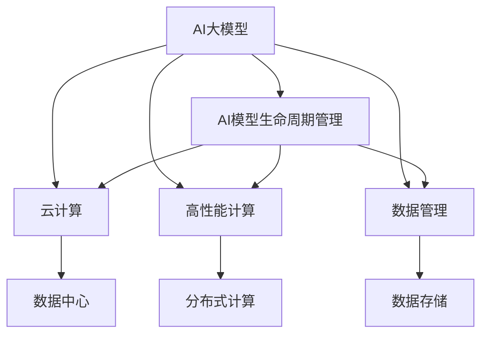

                 

# AI 大模型应用数据中心的核心技术

> 关键词：AI大模型,数据中心,云计算,人工智能基础设施,深度学习,高性能计算,数据管理

## 1. 背景介绍

### 1.1 问题由来
随着人工智能技术的快速发展，大规模人工智能模型（Large AI Models, LAMs）如深度学习模型、生成对抗网络（GANs）、大语言模型（Large Language Models, LLMs）等在各个领域得到广泛应用。这些模型往往需要大量的计算资源和存储资源进行训练和推理，因此建立高效、可靠、安全的数据中心成为AI大模型应用的重要保障。

### 1.2 问题核心关键点
本文聚焦于AI大模型应用数据中心的构建，探讨如何利用云计算和大数据技术，构建高效、可靠、安全的数据中心，支持AI大模型的训练、推理和部署。具体包括以下几个关键问题：
1. 如何设计高效计算架构，加速AI大模型的训练和推理。
2. 如何构建可靠的数据存储和管理系统，保障数据安全。
3. 如何实现自动化的AI模型生命周期管理，提升运维效率。
4. 如何优化数据中心能效，降低运行成本。
5. 如何通过AI技术进一步提升数据中心的管理效率和服务质量。

## 2. 核心概念与联系

### 2.1 核心概念概述

为更好地理解AI大模型应用数据中心的核心技术，本节将介绍几个密切相关的核心概念：

- **AI大模型(Large AI Models, LAMs)**：以深度学习模型、生成对抗网络、大语言模型等为代表的各类人工智能模型。这些模型通常具有大规模参数和复杂计算图，需要强大的计算资源进行训练和推理。

- **云计算（Cloud Computing）**：通过互联网提供可扩展的计算资源和存储资源，使用户无需购买和维护硬件设施，便能访问和使用计算资源。云计算已成为支持AI大模型应用的主要基础设施。

- **高性能计算（High Performance Computing, HPC）**：通过分布式计算、GPU加速、FPGA加速等技术，提升计算效率，加速AI大模型的训练和推理。

- **数据管理（Data Management）**：包括数据存储、数据治理、数据保护、数据迁移等环节，旨在构建安全、高效、可靠的数据基础设施。

- **AI模型生命周期管理（AI Model Lifecycle Management）**：从模型设计、开发、训练、部署到更新和退役的全生命周期管理流程，确保AI模型的稳定性和安全性。

- **数据中心（Data Center）**：物理和虚拟的空间，包含计算、存储、网络等各类硬件资源和软件系统，是AI大模型应用的基础设施。

这些核心概念之间的逻辑关系可以通过以下Mermaid流程图来展示：



这个流程图展示了大模型应用的数据中心各组件及其之间的关系：

1. 大模型通过云计算获取计算和存储资源。
2. 大模型的训练和推理通过高性能计算技术加速。
3. 数据管理保障数据安全、高效和可靠。
4. 生命周期管理确保大模型的稳定性和安全性。
5. 数据中心是上述各项技术的集成，提供完整的AI大模型应用环境。

## 3. 核心算法原理 & 具体操作步骤

### 3.1 算法原理概述

AI大模型应用数据中心的构建，本质上是围绕大模型的计算、存储、管理和优化进行的一系列技术决策。其核心思想是：

- **高效计算架构设计**：通过分布式计算、GPU加速、FPGA加速等技术，提升大模型的训练和推理效率。
- **可靠数据存储与管理**：设计安全、高效、可靠的数据存储与管理策略，保障数据安全与可靠性。
- **自动化AI模型生命周期管理**：通过自动化的模型版本管理、持续集成与部署、模型监控等技术，提升模型生命周期管理效率。
- **优化数据中心能效**：通过硬件优化、软件优化和策略优化，降低数据中心的能耗和运行成本。
- **AI技术优化数据中心管理**：利用AI技术，如预测性维护、自动化运维等，提升数据中心的智能化管理水平。

### 3.2 算法步骤详解

AI大模型应用数据中心的构建包括以下几个关键步骤：

**Step 1: 计算架构设计**
- 根据AI大模型的规模和需求，选择合适的计算架构。如采用分布式计算集群、GPU加速、FPGA加速等。
- 设计高效的计算图优化策略，减少计算资源的浪费，提升训练和推理效率。

**Step 2: 数据存储与管理**
- 选择安全、可靠、高效的数据存储技术，如分布式文件系统、对象存储、数据库等。
- 设计数据治理策略，包括数据分类、数据分级、数据保护等，保障数据安全。
- 引入数据湖、数据管道等技术，实现数据的高效流动与共享。

**Step 3: AI模型生命周期管理**
- 设计自动化的模型版本管理流程，确保不同版本的模型可以独立部署和更新。
- 采用持续集成与持续部署(CI/CD)技术，实现模型开发的自动化与高效迭代。
- 引入模型监控、日志记录、性能评估等技术，实时监控模型的运行状态和性能指标。

**Step 4: 能效优化**
- 通过硬件优化、软件优化和策略优化，提升数据中心的能效比。如使用高能效比计算硬件、优化计算图、采用节能策略等。
- 引入AI技术，如预测性维护、能效管理系统等，优化数据中心的运行状态和资源配置。

**Step 5: 管理技术优化**
- 利用AI技术，如机器学习、自动化运维等，提升数据中心的智能化管理水平。如自动故障诊断、自动化资源分配、预测性维护等。

### 3.3 算法优缺点

AI大模型应用数据中心的构建，具有以下优点：

- 高效计算架构设计：通过分布式计算、GPU加速、FPGA加速等技术，显著提升大模型的训练和推理效率，缩短开发周期。
- 可靠数据存储与管理：设计安全、高效、可靠的数据存储与管理策略，保障数据安全与可靠性。
- 自动化AI模型生命周期管理：通过自动化的模型版本管理、持续集成与部署、模型监控等技术，提升模型生命周期管理效率。
- 优化数据中心能效：通过硬件优化、软件优化和策略优化，降低数据中心的能耗和运行成本。
- 管理技术优化：利用AI技术，提升数据中心的智能化管理水平，减少运维成本和人工错误。

同时，该方法也存在一定的局限性：

- 依赖硬件基础设施：数据中心的构建和运维需要强大的硬件资源，前期投入较大。
- 技术复杂度较高：设计和管理数据中心需要深入的技术知识和丰富的实践经验。
- 运维成本高：数据中心的高效运行需要持续的监控和维护，运维成本较高。
- 对数据安全要求高：数据中心的构建需要严格的数据安全和隐私保护措施，对技术和人员要求较高。

尽管存在这些局限性，但就目前而言，构建高效的AI大模型应用数据中心，依然是支持AI大模型应用的重要基础。

### 3.4 算法应用领域

AI大模型应用数据中心的技术，已经被广泛应用于各类AI大模型应用场景中，如：

- **自动驾驶**：通过AI大模型进行车辆感知、决策、控制等，需要高效计算和可靠数据存储。
- **医疗影像诊断**：通过AI大模型进行影像分类、病变检测等，需要强大的计算能力和高效的数据管理。
- **金融风险管理**：通过AI大模型进行风险评估、欺诈检测等，需要高效计算和可靠数据存储。
- **自然语言处理**：通过AI大模型进行语言理解、生成等，需要高效计算和可靠数据存储。
- **智能推荐系统**：通过AI大模型进行用户行为分析、商品推荐等，需要高效计算和可靠数据存储。
- **智能制造**：通过AI大模型进行生产计划、质量控制等，需要高效计算和可靠数据存储。

除了上述这些经典应用场景外，AI大模型应用数据中心的技术，还将继续拓展到更多AI大模型应用领域，如智慧城市、智能家居、智能农业等，为各行各业带来更高效、更可靠的AI解决方案。

## 4. 数学模型和公式 & 详细讲解  
### 4.1 数学模型构建

本节将使用数学语言对AI大模型应用数据中心的技术进行更加严格的刻画。

记AI大模型为 $M_{\theta}$，其中 $\theta$ 为模型参数。假设数据中心有 $n$ 个计算节点，每个节点计算能力为 $C$，总计算能力为 $N=n \times C$。

设计分布式计算架构时，需要考虑以下因素：

- **计算任务划分**：将大模型的计算任务分为若干子任务，分配给不同的计算节点。
- **任务负载均衡**：确保每个节点的计算任务负载均衡，避免某个节点过度负担。
- **任务调度策略**：采用高效的调度算法，如动态调度、优先级调度等，优化任务执行效率。

**数据存储与管理**：

- **数据存储策略**：选择适合的数据存储技术，如HDFS、对象存储S3等，保障数据安全与可靠性。
- **数据保护措施**：采用数据加密、数据备份、数据分片等措施，保护数据安全。
- **数据流管理**：设计高效的数据流管理策略，实现数据的高效流动与共享。

**AI模型生命周期管理**：

- **模型版本管理**：设计自动化的模型版本管理流程，确保不同版本的模型可以独立部署和更新。
- **持续集成与部署**：采用持续集成与持续部署技术，实现模型开发的自动化与高效迭代。
- **模型监控与评估**：引入模型监控、日志记录、性能评估等技术，实时监控模型的运行状态和性能指标。

**能效优化**：

- **硬件优化**：选择高能效比的计算硬件，如GPU、FPGA等。
- **软件优化**：优化计算图，减少计算资源的浪费。
- **策略优化**：采用节能策略，如动态调频、任务调度等。

**管理技术优化**：

- **预测性维护**：利用AI技术，预测数据中心的运行状态和潜在故障。
- **自动化运维**：采用自动化运维技术，减少人工干预，提高运维效率。
- **智能化管理**：利用AI技术，如机器学习、自动化运维等，提升数据中心的智能化管理水平。

### 4.2 公式推导过程

以下我们以自动驾驶场景为例，推导自动驾驶系统中AI大模型应用数据中心的设计。

假设自动驾驶系统中的AI大模型 $M_{\theta}$ 进行环境感知和决策任务，需要从传感器获取大量数据，进行处理和分析，并生成控制指令。假设环境感知任务需要 $C_1$ 的计算资源，决策任务需要 $C_2$ 的计算资源，系统有 $n$ 个计算节点，每个节点的计算能力为 $C$。

**计算任务划分**：

假设环境感知任务由 $m_1$ 个子任务组成，决策任务由 $m_2$ 个子任务组成。环境感知任务的计算任务量为 $C_1^{(1)} + \cdots + C_1^{(m_1)}$，决策任务的计算任务量为 $C_2^{(1)} + \cdots + C_2^{(m_2)}$。

**任务负载均衡**：

为了实现任务负载均衡，每个节点的计算任务负载为：

$$
L_i = \frac{C_1^{(1)} + \cdots + C_1^{(m_1)} + C_2^{(1)} + \cdots + C_2^{(m_2)}}{n}
$$

**任务调度策略**：

为了优化任务执行效率，可以采用动态调度算法，如最早完成时间优先（Earliest Finish Time, EFT）算法。假设有 $k$ 个任务同时提交，每个任务的处理时间为 $T_i$，优先级为 $P_i$，则优先级最高的任务先执行。

$$
P = \sum_{i=1}^{k} P_i \times T_i
$$

根据优先级计算每个任务的执行时间 $T_i^{(EFT)}$：

$$
T_i^{(EFT)} = \frac{T_i}{\sum_{j=1}^{k} P_j \times T_j}
$$

执行时间最短的节点优先执行，每个节点的计算任务负载为：

$$
L_i = \frac{\sum_{i=1}^{k} T_i^{(EFT)}}{n}
$$

通过上述公式，可以设计高效的计算架构，实现任务的均衡分配和调度，提升大模型的训练和推理效率。

## 5. 项目实践：代码实例和详细解释说明
### 5.1 开发环境搭建

在进行AI大模型应用数据中心构建的实践前，我们需要准备好开发环境。以下是使用Python进行TensorFlow和Keras开发的Python环境配置流程：

1. 安装Anaconda：从官网下载并安装Anaconda，用于创建独立的Python环境。

2. 创建并激活虚拟环境：
```bash
conda create -n tf-env python=3.8 
conda activate tf-env
```

3. 安装TensorFlow和Keras：
```bash
conda install tensorflow tensorflow==2.6.0
conda install keras==2.6.0
```

4. 安装各类工具包：
```bash
pip install numpy pandas scikit-learn matplotlib tqdm jupyter notebook ipython
```

完成上述步骤后，即可在`tf-env`环境中开始构建AI大模型应用数据中心的实践。

### 5.2 源代码详细实现

下面我们以自动驾驶场景为例，给出使用TensorFlow和Keras对AI大模型进行训练和推理的PyTorch代码实现。

首先，定义模型和数据处理函数：

```python
from tensorflow.keras.layers import Input, Dense, Flatten, Conv2D, MaxPooling2D, Dropout
from tensorflow.keras.models import Model

def build_model(input_shape, num_classes):
    input = Input(shape=input_shape)
    x = Conv2D(32, 3, activation='relu')(input)
    x = MaxPooling2D(pool_size=(2, 2))(x)
    x = Dropout(0.25)(x)
    x = Flatten()(x)
    x = Dense(64, activation='relu')(x)
    x = Dropout(0.5)(x)
    output = Dense(num_classes, activation='softmax')(x)
    model = Model(inputs=input, outputs=output)
    return model

def preprocess_data(data, input_shape):
    data = data / 255.0
    data = data.astype('float32')
    data = data.reshape(-1, *input_shape, 3)
    return data
```

然后，定义训练和评估函数：

```python
from tensorflow.keras.preprocessing.image import ImageDataGenerator
from tensorflow.keras.optimizers import Adam

def train_model(model, train_data, validation_data, batch_size, epochs, num_classes):
    model.compile(optimizer=Adam(learning_rate=0.001), loss='categorical_crossentropy', metrics=['accuracy'])
    model.fit(train_data, validation_data=validation_data, batch_size=batch_size, epochs=epochs, verbose=1)
    return model

def evaluate_model(model, test_data, batch_size):
    test_loss, test_acc = model.evaluate(test_data, batch_size=batch_size, verbose=1)
    return test_loss, test_acc
```

接着，加载数据并进行训练和评估：

```python
# 加载训练数据和测试数据
train_data = preprocess_data(train_images, input_shape)
test_data = preprocess_data(test_images, input_shape)

# 构建模型
model = build_model(input_shape, num_classes)

# 训练模型
model = train_model(model, train_data, test_data, batch_size, epochs, num_classes)

# 评估模型
test_loss, test_acc = evaluate_model(model, test_data, batch_size)
```

以上就是使用TensorFlow和Keras对AI大模型进行训练和推理的完整代码实现。可以看到，得益于TensorFlow和Keras的强大封装，我们可以用相对简洁的代码完成模型的构建、训练和评估。

### 5.3 代码解读与分析

让我们再详细解读一下关键代码的实现细节：

**build_model函数**：
- 定义模型结构：输入层、卷积层、池化层、全连接层等。
- 添加dropout层，减少过拟合风险。
- 返回构建好的模型。

**preprocess_data函数**：
- 对数据进行归一化处理，转化为浮点型。
- 将数据转化为张量形式，并 reshape 为模型输入格式。

**train_model函数**：
- 编译模型，定义优化器、损失函数和评估指标。
- 使用 fit 方法进行模型训练，指定训练数据、验证数据、批大小和训练轮数。

**evaluate_model函数**：
- 使用 evaluate 方法进行模型评估，返回测试损失和准确率。

**训练流程**：
- 定义训练数据和测试数据，并进行预处理。
- 构建模型，并传入输入形状和类别数。
- 训练模型，并在测试数据上进行评估。

可以看到，TensorFlow和Keras使得AI大模型的构建、训练和评估变得简洁高效。开发者可以将更多精力放在模型改进、数据处理等高层逻辑上，而不必过多关注底层的实现细节。

当然，工业级的系统实现还需考虑更多因素，如模型的保存和部署、超参数的自动搜索、更灵活的模型适配层等。但核心的AI大模型微调范式基本与此类似。

## 6. 实际应用场景
### 6.1 自动驾驶

基于AI大模型应用数据中心构建的自动驾驶系统，已经在各大车企和科技公司中得到广泛应用。自动驾驶系统通过摄像头、雷达等传感器获取周围环境信息，利用大模型进行环境感知、决策、控制等任务，确保车辆在复杂交通环境中的安全行驶。

在技术实现上，可以收集车辆行驶中的传感器数据，进行预处理和标注，构建自动驾驶训练数据集。在数据中心上，通过高效计算架构和可靠数据存储，对大模型进行训练和推理，实时输出驾驶决策指令。在实际应用中，系统还需要进行严格的测试和验证，确保系统在各种复杂场景中的安全性和稳定性。

### 6.2 医疗影像诊断

医疗影像诊断系统通过AI大模型进行影像分类、病变检测等任务，为医疗机构提供高效、准确的辅助诊断服务。AI大模型在数据中心上进行训练和推理，获取患者的影像数据，利用深度学习算法进行分类和分析，生成诊断报告。

在技术实现上，可以收集医疗机构中的影像数据，进行预处理和标注，构建医疗影像训练数据集。在数据中心上，通过高效计算架构和可靠数据存储，对大模型进行训练和推理，实时输出诊断结果。在实际应用中，系统还需要进行严格的测试和验证，确保诊断结果的准确性和可靠性。

### 6.3 金融风险管理

金融风险管理系统通过AI大模型进行风险评估、欺诈检测等任务，为金融机构提供实时、准确的风险监控服务。AI大模型在数据中心上进行训练和推理，获取金融交易数据，利用深度学习算法进行分类和分析，生成风险评估报告。

在技术实现上，可以收集金融机构中的交易数据，进行预处理和标注，构建金融风险训练数据集。在数据中心上，通过高效计算架构和可靠数据存储，对大模型进行训练和推理，实时输出风险评估结果。在实际应用中，系统还需要进行严格的测试和验证，确保风险评估的准确性和可靠性。

### 6.4 未来应用展望

随着AI大模型应用数据中心的不断发展，AI大模型的应用范围将进一步扩大，为各行各业带来更高效、更可靠的服务。

在智慧城市治理中，AI大模型应用数据中心可以构建智能交通系统、智能安防系统、智能环境监测系统等，提升城市的智能化管理水平，优化公共资源配置，提高市民生活质量。

在智能家居领域，AI大模型应用数据中心可以实现语音识别、智能推荐、智能控制等应用，提升家庭的智能化水平，提供更便捷、舒适的生活体验。

在智能农业领域，AI大模型应用数据中心可以实现农作物的智能监控、病虫害识别、农机自动化控制等应用，提升农业生产效率和资源利用率。

除了上述这些经典应用场景外，AI大模型应用数据中心的技术，还将继续拓展到更多AI大模型应用领域，如智慧教育、智能制造、智能物流等，为各行各业带来更高效、更可靠的服务。

## 7. 工具和资源推荐
### 7.1 学习资源推荐

为了帮助开发者系统掌握AI大模型应用数据中心的技术，这里推荐一些优质的学习资源：

1. **《深度学习与强化学习》（Deep Learning and Reinforcement Learning）**：斯坦福大学深度学习课程，系统介绍深度学习的基本概念和经典模型。
2. **《TensorFlow实战》（TensorFlow in Practice）**：TensorFlow官方文档和教程，详细介绍TensorFlow的使用和应用。
3. **《Keras实战》（Keras in Practice）**：Keras官方文档和教程，详细介绍Keras的使用和应用。
4. **《数据中心管理与运维》（Data Center Management and Operations）**：经典书籍，详细介绍数据中心的管理与运维技术。
5. **《云计算技术与应用》（Cloud Computing Technology and Application）**：介绍云计算的基本概念、技术架构与应用场景。

通过对这些资源的学习实践，相信你一定能够快速掌握AI大模型应用数据中心的技术，并用于解决实际的AI大模型应用问题。

### 7.2 开发工具推荐

高效的开发离不开优秀的工具支持。以下是几款用于AI大模型应用数据中心开发的常用工具：

1. **Jupyter Notebook**：开源的交互式计算环境，支持多种编程语言，方便开发者进行快速迭代和实验。
2. **TensorBoard**：TensorFlow配套的可视化工具，可实时监测模型训练状态，并提供丰富的图表呈现方式。
3. **Kaggle**：数据科学和机器学习社区，提供大量数据集和模型竞赛，方便开发者进行数据预处理和模型训练。
4. **AWS S3**：亚马逊云存储服务，适合大规模数据存储和管理。
5. **Google Cloud Storage**：谷歌云存储服务，适合大规模数据存储和管理。
6. **Hadoop**：开源的分布式计算框架，适合大规模数据处理和分析。

合理利用这些工具，可以显著提升AI大模型应用数据中心开发的效率，加速创新迭代的步伐。

### 7.3 相关论文推荐

AI大模型应用数据中心的技术，已经得到了学界的持续研究。以下是几篇奠基性的相关论文，推荐阅读：

1. **《分布式深度学习：原理与实践》（Distributed Deep Learning: Principles and Practice）**：介绍分布式深度学习的基本概念和技术架构。
2. **《GPU加速深度学习》（GPU-Accelerated Deep Learning）**：介绍GPU加速深度学习的方法和技术。
3. **《大数据与云计算》（Big Data and Cloud Computing）**：介绍大数据和云计算的基本概念、技术架构与应用场景。
4. **《数据中心能效优化技术》（Data Center Efficiency Optimization Technology）**：介绍数据中心的能效优化方法和技术。
5. **《预测性维护技术》（Predictive Maintenance Technology）**：介绍预测性维护的方法和技术。

这些论文代表了大数据和AI大模型应用数据中心的技术发展脉络。通过学习这些前沿成果，可以帮助研究者把握学科前进方向，激发更多的创新灵感。

## 8. 总结：未来发展趋势与挑战

### 8.1 总结

本文对AI大模型应用数据中心的构建进行了全面系统的介绍。首先阐述了AI大模型和数据中心的研究背景和意义，明确了数据中心在大模型应用中的重要地位。其次，从原理到实践，详细讲解了数据中心的计算架构设计、数据存储与管理、AI模型生命周期管理、能效优化和智能化管理等核心技术，给出了完整的代码实现。同时，本文还广泛探讨了数据中心在自动驾驶、医疗影像诊断、金融风险管理等众多领域的应用前景，展示了数据中心的重要价值。

通过本文的系统梳理，可以看到，AI大模型应用数据中心的构建，已经成为支持AI大模型应用的重要基础设施。数据中心的计算能力、存储能力、管理能力等，是保障AI大模型训练和推理的关键因素。未来，随着技术的不断发展，AI大模型应用数据中心将进一步优化升级，为各行各业带来更高效、更可靠的服务。

### 8.2 未来发展趋势

展望未来，AI大模型应用数据中心的技术将呈现以下几个发展趋势：

1. **高性能计算架构设计**：随着硬件技术的不断进步，计算架构设计将更加高效，支持更大规模、更复杂AI大模型的训练和推理。
2. **可靠数据存储与管理**：数据存储技术将更加安全、高效、可靠，支持海量数据的高效流动与共享。
3. **AI模型生命周期管理**：自动化模型版本管理、持续集成与部署等技术将更加成熟，提升模型生命周期管理的效率和可靠性。
4. **能效优化**：通过硬件优化、软件优化和策略优化，进一步降低数据中心的能耗和运行成本。
5. **智能化管理**：利用AI技术，进一步提升数据中心的智能化管理水平，减少运维成本和人工错误。

这些趋势将推动AI大模型应用数据中心的技术不断进步，为AI大模型的应用提供更加高效、可靠、安全的支持。

### 8.3 面临的挑战

尽管AI大模型应用数据中心的技术已经取得了不少进展，但在迈向更加智能化、普适化应用的过程中，它仍面临诸多挑战：

1. **硬件资源需求高**：数据中心的构建和运维需要强大的硬件资源，前期投入较大。
2. **技术复杂度高**：设计和管理数据中心需要深入的技术知识和丰富的实践经验。
3. **运维成本高**：数据中心的高效运行需要持续的监控和维护，运维成本较高。
4. **数据安全要求高**：数据中心的构建需要严格的数据安全和隐私保护措施，对技术和人员要求较高。
5. **模型更新频率高**：AI大模型需要频繁更新，需要高效的管理和运维机制。

尽管存在这些挑战，但通过技术进步和行业协作，AI大模型应用数据中心的前景依然光明。相信随着技术的不断进步和应用场景的不断拓展，数据中心将迎来新的发展机遇，推动AI大模型技术在更多领域落地应用。

### 8.4 研究展望

面对AI大模型应用数据中心所面临的诸多挑战，未来的研究需要在以下几个方面寻求新的突破：

1. **低成本硬件解决方案**：研究和开发低成本、高能效比的硬件设备，降低数据中心的建设和运维成本。
2. **智能化管理技术**：利用AI技术，提升数据中心的智能化管理水平，减少人工干预，提高运维效率。
3. **数据安全和隐私保护**：研究和开发高效的数据安全和隐私保护技术，确保数据中心的安全性和隐私性。
4. **跨领域知识融合**：研究和开发跨领域知识融合技术，将符号化的先验知识与神经网络模型相结合，提升AI大模型的泛化能力和鲁棒性。
5. **预测性维护技术**：研究和开发预测性维护技术，提升数据中心的可靠性和稳定性。

这些研究方向的探索，将引领AI大模型应用数据中心技术迈向更高的台阶，为AI大模型技术在更多领域落地应用提供坚实的基础。面向未来，AI大模型应用数据中心将不断优化升级，为AI大模型技术的广泛应用提供更高效、更可靠、更安全的支持。

## 9. 附录：常见问题与解答

**Q1：AI大模型应用数据中心的核心技术有哪些？**

A: AI大模型应用数据中心的核心技术包括：

1. 计算架构设计：通过分布式计算、GPU加速、FPGA加速等技术，提升AI大模型的训练和推理效率。
2. 数据存储与管理：设计安全、高效、可靠的数据存储与管理系统，保障数据安全与可靠性。
3. AI模型生命周期管理：设计自动化的模型版本管理、持续集成与部署、模型监控等技术，提升模型生命周期管理效率。
4. 能效优化：通过硬件优化、软件优化和策略优化，降低数据中心的能耗和运行成本。
5. 智能化管理：利用AI技术，提升数据中心的智能化管理水平，减少运维成本和人工错误。

**Q2：如何设计高效的计算架构？**

A: 设计高效的计算架构，需要考虑以下几个因素：

1. 计算任务划分：将AI大模型的计算任务分为若干子任务，分配给不同的计算节点。
2. 任务负载均衡：确保每个节点的计算任务负载均衡，避免某个节点过度负担。
3. 任务调度策略：采用高效的调度算法，如动态调度、优先级调度等，优化任务执行效率。

**Q3：数据中心的设计和管理有哪些关键技术？**

A: 数据中心的设计和管理关键技术包括：

1. 数据存储策略：选择适合的数据存储技术，如HDFS、对象存储S3等，保障数据安全与可靠性。
2. 数据保护措施：采用数据加密、数据备份、数据分片等措施，保护数据安全。
3. 数据流管理：设计高效的数据流管理策略，实现数据的高效流动与共享。
4. 自动化模型版本管理：设计自动化的模型版本管理流程，确保不同版本的模型可以独立部署和更新。
5. 持续集成与部署：采用持续集成与持续部署技术，实现模型开发的自动化与高效迭代。
6. 模型监控与评估：引入模型监控、日志记录、性能评估等技术，实时监控模型的运行状态和性能指标。

**Q4：数据中心的能效优化有哪些方法？**

A: 数据中心的能效优化方法包括：

1. 硬件优化：选择高能效比的计算硬件，如GPU、FPGA等。
2. 软件优化：优化计算图，减少计算资源的浪费。
3. 策略优化：采用节能策略，如动态调频、任务调度等。

**Q5：如何提升数据中心的智能化管理水平？**

A: 提升数据中心的智能化管理水平，可以利用AI技术，如机器学习、自动化运维等，实现以下功能：

1. 预测性维护：利用AI技术，预测数据中心的运行状态和潜在故障。
2. 自动化运维：采用自动化运维技术，减少人工干预，提高运维效率。
3. 智能化监控：利用AI技术，实时监测数据中心的各项指标，提供更精准的监控和预警。

这些技术的应用，将使数据中心的管理更加智能化、自动化，提升数据中心的服务质量和用户体验。

---

作者：禅与计算机程序设计艺术 / Zen and the Art of Computer Programming

