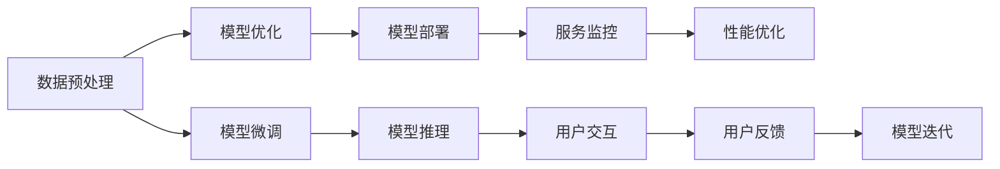

                 

# AI 大模型应用最佳实践

> 关键词：大模型应用, 最佳实践, 数据处理, 算法优化, 部署策略, 微调技巧

## 1. 背景介绍

随着人工智能技术的飞速发展，大模型（如BERT、GPT等）在自然语言处理（NLP）、计算机视觉（CV）、语音识别等领域的应用日益广泛，其高精度的预测和推理能力使大模型成为解决复杂问题的有力工具。然而，面对海量数据的处理、复杂算法的优化和实际应用的部署，如何高效、稳定、安全地应用大模型，成为从业者面临的重要问题。本文旨在从数据准备、模型训练、算法优化和部署策略等方面，探讨大模型应用的最佳实践，帮助用户最大限度地发挥大模型的潜力，推动人工智能技术的实际落地。

## 2. 核心概念与联系

### 2.1 核心概念概述

为更好理解大模型应用的最佳实践，本节将介绍几个关键概念，包括数据预处理、模型微调、模型优化、模型部署等。

- 数据预处理：指对原始数据进行清洗、标注、归一化等处理，以便于模型训练和推理。数据预处理的好坏直接影响模型的性能和稳定性。
- 模型微调：在已有预训练模型的基础上，使用特定任务的数据集，通过有监督学习优化模型在该任务上的性能。微调是提升模型任务适应性的关键步骤。
- 模型优化：指对模型结构、超参数和优化算法进行调优，以提高模型性能、加速训练过程，或减小内存和计算资源的消耗。
- 模型部署：将训练好的模型部署到实际应用环境，保证模型在实际场景中能稳定运行。部署策略的选择直接影响模型的服务质量和用户体验。

这些概念相互关联，构成了大模型应用的全流程。通过合理地应用这些概念，可以在保证模型性能的同时，实现高效、稳定、安全的大模型应用。

### 2.2 核心概念原理和架构的 Mermaid 流程图



该图展示了数据预处理、模型微调、模型优化、模型部署之间的联系，以及模型推理、服务监控、用户交互、性能优化和用户反馈等环节。

## 3. 核心算法原理 & 具体操作步骤

### 3.1 算法原理概述

大模型应用的最佳实践主要涉及数据预处理、模型微调、模型优化和模型部署等方面。本节将详细解释这些环节的算法原理，并介绍具体的操作步骤。

### 3.2 算法步骤详解

#### 数据预处理

数据预处理包括数据清洗、标注、归一化、特征工程等步骤。以NLP任务为例，数据预处理的主要步骤如下：

1. **文本清洗**：去除无用字符、停用词，确保数据质量。
2. **分词**：将文本划分为单词或词组，便于模型处理。
3. **标注**：为文本添加标签，如情感、主题、命名实体等。
4. **归一化**：对文本进行标准化处理，如小写化、去重等。
5. **特征工程**：提取文本的特征表示，如词袋模型、TF-IDF、词嵌入等。

#### 模型微调

模型微调是通过有监督学习优化模型在特定任务上的性能。主要步骤如下：

1. **选择预训练模型**：如BERT、GPT等，作为微调的基础。
2. **设计任务适配层**：根据任务类型设计输出层和损失函数，如分类任务使用线性分类器，生成任务使用语言模型解码器。
3. **设置微调超参数**：包括学习率、优化算法、正则化强度等。
4. **执行梯度训练**：使用数据集进行有监督学习，更新模型参数，最小化损失函数。
5. **测试和部署**：在测试集上评估微调后的模型性能，部署到实际应用中。

#### 模型优化

模型优化包括模型结构优化、超参数调优和优化算法优化等方面。主要步骤如下：

1. **模型结构优化**：如剪枝、量化、蒸馏等，减小模型规模，提高计算效率。
2. **超参数调优**：如学习率、批大小、迭代次数等，通过网格搜索或贝叶斯优化，找到最优参数组合。
3. **优化算法优化**：如Adam、SGD等，根据模型特点选择合适的优化算法，并进行参数调优。

#### 模型部署

模型部署是将训练好的模型部署到实际应用环境，主要步骤如下：

1. **选择部署平台**：如TensorFlow Serving、Amazon SageMaker等，确保模型支持实际应用场景。
2. **模型优化**：如模型裁剪、量化、压缩等，减小模型规模，提高计算效率。
3. **服务化封装**：将模型封装为标准API，便于调用和集成。
4. **弹性伸缩**：根据请求流量动态调整资源配置，平衡服务质量和成本。
5. **监控告警**：实时采集系统指标，设置异常告警阈值，确保服务稳定性。

### 3.3 算法优缺点

数据预处理、模型微调、模型优化和模型部署等算法各有优缺点。

**数据预处理**

- **优点**：提高数据质量，确保模型训练的稳定性和准确性。
- **缺点**：处理成本高，数据标注难度大。

**模型微调**

- **优点**：提升模型任务适应性，性能提升显著。
- **缺点**：依赖标注数据，数据标注成本高。

**模型优化**

- **优点**：提高模型性能和计算效率，减小内存和计算资源的消耗。
- **缺点**：优化过程复杂，容易过拟合。

**模型部署**

- **优点**：确保模型在实际场景中能稳定运行，提高服务质量和用户体验。
- **缺点**：部署成本高，服务监控复杂。

### 3.4 算法应用领域

大模型应用的最佳实践广泛应用于自然语言处理、计算机视觉、语音识别等领域。例如：

- **自然语言处理**：如文本分类、情感分析、命名实体识别等任务。
- **计算机视觉**：如目标检测、图像分类、语义分割等任务。
- **语音识别**：如语音转文本、语音识别等任务。

这些应用场景都需要高质量的数据预处理、高效准确的模型微调和优化、可靠稳定的模型部署等环节的支持。

## 4. 数学模型和公式 & 详细讲解 & 举例说明

### 4.1 数学模型构建

以NLP任务为例，假设数据集为 $D=\{(x_i,y_i)\}_{i=1}^N$，其中 $x_i$ 为输入文本， $y_i$ 为对应的标签。模型的预测函数为 $M_{\theta}(x)$，其中 $\theta$ 为模型参数。模型的损失函数为 $\mathcal{L}(\theta)$。

### 4.2 公式推导过程

以二分类任务为例，假设模型输出 $M_{\theta}(x) \in [0,1]$，表示样本属于正类的概率。真实标签 $y \in \{0,1\}$。则二分类交叉熵损失函数定义为：

$$
\mathcal{L}(\theta) = -\frac{1}{N}\sum_{i=1}^N [y_i\log M_{\theta}(x_i)+(1-y_i)\log(1-M_{\theta}(x_i))]
$$

### 4.3 案例分析与讲解

以BERT模型为例，假设使用XLM-Roberto作为预训练模型，进行情感分析任务的微调。微调步骤如下：

1. **数据预处理**：对数据集进行清洗、分词、标注等预处理。
2. **模型微调**：使用BERT模型作为基础模型，添加线性分类器，设置交叉熵损失函数。
3. **模型优化**：使用Adam优化器，学习率为2e-5，进行梯度训练。
4. **测试和部署**：在测试集上评估微调后的模型性能，部署到实际应用中。

## 5. 项目实践：代码实例和详细解释说明

### 5.1 开发环境搭建

在Python环境下，使用TensorFlow或PyTorch搭建开发环境。以TensorFlow为例：

1. 安装TensorFlow：
```
pip install tensorflow
```

2. 安装数据处理库：
```
pip install pandas numpy
```

3. 安装模型库：
```
pip install tensorflow_addons
```

4. 安装优化库：
```
pip install scipy optuna
```

5. 安装服务框架：
```
pip install flask
```

### 5.2 源代码详细实现

以BERT模型进行情感分析任务的微调为例，代码实现如下：

```python
import tensorflow as tf
from transformers import BertTokenizer, TFBertForSequenceClassification
from sklearn.model_selection import train_test_split
from tensorflow.keras.metrics import Accuracy

# 加载数据集和标注
train_data, train_labels = load_train_data()
test_data, test_labels = load_test_data()

# 分词和编码
tokenizer = BertTokenizer.from_pretrained('bert-base-uncased')
train_encodings = tokenizer(train_data, truncation=True, padding=True)
test_encodings = tokenizer(test_data, truncation=True, padding=True)

# 划分训练集和验证集
train_encodings, val_encodings, train_labels, val_labels = train_test_split(train_encodings, train_labels, test_size=0.1)

# 构建模型
model = TFBertForSequenceClassification.from_pretrained('bert-base-uncased', num_labels=2)
optimizer = tf.keras.optimizers.Adam(learning_rate=2e-5)
loss = tf.keras.losses.SparseCategoricalCrossentropy(from_logits=True)
accuracy = tf.keras.metrics.Accuracy()

# 训练模型
@tf.function
def train_step(encodings, labels):
    with tf.GradientTape() as tape:
        outputs = model(encodings['input_ids'], attention_mask=encodings['attention_mask'])
        loss_value = loss(labels, outputs.logits)
    gradients = tape.gradient(loss_value, model.trainable_variables)
    optimizer.apply_gradients(zip(gradients, model.trainable_variables))

# 评估模型
@tf.function
def eval_step(encodings, labels):
    predictions = model(encodings['input_ids'], attention_mask=encodings['attention_mask'])
    accuracy_value = accuracy(labels, tf.argmax(predictions, axis=1))
    return accuracy_value.numpy()

# 训练循环
for epoch in range(5):
    for batch in train_encodings:
        train_step(batch, train_labels)
    val_accuracy = eval_step(val_encodings, val_labels)
    print(f'Epoch {epoch+1}, val accuracy: {val_accuracy}')

# 测试模型
test_accuracy = eval_step(test_encodings, test_labels)
print(f'Test accuracy: {test_accuracy}')
```

### 5.3 代码解读与分析

该代码实现了BERT模型进行情感分析任务的数据预处理、模型微调和测试过程。主要步骤如下：

1. **数据预处理**：使用BertTokenizer对数据进行分词和编码，确保模型输入格式一致。
2. **模型微调**：使用TFBertForSequenceClassification构建模型，设置交叉熵损失函数。
3. **模型优化**：使用Adam优化器进行梯度训练，调整模型参数。
4. **测试和部署**：在测试集上评估模型性能，并将模型部署到实际应用中。

## 6. 实际应用场景

### 6.1 金融风险控制

金融行业面临数据量大、风险多样化的挑战。使用大模型进行情感分析、异常检测等任务，可以实时监测市场情绪，识别潜在的风险信号。

以银行业为例，通过微调BERT模型进行情感分析，实时监测用户对银行服务的评价，及时识别并应对负面情绪，提高客户满意度和品牌形象。

### 6.2 医疗诊断辅助

医疗行业数据复杂，医生诊断压力大。使用大模型进行疾病分类、病历分析等任务，可以辅助医生进行诊断，提升诊疗效率和准确性。

以医院为例，通过微调BERT模型进行病历分类，自动分析患者的病历信息，辅助医生快速做出诊断结论，提高诊断准确率和效率。

### 6.3 电商推荐系统

电商行业竞争激烈，个性化推荐成为关键竞争力。使用大模型进行用户行为分析、商品推荐等任务，可以提升推荐效果，增加用户粘性。

以电商平台为例，通过微调BERT模型进行商品推荐，根据用户浏览、购买历史，智能推荐相关商品，提升用户购物体验和销售额。

### 6.4 未来应用展望

未来，大模型在各领域的广泛应用将带来更多创新和变革。

- **智慧城市**：通过微调BERT模型进行智能交通、环境监测等任务，提升城市管理效率，改善市民生活质量。
- **自动驾驶**：通过微调BERT模型进行语音识别、文本理解等任务，提升自动驾驶的安全性和用户体验。
- **教育培训**：通过微调BERT模型进行学生学习行为分析、教学效果评估等任务，提升教育质量和学习效果。

## 7. 工具和资源推荐

### 7.1 学习资源推荐

1. **Coursera**：提供大量机器学习和深度学习的课程，涵盖从基础到进阶的内容，适合各层次的开发者学习。
2. **Kaggle**：提供数据集和竞赛，通过实战项目提升技能，积累经验。
3. **Google Colab**：提供免费的GPU/TPU计算资源，便于开发者进行实验和分享。
4. **PyTorch官方文档**：提供详细的API文档和教程，帮助开发者快速上手。
5. **TensorFlow官方文档**：提供丰富的文档和教程，适合使用TensorFlow进行深度学习开发。

### 7.2 开发工具推荐

1. **Jupyter Notebook**：提供交互式的代码编写和数据可视化功能，方便开发者进行实验和协作。
2. **Anaconda**：提供虚拟环境管理工具，便于开发者管理不同项目和环境的依赖。
3. **TensorBoard**：提供模型训练和推理的可视化工具，便于开发者监控和调试。
4. **Flask**：提供轻量级的Web框架，方便开发者搭建API接口。

### 7.3 相关论文推荐

1. **Attention is All You Need**：介绍Transformer结构，开启大模型预训练时代。
2. **BERT: Pre-training of Deep Bidirectional Transformers for Language Understanding**：提出BERT模型，利用自监督预训练任务提升性能。
3. **Parameter-Efficient Transfer Learning for NLP**：提出Adapter等参数高效微调方法，减少微调对标注数据的依赖。
4. **Prefix-Tuning: Optimizing Continuous Prompts for Generation**：提出基于连续型Prompt的微调范式，提升模型生成能力。

## 8. 总结：未来发展趋势与挑战

### 8.1 研究成果总结

本文介绍了大模型应用的最佳实践，包括数据预处理、模型微调、模型优化和模型部署等方面。通过合理应用这些最佳实践，可以在保证模型性能的同时，实现高效、稳定、安全的大模型应用。

### 8.2 未来发展趋势

未来，大模型应用将呈现以下几个发展趋势：

1. **模型规模增大**：预训练模型规模将进一步增大，增强模型的语言表示能力。
2. **算法优化**：开发更多参数高效和计算高效的微调方法，提高模型性能和计算效率。
3. **模型部署**：采用更灵活的模型部署策略，提高模型的服务质量和用户体验。
4. **数据融合**：融合更多类型的数据，如视觉、语音、文本等，提升模型的多模态处理能力。

### 8.3 面临的挑战

尽管大模型应用的最佳实践已经取得显著成果，但仍面临以下挑战：

1. **数据获取困难**：高质量的标注数据获取成本高，制约模型训练和微调的精度。
2. **模型鲁棒性不足**：面对数据分布变化，模型的泛化性能有待提升。
3. **计算资源消耗大**：大模型训练和推理计算资源消耗大，需要优化资源配置。
4. **模型可解释性不足**：大模型输出缺乏可解释性，影响模型的可信度和可用性。
5. **伦理和法律问题**：大模型可能涉及隐私保护和伦理道德问题，需要严格的规范和监管。

### 8.4 研究展望

面对大模型应用面临的挑战，未来的研究需要在以下几个方面寻求新的突破：

1. **无监督学习和半监督学习**：探索不依赖标注数据的微调方法，降低数据获取成本。
2. **模型压缩和量化**：开发更多模型压缩和量化技术，减小计算资源消耗。
3. **可解释性增强**：研究模型输出解释方法，增强模型的可信度和可用性。
4. **伦理和法律规范**：制定模型应用的伦理和法律规范，确保数据和模型的安全使用。

## 9. 附录：常见问题与解答

**Q1: 如何选择合适的预训练模型？**

A: 选择合适的预训练模型需要考虑任务类型、数据规模、计算资源等因素。一般建议选择与任务相关的预训练模型，如情感分析任务可以使用BERT、XLNet等模型。同时，考虑模型的规模和计算资源，避免选择过大的模型，导致资源消耗大、计算速度慢。

**Q2: 如何进行模型微调？**

A: 模型微调的关键步骤包括数据预处理、选择任务适配层、设置超参数和执行梯度训练。具体步骤如下：

1. 数据预处理：对数据进行清洗、分词、标注等预处理。
2. 选择任务适配层：根据任务类型设计输出层和损失函数。
3. 设置超参数：包括学习率、优化算法、正则化强度等。
4. 执行梯度训练：使用数据集进行有监督学习，更新模型参数，最小化损失函数。

**Q3: 如何优化模型性能？**

A: 模型优化可以从模型结构、超参数和优化算法等方面入手。具体方法包括：

1. 模型结构优化：如剪枝、量化、蒸馏等，减小模型规模，提高计算效率。
2. 超参数调优：通过网格搜索或贝叶斯优化，找到最优参数组合。
3. 优化算法优化：选择合适的优化算法，并进行参数调优。

**Q4: 如何部署模型？**

A: 模型部署需要将训练好的模型部署到实际应用环境，主要步骤如下：

1. 选择部署平台：如TensorFlow Serving、Amazon SageMaker等。
2. 模型优化：如模型裁剪、量化、压缩等，减小模型规模，提高计算效率。
3. 服务化封装：将模型封装为标准API，便于调用和集成。
4. 弹性伸缩：根据请求流量动态调整资源配置，平衡服务质量和成本。
5. 监控告警：实时采集系统指标，设置异常告警阈值，确保服务稳定性。

通过本文的系统梳理，可以看到，大模型应用的最佳实践不仅涉及技术细节，还涵盖数据、模型、算法和部署等各个环节。只有全面掌握这些最佳实践，才能最大限度地发挥大模型的潜力，推动人工智能技术的实际落地。

---

作者：禅与计算机程序设计艺术 / Zen and the Art of Computer Programming

