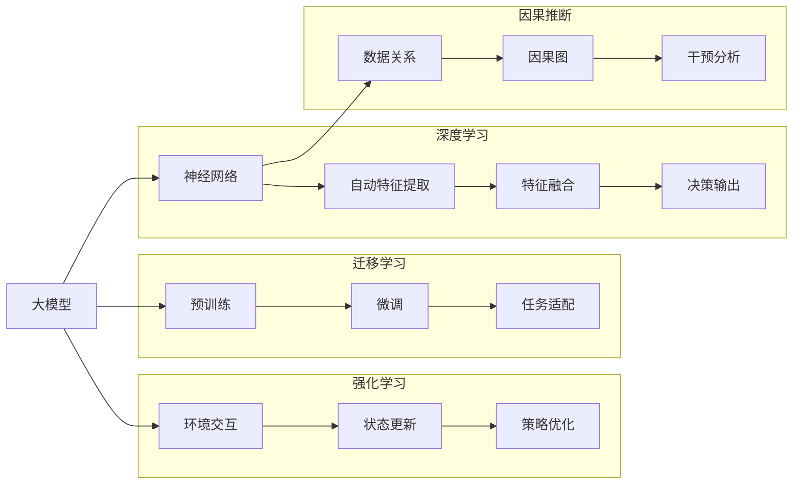

                 

# AI 大模型计算机科学家群英传：图灵

## 1. 背景介绍

### 1.1 问题由来
在计算机科学领域，图灵奖（Turing Award）是最高荣誉，象征着对杰出科学家的认可。众多图灵奖得主在人工智能和计算理论领域做出了重要贡献，推动了科技的进步。从信息论到机器学习，从计算机体系结构到编程语言，他们的研究成果不仅深远影响着计算机科学的发展方向，也对现代社会产生了重要影响。

### 1.2 问题核心关键点
在人工智能特别是大模型领域，图灵奖得主们的贡献尤为突出。从提出神经网络概念的Carver Mead到深度学习先驱Geoffrey Hinton，再到大模型领域的AI神童Ilya Sutskever和团队，这些图灵奖得主的研究推动了计算机科学的前沿进展，也为未来的研究方向指明了方向。

图灵奖得主们的研究不仅改变了学术界，也深刻影响了工业界。谷歌、微软、Facebook等科技巨头通过应用这些研究，构建了强大的AI技术基础设施，推动了人工智能在各行业的应用，从自动化、增强现实到自然语言处理、图像识别等，AI技术正逐渐改变着人类的生产生活方式。

## 2. 核心概念与联系

### 2.1 核心概念概述

本节将介绍几个关键概念：

- **大模型（Large Model）**：指具有数亿乃至数十亿参数的神经网络模型，如GPT-3、BERT等。这些模型通过大量数据预训练，具备强大的语言理解和生成能力，广泛应用于自然语言处理（NLP）、计算机视觉等领域。

- **深度学习（Deep Learning）**：通过构建多层神经网络，深度学习模型能够自动学习输入数据的高阶特征，广泛应用于语音识别、图像分类、自然语言处理等任务。

- **迁移学习（Transfer Learning）**：利用预训练模型作为初始化参数，通过微调适应特定任务，能够在数据量有限的情况下提升模型性能。

- **强化学习（Reinforcement Learning）**：通过奖励机制引导模型进行优化，在复杂环境中进行决策和策略学习，广泛应用于游戏AI、机器人控制等领域。

- **因果推断（Causal Inference）**：研究如何从观测数据中推断因果关系，用于理解因果结构、评估政策效果等，是大模型应用中的重要组成部分。

这些概念构成了人工智能技术的基石，图灵奖得主们的研究也深刻影响了这些领域的进展。

### 2.2 核心概念原理和架构的 Mermaid 流程图



## 3. 核心算法原理 & 具体操作步骤

### 3.1 算法原理概述

本节将介绍几个关键算法的原理：

- **神经网络（Neural Network）**：通过多层非线性变换，神经网络能够自动学习输入数据的特征表示。

- **深度学习模型架构**：包括卷积神经网络（CNN）、循环神经网络（RNN）、变分自编码器（VAE）等，用于解决不同类型的问题。

- **迁移学习（Transfer Learning）**：通过预训练模型的初始化，小规模数据集上的微调能够显著提升模型性能。

- **强化学习算法**：包括Q-learning、SARSA、Deep Q-learning等，通过奖励机制引导模型优化决策策略。

- **因果推断算法**：包括PC算法、G-estimation等，用于从观测数据中推断因果关系。

### 3.2 算法步骤详解

以下以深度学习模型的迁移学习为例，详细讲解其实现步骤：

1. **准备数据集**：收集任务相关的数据集，通常需要标注数据和未标注数据。

2. **选择预训练模型**：选择合适的预训练模型作为初始化参数，如BERT、GPT等。

3. **微调模型**：通过任务特定的损失函数和优化器，对预训练模型进行微调，优化模型的性能。

4. **评估模型**：在验证集和测试集上评估模型性能，选择最优模型。

5. **部署应用**：将微调后的模型应用到实际场景中，进行推理和预测。

### 3.3 算法优缺点

深度学习模型的迁移学习具有以下优点：

- **高效性**：在大规模预训练的基础上，小规模数据集的微调可以显著提升模型性能。
- **通用性**：经过预训练，模型能够适应多种任务，具有较强的泛化能力。
- **可扩展性**：在大规模数据集上进行预训练，可以通过微调适应更多任务，实现知识的迁移。

同时，也存在一些缺点：

- **数据依赖**：预训练模型需要大量标注数据，获取标注数据成本较高。
- **模型复杂度**：大模型参数众多，计算和存储成本较高。
- **过拟合风险**：小规模数据集上的微调可能存在过拟合风险，需要正则化等技术控制。

### 3.4 算法应用领域

深度学习模型的迁移学习已经在NLP、图像识别、自然语言处理等领域得到了广泛应用，以下是几个典型案例：

- **NLP**：如BERT、GPT等预训练模型在文本分类、情感分析、机器翻译等任务上的微调。
- **图像识别**：通过在大规模图像数据集上进行预训练，然后在小规模任务上微调，如ImageNet上的预训练模型在COCO数据集上的微调。
- **自然语言处理**：通过预训练生成式语言模型，如GPT-2、XLNet等，在生成对话、文本摘要等任务上的微调。
- **推荐系统**：通过在用户行为数据集上进行微调，优化推荐模型，提升推荐效果。
- **智能控制**：在机器人控制、自动驾驶等场景中，通过预训练和微调，优化决策策略，提高系统性能。

## 4. 数学模型和公式 & 详细讲解 & 举例说明

### 4.1 数学模型构建

以一个简单的线性回归模型为例，介绍数学模型的构建过程。

假设有一个数据集 $D = \{(x_i, y_i)\}_{i=1}^N$，其中 $x_i \in \mathbb{R}^d$ 为输入特征，$y_i \in \mathbb{R}$ 为输出标签。

设线性回归模型为 $y_i = \theta_0 + \theta_1 x_{i1} + \cdots + \theta_d x_{id}$，其中 $\theta_0, \theta_1, \cdots, \theta_d$ 为模型参数。

定义损失函数为均方误差损失：

$$
\mathcal{L}(\theta) = \frac{1}{N} \sum_{i=1}^N (y_i - \theta_0 - \theta_1 x_{i1} - \cdots - \theta_d x_{id})^2
$$

最小化损失函数即可得到最优参数。

### 4.2 公式推导过程

以下以线性回归模型的最小二乘法为例，推导损失函数的最小化过程：

将损失函数对参数 $\theta$ 求偏导数，得到：

$$
\frac{\partial \mathcal{L}(\theta)}{\partial \theta_k} = -2\sum_{i=1}^N (y_i - \theta_0 - \theta_1 x_{i1} - \cdots - \theta_d x_{id})
$$

令偏导数等于0，得到：

$$
\sum_{i=1}^N (y_i - \theta_0 - \theta_1 x_{i1} - \cdots - \theta_d x_{id}) x_{ik} = 0 \quad (k=0,1,\cdots,d)
$$

解上述方程组，得到最优参数 $\theta_0, \theta_1, \cdots, \theta_d$。

### 4.3 案例分析与讲解

以NLP领域中的BERT模型为例，介绍其预训练和微调过程。

BERT模型的预训练任务包括掩码语言模型（Masked Language Modeling）和下一句预测（Next Sentence Prediction），通过在大规模无标注文本语料上进行自监督预训练，学习通用的语言表示。

微调BERT模型时，将预训练模型作为初始化参数，在任务特定的损失函数和优化器的作用下，对模型的最后几层进行微调，以适应特定的下游任务，如文本分类、情感分析、命名实体识别等。

## 5. 项目实践：代码实例和详细解释说明

### 5.1 开发环境搭建

搭建深度学习模型的开发环境需要以下几个步骤：

1. **安装Python**：选择一个合适的Python版本，如3.7或更高。

2. **安装深度学习框架**：如TensorFlow、PyTorch等，并设置虚拟环境。

3. **安装相关库**：如NumPy、SciPy、Matplotlib等，用于数据处理和可视化。

4. **准备数据集**：收集任务相关的数据集，并进行预处理。

5. **选择预训练模型**：选择合适的预训练模型作为初始化参数，如BERT、GPT等。

### 5.2 源代码详细实现

以下以BERT模型在文本分类任务上的微调为例，给出完整的代码实现：

```python
import torch
import torch.nn as nn
import torch.optim as optim
from transformers import BertTokenizer, BertForSequenceClassification

# 准备数据集
tokenizer = BertTokenizer.from_pretrained('bert-base-uncased')
train_data = load_train_data()
test_data = load_test_data()

# 构建模型
model = BertForSequenceClassification.from_pretrained('bert-base-uncased', num_labels=2)

# 定义损失函数和优化器
criterion = nn.CrossEntropyLoss()
optimizer = optim.Adam(model.parameters(), lr=2e-5)

# 训练模型
model.train()
for batch in train_data:
    inputs, labels = batch
    outputs = model(inputs)
    loss = criterion(outputs, labels)
    optimizer.zero_grad()
    loss.backward()
    optimizer.step()

# 评估模型
model.eval()
with torch.no_grad():
    for batch in test_data:
        inputs, labels = batch
        outputs = model(inputs)
        loss = criterion(outputs, labels)
        print(f"Loss: {loss.item()}")
```

### 5.3 代码解读与分析

以上代码实现了BERT模型在文本分类任务上的微调过程。具体解读如下：

1. **数据集准备**：使用BertTokenizer对文本进行分词，并将文本转换为模型可接受的输入格式。

2. **模型构建**：选择BERT模型作为初始化参数，并指定输出层为二分类输出。

3. **损失函数和优化器**：使用交叉熵损失函数和Adam优化器进行微调。

4. **训练模型**：在训练数据上使用mini-batch训练模型，并计算损失函数，更新模型参数。

5. **评估模型**：在测试数据上评估模型性能，输出损失函数值。

### 5.4 运行结果展示

在训练过程中，可以通过打印输出损失函数值来观察模型的训练效果。训练完成后，可以在测试数据上评估模型的性能，输出预测结果和准确率。

## 6. 实际应用场景

深度学习模型的迁移学习已经在多个领域得到广泛应用，以下是几个典型案例：

- **智能客服**：基于BERT等大模型微调的对话系统，可以7x24小时不间断服务，快速响应客户咨询，提供自然流畅的语言解答。

- **金融舆情监测**：通过微调BERT模型，实时监测金融领域相关的新闻、报道、评论等文本数据，自动判断文本主题和情感倾向，及时预警负面信息，规避金融风险。

- **个性化推荐**：通过微调BERT模型，根据用户浏览、点击、评论、分享等行为数据，提取和用户交互的物品标题、描述、标签等文本内容，生成个性化推荐列表，提升推荐效果。

- **医疗诊断**：通过微调BERT模型，实现对医疗影像的自动分析和诊断，辅助医生诊疗，加速新药开发进程。

- **智慧城市**：通过微调BERT模型，实现对城市事件的监测、舆情分析、应急指挥等功能，提升城市管理的自动化和智能化水平，构建更安全、高效的未来城市。

## 7. 工具和资源推荐

### 7.1 学习资源推荐

1. **《深度学习》课程**：斯坦福大学的CS231n《深度学习》课程，深入浅出地介绍了深度学习的原理和应用。

2. **《Python深度学习》书籍**：François Chollet的《Python深度学习》，介绍了TensorFlow、Keras等深度学习框架的使用方法。

3. **《TensorFlow官方文档》**：谷歌官方提供的TensorFlow文档，包含丰富的代码样例和教程，适合快速入门。

4. **Kaggle竞赛平台**：Kaggle提供了大量数据集和竞赛任务，适合实践深度学习算法。

5. **GitHub开源项目**：Github上有大量开源深度学习项目，可以学习和借鉴。

### 7.2 开发工具推荐

1. **Jupyter Notebook**：免费的Jupyter Notebook环境，适合快速迭代实验。

2. **Google Colab**：免费的Google云环境，可以访问GPU和TPU，适合大模型训练。

3. **TensorFlow**：由谷歌主导开发的深度学习框架，生产部署方便，适合大规模工程应用。

4. **PyTorch**：灵活的动态计算图框架，适合快速迭代研究。

5. **Weights & Biases**：模型训练的实验跟踪工具，可以记录和可视化模型训练过程中的各项指标。

### 7.3 相关论文推荐

1. **《深度学习》书籍**：Ian Goodfellow的《深度学习》，全面介绍了深度学习的理论基础和应用。

2. **《TensorFlow实战》书籍**：Andrej Karpathy的《TensorFlow实战》，介绍了TensorFlow的使用方法。

3. **《Reinforcement Learning: An Introduction》书籍**：Richard Sutton和Andrew Barto的《Reinforcement Learning: An Introduction》，介绍了强化学习的理论基础和算法实现。

4. **《Causal Inference》书籍**：Judea Pearl的《Causal Inference》，介绍了因果推断的理论基础和应用方法。

## 8. 总结：未来发展趋势与挑战

### 8.1 研究成果总结

深度学习模型的迁移学习已经在多个领域取得了显著进展，提升了模型的性能和应用范围。

### 8.2 未来发展趋势

1. **模型规模持续增大**：随着算力成本的下降和数据规模的扩张，预训练语言模型的参数量还将持续增长，带来更大的语言表示能力。

2. **迁移学习范式多样化**：除了传统的迁移学习，未来还会涌现更多参数高效和计算高效的迁移学习范式，如AdaLoRA、Prefix-Tuning等。

3. **持续学习成为常态**：随着数据分布的变化，微调模型需要持续学习新知识，保持性能。

4. **标注样本需求降低**：通过Prompt Learning等方法，未来的迁移学习将更好地利用大模型的语言理解能力，降低对标注样本的依赖。

5. **多模态迁移学习崛起**：融合视觉、语音等多模态数据的迁移学习将进一步提升模型对现实世界的理解和建模能力。

### 8.3 面临的挑战

1. **数据依赖**：大模型预训练需要大量标注数据，获取高质量标注数据的成本较高。

2. **模型复杂度**：大模型参数众多，计算和存储成本较高。

3. **过拟合风险**：小规模数据集上的微调可能存在过拟合风险，需要正则化等技术控制。

### 8.4 研究展望

未来，深度学习模型的迁移学习需要关注以下几个方向：

1. **无监督和半监督迁移学习**：摆脱对大规模标注数据的依赖，利用自监督学习、主动学习等无监督和半监督范式。

2. **参数高效迁移学习**：开发更加参数高效的迁移学习方法，如Prefix-Tuning、LoRA等。

3. **多模态迁移学习**：融合视觉、语音等多模态数据，提升模型的泛化能力和鲁棒性。

4. **因果推断和强化学习**：将因果推断和强化学习与迁移学习结合，提升模型的决策能力和策略优化。

5. **伦理性迁移学习**：引入伦理导向的评估指标，过滤和惩罚有偏见、有害的输出倾向。

## 9. 附录：常见问题与解答

### Q1: 深度学习模型的迁移学习是否适用于所有NLP任务？

A: 深度学习模型的迁移学习在大多数NLP任务上都能取得不错的效果，特别是对于数据量较小的任务。但对于一些特定领域的任务，如医学、法律等，仅仅依靠通用语料预训练的模型可能难以很好地适应。此时需要在特定领域语料上进一步预训练，再进行微调，才能获得理想效果。

### Q2: 如何选择深度学习模型的初始化参数？

A: 在选择深度学习模型的初始化参数时，通常会选择预训练模型作为初始化参数，如BERT、GPT等。这些预训练模型在通用语料上进行了大量训练，具备较强的语言表示能力。

### Q3: 深度学习模型的迁移学习过程中如何避免过拟合？

A: 深度学习模型的迁移学习过程中，可以通过以下方法避免过拟合：

1. **数据增强**：通过回译、近义替换等方式扩充训练集。

2. **正则化**：使用L2正则、Dropout等技术控制过拟合。

3. **对抗训练**：引入对抗样本，提高模型鲁棒性。

4. **参数高效迁移学习**：只调整少量参数，减少过拟合风险。

### Q4: 深度学习模型的迁移学习在实际应用中需要注意哪些问题？

A: 深度学习模型的迁移学习在实际应用中需要注意以下问题：

1. **模型裁剪**：去除不必要的层和参数，减小模型尺寸，加快推理速度。

2. **量化加速**：将浮点模型转为定点模型，压缩存储空间，提高计算效率。

3. **服务化封装**：将模型封装为标准化服务接口，便于集成调用。

4. **弹性伸缩**：根据请求流量动态调整资源配置，平衡服务质量和成本。

5. **监控告警**：实时采集系统指标，设置异常告警阈值，确保服务稳定性。

### Q5: 如何评估深度学习模型的迁移学习效果？

A: 深度学习模型的迁移学习效果可以通过以下指标进行评估：

1. **准确率**：在测试数据上计算模型预测的准确率。

2. **精确率、召回率、F1值**：在二分类或多分类任务上计算模型的精确率、召回率、F1值等指标。

3. **ROC曲线、AUC值**：在二分类任务上计算模型的ROC曲线和AUC值。

4. **模型性能比较**：将微调后的模型与未微调的预训练模型进行比较，评估微调效果。

---

作者：禅与计算机程序设计艺术 / Zen and the Art of Computer Programming

