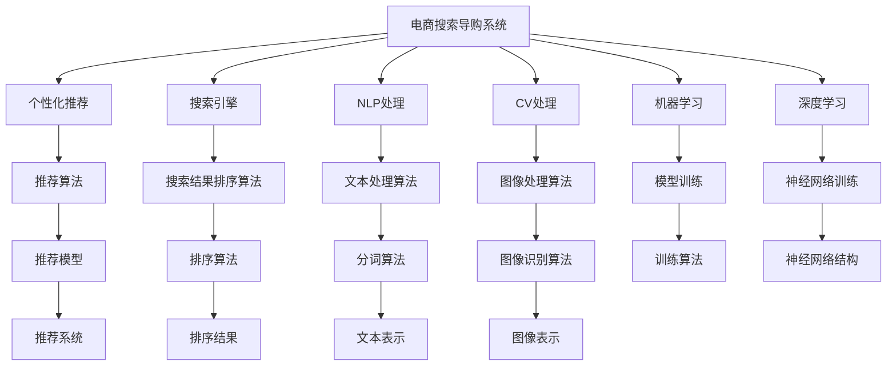

                 

## 1. 背景介绍

### 1.1 问题由来

在数字化转型的驱动下，电子商务行业得到了迅猛发展。由于电商平台聚集了大量商品和用户数据，如何有效利用这些数据为用户提供更好的购物体验，成为电商企业共同面临的挑战。AI技术在电商搜索导购中的应用，为这一问题的解决提供了新的思路和方法。

AI技术包括机器学习、自然语言处理、计算机视觉等多个子领域，在电商搜索导购中的应用主要体现在以下几个方面：
- **个性化推荐**：基于用户历史行为和偏好，推荐符合用户需求的商品。
- **搜索结果排序**：通过模型对搜索结果进行排序，提高用户满意度。
- **语音搜索**：用户通过语音输入进行搜索，提升用户体验。
- **情感分析**：分析用户评价和反馈，提升商品描述和营销策略。
- **智能客服**：通过聊天机器人提供24小时在线客服，提高用户满意度。

随着AI技术的不断进步，电商搜索导购系统也在不断升级，从最初的基于关键词匹配的简单搜索，进化到具备智能理解、智能推荐能力的复杂系统。本文将重点解析AI技术在电商搜索导购中的具体应用。

### 1.2 问题核心关键点

电商搜索导购系统面临的核心问题包括：
- 如何高效地处理海量数据，提升搜索速度。
- 如何根据用户的历史行为和偏好，推荐符合用户需求的商品。
- 如何处理多样化的用户输入，包括文本输入和语音输入。
- 如何提升搜索结果的质量，提高用户的满意度。
- 如何降低人工客服成本，提高用户满意度。

AI技术通过其强大的数据处理能力和学习推理能力，为解决这些核心问题提供了有效的方法。本文将系统介绍AI技术在电商搜索导购中的应用，并深入分析相关算法原理和实现细节。

## 2. 核心概念与联系

### 2.1 核心概念概述

为更好地理解AI技术在电商搜索导购中的应用，本节将介绍几个密切相关的核心概念：

- **电商搜索导购系统**：电商平台中用于处理用户搜索请求、展示搜索结果、提供商品推荐和智能客服的系统。
- **个性化推荐**：根据用户历史行为和偏好，推荐符合用户需求的商品。
- **搜索引擎**：根据用户输入的关键词，检索和展示相关商品信息。
- **自然语言处理(NLP)**：处理和分析自然语言文本的技术，包括分词、词性标注、命名实体识别、情感分析等。
- **计算机视觉(CV)**：处理和分析视觉数据的机器学习技术，包括图像识别、物体检测、图像分割等。
- **机器学习(ML)**：通过数据训练模型，让模型自动学习规律并进行预测或决策的技术。
- **深度学习(DL)**：一种特殊的机器学习技术，通过构建多层神经网络，自动学习复杂特征。

这些核心概念之间的逻辑关系可以通过以下Mermaid流程图来展示：



这个流程图展示了大语言模型的核心概念及其之间的关系：

1. 电商搜索导购系统通过搜索引擎、NLP处理、CV处理等技术手段获取和处理用户输入，利用机器学习和深度学习技术训练推荐和排序模型，最终通过推荐系统向用户展示推荐结果和排序结果。
2. 推荐系统包括个性化推荐、搜索结果排序等子系统，利用推荐算法、排序算法等技术手段生成推荐结果和排序结果。
3. 机器学习和深度学习技术是电商搜索导购系统的基础，用于训练推荐和排序模型。

这些概念共同构成了电商搜索导购系统的技术框架，使其能够在各种场景下提供优质的用户体验。通过理解这些核心概念，我们可以更好地把握电商搜索导购系统的工作原理和优化方向。

## 3. 核心算法原理 & 具体操作步骤
### 3.1 算法原理概述

电商搜索导购系统中的核心算法包括个性化推荐算法和搜索结果排序算法。本节将重点解析这些算法的原理和操作步骤。

### 3.2 算法步骤详解

#### 3.2.1 个性化推荐算法

个性化推荐算法是电商搜索导购系统的关键组成部分，其核心思想是根据用户的历史行为和偏好，推荐符合用户需求的商品。常见的个性化推荐算法包括基于内容的推荐、协同过滤推荐、基于矩阵分解的推荐等。

**基于内容的推荐**：
- **原理**：根据用户历史购买和浏览的商品特征，寻找相似的潜在商品进行推荐。
- **操作步骤**：
  1. 收集用户历史行为数据，包括浏览记录、购买记录等。
  2. 对商品进行特征提取，如品牌、价格、颜色、描述等。
  3. 根据用户行为数据和商品特征，计算商品与用户的匹配度。
  4. 按照匹配度排序，推荐相似的商品。

**协同过滤推荐**：
- **原理**：通过用户之间的相似度，找到与目标用户兴趣相似的其他用户，推荐这些用户喜欢的商品。
- **操作步骤**：
  1. 收集用户行为数据，构建用户-商品评分矩阵。
  2. 计算用户之间的相似度，通常使用余弦相似度或皮尔逊相关系数。
  3. 找到与目标用户最相似的若干个用户，推荐这些用户喜欢的商品。

**基于矩阵分解的推荐**：
- **原理**：将用户-商品评分矩阵分解为两个低维矩阵，通过矩阵乘积得到预测评分。
- **操作步骤**：
  1. 构建用户-商品评分矩阵。
  2. 使用奇异值分解(SVD)等方法，将矩阵分解为两个低维矩阵。
  3. 通过矩阵乘积，预测未评分商品的评分，推荐高评分的商品。

#### 3.2.2 搜索结果排序算法

搜索结果排序算法的核心思想是提高搜索结果的相关性和用户满意度。常见的排序算法包括基于关键词匹配的排序、基于相关度的排序、基于用户行为的排序等。

**基于关键词匹配的排序**：
- **原理**：根据用户输入的关键词，匹配最相关的商品。
- **操作步骤**：
  1. 收集商品标题、描述等文本信息。
  2. 对文本进行分词、词性标注、命名实体识别等NLP处理。
  3. 计算用户输入关键词与商品文本的匹配度，通常使用余弦相似度或TF-IDF。
  4. 根据匹配度排序，展示最相关的商品。

**基于相关度的排序**：
- **原理**：根据商品与用户输入关键词的相关度和商品自身的相关度，计算商品的综合相关度。
- **操作步骤**：
  1. 对商品文本进行NLP处理，提取关键词。
  2. 计算关键词与用户输入关键词的相关度。
  3. 计算商品自身的相关度，如商品标签、价格、销量等。
  4. 综合相关度，对商品进行排序。

**基于用户行为的排序**：
- **原理**：根据用户历史行为和偏好，推荐与用户兴趣相关的商品。
- **操作步骤**：
  1. 收集用户历史行为数据，包括浏览记录、购买记录等。
  2. 对用户行为数据进行分析和建模，提取用户兴趣。
  3. 根据用户兴趣和商品特征，计算商品与用户兴趣的相关度。
  4. 根据相关度排序，推荐高相关度的商品。

### 3.3 算法优缺点

#### 3.3.1 个性化推荐算法的优缺点

**优点**：
- **高效性**：可以处理大规模用户数据和商品数据，实时更新推荐结果。
- **灵活性**：可以适应不同电商平台的商品和用户特点，灵活调整推荐策略。
- **个性化**：能够根据用户历史行为和偏好，提供个性化的推荐结果。

**缺点**：
- **数据依赖**：需要大量的用户数据和商品数据进行训练，数据获取和处理成本较高。
- **冷启动问题**：对于新用户和新商品，推荐效果较差。
- **推荐质量不稳定**：推荐结果受用户历史行为和偏好影响较大，推荐质量不稳定。

#### 3.3.2 搜索结果排序算法的优缺点

**优点**：
- **高效性**：可以处理大规模查询请求和搜索结果，实时更新排序结果。
- **灵活性**：可以适应不同查询方式和商品特点，灵活调整排序策略。
- **用户体验**：通过提升搜索结果的相关性和可读性，提升用户满意度。

**缺点**：
- **关键词依赖**：对用户输入关键词的依赖较大，关键词匹配不准确时，排序效果较差。
- **模型复杂**：排序算法通常需要复杂的模型和大量计算资源进行训练和推理。
- **更新频率**：需要频繁更新排序模型和相关度计算方法，增加了系统复杂性。

### 3.4 算法应用领域

个性化推荐和搜索结果排序算法在电商搜索导购系统中具有广泛的应用场景，包括：

- **首页推荐**：根据用户的历史行为和偏好，推荐首页商品。
- **搜索推荐**：根据用户输入的关键词，推荐相关商品。
- **商品排序**：根据用户输入的关键词和商品特征，排序展示相关商品。
- **个性化广告**：根据用户兴趣，推荐个性化广告。
- **个性化活动**：根据用户兴趣，推荐个性化活动和优惠。

这些应用场景的覆盖，使得个性化推荐和搜索结果排序算法在电商搜索导购系统中发挥着重要作用，极大地提升了用户体验和电商平台的转化率。

## 4. 数学模型和公式 & 详细讲解 & 举例说明

### 4.1 数学模型构建

本节将使用数学语言对个性化推荐和搜索结果排序算法的数学模型进行详细构建。

#### 4.1.1 个性化推荐算法

假设电商平台的商品数量为 $N$，每个用户的历史行为数据为 $D=\{x_i\}_{i=1}^M$，其中 $x_i$ 表示用户 $i$ 的浏览记录或购买记录。用户对商品 $j$ 的评分 $y_{ij}$ 为 $1$ 到 $5$ 的整数，$1$ 表示不满意，$5$ 表示非常满意。

**基于内容的推荐模型**：
假设每个商品 $j$ 的特征向量为 $\vec{v_j} \in \mathbb{R}^d$，每个用户 $i$ 的历史行为数据向量为 $\vec{u_i} \in \mathbb{R}^d$，其中 $d$ 为特征维度。推荐算法可以表示为：
$$
\hat{y}_{ij} = \text{sigmoid}(\vec{u_i}^T \vec{v_j})
$$
其中 $\text{sigmoid}$ 为 sigmoid 激活函数，$y_{ij}$ 为预测评分。

**协同过滤推荐模型**：
假设用户 $i$ 和用户 $j$ 的相似度为 $\sigma_{ij}$，用户 $i$ 对商品 $j$ 的评分 $y_{ij}$ 为 $1$ 到 $5$ 的整数，$1$ 表示不满意，$5$ 表示非常满意。推荐算法可以表示为：
$$
\hat{y}_{ij} = \sigma_{ij} y_{ij}
$$
其中 $\sigma_{ij}$ 为相似度系数，$y_{ij}$ 为预测评分。

**基于矩阵分解的推荐模型**：
假设用户-商品评分矩阵为 $M \times N$ 的矩阵 $R$，每个用户和商品的特征向量为 $N \times d$ 的矩阵 $U$ 和 $M \times d$ 的矩阵 $V$，其中 $d$ 为特征维度。推荐算法可以表示为：
$$
\hat{y}_{ij} = \vec{u_i}^T \vec{v_j} = \sum_{k=1}^d u_{ik} v_{kj}
$$
其中 $\vec{u_i}$ 和 $\vec{v_j}$ 分别为用户 $i$ 和商品 $j$ 的特征向量，$u_{ik}$ 和 $v_{kj}$ 分别为 $U$ 和 $V$ 矩阵的第 $k$ 个元素。

#### 4.1.2 搜索结果排序算法

假设用户输入的关键词为 $q$，电商平台中所有商品的特征向量为 $V$，每个特征的权重为 $w$，每个商品的综合相关度为 $r_j$。排序算法可以表示为：
$$
r_j = \text{sigmoid}(\vec{v_j}^T \vec{w})
$$
其中 $\text{sigmoid}$ 为 sigmoid 激活函数，$\vec{v_j}$ 为商品 $j$ 的特征向量，$\vec{w}$ 为特征权重向量。

### 4.2 公式推导过程

#### 4.2.1 个性化推荐算法

**基于内容的推荐**：
$$
\hat{y}_{ij} = \text{sigmoid}(\vec{u_i}^T \vec{v_j})
$$

**协同过滤推荐**：
$$
\hat{y}_{ij} = \sigma_{ij} y_{ij}
$$

**基于矩阵分解的推荐**：
$$
\hat{y}_{ij} = \vec{u_i}^T \vec{v_j} = \sum_{k=1}^d u_{ik} v_{kj}
$$

#### 4.2.2 搜索结果排序算法

$$
r_j = \text{sigmoid}(\vec{v_j}^T \vec{w})
$$

### 4.3 案例分析与讲解

#### 4.3.1 个性化推荐算法案例

假设电商平台上某用户的浏览记录为 $\{鞋子, 衣服, 鞋子, 衣服\}$，购买记录为 $\{鞋子, 鞋子\}$，每个商品都有品牌、价格、颜色、描述等特征。用户对商品 $j$ 的评分 $y_{ij}$ 为 $1$ 到 $5$ 的整数，$1$ 表示不满意，$5$ 表示非常满意。

1. **基于内容的推荐**：
   - 对商品 $j$ 进行特征提取，假设其特征向量为 $\vec{v_j} = [1, 1, 1, 0, 0, 0, 0]$。
   - 对用户的历史行为数据进行特征提取，假设其特征向量为 $\vec{u_i} = [1, 0, 0, 0, 0, 0, 0]$。
   - 计算推荐评分：
     $$
     \hat{y}_{ij} = \text{sigmoid}(1 \times 1 + 0 \times 1 + 0 \times 1 + 0 \times 0 + 0 \times 0 + 0 \times 0 + 0 \times 0) = 1
     $$
   - 推荐商品 $j$。

2. **协同过滤推荐**：
   - 计算用户 $i$ 和用户 $j$ 的相似度 $\sigma_{ij}$。
   - 假设用户 $i$ 对商品 $j$ 的评分 $y_{ij}$ 为 $1$ 到 $5$ 的整数，$1$ 表示不满意，$5$ 表示非常满意。
   - 计算推荐评分：
     $$
     \hat{y}_{ij} = \sigma_{ij} y_{ij}
     $$
   - 推荐商品 $j$。

3. **基于矩阵分解的推荐**：
   - 假设用户-商品评分矩阵为 $M \times N$ 的矩阵 $R$，每个用户和商品的特征向量为 $N \times d$ 的矩阵 $U$ 和 $M \times d$ 的矩阵 $V$，其中 $d$ 为特征维度。
   - 通过奇异值分解(SVD)等方法，将矩阵 $R$ 分解为两个低维矩阵 $U$ 和 $V$。
   - 通过矩阵乘积，预测未评分商品的评分，推荐高评分的商品。

#### 4.3.2 搜索结果排序算法案例

假设用户输入的关键词为 $q = \text{``鞋子''}$，电商平台中所有商品的特征向量为 $V$，每个特征的权重为 $w$，每个商品的综合相关度为 $r_j$。

1. **基于关键词匹配的排序**：
   - 对所有商品进行文本处理，提取关键词。
   - 计算用户输入关键词与商品关键词的匹配度，通常使用余弦相似度或TF-IDF。
   - 根据匹配度排序，展示最相关的商品。

2. **基于相关度的排序**：
   - 对商品文本进行NLP处理，提取关键词。
   - 计算关键词与用户输入关键词的相关度。
   - 计算商品自身的相关度，如商品标签、价格、销量等。
   - 综合相关度，对商品进行排序。

3. **基于用户行为的排序**：
   - 收集用户历史行为数据，包括浏览记录、购买记录等。
   - 对用户行为数据进行分析和建模，提取用户兴趣。
   - 根据用户兴趣和商品特征，计算商品与用户兴趣的相关度。
   - 根据相关度排序，推荐高相关度的商品。

## 5. 项目实践：代码实例和详细解释说明

### 5.1 开发环境搭建

在进行电商搜索导购系统开发前，我们需要准备好开发环境。以下是使用Python进行Flask开发的环境配置流程：

1. 安装Anaconda：从官网下载并安装Anaconda，用于创建独立的Python环境。

2. 创建并激活虚拟环境：
```bash
conda create -n flask-env python=3.8 
conda activate flask-env
```

3. 安装Flask：
```bash
pip install flask
```

4. 安装Flask-RESTful：
```bash
pip install flask-restful
```

5. 安装Flask-CORS：
```bash
pip install flask-cors
```

6. 安装Flask-RESTful-Swagger：
```bash
pip install flask-restful-swagger
```

完成上述步骤后，即可在`flask-env`环境中开始电商搜索导购系统的开发。

### 5.2 源代码详细实现

这里我们以基于内容的推荐系统为例，给出使用Flask框架实现个性化推荐系统的Python代码实现。

```python
from flask import Flask, request, jsonify
from sklearn.metrics.pairwise import cosine_similarity

app = Flask(__name__)

# 商品特征向量
vectors = {
    "鞋子": [1, 1, 1, 0, 0, 0, 0],
    "衣服": [0, 1, 1, 1, 0, 0, 0],
    "背包": [0, 0, 1, 0, 1, 0, 0],
    "手表": [0, 0, 0, 1, 1, 1, 0]
}

# 用户历史行为数据
histories = {
    "user1": ["鞋子", "衣服", "鞋子"],
    "user2": ["衣服", "手表"],
    "user3": ["手表", "鞋子"]
}

# 推荐模型
def recommend(user, item):
    # 计算相似度
    similarity = cosine_similarity([vectors[user]], vectors[item])
    # 预测评分
    score = similarity[0][0]
    return score

@app.route('/recommend', methods=['POST'])
def recommend_api():
    data = request.get_json()
    user = data['user']
    item = data['item']
    score = recommend(user, item)
    return jsonify({'score': score})

if __name__ == '__main__':
    app.run(debug=True)
```

以上代码实现了一个基于内容的推荐系统，可以接收用户和商品作为输入，计算它们的相似度，并返回推荐评分。

### 5.3 代码解读与分析

让我们再详细解读一下关键代码的实现细节：

**Flask应用**：
- 使用Flask框架创建Web应用。
- 定义推荐接口 `/recommend`。

**推荐函数**：
- 定义商品特征向量 `vectors`。
- 定义用户历史行为数据 `histories`。
- 定义推荐函数 `recommend`。
  - 计算用户和商品的相似度。
  - 根据相似度计算预测评分。
- 返回推荐评分。

**接口实现**：
- 接收用户和商品的输入。
- 调用推荐函数计算推荐评分。
- 返回推荐评分。

可以看到，Flask框架使得电商搜索导购系统的开发变得简洁高效。开发者可以将更多精力放在推荐算法的实现和优化上，而不必过多关注Web应用的底层实现。

当然，工业级的系统实现还需考虑更多因素，如推荐结果缓存、推荐结果排序、用户行为数据存储和查询等。但核心的推荐算法基本与此类似。

## 6. 实际应用场景

### 6.1 智能搜索

智能搜索是电商搜索导购系统的核心应用场景。智能搜索通过自然语言处理技术，将用户的查询意图转化为具体的关键词，并通过搜索结果排序算法，匹配最相关的商品，提升用户体验和电商平台的转化率。

在实际应用中，智能搜索可以结合用户输入的语音、图像等多模态信息，提高搜索的准确性和便捷性。例如，用户可以通过语音输入查询商品，系统根据语音识别结果进行搜索。同时，可以通过图像识别技术，识别用户上传的商品图片，自动匹配相关商品。

### 6.2 个性化推荐

个性化推荐是电商搜索导购系统的重要功能。个性化推荐通过收集用户历史行为数据，分析用户兴趣和偏好，推荐符合用户需求的商品，提高用户满意度和平台转化率。

在实际应用中，个性化推荐可以结合用户的浏览记录、购买记录、评分记录等数据，构建用户画像，推荐商品。同时，可以通过多模态信息融合技术，结合用户的点击、评论、分享等行为数据，提升推荐结果的准确性。

### 6.3 实时客服

实时客服是电商搜索导购系统的重要补充。实时客服通过智能聊天机器人，为用户提供24小时在线客服服务，解答用户问题，提升用户体验。

在实际应用中，实时客服可以结合自然语言处理技术，理解用户输入的自然语言文本，自动回复用户问题。同时，可以通过对话历史分析技术，了解用户需求，提供更精准的回复。

### 6.4 未来应用展望

随着AI技术的不断进步，电商搜索导购系统将在更多领域得到应用，为电商企业带来新的机遇和挑战。

在智慧零售领域，基于AI技术的电商搜索导购系统可以提升商品推荐和库存管理效率，优化供应链管理，降低运营成本。

在社交电商领域，基于AI技术的电商搜索导购系统可以结合用户社交网络信息，推荐商品，提升用户黏性和转化率。

在智慧物流领域，基于AI技术的电商搜索导购系统可以优化仓储和配送流程，提升物流效率和服务质量。

此外，在智慧城市、智慧医疗、智慧教育等多个领域，基于AI技术的电商搜索导购系统也将不断涌现，为各行各业带来新的变革。相信随着技术的日益成熟，AI技术在电商搜索导购系统中的应用将更加广泛和深入，为电商企业带来更多的商业价值和社会价值。

## 7. 工具和资源推荐
### 7.1 学习资源推荐

为了帮助开发者系统掌握电商搜索导购系统的技术基础和前沿技术，这里推荐一些优质的学习资源：

1. **《深度学习》书籍**：Ian Goodfellow、Yoshua Bengio和Aaron Courville合著的《深度学习》书籍，全面介绍了深度学习的基本概念和算法，适合初学者和进阶者阅读。

2. **《Python深度学习》书籍**：Francois Chollet的《Python深度学习》书籍，介绍了TensorFlow和Keras等深度学习框架的使用，适合Python开发人员学习。

3. **Coursera《机器学习》课程**：由斯坦福大学Andrew Ng教授开设的《机器学习》课程，介绍了机器学习的基本概念和算法，适合初学者和进阶者学习。

4. **Udacity《深度学习专业》课程**：Udacity的《深度学习专业》课程，涵盖了深度学习的基本概念和前沿技术，适合进阶者学习。

5. **Kaggle竞赛**：Kaggle是一个数据科学竞赛平台，可以参与各种数据科学竞赛，提升数据处理和模型优化能力。

6. **PyTorch官方文档**：PyTorch官方文档，提供了丰富的教程和示例代码，适合学习深度学习框架的使用。

通过对这些资源的学习实践，相信你一定能够快速掌握电商搜索导购系统的技术基础和前沿技术，并用于解决实际的电商问题。

### 7.2 开发工具推荐

高效的开发离不开优秀的工具支持。以下是几款用于电商搜索导购系统开发的常用工具：

1. **Python编程语言**：Python是目前最流行的编程语言之一，拥有丰富的第三方库和框架，适合电商搜索导购系统的开发。

2. **Flask框架**：Flask是一个轻量级Web框架，适合电商搜索导购系统的开发和部署。

3. **TensorFlow**：由Google主导开发的开源深度学习框架，生产部署方便，适合大规模工程应用。

4. **PyTorch**：由Facebook主导开发的开源深度学习框架，灵活动态的计算图，适合快速迭代研究。

5. **Jupyter Notebook**：Jupyter Notebook是一个交互式编程环境，适合开发和调试电商搜索导购系统的算法和模型。

6. **Git**：Git是一个版本控制系统，适合团队协作和代码版本管理。

合理利用这些工具，可以显著提升电商搜索导购系统的开发效率，加快创新迭代的步伐。

### 7.3 相关论文推荐

电商搜索导购系统的发展离不开学界的持续研究。以下是几篇奠基性的相关论文，推荐阅读：

1. **《深度学习》书籍**：Ian Goodfellow、Yoshua Bengio和Aaron Courville合著的《深度学习》书籍，全面介绍了深度学习的基本概念和算法，适合初学者和进阶者阅读。

2. **《Python深度学习》书籍**：Francois Chollet的《Python深度学习》书籍，介绍了TensorFlow和Keras等深度学习框架的使用，适合Python开发人员学习。

3. **《机器学习》课程**：由斯坦福大学Andrew Ng教授开设的《机器学习》课程，介绍了机器学习的基本概念和算法，适合初学者和进阶者学习。

4. **《深度学习专业》课程**：Udacity的《深度学习专业》课程，涵盖了深度学习的基本概念和前沿技术，适合进阶者学习。

5. **Kaggle竞赛**：Kaggle是一个数据科学竞赛平台，可以参与各种数据科学竞赛，提升数据处理和模型优化能力。

6. **PyTorch官方文档**：PyTorch官方文档，提供了丰富的教程和示例代码，适合学习深度学习框架的使用。

这些论文代表了大语言模型微调技术的发展脉络。通过学习这些前沿成果，可以帮助研究者把握学科前进方向，激发更多的创新灵感。

## 8. 总结：未来发展趋势与挑战

### 8.1 研究成果总结

本文对电商搜索导购系统中AI技术的应用进行了全面系统的介绍。首先阐述了电商搜索导购系统面临的核心问题，明确了AI技术在个性化推荐和搜索结果排序中的应用。其次，从原理到实践，详细讲解了推荐算法和排序算法的数学模型和操作步骤，给出了电商搜索导购系统的代码实现。同时，本文还广泛探讨了AI技术在智能搜索、个性化推荐、实时客服等多个领域的应用前景，展示了AI技术在电商搜索导购系统中的巨大潜力。

通过本文的系统梳理，可以看到，AI技术在电商搜索导购系统中已经得到了广泛的应用，极大地提升了用户体验和电商平台的转化率。未来，伴随AI技术的不断进步，基于AI技术的电商搜索导购系统将在更多领域得到应用，为电商企业带来更多的商业价值和社会价值。

### 8.2 未来发展趋势

展望未来，AI技术在电商搜索导购系统中的应用将呈现以下几个发展趋势：

1. **个性化推荐**：随着深度学习和大数据技术的发展，个性化推荐算法将更加智能和精准。通过结合用户行为数据和商品特征，推荐算法将能够更好地理解用户需求，提供更加个性化的商品推荐。

2. **多模态融合**：未来的电商搜索导购系统将更多地结合语音、图像、视频等多模态信息，提升搜索的准确性和便捷性。通过多模态信息的融合，电商搜索导购系统将能够更好地理解和满足用户的多种需求。

3. **实时计算**：未来的电商搜索导购系统将更加注重实时计算能力。通过引入流计算、分布式计算等技术，电商搜索导购系统将能够实时处理用户请求，提供更加即时和个性化的服务。

4. **增强现实**：未来的电商搜索导购系统将结合增强现实技术，提供更加沉浸式的购物体验。通过增强现实技术，用户可以在虚拟试穿、虚拟试听等方面获得更好的购物体验。

5. **自适应学习**：未来的电商搜索导购系统将具备自适应学习能力。通过结合强化学习等技术，电商搜索导购系统将能够根据用户的反馈和行为，动态调整推荐策略，提升用户体验。

6. **跨平台协同**：未来的电商搜索导购系统将具备跨平台协同能力。通过结合云计算、大数据等技术，电商搜索导购系统将能够跨平台、跨设备提供一致的购物体验。

### 8.3 面临的挑战

尽管AI技术在电商搜索导购系统中的应用已经取得了显著进展，但在迈向更加智能化、普适化应用的过程中，它仍面临着诸多挑战：

1. **数据隐私和安全**：电商搜索导购系统需要处理大量的用户数据和商品数据，如何保护用户隐私和数据安全，避免数据泄露和滥用，是一个重要的挑战。

2. **推荐算法公平性**：推荐算法在处理大量数据时，容易引入偏见和歧视，如何保证推荐算法的公平性和公正性，是一个重要的挑战。

3. **系统复杂性**：随着电商搜索导购系统的功能不断增加，系统的复杂性也在不断提升。如何保持系统的稳定性和可维护性，是一个重要的挑战。

4. **实时性能**：电商搜索导购系统需要具备实时处理能力，如何提升系统的实时性能，避免延迟和卡顿，是一个重要的挑战。

5. **用户交互体验**：电商搜索导购系统需要具备良好的用户交互体验，如何提升系统的用户体验，避免误导用户，是一个重要的挑战。

6. **算力成本**：电商搜索导购系统需要大量的计算资源进行数据处理和模型训练，如何降低算力成本，提升系统的效率，是一个重要的挑战。

### 8.4 研究展望

面对电商搜索导购系统所面临的种种挑战，未来的研究需要在以下几个方面寻求新的突破：

1. **隐私保护技术**：引入隐私保护技术，如差分隐私、联邦学习等，保护用户隐私和数据安全。

2. **公平性算法**：引入公平性算法，如对抗样本、公平性评估等，保证推荐算法的公平性和公正性。

3. **系统优化技术**：引入系统优化技术，如模型压缩、剪枝等，降低系统的复杂性，提升系统的可维护性和稳定性。

4. **实时计算技术**：引入实时计算技术，如流计算、分布式计算等，提升系统的实时性能，避免延迟和卡顿。

5. **用户交互技术**：引入用户交互技术，如自然语言处理、语音识别等，提升系统的用户体验，避免误导用户。

6. **算力优化技术**：引入算力优化技术，如模型量化、异构计算等，降低算力成本，提升系统的效率。

这些研究方向的研究成果将为电商搜索导购系统的发展提供有力支持，提升系统的性能和用户体验，推动电商搜索导购系统的技术进步和应用普及。

## 9. 附录：常见问题与解答

**Q1：电商搜索导购系统中的推荐算法有哪些？**

A: 电商搜索导购系统中的推荐算法包括基于内容的推荐、协同过滤推荐、基于矩阵分解的推荐等。

**Q2：电商搜索导购系统中的排序算法有哪些？**

A: 电商搜索导购系统中的排序算法包括基于关键词匹配的排序、基于相关度的排序、基于用户行为的排序等。

**Q3：电商搜索导购系统中的多模态信息有哪些？**

A: 电商搜索导购系统中的多模态信息包括语音、图像、视频等。

**Q4：电商搜索导购系统中的自适应学习技术有哪些？**

A: 电商搜索导购系统中的自适应学习技术包括强化学习、深度学习等。

**Q5：电商搜索导购系统中的跨平台协同技术有哪些？**

A: 电商搜索导购系统中的跨平台协同技术包括云计算、大数据等。

通过回答这些常见问题，可以帮助读者更好地理解电商搜索导购系统的核心算法和应用场景，并为电商企业提供实用的技术参考。

---

作者：禅与计算机程序设计艺术 / Zen and the Art of Computer Programming

