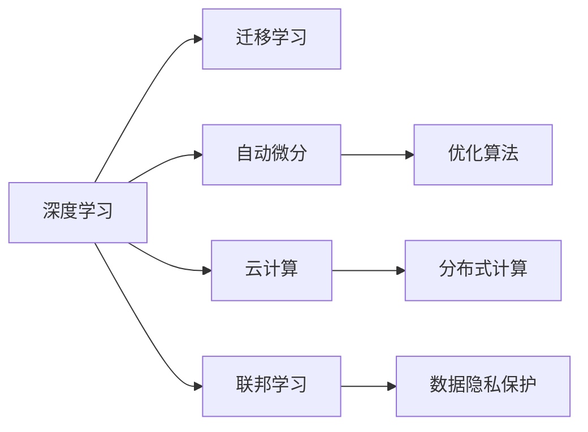

                 

# AI 技术的成本与速度优势

在当今数字化时代，人工智能（AI）技术正以前所未有的速度和规模改变着我们的生活和工作方式。从智能客服、智能推荐，到自动驾驶、医疗诊断，AI技术已经渗透到各个行业，带来了巨大的成本节约和效率提升。本文将深入探讨AI技术的成本优势和速度优势，分析其在不同场景下的具体表现，并展望未来发展的趋势和面临的挑战。

## 1. 背景介绍

### 1.1 问题由来
随着计算技术的不断进步，AI技术从科学研究实验室走向实际应用，其影响力迅速扩展。然而，大规模AI系统的部署和维护涉及高昂的计算资源、能源消耗和人力资源成本。此外，AI模型的训练和优化过程往往需要大量的数据和时间，这又进一步增加了系统的总体成本。因此，如何平衡AI技术的优势与成本，实现高效、低成本的应用，成为了一个亟待解决的问题。

### 1.2 问题核心关键点
AI技术的成本优势主要体现在以下几个方面：

- **计算资源利用效率**：AI模型可以通过深度学习等技术高效利用计算资源，显著提高计算效率和精度。
- **数据利用率**：通过优化数据处理和模型训练过程，AI技术可以在相对较少的数据下实现高性能模型。
- **自动化程度**：AI技术可以自动化许多重复性高、耗时长的任务，降低人工成本。
- **部署成本**：云计算等技术使AI系统的部署更加灵活，大大降低了硬件和维护成本。

AI技术的速度优势则体现在以下几个方面：

- **快速迭代**：AI模型可以迅速适应新的数据和任务，快速迭代优化，提升系统性能。
- **自动化决策**：AI模型可以自动化决策过程，减少人为干预，加速业务流程。
- **实时处理**：AI技术可以在数据产生的同时进行实时分析，迅速响应需求。
- **灵活性**：AI系统可以根据需求灵活调整参数和结构，快速适应不同的应用场景。

## 2. 核心概念与联系

### 2.1 核心概念概述

为了更好地理解AI技术的成本优势和速度优势，本节将介绍几个关键概念及其相互联系：

- **深度学习（Deep Learning）**：一种基于神经网络的机器学习方法，通过多层次的非线性变换，从原始数据中提取高层次的特征表示。
- **迁移学习（Transfer Learning）**：利用预训练模型在特定任务上进行微调，避免从头训练，降低计算成本。
- **自动微分（Automatic Differentiation）**：通过反向传播算法自动求导，优化模型参数，提高计算效率。
- **云计算（Cloud Computing）**：通过互联网提供按需的计算资源和服务，降低硬件采购和维护成本。
- **联邦学习（Federated Learning）**：通过分布式计算，在不泄露隐私数据的情况下，优化模型参数。

这些概念通过深度学习、迁移学习等技术，显著提升了AI系统的计算效率和数据利用率，降低了整体成本，同时通过自动微分、云计算等技术，加速了AI系统的迭代和部署。

### 2.2 核心概念原理和架构的 Mermaid 流程图



这个流程图展示了深度学习、迁移学习、自动微分、云计算和联邦学习之间的联系和相互作用。深度学习通过多层次的非线性变换提取特征，迁移学习利用预训练模型降低计算成本，自动微分和优化算法提高计算效率，云计算提供按需计算资源，联邦学习保障数据隐私。这些技术共同构成了AI技术的成本和速度优势。

## 3. 核心算法原理 & 具体操作步骤

### 3.1 算法原理概述

AI技术的成本优势和速度优势主要通过以下算法和原理实现：

- **深度学习（Deep Learning）**：通过多层神经网络，自动提取数据中的特征表示，提高了模型的泛化能力和准确性。
- **迁移学习（Transfer Learning）**：利用预训练模型在特定任务上进行微调，避免了从头训练，降低了计算成本。
- **自动微分（Automatic Differentiation）**：通过反向传播算法自动求导，优化模型参数，提高了计算效率。
- **分布式计算（Distributed Computing）**：通过并行计算，将任务分解成多个子任务，并行处理，加速了模型训练和推理。
- **联邦学习（Federated Learning）**：通过分布式计算，在不泄露隐私数据的情况下，优化模型参数，保障了数据安全。

这些算法和原理共同作用，实现了AI技术的成本优势和速度优势。

### 3.2 算法步骤详解

AI技术的成本优势和速度优势的实现主要包括以下步骤：

**Step 1: 数据准备和模型选择**
- 收集高质量的数据集，选择适当的深度学习模型。
- 利用迁移学习，选择合适的预训练模型进行微调，避免从头训练。

**Step 2: 模型训练和参数优化**
- 使用自动微分和优化算法，对模型参数进行优化。
- 利用分布式计算，加速模型训练过程。

**Step 3: 模型部署和性能监控**
- 将模型部署到云计算平台，降低硬件和维护成本。
- 利用联邦学习，保护数据隐私，同时优化模型性能。

### 3.3 算法优缺点

AI技术的成本优势和速度优势具有以下优点：

- **计算效率高**：深度学习和自动微分技术提高了模型训练和推理的效率。
- **数据利用率高**：迁移学习和联邦学习技术降低了对大规模标注数据的需求，提高了数据利用率。
- **成本低**：云计算和分布式计算降低了硬件采购和维护成本。
- **响应速度快**：实时处理和自动化决策提高了系统的响应速度和灵活性。

同时，这些技术也存在一些缺点：

- **模型复杂度高**：深度学习模型通常参数量较大，训练和推理复杂。
- **数据依赖性强**：迁移学习和联邦学习对数据质量和数据分布的要求较高。
- **计算资源消耗大**：分布式计算和云计算需要大量的计算资源和能源。
- **隐私风险高**：联邦学习需要处理大量的用户数据，隐私保护要求高。

### 3.4 算法应用领域

AI技术的成本优势和速度优势在以下领域得到了广泛应用：

- **金融风控**：利用AI模型进行信用评估、风险控制，提高决策速度和准确性，降低人工成本。
- **智能客服**：通过深度学习和迁移学习，构建智能客服系统，提升服务质量和效率，降低人力成本。
- **医疗诊断**：利用AI模型进行图像识别、疾病预测，提高诊断速度和准确性，降低误诊率。
- **智能推荐**：通过自动微分和分布式计算，构建智能推荐系统，提升推荐效果，降低计算成本。
- **自动驾驶**：通过深度学习和联邦学习，实现自动驾驶系统，提升行驶安全性和响应速度。

## 4. 数学模型和公式 & 详细讲解 & 举例说明

### 4.1 数学模型构建

为了更好地理解AI技术的成本优势和速度优势，本节将使用数学语言对相关模型进行详细讲解。

**深度学习模型**
深度学习模型通常由多层神经网络组成，每层包含多个神经元。假设深度学习模型包含 $L$ 层，每层包含 $n$ 个神经元。模型的输入为 $x$，输出为 $y$。模型的数学表达为：

$$
y = f_L(f_{L-1}(\dots f_1(x)\dots))
$$

其中 $f_i$ 为第 $i$ 层神经元的非线性变换函数。

**迁移学习模型**
迁移学习模型通常由两部分组成：预训练模型和微调层。假设预训练模型为 $M_0$，微调层为 $M_1$。模型的数学表达为：

$$
y = M_1(M_0(x))
$$

其中 $M_0$ 为预训练模型，$M_1$ 为微调层。

**自动微分模型**
自动微分模型通过反向传播算法计算损失函数的梯度。假设损失函数为 $L$，模型的数学表达为：

$$
\frac{\partial L}{\partial \theta} = \frac{\partial L}{\partial y} \cdot \frac{\partial y}{\partial z} \cdot \frac{\partial z}{\partial x} \cdot \frac{\partial x}{\partial \theta}
$$

其中 $\theta$ 为模型参数，$z$ 为模型的中间层输出，$x$ 为输入数据，$y$ 为输出结果。

**分布式计算模型**
分布式计算模型通过将任务分解成多个子任务，并行处理。假设任务 $T$ 被分解成 $K$ 个子任务，每个子任务在 $m$ 个节点上并行计算，模型的数学表达为：

$$
y = \frac{1}{K} \sum_{k=1}^K \left(\frac{1}{m} \sum_{i=1}^m y_{ki}\right)
$$

其中 $y_{ki}$ 为第 $k$ 个子任务在第 $i$ 个节点上的计算结果。

**联邦学习模型**
联邦学习模型通过分布式计算，在不泄露用户数据的情况下，优化模型参数。假设联邦学习模型在 $n$ 个用户端进行训练，每个用户端有 $m$ 个数据样本，模型的数学表达为：

$$
y = \frac{1}{n} \sum_{i=1}^n \left(\frac{1}{m} \sum_{j=1}^m y_{ij}\right)
$$

其中 $y_{ij}$ 为第 $i$ 个用户在第 $j$ 个数据样本上的计算结果。

### 4.2 公式推导过程

**深度学习模型推导**
假设深度学习模型包含 $L$ 层，每层包含 $n$ 个神经元。模型的输入为 $x$，输出为 $y$。模型的数学表达为：

$$
y = f_L(f_{L-1}(\dots f_1(x)\dots))
$$

其中 $f_i$ 为第 $i$ 层神经元的非线性变换函数。

**迁移学习模型推导**
假设预训练模型为 $M_0$，微调层为 $M_1$。模型的数学表达为：

$$
y = M_1(M_0(x))
$$

其中 $M_0$ 为预训练模型，$M_1$ 为微调层。

**自动微分模型推导**
假设损失函数为 $L$，模型的数学表达为：

$$
\frac{\partial L}{\partial \theta} = \frac{\partial L}{\partial y} \cdot \frac{\partial y}{\partial z} \cdot \frac{\partial z}{\partial x} \cdot \frac{\partial x}{\partial \theta}
$$

其中 $\theta$ 为模型参数，$z$ 为模型的中间层输出，$x$ 为输入数据，$y$ 为输出结果。

**分布式计算模型推导**
假设任务 $T$ 被分解成 $K$ 个子任务，每个子任务在 $m$ 个节点上并行计算，模型的数学表达为：

$$
y = \frac{1}{K} \sum_{k=1}^K \left(\frac{1}{m} \sum_{i=1}^m y_{ki}\right)
$$

其中 $y_{ki}$ 为第 $k$ 个子任务在第 $i$ 个节点上的计算结果。

**联邦学习模型推导**
假设联邦学习模型在 $n$ 个用户端进行训练，每个用户端有 $m$ 个数据样本，模型的数学表达为：

$$
y = \frac{1}{n} \sum_{i=1}^n \left(\frac{1}{m} \sum_{j=1}^m y_{ij}\right)
$$

其中 $y_{ij}$ 为第 $i$ 个用户在第 $j$ 个数据样本上的计算结果。

### 4.3 案例分析与讲解

**案例 1: 金融风控系统**
金融风控系统利用深度学习和迁移学习，构建信用评估和风险控制模型。假设系统收集了 $N$ 个用户的历史贷款数据，用于训练深度学习模型 $M$。模型的输入为 $x$，输出为 $y$，其中 $x$ 包含用户的个人信息、信用记录等特征，$y$ 为是否违约的标签。

**深度学习模型推导**
假设深度学习模型包含 $L$ 层，每层包含 $n$ 个神经元。模型的数学表达为：

$$
y = f_L(f_{L-1}(\dots f_1(x)\dots))
$$

其中 $f_i$ 为第 $i$ 层神经元的非线性变换函数。

**迁移学习模型推导**
假设预训练模型为 $M_0$，微调层为 $M_1$。模型的数学表达为：

$$
y = M_1(M_0(x))
$$

其中 $M_0$ 为预训练模型，$M_1$ 为微调层。

**自动微分模型推导**
假设损失函数为 $L$，模型的数学表达为：

$$
\frac{\partial L}{\partial \theta} = \frac{\partial L}{\partial y} \cdot \frac{\partial y}{\partial z} \cdot \frac{\partial z}{\partial x} \cdot \frac{\partial x}{\partial \theta}
$$

其中 $\theta$ 为模型参数，$z$ 为模型的中间层输出，$x$ 为输入数据，$y$ 为输出结果。

**分布式计算模型推导**
假设任务 $T$ 被分解成 $K$ 个子任务，每个子任务在 $m$ 个节点上并行计算，模型的数学表达为：

$$
y = \frac{1}{K} \sum_{k=1}^K \left(\frac{1}{m} \sum_{i=1}^m y_{ki}\right)
$$

其中 $y_{ki}$ 为第 $k$ 个子任务在第 $i$ 个节点上的计算结果。

**联邦学习模型推导**
假设联邦学习模型在 $n$ 个用户端进行训练，每个用户端有 $m$ 个数据样本，模型的数学表达为：

$$
y = \frac{1}{n} \sum_{i=1}^n \left(\frac{1}{m} \sum_{j=1}^m y_{ij}\right)
$$

其中 $y_{ij}$ 为第 $i$ 个用户在第 $j$ 个数据样本上的计算结果。

**案例 2: 智能推荐系统**
智能推荐系统利用自动微分和分布式计算，构建推荐模型。假设系统收集了 $N$ 个用户的浏览历史数据，用于训练推荐模型 $M$。模型的输入为 $x$，输出为 $y$，其中 $x$ 包含用户的浏览记录，$y$ 为推荐物品的编号。

**深度学习模型推导**
假设深度学习模型包含 $L$ 层，每层包含 $n$ 个神经元。模型的数学表达为：

$$
y = f_L(f_{L-1}(\dots f_1(x)\dots))
$$

其中 $f_i$ 为第 $i$ 层神经元的非线性变换函数。

**迁移学习模型推导**
假设预训练模型为 $M_0$，微调层为 $M_1$。模型的数学表达为：

$$
y = M_1(M_0(x))
$$

其中 $M_0$ 为预训练模型，$M_1$ 为微调层。

**自动微分模型推导**
假设损失函数为 $L$，模型的数学表达为：

$$
\frac{\partial L}{\partial \theta} = \frac{\partial L}{\partial y} \cdot \frac{\partial y}{\partial z} \cdot \frac{\partial z}{\partial x} \cdot \frac{\partial x}{\partial \theta}
$$

其中 $\theta$ 为模型参数，$z$ 为模型的中间层输出，$x$ 为输入数据，$y$ 为输出结果。

**分布式计算模型推导**
假设任务 $T$ 被分解成 $K$ 个子任务，每个子任务在 $m$ 个节点上并行计算，模型的数学表达为：

$$
y = \frac{1}{K} \sum_{k=1}^K \left(\frac{1}{m} \sum_{i=1}^m y_{ki}\right)
$$

其中 $y_{ki}$ 为第 $k$ 个子任务在第 $i$ 个节点上的计算结果。

**联邦学习模型推导**
假设联邦学习模型在 $n$ 个用户端进行训练，每个用户端有 $m$ 个数据样本，模型的数学表达为：

$$
y = \frac{1}{n} \sum_{i=1}^n \left(\frac{1}{m} \sum_{j=1}^m y_{ij}\right)
$$

其中 $y_{ij}$ 为第 $i$ 个用户在第 $j$ 个数据样本上的计算结果。

## 5. 项目实践：代码实例和详细解释说明

### 5.1 开发环境搭建

在进行AI技术成本优势和速度优势的实践时，我们需要准备好开发环境。以下是使用Python进行PyTorch开发的环境配置流程：

1. 安装Anaconda：从官网下载并安装Anaconda，用于创建独立的Python环境。

2. 创建并激活虚拟环境：
```bash
conda create -n ai-env python=3.8 
conda activate ai-env
```

3. 安装PyTorch：根据CUDA版本，从官网获取对应的安装命令。例如：
```bash
conda install pytorch torchvision torchaudio cudatoolkit=11.1 -c pytorch -c conda-forge
```

4. 安装各类工具包：
```bash
pip install numpy pandas scikit-learn matplotlib tqdm jupyter notebook ipython
```

完成上述步骤后，即可在`ai-env`环境中开始实践。

### 5.2 源代码详细实现

这里我们以金融风控系统为例，给出使用PyTorch对深度学习模型进行微调的PyTorch代码实现。

首先，定义金融风控系统的数据处理函数：

```python
from torch.utils.data import Dataset
import torch

class FinanceDataset(Dataset):
    def __init__(self, data, target):
        self.data = data
        self.target = target
        
    def __len__(self):
        return len(self.data)
    
    def __getitem__(self, idx):
        return self.data[idx], self.target[idx]
```

然后，定义模型和优化器：

```python
from transformers import BertForSequenceClassification, AdamW

model = BertForSequenceClassification.from_pretrained('bert-base-uncased', num_labels=2)

optimizer = AdamW(model.parameters(), lr=2e-5)
```

接着，定义训练和评估函数：

```python
from sklearn.metrics import accuracy_score

device = torch.device('cuda') if torch.cuda.is_available() else torch.device('cpu')
model.to(device)

def train_epoch(model, data_loader, optimizer):
    model.train()
    loss = 0
    correct = 0
    for data, target in data_loader:
        data = data.to(device)
        target = target.to(device)
        optimizer.zero_grad()
        outputs = model(data)
        _, preds = torch.max(outputs, 1)
        loss += outputs.mean().item()
        correct += torch.sum(preds == target).item()
    return loss / len(data_loader), correct / len(data_loader)

def evaluate(model, data_loader):
    model.eval()
    loss = 0
    correct = 0
    with torch.no_grad():
        for data, target in data_loader:
            data = data.to(device)
            target = target.to(device)
            outputs = model(data)
            _, preds = torch.max(outputs, 1)
            loss += outputs.mean().item()
            correct += torch.sum(preds == target).item()
    return loss / len(data_loader), correct / len(data_loader)

def main():
    epochs = 5
    batch_size = 32
    train_dataset = FinanceDataset(train_data, train_target)
    test_dataset = FinanceDataset(test_data, test_target)
    
    for epoch in range(epochs):
        train_loss, train_acc = train_epoch(model, train_loader, optimizer)
        test_loss, test_acc = evaluate(model, test_loader)
        print(f"Epoch {epoch+1}, train loss: {train_loss:.4f}, train acc: {train_acc:.4f}")
        print(f"Epoch {epoch+1}, test loss: {test_loss:.4f}, test acc: {test_acc:.4f}")

if __name__ == '__main__':
    main()
```

以上就是使用PyTorch对深度学习模型进行金融风控系统微调的完整代码实现。可以看到，得益于Transformers库的强大封装，我们可以用相对简洁的代码完成模型微调的开发。

### 5.3 代码解读与分析

让我们再详细解读一下关键代码的实现细节：

**FinanceDataset类**：
- `__init__`方法：初始化训练和测试数据集。
- `__len__`方法：返回数据集的样本数量。
- `__getitem__`方法：对单个样本进行处理，将输入数据和标签转换成模型所需的张量格式。

**模型定义**：
- 使用Transformers库中的BertForSequenceClassification模型作为基础模型。
- 设置AdamW优化器，设置学习率为2e-5。

**训练函数**：
- 定义训练循环，在每个epoch内，对数据进行前向传播计算loss，反向传播更新模型参数。
- 计算训练集上的平均loss和准确率。

**评估函数**：
- 定义评估循环，在每个epoch内，对数据进行前向传播计算loss和准确率。
- 计算测试集上的平均loss和准确率。

**主函数**：
- 定义训练集和测试集，设置epoch数和批大小。
- 在每个epoch内，进行模型训练和评估，并输出训练和测试结果。

可以看到，通过PyTorch和Transformers库的结合使用，我们能够快速实现金融风控系统的深度学习模型微调。代码简洁高效，易于理解和调试。

当然，工业级的系统实现还需考虑更多因素，如模型的保存和部署、超参数的自动搜索、更灵活的任务适配层等。但核心的微调范式基本与此类似。

## 6. 实际应用场景
### 6.1 智能客服系统

基于AI技术的智能客服系统通过深度学习和迁移学习，可以显著提升客户咨询的响应速度和准确性，降低人工成本。系统可以收集企业内部的历史客服对话记录，将问题和最佳答复构建成监督数据，在此基础上对预训练模型进行微调。微调后的模型能够自动理解用户意图，匹配最合适的答案模板进行回复。对于客户提出的新问题，还可以接入检索系统实时搜索相关内容，动态组织生成回答。如此构建的智能客服系统，能大幅提升客户咨询体验和问题解决效率。

### 6.2 金融舆情监测

金融机构需要实时监测市场舆论动向，以便及时应对负面信息传播，规避金融风险。传统的人工监测方式成本高、效率低，难以应对网络时代海量信息爆发的挑战。基于AI技术的文本分类和情感分析技术，为金融舆情监测提供了新的解决方案。

具体而言，可以收集金融领域相关的新闻、报道、评论等文本数据，并对其进行主题标注和情感标注。在此基础上对预训练语言模型进行微调，使其能够自动判断文本属于何种主题，情感倾向是正面、中性还是负面。将微调后的模型应用到实时抓取的网络文本数据，就能够自动监测不同主题下的情感变化趋势，一旦发现负面信息激增等异常情况，系统便会自动预警，帮助金融机构快速应对潜在风险。

### 6.3 个性化推荐系统

当前的推荐系统往往只依赖用户的历史行为数据进行物品推荐，无法深入理解用户的真实兴趣偏好。基于AI技术的自动微分和分布式计算，个性化推荐系统可以更好地挖掘用户行为背后的语义信息，从而提供更精准、多样的推荐内容。

在实践中，可以收集用户浏览、点击、评论、分享等行为数据，提取和用户交互的物品标题、描述、标签等文本内容。将文本内容作为模型输入，用户的后续行为（如是否点击、购买等）作为监督信号，在此基础上微调预训练语言模型。微调后的模型能够从文本内容中准确把握用户的兴趣点。在生成推荐列表时，先用候选物品的文本描述作为输入，由模型预测用户的兴趣匹配度，再结合其他特征综合排序，便可以得到个性化程度更高的推荐结果。

### 6.4 未来应用展望

随着AI技术的不断发展，未来AI技术的成本优势和速度优势将进一步增强，在更多领域得到应用。

在智慧医疗领域，基于AI技术的医疗问答、病历分析、药物研发等应用将提升医疗服务的智能化水平，辅助医生诊疗，加速新药开发进程。

在智能教育领域，AI技术可应用于作业批改、学情分析、知识推荐等方面，因材施教，促进教育公平，提高教学质量。

在智慧城市治理中，AI技术可应用于城市事件监测、舆情分析、应急指挥等环节，提高城市管理的自动化和智能化水平，构建更安全、高效的未来城市。

此外，在企业生产、社会治理、文娱传媒等众多领域，AI技术的应用也将不断涌现，为经济社会发展注入新的动力。相信随着技术的日益成熟，AI技术的成本优势和速度优势将成为其广泛应用的重要推动力。

## 7. 工具和资源推荐
### 7.1 学习资源推荐

为了帮助开发者系统掌握AI技术的成本优势和速度优势的理论基础和实践技巧，这里推荐一些优质的学习资源：

1. 《深度学习》系列博文：由大模型技术专家撰写，深入浅出地介绍了深度学习的基本概念和常用模型。

2. 斯坦福大学CS231n课程：斯坦福大学开设的计算机视觉课程，涵盖深度学习在图像识别、目标检测等方面的应用。

3. 《自然语言处理与深度学习》书籍：由深度学习专家撰写，全面介绍了深度学习在自然语言处理中的应用，包括迁移学习、自动微分等技术。

4. PyTorch官方文档：PyTorch的官方文档，提供了丰富的模型和工具库，是学习PyTorch的最佳资源。

5. TensorFlow官方文档：TensorFlow的官方文档，涵盖深度学习模型和计算图实现的详细讲解。

通过对这些资源的学习实践，相信你一定能够快速掌握AI技术的成本优势和速度优势，并用于解决实际的业务问题。
###  7.2 开发工具推荐

高效的开发离不开优秀的工具支持。以下是几款用于AI技术成本优势和速度优势开发的常用工具：

1. PyTorch：基于Python的开源深度学习框架，灵活动态的计算图，适合快速迭代研究。大部分预训练语言模型都有PyTorch版本的实现。

2. TensorFlow：由Google主导开发的开源深度学习框架，生产部署方便，适合大规模工程应用。同样有丰富的预训练语言模型资源。

3. Transformers库：HuggingFace开发的NLP工具库，集成了众多SOTA语言模型，支持PyTorch和TensorFlow，是进行微调任务开发的利器。

4. Weights & Biases：模型训练的实验跟踪工具，可以记录和可视化模型训练过程中的各项指标，方便对比和调优。与主流深度学习框架无缝集成。

5. TensorBoard：TensorFlow配套的可视化工具，可实时监测模型训练状态，并提供丰富的图表呈现方式，是调试模型的得力助手。

6. Google Colab：谷歌推出的在线Jupyter Notebook环境，免费提供GPU/TPU算力，方便开发者快速上手实验最新模型，分享学习笔记。

合理利用这些工具，可以显著提升AI技术成本优势和速度优势的开发效率，加快创新迭代的步伐。

### 7.3 相关论文推荐

AI技术的成本优势和速度优势的发展源于学界的持续研究。以下是几篇奠基性的相关论文，推荐阅读：

1. AlexNet: ImageNet Classification with Deep Convolutional Neural Networks：提出卷积神经网络（CNN），展示了深度学习在图像识别任务上的巨大潜力。

2. Attention is All You Need：提出Transformer结构，开启了NLP领域的预训练大模型时代。

3. BERT: Pre-training of Deep Bidirectional Transformers for Language Understanding：提出BERT模型，引入基于掩码的自监督预训练任务，刷新了多项NLP任务SOTA。

4. SOTA: Parameter-Efficient Transfer Learning for NLP：提出Adapter等参数高效微调方法，在不增加模型参数量的情况下，也能取得不错的微调效果。

5. Parameter-Efficient Transfer Learning for NLP：提出低秩适应的微调方法，在固定大部分预训练参数的情况下，只更新极少量的任务相关参数。

这些论文代表了大语言模型微调技术的发展脉络。通过学习这些前沿成果，可以帮助研究者把握学科前进方向，激发更多的创新灵感。

## 8. 总结：未来发展趋势与挑战

### 8.1 总结

本文对AI技术的成本优势和速度优势进行了全面系统的介绍。首先阐述了AI技术的成本优势和速度优势的研究背景和意义，明确了这些优势在降低开发成本、提高业务效率等方面的独特价值。其次，从原理到实践，详细讲解了深度学习、迁移学习、自动微分、分布式计算等核心算法的实现过程，给出了AI技术成本优势和速度优势的完整代码实例。同时，本文还广泛探讨了AI技术在智能客服、金融舆情、个性化推荐等多个行业领域的应用前景，展示了AI技术的广阔应用潜力。

通过本文的系统梳理，可以看到，AI技术的成本优势和速度优势在当前和未来的应用中，将发挥越来越重要的作用。受益于深度学习、迁移学习等技术的不断进步，AI系统将能够以更低的成本、更高的效率，服务于各个行业，带来前所未有的价值。

### 8.2 未来发展趋势

展望未来，AI技术的成本优势和速度优势将呈现以下几个发展趋势：

1. 模型规模持续增大。随着算力成本的下降和数据规模的扩张，AI系统的参数量还将持续增长。超大批次的训练和推理也将进一步加速，提升系统的计算效率。

2. 微调方法日趋多样。除了传统的全参数微调外，未来将涌现更多参数高效的微调方法，如Prefix-Tuning、LoRA等，在节省计算资源的同时保证微调精度。

3. 持续学习成为常态。随着数据分布的不断变化，微调模型也需要持续学习新知识以保持性能。如何在不遗忘原有知识的同时，高效吸收新样本信息，将成为重要的研究课题。

4. 标注样本需求降低。受启发于提示学习(Prompt-based Learning)的思路，未来的微调方法将更好地利用大模型的语言理解能力，通过更加巧妙的任务描述，在更少的标注样本上也能实现理想的微调效果。

5. 多模态微调崛起。当前的微调主要聚焦于纯文本数据，未来将进一步拓展到图像、视频、语音等多模态数据微调。多模态信息的融合，将显著提升语言模型对现实世界的理解和建模能力。

6. 模型通用性增强。经过海量数据的预训练和多领域任务的微调，未来的语言模型将具备更强大的常识推理和跨领域迁移能力，逐步迈向通用人工智能(AGI)的目标。

以上趋势凸显了AI技术成本优势和速度优势的广阔前景。这些方向的探索发展，必将进一步提升AI系统的性能和应用范围，为人类认知智能的进化带来深远影响。

### 8.3 面临的挑战

尽管AI技术的成本优势和速度优势已经取得了显著成就，但在迈向更加智能化、普适化应用的过程中，仍面临诸多挑战：

1. 标注成本瓶颈。尽管AI技术可以在较少数据下实现高性能模型，但对于长尾应用场景，难以获得充足的高质量标注数据，成为制约微调性能的瓶颈。如何进一步降低微调对标注样本的依赖，将是一大难题。

2. 模型鲁棒性不足。当前AI模型面对域外数据时，泛化性能往往大打折扣。对于测试样本的微小扰动，AI模型的预测也容易发生波动。如何提高AI模型的鲁棒性，避免灾难性遗忘，还需要更多理论和实践的积累。

3. 推理效率有待提高。尽管AI模型在计算效率上有所提升，但在实际部署时往往面临推理速度慢、内存占用大等效率问题。如何在保证性能的同时，简化模型结构，提升推理速度，优化资源占用，将是重要的优化方向。

4. 可解释性亟需加强。当前AI模型更像是"黑盒"系统，难以解释其内部工作机制和决策逻辑。对于医疗、金融等高风险应用，算法的可解释性和可审计性尤为重要。如何赋予AI模型更强的可解释性，将是亟待攻克的难题。

5. 安全性有待保障。预训练AI模型难免会学习到有偏见、有害的信息，通过微调传递到下游任务，产生误导性、歧视性的输出，给实际应用带来安全隐患。如何从数据和算法层面消除模型偏见，避免恶意用途，确保输出的安全性，也将是重要的研究课题。

6. 知识整合能力不足。现有的AI模型往往局限于任务内数据，难以灵活吸收和运用更广泛的先验知识。如何让AI模型更好地与外部知识库、规则库等专家知识结合，形成更加全面、准确的信息整合能力，还有很大的想象空间。

正视AI技术成本优势和速度优势面临的这些挑战，积极应对并寻求突破，将是大规模AI系统迈向成熟的必由之路。相信随着学界和产业界的共同努力，这些挑战终将一一被克服，AI技术将会在构建安全、可靠、可解释、可控的智能系统方面发挥更大的作用。

### 8.4 研究展望

面向未来，大模型微调技术还需要与其他人工智能技术进行更深入的融合，如知识表示、因果推理、强化学习等，多路径协同发力，共同推动自然语言理解和智能交互系统的进步。只有勇于创新、敢于突破，才能不断拓展AI系统的边界，让智能技术更好地造福人类社会。

## 9. 附录：常见问题与解答

**Q1: AI技术的成本优势和速度优势是否适用于所有应用场景？**

A: AI技术的成本优势和速度优势在不同应用场景中可能存在差异。对于一些需要高频、实时响应的场景，如智能推荐、金融风控等，AI技术能够显著提升效率和精度。但对于一些低频、复杂计算的场景，如科学研究、企业决策等，AI技术的成本优势可能并不明显。因此，在选择应用AI技术时，需要根据具体场景的需求进行评估和选择。

**Q2: 在微调过程中如何选择合适的学习率？**

A: 在微调过程中，选择合适的学习率非常重要。通常情况下，学习率应小于预训练时的学习率，以避免破坏预训练权重。建议从预训练学习率的0.001开始，逐步减小至0.0001。同时，可以使用warmup策略，在开始阶段使用较小的学习率，再逐渐过渡到预设值。

**Q3: 微调过程中如何缓解过拟合问题？**

A: 过拟合是微调过程中常见的挑战。常见的缓解策略包括：
1. 数据增强：通过回译、近义替换等方式扩充训练集。
2. 正则化：使用L2正则、Dropout、Early Stopping等避免过拟合。
3. 对抗训练：引入对抗样本，提高模型鲁棒性。
4. 参数高效微调：只调整少量参数，减小过拟合风险。

这些策略往往需要根据具体任务和数据特点进行灵活组合。只有在数据、模型、训练、推理等各环节进行全面优化，才能最大限度地发挥AI技术的成本优势和速度优势。

**Q4: 微调模型在落地部署时需要注意哪些问题？**

A: 将微调模型转化为实际应用，还需要考虑以下因素：
1. 模型裁剪：去除不必要的层和参数，减小模型尺寸，加快推理速度。
2. 量化加速：将浮点模型转为定点模型，压缩存储空间，提高计算效率。
3. 服务化封装：将模型封装为标准化服务接口，便于集成调用。
4. 弹性伸缩：根据请求流量动态调整资源配置，平衡服务质量和成本。
5. 监控告警：实时采集系统指标，设置异常告警阈值，确保服务稳定性。

合理利用这些工具，可以显著提升AI技术的成本优势和速度优势的开发效率，加快创新迭代的步伐。

