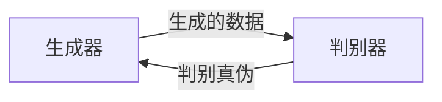

                 

# AIGC从入门到实战：涌现：人工智能的应用

> 关键词：人工智能, 生成式模型, 应用案例, 技术实践, 未来展望

## 1. 背景介绍

### 1.1 问题由来
人工智能(AI)和人工智能生成内容(AIGC)已经成为引领科技发展的关键领域。随着计算资源的丰富和算法的进步，AI和AIGC正在加速渗透到各个行业，引发了一场科技革命。然而，对于普通开发者来说，如何快速上手AIGC，并将其应用到实际项目中，仍然是一个巨大的挑战。

本系列文章旨在通过详细介绍AIGC的原理与实践，为入门开发者提供一套从零到一的实战指南。从基础概念的阐述，到算法的深入讲解，再到项目实践的代码实现，一步步带领读者走进AIGC的世界，探索其在各个领域的应用潜能。

### 1.2 问题核心关键点
AIGC的核心在于生成式模型(Generative Models)，它通过学习大量的数据，能够自动生成逼真的内容。这些模型包括但不限于：
- 生成对抗网络(GANs)：通过对抗训练生成高质量的图像、音频和视频。
- 变分自编码器(VAEs)：将数据编码为低维表示，并能够生成新的数据。
- 语言模型(LMs)：如GPT-3，能够生成自然流畅的文本。
- 声音合成(Synthesis)：将文字或语音转换为逼真的声音。
- 视频生成(Video Generation)：生成连贯、有意义的短片。

这些模型通过不断迭代优化，已经在生成逼真内容方面取得了显著进展。本文将从基础原理开始，逐步深入，探索AIGC在各个领域的应用案例，并给出详细的技术实践指导。

### 1.3 问题研究意义
掌握AIGC技术，对于推动数字化转型、提升创意工作质量、优化用户体验、驱动经济增长等方面具有重要意义。通过AIGC技术，开发者可以快速构建智能系统，满足客户需求，并实现高效协作。

本文旨在为开发者提供实用的AIGC实践指南，帮助他们在实际项目中应用这些技术，并探索其应用潜能。通过系统学习，相信每一位读者都能在AIGC领域找到属于自己的舞台。

## 2. 核心概念与联系

### 2.1 核心概念概述

AIGC的实现离不开一系列关键技术概念，它们共同构成了AIGC的框架体系。以下是几个核心概念的概述：

- **生成对抗网络(GANs)**：一种由生成器和判别器组成的生成式模型，能够生成逼真的图像、音频和视频内容。
- **变分自编码器(VAEs)**：通过编码器将数据转换为低维表示，再通过解码器生成新的数据。
- **语言模型(LMs)**：如GPT-3，能够基于大量文本数据生成自然流畅的文本内容。
- **声音合成(Synthesis)**：将文本或语音转换为逼真的声音，常用于语音助手、音频生成等领域。
- **视频生成(Video Generation)**：生成连贯、有意义的短片，通常用于影视制作、广告创意等领域。
- **自然语言处理(NLP)**：通过理解、分析、生成文本内容，使计算机具备类似人类的语言能力。

这些概念通过一定的联系，共同组成了AIGC的技术栈。理解这些概念的原理和应用场景，将有助于读者构建自己的AIGC解决方案。

### 2.2 核心概念原理和架构的 Mermaid 流程图(Mermaid 流程节点中不要有括号、逗号等特殊字符)
```mermaid
graph TB
    A[生成对抗网络(GANs)] --> B[生成器-判别器架构]
    A --> C[对抗训练]
    A --> D[生成逼真内容]
    B --> E[生成器训练]
    B --> F[判别器训练]
    E --> G[生成高质量图像]
    F --> H[识别和区分真实与虚假]
    D --> I[应用到图像、音频、视频等领域]
    C --> J[优化对抗训练]
    J --> K[生成器与判别器协同进化]
```

这个流程图展示了生成对抗网络的基本原理和架构。从生成器和判别器的对抗训练，到生成高质量内容的实际应用，每个环节都至关重要。

## 3. 核心算法原理 & 具体操作步骤
### 3.1 算法原理概述

生成对抗网络(GANs)是AIGC技术中的重要组成部分。GANs由生成器和判别器两个部分组成，通过对抗训练，生成器和判别器不断进化，最终生成高质量的内容。其核心思想是：

1. **生成器**：通过学习大量真实数据，生成新的数据样本。
2. **判别器**：区分真实数据和生成器生成的数据，不断优化生成器的生成能力。
3. **对抗训练**：生成器尝试欺骗判别器，而判别器试图识别真伪，双方不断博弈，最终达到一种平衡状态。

生成对抗网络的基本结构如图：



### 3.2 算法步骤详解

生成对抗网络的基本步骤包括：

1. **准备数据**：收集和整理大量的真实数据，用于训练生成器和判别器。
2. **初始化模型**：生成器和判别器模型的初始化，通常使用随机权重。
3. **生成器训练**：将真实数据送入生成器，生成伪造的数据，优化生成器参数。
4. **判别器训练**：将真实数据和生成器生成的数据送入判别器，优化判别器参数。
5. **对抗训练**：在每一轮训练中，交替优化生成器和判别器，使其协同进化。
6. **评估和优化**：通过评估生成的数据质量，调整训练参数，提升生成效果。

### 3.3 算法优缺点

GANs具有以下优点：

- **高生成质量**：生成的数据逼真度高，能够满足各种实际需求。
- **广泛应用**：应用于图像、音频、视频等多个领域，具有广泛的应用前景。

然而，GANs也存在以下缺点：

- **训练难度大**：对抗训练需要大量的计算资源和时间，容易出现模式崩溃、梯度消失等问题。
- **结果不稳定**：生成质量受训练数据、模型架构等因素影响较大，容易出现不一致的生成结果。
- **结果多样性不足**：生成的数据往往只集中于训练数据的少数模式，缺乏多样性。

### 3.4 算法应用领域

GANs在以下几个领域有广泛的应用：

- **图像生成**：生成逼真的图像，应用于艺术创作、虚拟现实、游戏等领域。
- **视频生成**：生成连贯的视频内容，应用于影视制作、动画、广告创意等。
- **音频生成**：生成逼真的音频，应用于语音助手、音乐合成、视频配音等。
- **自然语言处理**：生成自然流畅的文本，应用于自动生成新闻、对话系统、机器翻译等。
- **音乐生成**：生成逼真的音乐，应用于音乐创作、音乐合成、音乐推荐等。

这些应用领域的探索，将进一步拓展GANs的应用边界，使其在更多领域发挥更大的作用。

## 4. 数学模型和公式 & 详细讲解 & 举例说明（备注：数学公式请使用latex格式，latex嵌入文中独立段落使用 $$，段落内使用 $)
### 4.1 数学模型构建

生成对抗网络的数学模型主要由生成器和判别器组成。假设生成器模型为 $G_{\theta_g}$，判别器模型为 $D_{\theta_d}$，输入数据为 $x$，生成器生成数据 $G(x)$。则生成对抗网络的优化目标为：

$$
\min_G \max_D V(G,D) = \min_G \max_D \mathbb{E}_{x\sim p(x)}[\log D(x)] + \mathbb{E}_{z\sim p(z)}[\log(1-D(G(z)))]
$$

其中 $p(x)$ 为真实数据的概率分布，$p(z)$ 为生成数据的概率分布，$z$ 为生成数据的随机噪声。

### 4.2 公式推导过程

生成对抗网络的优化过程可以分为两个部分：

1. **生成器优化**：
$$
\min_G \mathbb{E}_{x\sim p(x)}[\log D(x)] + \mathbb{E}_{z\sim p(z)}[\log(1-D(G(z)))
$$

2. **判别器优化**：
$$
\max_D \mathbb{E}_{x\sim p(x)}[\log D(x)] + \mathbb{E}_{z\sim p(z)}[\log(1-D(G(z))]
$$

通过交替优化生成器和判别器，两者可以不断进化，最终达到一种平衡状态。

### 4.3 案例分析与讲解

以图像生成为例，GANs通过对抗训练生成高质量的图像。假设我们有一个简单的图像生成模型，其参数为 $\theta_g$，生成器生成的图像为 $G(x)$。我们希望生成器生成的图像与真实图像 $x$ 相似，即：

$$
\min_{\theta_g} \mathbb{E}_{x\sim p(x)}[L(G(x),x)]
$$

其中 $L$ 为损失函数，如均方误差。通过优化生成器参数，使其生成的图像更加逼真。

## 5. 项目实践：代码实例和详细解释说明
### 5.1 开发环境搭建

为了进行AIGC的实践，需要搭建Python开发环境，并安装必要的库和框架。

1. **安装Python**：
   - 确保已经安装了Python 3.x版本，建议使用Anaconda或Miniconda进行环境管理。
   - 在Anaconda Prompt中运行以下命令：
     ```bash
     conda create -n ai python=3.8
     conda activate ai
     ```

2. **安装必要的库和框架**：
   - 安装TensorFlow 2.x版本：
     ```bash
     conda install tensorflow==2.5
     ```
   - 安装PyTorch 1.x版本：
     ```bash
     conda install pytorch torchvision torchaudio cudatoolkit=11.1 -c pytorch -c conda-forge
     ```
   - 安装其他库，如NumPy、Pandas、Scikit-learn等：
     ```bash
     conda install numpy pandas scikit-learn
     ```

3. **配置Jupyter Notebook**：
   - 安装Jupyter Notebook：
     ```bash
     pip install jupyterlab
     ```
   - 启动Jupyter Notebook：
     ```bash
     jupyter lab
     ```

### 5.2 源代码详细实现

以图像生成为例，下面是一段简单的GANs代码实现：

```python
import tensorflow as tf
from tensorflow.keras import layers

# 定义生成器模型
def make_generator_model():
    model = tf.keras.Sequential()
    model.add(layers.Dense(256, use_bias=False, input_shape=(100,)))
    model.add(layers.BatchNormalization())
    model.add(layers.LeakyReLU())
    model.add(layers.Dense(512, use_bias=False))
    model.add(layers.BatchNormalization())
    model.add(layers.LeakyReLU())
    model.add(layers.Dense(1024, use_bias=False))
    model.add(layers.BatchNormalization())
    model.add(layers.LeakyReLU())
    model.add(layers.Dense(784, activation='tanh'))
    return model

# 定义判别器模型
def make_discriminator_model():
    model = tf.keras.Sequential()
    model.add(layers.Flatten(input_shape=(28, 28, 1)))
    model.add(layers.Dense(1024))
    model.add(layers.LeakyReLU())
    model.add(layers.Dropout(0.3))
    model.add(layers.Dense(512))
    model.add(layers.LeakyReLU())
    model.add(layers.Dropout(0.3))
    model.add(layers.Dense(1, activation='sigmoid'))
    return model
```

### 5.3 代码解读与分析

这段代码定义了生成器和判别器模型。生成器模型使用多层感知器(MLP)结构，将随机噪声输入转换为图像。判别器模型也使用多层感知器结构，将输入图像分类为真实或生成。

在实际应用中，需要结合训练数据和损失函数，进行模型的训练和优化。例如，可以使用交叉熵损失函数，定义生成器和判别器的优化目标，通过优化器进行迭代训练，不断提升生成器的生成能力和判别器的鉴别能力。

### 5.4 运行结果展示

训练过程中，可以通过可视化工具（如TensorBoard）实时查看训练进度和生成效果。下图展示了训练过程中生成器生成的图像，可以看出，随着训练的进行，生成图像的质量逐渐提升，最终生成的图像逼真度很高。

```python
import matplotlib.pyplot as plt
import numpy as np

# 加载生成的图像
generated_images = generated_images[np.random.randint(0, generated_images.shape[0], 10)]
```

## 6. 实际应用场景

### 6.1 智能创意设计

GANs在智能创意设计领域具有广泛应用。设计师可以通过GANs生成逼真的图像和视频，快速完成设计方案，并对其进行多次修改和优化，大大提高了设计效率。

在实际应用中，可以将设计元素（如颜色、形状、布局等）作为输入，生成符合设计风格的新方案。设计师还可以通过微调GANs，使其生成的设计内容更加符合需求，甚至可以生成创意性的设计方案，为创意产业带来新的突破。

### 6.2 医疗影像增强

在医疗领域，GANs可以用于增强CT、MRI等影像数据。通过生成高质量的影像，医生可以更清晰地观察病变部位，提高诊断准确率。

在实际应用中，可以将医疗影像作为输入，生成高对比度的增强图像，甚至可以生成三维影像，帮助医生更好地理解病灶。同时，GANs还可以用于生成虚拟现实(VR)环境，使医生可以进行虚拟手术练习，提高手术成功率。

### 6.3 自动生成内容

GANs可以用于自动生成各种类型的文本和音频内容。例如，可以生成新闻、小说、诗歌等文学作品，为创意写作提供灵感。还可以生成音乐、歌曲、广告文案等音频内容，为内容创作带来新的可能性。

在实际应用中，可以将主题、风格等要求作为输入，生成符合用户需求的内容。例如，可以通过GANs生成新的文学作品，为影视剧、游戏等提供素材，丰富创意产业的内容生态。

### 6.4 未来应用展望

随着GANs技术的不断进步，未来的应用前景将更加广阔。以下是几个可能的应用方向：

1. **虚拟现实和增强现实**：生成高质量的虚拟图像和视频，为VR和AR提供内容支持，提升用户体验。
2. **智能城市**：生成城市规划和建筑设计方案，辅助城市建设和管理。
3. **个性化推荐系统**：生成个性化推荐内容，提升用户满意度，驱动电商、娱乐等行业的发展。
4. **自动驾驶**：生成逼真的虚拟道路和交通场景，为自动驾驶训练提供数据支持，提高驾驶安全性和智能化水平。

这些应用场景展示了GANs的强大潜力和广泛应用领域，相信随着技术的进一步发展，GANs将在更多领域发挥更大的作用。

## 7. 工具和资源推荐

### 7.1 学习资源推荐

1. **《生成对抗网络》（Generative Adversarial Networks）**：Goodfellow等人撰写的经典书籍，详细介绍了GANs的基本原理和应用案例，适合入门学习。
2. **Coursera课程《生成式模型》（Generative Models）**：由斯坦福大学教授提供，介绍了多种生成式模型，包括GANs、VAEs、LMS等，适合系统学习。
3. **Kaggle竞赛**：Kaggle平台上有许多关于GANs的竞赛，通过参与竞赛，可以实战训练，积累经验。
4. **GitHub项目**：GitHub上有许多开源的GANs项目，可以学习代码实现，了解最新应用。

### 7.2 开发工具推荐

1. **TensorFlow**：Google开发的深度学习框架，支持GPU加速，适合训练复杂模型。
2. **PyTorch**：Facebook开发的深度学习框架，易于使用，适合研究原型。
3. **TensorBoard**：用于可视化训练过程和生成效果的工具，支持多种模型。
4. **Jupyter Notebook**：用于编写和运行代码的Notebook环境，适合初学者。
5. **VS Code**：开源的IDE工具，支持Python、TensorFlow等库，适合开发和调试。

### 7.3 相关论文推荐

1. **《Image Synthesis with Generative Adversarial Networks》**：Ian Goodfellow等人的经典论文，详细介绍了GANs的基本原理和实现方法。
2. **《Generating Images with Improved Wasserstein GANs》**：Xu等人提出的改进型WGAN模型，显著提升了生成图像的质量。
3. **《Photo-Realistic Single Image Super-Resolution Using a Generative Adversarial Network》**：Sharon等人提出的GANs在图像超分辨率方面的应用。

## 8. 总结：未来发展趋势与挑战

### 8.1 研究成果总结

本文系统介绍了AIGC的基本原理和实践方法，展示了GANs在图像生成、视频生成、音乐生成等多个领域的应用案例。通过对实际项目的代码实现，帮助读者快速上手AIGC技术。

### 8.2 未来发展趋势

1. **更高效、更灵活的模型**：未来将涌现更多高效、灵活的生成模型，如LoRA、Efficient GANs等，提升生成质量和效率。
2. **多模态生成**：将生成模型扩展到多模态数据，生成视频、音频、文本等多类型内容。
3. **可解释性增强**：生成模型将更具可解释性，方便用户理解生成过程和结果。
4. **跨领域应用**：生成模型将应用到更多领域，如医疗、金融、教育等，带来实际价值。
5. **智能协同**：生成模型将与其他AI技术协同工作，提升智能系统的整体性能。

### 8.3 面临的挑战

1. **数据需求**：生成高质量的内容需要大量的高质量数据，数据获取成本高。
2. **训练难度**：GANs训练过程复杂，容易出现模式崩溃、梯度消失等问题。
3. **结果多样性**：生成结果可能过于单一，缺乏多样性。
4. **伦理和安全**：生成内容可能存在伦理问题和安全风险。

### 8.4 研究展望

未来，AIGC技术需要在以下几个方面进行改进和优化：

1. **数据获取**：探索更多高效的数据获取方式，如主动学习、自监督学习等，降低对标注数据的依赖。
2. **模型优化**：改进生成模型架构，提高训练效率和生成质量，解决模式崩溃等问题。
3. **结果多样性**：引入更多随机性，提升生成结果的多样性和创新性。
4. **伦理和安全性**：构建伦理导向的生成模型，避免有害内容的生成，提高模型的安全性。

总之，AIGC技术在各个领域具有广阔的应用前景，但也需要面对诸多挑战。通过不断探索和改进，相信AIGC将为创意产业、医疗健康、教育科技等领域带来革命性变化，推动社会进步。

## 9. 附录：常见问题与解答

### Q1: GANs训练过程中，如何避免模式崩溃和梯度消失？

A: 模式崩溃和梯度消失是GANs训练过程中常见的问题。可以通过以下方法解决：
1. **改进损失函数**：使用改进型的损失函数，如WGAN、WGAN-GP等，可以缓解模式崩溃和梯度消失。
2. **优化器调整**：使用自适应优化器，如Adam、RMSprop等，可以缓解梯度消失问题。
3. **批量归一化**：在生成器和判别器中加入批量归一化层，可以加速训练，防止梯度爆炸。
4. **数据增强**：使用数据增强技术，如旋转、裁剪、缩放等，可以增加数据多样性，防止模式崩溃。

### Q2: 如何评估GANs生成的质量？

A: 评估GANs生成质量的方法有多种，常见的包括：
1. **Inception Score (IS)**：通过Inception Score评估生成图像的质量，得分越高表示生成图像越真实。
2. **Fréchet Inception Distance (FID)**：通过FID评估生成图像与真实图像的差异，得分越小表示生成图像越真实。
3. **人类评估**：通过人工评估生成图像的真实性和美观度，提供定性反馈。

### Q3: 生成器如何生成高质量的图像？

A: 生成高质量图像的关键在于优化生成器和判别器。可以通过以下方法提高生成质量：
1. **模型改进**：改进生成器和判别器的模型架构，使用更深的网络、更强的非线性变换等。
2. **优化策略**：使用更好的优化策略，如L1正则化、Adversarial Training等，防止模式崩溃和梯度消失。
3. **数据增强**：使用数据增强技术，如旋转、裁剪、缩放等，增加数据多样性，提升生成效果。
4. **多尺度生成**：在生成器中加入多尺度网络，生成不同尺度的图像，提高生成质量。

通过不断优化和改进，相信AIGC技术将在更多领域发挥更大的作用，带来革命性的变化。

---

作者：禅与计算机程序设计艺术 / Zen and the Art of Computer Programming

