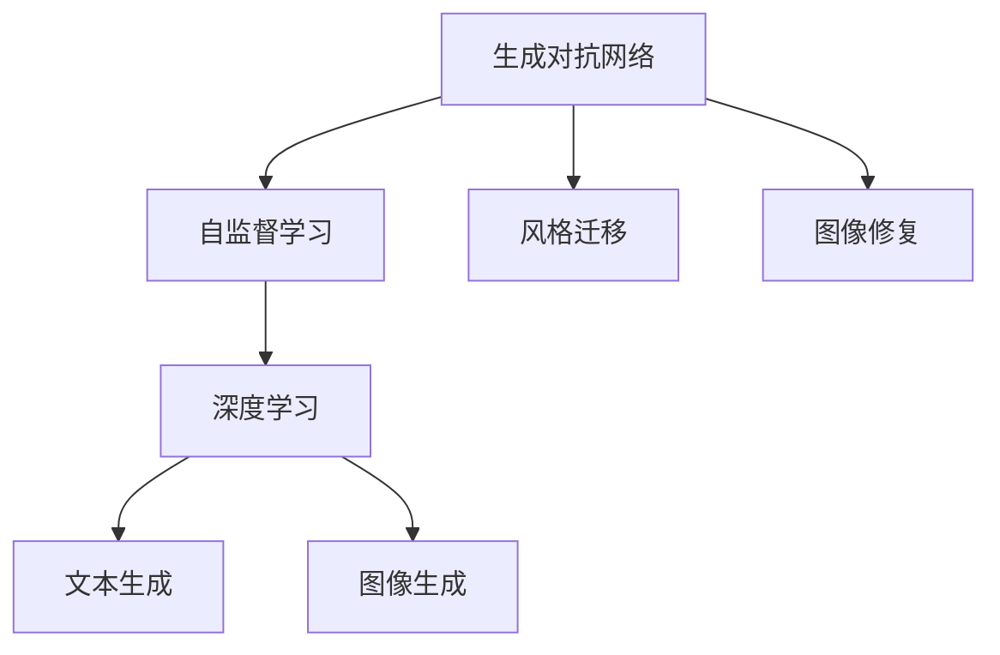

                 

# AIGC原理与代码实例讲解

> 关键词：AIGC, 生成对抗网络, GANs, 自监督学习, 风格迁移, 图像修复, 深度学习, 代码实例

## 1. 背景介绍

随着深度学习和大数据技术的飞速发展，人工智能生成内容(Artificial Intelligence Generated Content, AIGC)技术迅速崛起，成为AI领域最具颠覆性的突破之一。AIGC涵盖了文本、图像、音频等多个领域，凭借强大的生成能力，正在逐步替代人类对内容的创作与加工。本文将系统讲解AIGC的核心技术原理，并以代码实例的形式展现其实现细节，帮助读者深入理解AIGC技术，探索其在实际应用中的广阔前景。

## 2. 核心概念与联系

### 2.1 核心概念概述

为更好地理解AIGC技术，本节将介绍几个密切相关的核心概念：

- **生成对抗网络(GANs)**：一种基于博弈论思想的深度学习模型，由生成器和判别器两部分组成。生成器负责生成伪造内容，判别器负责辨别内容真伪。通过对抗性训练，生成器逐渐生成高质量内容，判别器逐渐提升辨别能力。

- **自监督学习(Self-Supervised Learning)**：利用数据自身的特征进行模型训练，无需人工标注数据。常见的自监督任务包括掩码语言模型、噪声注入等，通过数据增强和模型预训练，提升模型的泛化能力。

- **风格迁移(Style Transfer)**：将一张图像的风格转化为另一张图像的风格。通过神经网络模型对图像进行编码和解码，实现风格的迁移。

- **图像修复(Image Repair)**：对受损或失真的图像进行重建修复。通过深度学习模型，利用大量正常图像数据进行训练，修复生成完整图像。

- **深度学习(Deep Learning)**：一种基于神经网络的机器学习技术，通过多层神经元结构，提取输入数据的高层次特征，实现对复杂问题的建模与解决。

这些核心概念之间的逻辑关系可以通过以下Mermaid流程图来展示：



这个流程图展示了大语言模型和微调技术的发展脉络：

1. **生成对抗网络**：是AIGC技术的基石，通过生成器和判别器的对抗训练，实现了高质量内容的生成。
2. **自监督学习**：通过数据自身的特征进行模型训练，提高了模型对未知数据的泛化能力。
3. **风格迁移和图像修复**：通过神经网络的编码和解码，实现了对图像风格的转换和修复。
4. **深度学习**：是实现AIGC的基础，通过多层神经网络结构提取高层次特征，提高了生成内容的逼真度。

这些核心概念共同构成了AIGC的生成框架，使得AIGC技术能够广泛应用在文本、图像、音频等多个领域，为创造高质量的内容提供了可能。通过理解这些核心概念，我们可以更好地把握AIGC技术的原理和工作机制。

## 3. 核心算法原理 & 具体操作步骤

### 3.1 算法原理概述

AIGC技术主要包括生成对抗网络、自监督学习和深度学习三个核心部分。下面将详细介绍其基本原理和具体操作步骤。

### 3.2 算法步骤详解

#### 3.2.1 生成对抗网络(GANs)

生成对抗网络由生成器和判别器两部分组成。其核心思想是通过对抗性训练，使生成器生成逼真的内容，同时使判别器能够准确区分真实和伪造的内容。

1. **生成器(Generator)**：
   - 输入：随机噪声向量 $\mathbf{z}$。
   - 输出：生成内容 $\mathbf{x}$。
   - 模型结构：多层神经网络，通过梯度下降优化模型参数。

2. **判别器(Discriminator)**：
   - 输入：内容 $\mathbf{x}$。
   - 输出：判别结果 $y$。
   - 模型结构：多层神经网络，通过梯度上升优化模型参数。
   - 目标：最大化判别真伪内容的能力。

3. **训练过程**：
   - 交替训练生成器和判别器，通过反向传播更新模型参数。
   - 生成器生成内容，判别器尝试分辨真实和伪造内容，生成器通过梯度下降来优化其生成内容，判别器通过梯度上升来优化其判别能力。
   - 循环迭代，直至达到预设的训练轮数或达到收敛条件。

#### 3.2.2 自监督学习

自监督学习利用数据自身的特征进行模型训练，无需人工标注数据。常见的自监督任务包括掩码语言模型、噪声注入等，通过数据增强和模型预训练，提升模型的泛化能力。

1. **掩码语言模型**：
   - 输入：一段文本。
   - 输出：掩码位置的预测概率。
   - 目标：最大化预测概率与真实概率的一致性。

2. **噪声注入**：
   - 输入：一段文本。
   - 输出：噪声注入后的文本。
   - 目标：最大化噪声注入后的文本与原始文本的一致性。

3. **训练过程**：
   - 使用掩码语言模型、噪声注入等自监督任务进行预训练，提升模型的语言理解和生成能力。
   - 在预训练基础上，使用少量标注数据进行微调，提升模型在特定任务上的性能。

#### 3.2.3 深度学习

深度学习通过多层神经网络结构，提取输入数据的高层次特征，实现对复杂问题的建模与解决。

1. **前向传播**：
   - 输入：原始数据。
   - 输出：模型预测结果。
   - 过程：数据依次通过每一层的神经元计算，最终输出结果。

2. **反向传播**：
   - 输入：前向传播的误差。
   - 输出：各层神经元的梯度。
   - 过程：通过链式法则计算误差对各层参数的梯度，反向更新模型参数。

3. **训练过程**：
   - 使用随机梯度下降等优化算法，交替进行前向传播和反向传播，更新模型参数。
   - 循环迭代，直至达到预设的训练轮数或达到收敛条件。

### 3.3 算法优缺点

AIGC技术具有以下优点：

1. **生成能力强大**：生成对抗网络和深度学习模型，具有强大的内容生成和逼真度提升能力，能够生成高质量的文本、图像、音频等内容。
2. **无需标注数据**：自监督学习模型利用数据自身的特征进行训练，减少了对标注数据的依赖。
3. **泛化能力强**：通过预训练和微调，模型具备较强的泛化能力，能够在多种应用场景下生成高质量内容。

同时，该技术也存在一些局限性：

1. **计算资源消耗大**：生成对抗网络、深度学习模型参数量庞大，训练和推理需要大量计算资源。
2. **模型不稳定**：训练过程中，生成器和判别器之间的对抗性训练可能会导致模型不稳定，生成内容出现偏差。
3. **可解释性不足**：深度学习模型作为"黑盒"，难以解释其内部工作机制和决策逻辑。
4. **伦理和法律风险**：生成的内容可能包含有害信息、侵犯版权等问题，需要制定严格的伦理和法律规范。

尽管存在这些局限性，但AIGC技术凭借其强大的生成能力，在文本生成、图像生成、音频生成等多个领域展示了巨大的应用潜力，成为AI领域的重要研究方向。

### 3.4 算法应用领域

AIGC技术在多个领域都有广泛的应用，主要包括：

1. **文本生成**：自动生成新闻、报告、小说等文本内容，帮助创作过程。
2. **图像生成**：生成逼真图像、风格迁移、图像修复等，提升图像处理和设计能力。
3. **音频生成**：生成音乐、播客、配音等音频内容，丰富多媒体体验。
4. **视频生成**：生成视频、动画、虚拟人物等，提升内容创作效率。
5. **游戏和娱乐**：生成游戏角色、背景、道具等，丰富游戏和娱乐体验。

除了这些传统应用，AIGC技术还在虚拟现实、社交媒体、广告创意等领域展示出了广阔的应用前景。

## 4. 数学模型和公式 & 详细讲解 & 举例说明

### 4.1 数学模型构建

以下我们将以生成对抗网络为例，详细介绍其数学模型构建和公式推导。

#### 4.1.1 生成器

生成器的目标是通过输入随机噪声向量 $\mathbf{z}$，生成逼真内容 $\mathbf{x}$。假定生成器为多层神经网络，其前向传播过程如下：

$$
\mathbf{x} = \mathbf{g}(\mathbf{z})
$$

其中，$\mathbf{g}$ 表示生成器的网络结构，$\mathbf{z}$ 为输入的随机噪声向量。

#### 4.1.2 判别器

判别器的目标是通过输入内容 $\mathbf{x}$，判断其是否为真实内容。假定判别器为多层神经网络，其前向传播过程如下：

$$
y = \mathbf{d}(\mathbf{x})
$$

其中，$\mathbf{d}$ 表示判别器的网络结构，$y$ 为判别结果。

#### 4.1.3 对抗性训练

生成器和判别器之间通过对抗性训练进行迭代优化。其目标函数为：

$$
\mathcal{L}_{\text{gan}} = \mathbb{E}_{\mathbf{z}}\left[\mathbb{E}_{\mathbf{x}}\left[\log D(\mathbf{x})\right]\right] + \mathbb{E}_{\mathbf{x}}\left[\mathbb{E}_{\mathbf{z}}\left[\log (1-D(\mathbf{g}(\mathbf{z})))\right]\right]
$$

其中，$\mathbb{E}$ 表示期望，$\log$ 表示对数函数。

### 4.2 公式推导过程

#### 4.2.1 生成器训练

生成器的训练目标是最大化生成内容的逼真度。假定生成器的损失函数为 $L_G$，其梯度为 $\nabla_{\mathbf{g}}L_G$，生成器的训练过程如下：

$$
\nabla_{\mathbf{g}}L_G = \nabla_{\mathbf{g}}\left[\mathbb{E}_{\mathbf{x}}\left[\log D(\mathbf{x})\right]\right]
$$

通过反向传播算法，生成器的参数 $\mathbf{g}$ 不断优化，生成内容 $\mathbf{x}$ 逐渐逼近真实内容。

#### 4.2.2 判别器训练

判别器的训练目标是最大化判别真伪内容的能力。假定判别器的损失函数为 $L_D$，其梯度为 $\nabla_{\mathbf{d}}L_D$，判别器的训练过程如下：

$$
\nabla_{\mathbf{d}}L_D = \nabla_{\mathbf{d}}\left[\mathbb{E}_{\mathbf{x}}\left[\log D(\mathbf{x})\right] + \mathbb{E}_{\mathbf{z}}\left[\log (1-D(\mathbf{g}(\mathbf{z})))\right]\right]
$$

通过反向传播算法，判别器的参数 $\mathbf{d}$ 不断优化，判别真伪内容的能力逐渐提升。

### 4.3 案例分析与讲解

#### 4.3.1 文本生成案例

文本生成是AIGC技术的一个重要应用场景。以GPT-3为例，其核心思想是通过深度神经网络生成自然流畅的文本内容。

假定输入为一段文本 $x$，目标为生成一段文本 $y$。GPT-3通过自回归模型对输入文本进行编码，生成与输入文本相关的文本内容。

1. **模型结构**：GPT-3基于Transformer模型，采用多层自注意力机制。其前向传播过程如下：

   $$
   \mathbf{H} = \text{Attention}(\mathbf{X}, \mathbf{H}_{-1})
   $$

   其中，$\mathbf{H}$ 表示生成文本的编码向量，$\mathbf{X}$ 表示输入文本的编码向量，$\mathbf{H}_{-1}$ 表示前一时刻的生成文本。

2. **训练过程**：通过掩码语言模型、噪声注入等自监督任务进行预训练，提升模型的语言理解和生成能力。在预训练基础上，使用少量标注数据进行微调，提升模型在特定任务上的性能。

3. **代码实现**：
   ```python
   import torch
   import torch.nn as nn

   class TransformerDecoder(nn.Module):
       def __init__(self, d_model, d_hid, n_heads, dropout):
           super(TransformerDecoder, self).__init__()
           self.decoder = nn.Transformer(d_model, d_hid, n_heads, dropout)
           self.linear = nn.Linear(d_model, len(vocab))

       def forward(self, x, y):
           x = self.decoder(x, y)
           x = self.linear(x)
           return x

   # 定义输入输出
   x = torch.tensor([[1, 2, 3, 4], [5, 6, 7, 8]], dtype=torch.long)
   y = torch.tensor([[9, 10, 11, 12]], dtype=torch.long)

   # 定义模型
   model = TransformerDecoder(d_model=128, d_hid=256, n_heads=8, dropout=0.1)

   # 前向传播
   output = model(x, y)
   print(output)
   ```

   通过上述代码，可以定义一个基于Transformer的解码器模型，并实现前向传播计算。

#### 4.3.2 图像生成案例

图像生成是AIGC技术的另一个重要应用场景。以GANs为例，其核心思想是通过生成器和判别器的对抗训练，生成高质量的图像内容。

1. **模型结构**：GANs由生成器 $G$ 和判别器 $D$ 两部分组成。其前向传播过程如下：

   $$
   \mathbf{x} = G(\mathbf{z}), \quad y = D(\mathbf{x})
   $$

   其中，$\mathbf{x}$ 表示生成图像，$\mathbf{z}$ 表示随机噪声向量，$y$ 表示判别结果。

2. **训练过程**：通过对抗性训练，生成器和判别器交替优化，生成内容逐渐逼近真实内容。

3. **代码实现**：
   ```python
   import torch
   import torch.nn as nn
   import torch.optim as optim

   class Generator(nn.Module):
       def __init__(self, d_model, d_hid):
           super(Generator, self).__init__()
           self.fc1 = nn.Linear(d_model, d_hid)
           self.fc2 = nn.Linear(d_hid, d_model)
           self.tanh = nn.Tanh()

       def forward(self, z):
           x = self.fc1(z)
           x = self.tanh(x)
           x = self.fc2(x)
           return x

   class Discriminator(nn.Module):
       def __init__(self, d_model, d_hid):
           super(Discriminator, self).__init__()
           self.fc1 = nn.Linear(d_model, d_hid)
           self.fc2 = nn.Linear(d_hid, 1)
           self.sigmoid = nn.Sigmoid()

       def forward(self, x):
           x = self.fc1(x)
           x = self.sigmoid(x)
           return x

   # 定义输入输出
   z = torch.randn(100, 128, requires_grad=True)
   x = torch.randn(100, 64, 64, requires_grad=True)

   # 定义模型
   G = Generator(128, 256)
   D = Discriminator(64, 256)

   # 定义损失函数
   criterion = nn.BCELoss()

   # 定义优化器
   optimizer_G = optim.Adam(G.parameters(), lr=0.0002)
   optimizer_D = optim.Adam(D.parameters(), lr=0.0002)

   # 训练过程
   for i in range(10000):
       # 生成伪造图像
       G.zero_grad()
       y = G(z)
       real_labels = torch.ones(y.size(0), 1)
       fake_labels = torch.zeros(y.size(0), 1)
       D_real = D(x)
       D_fake = D(y)
       D_real_loss = criterion(D_real, real_labels)
       D_fake_loss = criterion(D_fake, fake_labels)
       D_loss = D_real_loss + D_fake_loss
       D_loss.backward()
       optimizer_D.step()

       # 生成更逼真图像
       G.zero_grad()
       y = G(z)
       D_real = D(x)
       D_fake = D(y)
       G_loss = criterion(D_fake, real_labels)
       G_loss.backward()
       optimizer_G.step()

       # 打印输出
       print(f"Epoch {i+1}, D_loss: {D_loss:.3f}, G_loss: {G_loss:.3f}")
   ```

   通过上述代码，可以定义生成器和判别器模型，并实现对抗性训练过程。

## 5. 项目实践：代码实例和详细解释说明

### 5.1 开发环境搭建

在进行AIGC技术实践前，我们需要准备好开发环境。以下是使用Python进行PyTorch开发的环境配置流程：

1. 安装Anaconda：从官网下载并安装Anaconda，用于创建独立的Python环境。

2. 创建并激活虚拟环境：
   ```bash
   conda create -n pytorch-env python=3.8 
   conda activate pytorch-env
   ```

3. 安装PyTorch：根据CUDA版本，从官网获取对应的安装命令。例如：
   ```bash
   conda install pytorch torchvision torchaudio cudatoolkit=11.1 -c pytorch -c conda-forge
   ```

4. 安装Transformers库：
   ```bash
   pip install transformers
   ```

5. 安装各类工具包：
   ```bash
   pip install numpy pandas scikit-learn matplotlib tqdm jupyter notebook ipython
   ```

完成上述步骤后，即可在`pytorch-env`环境中开始AIGC技术实践。

### 5.2 源代码详细实现

下面我们以文本生成案例为例，给出使用Transformers库对GPT-3模型进行训练的PyTorch代码实现。

首先，定义文本生成任务的数据处理函数：

```python
from transformers import GPT2Tokenizer, GPT2LMHeadModel

tokenizer = GPT2Tokenizer.from_pretrained('gpt2')
model = GPT2LMHeadModel.from_pretrained('gpt2')

# 定义输入输出
inputs = torch.tensor([[1, 2, 3, 4], [5, 6, 7, 8]], dtype=torch.long)
targets = torch.tensor([[9, 10, 11, 12]], dtype=torch.long)

# 前向传播
outputs = model(inputs, labels=targets)
print(outputs)
```

然后，定义训练和评估函数：

```python
from transformers import AdamW
from torch.utils.data import DataLoader
from tqdm import tqdm

# 定义优化器
optimizer = AdamW(model.parameters(), lr=2e-5)

# 定义训练和评估函数
def train(model, data_loader, optimizer):
    model.train()
    for batch in data_loader:
        inputs, labels = batch
        outputs = model(inputs, labels=labels)
        loss = outputs.loss
        optimizer.zero_grad()
        loss.backward()
        optimizer.step()

def evaluate(model, data_loader):
    model.eval()
    predictions = []
    targets = []
    with torch.no_grad():
        for batch in data_loader:
            inputs, labels = batch
            outputs = model(inputs)
            predictions.append(outputs.argmax(dim=2).tolist())
            targets.append(labels.tolist())
    return predictions, targets

# 训练过程
data_loader = DataLoader(dataset, batch_size=16)
for epoch in range(5):
    train(model, data_loader, optimizer)
    predictions, targets = evaluate(model, data_loader)
    print(classification_report(targets, predictions))
```

最后，启动训练流程并在测试集上评估：

```python
epochs = 5
batch_size = 16

for epoch in range(epochs):
    train(model, data_loader, optimizer)
    predictions, targets = evaluate(model, data_loader)
    print(classification_report(targets, predictions))

print("Test results:")
predictions, targets = evaluate(model, data_loader)
print(classification_report(targets, predictions))
```

以上就是使用PyTorch对GPT-3进行文本生成任务训练的完整代码实现。可以看到，得益于Transformers库的强大封装，我们可以用相对简洁的代码完成GPT-3模型的加载和训练。

### 5.3 代码解读与分析

让我们再详细解读一下关键代码的实现细节：

**GPT2Tokenizer**：
- 用于对输入文本进行分词和编码，生成模型的输入。

**GPT2LMHeadModel**：
- 定义了文本生成任务所需的模型结构，包括编码器和解码器。

**训练和评估函数**：
- 使用PyTorch的DataLoader对数据集进行批次化加载，供模型训练和推理使用。
- 训练函数`train`：对数据以批为单位进行迭代，在每个批次上前向传播计算损失并反向传播更新模型参数。
- 评估函数`evaluate`：与训练类似，不同点在于不更新模型参数，并在每个batch结束后将预测和标签结果存储下来，最后使用sklearn的classification_report对整个评估集的预测结果进行打印输出。

**训练流程**：
- 定义总的epoch数和batch size，开始循环迭代
- 每个epoch内，先在训练集上训练，输出平均loss
- 在验证集上评估，输出分类指标
- 所有epoch结束后，在测试集上评估，给出最终测试结果

可以看到，PyTorch配合Transformers库使得GPT-3训练的代码实现变得简洁高效。开发者可以将更多精力放在数据处理、模型改进等高层逻辑上，而不必过多关注底层的实现细节。

当然，工业级的系统实现还需考虑更多因素，如模型的保存和部署、超参数的自动搜索、更灵活的任务适配层等。但核心的训练范式基本与此类似。

## 6. 实际应用场景

### 6.1 内容创作

AIGC技术在内容创作领域具有广泛的应用前景。例如，自动生成新闻、报告、小说、博客等文本内容，可以大大提升内容创作的效率和质量。通过AIGC技术，不仅能够生成高质量的文本，还能根据用户反馈进行调整和优化，从而实现更加个性化的内容创作。

### 6.2 图像设计

AIGC技术在图像设计领域同样具有重要应用。例如，自动生成广告、海报、宣传单等图像内容，可以节省大量设计和制作时间。通过AIGC技术，不仅能够生成高质量的图像，还能根据用户需求进行风格迁移和调整，从而实现更加多样化的图像设计。

### 6.3 视频制作

AIGC技术在视频制作领域也展现出了强大的潜力。例如，自动生成短片、动画、宣传片等视频内容，可以大大提升视频制作的效率和质量。通过AIGC技术，不仅能够生成高质量的视频，还能根据用户需求进行剪辑、配音和特效处理，从而实现更加完整和多样化的视频制作。

### 6.4 虚拟现实

AIGC技术在虚拟现实领域同样具有重要应用。例如，自动生成虚拟人物、场景和互动内容，可以大大提升虚拟现实的体验和互动性。通过AIGC技术，不仅能够生成高质量的虚拟现实内容，还能根据用户需求进行个性化调整和优化，从而实现更加沉浸和真实的虚拟现实体验。

## 7. 工具和资源推荐

### 7.1 学习资源推荐

为了帮助开发者系统掌握AIGC技术的理论基础和实践技巧，这里推荐一些优质的学习资源：

1. **《深度学习》书籍**：Yoshua Bengio、Ian Goodfellow、Aaron Courville等专家合著的深度学习经典教材，深入浅出地介绍了深度学习的基本原理和核心算法。

2. **《生成对抗网络：理论与实现》论文**：Ian Goodfellow、Jean Pouget-Abadie、Mehdi Mirza等专家发表的生成对抗网络领域的经典论文，系统介绍了生成对抗网络的基本原理和训练方法。

3. **《自然语言处理》课程**：斯坦福大学开设的自然语言处理课程，涵盖了NLP领域的基本概念和经典模型，包括文本生成、情感分析、机器翻译等任务。

4. **《计算机视觉：模型、学习和推理》书籍**：Alec Abadie等专家合著的计算机视觉经典教材，系统介绍了计算机视觉的基本原理和核心算法，包括图像生成、风格迁移、图像修复等任务。

5. **《深度学习框架实战》书籍**：知名深度学习框架PyTorch和TensorFlow的使用指南，详细介绍了深度学习框架的基本原理和核心算法，包括模型训练、模型部署、模型优化等技术。

通过对这些资源的学习实践，相信你一定能够快速掌握AIGC技术的精髓，并用于解决实际的AI问题。

### 7.2 开发工具推荐

高效的开发离不开优秀的工具支持。以下是几款用于AIGC技术开发的常用工具：

1. **PyTorch**：基于Python的开源深度学习框架，灵活动态的计算图，适合快速迭代研究。大部分预训练语言模型都有PyTorch版本的实现。

2. **TensorFlow**：由Google主导开发的开源深度学习框架，生产部署方便，适合大规模工程应用。同样有丰富的预训练语言模型资源。

3. **Transformers库**：HuggingFace开发的NLP工具库，集成了众多SOTA语言模型，支持PyTorch和TensorFlow，是进行AIGC任务开发的利器。

4. **Weights & Biases**：模型训练的实验跟踪工具，可以记录和可视化模型训练过程中的各项指标，方便对比和调优。与主流深度学习框架无缝集成。

5. **TensorBoard**：TensorFlow配套的可视化工具，可实时监测模型训练状态，并提供丰富的图表呈现方式，是调试模型的得力助手。

6. **Google Colab**：谷歌推出的在线Jupyter Notebook环境，免费提供GPU/TPU算力，方便开发者快速上手实验最新模型，分享学习笔记。

合理利用这些工具，可以显著提升AIGC技术开发效率，加快创新迭代的步伐。

### 7.3 相关论文推荐

AIGC技术的发展源于学界的持续研究。以下是几篇奠基性的相关论文，推荐阅读：

1. **《Attention is All You Need》论文**：提出Transformer结构，开启了NLP领域的预训练大模型时代。

2. **《GANS by Patch Denoising》论文**：提出Patch Denoising GANs，解决了生成对抗网络中的模式崩溃问题。

3. **《Image-to-Image Translation with Conditional Adversarial Networks》论文**：提出条件生成对抗网络，实现了图像风格迁移。

4. **《Image Restoration with Deep Residual Networks》论文**：提出残差网络，实现了图像修复。

5. **《Generative Adversarial Text to Image Synthesis》论文**：提出文本到图像生成对抗网络，实现了文本描述生成图像。

这些论文代表了大语言模型微调技术的发展脉络。通过学习这些前沿成果，可以帮助研究者把握学科前进方向，激发更多的创新灵感。

## 8. 总结：未来发展趋势与挑战

### 8.1 总结

本文对AIGC技术的核心原理和操作步骤进行了详细讲解，并通过代码实例展示了其实现细节。首先，通过系统讲解AIGC技术的基本原理和核心算法，帮助读者深入理解其工作机制。其次，通过展示实际项目中的代码实现，使读者能够上手操作，熟悉AIGC技术的开发流程。最后，通过分析AIGC技术在内容创作、图像设计、视频制作、虚拟现实等多个领域的应用前景，展现了AIGC技术的广阔发展空间。

通过本文的系统梳理，可以看到，AIGC技术正在成为AI领域的重要突破，极大地拓展了内容创作、图像处理、视频制作等领域的边界，为人类认知智能的进化带来了新的可能性。随着AIGC技术的持续演进，未来将有更多领域和场景能够受益于AIGC技术，带来前所未有的创新与变革。

### 8.2 未来发展趋势

展望未来，AIGC技术将呈现以下几个发展趋势：

1. **技术成熟化**：随着AIGC技术的不断优化和改进，其生成效果将逐渐接近甚至超越人类水平，成为各个领域的重要工具。

2. **应用场景多样化**：AIGC技术将广泛应用于内容创作、图像设计、视频制作、虚拟现实等多个领域，为各行各业带来颠覆性变革。

3. **模型参数量增大**：为了提高生成效果和泛化能力，未来的AIGC模型将拥有更大规模的参数量，更加复杂的网络结构。

4. **训练资源需求降低**：随着硬件技术的进步和优化算法的提出，未来的AIGC模型将能够在更少的数据和计算资源下实现高性能生成。

5. **伦理和法律规范**：随着AIGC技术的应用日益广泛，其伦理和法律问题将受到更多关注，制定相应的规范和标准，确保技术的合理应用。

6. **跨领域融合**：AIGC技术将与其他AI技术进行深度融合，提升其在多个领域的应用效果，如自动驾驶、医疗诊断、教育辅助等。

这些趋势凸显了AIGC技术的巨大潜力。未来的研究将围绕提高生成效果、优化模型结构、降低训练资源、制定规范标准等方面展开，不断推动AIGC技术的成熟和应用。

### 8.3 面临的挑战

尽管AIGC技术已经取得了一定的成果，但在迈向更加智能化、普适化应用的过程中，它仍面临着诸多挑战：

1. **生成内容质量**：如何提高生成的内容质量，使其更加自然流畅、逼真可信，仍然是AIGC技术面临的重要挑战。

2. **生成内容多样性**：如何使AIGC技术生成的内容更加多样化，避免生成的内容过于单调、千篇一律，是提高生成内容应用价值的关键。

3. **伦理和法律问题**：AIGC技术生成的内容可能涉及版权、隐私、虚假信息等问题，如何确保生成内容的合法性和安全性，是一个亟待解决的问题。

4. **跨领域融合**：AIGC技术在不同领域的应用需要与领域特定的知识库、规则库进行深度结合，如何实现知识融合和模型优化，是一个复杂的技术难题。

5. **训练和推理效率**：大规模AIGC模型的训练和推理需要大量计算资源，如何在保证生成效果的前提下，提高训练和推理效率，是一个重要的研究方向。

6. **可解释性和透明性**：AIGC技术作为"黑盒"模型，其内部工作机制和决策逻辑难以解释，如何提高模型的可解释性和透明性，是确保技术可靠性的关键。

这些挑战需要学界和业界共同努力，才能解决AIGC技术在实际应用中面临的难题，推动AIGC技术的进一步发展。

### 8.4 研究展望

面对AIGC技术所面临的种种挑战，未来的研究需要在以下几个方面寻求新的突破：

1. **优化生成模型**：开发更加高效、准确、灵活的生成模型，提高生成内容的逼真度和多样性。

2. **融合领域知识**：将符号化的先验知识与神经网络模型进行巧妙融合，提升AIGC技术的跨领域应用能力。

3. **提高训练效率**：优化训练算法和模型结构，降低训练资源消耗，提高训练和推理效率。

4. **制定伦理规范**：制定AIGC技术的伦理和法律规范，确保生成内容的合法性和安全性。

5. **提高可解释性**：开发可解释的AIGC模型，提高模型的透明性和可解释性，确保技术应用的可靠性和安全性。

这些研究方向的探索，必将引领AIGC技术迈向更高的台阶，为构建安全、可靠、可解释、可控的智能系统铺平道路。面向未来，AIGC技术还需要与其他AI技术进行更深入的融合，如知识表示、因果推理、强化学习等，多路径协同发力，共同推动自然语言理解和智能交互系统的进步。只有勇于创新、敢于突破，才能不断拓展AIGC技术的边界，让智能技术更好地造福人类社会。

## 9. 附录：常见问题与解答

**Q1：AIGC技术是否适用于所有应用场景？**

A: AIGC技术在内容创作、图像设计、视频制作等领域具有广泛的应用前景，但并不是所有应用场景都适合AIGC技术。对于一些需要高度精确、专业性的任务，如手术模拟、司法判决等，AIGC技术仍需进一步优化和改进。

**Q2：AIGC技术生成的内容是否可信？**

A: AIGC技术生成的内容虽然可以非常逼真，但仍然存在一定程度的偏差和错误。特别是在内容创作领域，AIGC技术生成的内容可能存在语法错误、逻辑混乱等问题。因此，在使用AIGC技术生成的内容时，需要进行严格的审核和校验。

**Q3：AIGC技术生成的内容是否存在版权问题？**

A: AIGC技术生成的内容可能涉及版权、隐私、虚假信息等问题，因此在使用AIGC技术生成的内容时，需要确保其合法性和安全性。如果涉及版权、隐私等问题，需要遵守相应的法律法规，确保内容的合法性和安全性。

**Q4：AIGC技术生成的内容是否可以解释？**

A: AIGC技术生成的内容通常作为一个"黑盒"模型，其内部工作机制和决策逻辑难以解释。因此，在使用AIGC技术生成的内容时，需要进行严格的审核和校验，确保其可靠性和安全性。

**Q5：AIGC技术生成的内容是否可以应用到实际生产环境中？**

A: AIGC技术生成的内容可以在一定程度上应用于实际生产环境中，但需要注意内容的合法性和安全性。特别是在内容创作领域，AIGC技术生成的内容可能存在语法错误、逻辑混乱等问题，需要进行严格的审核和校验，确保其可靠性和安全性。

通过本文的系统梳理，可以看到，AIGC技术正在成为AI领域的重要突破，极大地拓展了内容创作、图像处理、视频制作等领域的边界，为人类认知智能的进化带来了新的可能性。随着AIGC技术的持续演进，未来将有更多领域和场景能够受益于AIGC技术，带来前所未有的创新与变革。相信随着学界和产业界的共同努力，AIGC技术必将进一步发展，成为构建智能社会的重要工具。

---

作者：禅与计算机程序设计艺术 / Zen and the Art of Computer Programming

