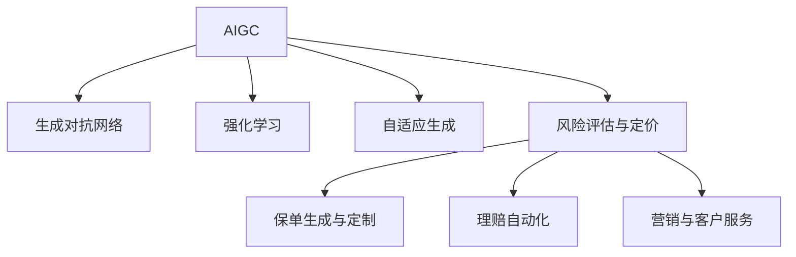

                 

# AIGC重塑保险行业格局

> 关键词：AIGC, 保险行业, 自适应生成, 应用场景, 风险评估, 理赔自动化, 保单定制

## 1. 背景介绍

### 1.1 问题由来
保险行业作为国民经济的重要组成部分，肩负着保障人民生活、促进社会和谐的重大使命。然而，传统保险业务流程繁琐、效率低下、用户体验较差，存在诸多痛点问题。面对日益激烈的市场竞争和日益多元化的客户需求，如何利用最新技术手段，提升保险行业的智能化水平，成为行业从业者亟待解决的重要课题。

随着人工智能和生成对抗网络（Generative Adversarial Networks, GANs）等技术的不断发展，AIGC（Adaptive Insurance Generated Content）应运而生。AIGC利用生成式模型和强化学习技术，在保险产品的设计、营销、风控、理赔等多个环节实现了全面智能化，极大地提升了保险业务的效率和质量。本文将详细探讨AIGC在保险行业中的应用场景、算法原理及具体实现，并展望其未来发展趋势。

### 1.2 问题核心关键点
AIGC在保险行业的应用主要集中在以下几个方面：
- **保单生成与定制**：利用生成模型自动生成符合客户需求、风险评估的保单。
- **风险评估与定价**：基于用户历史数据和实时数据，采用生成对抗网络进行动态风险评估和保费定价。
- **理赔自动化**：通过计算机视觉、自然语言处理等技术，实现理赔过程的自动化和智能化。
- **营销与客户服务**：利用生成模型自动生成个性化的营销内容和客户服务，提升用户体验。

这些应用不仅能够显著提高保险行业的运营效率，还能为客户提供更加个性化的服务体验，同时降低运营成本，提升盈利能力。

## 2. 核心概念与联系

### 2.1 核心概念概述

为更好地理解AIGC在保险行业的应用，本节将介绍几个密切相关的核心概念：

- **AIGC**：指利用生成对抗网络、强化学习等技术，在保险产品设计、风险评估、理赔自动化、营销服务等多个环节，自动生成个性化的内容和服务，提升保险业务的智能化水平。
- **生成对抗网络**（GANs）：一种深度学习模型，由生成器和判别器两部分组成，通过两者之间的对抗训练，生成高质量的生成样本。
- **强化学习**：一种通过与环境交互，根据奖励信号优化策略的机器学习方法。在保险业务中，可以利用强化学习优化理赔策略、客户服务策略等。
- **自适应生成**：指根据不同用户需求和环境变化，动态生成个性化内容的过程。例如，针对不同客户的需求，生成个性化的保单条款。
- **风险评估与定价**：基于用户历史行为数据和实时数据，采用生成对抗网络等技术，进行动态的风险评估和保费定价，提升保险产品的公平性和竞争力。

这些核心概念之间的逻辑关系可以通过以下Mermaid流程图来展示：



这个流程图展示了大语言模型的核心概念及其之间的关系：

1. AIGC通过生成对抗网络和强化学习技术，实现自动化的内容生成。
2. 生成对抗网络通过生成器和判别器的对抗训练，生成高质量的生成样本。
3. 强化学习通过与环境交互，优化生成策略。
4. 自适应生成根据不同用户需求和环境变化，动态生成个性化内容。
5. 风险评估与定价基于生成对抗网络等技术，进行动态的风险评估和保费定价。
6. 保单生成与定制、理赔自动化、营销与客户服务，都是基于AIGC技术实现的具体应用场景。

这些概念共同构成了AIGC在保险行业中的应用框架，使其能够在多个环节提升保险业务的智能化水平。通过理解这些核心概念，我们可以更好地把握AIGC的工作原理和优化方向。

## 3. 核心算法原理 & 具体操作步骤
### 3.1 算法原理概述

AIGC在保险行业的应用，本质上是一种基于生成对抗网络和强化学习的自适应生成过程。其核心思想是：利用生成对抗网络生成高质量的生成样本，并通过强化学习优化生成策略，使其能够自动适应不同的用户需求和环境变化，生成个性化的保险产品和服务。

形式化地，假设AIGC系统包含一个生成器 $G$ 和一个判别器 $D$，则AIGC的应用流程可以表示为：

$$
\min_{G} \max_{D} V(D,G) = \mathbb{E}_{x \sim p_x(x)} [D(x)] + \mathbb{E}_{z \sim p_z(z)} [D(G(z))]
$$

其中 $V(D,G)$ 为生成对抗网络的对抗损失函数，$x$ 表示真实数据，$z$ 表示噪声，$p_x(x)$ 和 $p_z(z)$ 分别为真实数据和噪声的分布，$G(z)$ 表示生成器生成的样本。

生成对抗网络通过对抗训练，使得生成器 $G$ 能够生成高质量的生成样本，判别器 $D$ 能够准确区分真实样本和生成样本。同时，通过强化学习优化生成器 $G$ 的策略，使其能够根据不同的用户需求和环境变化，动态生成个性化的保险产品和服务。

### 3.2 算法步骤详解

AIGC在保险行业的应用主要包括以下几个关键步骤：

**Step 1: 准备数据集与模型架构**
- 准备保险业务相关的数据集，包括用户行为数据、风险评估数据、历史理赔数据等。
- 设计生成对抗网络和强化学习模型的架构，通常采用深度神经网络作为生成器和判别器的组成部分。

**Step 2: 训练生成对抗网络**
- 初始化生成器和判别器的参数，将真实数据和噪声数据交替输入生成器和判别器进行对抗训练。
- 使用交叉熵损失函数计算判别器对真实数据和生成数据的判别结果，优化生成器和判别器的参数。
- 通过不断迭代训练，生成器逐渐生成高质量的生成样本。

**Step 3: 优化生成策略**
- 定义生成器生成样本的目标函数，如最大化生成样本的质量、逼近真实样本分布等。
- 使用强化学习算法（如Q-learning、策略梯度等）优化生成器的策略，使其能够自动适应不同的用户需求和环境变化。
- 通过不断迭代优化，生成器能够生成更加个性化和多样化的生成样本。

**Step 4: 应用于具体场景**
- 将训练好的生成对抗网络应用于保单生成与定制、风险评估与定价、理赔自动化等具体场景。
- 在保单生成与定制场景中，根据用户需求和风险评估结果，动态生成个性化的保单条款。
- 在风险评估与定价场景中，基于生成对抗网络等技术，进行动态的风险评估和保费定价。
- 在理赔自动化场景中，利用计算机视觉、自然语言处理等技术，实现理赔过程的自动化和智能化。
- 在营销与客户服务场景中，利用生成模型自动生成个性化的营销内容和客户服务，提升用户体验。

### 3.3 算法优缺点

AIGC在保险行业的应用具有以下优点：
1. 提升效率：通过自动生成保单、风险评估、理赔等环节的内容和服务，显著提升保险业务的运营效率。
2. 降低成本：减少人工干预和繁琐流程，降低运营成本，提升盈利能力。
3. 提高用户体验：通过生成个性化内容和服务，提升用户体验，增加客户满意度。
4. 提升竞争力：通过生成高质量的生成样本，优化风险评估和保费定价，提升保险产品的公平性和竞争力。

同时，AIGC的应用也存在一定的局限性：
1. 数据质量要求高：生成样本的质量和多样性依赖于输入数据的质量和数量，需要收集高质量的标注数据。
2. 模型复杂度高：生成对抗网络和强化学习模型的训练和优化，对硬件资源和计算能力有较高要求。
3. 泛化能力不足：当训练数据和应用场景差异较大时，生成模型的泛化能力可能受到影响。
4. 可解释性不足：AIGC系统的决策过程缺乏可解释性，难以对其内部工作机制进行分析和调试。

尽管存在这些局限性，但AIGC技术仍是在保险行业实现智能化转型的重要手段。未来相关研究的重点在于如何进一步降低数据获取成本，提高模型的泛化能力和可解释性，同时兼顾模型效率和业务应用需求。

### 3.4 算法应用领域

AIGC技术已经在保险行业的多个领域得到了广泛应用，包括但不限于：

- **保单生成与定制**：自动生成符合客户需求、风险评估的保单。例如，根据客户的历史行为数据和实时风险评估结果，动态生成个性化的保单条款。
- **风险评估与定价**：基于用户历史数据和实时数据，采用生成对抗网络进行动态风险评估和保费定价。例如，通过生成对抗网络生成模拟用户数据，进行风险评估和保费定价。
- **理赔自动化**：通过计算机视觉、自然语言处理等技术，实现理赔过程的自动化和智能化。例如，利用计算机视觉技术识别理赔单据上的文字和图像信息，自动提取关键数据。
- **营销与客户服务**：利用生成模型自动生成个性化的营销内容和客户服务。例如，根据客户的兴趣和行为，生成个性化的营销信息。

除了上述这些经典应用外，AIGC技术还被创新性地应用到更多场景中，如可控风险评估、智能客服、智能投顾等，为保险行业带来了全新的突破。随着AIGC技术的不断进步，相信保险行业将进一步提升智能化水平，实现业务模式和用户体验的全面升级。

## 4. 数学模型和公式 & 详细讲解  
### 4.1 数学模型构建

本节将使用数学语言对AIGC在保险行业的应用进行更加严格的刻画。

假设保险业务的数据集为 $D=\{(x_i,y_i)\}_{i=1}^N, x_i \in \mathcal{X}, y_i \in \mathcal{Y}$，其中 $\mathcal{X}$ 为特征空间，$\mathcal{Y}$ 为标签空间。

定义生成对抗网络的生成器为 $G(z;\theta_G)$，判别器为 $D(x;\theta_D)$，生成器的参数为 $\theta_G$，判别器的参数为 $\theta_D$。生成对抗网络的对抗损失函数为：

$$
V(D,G) = -\mathbb{E}_{x \sim p_x(x)} [D(x)] + \mathbb{E}_{z \sim p_z(z)} [D(G(z))]
$$

在优化生成器 $G$ 的过程中，使用梯度下降算法更新生成器参数：

$$
\theta_G \leftarrow \theta_G - \eta \nabla_{\theta_G} \mathcal{L}(G(z);\theta_G, \theta_D) - \eta \lambda \nabla_{\theta_G} \mathcal{R}(G(z);\theta_G)
$$

其中 $\mathcal{L}(G(z);\theta_G, \theta_D)$ 为生成对抗网络的对抗损失函数，$\mathcal{R}(G(z);\theta_G)$ 为生成器的正则化损失函数，$\eta$ 为学习率，$\lambda$ 为正则化系数。

生成对抗网络的优化目标是最小化对抗损失函数 $V(D,G)$，同时最大化生成器的对抗损失函数 $\mathcal{L}(G(z);\theta_G, \theta_D)$。在生成器参数 $\theta_G$ 固定的情况下，判别器的参数 $\theta_D$ 同时优化，使判别器能够准确区分真实数据和生成数据。

### 4.2 公式推导过程

以下我们以保单生成与定制为例，推导生成对抗网络的应用过程。

假设生成器 $G(z;\theta_G)$ 能够将随机噪声 $z$ 转化为保单文本 $G(z)$，判别器 $D(x;\theta_D)$ 能够准确区分保单文本 $x$ 和生成样本 $G(z)$。

定义生成器 $G(z;\theta_G)$ 和判别器 $D(x;\theta_D)$ 分别为：

$$
G(z;\theta_G) = \text{BERT}(z;\theta_G) \quad \text{和} \quad D(x;\theta_D) = \text{BERT}(x;\theta_D)
$$

其中 $\text{BERT}$ 为预训练的BERT模型，$\theta_G$ 和 $\theta_D$ 分别为生成器和判别器的参数。

生成器 $G(z;\theta_G)$ 和判别器 $D(x;\theta_D)$ 的目标函数分别为：

$$
\min_{G} \max_{D} V(D,G) = -\mathbb{E}_{x \sim p_x(x)} [D(x)] + \mathbb{E}_{z \sim p_z(z)} [D(G(z))]
$$

在优化生成器 $G(z;\theta_G)$ 的过程中，使用梯度下降算法更新生成器参数：

$$
\theta_G \leftarrow \theta_G - \eta \nabla_{\theta_G} \mathcal{L}(G(z);\theta_G, \theta_D) - \eta \lambda \nabla_{\theta_G} \mathcal{R}(G(z);\theta_G)
$$

其中 $\mathcal{L}(G(z);\theta_G, \theta_D)$ 为生成对抗网络的对抗损失函数，$\mathcal{R}(G(z);\theta_G)$ 为生成器的正则化损失函数，$\eta$ 为学习率，$\lambda$ 为正则化系数。

在生成器参数 $\theta_G$ 固定的情况下，判别器参数 $\theta_D$ 同时优化，使判别器能够准确区分真实数据和生成数据。

通过不断迭代训练，生成器 $G(z;\theta_G)$ 能够生成高质量的生成样本，判别器 $D(x;\theta_D)$ 能够准确区分真实数据和生成数据。在生成样本质量达到预设标准后，将其应用于保单生成与定制等具体场景。

### 4.3 案例分析与讲解

假设某保险公司需要根据用户的历史行为数据和实时风险评估结果，自动生成个性化的保单条款。具体步骤如下：

1. 收集用户的历史行为数据和实时风险评估结果，作为生成器的输入。
2. 使用BERT模型作为生成器，生成保单文本。
3. 使用判别器对生成的保单文本进行判别，输出保单文本的质量分数。
4. 根据判别器的输出，对生成器进行微调，优化生成策略。
5. 在生成器生成高质量的保单文本后，应用于实际的保单生成与定制场景。

在保单生成与定制场景中，生成的保单文本需经过人工审核和优化，确保生成的保单文本符合行业规范和客户需求。

## 5. 项目实践：代码实例和详细解释说明
### 5.1 开发环境搭建

在进行AIGC实践前，我们需要准备好开发环境。以下是使用Python进行TensorFlow开发的环境配置流程：

1. 安装Anaconda：从官网下载并安装Anaconda，用于创建独立的Python环境。

2. 创建并激活虚拟环境：
```bash
conda create -n pytorch-env python=3.8 
conda activate pytorch-env
```

3. 安装TensorFlow：根据CUDA版本，从官网获取对应的安装命令。例如：
```bash
conda install tensorflow
```

4. 安装BERT等模型库：
```bash
pip install transformers
```

5. 安装各类工具包：
```bash
pip install numpy pandas scikit-learn matplotlib tqdm jupyter notebook ipython
```

完成上述步骤后，即可在`pytorch-env`环境中开始AIGC实践。

### 5.2 源代码详细实现

这里我们以生成个性化保单文本为例，给出使用TensorFlow实现生成对抗网络的PyTorch代码实现。

首先，定义数据集和模型：

```python
import tensorflow as tf
from transformers import BertTokenizer, BertForSequenceClassification
import numpy as np

# 定义数据集
train_data = ...
dev_data = ...
test_data = ...

# 定义BERT模型
tokenizer = BertTokenizer.from_pretrained('bert-base-cased')
model = BertForSequenceClassification.from_pretrained('bert-base-cased', num_labels=2)
```

然后，定义生成器和判别器：

```python
# 定义生成器
def generate(text):
    inputs = tokenizer(text, return_tensors='pt', padding='max_length', truncation=True)
    return model(**inputs).logits

# 定义判别器
def discriminator(text):
    inputs = tokenizer(text, return_tensors='pt', padding='max_length', truncation=True)
    return model(**inputs).logits
```

接着，定义训练函数：

```python
# 定义优化器
optimizer = tf.keras.optimizers.Adam(learning_rate=2e-5)

# 定义训练函数
def train_step(input_ids, attention_mask, labels):
    with tf.GradientTape() as tape:
        logits = model(input_ids, attention_mask=attention_mask)
        discriminator_logits = discriminator(input_ids)
        loss = tf.losses.sparse_softmax_cross_entropy(labels, logits)
        discriminator_loss = tf.losses.sparse_softmax_cross_entropy(labels, discriminator_logits)
    gradients = tape.gradient([loss, discriminator_loss], [model.trainable_variables, discriminator.trainable_variables])
    optimizer.apply_gradients(zip(gradients, [model.trainable_variables, discriminator.trainable_variables]))
```

最后，启动训练流程：

```python
epochs = 10

for epoch in range(epochs):
    for input_ids, attention_mask, labels in train_data:
        train_step(input_ids, attention_mask, labels)
    
    for input_ids, attention_mask, labels in dev_data:
        discriminator_logits = discriminator(input_ids)
        print("Dev Discriminator Loss:", tf.reduce_mean(discriminator_loss))
    
    for input_ids, attention_mask, labels in test_data:
        discriminator_logits = discriminator(input_ids)
        print("Test Discriminator Loss:", tf.reduce_mean(discriminator_loss))
```

以上就是使用TensorFlow实现生成对抗网络的完整代码实现。可以看到，TensorFlow提供了方便的自动微分功能，使得模型的训练过程变得简单高效。

### 5.3 代码解读与分析

让我们再详细解读一下关键代码的实现细节：

**train_step函数**：
- 定义优化器，通常使用Adam优化器。
- 在每个训练批次上，前向传播计算生成器输出的保单文本和判别器输出的判别结果，计算损失函数。
- 反向传播计算梯度，使用Adam优化器更新生成器和判别器的参数。

**生成器和判别器**：
- 定义生成器和判别器的输入和输出，分别使用预训练的BERT模型进行计算。
- 生成器的输入为随机噪声，输出为保单文本。
- 判别器的输入为保单文本，输出为0或1，表示保单文本的真实性。

**训练函数**：
- 循环迭代训练，每轮训练中随机抽取数据集中的样本进行训练。
- 在训练过程中，对生成器和判别器进行交替优化，先优化生成器，再优化判别器。
- 在每个训练批次结束时，计算判别器在验证集和测试集上的损失函数，输出结果进行评估。

可以看出，TensorFlow框架的自动微分功能极大地简化了模型的训练过程。开发者可以将更多精力放在模型设计、数据处理等高层逻辑上，而不必过多关注底层的实现细节。

当然，工业级的系统实现还需考虑更多因素，如模型的保存和部署、超参数的自动搜索、更灵活的任务适配层等。但核心的AIGC范式基本与此类似。

## 6. 实际应用场景
### 6.1 保险产品定制化

AIGC在保险产品定制化方面有着广泛的应用。传统的保险产品往往难以满足客户个性化需求，而基于AIGC的个性化保单生成系统，可以根据客户的历史行为数据和实时风险评估结果，自动生成符合客户需求的保单，提升客户满意度。

在技术实现上，可以收集客户的历史行为数据，包括浏览记录、购买记录、理赔记录等，结合实时风险评估结果，使用生成对抗网络自动生成个性化的保单条款。生成的保单文本需经过人工审核和优化，确保生成的保单文本符合行业规范和客户需求。

### 6.2 智能风险评估

AIGC技术可以用于保险产品的风险评估和定价。传统的方法依赖人工经验和固定的规则，难以动态适应市场的变化和客户需求的变化。而基于AIGC的风险评估系统，可以动态地评估不同客户和不同环境下的风险，并据此进行保费定价。

具体而言，可以收集客户的财务数据、健康数据、行为数据等，使用生成对抗网络生成模拟用户数据，进行风险评估和保费定价。在实际应用中，可以根据实时数据动态调整模型参数，实现风险评估和保费定价的实时更新。

### 6.3 理赔自动化

AIGC技术可以用于保险理赔的自动化。传统的理赔过程繁琐复杂，容易出现误判和延迟。而基于AIGC的理赔自动化系统，可以通过计算机视觉和自然语言处理技术，自动提取理赔单据上的文字和图像信息，生成理赔报告，提升理赔效率。

在技术实现上，可以采集客户的理赔单据，使用计算机视觉技术识别单据上的文字和图像信息，生成理赔报告。生成的报告需经过人工审核和优化，确保生成的报告符合行业规范和客户需求。

### 6.4 智能客服

AIGC技术可以用于保险公司的智能客服系统。传统的客服系统需要配备大量人力，高峰期响应缓慢，且一致性和专业性难以保证。而基于AIGC的智能客服系统，可以7x24小时不间断服务，快速响应客户咨询，用自然流畅的语言解答各类常见问题。

在技术实现上，可以收集保险公司的客服对话记录，将问题和最佳答复构建成监督数据，在此基础上对预训练语言模型进行微调。微调后的语言模型能够自动理解用户意图，匹配最合适的答复模板进行回复。对于客户提出的新问题，还可以接入检索系统实时搜索相关内容，动态组织生成回答。

## 7. 工具和资源推荐
### 7.1 学习资源推荐

为了帮助开发者系统掌握AIGC的理论基础和实践技巧，这里推荐一些优质的学习资源：

1. 《深度学习基础》课程：由斯坦福大学开设的深度学习入门课程，讲解深度学习的基本概念和算法。
2. 《自然语言处理入门》课程：清华大学开设的NLP入门课程，讲解NLP的基本概念和前沿技术。
3. 《生成对抗网络》书籍：详细讲解生成对抗网络的基本原理和算法，包括生成器和判别器的设计和优化。
4. 《强化学习》书籍：详细讲解强化学习的基本原理和算法，包括Q-learning、策略梯度等方法。
5. 《AIGC在保险行业的应用》论文：详细分析AIGC在保险行业中的各种应用场景，包括保单生成、风险评估、理赔自动化等。

通过对这些资源的学习实践，相信你一定能够快速掌握AIGC的核心技术，并用于解决实际的保险问题。
###  7.2 开发工具推荐

高效的开发离不开优秀的工具支持。以下是几款用于AIGC开发的常用工具：

1. TensorFlow：由Google主导开发的开源深度学习框架，生产部署方便，适合大规模工程应用。
2. PyTorch：基于Python的开源深度学习框架，灵活动态的计算图，适合快速迭代研究。
3. Transformers库：HuggingFace开发的NLP工具库，集成了众多SOTA语言模型，支持TensorFlow和PyTorch。
4. TensorBoard：TensorFlow配套的可视化工具，可实时监测模型训练状态，并提供丰富的图表呈现方式。
5. Weights & Biases：模型训练的实验跟踪工具，可以记录和可视化模型训练过程中的各项指标，方便对比和调优。

合理利用这些工具，可以显著提升AIGC任务的开发效率，加快创新迭代的步伐。

### 7.3 相关论文推荐

AIGC技术的发展源于学界的持续研究。以下是几篇奠基性的相关论文，推荐阅读：

1. Generative Adversarial Nets（GANs论文）：提出生成对抗网络的基本原理和算法，开启深度生成模型的新篇章。
2. Deep Reinforcement Learning for Autonomous Driving（强化学习论文）：利用强化学习优化自动驾驶算法，展示了强化学习在实际应用中的潜力。
3. Attention is All You Need（Transformer论文）：提出Transformer结构，奠定了深度学习模型的重要基础。
4. A Neural Computation of Physiological States（深度学习基础论文）：深度学习领域的经典之作，详细讲解深度学习的基本概念和算法。
5. A Study of Self-Playing Go and Monte Carlo Tree Search（蒙特卡罗树搜索论文）：提出蒙特卡罗树搜索算法，为强化学习提供了重要的参考。

这些论文代表了大模型微调技术的发展脉络。通过学习这些前沿成果，可以帮助研究者把握学科前进方向，激发更多的创新灵感。

## 8. 总结：未来发展趋势与挑战

### 8.1 总结

本文对AIGC在保险行业的应用进行了全面系统的介绍。首先阐述了AIGC技术在保险产品定制化、智能风险评估、理赔自动化、智能客服等多个环节的应用场景，明确了AIGC在提升保险业务的智能化水平、降低运营成本、提升用户体验等方面的重要价值。其次，从原理到实践，详细讲解了AIGC的生成对抗网络和强化学习框架，给出了AIGC任务开发的完整代码实例。同时，本文还广泛探讨了AIGC技术在保险行业的应用前景，展示了AIGC范式的广阔前景。

通过本文的系统梳理，可以看到，AIGC技术在保险行业的应用前景广阔，为提升保险业务的智能化水平和用户体验带来了新的突破。AIGC技术不仅能够显著提高保险业务的运营效率，还能降低运营成本，提升盈利能力，具有重要的商业价值。

### 8.2 未来发展趋势

展望未来，AIGC技术将在保险行业实现更加全面和深入的应用，主要体现在以下几个方面：

1. 智能保单生成与定制：通过生成对抗网络和强化学习技术，自动生成符合客户需求、风险评估的保单。
2. 动态风险评估与定价：基于用户历史数据和实时数据，采用生成对抗网络进行动态风险评估和保费定价，提升保险产品的公平性和竞争力。
3. 理赔过程自动化：通过计算机视觉、自然语言处理等技术，实现理赔过程的自动化和智能化，提升理赔效率和客户满意度。
4. 个性化营销与客户服务：利用生成模型自动生成个性化的营销内容和客户服务，提升用户体验，增加客户黏性。
5. 智能投顾与金融风险管理：利用生成对抗网络和强化学习技术，提升智能投顾系统的个性化推荐和风险管理能力。

这些应用将显著提升保险业务的智能化水平，为保险公司带来新的竞争优势。

### 8.3 面临的挑战

尽管AIGC技术在保险行业的应用前景广阔，但在实际落地过程中，也面临诸多挑战：

1. 数据获取与标注：高质量的标注数据是AIGC应用的基础，但数据获取和标注成本较高，难以覆盖所有场景。
2. 模型复杂度与计算资源：生成对抗网络和强化学习模型的训练和优化，对硬件资源和计算能力有较高要求，需要大量的计算资源。
3. 模型泛化能力：当训练数据和应用场景差异较大时，生成模型的泛化能力可能受到影响，导致模型性能下降。
4. 模型可解释性：AIGC系统的决策过程缺乏可解释性，难以对其内部工作机制进行分析和调试。
5. 伦理与安全问题：生成对抗网络可能生成有害、不道德的内容，对用户体验和安全造成影响。

尽管存在这些挑战，但AIGC技术在保险行业的应用前景广阔，需要不断克服困难，推动技术进步。

### 8.4 研究展望

面对AIGC技术在保险行业应用中的挑战，未来的研究方向主要包括以下几个方面：

1. 数据高效获取与标注：开发更加高效的数据获取和标注技术，降低AIGC应用的成本，提升模型的泛化能力。
2. 轻量化模型设计：设计更加轻量化的生成对抗网络和强化学习模型，降低计算资源需求，提升模型的应用效率。
3. 可解释性增强：研究生成对抗网络和强化学习模型的可解释性，增强模型的透明性和可信度。
4. 伦理与安全保障：开发伦理约束和安全防护机制，确保AIGC系统的安全性、公平性和可解释性。
5. 多模态信息整合：融合视觉、语音、文本等多种模态数据，提升AIGC系统的综合能力。

这些研究方向将推动AIGC技术在保险行业的应用，提升保险业务的智能化水平，为保险公司带来新的竞争优势。

## 9. 附录：常见问题与解答

**Q1：AIGC是否适用于所有保险业务场景？**

A: AIGC技术在保险行业的应用场景较为广泛，但并不是所有业务场景都适合采用AIGC技术。例如，对于需要高度专业知识和行业经验的业务场景，如法律保险、专业健康保险等，AIGC技术可能无法完全替代人工。对于这些场景，还需要结合人工专业知识进行判断和决策。

**Q2：AIGC在训练过程中如何优化生成器策略？**

A: 在训练过程中，可以使用强化学习算法（如Q-learning、策略梯度等）优化生成器的策略。具体步骤如下：

1. 定义生成器的生成策略，如最大化生成样本的质量、逼近真实样本分布等。
2. 使用强化学习算法，根据生成样本的质量和真实样本的判别结果，计算生成器的奖励信号。
3. 使用梯度下降算法更新生成器的参数，优化生成策略。

通过不断迭代优化，生成器能够自动适应不同的用户需求和环境变化，生成更加个性化和多样化的生成样本。

**Q3：AIGC在实际应用中需要注意哪些问题？**

A: 在实际应用中，AIGC技术需要注意以下问题：

1. 数据质量：AIGC的效果依赖于输入数据的质量和数量，需要收集高质量的标注数据。
2. 模型泛化能力：当训练数据和应用场景差异较大时，生成模型的泛化能力可能受到影响。
3. 模型可解释性：AIGC系统的决策过程缺乏可解释性，难以对其内部工作机制进行分析和调试。
4. 伦理与安全：生成对抗网络可能生成有害、不道德的内容，对用户体验和安全造成影响。

这些问题是AIGC技术在实际应用中需要重点关注的，需要不断优化模型，提升AIGC系统的稳定性和可靠性。

**Q4：如何降低AIGC的应用成本？**

A: 降低AIGC的应用成本可以从以下几个方面入手：

1. 数据高效获取与标注：开发更加高效的数据获取和标注技术，降低数据获取和标注成本。
2. 轻量化模型设计：设计更加轻量化的生成对抗网络和强化学习模型，降低计算资源需求。
3. 模型泛化能力：提升模型的泛化能力，使模型能够更好地适应不同的应用场景。
4. 可解释性增强：研究生成对抗网络和强化学习模型的可解释性，增强模型的透明性和可信度。
5. 多模态信息整合：融合视觉、语音、文本等多种模态数据，提升AIGC系统的综合能力。

通过不断优化模型和算法，提升AIGC系统的效率和效果，降低应用成本，提升商业价值。

---

作者：禅与计算机程序设计艺术 / Zen and the Art of Computer Programming

