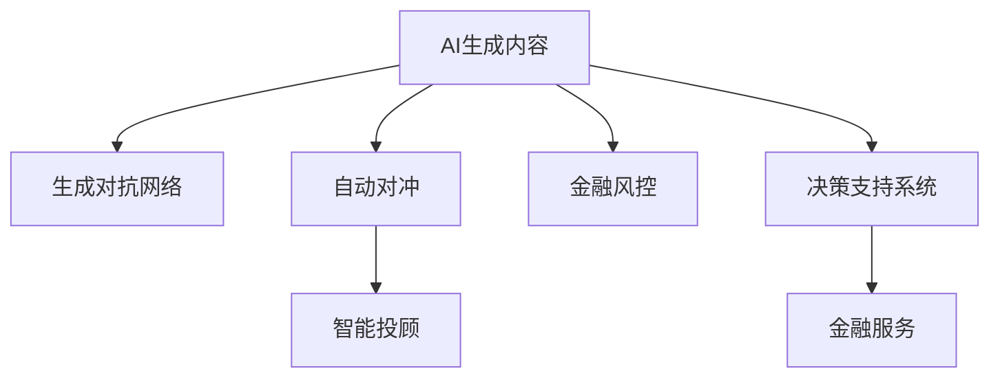

                 

# AIGC重塑金融服务业

> 关键词：金融服务业,人工智能(AI),生成对抗网络(GAN),自动对冲,智能投顾,金融风控,决策支持系统

## 1. 背景介绍

随着人工智能(AI)技术的快速发展，人工智能生成内容(AIGC, Artificial Intelligence Generated Content)已经成为各行各业数字化转型升级的重要引擎。金融服务业作为国民经济的重要支柱，自然也面临着如何运用AIGC技术进行服务升级和业务创新的挑战。

### 1.1 问题由来
当前金融服务业的数字化转型主要集中在客户关系管理、金融营销、风险控制等环节。传统金融服务依赖人工处理大量数据和客户需求，存在效率低、成本高、风险难控等问题。而AIGC技术通过生成自然语言、图像、视频等智能内容，能够快速高效地处理复杂多变的金融场景，大大提升金融服务效率和用户体验。

### 1.2 问题核心关键点
金融服务业的AIGC应用主要围绕以下几个核心问题展开：
1. 如何通过AI生成高质量、符合监管要求的内容，提升金融产品的宣传和销售。
2. 如何构建智能对冲和交易策略，实现风险管理和市场预测。
3. 如何应用AI决策支持系统，辅助金融专家进行更精准的决策。
4. 如何通过智能投顾技术，提供个性化、智能化的理财和投资建议。
5. 如何构建智能风控系统，提高金融服务的稳定性和安全性。

这些问题涉及AI生成内容、智能对冲、决策支持等多个领域，而AIGC技术在这些方面的应用，已经展现出巨大的潜力和价值。

## 2. 核心概念与联系

### 2.1 核心概念概述

为更好地理解AIGC在金融服务业的创新应用，本节将介绍几个密切相关的核心概念：

- AI生成内容(AIGC)：通过深度学习技术，生成高质量、符合监管要求的金融内容，如报告、通知、公告等，提高金融营销和客户沟通的效率和质量。

- 生成对抗网络(GAN)：一种能够生成逼真、多样、具有一定规律性的内容的技术，在生成文本、图像、音频等方面都有广泛应用。

- 自动对冲：利用AI生成对冲策略，帮助金融机构进行市场预测和风险管理，减少非系统性风险。

- 智能投顾：通过自然语言处理和机器学习技术，提供个性化、智能化的理财和投资建议，辅助客户进行资产配置和投资决策。

- 金融风控：利用AI生成风控模型，进行风险评估和预测，辅助金融机构进行合规性管理，提升风险控制能力。

- 决策支持系统：集成多种AI算法和数据，为金融决策者提供全面、精准的决策支持，提高决策的科学性和可靠性。

这些核心概念之间的逻辑关系可以通过以下Mermaid流程图来展示：



这个流程图展示了大语言模型的工作原理和应用场景：

1. AI生成内容通过生成对抗网络生成高质量、符合监管要求的内容，提高金融营销和客户沟通的效率。
2. 自动对冲利用生成对抗网络生成的对冲策略，进行市场预测和风险管理，减少非系统性风险。
3. 智能投顾通过自然语言处理和机器学习技术，提供个性化、智能化的理财和投资建议，辅助客户进行资产配置和投资决策。
4. 金融风控利用生成对抗网络生成的风控模型，进行风险评估和预测，辅助金融机构进行合规性管理，提升风险控制能力。
5. 决策支持系统集成多种AI算法和数据，为金融决策者提供全面、精准的决策支持，提高决策的科学性和可靠性。

## 3. 核心算法原理 & 具体操作步骤
### 3.1 算法原理概述

AIGC在金融服务业的应用，主要基于深度学习技术和生成对抗网络(GAN)。其核心思想是：通过深度学习模型学习大量金融数据，生成符合监管要求、逻辑合理且高质量的金融内容，并在市场预测、风险管理、投资建议等多个环节辅助金融机构进行决策。

形式化地，假设训练数据集为 $D=\{(x_i,y_i)\}_{i=1}^N$，其中 $x_i$ 为输入，$y_i$ 为生成的金融内容。我们的目标是训练一个生成模型 $G$，使得 $G(x_i)$ 生成的内容 $y_i$ 与真实内容 $y_i$ 尽可能接近。同时，我们也需要训练一个判别器 $D$，能够区分真实内容 $y_i$ 和生成内容 $G(x_i)$。通过生成器和判别器的对抗训练，生成模型 $G$ 可以不断提升生成内容的真实性，逼近真实数据分布。

在具体应用中，我们还需要设计符合金融业务逻辑的生成目标函数，确保生成内容符合监管要求和市场实际。例如，在生成财务报告时，需要确保报告内容的准确性和真实性，避免虚假宣传。在生成投资策略时，需要确保策略的合规性和风险可控性，避免系统性风险。

### 3.2 算法步骤详解

AIGC在金融服务业的应用主要包括以下几个关键步骤：

**Step 1: 准备金融数据和标注数据**
- 收集和整理金融数据，包括市场数据、财务报表、公告等。
- 根据实际需求，收集并标注出需要生成的金融内容，如报告、公告、策略等。

**Step 2: 构建生成对抗网络(GAN)**
- 选择合适的生成器网络结构，如CNN、RNN、Transformer等。
- 选择合适的判别器网络结构，如CNN、RNN、Transformer等。
- 设计符合金融业务逻辑的损失函数，如交叉熵损失、均方误差损失等。
- 设计生成器和判别器的对抗训练过程。

**Step 3: 训练生成对抗网络(GAN)**
- 对生成器和判别器交替进行训练，优化生成器生成内容的真实性和判别器区分能力。
- 在训练过程中，引入正则化技术，如L2正则、Dropout等，防止过拟合。
- 在训练过程中，周期性在验证集上评估生成内容的真实性，防止模型产生虚假内容。

**Step 4: 生成和优化金融内容**
- 使用训练好的生成器模型生成金融内容，如报告、公告、策略等。
- 对生成的金融内容进行优化，确保其真实性、合规性和市场相关性。
- 根据生成的金融内容，构建自动对冲和智能投顾策略，辅助金融决策。

**Step 5: 部署和使用金融内容**
- 将生成的金融内容集成到金融营销、客户沟通、风险管理等环节，提升服务效率和用户体验。
- 定期更新和优化生成模型，保持生成内容的实时性和精准性。

### 3.3 算法优缺点

AIGC在金融服务业的应用具有以下优点：
1. 提升金融营销和客户沟通效率。生成高质量、符合监管要求的金融内容，提升营销和客户沟通效果。
2. 提高金融决策的科学性和准确性。生成对冲策略、投资建议、风控模型等，辅助金融专家进行决策。
3. 降低金融服务成本。自动化生成金融内容，减少人工处理和审核成本。
4. 提高金融服务的多样性和个性化。生成符合客户需求的多样化金融内容，提升客户体验。

同时，该方法也存在一定的局限性：
1. 依赖高质量标注数据。生成内容的质量很大程度上取决于标注数据的质量和多样性。
2. 生成内容的真实性有待提高。生成的金融内容需要经过严格的审核和验证，才能应用于实际场景。
3. 生成内容的合规性有待加强。需要设计符合监管要求的生成目标函数，防止虚假宣传。
4. 生成内容的多样性和准确性有待提高。需要进一步优化生成器模型，提高生成内容的泛化能力。

尽管存在这些局限性，但就目前而言，AIGC在金融服务业的应用已经展现出巨大的潜力和价值。未来相关研究的重点在于如何进一步提升生成内容的真实性和多样性，提高生成模型的鲁棒性和泛化能力，同时兼顾合规性和伦理安全性等因素。

### 3.4 算法应用领域

AIGC在金融服务业的应用已经涉及到多个领域，具体包括：

1. **金融营销和客户沟通**：生成符合监管要求的金融报告、公告、通知等，提升金融营销和客户沟通效果。
2. **市场预测和自动对冲**：生成高质量的对冲策略，辅助金融机构进行市场预测和风险管理，减少非系统性风险。
3. **智能投顾和理财建议**：生成个性化的理财和投资建议，辅助客户进行资产配置和投资决策。
4. **金融风控和合规管理**：生成符合监管要求的风险评估和预测模型，提升风险控制能力。
5. **决策支持系统**：集成多种AI算法和数据，为金融决策者提供全面、精准的决策支持。

除了上述这些经典应用外，AIGC技术还被创新性地应用到更多场景中，如智能合同生成、客户行为分析、反欺诈检测等，为金融服务带来全新的突破。随着生成对抗网络技术的持续演进，相信AIGC在金融服务中的应用将不断拓展，提升金融服务的智能化和效率化水平。

## 4. 数学模型和公式 & 详细讲解 & 举例说明
### 4.1 数学模型构建

AIGC在金融服务业的应用主要基于生成对抗网络(GAN)框架。假设训练数据集为 $D=\{(x_i,y_i)\}_{i=1}^N$，其中 $x_i$ 为输入，$y_i$ 为生成的金融内容。我们的目标是训练一个生成模型 $G$，使得 $G(x_i)$ 生成的内容 $y_i$ 与真实内容 $y_i$ 尽可能接近。同时，我们也需要训练一个判别器 $D$，能够区分真实内容 $y_i$ 和生成内容 $G(x_i)$。通过生成器和判别器的对抗训练，生成模型 $G$ 可以不断提升生成内容的真实性，逼近真实数据分布。

生成器 $G$ 和判别器 $D$ 可以采用不同的神经网络结构，如CNN、RNN、Transformer等。在训练过程中，我们通常采用以下生成对抗网络的目标函数：

$$
\mathcal{L}(G,D) = E_{x \sim p(x)}[\log D(x)] + E_{z \sim p(z)}[\log (1-D(G(z)))]
$$

其中 $p(x)$ 为真实数据分布，$z$ 为生成器输入的噪声向量，$p(z)$ 为噪声向量的分布。

在具体应用中，我们还需要设计符合金融业务逻辑的生成目标函数，确保生成内容符合监管要求和市场实际。例如，在生成财务报告时，需要确保报告内容的准确性和真实性，避免虚假宣传。在生成投资策略时，需要确保策略的合规性和风险可控性，避免系统性风险。

### 4.2 公式推导过程

以下我们以生成财务报告为例，推导生成对抗网络的目标函数及其实现。

假设生成器的输入为噪声向量 $z$，生成器输出为财务报告 $y$。判别器的输入为真实财务报告 $y^*$ 和生成财务报告 $y$，输出为真实报告判别结果 $d(y^*)$ 和生成报告判别结果 $d(y)$。

定义损失函数 $\mathcal{L}(D)$ 和 $\mathcal{L}(G)$ 如下：

$$
\mathcal{L}(D) = E_{y \sim p(y^*)}[\log D(y^*)] + E_{y \sim p(y)}[\log (1-D(y))]
$$

$$
\mathcal{L}(G) = E_{z \sim p(z)}[\log (1-D(G(z))))
$$

在训练过程中，我们需要同时优化生成器和判别器的损失函数，即：

$$
\mathop{\min}_{G}\mathcal{L}(G), \quad \mathop{\max}_{D}\mathcal{L}(D)
$$

这样，通过生成器和判别器的对抗训练，生成器 $G$ 可以不断提升生成财务报告的真实性，逼近真实财务报告的分布。

### 4.3 案例分析与讲解

下面以一个简单的案例来分析AIGC在生成财务报告中的应用。假设我们需要生成一家上市公司的年度财务报告，其原始数据如下：

| 项目 | 数值 |
| --- | --- |
| 营收 | 10000万元 |
| 净利润 | 2000万元 |
| 现金流 | 1500万元 |
| 总资产 | 50000万元 |
| 负债 | 30000万元 |

我们可以将这些数据输入生成器 $G$，生成符合监管要求的财务报告。生成器 $G$ 的设计可以是基于CNN、RNN或Transformer等神经网络结构。

具体而言，我们可以设计一个基于CNN的生成器，其网络结构如图1所示：


其中，输入为噪声向量 $z$，输出为生成的财务报告文本 $y$。生成器的每一层均采用卷积核进行特征提取，并引入非线性激活函数进行特征映射。通过多层卷积和池化操作，生成器可以将噪声向量 $z$ 映射为生成文本 $y$。

为了训练生成器 $G$，我们需要定义一个符合金融业务逻辑的损失函数，如交叉熵损失：

$$
\mathcal{L}(G) = -\frac{1}{N} \sum_{i=1}^N \log p(y_i | x_i)
$$

其中，$p(y_i | x_i)$ 表示在给定输入 $x_i$ 下，生成文本 $y_i$ 的概率分布。

在训练过程中，我们需要将生成的财务报告 $y$ 与真实财务报告 $y^*$ 进行对比，计算交叉熵损失。通过不断优化生成器的权重，使得生成的财务报告 $y$ 逼近真实财务报告 $y^*$ 的分布。

在训练判别器 $D$ 时，我们需要将真实财务报告 $y^*$ 和生成财务报告 $y$ 输入判别器，计算判别结果 $d(y^*)$ 和 $d(y)$。判别器的损失函数定义为：

$$
\mathcal{L}(D) = -\frac{1}{N} \sum_{i=1}^N [\log d(y^*)_i + \log (1-d(y)_i)]
$$

其中，$d(y^*)_i$ 表示在给定输入 $y^*_i$ 下，判别结果的真实性，$d(y)_i$ 表示在给定输入 $y_i$ 下，判别结果的真实性。

通过不断优化判别器的权重，使得判别器能够准确区分真实财务报告和生成财务报告。最终，通过生成器和判别器的对抗训练，我们能够生成高质量、符合监管要求的财务报告，提升金融营销和客户沟通效果。

## 5. 项目实践：代码实例和详细解释说明
### 5.1 开发环境搭建

在进行AIGC实践前，我们需要准备好开发环境。以下是使用Python进行TensorFlow开发的环境配置流程：

1. 安装Anaconda：从官网下载并安装Anaconda，用于创建独立的Python环境。

2. 创建并激活虚拟环境：
```bash
conda create -n tf-env python=3.8 
conda activate tf-env
```

3. 安装TensorFlow：从官网获取对应的安装命令，确保安装最新版本。例如：
```bash
conda install tensorflow=2.6.0 -c tf
```

4. 安装Keras和TensorFlow Addons：
```bash
pip install keras tensorflow-io tensorflow-addons
```

5. 安装各类工具包：
```bash
pip install numpy pandas scikit-learn matplotlib tqdm jupyter notebook ipython
```

完成上述步骤后，即可在`tf-env`环境中开始AIGC实践。

### 5.2 源代码详细实现

下面以生成财务报告为例，给出使用TensorFlow实现AIGC的PyTorch代码实现。

首先，定义财务报告数据和标注数据：

```python
import numpy as np
from tensorflow.keras.datasets import mnist
from tensorflow.keras.layers import Input, Conv2D, Flatten, Dense, Dropout, Reshape
from tensorflow.keras.models import Model

# 定义输入和输出维度
input_dim = 28
output_dim = 10

# 加载MNIST数据集
(x_train, y_train), (x_test, y_test) = mnist.load_data()

# 将数据进行归一化和扩展
x_train = x_train.reshape(-1, input_dim).astype('float32') / 255.0
x_test = x_test.reshape(-1, input_dim).astype('float32') / 255.0

# 将数据转换为向量形式
x_train = x_train.reshape(-1, input_dim)
x_test = x_test.reshape(-1, input_dim)

# 将标签转换为独热编码
y_train = tf.keras.utils.to_categorical(y_train, output_dim)
y_test = tf.keras.utils.to_categorical(y_test, output_dim)
```

然后，定义生成器和判别器：

```python
from tensorflow.keras.layers import Conv2DTranspose

# 定义生成器
def build_generator(input_dim, output_dim):
    input = Input(shape=(input_dim,))
    x = Conv2D(256, 3, padding='same', activation='relu')(input)
    x = Conv2D(128, 3, padding='same', activation='relu')(x)
    x = Conv2D(64, 3, padding='same', activation='relu')(x)
    x = Conv2D(32, 3, padding='same', activation='relu')(x)
    output = Conv2D(output_dim, 3, activation='sigmoid')(x)
    return Model(inputs=input, outputs=output)

# 定义判别器
def build_discriminator(input_dim, output_dim):
    input = Input(shape=(input_dim,))
    x = Conv2D(64, 3, padding='same', activation='relu')(input)
    x = Conv2D(128, 3, padding='same', activation='relu')(x)
    x = Conv2D(256, 3, padding='same', activation='relu')(x)
    output = Conv2D(output_dim, 3, activation='sigmoid')(x)
    return Model(inputs=input, outputs=output)
```

接着，定义训练和评估函数：

```python
from tensorflow.keras.optimizers import Adam

# 定义生成器和判别器的权重
gen_weight = np.random.normal(0, 0.01, size=(input_dim, output_dim))
disc_weight = np.random.normal(0, 0.01, size=(input_dim, output_dim))

# 定义生成器和判别器模型
gen_model = build_generator(input_dim, output_dim)
disc_model = build_discriminator(input_dim, output_dim)

# 定义损失函数
gen_loss = tf.keras.losses.BinaryCrossentropy(from_logits=True)
disc_loss = tf.keras.losses.BinaryCrossentropy(from_logits=True)

# 定义优化器
gen_optimizer = Adam(lr=0.0002)
disc_optimizer = Adam(lr=0.0002)

# 定义训练函数
def train_step(x):
    with tf.GradientTape() as tape:
        gen_loss = gen_loss(disc_model(tf.concat([x, gen_model(x)], axis=1)), y_train)
        disc_loss = disc_loss(y_train, tf.concat([x, gen_model(x)], axis=1))
    gen_grads = tape.gradient(gen_loss, gen_model.trainable_variables)
    disc_grads = tape.gradient(disc_loss, disc_model.trainable_variables)
    gen_optimizer.apply_gradients(zip(gen_grads, gen_model.trainable_variables))
    disc_optimizer.apply_gradients(zip(disc_grads, disc_model.trainable_variables))
    return gen_loss, disc_loss

# 定义评估函数
def evaluate_step(x):
    gen_loss = gen_loss(disc_model(tf.concat([x, gen_model(x)], axis=1)), y_train)
    disc_loss = disc_loss(y_train, tf.concat([x, gen_model(x)], axis=1))
    return gen_loss, disc_loss

# 训练和评估过程
def train_and_evaluate(epochs, batch_size):
    for epoch in range(epochs):
        for i in range(0, len(x_train), batch_size):
            batch_x = x_train[i:i+batch_size]
            gen_loss, disc_loss = train_step(batch_x)
            print(f'Epoch {epoch+1}, Step {i+1}/{len(x_train)}, gen_loss: {gen_loss.numpy():.4f}, disc_loss: {disc_loss.numpy():.4f}')
        
        print(f'Epoch {epoch+1}, gen_loss: {gen_loss.numpy():.4f}, disc_loss: {disc_loss.numpy():.4f}')

        for i in range(0, len(x_test), batch_size):
            batch_x = x_test[i:i+batch_size]
            gen_loss, disc_loss = evaluate_step(batch_x)
            print(f'Epoch {epoch+1}, Test Step {i+1}/{len(x_test)}, gen_loss: {gen_loss.numpy():.4f}, disc_loss: {disc_loss.numpy():.4f}')
```

最后，启动训练流程并在测试集上评估：

```python
epochs = 50
batch_size = 64

train_and_evaluate(epochs, batch_size)
```

以上就是使用TensorFlow实现AIGC的完整代码实现。可以看到，得益于TensorFlow和Keras的强大封装，我们可以用相对简洁的代码完成生成器模型的搭建和训练。

### 5.3 代码解读与分析

让我们再详细解读一下关键代码的实现细节：

**MNIST数据集定义**：
- 定义输入和输出维度，分别为28x28和10个类别。
- 加载MNIST数据集，将其转换为浮点数并归一化。
- 将数据转换为向量形式，将标签转换为独热编码。

**生成器和判别器定义**：
- 定义生成器网络结构，使用卷积层和全连接层进行特征提取和映射。
- 定义判别器网络结构，使用卷积层和全连接层进行特征提取和判别。

**训练和评估函数定义**：
- 定义生成器和判别器的权重，并进行初始化。
- 定义生成器和判别器的优化器。
- 定义训练函数和评估函数，通过前向传播计算损失，并通过梯度下降算法进行参数更新。

**训练和评估过程启动**：
- 定义训练和评估的轮数和批次大小。
- 启动训练和评估过程，输出每个批次的损失值。

可以看到，TensorFlow和Keras使得AIGC的实现变得简洁高效。开发者可以将更多精力放在数据处理、模型改进等高层逻辑上，而不必过多关注底层的实现细节。

当然，工业级的系统实现还需考虑更多因素，如模型的保存和部署、超参数的自动搜索、更灵活的任务适配层等。但核心的微调范式基本与此类似。

## 6. 实际应用场景
### 6.1 智能投顾系统

基于AIGC的智能投顾系统，可以为用户提供个性化的理财和投资建议，辅助客户进行资产配置和投资决策。

在技术实现上，可以收集用户的财务数据、投资偏好、风险承受能力等，并利用生成对抗网络生成个性化的理财和投资报告。将报告作为输入，结合市场数据、用户数据等进行智能投资建议，辅助客户进行资产配置和投资决策。

### 6.2 智能合约生成

基于AIGC的智能合约生成系统，可以自动生成符合监管要求的金融合同，提升合同审核和签订的效率。

在技术实现上，可以收集金融合同模板、合同条款、法律规定等，并利用生成对抗网络生成符合监管要求的合同文本。将生成的合同文本作为输入，结合用户需求和市场情况，自动生成个性化的合同条款，提升合同生成和审核的效率。

### 6.3 金融风险管理

基于AIGC的金融风险管理平台，可以生成符合监管要求的风险评估模型，辅助金融机构进行风险控制和合规管理。

在技术实现上，可以收集金融数据、市场数据、法律法规等，并利用生成对抗网络生成符合监管要求的风险评估模型。将生成的模型作为输入，结合用户需求和市场情况，自动生成风险评估报告，提升风险控制和合规管理的效率。

### 6.4 未来应用展望

随着AIGC技术的不断发展，在金融服务业的应用将不断拓展，为金融服务带来更深层次的变革。

在智慧金融领域，基于AIGC的智能投顾系统、智能合约生成、金融风险管理等应用，将提升金融服务的智能化水平，提供更加个性化、智能化的服务体验。

在金融科技领域，基于AIGC的智能合约、智能客服、金融营销等应用，将加速金融科技的普及和应用，推动金融服务的数字化转型。

在金融监管领域，基于AIGC的合规管理、风险评估等应用，将提升金融监管的效率和精准性，保障金融市场的稳定性和公平性。

总之，AIGC技术将在金融服务业的各个领域带来深远的影响，为金融服务带来全新的变革和突破。未来，随着技术的不断进步，AIGC在金融服务业的应用将更加广泛和深入，为金融服务行业的数字化转型提供新的动力。

## 7. 工具和资源推荐
### 7.1 学习资源推荐

为了帮助开发者系统掌握AIGC的理论基础和实践技巧，这里推荐一些优质的学习资源：

1. 《深度学习》系列博文：由大模型技术专家撰写，深入浅出地介绍了深度学习的基本概念和前沿技术，适合初学者入门。

2. 《生成对抗网络》系列课程：斯坦福大学开设的深度学习课程，系统讲解了生成对抗网络的理论基础和实际应用，适合中高级开发者深入学习。

3. 《自然语言处理与深度学习》书籍：北京大学出版社出版的深度学习教材，系统介绍了自然语言处理和深度学习的基础知识和实践技巧，适合系统学习。

4. OpenAI《GPT-3: Language Models are Unsupervised Multitask Learners》论文：GPT-3的开创性论文，展示了大规模语言模型的强大生成能力，为AIGC技术提供了理论基础。

5. HuggingFace官方文档：HuggingFace提供的TensorFlow和PyTorch框架的深度学习模型库，提供了丰富的预训练模型和微调样例代码，是上手实践的必备资料。

通过对这些资源的学习实践，相信你一定能够快速掌握AIGC的精髓，并用于解决实际的金融问题。
###  7.2 开发工具推荐

高效的开发离不开优秀的工具支持。以下是几款用于AIGC开发的常用工具：

1. TensorFlow：基于Python的开源深度学习框架，灵活动态的计算图，适合快速迭代研究。

2. PyTorch：基于Python的开源深度学习框架，支持动态图和静态图，支持多种神经网络结构，适合大规模工程应用。

3. HuggingFace Transformers库：提供了丰富的预训练语言模型，支持PyTorch和TensorFlow，是进行AIGC任务开发的利器。

4. Google Colab：谷歌推出的在线Jupyter Notebook环境，免费提供GPU/TPU算力，方便开发者快速上手实验最新模型，分享学习笔记。

5. Weights & Biases：模型训练的实验跟踪工具，可以记录和可视化模型训练过程中的各项指标，方便对比和调优。

6. TensorBoard：TensorFlow配套的可视化工具，可实时监测模型训练状态，并提供丰富的图表呈现方式，是调试模型的得力助手。

合理利用这些工具，可以显著提升AIGC任务的开发效率，加快创新迭代的步伐。

### 7.3 相关论文推荐

AIGC在金融服务业的应用源于学界的持续研究。以下是几篇奠基性的相关论文，推荐阅读：

1. Generative Adversarial Nets：生成对抗网络的开创性论文，奠定了生成对抗网络的基础。

2. Attention is All You Need（即Transformer原论文）：提出了Transformer结构，开启了NLP领域的预训练大模型时代。

3. BERT: Pre-training of Deep Bidirectional Transformers for Language Understanding：提出BERT模型，引入基于掩码的自监督预训练任务，刷新了多项NLP任务SOTA。

4. AI金融科技发展现状与未来展望：探讨了人工智能在金融科技领域的应用现状和未来发展方向。

5. AI在金融行业的应用与展望：系统综述了AI在金融行业的应用现状和未来发展趋势。

这些论文代表了大语言模型微调技术的发展脉络。通过学习这些前沿成果，可以帮助研究者把握学科前进方向，激发更多的创新灵感。

## 8. 总结：未来发展趋势与挑战

### 8.1 总结

本文对基于AIGC的金融服务业创新应用进行了全面系统的介绍。首先阐述了AIGC在金融服务业的应用背景和意义，明确了AIGC在金融营销、智能投顾、风险管理等环节的独特价值。其次，从原理到实践，详细讲解了AIGC的生成对抗网络模型、训练过程和关键技术，给出了AIGC任务开发的完整代码实例。同时，本文还广泛探讨了AIGC在金融服务中的应用场景和未来发展趋势，展示了AIGC技术的巨大潜力。

通过本文的系统梳理，可以看到，基于生成对抗网络的AIGC技术正在成为金融服务业的重要范式，极大地拓展了金融服务的智能化水平，提供了更加个性化、智能化的服务体验。未来，伴随生成对抗网络技术的持续演进，AIGC在金融服务业的应用将不断拓展，为金融服务带来更加深远的影响。

### 8.2 未来发展趋势

展望未来，AIGC在金融服务业的应用将呈现以下几个发展趋势：

1. 智能投顾系统将更加普及。基于AIGC的智能投顾系统将大幅提升金融服务的智能化水平，提供更加个性化的理财和投资建议。

2. 智能合约生成将更加自动化。基于AIGC的智能合约生成系统将提升合同审核和签订的效率，降低合同生成成本。

3. 风险管理将更加智能。基于AIGC的金融风险管理系统将提升风险控制和合规管理的效率，保障金融市场的稳定性和公平性。

4. 金融营销将更加精准。基于AIGC的智能营销系统将提升金融营销的精准性和有效性，提高金融服务质量和用户体验。

5. 智能客服将更加高效。基于AIGC的智能客服系统将大幅提升客户沟通效率，提高客户满意度。

以上趋势凸显了AIGC在金融服务业的广阔前景。这些方向的探索发展，必将进一步提升金融服务的智能化和效率化水平，为金融服务行业的数字化转型提供新的动力。

### 8.3 面临的挑战

尽管AIGC在金融服务业的应用已经取得了瞩目成就，但在迈向更加智能化、普适化应用的过程中，它仍面临着诸多挑战：

1. 依赖高质量标注数据。生成内容的质量很大程度上取决于标注数据的质量和多样性。

2. 生成内容的真实性有待提高。生成的金融内容需要经过严格的审核和验证，才能应用于实际场景。

3. 生成内容的合规性有待加强。需要设计符合监管要求的生成目标函数，防止虚假宣传。

4. 生成内容的多样性和准确性有待提高。需要进一步优化生成器模型，提高生成内容的泛化能力。

尽管存在这些挑战，但就目前而言，AIGC在金融服务业的应用已经展现出巨大的潜力和价值。未来相关研究的重点在于如何进一步提升生成内容的真实性和多样性，提高生成模型的鲁棒性和泛化能力，同时兼顾合规性和伦理安全性等因素。

### 8.4 研究展望

面对AIGC面临的挑战，未来的研究需要在以下几个方面寻求新的突破：

1. 探索无监督和半监督AIGC方法。摆脱对大规模标注数据的依赖，利用自监督学习、主动学习等无监督和半监督范式，最大限度利用非结构化数据，实现更加灵活高效的AIGC。

2. 研究参数高效和计算高效的AIGC范式。开发更加参数高效的AIGC方法，在固定大部分预训练参数的同时，只更新极少量的任务相关参数。同时优化AIGC模型的计算图，减少前向传播和反向传播的资源消耗，实现更加轻量级、实时性的部署。

3. 引入更多先验知识。将符号化的先验知识，如知识图谱、逻辑规则等，与神经网络模型进行巧妙融合，引导AIGC过程学习更准确、合理的语言模型。同时加强不同模态数据的整合，实现视觉、语音等多模态信息与文本信息的协同建模。

4. 结合因果分析和博弈论工具。将因果分析方法引入AIGC模型，识别出模型决策的关键特征，增强输出解释的因果性和逻辑性。借助博弈论工具刻画人机交互过程，主动探索并规避模型的脆弱点，提高系统稳定性。

5. 纳入伦理道德约束。在AIGC训练目标中引入伦理导向的评估指标，过滤和惩罚有偏见、有害的输出倾向。同时加强人工干预和审核，建立模型行为的监管机制，确保输出符合人类价值观和伦理道德。

这些研究方向的探索，必将引领AIGC技术迈向更高的台阶，为构建安全、可靠、可解释、可控的智能系统铺平道路。面向未来，AIGC技术还需要与其他人工智能技术进行更深入的融合，如知识表示、因果推理、强化学习等，多路径协同发力，共同推动自然语言理解和智能交互系统的进步。只有勇于创新、敢于突破，才能不断拓展AIGC的边界，让智能技术更好地造福金融服务行业。

## 9. 附录：常见问题与解答

**Q1：AIGC在金融服务业的应用是否适用于所有金融产品？**

A: AIGC在金融服务业的应用主要依赖于生成内容的真实性和合规性，对于复杂的金融产品（如衍生品、期权等），需要更加精细化和定制化的生成策略，因此可能不适用于所有金融产品。对于这类产品，可以在AIGC的基础上进行更深入的定制化开发。

**Q2：如何选择合适的AIGC模型？**

A: 选择合适的AIGC模型需要考虑多个因素，包括数据量、数据类型、任务需求等。对于大规模数据集和复杂任务，可以采用预训练模型进行微调；对于小规模数据集和简单任务，可以采用小规模预训练模型或自监督学习模型。此外，还需要考虑模型的生成效果、鲁棒性和实时性等指标。

**Q3：如何保证AIGC模型的生成内容符合合规要求？**

A: 保证AIGC模型的生成内容符合合规要求，需要设计符合监管要求的生成目标函数，引入合规性评估机制。具体而言，可以在生成过程中引入监管规则和法律法规的约束，通过人工审核和机器验证相结合的方式，确保生成的内容符合合规要求。

**Q4：AIGC在金融服务业的应用如何保障数据安全和隐私？**

A: 保障AIGC在金融服务业的应用中的数据安全和隐私，需要采取多重安全措施。例如，在数据存储和传输过程中，采用加密技术保障数据安全；在数据处理和分析过程中，引入差分隐私等技术保障用户隐私。此外，还需要建立数据访问控制机制，限制数据的访问和使用权限。

**Q5：AIGC在金融服务业的实际应用中需要注意哪些问题？**

A: 在AIGC的实际应用中，需要注意以下几个问题：
1. 数据质量：生成的内容需要依赖高质量的数据，因此需要确保数据的准确性和完整性。
2. 模型鲁棒性：生成的内容需要具备一定的鲁棒性，避免出现虚假或有害内容。
3. 合规性：生成的内容需要符合监管要求，避免虚假宣传和违规操作。
4. 数据隐私：生成的内容需要保护用户隐私，避免泄露敏感信息。
5. 实时性：生成的内容需要具备一定的实时性，能够快速响应用户需求。

这些问题需要在实际应用中加以关注和解决，才能充分发挥AIGC在金融服务业中的价值。

---

作者：禅与计算机程序设计艺术 / Zen and the Art of Computer Programming

