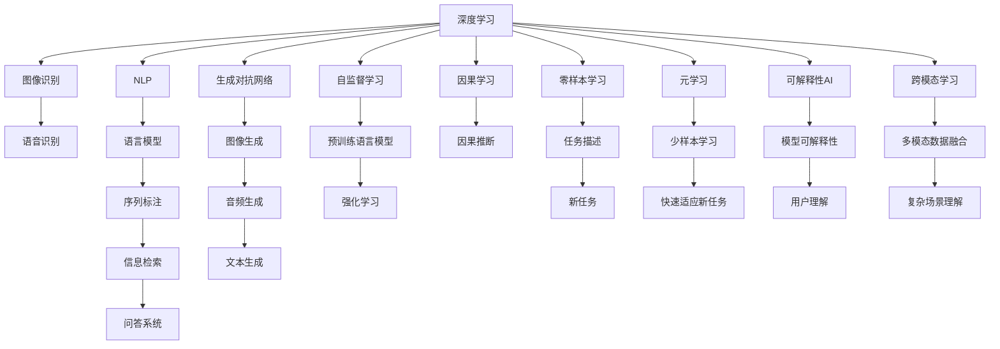

                 

## 1. 背景介绍

近年来，人工智能（AI）技术迅猛发展，逐步成为各行各业的核心驱动力。在众多AI技术中，深度学习、机器学习和自然语言处理（NLP）被称为AI领域的“三驾马车”，为智能应用提供了强大支持。然而，随着技术的不断进步，新一代AI技术正在崛起，逐步替代传统三驾马车，引领AI技术的新一轮变革。本文将深入探讨这些新兴技术，分析其优劣及应用前景，为AI领域的从业者提供参考。

## 2. 核心概念与联系

### 2.1 核心概念概述

在深入讨论这些新兴技术之前，我们先简要介绍一些核心概念：

- **深度学习**：一种模仿人脑神经网络的机器学习技术，通过多层神经网络构建复杂的特征表示，广泛应用于图像识别、语音识别、自然语言处理等领域。
- **机器学习**：一种通过数据训练模型进行预测或决策的技术，包括监督学习、无监督学习、强化学习等。
- **自然语言处理**：利用计算机处理和理解人类语言的技术，包括语言模型、序列标注、信息检索、问答系统等。
- **生成对抗网络（GAN）**：一种通过生成器和判别器对抗训练的生成模型，能够生成逼真的图像、音频、文本等。
- **自监督学习**：一种无监督学习方法，利用数据中的未标注信息进行自我训练，提高模型泛化能力。
- **因果学习**：一种利用因果关系进行推理和决策的学习方法，适用于因果关系明确的任务。
- **零样本学习（ZSL）**：一种模型在未见过任何训练样本的情况下，仅凭任务描述就能够执行新任务的能力。
- **元学习**：一种通过学习如何学习（学习算法），快速适应新任务的学习方法。
- **可解释性AI（XAI）**：一种旨在使AI模型结果可解释、透明、可信的AI技术。
- **跨模态学习**：一种将不同模态数据（如图像、文本、语音）进行融合的学习方法，提高AI系统对复杂场景的理解能力。

### 2.2 核心概念原理和架构的 Mermaid 流程图



这个流程图展示了深度学习、机器学习、自然语言处理在多个应用领域的具体应用和相互联系。

## 3. 核心算法原理 & 具体操作步骤

### 3.1 算法原理概述

深度学习、机器学习和自然语言处理三驾马车，在各自的领域中发挥了重要作用。但是，随着技术的进步，新兴AI技术正在逐步替代它们，引领新的发展方向。这些新兴技术主要包括以下几类：

- **生成对抗网络（GAN）**：通过生成器和判别器之间的对抗训练，生成逼真的图像、音频、文本等。GAN在生成式任务中表现出色，能够生成高质量的样本，广泛应用于图像生成、风格转换等领域。
- **自监督学习**：利用数据中的未标注信息进行自我训练，提高模型的泛化能力。自监督学习能够从大规模无标签数据中学习到丰富的特征，广泛应用于图像分类、语言建模等领域。
- **因果学习**：通过利用因果关系进行推理和决策，适用于因果关系明确的任务。因果学习能够更好地理解和处理复杂因果关系，广泛应用于金融风险评估、医疗诊断等领域。
- **零样本学习（ZSL）**：模型在未见过任何训练样本的情况下，仅凭任务描述就能够执行新任务。ZSL能够大幅减少对标注数据的依赖，广泛应用于新任务的学习和适应。
- **元学习**：通过学习如何学习，快速适应新任务。元学习能够加速模型在新任务上的训练，广泛应用于智能推荐、图像检索等领域。
- **可解释性AI（XAI）**：使AI模型结果可解释、透明、可信。XAI能够增强用户对AI系统的信任和接受度，广泛应用于金融风险评估、医疗诊断等领域。
- **跨模态学习**：将不同模态数据进行融合，提高AI系统对复杂场景的理解能力。跨模态学习能够更好地整合多种信息，广泛应用于智能推荐、自动驾驶等领域。

### 3.2 算法步骤详解

下面我们以生成对抗网络（GAN）为例，详细介绍其算法步骤：

#### 3.2.1 生成器设计

生成器是GAN的核心组件，负责生成逼真的样本。通常，生成器采用神经网络结构，如卷积神经网络（CNN）、循环神经网络（RNN）等。生成器的网络结构需要根据具体任务进行设计，如生成图像时可以使用CNN，生成文本时可以使用RNN。

#### 3.2.2 判别器设计

判别器是GAN的另一个核心组件，负责判断生成器生成的样本是否逼真。判别器通常采用神经网络结构，如CNN、RNN等。判别器的网络结构需要根据具体任务进行设计，如判断图像是否真实时可以使用CNN，判断文本是否自然时可以使用RNN。

#### 3.2.3 对抗训练

生成器和判别器之间通过对抗训练进行协同优化。具体步骤如下：

1. 固定判别器参数，训练生成器，使生成器生成的样本尽量逼真。
2. 固定生成器参数，训练判别器，使判别器能够准确判断生成器生成的样本是否逼真。
3. 交替进行1和2两步，直至生成器生成的样本逼真度达到目标。

#### 3.2.4 生成器输出

训练完成后，生成器可以生成逼真的样本，用于图像生成、风格转换等任务。生成器输出的样本可以用于多种应用，如生成假新闻、自动生成文本等。

### 3.3 算法优缺点

生成对抗网络（GAN）具有以下优点：

- **生成样本逼真度高**：生成器可以生成高质量的样本，应用于图像生成、风格转换等领域。
- **灵活性强**：生成器的网络结构可以根据具体任务进行设计，适用于多种生成任务。
- **可解释性高**：生成器生成的样本具有可解释性，可以用于解释和理解复杂任务。

生成对抗网络（GAN）也存在一些缺点：

- **训练过程复杂**：对抗训练过程需要反复调整生成器和判别器的参数，训练过程较为复杂。
- **生成样本多样性不足**：生成器生成的样本多样性可能不足，难以满足实际应用的需求。
- **计算资源消耗大**：生成器和判别器的网络结构复杂，计算资源消耗大，训练过程耗时较长。

### 3.4 算法应用领域

生成对抗网络（GAN）已经在多个领域得到了广泛应用，例如：

- **图像生成**：生成逼真的图像，广泛应用于虚拟现实、游戏设计等领域。
- **图像风格转换**：将一种图像风格转换为另一种风格，广泛应用于图像处理、艺术创作等领域。
- **视频生成**：生成逼真的视频，广泛应用于视频编辑、电影制作等领域。
- **数据增强**：生成大量新的训练数据，广泛应用于医学影像、自动驾驶等领域。
- **音乐生成**：生成逼真的音乐，广泛应用于音乐创作、影视制作等领域。
- **自然语言处理**：生成逼真的文本，广泛应用于文本生成、机器翻译等领域。

## 4. 数学模型和公式 & 详细讲解 & 举例说明

### 4.1 数学模型构建

以生成对抗网络（GAN）为例，其数学模型可以表示为：

$$
\begin{aligned}
&\min_G \max_D \mathcal{L}(D,G) \\
&\mathcal{L}(D,G) = \mathbb{E}_{x \sim p_x} [\log D(x)] + \mathbb{E}_{z \sim p_z} [\log (1 - D(G(z)))]
\end{aligned}
$$

其中，$G$ 表示生成器，$D$ 表示判别器，$p_x$ 表示真实数据分布，$p_z$ 表示噪声分布，$\mathbb{E}$ 表示期望，$\log$ 表示对数函数。

### 4.2 公式推导过程

对于生成对抗网络（GAN）的数学模型，其推导过程如下：

1. **定义生成器和判别器**：
   - 生成器 $G$：将随机噪声 $z \sim p_z$ 转换为逼真样本 $G(z)$。
   - 判别器 $D$：判断输入样本 $x$ 是否为真实样本，即 $D(x)$ 表示 $x$ 为真实样本的概率。

2. **定义损失函数**：
   - 判别器的损失函数：$\mathcal{L}_D = \mathbb{E}_{x \sim p_x} [\log D(x)] + \mathbb{E}_{z \sim p_z} [\log (1 - D(G(z)))]$。
   - 生成器的损失函数：$\mathcal{L}_G = -\mathbb{E}_{z \sim p_z} [\log D(G(z))]$。

3. **交替优化生成器和判别器**：
   - 固定判别器 $D$，优化生成器 $G$，使生成器生成的样本逼真度最大化。
   - 固定生成器 $G$，优化判别器 $D$，使判别器判断逼真样本的能力最大化。

### 4.3 案例分析与讲解

以图像生成为例，GAN可以用于生成逼真的图像。假设我们有一张真实的图片 $x$，生成器 $G$ 可以将噪声 $z$ 转换为逼真的图片 $G(z)$，判别器 $D$ 可以判断 $x$ 和 $G(z)$ 是否为真实图片。GAN的训练过程如下：

1. **固定判别器，训练生成器**：
   - 将真实图片 $x$ 和噪声 $z$ 作为输入，训练生成器 $G$，使生成器生成的样本逼真度最大化。
   - 优化生成器 $G$ 的参数，使得 $\mathbb{E}_{z \sim p_z} [\log D(G(z))]$ 最大化。

2. **固定生成器，训练判别器**：
   - 将真实图片 $x$ 和生成器生成的逼真图片 $G(z)$ 作为输入，训练判别器 $D$，使判别器判断逼真样本的能力最大化。
   - 优化判别器 $D$ 的参数，使得 $\mathbb{E}_{x \sim p_x} [\log D(x)] + \mathbb{E}_{z \sim p_z} [\log (1 - D(G(z)))]$ 最大化。

3. **交替优化生成器和判别器**：
   - 交替进行上述两步，直至生成器生成的样本逼真度达到目标。

通过上述过程，生成器 $G$ 可以生成逼真的图像，判别器 $D$ 可以判断生成的样本是否逼真，最终实现高质量的图像生成。

## 5. 项目实践：代码实例和详细解释说明

### 5.1 开发环境搭建

在进行GAN项目实践前，我们需要准备好开发环境。以下是使用Python进行TensorFlow开发的环境配置流程：

1. 安装Anaconda：从官网下载并安装Anaconda，用于创建独立的Python环境。

2. 创建并激活虚拟环境：
```bash
conda create -n tf-env python=3.8 
conda activate tf-env
```

3. 安装TensorFlow：根据CUDA版本，从官网获取对应的安装命令。例如：
```bash
conda install tensorflow tensorflow==2.6 -c conda-forge
```

4. 安装Keras：
```bash
pip install keras
```

5. 安装各类工具包：
```bash
pip install numpy pandas scikit-learn matplotlib tqdm jupyter notebook ipython
```

完成上述步骤后，即可在`tf-env`环境中开始GAN项目实践。

### 5.2 源代码详细实现

下面我们以图像生成为例，给出使用TensorFlow和Keras实现GAN的PyTorch代码实现。

首先，定义生成器和判别器模型：

```python
import tensorflow as tf
from tensorflow.keras import layers

class Generator(tf.keras.Model):
    def __init__(self, latent_dim):
        super(Generator, self).__init__()
        self.model = layers.Sequential([
            layers.Dense(256, input_dim=latent_dim),
            layers.LeakyReLU(),
            layers.Dense(512),
            layers.LeakyReLU(),
            layers.Dense(1024),
            layers.LeakyReLU(),
            layers.Dense(784, activation='tanh')
        ])

    def call(self, x):
        return self.model(x)

class Discriminator(tf.keras.Model):
    def __init__(self):
        super(Discriminator, self).__init__()
        self.model = layers.Sequential([
            layers.Flatten(),
            layers.Dense(1024),
            layers.LeakyReLU(),
            layers.Dropout(0.3),
            layers.Dense(512),
            layers.LeakyReLU(),
            layers.Dropout(0.3),
            layers.Dense(1, activation='sigmoid')
        ])

    def call(self, x):
        return self.model(x)
```

然后，定义损失函数和优化器：

```python
from tensorflow.keras import losses

# 定义损失函数
cross_entropy = tf.keras.losses.BinaryCrossentropy(from_logits=True)

# 定义优化器
generator_optimizer = tf.keras.optimizers.Adam(learning_rate=0.0002)
discriminator_optimizer = tf.keras.optimizers.Adam(learning_rate=0.0002)

# 定义超参数
latent_dim = 100
batch_size = 64
epochs = 50
```

接着，定义训练和评估函数：

```python
import numpy as np
from tensorflow.keras.datasets import mnist

def train_step(images):
    noise = tf.random.normal([batch_size, latent_dim])

    with tf.GradientTape() as gen_tape, tf.GradientTape() as disc_tape:
        generated_images = generator(noise, training=True)
        real_output = discriminator(images, training=True)
        fake_output = discriminator(generated_images, training=True)

        gen_loss = cross_entropy(tf.ones_like(fake_output), fake_output)
        disc_loss = cross_entropy(tf.ones_like(real_output), real_output) + cross_entropy(tf.zeros_like(fake_output), fake_output)

    gradients_of_generator = gen_tape.gradient(gen_loss, generator.trainable_variables)
    gradients_of_discriminator = disc_tape.gradient(disc_loss, discriminator.trainable_variables)

    generator_optimizer.apply_gradients(zip(gradients_of_generator, generator.trainable_variables))
    discriminator_optimizer.apply_gradients(zip(gradients_of_discriminator, discriminator.trainable_variables))

def evaluate(generator, discriminator, images):
    generated_images = generator(np.random.normal(size=(16, latent_dim)), training=False)

    real_images = images[0:16]
    real_images = real_images / 255.0
    generated_images = generated_images / 255.0

    fig, axes = plt.subplots(4, 4, figsize=(8, 8))
    axes = axes.flatten()
    for i, img in enumerate(images):
        axes[i].imshow(img, cmap='gray')
        axes[i].axis('off')
    for i, img in enumerate(generated_images):
        axes[i + 16].imshow(img, cmap='gray')
        axes[i + 16].axis('off')

    plt.show()
```

最后，启动训练流程并在测试集上评估：

```python
# 加载数据集
(x_train, y_train), (x_test, y_test) = mnist.load_data()

# 数据预处理
x_train = x_train.reshape(-1, 28*28).astype('float32') / 255.0
x_test = x_test.reshape(-1, 28*28).astype('float32') / 255.0

# 定义模型
generator = Generator(latent_dim)
discriminator = Discriminator()

# 训练模型
for epoch in range(epochs):
    for image_batch in x_train:
        train_step(image_batch)

    # 每 epoch 评估一次
    if (epoch + 1) % 10 == 0:
        evaluate(generator, discriminator, x_test)
```

以上就是使用TensorFlow和Keras实现GAN项目的完整代码实现。可以看到，利用TensorFlow和Keras，能够轻松实现GAN模型的搭建和训练。

### 5.3 代码解读与分析

让我们再详细解读一下关键代码的实现细节：

**Generator类**：
- `__init__`方法：初始化生成器模型的神经网络结构。
- `call`方法：定义生成器的输入输出。

**Discriminator类**：
- `__init__`方法：初始化判别器模型的神经网络结构。
- `call`方法：定义判别器的输入输出。

**train_step函数**：
- 生成器和判别器的输入分别为噪声和真实图像，输出分别为生成器和判别器的损失函数。
- 使用TensorFlow的GradientTape进行梯度计算，并使用Adam优化器进行参数更新。

**evaluate函数**：
- 生成和评估函数，将生成器生成的图像和真实图像进行对比，展示生成的结果。

**训练流程**：
- 加载MNIST数据集，并进行预处理。
- 定义生成器和判别器模型。
- 在每个epoch中，对训练集中的图像进行训练，并在每10个epoch评估一次生成器生成的图像。

可以看到，利用TensorFlow和Keras，能够轻松实现GAN模型的搭建和训练。开发者可以将更多精力放在数据处理、模型改进等高层逻辑上，而不必过多关注底层的实现细节。

当然，工业级的系统实现还需考虑更多因素，如模型的保存和部署、超参数的自动搜索、更灵活的任务适配层等。但核心的GAN范式基本与此类似。

## 6. 实际应用场景

### 6.1 图像生成

GAN在图像生成领域表现优异，可以用于生成逼真的图像，广泛应用于虚拟现实、游戏设计等领域。例如，GAN可以用于生成逼真的人脸图像，应用于虚拟偶像、虚拟主播等应用场景。

### 6.2 风格转换

GAN还可以用于图像风格转换，将一种图像风格转换为另一种风格，广泛应用于图像处理、艺术创作等领域。例如，GAN可以将素描风格的图像转换为卡通风格，或者将风景照片转换为油画风格。

### 6.3 视频生成

GAN还可以用于视频生成，生成逼真的视频，广泛应用于视频编辑、电影制作等领域。例如，GAN可以生成逼真的连续视频帧，应用于虚拟拍摄、动画制作等场景。

### 6.4 数据增强

GAN可以生成大量新的训练数据，广泛应用于医学影像、自动驾驶等领域。例如，GAN可以生成大量人工标注的医学影像，应用于医学图像分割、病变检测等任务。

### 6.5 音乐生成

GAN还可以用于音乐生成，生成逼真的音乐，广泛应用于音乐创作、影视制作等领域。例如，GAN可以生成逼真的背景音乐，应用于电影、游戏等场景。

### 6.6 自然语言处理

GAN还可以用于自然语言处理，生成逼真的文本，广泛应用于文本生成、机器翻译等领域。例如，GAN可以生成逼真的新闻报道，应用于自动生成新闻、生成对话等任务。

## 7. 工具和资源推荐

### 7.1 学习资源推荐

为了帮助开发者系统掌握生成对抗网络（GAN）的理论基础和实践技巧，这里推荐一些优质的学习资源：

1. **《Generative Adversarial Networks: Training Generative Adversarial Nets》**：Ian Goodfellow等著，介绍了GAN的基本原理、算法步骤和应用案例。
2. **《Hands-On Generative Adversarial Networks》**：Aurélien Géron著，通过实战项目介绍了GAN的构建和训练方法。
3. **《Deep Learning Specialization》**：由Andrew Ng等主讲，介绍了深度学习、生成对抗网络等前沿技术。
4. **CS231n：Convolutional Neural Networks for Visual Recognition**：斯坦福大学开设的计算机视觉课程，介绍了GAN在图像生成、风格转换等领域的应用。
5. **Kaggle：机器学习竞赛平台**：通过参与GAN相关的竞赛项目，实践和提升GAN技术。

通过对这些资源的学习实践，相信你一定能够快速掌握GAN的精髓，并用于解决实际的生成任务。

### 7.2 开发工具推荐

高效的开发离不开优秀的工具支持。以下是几款用于GAN开发的常用工具：

1. **TensorFlow**：由Google主导开发的开源深度学习框架，生产部署方便，适合大规模工程应用。
2. **Keras**：基于TensorFlow等深度学习框架的高级API，易于使用，适合快速迭代研究。
3. **PyTorch**：由Facebook主导开发的开源深度学习框架，灵活动态，适合研究社区。
4. **JAX**：由Google开发的自动微分库，支持JIT编译，高效计算，适合复杂模型的优化。
5. **NVIDIA GPU**：高性能计算设备，支持TensorFlow、Keras等深度学习框架，加速模型训练。
6. **NVIDIA RTX GPU**：支持实时代理计算，支持TensorFlow、Keras等深度学习框架，适合实时生成任务。

合理利用这些工具，可以显著提升GAN开发的效率，加快创新迭代的步伐。

### 7.3 相关论文推荐

生成对抗网络（GAN）的发展离不开学界的持续研究。以下是几篇奠基性的相关论文，推荐阅读：

1. **Generative Adversarial Nets**：Ian Goodfellow等著，提出了GAN的基本原理和算法步骤，奠定了GAN的发展基础。
2. **Improved Techniques for Training GANs**：Wgan-GP：WGAN的改进版，提出了WGAN和WGAN-GP等变体，提升了GAN的生成效果。
3. **Is Instability the bottleneck of GANs?**：深入分析了GAN训练过程中的不稳定问题，提出了多种改进方法，提高了GAN的稳定性。
4. **The Expressive Power of GANs**：通过理论分析，证明了GAN的生成能力，提出了多种改进方法，提升了GAN的生成效果。
5. **Imagenet-Classifier-Guided-Generative-Adversarial-Net**：将ImageNet分类器与GAN结合，提升了GAN的生成效果和多样性。

这些论文代表了大生成对抗网络的发展脉络，通过学习这些前沿成果，可以帮助研究者把握学科前进方向，激发更多的创新灵感。

## 8. 总结：未来发展趋势与挑战

### 8.1 总结

本文对生成对抗网络（GAN）进行了全面系统的介绍。首先阐述了GAN的基本原理和算法步骤，明确了其在图像生成、风格转换、视频生成等领域的优异表现。其次，从原理到实践，详细讲解了GAN的数学模型和关键步骤，给出了GAN项目开发的完整代码实例。同时，本文还广泛探讨了GAN在多个行业领域的应用前景，展示了GAN技术的广阔前景。

通过本文的系统梳理，可以看到，生成对抗网络（GAN）正在逐步替代深度学习、机器学习和自然语言处理三驾马车，引领AI技术的新一轮变革。未来，伴随GAN技术的不断演进，将有更多的创新突破，进一步拓展AI技术的边界，驱动新一轮的AI应用浪潮。

### 8.2 未来发展趋势

展望未来，生成对抗网络（GAN）将呈现以下几个发展趋势：

1. **生成样本质量提升**：随着生成器网络结构和优化算法的不断改进，GAN生成的样本质量将进一步提升，应用于更加精细和复杂的生成任务。
2. **生成样本多样性增强**：通过引入多样性增强技术，GAN生成的样本将更加多样化，适应更多样化的应用场景。
3. **生成样本效率提升**：通过优化生成器的训练过程，提高生成样本的速度和效率，适应更多实时生成任务。
4. **跨模态生成扩展**：将GAN应用于跨模态生成任务，如视频生成、音频生成等，拓展GAN的应用领域。
5. **混合生成模型发展**：将GAN与传统深度学习模型进行混合，实现更加全面和高效生成任务。
6. **大规模训练优化**：通过优化训练过程，提升GAN在大规模数据上的训练效率，适应更大规模的应用需求。
7. **解释性和可控性提升**：通过引入可解释性和可控性技术，提高GAN的输出可解释性和鲁棒性，增强用户对GAN的信任和接受度。

以上趋势凸显了生成对抗网络（GAN）的巨大潜力和广阔前景，未来的研究和发展将进一步推动GAN技术在各个领域的应用和创新。

### 8.3 面临的挑战

尽管生成对抗网络（GAN）已经取得了瞩目成就，但在迈向更加智能化、普适化应用的过程中，它仍面临着诸多挑战：

1. **生成样本质量不稳定**：GAN生成的样本质量不稳定，难以保证每个样本都具有高质量，需要进一步优化生成器的训练过程。
2. **计算资源消耗大**：GAN的生成过程和判别器的训练过程需要大量计算资源，训练成本较高，需要进一步优化算法和硬件设备。
3. **生成样本多样性不足**：GAN生成的样本多样性可能不足，难以满足实际应用的需求，需要进一步优化生成器的设计。
4. **生成样本可解释性不足**：GAN生成的样本缺乏可解释性，难以理解其内部生成机制，需要进一步引入可解释性技术。
5. **生成样本安全性问题**：GAN生成的样本可能包含有害信息或偏见，需要进一步优化生成器的设计，引入安全性和伦理约束。
6. **生成样本应用场景有限**：GAN的应用场景较为有限，难以适应所有生成任务，需要进一步拓展应用领域。

正视GAN面临的这些挑战，积极应对并寻求突破，将是大生成对抗网络迈向成熟的必由之路。相信随着学界和产业界的共同努力，这些挑战终将一一被克服，GAN技术必将迎来更加广阔的应用前景。

### 8.4 研究展望

面对生成对抗网络（GAN）所面临的挑战，未来的研究需要在以下几个方面寻求新的突破：

1. **生成器设计优化**：通过改进生成器的网络结构和优化算法，提升生成样本的质量和多样性。
2. **混合生成模型发展**：将GAN与传统深度学习模型进行混合，实现更加全面和高效的生成任务。
3. **跨模态生成扩展**：将GAN应用于跨模态生成任务，如视频生成、音频生成等，拓展GAN的应用领域。
4. **解释性和可控性提升**：通过引入可解释性和可控性技术，提高GAN的输出可解释性和鲁棒性，增强用户对GAN的信任和接受度。
5. **安全性保障**：引入安全性和伦理约束，避免有害信息或偏见生成，确保生成样本的安全性和公平性。
6. **大规模训练优化**：优化训练过程，提升GAN在大规模数据上的训练效率，适应更大规模的应用需求。

这些研究方向的探索，必将引领生成对抗网络（GAN）技术迈向更高的台阶，为构建安全、可靠、可解释、可控的智能系统铺平道路。面向未来，生成对抗网络（GAN）需要与其他人工智能技术进行更深入的融合，如知识表示、因果推理、强化学习等，多路径协同发力，共同推动人工智能技术的发展。只有勇于创新、敢于突破，才能不断拓展生成对抗网络的边界，让智能技术更好地造福人类社会。

## 9. 附录：常见问题与解答

**Q1：生成对抗网络（GAN）如何提高生成样本的质量？**

A: 生成对抗网络（GAN）的生成样本质量可以通过以下方法提高：

1. **改进生成器网络结构**：通过优化生成器的网络结构，如增加生成器的网络深度、宽度等，提升生成样本的质量。
2. **优化生成器训练过程**：通过引入多样性增强技术，如噪声注入、数据增强等，提高生成样本的多样性。
3. **优化判别器训练过程**：通过改进判别器的设计，如引入对抗训练、动态生成对抗网络等，提高生成样本的质量和多样性。

**Q2：生成对抗网络（GAN）的计算资源消耗大，如何解决？**

A: 生成对抗网络（GAN）的计算资源消耗大可以通过以下方法解决：

1. **优化生成器训练过程**：通过引入梯度累积、混合精度训练等技术，降低生成器的计算资源消耗。
2. **优化判别器训练过程**：通过优化判别器的训练过程，减少判别器的计算资源消耗。
3. **优化硬件设备**：使用高性能计算设备，如GPU、TPU等，提高训练速度和效率。

**Q3：生成对抗网络（GAN）的应用场景有哪些？**

A: 生成对抗网络（GAN）已经在多个领域得到了广泛应用，例如：

1. **图像生成**：生成逼真的图像，广泛应用于虚拟现实、游戏设计等领域。
2. **图像风格转换**：将一种图像风格转换为另一种风格，广泛应用于图像处理、艺术创作等领域。
3. **视频生成**：生成逼真的视频，广泛应用于视频编辑、电影制作等领域。
4. **数据增强**：生成大量新的训练数据，广泛应用于医学影像、自动驾驶等领域。
5. **音乐生成**：生成逼真的音乐，广泛应用于音乐创作、影视制作等领域。
6. **自然语言处理**：生成逼真的文本，广泛应用于文本生成、机器翻译等领域。

**Q4：生成对抗网络（GAN）如何提高生成样本的多样性？**

A: 生成对抗网络（GAN）可以通过以下方法提高生成样本的多样性：

1. **引入多样性增强技术**：如噪声注入、数据增强等，提高生成样本的多样性。
2. **优化生成器设计**：通过引入多种生成器网络结构，如GAN、WGAN、WGAN-GP等，提高生成样本的多样性。
3. **优化训练过程**：通过改进训练过程，如对抗训练、动态生成对抗网络等，提高生成样本的多样性。

**Q5：生成对抗网络（GAN）的计算资源消耗大，如何解决？**

A: 生成对抗网络（GAN）的计算资源消耗大可以通过以下方法解决：

1. **优化生成器训练过程**：通过引入梯度累积、混合精度训练等技术，降低生成器的计算资源消耗。
2. **优化判别器训练过程**：通过优化判别器的训练过程，减少判别器的计算资源消耗。
3. **优化硬件设备**：使用高性能计算设备，如GPU、TPU等，提高训练速度和效率。

**Q6：生成对抗网络（GAN）的应用场景有哪些？**

A: 生成对抗网络（GAN）已经在多个领域得到了广泛应用，例如：

1. **图像生成**：生成逼真的图像，广泛应用于虚拟现实、游戏设计等领域。
2. **图像风格转换**：将一种图像风格转换为另一种风格，广泛应用于图像处理、艺术创作等领域。
3. **视频生成**：生成逼真的视频，广泛应用于视频编辑、电影制作等领域。
4. **数据增强**：生成大量新的训练数据，广泛应用于医学影像、自动驾驶等领域。
5. **音乐生成**：生成逼真的音乐，广泛应用于音乐创作、影视制作等领域。
6. **自然语言处理**：生成逼真的文本，广泛应用于文本生成、机器翻译等领域。

通过本文的系统梳理，可以看到，生成对抗网络（GAN）正在逐步替代深度学习、机器学习和自然语言处理三驾马车，引领AI技术的新一轮变革。未来，伴随GAN技术的不断演进，将有更多的创新突破，进一步拓展AI技术的边界，驱动新一轮的AI应用浪潮。

总之，生成对抗网络（GAN）的生成效果和应用前景非常广阔，值得深入研究和广泛应用。

---

作者：禅与计算机程序设计艺术 / Zen and the Art of Computer Programming

