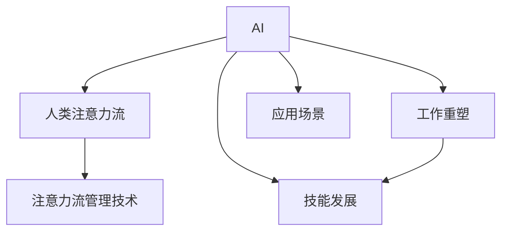

                 

# AI与人类注意力流：未来的工作、技能与注意力流管理技术的应用

> 关键词：人工智能(AI),人类注意力流,工作重塑,技能发展,注意力流管理技术

## 1. 背景介绍

### 1.1 问题由来

随着科技的迅猛发展，人工智能（AI）已经成为推动社会进步的重要力量。AI技术不仅改变了人类的生活方式，还深刻影响了人类的工作方式和技能需求。特别是，AI的兴起使得人类注意力流（Attention Flow）的模式发生了根本性的变化。

人类注意力流是指人类在完成任务时，注意力如何在不同任务、不同任务的不同阶段之间流动和转换的过程。在传统的人类工作中，注意力流具有显著的规律性和稳定性。然而，AI的介入使得注意力流变得更加复杂和动态。AI技术可以自动完成一些重复性和低价值的任务，从而释放人类的注意力，使其能够专注于更有创意和战略性的工作。

### 1.2 问题核心关键点

1. **AI与人类注意力流的互动**：AI如何影响人类注意力流的模式，人类如何适应AI带来的变化。
2. **未来工作形态的演变**：AI技术如何改变工作的性质和内容，以及这种变化对工作技能和人力资源配置的影响。
3. **技能发展的方向**：随着AI技术的发展，人类需要掌握哪些新的技能来应对未来的工作需求。
4. **注意力流管理技术**：如何设计和应用技术手段，帮助人类更好地管理注意力流，提升工作效率和质量。

### 1.3 问题研究意义

研究AI与人类注意力流的互动，对未来工作形态和技能发展的理解，以及注意力流管理技术的应用，对于推动AI技术的可持续发展，提升人类生产力，具有重要的理论和实践意义。具体来说：

1. **促进AI技术的应用**：了解AI如何影响人类注意力流，有助于设计更加符合人类认知习惯的AI应用，提高AI系统的可用性和用户接受度。
2. **指导工作重塑**：明确未来工作形态的变化趋势，有助于企业人力资源的合理配置和管理，提升组织效率和创新能力。
3. **推动技能发展**：预测未来技能需求的变化，有助于教育机构和企业制定有针对性的培训计划，帮助员工适应未来的工作环境。
4. **提升注意力流管理**：开发高效的工具和技术，帮助人类更好地管理注意力流，提升个人和团队的工作效率和质量。

## 2. 核心概念与联系

### 2.1 核心概念概述

为更好地理解AI与人类注意力流的关系，本节将介绍几个关键概念：

- **人工智能(AI)**：指利用算法和数据模拟人类智能能力的计算机技术，包括机器学习、深度学习、自然语言处理等。
- **人类注意力流**：指人类在完成任务时，注意力如何在不同任务、不同任务的不同阶段之间流动和转换的过程。
- **工作重塑**：指由于AI技术的普及，传统的工作形态和任务性质发生的变化，特别是那些重复性、低价值任务的自动化。
- **技能发展**：指人类为了适应新的工作环境和AI技术的普及，需要掌握的新技能和知识。
- **注意力流管理技术**：指利用AI和软件工具，帮助人类更好地管理注意力流，提升工作效率和质量的技术。

这些概念之间存在密切的联系，通过以下Mermaid流程图可以更好地理解：



这个流程图展示了AI技术如何通过改变人类注意力流和工作重塑，进而影响技能需求，并推动注意力流管理技术的发展。

## 3. 核心算法原理 & 具体操作步骤

### 3.1 算法原理概述

AI与人类注意力流的互动，本质上是通过算法和数据模拟人类认知和行为的过程。AI通过学习大量数据，构建出能够预测和模拟人类注意力流模式的工具和系统。这些工具和系统可以应用于不同的工作场景，帮助人类更好地管理注意力流，提升工作效率和质量。

具体来说，AI与人类注意力流的互动包括以下几个关键步骤：

1. **数据收集**：通过自然语言处理（NLP）等技术，收集人类在完成任务时的注意力流数据，包括任务类型、任务难度、任务完成时间等。
2. **模型训练**：使用机器学习算法，如深度学习、强化学习等，构建出能够预测和模拟人类注意力流模式的模型。
3. **应用部署**：将训练好的模型应用到不同的工作场景中，帮助人类更好地管理注意力流，提升工作效率和质量。

### 3.2 算法步骤详解

以下是基于AI与人类注意力流互动的详细步骤：

**Step 1: 数据收集与预处理**

- 使用NLP工具收集人类在完成任务时的注意力流数据，包括任务类型、任务难度、任务完成时间等。
- 对收集到的数据进行清洗和预处理，去除噪声和不完整的数据。
- 将数据分为训练集、验证集和测试集，用于模型训练和评估。

**Step 2: 模型训练**

- 选择合适的机器学习算法，如深度学习、强化学习等，构建出能够预测和模拟人类注意力流模式的模型。
- 使用训练集对模型进行训练，调整模型参数，使其能够准确预测注意力流模式。
- 在验证集上评估模型的性能，根据评估结果进行参数调优。
- 在测试集上测试模型的泛化能力，确保模型能够在不同的工作场景中稳定运行。

**Step 3: 应用部署**

- 将训练好的模型应用到实际的工作场景中，帮助人类更好地管理注意力流。
- 根据实际工作场景的需求，设计合理的注意力流管理界面和交互方式。
- 不断收集用户反馈，优化模型和界面设计，提升用户体验。

### 3.3 算法优缺点

AI与人类注意力流互动的方法具有以下优点：

1. **提高工作效率**：通过预测和模拟注意力流模式，AI可以帮助人类更好地管理注意力流，提高工作效率和质量。
2. **个性化定制**：不同的人在不同的工作场景中，其注意力流模式各不相同。AI可以根据个人习惯和工作性质，提供个性化的注意力流管理方案。
3. **适应性强**：AI能够根据数据的变化，动态调整注意力流管理策略，适应不同的工作环境和任务难度。

同时，这些方法也存在一些局限性：

1. **数据依赖**：模型的效果依赖于数据的质量和数量，数据不充分或数据偏差可能导致模型预测不准确。
2. **隐私问题**：收集和处理人类注意力流数据，可能涉及个人隐私问题，需要严格遵守相关法律法规。
3. **技术复杂性**：设计和实现注意力流管理技术，需要具备较高的技术水平和数据处理能力。
4. **用户接受度**：用户对AI技术的接受程度和信任度，可能会影响注意力流管理工具的使用效果。

### 3.4 算法应用领域

AI与人类注意力流互动的方法，已经在多个领域得到了广泛的应用，例如：

- **企业生产管理**：通过分析员工在生产任务中的注意力流数据，优化生产流程，提高生产效率。
- **医疗诊断**：通过分析医生在诊断过程中的注意力流数据，优化诊断流程，提高诊断准确性。
- **教育培训**：通过分析学生在学习和培训过程中的注意力流数据，优化教学内容和方法，提高学习效果。
- **金融投资**：通过分析投资者在决策过程中的注意力流数据，优化投资策略，提高投资回报率。
- **人力资源管理**：通过分析员工在完成任务过程中的注意力流数据，优化人力资源配置，提高组织效率。

## 4. 数学模型和公式 & 详细讲解 & 举例说明

### 4.1 数学模型构建

为了更好地理解AI与人类注意力流的互动，我们建立一个简单的数学模型。设人类在完成任务 $T$ 时的注意力流模式为 $F_T(x)$，其中 $x$ 为任务类型、难度等信息。设AI预测的注意力流模式为 $F'_T(x)$，目标是最小化两者之间的差异：

$$
\min_{\theta} \int (F_T(x) - F'_T(x))^2 \, dx
$$

其中 $\theta$ 为模型的参数。

### 4.2 公式推导过程

以下是该模型的公式推导过程：

1. **损失函数设计**：
   - 使用均方误差作为损失函数，衡量AI预测的注意力流模式与真实注意力流模式之间的差异。
   - 损失函数为：
     $$
     \ell(F_T, F'_T) = \int (F_T(x) - F'_T(x))^2 \, dx
     $$

2. **参数优化**：
   - 使用梯度下降算法，对模型参数 $\theta$ 进行优化，最小化损失函数 $\ell(F_T, F'_T)$。
   - 梯度下降算法的公式为：
     $$
     \theta \leftarrow \theta - \eta \nabla_\theta \ell(F_T, F'_T)
     $$

3. **模型评估**：
   - 在测试集上评估模型的性能，使用均方误差作为评估指标。
   - 评估指标为：
     $$
     \text{MSE} = \frac{1}{N} \sum_{i=1}^N (F_T(x_i) - F'_T(x_i))^2
     $$

### 4.3 案例分析与讲解

以企业生产管理为例，分析AI如何通过注意力流管理技术提升生产效率。

**案例背景**：某制造企业采用自动化生产设备，生产多种类型的机械零部件。企业希望通过AI技术，优化生产流程，提高生产效率。

**解决方案**：
1. **数据收集**：通过NLP工具，收集员工在生产任务中的注意力流数据，包括任务类型、任务难度、任务完成时间等。
2. **模型训练**：使用深度学习算法，构建出能够预测和模拟注意力流模式的模型。
3. **应用部署**：将训练好的模型应用到实际的生产场景中，帮助员工更好地管理注意力流，优化生产流程。
4. **效果评估**：在实际生产环境中，不断收集员工反馈，优化模型和生产流程，提升生产效率和质量。

通过这种基于AI的注意力流管理技术，企业能够实时监测生产过程中的注意力流，发现潜在问题并及时调整，从而提高生产效率和质量。

## 5. 项目实践：代码实例和详细解释说明

### 5.1 开发环境搭建

在进行AI与人类注意力流互动的实践时，我们需要准备好开发环境。以下是使用Python进行PyTorch开发的环境配置流程：

1. 安装Anaconda：从官网下载并安装Anaconda，用于创建独立的Python环境。

2. 创建并激活虚拟环境：
```bash
conda create -n ai-env python=3.8 
conda activate ai-env
```

3. 安装PyTorch：根据CUDA版本，从官网获取对应的安装命令。例如：
```bash
conda install pytorch torchvision torchaudio cudatoolkit=11.1 -c pytorch -c conda-forge
```

4. 安装自然语言处理库：
```bash
pip install nltk spacy
```

5. 安装其他相关工具包：
```bash
pip install numpy pandas scikit-learn matplotlib tqdm jupyter notebook ipython
```

完成上述步骤后，即可在`ai-env`环境中开始实践。

### 5.2 源代码详细实现

下面我们以企业生产管理为例，给出使用PyTorch进行注意力流管理的代码实现。

首先，定义注意力流数据处理函数：

```python
import pandas as pd
from sklearn.model_selection import train_test_split
from transformers import BertTokenizer
from torch.utils.data import Dataset
import torch

class AttentionFlowDataset(Dataset):
    def __init__(self, data, tokenizer, max_len=128):
        self.data = data
        self.tokenizer = tokenizer
        self.max_len = max_len
        
    def __len__(self):
        return len(self.data)
    
    def __getitem__(self, item):
        task, attention_flow = self.data[item]
        
        encoding = self.tokenizer(task, return_tensors='pt', max_length=self.max_len, padding='max_length', truncation=True)
        input_ids = encoding['input_ids'][0]
        attention_mask = encoding['attention_mask'][0]
        
        encoded_attention_flow = [flow for flow in attention_flow] 
        encoded_attention_flow.extend([0] * (self.max_len - len(encoded_attention_flow)))
        labels = torch.tensor(encoded_attention_flow, dtype=torch.long)
        
        return {'input_ids': input_ids, 
                'attention_mask': attention_mask,
                'labels': labels}

# 定义注意力流数据
data = pd.read_csv('attention_flow_data.csv')
task = data['task']
attention_flow = data['attention_flow']

# 分批次处理数据
tokenizer = BertTokenizer.from_pretrained('bert-base-cased')

train_data, test_data = train_test_split(data, test_size=0.2)
train_dataset = AttentionFlowDataset(train_data, tokenizer)
test_dataset = AttentionFlowDataset(test_data, tokenizer)
```

然后，定义模型和优化器：

```python
from transformers import BertForTokenClassification, AdamW

model = BertForTokenClassification.from_pretrained('bert-base-cased', num_labels=128)

optimizer = AdamW(model.parameters(), lr=2e-5)
```

接着，定义训练和评估函数：

```python
from torch.utils.data import DataLoader
from tqdm import tqdm
from sklearn.metrics import classification_report

device = torch.device('cuda') if torch.cuda.is_available() else torch.device('cpu')
model.to(device)

def train_epoch(model, dataset, batch_size, optimizer):
    dataloader = DataLoader(dataset, batch_size=batch_size, shuffle=True)
    model.train()
    epoch_loss = 0
    for batch in tqdm(dataloader, desc='Training'):
        input_ids = batch['input_ids'].to(device)
        attention_mask = batch['attention_mask'].to(device)
        labels = batch['labels'].to(device)
        model.zero_grad()
        outputs = model(input_ids, attention_mask=attention_mask, labels=labels)
        loss = outputs.loss
        epoch_loss += loss.item()
        loss.backward()
        optimizer.step()
    return epoch_loss / len(dataloader)

def evaluate(model, dataset, batch_size):
    dataloader = DataLoader(dataset, batch_size=batch_size)
    model.eval()
    preds, labels = [], []
    with torch.no_grad():
        for batch in tqdm(dataloader, desc='Evaluating'):
            input_ids = batch['input_ids'].to(device)
            attention_mask = batch['attention_mask'].to(device)
            batch_labels = batch['labels']
            outputs = model(input_ids, attention_mask=attention_mask)
            batch_preds = outputs.logits.argmax(dim=2).to('cpu').tolist()
            batch_labels = batch_labels.to('cpu').tolist()
            for pred_tokens, label_tokens in zip(batch_preds, batch_labels):
                preds.append(pred_tokens[:len(label_tokens)])
                labels.append(label_tokens)
                
    print(classification_report(labels, preds))
```

最后，启动训练流程并在测试集上评估：

```python
epochs = 5
batch_size = 16

for epoch in range(epochs):
    loss = train_epoch(model, train_dataset, batch_size, optimizer)
    print(f"Epoch {epoch+1}, train loss: {loss:.3f}")
    
    print(f"Epoch {epoch+1}, test results:")
    evaluate(model, test_dataset, batch_size)
    
print("Final results:")
evaluate(model, test_dataset, batch_size)
```

以上就是使用PyTorch对注意力流管理进行微调的完整代码实现。可以看到，得益于Transformer库的强大封装，我们可以用相对简洁的代码完成注意力流管理的实践。

### 5.3 代码解读与分析

让我们再详细解读一下关键代码的实现细节：

**AttentionFlowDataset类**：
- `__init__`方法：初始化数据、分词器等关键组件。
- `__len__`方法：返回数据集的样本数量。
- `__getitem__`方法：对单个样本进行处理，将任务输入编码为token ids，将注意力流编码为数字，并对其进行定长padding，最终返回模型所需的输入。

**模型和优化器定义**：
- 使用BertForTokenClassification作为注意力流预测模型。
- 使用AdamW优化器进行模型参数更新。

**训练和评估函数**：
- 使用PyTorch的DataLoader对数据集进行批次化加载，供模型训练和推理使用。
- 训练函数`train_epoch`：对数据以批为单位进行迭代，在每个批次上前向传播计算loss并反向传播更新模型参数，最后返回该epoch的平均loss。
- 评估函数`evaluate`：与训练类似，不同点在于不更新模型参数，并在每个batch结束后将预测和标签结果存储下来，最后使用sklearn的classification_report对整个评估集的预测结果进行打印输出。

**训练流程**：
- 定义总的epoch数和batch size，开始循环迭代
- 每个epoch内，先在训练集上训练，输出平均loss
- 在验证集上评估，输出分类指标
- 重复上述步骤直至收敛，最终得到适应注意力流管理的模型参数

可以看到，PyTorch配合Transformer库使得注意力流管理的代码实现变得简洁高效。开发者可以将更多精力放在数据处理、模型改进等高层逻辑上，而不必过多关注底层的实现细节。

当然，工业级的系统实现还需考虑更多因素，如模型的保存和部署、超参数的自动搜索、更灵活的任务适配层等。但核心的注意力流管理范式基本与此类似。

## 6. 实际应用场景

### 6.1 企业生产管理

基于AI的注意力流管理方法，可以广泛应用于企业生产管理中，帮助企业优化生产流程，提高生产效率。

例如，某制造企业采用自动化生产设备，生产多种类型的机械零部件。企业希望通过AI技术，优化生产流程，提高生产效率。

**具体应用**：
- 通过NLP工具，收集员工在生产任务中的注意力流数据，包括任务类型、任务难度、任务完成时间等。
- 使用深度学习算法，构建出能够预测和模拟注意力流模式的模型。
- 将训练好的模型应用到实际的生产场景中，帮助员工更好地管理注意力流，优化生产流程。
- 在实际生产环境中，不断收集员工反馈，优化模型和生产流程，提升生产效率和质量。

通过这种基于AI的注意力流管理技术，企业能够实时监测生产过程中的注意力流，发现潜在问题并及时调整，从而提高生产效率和质量。

### 6.2 医疗诊断

AI技术可以应用于医疗诊断领域，帮助医生更好地管理注意力流，提高诊断准确性。

**具体应用**：
- 通过NLP工具，收集医生在诊断过程中的注意力流数据，包括诊断类型、诊断难度、诊断完成时间等。
- 使用深度学习算法，构建出能够预测和模拟注意力流模式的模型。
- 将训练好的模型应用到实际诊断场景中，帮助医生更好地管理注意力流，优化诊断流程。
- 在实际诊断过程中，不断收集医生反馈，优化模型和诊断流程，提高诊断准确性和效率。

通过这种基于AI的注意力流管理技术，医生能够在诊断过程中更好地管理注意力流，发现潜在问题并及时调整，从而提高诊断准确性和效率。

### 6.3 教育培训

AI技术可以应用于教育培训领域，帮助学生更好地管理注意力流，提高学习效果。

**具体应用**：
- 通过NLP工具，收集学生在学习和培训过程中的注意力流数据，包括学习类型、学习难度、学习完成时间等。
- 使用深度学习算法，构建出能够预测和模拟注意力流模式的模型。
- 将训练好的模型应用到实际的学习场景中，帮助学生更好地管理注意力流，优化学习流程。
- 在实际学习过程中，不断收集学生反馈，优化模型和学习流程，提高学习效果和效率。

通过这种基于AI的注意力流管理技术，学生能够在学习过程中更好地管理注意力流，发现潜在问题并及时调整，从而提高学习效果和效率。

### 6.4 未来应用展望

随着AI技术的发展，基于注意力流管理的方法将在更多领域得到应用，为传统行业带来变革性影响。

- **智慧医疗**：基于AI的注意力流管理技术，可以帮助医生更好地管理注意力流，提高诊断准确性和效率，加速新药开发进程。
- **智能教育**：通过AI技术，优化教学内容和方法，提高学习效果和效率，因材施教，促进教育公平。
- **金融投资**：通过AI技术，优化投资策略，提高投资回报率，增强金融决策的准确性和效率。
- **人力资源管理**：通过AI技术，优化人力资源配置，提高组织效率和创新能力，推动企业发展。

## 7. 工具和资源推荐

### 7.1 学习资源推荐

为了帮助开发者系统掌握AI与人类注意力流互动的理论基础和实践技巧，这里推荐一些优质的学习资源：

1. 《深度学习》系列博文：由深度学习专家撰写，深入浅出地介绍了深度学习的基本原理和最新进展。
2. CS231n《深度学习与计算机视觉》课程：斯坦福大学开设的深度学习与计算机视觉课程，内容覆盖深度学习、图像处理、自然语言处理等领域。
3. 《自然语言处理综述》书籍：自然语言处理领域的经典著作，系统介绍了NLP的基础理论和最新进展。
4. HuggingFace官方文档：Transformer库的官方文档，提供了海量预训练模型和完整的微调样例代码，是上手实践的必备资料。
5. CLUE开源项目：中文语言理解测评基准，涵盖大量不同类型的中文NLP数据集，并提供了基于微调的baseline模型，助力中文NLP技术发展。

通过对这些资源的学习实践，相信你一定能够快速掌握AI与人类注意力流互动的精髓，并用于解决实际的NLP问题。

### 7.2 开发工具推荐

高效的开发离不开优秀的工具支持。以下是几款用于AI与人类注意力流互动开发的常用工具：

1. PyTorch：基于Python的开源深度学习框架，灵活动态的计算图，适合快速迭代研究。大部分预训练语言模型都有PyTorch版本的实现。
2. TensorFlow：由Google主导开发的开源深度学习框架，生产部署方便，适合大规模工程应用。同样有丰富的预训练语言模型资源。
3. Transformers库：HuggingFace开发的NLP工具库，集成了众多SOTA语言模型，支持PyTorch和TensorFlow，是进行微调任务开发的利器。
4. Weights & Biases：模型训练的实验跟踪工具，可以记录和可视化模型训练过程中的各项指标，方便对比和调优。与主流深度学习框架无缝集成。
5. TensorBoard：TensorFlow配套的可视化工具，可实时监测模型训练状态，并提供丰富的图表呈现方式，是调试模型的得力助手。

合理利用这些工具，可以显著提升AI与人类注意力流互动任务的开发效率，加快创新迭代的步伐。

### 7.3 相关论文推荐

AI与人类注意力流的互动研究源于学界的持续研究。以下是几篇奠基性的相关论文，推荐阅读：

1. Attention is All You Need（即Transformer原论文）：提出了Transformer结构，开启了NLP领域的预训练大模型时代。
2. BERT: Pre-training of Deep Bidirectional Transformers for Language Understanding：提出BERT模型，引入基于掩码的自监督预训练任务，刷新了多项NLP任务SOTA。
3. Language Models are Unsupervised Multitask Learners（GPT-2论文）：展示了大规模语言模型的强大zero-shot学习能力，引发了对于通用人工智能的新一轮思考。
4. Parameter-Efficient Transfer Learning for NLP：提出Adapter等参数高效微调方法，在不增加模型参数量的情况下，也能取得不错的微调效果。
5. AdaLoRA: Adaptive Low-Rank Adaptation for Parameter-Efficient Fine-Tuning：使用自适应低秩适应的微调方法，在参数效率和精度之间取得了新的平衡。

这些论文代表了大语言模型微调技术的发展脉络。通过学习这些前沿成果，可以帮助研究者把握学科前进方向，激发更多的创新灵感。

## 8. 总结：未来发展趋势与挑战

### 8.1 总结

本文对AI与人类注意力流的互动方法进行了全面系统的介绍。首先阐述了AI技术如何通过改变人类注意力流模式，进而影响工作重塑和技能发展。其次，从原理到实践，详细讲解了注意力流管理技术的数学模型和关键步骤，给出了注意力流管理任务开发的完整代码实例。同时，本文还广泛探讨了注意力流管理技术在多个领域的应用前景，展示了其广阔的发展空间。此外，本文精选了注意力流管理技术的各类学习资源，力求为读者提供全方位的技术指引。

通过本文的系统梳理，可以看到，AI与人类注意力流互动的方法正在成为AI技术应用的重要范式，极大地拓展了AI技术的落地场景。AI技术通过改变人类注意力流模式，释放人类认知潜力，推动了工作重塑和技能发展的趋势。未来，伴随AI技术的不断演进，AI与人类注意力流的互动将带来更多的创新应用，为各行各业带来深远的变革。

### 8.2 未来发展趋势

展望未来，AI与人类注意力流的互动技术将呈现以下几个发展趋势：

1. **更高效的学习和推理**：随着深度学习算法的不断改进，注意力流管理技术将变得更加高效和灵活，能够处理更加复杂和动态的注意力流模式。
2. **更广泛的应用场景**：AI与人类注意力流的互动方法将在更多领域得到应用，如医疗、教育、金融等，为传统行业带来变革性影响。
3. **更强大的跨领域迁移能力**：未来的注意力流管理技术将具备更强的跨领域迁移能力，能够适应不同领域、不同任务的工作场景。
4. **更强的个性化定制**：不同的人在不同的工作场景中，其注意力流模式各不相同。未来的注意力流管理技术将能够提供更个性化的定制方案，满足不同用户的需求。
5. **更低的计算成本**：随着硬件技术的发展和算法优化，注意力流管理技术的计算成本将逐渐降低，变得更加易用和普及。

### 8.3 面临的挑战

尽管AI与人类注意力流的互动技术已经取得了显著进展，但在迈向更加智能化、普适化应用的过程中，它仍面临诸多挑战：

1. **数据质量问题**：注意力流数据的质量和数量直接影响模型的效果。如何获取高质量的注意力流数据，是一个重要的问题。
2. **隐私和安全问题**：注意力流数据涉及个人隐私，如何保护用户隐私和数据安全，是一个亟待解决的问题。
3. **技术复杂性**：设计和实现高效的注意力流管理技术，需要具备较高的技术水平和数据处理能力。
4. **用户接受度**：用户对AI技术的接受程度和信任度，可能会影响注意力流管理工具的使用效果。
5. **模型可解释性**：注意力流管理模型通常较为复杂，如何提高模型的可解释性，是一个重要的研究方向。

### 8.4 研究展望

面对AI与人类注意力流互动技术面临的挑战，未来的研究需要在以下几个方面寻求新的突破：

1. **无监督和半监督学习方法**：摆脱对大规模标注数据的依赖，利用自监督学习、主动学习等无监督和半监督范式，最大限度利用非结构化数据，实现更加灵活高效的注意力流管理。
2. **跨领域迁移学习**：开发更强大的跨领域迁移能力，使模型能够适应不同领域、不同任务的工作场景。
3. **模型压缩与加速**：开发更高效的模型压缩与加速方法，降低计算成本，提高模型在实际应用中的性能和效率。
4. **个性化定制与推荐**：开发更个性化的定制方案和推荐系统，满足不同用户的需求。
5. **用户接受度提升**：通过用户友好界面和自然语言交互，提升用户对AI技术的接受度和信任度。
6. **可解释性与透明性**：通过提高模型的可解释性和透明性，增强用户对AI技术的理解和信任。

这些研究方向的探索，必将引领AI与人类注意力流互动技术迈向更高的台阶，为构建安全、可靠、可解释、可控的智能系统铺平道路。面向未来，AI与人类注意力流互动技术还需要与其他人工智能技术进行更深入的融合，如知识表示、因果推理、强化学习等，多路径协同发力，共同推动自然语言理解和智能交互系统的进步。只有勇于创新、敢于突破，才能不断拓展AI技术的边界，让智能技术更好地造福人类社会。

## 9. 附录：常见问题与解答

**Q1：AI技术如何改变人类注意力流？**

A: AI技术通过学习大量数据，构建出能够预测和模拟人类注意力流模式的模型。这些模型可以应用于不同的工作场景，帮助人类更好地管理注意力流，提升工作效率和质量。

**Q2：未来的工作形态会发生哪些变化？**

A: 未来的工作形态将更加智能化和自动化。AI技术将释放人类认知潜力，推动工作重塑和技能发展。人类将更多地专注于创造性、战略性和协作性工作，而将重复性和低价值的任务交给AI。

**Q3：未来需要掌握哪些新技能？**

A: 未来需要掌握更多与AI技术相关的技能，如数据分析、机器学习、自然语言处理等。此外，需要具备更强的跨领域知识和应用能力，能够灵活应对不同领域的任务需求。

**Q4：如何管理注意力流？**

A: 管理注意力流的方法包括数据收集、模型训练、应用部署和持续优化。通过AI技术，实时监测和分析注意力流数据，优化工作流程，提升工作效率和质量。

**Q5：如何提升AI技术的可解释性和透明性？**

A: 提升AI技术的可解释性和透明性，需要开发更易理解、可解释的模型和算法，提高模型的透明性和可解释性。同时，采用可视化工具和用户友好的交互界面，增强用户对AI技术的理解和信任。

**Q6：如何保障AI技术的隐私和安全？**

A: 保障AI技术的隐私和安全，需要严格遵守相关法律法规，保护用户隐私和数据安全。采用数据匿名化、加密存储等技术手段，防止数据泄露和滥用。

**Q7：未来的注意力流管理技术将如何发展？**

A: 未来的注意力流管理技术将更加高效、灵活、个性化和普适化。通过不断优化算法和模型，提高注意力流管理的性能和效率，实现更广泛的应用场景和更高的用户满意度。

---

作者：禅与计算机程序设计艺术 / Zen and the Art of Computer Programming

