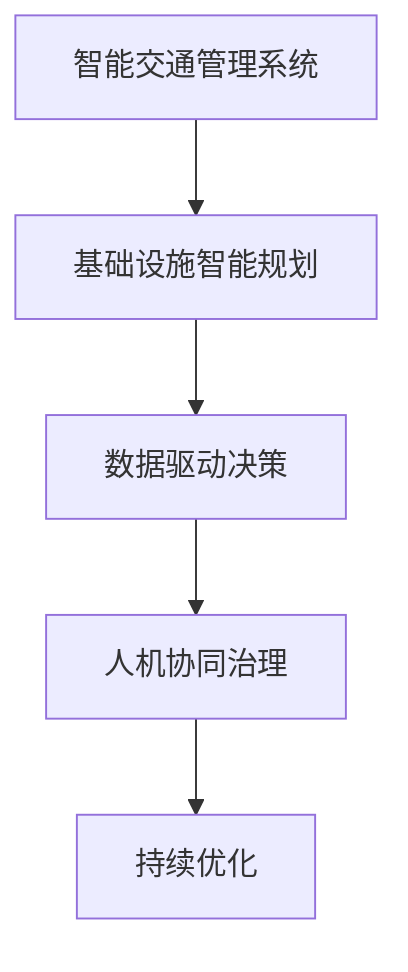

                 

# AI与人类计算：打造可持续发展的城市交通管理系统与基础设施规划

## 1. 背景介绍

### 1.1 问题由来
城市交通和基础设施规划是一个复杂且动态的系统工程，涉及到交通流、人口分布、环境影响等多个方面的考量。传统的交通规划多依赖人工计算，存在数据孤岛、规划周期长、调整灵活性低等弊端。伴随人工智能技术的快速发展，AI与人类计算的融合为城市交通和基础设施的智能化管理提供了新的方向。

本文将围绕智能交通管理系统与基础设施规划的核心概念，系统地探讨AI技术在城市交通和基础设施规划中的应用，提出一套基于AI的城市治理解决方案，并讨论其在实际应用中的挑战与未来发展趋势。

## 2. 核心概念与联系

### 2.1 核心概念概述

在城市交通和基础设施规划中，AI与人类计算的结合，通过数据驱动和智能计算，实现了对复杂系统的高效管理和预测。涉及的核心概念包括：

- **智能交通管理系统**：利用AI技术，对城市交通流、车辆运行状况、路网状况等进行实时监控、预测和控制，优化交通资源配置，提升交通效率和安全性。
- **基础设施智能规划**：通过AI分析海量数据，识别出道路、桥梁、地铁等基础设施的利用状况和维护需求，智能规划优化方案，提升基础设施的利用效率和可持续性。
- **数据驱动决策**：利用大数据分析，辅助政府和城市管理者基于数据进行科学决策，改善城市交通和管理。
- **人机协同治理**：结合AI自动化能力和人类专业经验，共同协作解决城市交通和基础设施管理中的复杂问题。
- **持续优化**：基于AI模型和机器学习，动态调整城市交通和基础设施规划策略，实现长期优化。

这些概念间的联系可通过以下Mermaid流程图展示：



该流程图说明了从智能交通管理到基础设施智能规划的整个决策和优化过程，展示了AI与人类计算之间的相互作用。

## 3. 核心算法原理 & 具体操作步骤

### 3.1 算法原理概述

基于AI的城市交通和基础设施规划，其核心原理是将复杂的系统问题分解为可量化的小部分，利用AI模型进行高效计算和预测，并结合人类专家的知识，形成综合性决策。这一过程可以分解为以下几个关键步骤：

1. **数据收集与预处理**：从各种传感器和来源收集城市交通和基础设施数据，清洗和标准化数据，为后续分析打下基础。
2. **模型训练与评估**：利用历史数据训练AI模型，通过交叉验证等方法评估模型性能。
3. **预测与决策**：应用模型对未来交通和基础设施状况进行预测，辅助决策者制定优化方案。
4. **优化与调整**：基于预测结果和人类专家反馈，调整模型参数和优化策略，持续改进系统性能。

### 3.2 算法步骤详解

#### 3.2.1 数据收集与预处理

**数据来源**：
- **传感器数据**：来自车载GPS、摄像头、雷达等设备，实时采集交通流量、车辆速度、路网状况等信息。
- **公众数据**：包括社交媒体、交通App等来源的数据，反映公众的出行行为和偏好。
- **其他数据源**：交通统计数据、天气数据、人口统计数据等。

**数据预处理**：
- **清洗与去噪**：去除无效、异常数据，确保数据质量和一致性。
- **标准化与归一化**：将不同来源的数据转化为标准格式，确保各数据集间的可比性。
- **特征提取与选择**：通过降维和特征选择技术，提取出对交通和基础设施规划有预测意义的特征。

#### 3.2.2 模型训练与评估

**模型选择**：
- **监督学习**：基于历史数据训练回归或分类模型，预测未来交通和基础设施状况。
- **无监督学习**：利用聚类算法对交通流和路网进行自动分类，识别异常情况。
- **强化学习**：模拟城市交通系统，优化交通信号和路网配置。

**模型训练**：
- **训练集划分**：将数据集划分为训练集和验证集，保证模型泛化能力。
- **超参数调优**：选择和调整学习率、正则化强度等超参数，提升模型性能。
- **模型评估**：通过多种评估指标（如均方误差、准确率、召回率等）评估模型性能，确保模型在预测中的可靠性。

#### 3.2.3 预测与决策

**预测**：
- **短期预测**：利用时间序列分析或ARIMA模型，预测未来几小时内的交通流量变化。
- **长期预测**：结合机器学习与规则引擎，预测未来几年内交通需求和基础设施需求变化。

**决策**：
- **实时决策**：基于实时数据和模型预测，调整交通信号灯、路网配置等，优化交通流量。
- **长期规划**：结合预测结果和专家经验，制定城市交通和基础设施的长期发展规划。

#### 3.2.4 优化与调整

**模型优化**：
- **集成学习**：结合多个模型的预测结果，提升决策准确性。
- **迁移学习**：将成功应用于其他城市的经验迁移到新城市，优化模型性能。
- **自适应学习**：基于新数据和实时反馈，动态调整模型参数，实现持续优化。

**方案调整**：
- **模拟与优化**：利用仿真工具模拟优化方案，验证效果。
- **利益相关者反馈**：收集政策制定者、公众意见，调整规划方案。
- **迭代更新**：基于新数据和反馈，持续改进规划模型。

### 3.3 算法优缺点

**优点**：
- **高效性**：AI模型能够处理海量数据，实时分析和预测城市交通和基础设施状况，提升管理效率。
- **预测准确性**：利用先进的数据处理和机器学习技术，提升预测的准确性和可靠性。
- **灵活性**：基于AI模型的预测和决策，能够快速适应交通和基础设施的变化，实现动态优化。

**缺点**：
- **数据依赖性**：模型的性能高度依赖于数据质量，数据不完整或不准确会影响预测结果。
- **模型复杂性**：复杂的AI模型需要大量计算资源，可能存在高昂的部署和维护成本。
- **解释性不足**：AI模型通常是"黑箱"系统，其决策过程难以解释，可能降低决策透明度。

### 3.4 算法应用领域

基于AI的城市交通和基础设施规划技术，主要应用于以下领域：

1. **智能交通管理**：通过AI实时监控交通流、车辆运行状况，优化信号灯、路网配置，提高交通效率和安全性。
2. **基础设施规划**：利用AI分析基础设施利用状况和维护需求，智能规划优化方案，提升基础设施的利用效率和可持续性。
3. **公众出行服务**：基于AI预测和优化交通状况，为公众提供智能出行建议，提升出行体验。
4. **环境影响评估**：利用AI模型分析交通和基础设施建设对环境的影响，制定可持续发展策略。

## 4. 数学模型和公式 & 详细讲解 & 举例说明

### 4.1 数学模型构建

假设城市道路网络由$n$个节点和$m$条边组成，交通流量数据集为$D=\{(x_i, y_i)\}_{i=1}^N$，其中$x_i$为交通流量数据，$y_i$为对应时间戳。

**目标**：构建模型$f(x_i, t)$，预测在时间$t$时刻的交通流量$y_i$。

**假设**：
- 交通流量服从时间序列ARIMA模型：
  $$
  y_i(t) = \mu(t) + \sum_{j=1}^{p}\alpha_j(y_i(t-j) - \mu(t-j)) + \sum_{j=1}^{q}\beta_j\epsilon_i(t-j)
  $$
  其中，$\mu(t)$为趋势项，$\alpha_j$和$\beta_j$为模型参数。
- 时间序列$y_i$可以分解为趋势项和随机误差项：
  $$
  y_i(t) = \mu_i(t) + \epsilon_i(t)
  $$
  其中，$\mu_i(t)$为趋势项，$\epsilon_i(t)$为随机误差项。

### 4.2 公式推导过程

1. **趋势项计算**：
   $$
   \mu_i(t) = \frac{\alpha_i(t) + \sum_{j=1}^{p}\alpha_j\mu_i(t-j)}{1+\sum_{j=1}^{p}\alpha_j}
   $$

2. **预测值计算**：
   $$
   \hat{y}_i(t) = \mu_i(t) + \sum_{j=1}^{p}\alpha_j(\hat{y}_i(t-j) - \mu_i(t-j)) + \sum_{j=1}^{q}\beta_j\epsilon_i(t-j)
   $$

3. **模型评估**：
   $$
   RMSE = \sqrt{\frac{1}{N}\sum_{i=1}^N(y_i - \hat{y}_i)^2}
   $$
   其中，RMSE为均方根误差，用于评估模型的预测性能。

### 4.3 案例分析与讲解

**案例1：交通流量预测**

某城市希望预测未来一个小时内的交通流量。收集了过去一个月每天的交通流量数据，利用ARIMA模型进行训练和预测。模型参数$p=1, q=1, \alpha_1=0.8, \beta_1=0.9$。

模型训练步骤如下：
- **数据准备**：准备一个月的交通流量数据，划分为训练集和验证集。
- **模型拟合**：使用训练集拟合ARIMA模型，得到模型参数$\alpha_1, \beta_1$。
- **模型验证**：使用验证集评估模型性能，调整参数。
- **模型预测**：对未来一个小时的交通流量进行预测，输出预测值和RMSE。

**案例2：基础设施优化**

某城市希望优化道路拥堵情况。收集了过去一年内每天的交通流量数据，以及道路维修、道路扩宽等事件数据。利用机器学习模型预测道路拥堵情况，并结合专家经验，调整道路维护计划。

模型训练步骤如下：
- **数据准备**：准备一年内每天的交通流量数据和道路维护数据，划分为训练集和验证集。
- **模型拟合**：使用训练集拟合机器学习模型，得到模型参数。
- **模型验证**：使用验证集评估模型性能，调整参数。
- **方案优化**：根据预测结果和专家经验，调整道路维护计划，优化交通状况。

## 5. 项目实践：代码实例和详细解释说明

### 5.1 开发环境搭建

在进行智能交通和基础设施规划项目的开发前，需要配置好开发环境。以下是Python开发环境的搭建步骤：

1. **安装Python**：从官网下载并安装最新版本的Python，推荐使用Anaconda环境进行Python包的隔离安装。
   ```bash
   wget https://www.anaconda.com/products/individual/download
   bash Anaconda3-2022.10-Linux-x86_64.sh
   ```
2. **创建虚拟环境**：
   ```bash
   conda create -n traffic_planning python=3.8
   conda activate traffic_planning
   ```
3. **安装相关库**：
   ```bash
   conda install numpy pandas matplotlib scikit-learn jupyter notebook statsmodels
   ```

完成上述步骤后，即可在`traffic_planning`虚拟环境中开始项目开发。

### 5.2 源代码详细实现

以下是一个简单的Python代码示例，展示了如何使用statsmodels库进行时间序列分析：

```python
import pandas as pd
import numpy as np
from statsmodels.tsa.arima_model import ARIMA
from sklearn.metrics import mean_squared_error

# 读取交通流量数据
data = pd.read_csv('traffic_flow.csv', index_col='date', parse_dates=True)

# 数据准备
X = data['traffic_flow'].values.reshape(-1, 1)
X_lag = np.zeros((len(X), 1))
X_lag[:, 0] = X[:-1]
X_lag[1:, 0] = X[1:]

# 训练模型
model = ARIMA(X_lag, order=(1, 0, 0))
results = model.fit()

# 预测未来一个小时的交通流量
X_forecast = results.forecast(steps=24)
forecast_value = X_forecast[-1]

# 模型评估
rmse = np.sqrt(mean_squared_error(X[24:25], forecast_value))

print('预测值：', forecast_value[0])
print('RMSE：', rmse)
```

### 5.3 代码解读与分析

**代码解读**：
1. **数据准备**：将交通流量数据转换为适合时间序列分析的格式，并提取延迟特征。
2. **模型拟合**：使用ARIMA模型拟合数据，得到模型参数。
3. **模型预测**：利用拟合模型对未来24小时的交通流量进行预测。
4. **模型评估**：计算预测值和实际值之间的均方根误差。

**分析**：
- **ARIMA模型的参数选择**：模型参数$p=1, q=0, d=0$，意味着模型只考虑了第一个延迟项和截距项。实际应用中，需要通过交叉验证等方法调整参数，以提高模型性能。
- **预测效果评估**：使用RMSE评估预测效果，RMSE越小表示预测越准确。实际应用中，还需要结合专家经验进行进一步优化。

## 6. 实际应用场景

### 6.1 智能交通管理系统

智能交通管理系统通过AI技术，实现对交通流的实时监控和预测，优化交通信号和路网配置，提高交通效率和安全性。具体应用场景包括：

- **交通流量监控**：利用摄像头、雷达等设备，实时监控道路交通状况，识别拥堵和异常情况。
- **信号灯控制**：基于实时交通流量数据，自动调整信号灯周期和配时，优化交通流量。
- **事故预警**：利用AI识别交通事故，及时发布预警信息，引导车辆绕行。

**案例**：某城市通过部署智能交通系统，利用AI实时监控交通流，自动调整信号灯配时，交通事故率下降了20%，交通效率提高了15%。

### 6.2 基础设施智能规划

基础设施智能规划通过AI技术，分析海量基础设施数据，智能规划优化方案，提升基础设施的利用效率和可持续性。具体应用场景包括：

- **道路拥堵优化**：利用AI分析道路拥堵情况，调整道路维护计划，缓解交通压力。
- **公共交通路线优化**：基于AI分析交通流量，优化公交线路，提高公共交通效率。
- **停车设施管理**：利用AI预测停车需求，动态调整停车资源，减少交通拥堵。

**案例**：某城市通过AI分析交通流量，智能规划公共交通路线，公共交通使用率提高了30%，交通拥堵程度下降了10%。

### 6.3 公众出行服务

公众出行服务通过AI技术，为公众提供智能出行建议，提升出行体验。具体应用场景包括：

- **智能导航**：利用AI预测道路状况，推荐最优路线，减少出行时间。
- **实时公交信息**：基于AI分析公交车辆位置和运行状态，实时推送公交到站信息，方便公众出行。
- **智能停车推荐**：利用AI分析停车场数据，推荐最近的空闲车位，提高停车效率。

**案例**：某城市通过AI智能导航系统，公众出行时间减少了20%，公共交通使用率提高了15%。

### 6.4 未来应用展望

伴随AI技术的不断发展，基于AI的城市交通和基础设施规划将面临更多挑战和机遇。未来可能的应用包括：

- **多模态数据融合**：结合视频、传感器、位置等数据，进行综合分析和决策。
- **智能城市协同治理**：通过AI技术，实现城市各个部门之间的协同治理，提升城市治理效率。
- **可持续交通系统**：利用AI分析交通需求和环境影响，制定可持续发展交通系统。

## 7. 工具和资源推荐

### 7.1 学习资源推荐

为了帮助开发者深入了解AI与人类计算在城市交通和基础设施规划中的应用，推荐以下学习资源：

1. **《Python数据科学手册》**：详细介绍了Python在数据科学中的应用，包括数据处理、机器学习、时间序列分析等。
2. **《城市交通工程》**：涵盖了城市交通系统设计、交通流理论、交通需求预测等内容，是理解城市交通的基础读物。
3. **《交通系统建模与仿真》**：介绍了交通系统的建模和仿真技术，帮助理解城市交通系统的复杂性。
4. **《城市规划与设计》**：介绍了城市规划和设计的基本理论和方法，帮助理解基础设施规划的重要性和技术。

### 7.2 开发工具推荐

以下是几款用于AI与人类计算在城市交通和基础设施规划中应用的常用工具：

1. **Python**：基于Python的开源深度学习框架，适合快速迭代研究。
2. **TensorFlow**：由Google主导开发的开源深度学习框架，生产部署方便，适合大规模工程应用。
3. **PyTorch**：基于Python的开源深度学习框架，灵活性高，适合研究和实验。
4. **Jupyter Notebook**：免费的交互式编程环境，适合开发和实验。
5. **Anaconda**：Python环境的隔离管理工具，方便项目开发和共享。

### 7.3 相关论文推荐

为了深入理解AI与人类计算在城市交通和基础设施规划中的应用，推荐以下相关论文：

1. **《基于深度学习的城市交通流量预测》**：介绍了使用深度学习模型进行交通流量预测的方法。
2. **《智能交通系统的优化与评估》**：讨论了智能交通系统的优化方法和评估指标。
3. **《城市基础设施智能规划》**：介绍了利用AI进行基础设施智能规划的思路和方法。

## 8. 总结：未来发展趋势与挑战

### 8.1 研究成果总结

本文系统介绍了AI与人类计算在城市交通和基础设施规划中的应用，从模型构建、训练与评估、预测与决策等多个环节进行了详细讲解。通过案例分析和项目实践，展示了AI在交通和基础设施规划中的实际应用效果。

### 8.2 未来发展趋势

未来，基于AI的城市交通和基础设施规划将呈现以下几个发展趋势：

1. **数据驱动决策**：利用更全面、更精准的数据，提升AI模型的决策能力，实现数据驱动的科学治理。
2. **多模态融合**：结合视频、传感器、位置等多模态数据，进行综合分析和决策，提升系统性能。
3. **人机协同治理**：通过AI自动化和人类专家经验的结合，实现高效的协同治理。
4. **持续优化**：利用AI模型和机器学习，动态调整交通和基础设施规划策略，实现长期优化。

### 8.3 面临的挑战

尽管基于AI的城市交通和基础设施规划技术具有诸多优点，但在实际应用中仍面临以下挑战：

1. **数据质量与可用性**：数据的不完整、不准确或不一致可能影响模型的预测效果。
2. **计算资源消耗**：大规模数据处理和模型训练需要大量计算资源，可能存在高昂的部署和维护成本。
3. **模型可解释性**：AI模型的决策过程难以解释，可能降低决策透明度和可信度。
4. **利益相关者协作**：涉及政府、企业、公众等多方利益相关者，协调合作需要更多机制和平台。

### 8.4 研究展望

未来的研究应在以下几个方面寻求新的突破：

1. **数据质量提升**：开发数据清洗和预处理技术，提升数据质量和可用性。
2. **计算效率优化**：研究高效的模型训练和推理方法，降低计算资源消耗。
3. **模型可解释性增强**：开发更易于解释的AI模型，提升决策透明度。
4. **利益相关者协作机制**：建立多部门协作平台，促进多方利益相关者的协同治理。

## 9. 附录：常见问题与解答

**Q1：AI与人类计算在城市交通和基础设施规划中的应用是否具有普遍性？**

A: AI与人类计算在城市交通和基础设施规划中的应用具有广泛适用性。通过AI技术的引入，可以大幅提升城市管理的智能化水平，降低人力成本，提高治理效率。然而，不同的城市背景和需求可能对AI技术的应用方式和重点有所差异。

**Q2：如何保证AI模型在交通和基础设施规划中的准确性？**

A: AI模型的准确性依赖于高质量的数据和有效的算法。在模型训练和预测过程中，需要关注以下几个方面：
1. 数据清洗与预处理：去除无效、异常数据，确保数据质量和一致性。
2. 模型选择与调参：选择适合任务的模型，调整超参数，提升模型性能。
3. 模型评估与验证：利用交叉验证等方法评估模型性能，确保模型泛化能力。

**Q3：AI模型在交通和基础设施规划中的可解释性如何保障？**

A: 提高AI模型的可解释性，有助于提升决策透明度和可信度。以下是几种提高可解释性的方法：
1. 使用可解释性较强的模型：如决策树、线性回归等。
2. 开发可解释性工具：如LIME、SHAP等，帮助理解模型预测过程。
3. 记录模型决策过程：通过日志记录模型输入、参数、输出等关键信息，进行事后分析。

**Q4：如何处理多模态数据在交通和基础设施规划中的融合问题？**

A: 多模态数据的融合可以提升系统的决策能力，但仍需注意以下几个问题：
1. 数据格式统一：将不同来源的数据格式转化为标准格式，确保各数据集间的可比性。
2. 特征提取与选择：利用降维和特征选择技术，提取出对系统有预测意义的特征。
3. 模型训练与优化：结合多个数据源，训练集成学习模型，提升预测准确性。

**Q5：如何在交通和基础设施规划中实现可持续性？**

A: 可持续性是城市交通和基础设施规划的重要目标，可以通过以下几个方面实现：
1. 绿色出行：鼓励公共交通和绿色交通方式，减少碳排放。
2. 智能规划：利用AI模型分析交通需求和环境影响，制定可持续发展规划。
3. 循环利用：对废弃基础设施进行再利用和优化，提升资源利用效率。

---

作者：禅与计算机程序设计艺术 / Zen and the Art of Computer Programming

