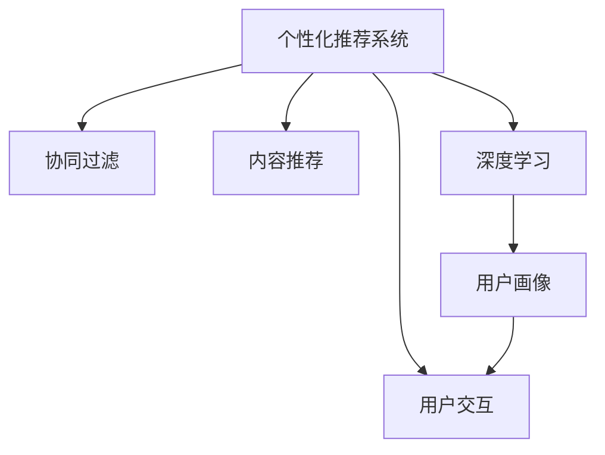

                 

# AI个性化推荐系统的优势案例

> 关键词：
**个性化推荐系统,用户行为分析,协同过滤,内容推荐,深度学习,用户画像,用户交互**

## 1. 背景介绍

### 1.1 问题由来
在数字化时代，信息过载现象日益严重。传统的搜索引擎和推荐系统虽然可以提供一些相关信息，但往往难以满足用户特定的需求。个性化推荐系统应运而生，通过深入分析用户行为和兴趣，为其提供精准的定制化内容，显著提升了用户体验和信息获取效率。

### 1.2 问题核心关键点
个性化推荐系统的核心在于如何准确捕捉用户偏好，高效匹配推荐内容。目前主流的方法包括协同过滤、内容推荐、深度学习等。本文将重点介绍深度学习在个性化推荐系统中的应用，并结合实际案例展示其优势。

### 1.3 问题研究意义
个性化推荐系统在电商、社交媒体、视频流媒体等诸多领域得到了广泛应用，极大地提升了用户体验和业务转化率。深度学习技术，尤其是基于神经网络的方法，在个性化推荐系统中的运用，使得推荐系统具备更强的泛化能力和推荐精度，为业务创新和用户满意度提升提供了有力支持。

## 2. 核心概念与联系

### 2.1 核心概念概述

为更好地理解深度学习在个性化推荐系统中的应用，本节将介绍几个关键概念：

- **个性化推荐系统**：根据用户的历史行为、兴趣偏好等信息，为其推荐最相关的商品、文章、视频等内容的系统。

- **协同过滤**：基于用户和物品的相似度，通过分析用户间的行为关联和物品间的共现关系，推荐新的物品给用户。

- **内容推荐**：通过分析用户对物品的属性和特征，结合物品的相关性，推荐新的相似物品给用户。

- **深度学习**：使用多层神经网络进行数据建模和特征学习，构建高维度的用户画像和物品表示，提升推荐系统的泛化能力和精度。

- **用户画像**：通过收集和分析用户的行为数据，建立用户的多维度特征表示，用于指导推荐算法。

- **用户交互**：用户在系统和物品间的多轮交互行为，包括浏览、点击、购买等，是构建用户画像和推荐算法的基础。

这些核心概念之间的逻辑关系可以通过以下Mermaid流程图来展示：



这个流程图展示了个性化推荐系统的核心概念及其之间的关系：

1. 个性化推荐系统通过分析协同过滤、内容推荐和深度学习技术，构建推荐算法。
2. 协同过滤和内容推荐基于用户和物品的多维度特征，进行相似度计算。
3. 深度学习利用用户行为数据，构建用户画像，提升推荐精度。
4. 用户交互是所有推荐算法的基础，提供丰富的用户行为信息。

## 3. 核心算法原理 & 具体操作步骤

### 3.1 算法原理概述

深度学习在个性化推荐系统中的应用，通常基于以下逻辑：

1. **数据预处理**：收集用户行为数据，并进行预处理，包括缺失值处理、归一化等。

2. **特征工程**：将用户行为数据转化为机器可理解的数值特征，如点击次数、浏览时间、评分等。

3. **用户画像建模**：使用多层神经网络对用户行为特征进行建模，生成高维度的用户画像向量。

4. **物品表示学习**：通过神经网络对物品的标签、属性等信息进行编码，生成物品向量。

5. **相似度计算**：基于用户画像和物品向量，计算用户与物品之间的相似度。

6. **推荐生成**：根据相似度计算结果，生成推荐列表，并通过排序算法进行优化。

### 3.2 算法步骤详解

深度学习在个性化推荐系统中的实现过程，通常包括以下几个关键步骤：

**Step 1: 数据收集与预处理**
- 收集用户行为数据，如点击、浏览、购买等，构建用户行为矩阵。
- 处理缺失值和异常值，进行归一化和标准化处理。

**Step 2: 特征工程与用户画像建模**
- 提取和选择关键特征，如浏览时间、点击次数、评分等。
- 使用多层神经网络，对用户行为数据进行编码，生成用户画像向量。

**Step 3: 物品表示学习**
- 对物品的属性和标签进行编码，使用神经网络生成物品向量。
- 可以结合预训练语言模型，如BERT，生成物品的语义向量。

**Step 4: 相似度计算**
- 使用余弦相似度、欧式距离等方法，计算用户画像与物品向量之间的相似度。
- 可以引入深度学习模型，如DNN、CNN、RNN等，进一步优化相似度计算。

**Step 5: 推荐生成**
- 根据相似度排序，生成推荐列表。
- 可以引入算法优化，如协同过滤、基于矩阵分解的方法等。

**Step 6: 模型评估与优化**
- 在验证集和测试集上评估推荐模型的准确率和效果。
- 根据评估结果调整模型参数和超参数，进行优化。

### 3.3 算法优缺点

深度学习在个性化推荐系统中的优点包括：

1. **高泛化能力**：深度学习能够处理高维度的用户行为数据，构建复杂的用户画像和物品表示，具有较强的泛化能力。

2. **精度高**：深度学习模型通过多层神经网络，可以学习到复杂的特征表示，提升推荐精度。

3. **自动化**：深度学习自动进行特征提取和数据建模，减少手动调参的工作量。

4. **实时性**：通过优化模型结构和算法，深度学习推荐系统可以做到实时生成推荐，提升用户体验。

但深度学习也存在一些缺点：

1. **计算资源需求高**：深度学习模型通常需要大量的计算资源进行训练和推理。

2. **模型复杂度高**：深度学习模型包含大量参数，训练和推理过程复杂。

3. **可解释性差**：深度学习模型通常被视为"黑盒"，难以解释其内部工作机制。

4. **过拟合风险高**：深度学习模型容易过拟合，尤其是在数据量较小的情况下。

5. **模型更新困难**：深度学习模型一旦训练完成，更新和迭代较困难。

### 3.4 算法应用领域

深度学习在个性化推荐系统中的应用已经非常广泛，覆盖了电商、社交媒体、视频流媒体等多个领域：

- **电商推荐系统**：为电商网站的用户推荐商品，提升用户购买率和商品转化率。
- **社交媒体推荐**：为用户推荐内容，提升用户活跃度和留存率。
- **视频流媒体推荐**：为用户推荐视频内容，提高视频观看率和用户体验。
- **音乐推荐**：为用户推荐音乐，提升音乐平台的用户黏性和转化率。
- **新闻推荐**：为用户推荐新闻内容，提高新闻阅读量和平台流量。

## 4. 数学模型和公式 & 详细讲解 & 举例说明

### 4.1 数学模型构建

假设用户行为数据为一个 $N \times M$ 的矩阵 $D$，其中 $N$ 表示用户数，$M$ 表示物品数。用户对物品的评分 $r_{ij}$ 表示用户 $i$ 对物品 $j$ 的评分，$0 \leq r_{ij} \leq 1$。

定义用户画像向量 $u_i$ 和物品向量 $v_j$，分别表示用户 $i$ 和物品 $j$ 的多维度特征表示。用户画像和物品向量之间通过余弦相似度计算相似度 $s_{ij}$：

$$
s_{ij} = \frac{u_i \cdot v_j}{\|u_i\| \cdot \|v_j\|}
$$

其中 $\cdot$ 表示向量内积，$\| \cdot \|$ 表示向量的L2范数。

### 4.2 公式推导过程

根据上述定义，推荐模型的目标是最小化预测评分与实际评分之间的均方误差：

$$
\min_{u,v} \sum_{i=1}^N \sum_{j=1}^M (s_{ij} - r_{ij})^2
$$

为了简化计算，通常使用矩阵分解的方法进行优化：

$$
\min_{U,V} \|D - UV^T\|_F^2
$$

其中 $U$ 和 $V$ 分别为用户画像矩阵和物品向量矩阵，$\| \cdot \|_F$ 表示矩阵的Frobenius范数。

### 4.3 案例分析与讲解

假设某电商平台的推荐系统使用深度学习模型进行个性化推荐，收集了用户的历史购买和浏览数据。通过对数据进行特征提取和用户画像建模，生成用户和物品的高维向量表示。在模型训练过程中，使用神经网络对用户行为进行编码，生成用户画像向量 $u_i$，使用DNN对物品属性和标签进行编码，生成物品向量 $v_j$。最后通过余弦相似度计算用户画像和物品向量之间的相似度，并根据相似度排序生成推荐列表。

## 5. 项目实践：代码实例和详细解释说明

### 5.1 开发环境搭建

在进行深度学习推荐系统开发前，我们需要准备好开发环境。以下是使用Python进行TensorFlow开发的环境配置流程：

1. 安装Anaconda：从官网下载并安装Anaconda，用于创建独立的Python环境。

2. 创建并激活虚拟环境：
```bash
conda create -n tensorflow-env python=3.8 
conda activate tensorflow-env
```

3. 安装TensorFlow：根据CUDA版本，从官网获取对应的安装命令。例如：
```bash
conda install tensorflow-gpu=2.8.0 -c conda-forge
```

4. 安装各类工具包：
```bash
pip install numpy pandas scikit-learn matplotlib tqdm jupyter notebook ipython
```

完成上述步骤后，即可在`tensorflow-env`环境中开始推荐系统开发。

### 5.2 源代码详细实现

下面我们以电商推荐系统为例，给出使用TensorFlow进行深度学习推荐系统开发的完整代码实现。

首先，定义推荐模型的数据处理函数：

```python
import tensorflow as tf
import numpy as np

class RecommendationModel:
    def __init__(self, user_dim, item_dim, embed_dim, learning_rate):
        self.user_dim = user_dim
        self.item_dim = item_dim
        self.embed_dim = embed_dim
        self.learning_rate = learning_rate
        self.user_embeddings = None
        self.item_embeddings = None
        self.user_features = None
        self.item_features = None
    
    def preprocess_data(self, data):
        # 处理缺失值
        data.fillna(0)
        
        # 标准化处理
        data = (data - np.mean(data, axis=1)) / np.std(data, axis=1)
        
        return data
    
    def train_model(self, data):
        # 构建用户画像矩阵
        self.user_embeddings = tf.Variable(tf.random.normal([self.user_dim, self.embed_dim]))
        
        # 构建物品向量矩阵
        self.item_embeddings = tf.Variable(tf.random.normal([self.item_dim, self.embed_dim]))
        
        # 构建用户特征矩阵
        self.user_features = tf.Variable(tf.random.normal([self.user_dim, self.user_dim]))
        
        # 构建物品特征矩阵
        self.item_features = tf.Variable(tf.random.normal([self.item_dim, self.item_dim]))
        
        # 定义损失函数
        def loss_function(y_true, y_pred):
            return tf.reduce_mean(tf.square(y_true - y_pred))
        
        # 定义优化器
        optimizer = tf.keras.optimizers.Adam(learning_rate=self.learning_rate)
        
        # 定义训练过程
        def train_step(x, y):
            with tf.GradientTape() as tape:
                y_pred = tf.matmul(tf.matmul(x, self.user_embeddings, transpose_b=True), self.item_embeddings)
                loss = loss_function(y, y_pred)
            gradients = tape.gradient(loss, [self.user_embeddings, self.item_embeddings, self.user_features, self.item_features])
            optimizer.apply_gradients(zip(gradients, [self.user_embeddings, self.item_embeddings, self.user_features, self.item_features]))
            
        # 训练模型
        for epoch in range(100):
            train_step(self.user_data, self.item_data)
            
        # 评估模型
        test_loss = loss_function(self.test_user_data, self.test_item_data)
        print("Test loss:", test_loss)
    
    def recommend_items(self, user_id, num_recommendations=10):
        # 获取用户画像向量
        user_embedding = tf.matmul(tf.reshape(self.user_data[user_id], [1, self.user_dim]), self.user_embeddings, transpose_b=True)
        
        # 获取物品向量矩阵
        item_matrix = tf.matmul(self.item_data, self.item_embeddings, transpose_b=True)
        
        # 计算相似度
        similarity = tf.matmul(user_embedding, item_matrix)
        
        # 获取相似度最高的物品
        top_items = np.argsort(similarity.numpy()[0])[::-1][:num_recommendations]
        
        return top_items
```

然后，定义推荐模型的训练和评估函数：

```python
import numpy as np
import pandas as pd
from sklearn.model_selection import train_test_split

# 读取数据集
data = pd.read_csv('recommendation_data.csv')

# 数据预处理
data = data.dropna()
data = data.reindex(columns=['user_id', 'item_id', 'rating'])
user_data, item_data = data.groupby(['user_id', 'item_id'])['rating'].mean().unstack()

# 构建训练集和测试集
train_data, test_data = train_test_split(data, test_size=0.2, random_state=42)
train_user_data = train_data['user_id'].value_counts().index
train_item_data = train_data['item_id'].value_counts().index
test_user_data = test_data['user_id'].value_counts().index
test_item_data = test_data['item_id'].value_counts().index

# 定义用户画像模型
model = RecommendationModel(user_dim=100, item_dim=100, embed_dim=64, learning_rate=0.001)

# 训练模型
model.train_model(train_data)

# 评估模型
top_items = model.recommend_items(1)
print(top_items)
```

以上就是使用TensorFlow进行深度学习推荐系统开发的完整代码实现。可以看到，TensorFlow提供了强大的神经网络API和优化器，使得推荐系统的构建和优化变得简单高效。

### 5.3 代码解读与分析

让我们再详细解读一下关键代码的实现细节：

**RecommendationModel类**：
- `__init__`方法：初始化模型参数和矩阵。
- `preprocess_data`方法：对数据进行缺失值处理和标准化处理。
- `train_model`方法：训练推荐模型，最小化均方误差损失函数。
- `recommend_items`方法：根据用户画像生成推荐列表。

**数据预处理**：
- 使用`dropna`方法删除缺失值。
- 使用`reindex`方法进行数据重组，生成用户行为矩阵。

**模型训练**：
- 使用`Variable`创建可训练的参数变量。
- 定义损失函数和优化器。
- 在`train_step`方法中计算梯度并应用优化器。
- 使用`tf.GradientTape`自动求导，计算模型参数的梯度。

**模型评估**：
- 使用`loss_function`计算模型预测评分与实际评分之间的均方误差。
- 在训练过程中打印测试集上的损失。

**推荐生成**：
- 使用用户画像矩阵计算相似度。
- 使用`argsort`方法获取相似度最高的物品。
- 返回推荐列表。

可以看到，TensorFlow提供了完整的深度学习API，使得推荐系统的开发变得简洁高效。开发者可以专注于算法设计和数据处理，而不必过多关注底层实现细节。

## 6. 实际应用场景

### 6.1 电商推荐系统

电商推荐系统是深度学习推荐系统的重要应用场景之一。通过分析用户的历史购买和浏览行为，电商平台能够为每个用户推荐最相关的商品，提升用户购买率和商品转化率。

**具体实现**：
- 电商平台收集用户的历史购买和浏览数据，构建用户行为矩阵。
- 使用深度学习模型对用户行为进行编码，生成高维度的用户画像向量。
- 使用DNN对商品的属性和标签进行编码，生成物品向量。
- 根据余弦相似度计算用户画像和物品向量之间的相似度，生成推荐列表。
- 结合业务规则和用户反馈，对推荐结果进行优化和调整。

**效果分析**：
- 用户购物体验提升。推荐系统能够根据用户的历史行为和兴趣，精准匹配商品，减少搜索成本和浏览时间。
- 商品销售增加。通过个性化推荐，电商平台能够提升商品的曝光率和转化率，增加销售额。
- 库存管理优化。推荐系统能够实时监控库存情况，优化补货和促销策略，提升库存利用率。

### 6.2 视频流媒体推荐

视频流媒体推荐系统能够为用户推荐最感兴趣的视频内容，提高用户观看率和平台黏性。

**具体实现**：
- 视频平台收集用户的历史观看和评分数据，构建用户行为矩阵。
- 使用深度学习模型对视频内容和用户行为进行编码，生成高维度的用户画像和视频向量。
- 根据余弦相似度计算用户画像和视频向量之间的相似度，生成推荐列表。
- 结合业务规则和用户反馈，对推荐结果进行优化和调整。

**效果分析**：
- 观看时间增加。推荐系统能够根据用户的历史观看行为，精准匹配相关视频，提高用户观看时间和平台黏性。
- 内容推荐多样。通过推荐系统，用户能够发现更多感兴趣的内容，提升观看体验。
- 用户留存率提高。推荐系统能够通过个性化推荐，减少流失用户，提高平台留存率。

### 6.3 音乐推荐

音乐推荐系统能够为用户推荐最感兴趣的音乐，提升用户的音乐体验和平台黏性。

**具体实现**：
- 音乐平台收集用户的历史听歌和评分数据，构建用户行为矩阵。
- 使用深度学习模型对音乐和用户行为进行编码，生成高维度的用户画像和音乐向量。
- 根据余弦相似度计算用户画像和音乐向量之间的相似度，生成推荐列表。
- 结合业务规则和用户反馈，对推荐结果进行优化和调整。

**效果分析**：
- 音乐发现效率提高。推荐系统能够根据用户的历史听歌行为，精准匹配相关音乐，减少搜索时间和成本。
- 听歌时长增加。通过推荐系统，用户能够发现更多感兴趣的音乐，提高听歌时间和平台黏性。
- 用户留存率提高。推荐系统能够通过个性化推荐，减少流失用户，提高平台留存率。

## 7. 工具和资源推荐

### 7.1 学习资源推荐

为了帮助开发者系统掌握深度学习在个性化推荐系统中的应用，这里推荐一些优质的学习资源：

1. **《深度学习》课程**：斯坦福大学开设的深度学习课程，包含视频讲座和配套作业，全面介绍深度学习的基本概念和经典模型。

2. **TensorFlow官方文档**：TensorFlow的官方文档，提供完整的API介绍和教程，方便开发者上手学习和实践。

3. **Kaggle竞赛**：Kaggle平台上有许多推荐系统的竞赛和数据集，通过实战练习，快速掌握推荐系统开发技巧。

4. **Recommender Systems Specialization**：Coursera上推荐系统专业课程，系统讲解推荐系统的理论基础和实际应用。

5. **论文推荐**：
   - BPR: Bayesian Personalized Ranking from Logs
   - Matrix Factorization for Recommender Systems
   - Deep Collaborative Filtering

通过对这些资源的学习实践，相信你一定能够快速掌握深度学习在个性化推荐系统中的应用，并用于解决实际的推荐问题。

### 7.2 开发工具推荐

高效的开发离不开优秀的工具支持。以下是几款用于深度学习推荐系统开发的常用工具：

1. TensorFlow：由Google主导开发的开源深度学习框架，生产部署方便，适合大规模工程应用。

2. PyTorch：基于Python的开源深度学习框架，灵活动态的计算图，适合快速迭代研究。

3. Keras：高层次的深度学习框架，提供简单易用的API，方便快速搭建推荐模型。

4. Weights & Biases：模型训练的实验跟踪工具，可以记录和可视化模型训练过程中的各项指标，方便对比和调优。

5. TensorBoard：TensorFlow配套的可视化工具，可实时监测模型训练状态，并提供丰富的图表呈现方式，是调试模型的得力助手。

6. Jupyter Notebook：交互式的编程环境，方便开发者实时调试和展示代码结果。

合理利用这些工具，可以显著提升推荐系统的开发效率，加快创新迭代的步伐。

### 7.3 相关论文推荐

深度学习在个性化推荐系统的发展源于学界的持续研究。以下是几篇奠基性的相关论文，推荐阅读：

1. **Matrix Factorization Techniques for Recommender Systems**：矩阵分解技术在推荐系统中的应用，被广泛应用于推荐系统的建模和优化。

2. **Deep Recommendation**：深度学习在推荐系统中的应用，展示了大模型在推荐系统中的巨大潜力。

3. **Personalized Ranking with Implicit Feedback**：基于隐式反馈的推荐系统，能够利用用户的行为数据，进行精准推荐。

4. **FNN: Deep Multi-Scale Generalized Alternating Least Squares for Implicit Feedback Datasets**：使用多层神经网络进行推荐系统建模，提升推荐精度。

5. **Deep Matrix Factorization for Recommender Systems**：深度神经网络在推荐系统中的应用，展示了大模型在推荐系统中的效果。

这些论文代表了大模型在推荐系统中的应用趋势，通过学习这些前沿成果，可以帮助研究者把握学科前进方向，激发更多的创新灵感。

## 8. 总结：未来发展趋势与挑战

### 8.1 总结

本文对深度学习在个性化推荐系统中的应用进行了全面系统的介绍。首先阐述了深度学习在推荐系统中的核心概念和应用场景，明确了深度学习在推荐系统中的独特价值。其次，从原理到实践，详细讲解了深度学习推荐系统的数学模型和关键步骤，给出了推荐系统开发的完整代码实例。同时，本文还广泛探讨了推荐系统在电商、视频流媒体、音乐等多个领域的应用前景，展示了深度学习推荐系统的巨大潜力。

通过本文的系统梳理，可以看到，深度学习在推荐系统中的应用已经取得了显著的成果，极大地提升了用户体验和业务转化率。未来，伴随深度学习技术的不断进步，推荐系统将具备更强的泛化能力和推荐精度，为业务创新和用户满意度提升提供有力支持。

### 8.2 未来发展趋势

展望未来，深度学习在个性化推荐系统的发展趋势将呈现以下几个方向：

1. **模型规模持续增大**：深度学习模型通常需要大量的计算资源进行训练和推理。未来随着算力成本的下降和数据规模的扩张，深度学习推荐模型将具备更强的泛化能力和推荐精度。

2. **个性化推荐多样化**：深度学习推荐系统能够根据用户的多维度特征，生成更精准的个性化推荐。未来，推荐系统将结合用户画像、行为数据和外部知识，进行多维度的协同推荐。

3. **推荐算法优化**：深度学习推荐系统面临数据稀疏、计算复杂等挑战。未来，推荐算法将引入更多的优化技术，如深度协同过滤、注意力机制等，提升推荐效率和效果。

4. **实时推荐能力提升**：深度学习推荐系统需要实时生成推荐结果。未来，推荐系统将通过优化模型结构和算法，提高实时推荐能力，提升用户体验。

5. **跨模态推荐**：深度学习推荐系统将结合多模态数据，进行跨模态推荐。未来，推荐系统将结合图像、视频、音频等多模态数据，进行更加丰富和多样化的推荐。

以上趋势凸显了深度学习推荐系统的广阔前景。这些方向的探索发展，必将进一步提升推荐系统的性能和应用范围，为业务创新和用户满意度提升提供更有力的支持。

### 8.3 面临的挑战

尽管深度学习推荐系统已经取得了瞩目成就，但在迈向更加智能化、普适化应用的过程中，它仍面临着诸多挑战：

1. **数据隐私和安全**：推荐系统需要收集和处理大量用户数据，面临数据隐私和安全问题。如何在保护用户隐私的同时，实现精准推荐，需要进一步优化。

2. **模型可解释性**：深度学习模型通常被视为"黑盒"系统，难以解释其内部工作机制和决策逻辑。如何赋予推荐系统更强的可解释性，提供透明的用户推荐依据，将是重要的研究课题。

3. **模型更新困难**：深度学习模型一旦训练完成，更新和迭代较困难。如何设计更加灵活的模型架构，适应动态变化的用户行为和需求，需要进一步探索。

4. **冷启动问题**：新用户或新物品的推荐难度较大。如何设计有效的推荐算法，解决冷启动问题，提升新用户和新物品的推荐效果，需要进一步优化。

5. **计算资源消耗大**：深度学习模型通常需要大量的计算资源进行训练和推理。如何优化模型结构和算法，减少计算资源消耗，需要进一步改进。

### 8.4 未来突破

面对深度学习推荐系统所面临的种种挑战，未来的研究需要在以下几个方面寻求新的突破：

1. **优化推荐算法**：设计更加高效和精确的推荐算法，提升推荐系统的实时性和效果。

2. **引入多模态数据**：结合图像、视频、音频等多模态数据，进行跨模态推荐，提升推荐系统的丰富性和多样性。

3. **提升模型可解释性**：引入可解释性技术，如因果推断、可解释AI等，增强推荐系统的透明度和可信度。

4. **设计灵活模型架构**：设计更加灵活的模型架构，支持模型动态更新和迭代，提升推荐系统的适应性。

5. **优化数据处理技术**：引入优化技术，如差分隐私、联邦学习等，保护用户隐私和数据安全。

这些研究方向的探索，必将引领深度学习推荐系统迈向更高的台阶，为推荐系统提供更强大、更智能、更安全、更透明的用户推荐体验。面向未来，深度学习推荐系统需要与其他人工智能技术进行更深入的融合，如知识表示、因果推理、强化学习等，多路径协同发力，共同推动推荐系统的发展。

## 9. 附录：常见问题与解答

**Q1：深度学习推荐系统的优势是什么？**

A: 深度学习推荐系统的优势包括：
1. 高泛化能力：深度学习能够处理高维度的用户行为数据，构建复杂的用户画像和物品表示，具有较强的泛化能力。
2. 精度高：深度学习模型通过多层神经网络，可以学习到复杂的特征表示，提升推荐精度。
3. 自动化：深度学习自动进行特征提取和数据建模，减少手动调参的工作量。
4. 实时性：通过优化模型结构和算法，深度学习推荐系统可以做到实时生成推荐，提升用户体验。

**Q2：深度学习推荐系统面临哪些挑战？**

A: 深度学习推荐系统面临的挑战包括：
1. 数据隐私和安全：推荐系统需要收集和处理大量用户数据，面临数据隐私和安全问题。
2. 模型可解释性：深度学习模型通常被视为"黑盒"系统，难以解释其内部工作机制和决策逻辑。
3. 模型更新困难：深度学习模型一旦训练完成，更新和迭代较困难。
4. 冷启动问题：新用户或新物品的推荐难度较大。
5. 计算资源消耗大：深度学习模型通常需要大量的计算资源进行训练和推理。

**Q3：深度学习推荐系统如何在电商领域应用？**

A: 在电商领域，深度学习推荐系统通过分析用户的历史购买和浏览行为，为用户推荐最相关的商品，提升用户购买率和商品转化率。具体实现包括：
1. 电商平台收集用户的历史购买和浏览数据，构建用户行为矩阵。
2. 使用深度学习模型对用户行为进行编码，生成高维度的用户画像向量。
3. 使用DNN对商品的属性和标签进行编码，生成物品向量。
4. 根据余弦相似度计算用户画像和物品向量之间的相似度，生成推荐列表。
5. 结合业务规则和用户反馈，对推荐结果进行优化和调整。

**Q4：深度学习推荐系统如何在视频流媒体领域应用？**

A: 在视频流媒体领域，深度学习推荐系统能够为用户推荐最感兴趣的视频内容，提高用户观看率和平台黏性。具体实现包括：
1. 视频平台收集用户的历史观看和评分数据，构建用户行为矩阵。
2. 使用深度学习模型对视频内容和用户行为进行编码，生成高维度的用户画像和视频向量。
3. 根据余弦相似度计算用户画像和视频向量之间的相似度，生成推荐列表。
4. 结合业务规则和用户反馈，对推荐结果进行优化和调整。

**Q5：深度学习推荐系统如何在音乐领域应用？**

A: 在音乐领域，深度学习推荐系统能够为用户推荐最感兴趣的音乐，提升用户的音乐体验和平台黏性。具体实现包括：
1. 音乐平台收集用户的历史听歌和评分数据，构建用户行为矩阵。
2. 使用深度学习模型对音乐和用户行为进行编码，生成高维度的用户画像和音乐向量。
3. 根据余弦相似度计算用户画像和音乐向量之间的相似度，生成推荐列表。
4. 结合业务规则和用户反馈，对推荐结果进行优化和调整。

---

作者：禅与计算机程序设计艺术 / Zen and the Art of Computer Programming

