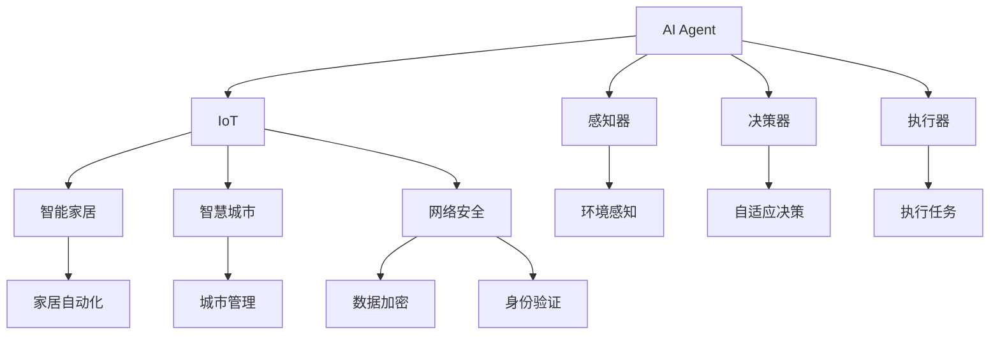

                 

# AI人工智能 Agent：在物联网中的应用

> 关键词：人工智能(AI),Agent,物联网(IoT),网络安全,智能家居,智慧城市,大数据,机器学习,深度学习

## 1. 背景介绍

### 1.1 问题由来
随着物联网(IoT)技术的快速发展，智能设备越来越多地嵌入到人们的日常生活和工作环境中。然而，随着设备的增多，网络的安全性、可靠性、以及数据的管理和处理变得越来越复杂。人工智能(AI)技术的引入，特别是基于AI的Agent系统，为物联网的发展提供了新的方向和可能性。

在物联网中，AI Agent系统可以担任多种角色，包括但不限于智能家居控制、智慧城市管理、智能安防监控、工业自动化控制等。这些系统通过不断地学习、推理和决策，实现了对环境的感知和智能控制。

### 1.2 问题核心关键点
AI Agent系统在物联网中的应用主要集中在以下几个关键点：

- 智能感知：通过感知设备收集环境数据，如温度、湿度、光照、声音等，并对其进行分析和理解。
- 自适应决策：基于感知到的环境数据，AI Agent能够自主地做出决策，如自动调节家居温度、优化交通流量、调整照明亮度等。
- 实时交互：AI Agent能够实时与用户进行交互，根据用户的行为和偏好进行反馈和调整。
- 数据处理：收集的环境数据需要经过高效的存储、处理和分析，以支持决策和反馈。
- 网络安全：物联网中的设备和服务需要高度安全，防止数据泄露和攻击。

### 1.3 问题研究意义
AI Agent在物联网中的应用不仅能够提升智能化水平，还能减少人力成本，提升工作效率和生活质量。同时，其高效的数据处理和分析能力，对于提升智慧城市、智能制造等应用领域具有重要意义。

## 2. 核心概念与联系

### 2.1 核心概念概述

为了更好地理解AI Agent在物联网中的应用，本节将介绍几个关键概念：

- **AI Agent**：基于AI技术构建的系统，能够感知环境、做出决策并执行任务。通常由感知器、决策器、执行器等组成。
- **物联网(IoT)**：通过互联网将各种物体连接到一起，实现物品与物品之间的互联互通。
- **网络安全**：保护物联网中的数据、设备和应用不受未经授权的访问、使用、泄露或破坏。
- **智能家居**：通过AI和物联网技术实现家庭自动化和智能化，提升家居体验。
- **智慧城市**：利用物联网和大数据技术，实现城市管理的智能化、高效化和绿色化。
- **大数据**：包含海量的、多样化的、可变动的、真实的信息资产，用于支持决策和洞察。
- **机器学习(ML)**：基于数据训练模型，使模型能够自动改进和适应新数据。
- **深度学习(Deep Learning)**：一种特殊的机器学习方法，通过构建多层的神经网络来模拟人脑的计算方式，实现复杂数据的处理和分析。

这些概念之间的联系可以通过以下Mermaid流程图来展示：



这个流程图展示了AI Agent在物联网中的应用场景，以及其核心组件：

1. AI Agent通过感知器(M)感知环境，将数据传输给决策器(N)进行决策。
2. 决策器(N)根据环境数据和策略，生成执行命令并传输给执行器(O)。
3. 执行器(O)执行决策命令，实现对环境的控制。
4. AI Agent系统在智能家居(I)、智慧城市(J)、网络安全(K)等场景中，实现智能化的控制和管理。

## 3. 核心算法原理 & 具体操作步骤
### 3.1 算法原理概述

基于AI的物联网Agent系统，其核心原理是将感知到的环境数据进行分析和处理，然后根据预定义的规则或模型进行决策，并执行相应的任务。

该过程通常包括以下几个步骤：

1. **数据采集**：通过感知设备，如传感器、摄像头、麦克风等，采集环境数据。
2. **数据预处理**：对采集的数据进行去噪、滤波、归一化等预处理，提高数据的质量。
3. **数据分析**：通过机器学习或深度学习算法，对预处理后的数据进行分析，提取特征和模式。
4. **决策制定**：根据分析结果，利用决策模型或规则，生成决策命令。
5. **任务执行**：将决策命令传输给执行器，执行相应的任务。
6. **反馈与优化**：将执行结果反馈给感知器，更新感知器、决策器或执行器的参数，优化系统性能。

### 3.2 算法步骤详解

AI Agent在物联网中的具体应用，通常可以分为以下几个关键步骤：

**Step 1: 准备感知设备**

- 选择合适的传感器和通信设备，如温度传感器、光照传感器、WiFi模块等。
- 安装和配置感知设备，确保其能够稳定可靠地采集环境数据。

**Step 2: 数据采集与预处理**

- 通过感知设备，实时采集环境数据，如温度、湿度、光照、声音等。
- 对采集的数据进行预处理，如滤波、归一化、降噪等，提高数据质量。

**Step 3: 数据分析与决策制定**

- 利用机器学习或深度学习算法，对预处理后的数据进行分析，提取特征和模式。
- 根据分析结果，使用决策模型或规则，生成决策命令。

**Step 4: 任务执行与反馈优化**

- 将决策命令传输给执行器，执行相应的任务，如调节温度、控制照明、启动安防等。
- 收集执行结果，进行反馈优化，调整感知器、决策器或执行器的参数，提升系统性能。

### 3.3 算法优缺点

基于AI的物联网Agent系统具有以下优点：

1. **智能化高**：能够自主感知环境、做出决策并执行任务，提高智能化水平。
2. **实时性强**：基于实时数据进行决策和执行，能够快速响应环境变化。
3. **自动化程度高**：减少人工干预，降低人力成本，提升效率。
4. **自适应能力强**：能够根据环境变化进行自适应调整，适应多种应用场景。

但同时，该系统也存在以下缺点：

1. **初始设置复杂**：需要选择合适的设备和配置参数，设置复杂。
2. **对数据质量要求高**：感知设备采集的数据需要经过严格的预处理和分析，数据质量要求高。
3. **安全性问题**：数据传输和存储可能面临被窃听、篡改的风险。
4. **算法依赖**：依赖于机器学习或深度学习算法的性能，算法选择和调参复杂。
5. **资源消耗大**：大规模部署需要高性能计算资源，资源消耗大。

### 3.4 算法应用领域

基于AI的物联网Agent系统已经在多个领域得到广泛应用，例如：

- **智能家居**：通过感知家居环境数据，实现智能家电控制、能耗管理、家居安全等功能。
- **智慧城市**：在交通、照明、公共安全等领域，实现智能管理和优化，提升城市管理效率。
- **工业自动化**：在生产制造过程中，实现设备监控、质量控制、故障预测等功能，提高生产效率。
- **智能安防**：在监控摄像头、门禁系统等应用中，实现人脸识别、入侵检测、异常行为识别等功能，提升安全防护能力。
- **环境监测**：在空气质量、水质监测等领域，实现环境数据采集和分析，提供决策支持。
- **农业自动化**：在农业生产中，实现土壤监测、作物管理、病虫害预警等功能，提升农业生产效率。

这些应用场景展示了AI Agent在物联网中的广泛适用性和巨大潜力。

## 4. 数学模型和公式 & 详细讲解 & 举例说明

### 4.1 数学模型构建

为了更好地理解AI Agent的工作原理，我们将以智能家居控制为例，构建一个简单的数学模型。

假设AI Agent在智能家居中控制温度。温度的感知值 $X$ 和期望值 $T$ 之间的关系可以用线性回归模型来表示：

$$
Y = \alpha X + \beta
$$

其中 $Y$ 表示实际温度，$X$ 表示感知温度，$\alpha$ 和 $\beta$ 是模型参数。

### 4.2 公式推导过程

对上述模型进行最小二乘法拟合，得到最优参数 $\alpha$ 和 $\beta$：

$$
\min \sum_{i=1}^{n} (Y_i - \alpha X_i - \beta)^2
$$

对该方程求导，得到：

$$
\frac{\partial \sum_{i=1}^{n} (Y_i - \alpha X_i - \beta)^2}{\partial \alpha} = 0
$$

$$
\frac{\partial \sum_{i=1}^{n} (Y_i - \alpha X_i - \beta)^2}{\partial \beta} = 0
$$

解以上方程组，得到：

$$
\alpha = \frac{\sum_{i=1}^{n} (X_i - \bar{X})(Y_i - \bar{Y})}{\sum_{i=1}^{n} (X_i - \bar{X})^2}
$$

$$
\beta = \bar{Y} - \alpha \bar{X}
$$

其中 $\bar{X}$ 和 $\bar{Y}$ 分别为 $X$ 和 $Y$ 的平均值。

### 4.3 案例分析与讲解

以智能家居控制为例，下面详细讲解如何构建和优化AI Agent模型。

**Step 1: 数据采集与预处理**

假设有一个温度传感器，能够实时采集室内温度数据。采集到的温度数据经过去噪和滤波预处理，得到 $X_i$。

**Step 2: 模型构建与训练**

利用上述线性回归模型，将采集到的温度数据 $X_i$ 作为输入，实际温度 $Y_i$ 作为输出，构建模型并进行训练。使用最小二乘法求解最优参数 $\alpha$ 和 $\beta$。

**Step 3: 决策制定与执行**

根据训练好的模型，将感知到的温度数据 $X$ 输入模型，计算出期望温度 $T$。根据 $T$ 和当前温度 $Y$ 的差值，生成决策命令，如开启或关闭空调。

**Step 4: 反馈与优化**

将执行结果反馈给感知器，评估模型效果，调整模型参数，提高模型精度。

## 5. 项目实践：代码实例和详细解释说明

### 5.1 开发环境搭建

在进行AI Agent项目开发前，我们需要准备好开发环境。以下是使用Python进行开发的环境配置流程：

1. 安装Python：从官网下载并安装最新版本的Python，建议使用Anaconda或Miniconda进行环境管理。
2. 安装必要的库：安装TensorFlow、PyTorch、scikit-learn、NumPy等常用的Python库。
3. 安装感知设备驱动程序：根据使用的传感器类型，安装相应的设备驱动程序。

### 5.2 源代码详细实现

下面以智能家居控制为例，给出使用TensorFlow构建AI Agent的PyTorch代码实现。

```python
import tensorflow as tf
import numpy as np
from sklearn.linear_model import LinearRegression

# 假设采集到的温度数据
X = np.array([[22.0], [23.5], [21.0], [24.0], [20.5]])

# 假设实际温度数据
Y = np.array([21.0, 22.0, 20.0, 23.0, 19.5])

# 构建线性回归模型
model = LinearRegression()

# 训练模型
model.fit(X, Y)

# 预测期望温度
X_new = np.array([[23.5]])
Y_new = model.predict(X_new)
print("期望温度：", Y_new)
```

### 5.3 代码解读与分析

以上代码实现了基于线性回归模型的AI Agent，用于智能家居控制。

**代码解读**：

- 首先，定义采集到的温度数据 $X$ 和实际温度数据 $Y$。
- 使用scikit-learn库中的线性回归模型对数据进行拟合，得到最优参数 $\alpha$ 和 $\beta$。
- 使用训练好的模型对新采集的温度数据 $X_{new}$ 进行预测，得到期望温度 $Y_{new}$。

**分析**：

- 线性回归模型能够简单高效地处理温度数据，实现智能家居控制。
- 模型训练需要较少的标注数据，适合小规模应用。
- 模型预测速度快，实时性强。

## 6. 实际应用场景

### 6.1 智能家居控制

AI Agent在智能家居控制中具有广泛应用。通过感知家居环境数据，如温度、湿度、光照、声音等，AI Agent能够实现自动调节家居设备，提升生活品质。

**具体实现**：

- 在客厅安装温度传感器、照明系统和空调设备。
- 使用感知设备实时采集环境数据，如温度、光照。
- 利用AI Agent进行数据分析和决策，生成调节命令。
- 执行调节命令，如自动调节空调温度、灯光亮度。

### 6.2 智慧城市管理

AI Agent在智慧城市管理中能够实现交通流量优化、公共安全监控等应用。通过感知城市数据，AI Agent能够提供实时决策支持，提升城市管理效率。

**具体实现**：

- 在交通路口安装摄像头和传感器，实时采集交通流量数据。
- 利用AI Agent进行数据分析和决策，生成交通管理命令。
- 执行交通管理命令，如调节红绿灯时长、发布交通警告。

### 6.3 智能安防监控

AI Agent在智能安防中能够实现人脸识别、入侵检测、异常行为识别等功能。通过感知摄像头数据，AI Agent能够提供实时安防监控，提升安全防护能力。

**具体实现**：

- 在公共场所安装摄像头，实时采集视频数据。
- 利用AI Agent进行人脸识别、行为分析等处理，生成安防命令。
- 执行安防命令，如报警、记录视频数据。

## 7. 工具和资源推荐

### 7.1 学习资源推荐

为了帮助开发者系统掌握AI Agent在物联网中的应用，这里推荐一些优质的学习资源：

1. **《深度学习实战》**：一本系统介绍深度学习技术和应用领域的书籍，包括TensorFlow和PyTorch的使用方法。
2. **《物联网技术与应用》**：介绍物联网的基本概念、技术架构和应用场景的书籍，适合入门学习。
3. **TensorFlow官方文档**：包含TensorFlow框架的详细使用指南和代码示例，是学习TensorFlow的重要资料。
4. **OpenCV官方文档**：包含OpenCV计算机视觉库的详细使用指南和代码示例，是图像处理和分析的重要工具。
5. **《Python深度学习》**：介绍使用Python进行深度学习开发的书籍，包括TensorFlow和PyTorch的实践应用。

通过对这些资源的学习实践，相信你一定能够快速掌握AI Agent在物联网中的应用，并用于解决实际的物联网问题。

### 7.2 开发工具推荐

高效的开发离不开优秀的工具支持。以下是几款用于AI Agent在物联网中开发的常用工具：

1. **TensorFlow**：基于Google的开源深度学习框架，支持分布式计算和GPU加速，适合大规模项目开发。
2. **PyTorch**：基于Python的开源深度学习框架，灵活性高，支持动态计算图，适合快速迭代研究。
3. **OpenCV**：开源计算机视觉库，支持图像处理和分析，是AI Agent中图像识别和处理的重要工具。
4. **Jupyter Notebook**：支持编写和运行Python代码，提供交互式编程环境，适合数据科学和机器学习开发。

合理利用这些工具，可以显著提升AI Agent在物联网中开发的效率，加快创新迭代的步伐。

### 7.3 相关论文推荐

AI Agent在物联网中的应用是一个前沿的研究领域，以下是几篇奠基性的相关论文，推荐阅读：

1. **《多智能体系统中的分布式强化学习》**：介绍多智能体系统中的分布式强化学习方法，用于智能家居和智慧城市中的应用。
2. **《基于深度学习的智能安防监控系统》**：介绍基于深度学习的智能安防监控系统，用于人脸识别和行为分析。
3. **《物联网中的机器学习和大数据应用》**：介绍物联网中的机器学习和大数据技术应用，用于数据管理和智能决策。
4. **《基于协同过滤的推荐系统》**：介绍基于协同过滤的推荐系统，用于智能家居和智慧城市中的个性化推荐。
5. **《深度学习在智慧城市交通管理中的应用》**：介绍深度学习在智慧城市交通管理中的应用，用于交通流量优化和异常行为检测。

这些论文代表了大语言模型微调技术的发展脉络。通过学习这些前沿成果，可以帮助研究者把握学科前进方向，激发更多的创新灵感。

## 8. 总结：未来发展趋势与挑战

### 8.1 总结

本文对AI Agent在物联网中的应用进行了全面系统的介绍。首先阐述了AI Agent在物联网中的重要性，明确了其在智能家居、智慧城市、智能安防等领域的应用价值。其次，从原理到实践，详细讲解了AI Agent的构建和优化方法，给出了AI Agent在智能家居控制中的代码实现。同时，本文还广泛探讨了AI Agent在实际应用中的场景和前景，展示了其在物联网中的广泛适用性和巨大潜力。

通过本文的系统梳理，可以看到，AI Agent在物联网中的应用提供了新的解决方案，极大地提升了智能化水平和效率。未来，伴随AI Agent技术的不断演进，将在更多领域发挥重要作用，为物联网技术的落地应用带来新的突破。

### 8.2 未来发展趋势

展望未来，AI Agent在物联网中的应用将呈现以下几个发展趋势：

1. **智能化程度提升**：随着深度学习和大数据技术的进步，AI Agent将能够处理更加复杂和多样的环境数据，实现更加精细和个性化的控制和管理。
2. **自主学习能力增强**：未来的AI Agent将具备更加强大的自主学习能力，能够根据实时环境数据动态调整模型参数，实现更加自适应和智能化的决策。
3. **边缘计算的应用**：在物联网边缘设备上运行AI Agent，实现更加快速和高效的决策，减少对云端计算资源的依赖。
4. **多智能体系统的融合**：未来的AI Agent将与多个智能体系统进行协同工作，实现更加复杂和多目标的决策。
5. **人机交互的提升**：未来的AI Agent将具备更加自然和智能的交互能力，能够根据用户行为和偏好进行智能决策，提升用户体验。

以上趋势凸显了AI Agent在物联网中的广阔前景。这些方向的探索发展，必将进一步提升物联网系统的性能和应用范围，为智能城市、智能家居等场景提供新的解决方案。

### 8.3 面临的挑战

尽管AI Agent在物联网中的应用取得了显著进展，但在迈向更加智能化、普适化应用的过程中，仍面临诸多挑战：

1. **数据隐私和安全问题**：物联网设备采集的数据可能包含敏感信息，如何保护数据隐私和安全，防止数据泄露和攻击，是一个重要的挑战。
2. **边缘计算的资源限制**：物联网设备通常资源有限，如何在有限的硬件资源下运行AI Agent，是一个需要解决的问题。
3. **算法复杂度**：AI Agent中的算法复杂度高，如何在保证模型效果的同时，提高计算效率和资源利用率，是一个需要优化的问题。
4. **模型可解释性不足**：AI Agent的决策过程通常缺乏可解释性，难以理解其内部工作机制和决策逻辑，需要进一步提高模型的可解释性。
5. **多模态数据融合**：物联网中的数据往往包含多模态信息，如何有效融合不同模态的数据，是一个需要解决的问题。

这些挑战需要从技术、工程和管理等多个层面进行综合应对，才能使AI Agent在物联网中充分发挥其潜力。

### 8.4 研究展望

未来的AI Agent研究需要在以下几个方面寻求新的突破：

1. **隐私保护技术**：研究如何保护物联网设备采集数据的隐私和安全，防止数据泄露和攻击。
2. **轻量级模型**：研究如何在有限的硬件资源下运行AI Agent，提高模型的计算效率和资源利用率。
3. **可解释性技术**：研究如何提高AI Agent的决策过程的可解释性，增强系统的透明度和可信度。
4. **多模态数据融合**：研究如何有效融合不同模态的数据，提升AI Agent的感知和决策能力。
5. **人机交互设计**：研究如何设计更加自然和智能的人机交互界面，提升用户体验和系统可用性。

这些研究方向的探索，必将推动AI Agent在物联网中的广泛应用，为构建智能城市、智能家居等场景提供新的解决方案。

## 9. 附录：常见问题与解答

**Q1: AI Agent在物联网中的应用有哪些关键问题？**

A: AI Agent在物联网中的应用面临以下几个关键问题：

1. **数据隐私和安全问题**：物联网设备采集的数据可能包含敏感信息，如何保护数据隐私和安全，防止数据泄露和攻击。
2. **边缘计算的资源限制**：物联网设备通常资源有限，如何在有限的硬件资源下运行AI Agent，是一个需要解决的问题。
3. **算法复杂度**：AI Agent中的算法复杂度高，如何在保证模型效果的同时，提高计算效率和资源利用率，是一个需要优化的问题。
4. **模型可解释性不足**：AI Agent的决策过程通常缺乏可解释性，难以理解其内部工作机制和决策逻辑，需要进一步提高模型的可解释性。
5. **多模态数据融合**：物联网中的数据往往包含多模态信息，如何有效融合不同模态的数据，是一个需要解决的问题。

**Q2: 如何选择合适的传感器和感知设备？**

A: 选择合适的传感器和感知设备是AI Agent在物联网中应用的重要环节。以下是一些关键考虑因素：

1. **感知能力**：根据应用场景和需求，选择合适的传感器，如温度传感器、光照传感器、声音传感器等。
2. **通信能力**：选择通信能力强的设备，确保数据能够稳定可靠地传输。
3. **功耗和成本**：选择功耗低、成本可控的设备，确保经济性和可维护性。

**Q3: 如何在有限的硬件资源下运行AI Agent？**

A: 在有限的硬件资源下运行AI Agent，需要采用以下优化措施：

1. **轻量级模型**：采用轻量级模型，如MobileNet、SqueezeNet等，降低模型计算量和存储需求。
2. **模型压缩**：使用模型压缩技术，如剪枝、量化等，减小模型参数量和资源消耗。
3. **分布式计算**：采用分布式计算技术，将计算任务分配到多个设备上，提高计算效率。

**Q4: 如何提高AI Agent的决策过程的可解释性？**

A: 提高AI Agent的决策过程的可解释性，需要从以下几个方面入手：

1. **模型透明化**：使用透明化的模型，如规则系统、决策树等，增强决策过程的可解释性。
2. **可解释性技术**：引入可解释性技术，如LIME、SHAP等，解释模型的决策依据。
3. **用户反馈**：根据用户反馈，调整模型参数，提高模型的透明度和可信度。

这些措施能够有效提升AI Agent的决策过程的可解释性，增强系统的透明度和可信度。

**Q5: 如何在多模态数据融合中提升AI Agent的感知和决策能力？**

A: 在多模态数据融合中提升AI Agent的感知和决策能力，需要从以下几个方面入手：

1. **数据预处理**：对不同模态的数据进行预处理，消除噪音和冗余信息。
2. **特征提取**：使用特征提取技术，将不同模态的数据转换为统一的特征表示。
3. **融合模型**：使用融合模型，如深度融合网络、注意力机制等，有效融合不同模态的数据。
4. **多模态训练**：在训练过程中，引入多模态数据，提高AI Agent对多模态数据的处理能力。

这些措施能够有效提升AI Agent的感知和决策能力，增强其在多模态数据环境中的应用能力。

**Q6: AI Agent在智慧城市中的应用前景如何？**

A: AI Agent在智慧城市中的应用前景广阔，具体如下：

1. **交通管理**：通过感知交通流量数据，AI Agent能够实现交通流量的优化和调度，提高交通效率和安全性。
2. **公共安全**：通过感知摄像头数据，AI Agent能够实现实时监控和异常行为检测，提升公共安全水平。
3. **环境保护**：通过感知环境数据，AI Agent能够实现智能环境监测和治理，提高环境保护效果。
4. **智慧能源**：通过感知能源数据，AI Agent能够实现智能能源管理和优化，提高能源利用效率。

这些应用场景展示了AI Agent在智慧城市中的广泛适用性和巨大潜力。

---

作者：禅与计算机程序设计艺术 / Zen and the Art of Computer Programming

