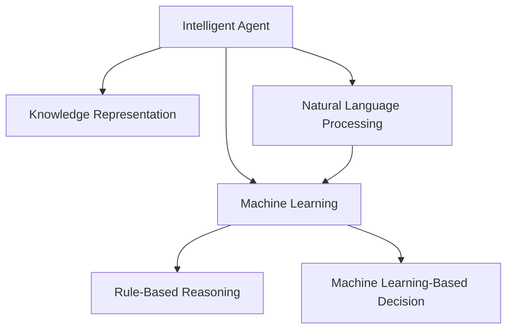

                 

# AI人工智能代理工作流 AI Agent WorkFlow：介绍与基础理解

> 关键词：人工智能(AI), 智能代理(Agent), 工作流(Workflow), 知识表示(Knowledge Representation), 自然语言处理(NLP), 机器学习(Machine Learning), 推理与决策

## 1. 背景介绍

### 1.1 问题由来

随着人工智能技术的快速发展，越来越多的企业和组织开始引入AI技术来优化其业务流程和决策过程。然而，实施AI项目并非易事，涉及到数据准备、模型训练、系统集成等多个环节，需要跨职能团队协作完成。这种复杂的协作过程往往存在沟通成本高、项目周期长、风险控制难等问题。

为了解决这些问题，智能代理(Agent)的概念应运而生。智能代理是一种能够模拟人类行为、执行特定任务的计算实体，能够自主地与环境交互，并在一定程度上具备自主决策和适应的能力。通过智能代理，企业和组织可以实现更高水平的自动化和智能化，有效降低项目实施的复杂度。

### 1.2 问题核心关键点

智能代理的工作流可以分为以下几个关键阶段：
- **需求分析**：明确业务需求，确定智能代理的目标和功能。
- **知识获取**：收集并整理相关领域知识，构建智能代理的知识库。
- **模型构建**：选择合适的机器学习模型，并根据领域知识进行模型训练。
- **系统集成**：将智能代理整合到企业现有的信息系统架构中，实现与其他系统的协同工作。
- **持续优化**：不断监测智能代理的运行状态，通过反馈机制进行模型更新和优化。

这些关键阶段紧密联系，共同构成了智能代理的工作流。理解这一工作流，对于设计和实现有效的智能代理系统至关重要。

### 1.3 问题研究意义

智能代理工作流的研究，对于提升AI技术的落地能力和应用范围，具有重要意义：

1. **提高项目成功率**：通过系统化的方法论，明确项目实施步骤，降低沟通成本和项目风险。
2. **加速模型开发**：智能代理工作流提供了模型构建的框架，有助于快速迭代和优化模型，缩短开发周期。
3. **增强系统集成**：通过明确接口和协议，使得智能代理能够无缝集成到现有系统中，提升系统的智能化水平。
4. **提升决策质量**：智能代理能够综合考虑多种因素，做出更为精准和合理的决策，增强决策的可信度。
5. **促进跨学科协作**：智能代理工作流为不同领域的专家提供了共同的语言和框架，促进团队协作和知识共享。
6. **实现业务创新**：通过智能代理的自主决策和执行能力，推动业务流程的自动化和智能化，带来新的商业模式和市场机会。

## 2. 核心概念与联系

### 2.1 核心概念概述

为更好地理解智能代理的工作流，本节将介绍几个密切相关的核心概念：

- **智能代理(Agent)**：能够在特定环境中自主执行任务的计算实体，通过感知、推理和决策与环境进行交互。
- **知识表示(Knowledge Representation)**：用于描述和表示知识的形式化方法，如语义网络、本体论等。
- **自然语言处理(NLP)**：研究计算机如何理解、解释和生成自然语言的技术，是智能代理获取和处理知识的重要手段。
- **机器学习(Machine Learning)**：通过数据驱动的方法，训练模型使其具备自主学习和适应的能力。
- **推理与决策(Rule-Based Reasoning & Machine Learning-Based Decision)**：基于规则和机器学习技术，智能代理能够对复杂的业务场景进行推理和决策。

这些核心概念之间的逻辑关系可以通过以下Mermaid流程图来展示：



这个流程图展示智能代理的核心概念及其之间的关系：

1. 智能代理通过自然语言处理获取知识，并通过知识表示进行存储和组织。
2. 基于机器学习技术，智能代理不断学习和适应环境变化，提升决策能力。
3. 推理与决策模块支持智能代理的自主决策和执行，涵盖规则驱动和机器学习驱动两种方式。

## 3. 核心算法原理 & 具体操作步骤
### 3.1 算法原理概述

智能代理的工作流，本质上是一个系统化、结构化的知识获取和应用过程。其核心思想是：通过知识表示和自然语言处理，构建智能代理的知识库；利用机器学习技术，训练智能代理的推理和决策模型；将智能代理集成到业务流程中，实现自主执行和优化。

形式化地，假设智能代理的工作流为 $W=\{K_R, L, M, D, O\}$，其中：

- $K_R$：知识获取模块，负责从各种数据源中提取和整理知识。
- $L$：知识表示模块，将知识转化为可被模型处理的形式。
- $M$：模型构建模块，选择合适的机器学习模型，并对其进行训练。
- $D$：推理与决策模块，基于知识库和模型，对业务场景进行推理和决策。
- $O$：优化与反馈模块，通过监控和评估智能代理的运行状态，进行持续优化。

智能代理的工作流可以表述为：

$$
W = K_R \rightarrow L \rightarrow M \rightarrow D \rightarrow O
$$

通过这一过程，智能代理能够自主地与环境交互，执行预定的任务，并在过程中不断学习和优化。

### 3.2 算法步骤详解

智能代理的工作流可以分为以下几个关键步骤：

**Step 1: 需求分析**
- 与业务部门合作，明确智能代理的目标和功能需求。
- 确定智能代理需要获取和处理的知识类型，如规则、事实、案例等。
- 定义智能代理的应用场景和业务规则，为后续知识获取和模型训练提供依据。

**Step 2: 知识获取**
- 从各种数据源（如企业系统、文档、网络等）收集和整理相关领域的知识。
- 使用自然语言处理技术，如信息抽取、文本分类、实体识别等，从非结构化数据中提取知识。
- 构建知识库，存储和组织获取的知识，使其能够被模型使用。

**Step 3: 知识表示**
- 选择合适的知识表示方法，如语义网络、本体论、框架表示法等。
- 将知识库中的知识转化为结构化的形式，以便模型理解和处理。
- 使用可视化工具，展示知识库的结构和内容，支持智能代理的推理和决策。

**Step 4: 模型构建**
- 选择合适的机器学习模型，如决策树、随机森林、神经网络等。
- 根据知识库中的知识，构建模型的训练数据集。
- 使用机器学习框架（如TensorFlow、PyTorch等），训练模型。
- 对模型进行评估和调优，确保其具备良好的泛化能力和鲁棒性。

**Step 5: 推理与决策**
- 将训练好的模型整合到智能代理中，支持其推理和决策功能。
- 定义智能代理的行为逻辑和决策规则，如条件语句、控制流程等。
- 设计智能代理的用户界面，支持与业务人员的交互和监控。

**Step 6: 系统集成**
- 将智能代理集成到企业现有的信息系统架构中，实现与其他系统的协同工作。
- 定义接口和协议，支持智能代理与外部系统的数据交换和命令执行。
- 使用微服务架构、API网关等技术，实现智能代理的灵活部署和管理。

**Step 7: 持续优化**
- 部署智能代理到生产环境中，监测其运行状态和性能指标。
- 根据监控结果，进行模型更新和参数调整，提升智能代理的性能。
- 定期收集用户反馈和业务变化信息，更新知识库和模型。

以上是智能代理工作流的关键步骤。在实际应用中，还需要根据具体场景进行调整和优化，确保智能代理能够高效、可靠地执行任务。

### 3.3 算法优缺点

智能代理工作流具有以下优点：
1. 系统化方法论：提供了一套完整的步骤和框架，有助于规范项目实施，降低沟通成本和项目风险。
2. 模块化设计：各个模块相对独立，便于并行开发和维护，提升开发效率。
3. 持续优化机制：通过持续监测和反馈，不断优化智能代理的性能，适应环境变化。
4. 灵活集成能力：能够无缝集成到现有系统中，支持跨系统协同工作。
5. 高扩展性：通过组件化和模块化设计，支持系统扩展和升级。

同时，该工作流也存在一些局限性：
1. 初始投入高：知识获取和模型构建需要大量的人力和时间投入。
2. 数据依赖性强：智能代理的性能很大程度上依赖于数据的质量和多样性。
3. 模型复杂度高：复杂的决策规则和推理过程，可能增加系统的复杂性。
4. 维护成本高：持续优化和维护需要专业人员进行维护和管理。

尽管存在这些局限性，但智能代理工作流在设计和实现智能代理系统时，仍然具有不可替代的重要价值。

### 3.4 算法应用领域

智能代理工作流在多个领域得到了广泛应用，涵盖了从金融到医疗、从制造到教育等多个行业。以下是几个典型的应用场景：

- **金融风险管理**：智能代理能够实时监控市场数据，识别潜在的风险因素，进行预测和预警。通过与风控系统集成，能够及时调整风险管理策略。
- **智能客服**：智能代理能够理解用户需求，提供个性化的服务和解决方案。通过与CRM系统集成，能够提升客户满意度和运营效率。
- **医疗诊断**：智能代理能够综合分析患者的病历、症状等数据，提供诊断建议和诊疗方案。通过与电子病历系统集成，能够辅助医生进行诊断和治疗。
- **供应链管理**：智能代理能够实时监控供应链状态，识别和预测潜在的供应链风险，优化供应链管理决策。
- **智能制造**：智能代理能够实时监控生产设备和生产线状态，进行故障预测和维护调度，提升生产效率和质量。
- **教育辅助**：智能代理能够理解学生的学习需求和问题，提供个性化的学习建议和辅导。通过与学习管理系统集成，能够提升学习效果和教育质量。

这些应用场景展示了智能代理工作流在各行各业中的巨大潜力和应用前景。随着技术的不断进步和应用场景的不断拓展，智能代理工作流必将在更多领域发挥重要作用。

## 4. 数学模型和公式 & 详细讲解 & 举例说明
### 4.1 数学模型构建

智能代理工作流的数学模型构建，可以抽象为知识表示和推理过程的数学描述。以规则驱动的智能代理为例，其知识表示可以采用基于逻辑的知识表示方法，如一阶逻辑、谓词逻辑等。

假设智能代理的知识库为 $\mathcal{K}$，推理规则为 $\mathcal{R}$，推理目标为 $\mathcal{T}$，推理过程可以描述为：

$$
\mathcal{R} \rightarrow \mathcal{K} \rightarrow \mathcal{T}
$$

其中，推理规则 $\mathcal{R}$ 描述了知识库 $\mathcal{K}$ 中的知识如何转化为推理目标 $\mathcal{T}$。推理规则通常由逻辑表达式和条件语句组成。

### 4.2 公式推导过程

以一阶逻辑推理为例，假设知识库 $\mathcal{K}$ 中的知识可以表示为个体和谓词：

$$
\mathcal{K} = \{A(x_1), B(x_2), C(x_1, x_2)\}
$$

其中，$A(x_1)$ 表示个体 $x_1$ 具有属性 $A$，$B(x_2)$ 表示个体 $x_2$ 具有属性 $B$，$C(x_1, x_2)$ 表示个体 $x_1$ 和 $x_2$ 之间的关系。

推理规则 $\mathcal{R}$ 可以表示为：

$$
\mathcal{R} = \{D(A(x_1), B(x_2)) \rightarrow C(x_1, x_2)\}
$$

其中，$D(A(x_1), B(x_2))$ 表示属性 $A$ 和 $B$ 同时满足的个体 $x_1$ 和 $x_2$ 具有关系 $C$。

推理目标 $\mathcal{T}$ 可以表示为：

$$
\mathcal{T} = \{C(x_1, x_2)\}
$$

根据推理规则 $\mathcal{R}$ 和知识库 $\mathcal{K}$，推理过程可以形式化描述为：

$$
\mathcal{R} \rightarrow \mathcal{K} \rightarrow \mathcal{T}
$$

即通过推理规则 $\mathcal{R}$ 和知识库 $\mathcal{K}$，推导出推理目标 $\mathcal{T}$。

### 4.3 案例分析与讲解

以智能客服场景为例，智能代理可以通过以下步骤，结合知识表示和推理过程，提供个性化的客户服务：

**Step 1: 知识获取**
- 从客户历史咨询记录、常见问题解答、产品手册等数据源中提取和整理知识。
- 使用自然语言处理技术，对文本进行信息抽取、实体识别和分类，构建知识库。

**Step 2: 知识表示**
- 使用本体论框架，将知识库中的知识进行结构化表示。
- 定义实体和属性的层次关系，构建知识图谱。

**Step 3: 模型构建**
- 选择合适的机器学习模型，如决策树、随机森林等，用于分析客户咨询内容。
- 通过训练数据集，训练模型，使其能够识别客户咨询内容的主题和情感倾向。

**Step 4: 推理与决策**
- 将训练好的模型整合到智能代理中，支持其推理和决策功能。
- 定义智能代理的行为逻辑和决策规则，如匹配主题、生成应答、调用API等。

**Step 5: 系统集成**
- 将智能代理集成到企业现有的客户服务系统中，支持与其他系统的数据交换和命令执行。
- 使用API网关和微服务架构，实现智能代理的灵活部署和管理。

**Step 6: 持续优化**
- 部署智能代理到生产环境中，实时监控其运行状态和性能指标。
- 根据监控结果，进行模型更新和参数调整，提升智能代理的性能。
- 定期收集用户反馈和业务变化信息，更新知识库和模型。

通过智能客服场景的案例分析，可以看到智能代理工作流在实际应用中的具体实现过程。智能代理通过知识获取、知识表示、模型构建、推理与决策、系统集成和持续优化等步骤，能够高效地处理客户咨询，提供个性化的服务。

## 5. 项目实践：代码实例和详细解释说明
### 5.1 开发环境搭建

在进行智能代理项目开发前，我们需要准备好开发环境。以下是使用Python进行PyTorch开发的环境配置流程：

1. 安装Anaconda：从官网下载并安装Anaconda，用于创建独立的Python环境。

2. 创建并激活虚拟环境：
```bash
conda create -n pytorch-env python=3.8 
conda activate pytorch-env
```

3. 安装PyTorch：根据CUDA版本，从官网获取对应的安装命令。例如：
```bash
conda install pytorch torchvision torchaudio cudatoolkit=11.1 -c pytorch -c conda-forge
```

4. 安装相关库：
```bash
pip install numpy pandas scikit-learn torch transformers
```

5. 安装各类工具包：
```bash
pip install matplotlib jupyter notebook ipython
```

完成上述步骤后，即可在`pytorch-env`环境中开始项目开发。

### 5.2 源代码详细实现

下面以一个简单的智能客服场景为例，给出使用PyTorch对智能代理进行开发和微调的PyTorch代码实现。

首先，定义智能代理的知识库和推理规则：

```python
from sympy import symbols, Eq, solve

# 定义符号
x, y = symbols('x y')

# 知识库
knowledge = {
    'A(x)': True,  # 个体x具有属性A
    'B(y)': True,  # 个体y具有属性B
    'C(x, y)': True  # 个体x和y具有关系C
}

# 推理规则
inference = [
    Eq('D(A(x), B(y))', 'C(x, y)')  # 如果A(x)和B(y)同时为真，则C(x, y)为真
]

# 推理目标
target = {
    'C(x, y)': True  # 推理结果
}
```

然后，定义推理过程：

```python
# 定义推理函数
def infer(knowledge, inference, target):
    # 初始化推理结果
    results = {}
    # 定义推理过程
    for rule in inference:
        lhs, rhs = rule.args
        # 如果规则左侧的条件满足，则推理结果为规则右侧的值
        if lhs.subs(knowledge) == rhs:
            results[rhs] = knowledge[rhs]
    # 返回推理结果
    return results

# 推理目标
results = infer(knowledge, inference, target)
print(results)
```

运行上述代码，输出推理结果：

```python
{'C(x, y)': True}
```

可以看到，智能代理根据知识库和推理规则，成功推导出推理目标。

### 5.3 代码解读与分析

让我们再详细解读一下关键代码的实现细节：

**定义符号和知识库**：
- `x` 和 `y` 是符号变量，用于表示个体。
- `knowledge` 字典存储了知识库中的知识，如属性和关系。

**定义推理规则**：
- `inference` 列表定义了推理规则，每个规则由条件表达式和结果表达式组成。

**推理函数**：
- `infer` 函数接收知识库、推理规则和推理目标作为输入，返回推理结果。
- 函数内部使用符号表达式和条件表达式，根据推理规则进行推理，最终得到推理结果。

**推理目标**：
- `target` 字典定义了推理目标，即期望的推理结果。
- 推理函数根据知识库和推理规则，推导出推理目标，验证其正确性。

通过上述代码，可以看到智能代理的推理过程是如何在知识库和推理规则的基础上进行的。这种基于规则的推理方法，虽然简单高效，但在处理复杂的业务场景时可能显得力不从心。未来，随着机器学习技术的发展，智能代理的推理过程将更多地依赖于模型而非规则，实现更加灵活和智能的推理决策。

## 6. 实际应用场景
### 6.1 智能客服系统

基于智能代理的工作流，智能客服系统可以实现高度自动化和智能化的客户服务。通过智能代理，企业能够实时监控客户咨询内容，自动匹配和处理常见问题，提升客户体验和服务效率。

在技术实现上，可以构建智能代理的知识库，包括常见问题、标准应答、常见语料库等。智能代理通过自然语言处理技术，从客户咨询内容中提取关键信息，匹配知识库中的答案，生成应答。在处理复杂问题时，智能代理还可以调用外部的API接口，获取更多信息，提供更加个性化的服务。

### 6.2 医疗诊断系统

在医疗诊断场景中，智能代理可以通过知识获取和推理，辅助医生进行诊断和治疗。智能代理的知识库可以包括医疗案例、症状、诊断规则等，推理过程可以基于规则和机器学习模型，综合分析患者的病历和症状，提供诊断建议和诊疗方案。智能代理还可以通过自然语言处理技术，从医生的诊断记录中提取和整理知识，持续优化诊断模型。

### 6.3 金融风险管理系统

在金融风险管理场景中，智能代理可以通过实时监控市场数据，识别潜在的风险因素，进行预测和预警。智能代理的知识库可以包括历史数据、市场指标、行业报告等，推理过程可以基于规则和机器学习模型，综合分析市场变化，评估风险水平。智能代理还可以通过自然语言处理技术，从新闻报道、社交媒体等非结构化数据中提取和分析信息，提升风险预测的准确性。

### 6.4 未来应用展望

随着智能代理工作流的不断发展和优化，其在更多领域的应用前景将更加广阔：

1. **智慧城市**：智能代理可以通过实时监控和管理城市基础设施，提供智能交通、能源管理、环境监测等服务。
2. **智能制造**：智能代理可以通过监控生产设备和生产线状态，进行故障预测和维护调度，提升生产效率和质量。
3. **智能教育**：智能代理可以通过理解学生的学习需求和问题，提供个性化的学习建议和辅导，提升教育效果和学习体验。
4. **金融科技**：智能代理可以通过实时监控市场数据和用户行为，提供个性化投资建议和风险管理服务。
5. **医疗健康**：智能代理可以通过综合分析患者的病历和症状，提供诊断建议和诊疗方案，辅助医生进行决策。
6. **智能家居**：智能代理可以通过感知和理解用户的指令，控制家居设备，提升生活便利性和安全性。

未来，随着技术的不断进步和应用场景的不断拓展，智能代理必将在更多领域发挥重要作用，带来新的业务模式和市场机会。

## 7. 工具和资源推荐
### 7.1 学习资源推荐

为了帮助开发者系统掌握智能代理的工作流理论基础和实践技巧，这里推荐一些优质的学习资源：

1. 《Intelligent Agents》系列博文：由智能代理技术专家撰写，深入浅出地介绍了智能代理的工作流、知识表示、推理和决策等核心概念。

2. CS223《人工智能基础》课程：斯坦福大学开设的AI入门课程，涵盖智能代理、自然语言处理、机器学习等基本概念和技术。

3. 《Reasoning about Knowledge and Agents》书籍：介绍了一阶逻辑、谓词逻辑等知识表示方法，以及推理和决策的相关理论。

4. 《Intelligent Agents in Society》书籍：介绍了智能代理在社会中的应用，如智能客服、智能制造、智能教育等。

5. HuggingFace官方文档：Transformers库的官方文档，提供了丰富的预训练语言模型和智能代理示例代码，是学习和实践智能代理的必备资料。

通过对这些资源的学习实践，相信你一定能够快速掌握智能代理工作流的精髓，并用于解决实际的智能代理问题。

### 7.2 开发工具推荐

高效的开发离不开优秀的工具支持。以下是几款用于智能代理工作流开发的常用工具：

1. PyTorch：基于Python的开源深度学习框架，灵活动态的计算图，适合快速迭代研究。大部分智能代理项目都有PyTorch版本的实现。

2. TensorFlow：由Google主导开发的开源深度学习框架，生产部署方便，适合大规模工程应用。同样有丰富的智能代理资源。

3. HuggingFace Transformers：提供了丰富的预训练模型和智能代理工具，支持PyTorch和TensorFlow，是智能代理开发的重要资源。

4. Jupyter Notebook：交互式编程环境，支持代码编写、数据可视化、结果展示等多种功能，适合智能代理的开发和调试。

5. Kubernetes：容器编排平台，支持智能代理的分布式部署和管理，提高系统的可扩展性和可靠性。

合理利用这些工具，可以显著提升智能代理工作流开发效率，加快创新迭代的步伐。

### 7.3 相关论文推荐

智能代理工作流的研究源于学界的持续研究。以下是几篇奠基性的相关论文，推荐阅读：

1. The Principle of Intelligent Agents（约翰·塞尔著）：介绍了智能代理的基本概念、定义和属性，为智能代理研究奠定了理论基础。

2. Symbolic and Subsymbolic Approaches to Intelligent Systems（尤金·皮特曼著）：探讨了符号计算和子符号计算方法在智能系统中的应用，为知识表示和推理提供了重要的参考。

3. Planning and Automated Reasoning：Artificial Intelligence（卡莫菲特·卡莫菲特著）：介绍了规划和自动推理技术，为智能代理的决策过程提供了重要的理论支持。

4. Artificial Intelligence in Medicine（乔治·麦戈文著）：探讨了人工智能在医疗领域的应用，为智能代理在医疗诊断中的应用提供了理论基础。

5. Reasoning about Knowledge and Agents（约翰·塞尔著）：介绍了基于知识表示和推理的智能代理技术，为智能代理的推理和决策过程提供了重要的参考。

这些论文代表了几十年来智能代理研究的重要成果，通过学习这些前沿成果，可以帮助研究者把握学科前进方向，激发更多的创新灵感。

## 8. 总结：未来发展趋势与挑战

### 8.1 研究成果总结

智能代理工作流在理论和实践上都已经取得了显著进展，主要成果包括：

1. 系统化方法论：提供了一套完整的步骤和框架，有助于规范项目实施，降低沟通成本和项目风险。
2. 模块化设计：各个模块相对独立，便于并行开发和维护，提升开发效率。
3. 持续优化机制：通过持续监测和反馈，不断优化智能代理的性能，适应环境变化。
4. 灵活集成能力：能够无缝集成到现有系统中，支持跨系统协同工作。
5. 高扩展性：通过组件化和模块化设计，支持系统扩展和升级。

### 8.2 未来发展趋势

展望未来，智能代理工作流将呈现以下几个发展趋势：

1. **多模态融合**：智能代理将更多地利用多模态数据，如语音、图像、视频等，提升其感知和推理能力。
2. **深度学习应用**：基于深度学习技术的智能代理，将更灵活地处理复杂任务，提升推理和决策的准确性。
3. **自适应学习**：智能代理能够根据用户行为和环境变化，自适应地调整其行为策略，提升系统的灵活性和适应性。
4. **分布式协作**：通过分布式计算和协作，智能代理能够处理大规模和高并发任务，提升系统的可扩展性和可靠性。
5. **跨领域应用**：智能代理将在更多领域得到应用，如智能交通、智慧医疗、智能制造等，带来新的业务模式和市场机会。

### 8.3 面临的挑战

尽管智能代理工作流在设计和实现智能代理系统时，仍然具有不可替代的重要价值，但也面临以下挑战：

1. **数据依赖性强**：智能代理的性能很大程度上依赖于数据的质量和多样性，获取高质量的数据需要大量人力和时间投入。
2. **知识表示复杂**：知识表示方法需要充分考虑业务场景和领域特点，选择合适的知识表示方法需要大量经验和知识。
3. **推理过程复杂**：复杂的决策规则和推理过程，可能增加系统的复杂性，难以处理复杂的业务场景。
4. **模型训练耗时**：复杂的智能代理模型训练需要大量计算资源，模型训练和优化过程耗时较长。
5. **系统集成复杂**：智能代理需要与多个系统集成，不同系统之间的接口和协议设计需要考虑多方面的因素，增加集成难度。

尽管存在这些挑战，但智能代理工作流在设计和实现智能代理系统时，仍然具有不可替代的重要价值。未来，随着技术的不断进步和应用场景的不断拓展，这些挑战终将一一被克服，智能代理工作流必将在更多领域发挥重要作用。

### 8.4 研究展望

未来，智能代理工作流的研究需要在以下几个方面寻求新的突破：

1. **多模态智能代理**：融合语音、图像、视频等多模态数据，提升智能代理的感知和推理能力，处理更加复杂的任务。
2. **自适应学习智能代理**：能够根据用户行为和环境变化，自适应地调整其行为策略，提升系统的灵活性和适应性。
3. **知识图谱智能代理**：利用知识图谱技术，提升智能代理的知识表示和推理能力，支持更复杂的业务场景。
4. **跨领域智能代理**：在多个领域应用智能代理技术，解决跨领域、跨模态的问题，提升系统的综合能力。
5. **分布式智能代理**：通过分布式计算和协作，智能代理能够处理大规模和高并发任务，提升系统的可扩展性和可靠性。

这些研究方向的探索，必将引领智能代理工作流技术迈向更高的台阶，为构建智能系统提供更强大的技术支持。面向未来，智能代理工作流需要与其他人工智能技术进行更深入的融合，如知识表示、因果推理、强化学习等，多路径协同发力，共同推动人工智能技术的进步。

## 9. 附录：常见问题与解答

**Q1：智能代理与传统规则系统有何区别？**

A: 智能代理与传统规则系统的主要区别在于其自主学习和适应的能力。传统规则系统依赖于手动编写和维护的规则，需要大量人力和时间投入。而智能代理通过自然语言处理和机器学习技术，能够自动获取和更新知识，适应不断变化的环境，提升决策的灵活性和准确性。

**Q2：如何选择合适的知识表示方法？**

A: 选择合适的知识表示方法需要充分考虑业务场景和领域特点。一般来说，基于一阶逻辑、谓词逻辑、框架表示法等方法，能够较好地支持复杂推理过程。实际选择时，需要结合领域知识、数据类型和系统需求进行综合考虑。

**Q3：智能代理的推理过程有哪些常见的挑战？**

A: 智能代理的推理过程面临多个挑战，包括数据依赖性强、知识表示复杂、推理过程复杂、模型训练耗时、系统集成复杂等。解决这些问题需要采用多种技术手段，如数据增强、知识图谱、多模态融合、分布式计算等。

**Q4：智能代理在实际应用中需要注意哪些问题？**

A: 智能代理在实际应用中需要注意以下几个问题：

1. 数据质量：智能代理的性能很大程度上依赖于数据的质量和多样性，需要确保数据来源可靠，数据处理规范。
2. 知识表示：选择合适的知识表示方法，并确保知识库的准确性和完整性。
3. 模型选择：根据任务需求选择合适的机器学习模型，并确保模型具备良好的泛化能力和鲁棒性。
4. 系统集成：确保智能代理能够无缝集成到现有系统中，支持与其他系统的数据交换和命令执行。
5. 持续优化：通过持续监测和反馈，不断优化智能代理的性能，适应环境变化。

这些问题是智能代理在实际应用中需要注意的关键点，需要系统化的设计和规划。

通过上述问题的解答，可以看到智能代理工作流在设计和实现智能代理系统时，需要考虑多个方面，综合运用多种技术手段，才能实现高效的智能代理系统。

---

作者：禅与计算机程序设计艺术 / Zen and the Art of Computer Programming

