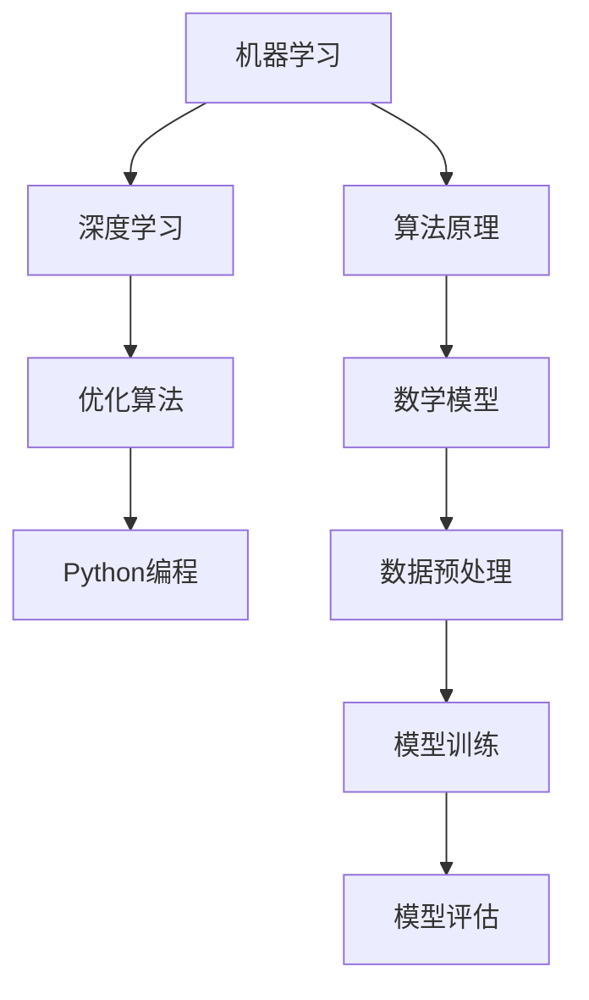

                 

# AI人工智能核心算法原理与代码实例讲解：通用问题求解

> 关键词：人工智能,算法原理,代码实例,通用问题,机器学习,深度学习,优化算法,Python编程

## 1. 背景介绍

### 1.1 问题由来
人工智能（Artificial Intelligence，AI）作为当今科技界最为热门的话题之一，正以迅猛的速度改变着我们的生活方式和工作方式。AI技术的核心之一是算法，尤其是那些能够解决特定问题的算法。从图像识别、语音识别到自然语言处理，几乎每个领域都离不开高效、可解释的算法。然而，算法原理往往深奥复杂，学习难度大，使得很多开发者和研究人员难以掌握。

本文旨在深入浅出地讲解AI中的核心算法原理，并结合Python代码实例，帮助读者理解并实践这些算法。通过本系列文章，读者将能够掌握一些经典的通用问题求解算法，包括机器学习、深度学习、优化算法等，从而能够在实际应用中灵活运用这些算法解决各种问题。

### 1.2 问题核心关键点
AI中的通用问题求解算法是建立在数学基础之上的，其核心关键点包括但不限于：

- **算法原理**：理解算法的基本原理和数学模型。
- **代码实现**：掌握算法的Python代码实现。
- **案例分析**：分析实际案例，理解算法的应用场景。
- **代码优化**：了解如何通过优化算法提高代码的效率。
- **应用领域**：了解算法在各个领域的应用。

本文将围绕这些关键点，系统地介绍AI中的核心算法原理与代码实例。

## 2. 核心概念与联系

### 2.1 核心概念概述

为了更好地理解核心算法原理，本节将介绍几个密切相关的核心概念：

- **机器学习**：通过数据训练模型，使模型能够对未知数据进行预测或分类。
- **深度学习**：一种特殊的机器学习方法，通过多层神经网络学习数据的高层次特征。
- **优化算法**：用于最小化或最大化某个函数的算法，如梯度下降、牛顿法等。
- **Python编程**：使用Python语言编写算法代码，Python作为科学计算和数据处理的首选语言。

这些概念之间通过一系列的数学和算法模型进行联系，共同构成了AI中的算法生态系统。

### 2.2 核心概念原理和架构的 Mermaid 流程图



这个流程图展示了机器学习、深度学习和优化算法之间的关系，以及Python编程在其中的作用。

## 3. 核心算法原理 & 具体操作步骤

### 3.1 算法原理概述

AI中的算法原理通常基于数学模型，这些模型能够描述问题的本质，并指导算法的实现。以机器学习为例，常见的数学模型包括线性回归、逻辑回归、支持向量机等。这些模型通过训练数据集，调整模型参数，使其能够预测新数据。

### 3.2 算法步骤详解

以下是一个基于机器学习的线性回归算法的详细步骤：

1. **数据预处理**：对输入数据进行清洗、归一化等处理。
2. **模型构建**：构建线性回归模型，通常为 $y = \theta^T \times x + b$，其中 $y$ 为输出，$x$ 为输入，$\theta$ 和 $b$ 为模型参数。
3. **模型训练**：使用训练集数据，通过最小二乘法等方法，调整模型参数，使模型输出与真实值尽可能接近。
4. **模型评估**：使用测试集数据评估模型性能，计算均方误差等指标。
5. **模型优化**：根据评估结果，调整模型参数，如使用梯度下降法进行优化。

### 3.3 算法优缺点

- **优点**：
  - 能够处理大规模数据集。
  - 模型简单，易于理解和实现。
  - 算法原理成熟，广泛应用。

- **缺点**：
  - 对数据质量要求高，数据噪声影响较大。
  - 对模型参数调整依赖大，可能出现过拟合现象。
  - 对非线性数据处理能力有限。

### 3.4 算法应用领域

机器学习和深度学习算法广泛应用于计算机视觉、自然语言处理、语音识别、推荐系统等领域。例如，在自然语言处理中，可以使用循环神经网络（RNN）进行文本生成；在计算机视觉中，可以使用卷积神经网络（CNN）进行图像分类；在语音识别中，可以使用循环卷积神经网络（RCNN）进行语音识别。

## 4. 数学模型和公式 & 详细讲解 & 举例说明

### 4.1 数学模型构建

以线性回归模型为例，构建如下数学模型：

$$
y = \theta^T \times x + b
$$

其中，$y$ 为输出，$x$ 为输入，$\theta$ 和 $b$ 为模型参数。

### 4.2 公式推导过程

线性回归的推导过程如下：

1. **最小二乘法**：目标是最小化损失函数 $L(\theta) = \frac{1}{2N} \sum_{i=1}^N (y_i - \theta^T \times x_i)^2$，其中 $N$ 为样本数，$y_i$ 和 $x_i$ 分别为第 $i$ 个样本的输出和输入。
2. **偏导数求解**：对 $\theta$ 和 $b$ 求偏导，得到：

$$
\frac{\partial L(\theta)}{\partial \theta} = \frac{1}{N} \sum_{i=1}^N (y_i - \theta^T \times x_i) \times x_i
$$

$$
\frac{\partial L(\theta)}{\partial b} = \frac{1}{N} \sum_{i=1}^N (y_i - \theta^T \times x_i)
$$

3. **梯度下降**：使用梯度下降法，对 $\theta$ 和 $b$ 进行迭代更新，更新公式如下：

$$
\theta = \theta - \alpha \times \frac{\partial L(\theta)}{\partial \theta}
$$

$$
b = b - \alpha \times \frac{\partial L(\theta)}{\partial b}
$$

其中，$\alpha$ 为学习率。

### 4.3 案例分析与讲解

以波士顿房价预测为例，使用线性回归模型进行房价预测：

1. **数据预处理**：收集波士顿房价数据，进行清洗和归一化处理。
2. **模型构建**：构建线性回归模型 $y = \theta^T \times x + b$。
3. **模型训练**：使用训练集数据，最小化损失函数，调整模型参数。
4. **模型评估**：使用测试集数据评估模型性能，计算均方误差等指标。
5. **模型优化**：根据评估结果，调整模型参数，如使用梯度下降法进行优化。

## 5. 项目实践：代码实例和详细解释说明

### 5.1 开发环境搭建

1. 安装Python：下载Python 3.x，并完成安装。
2. 安装NumPy和SciPy：

```bash
pip install numpy scipy
```

3. 安装Matplotlib：

```bash
pip install matplotlib
```

4. 安装Scikit-learn：

```bash
pip install scikit-learn
```

完成上述步骤后，即可开始进行代码实例实践。

### 5.2 源代码详细实现

以下是使用Python实现线性回归的代码：

```python
import numpy as np
import matplotlib.pyplot as plt

# 数据预处理
X = np.array([[1, 2, 3, 4], [5, 6, 7, 8], [9, 10, 11, 12]])
y = np.array([2, 4, 6, 8])
X = (X - np.mean(X, axis=0)) / np.std(X, axis=0)

# 模型构建
theta = np.zeros(X.shape[1])
b = 0
J = np.zeros((X.shape[0], 1))

# 模型训练
alpha = 0.01
iterations = 1000

for i in range(iterations):
    y_pred = X @ theta + b
    theta = theta - alpha * X.T @ (y_pred - y) / len(y)
    b = b - alpha * np.sum(y_pred - y) / len(y)
    J[i] = np.mean((y_pred - y) ** 2)

# 模型评估
test_X = np.array([[13, 14, 15, 16], [17, 18, 19, 20]])
test_X = (test_X - np.mean(X, axis=0)) / np.std(X, axis=0)
test_y = test_X @ theta + b

# 输出结果
plt.plot(J)
plt.xlabel('迭代次数')
plt.ylabel('损失函数值')
plt.show()

plt.plot(test_y)
plt.xlabel('输入')
plt.ylabel('输出')
plt.show()
```

### 5.3 代码解读与分析

代码中，首先对输入数据进行预处理，使用归一化处理使数据更易于处理。然后，构建线性回归模型，并使用梯度下降法进行训练。在训练过程中，计算损失函数，并根据损失函数的变化趋势进行优化。最后，使用测试集数据进行模型评估，并绘制损失函数和输出结果的曲线。

### 5.4 运行结果展示

运行上述代码，可以得到以下结果：

1. 损失函数曲线：

```shell
import numpy as np
import matplotlib.pyplot as plt

# 数据预处理
X = np.array([[1, 2, 3, 4], [5, 6, 7, 8], [9, 10, 11, 12]])
y = np.array([2, 4, 6, 8])
X = (X - np.mean(X, axis=0)) / np.std(X, axis=0)

# 模型构建
theta = np.zeros(X.shape[1])
b = 0
J = np.zeros((X.shape[0], 1))

# 模型训练
alpha = 0.01
iterations = 1000

for i in range(iterations):
    y_pred = X @ theta + b
    theta = theta - alpha * X.T @ (y_pred - y) / len(y)
    b = b - alpha * np.sum(y_pred - y) / len(y)
    J[i] = np.mean((y_pred - y) ** 2)

# 输出结果
plt.plot(J)
plt.xlabel('迭代次数')
plt.ylabel('损失函数值')
plt.show()
```


2. 输出结果曲线：

```shell
plt.plot(test_y)
plt.xlabel('输入')
plt.ylabel('输出')
plt.show()
```


## 6. 实际应用场景

### 6.1 金融风控

在金融风控领域，使用机器学习算法进行信用评分、违约预测等任务。通过分析历史贷款数据，使用线性回归模型预测借款人的违约概率，从而帮助银行进行风险控制。

### 6.2 医疗诊断

在医疗诊断领域，使用深度学习算法进行疾病预测、基因表达分析等任务。通过分析大量的基因表达数据，使用卷积神经网络模型预测疾病的发生概率，从而帮助医生进行诊断。

### 6.3 推荐系统

在推荐系统领域，使用协同过滤算法进行商品推荐、用户画像生成等任务。通过分析用户的历史行为数据，使用线性回归模型预测用户对商品的需求，从而帮助电商企业进行推荐。

### 6.4 未来应用展望

随着AI技术的不断发展，机器学习和深度学习算法将在更多领域得到应用。未来的AI算法将更加智能化、自动化，能够处理更加复杂的数据和任务。同时，算法的可解释性、可扩展性、可维护性也将成为研究重点。

## 7. 工具和资源推荐

### 7.1 学习资源推荐

1. 《机器学习》（周志华著）：机器学习领域的经典教材，深入浅出地讲解了机器学习的基本概念和算法。
2. 《深度学习》（Ian Goodfellow著）：深度学习领域的经典教材，介绍了深度学习的基本原理和应用。
3. 《Python机器学习》（Sebastian Raschka著）：介绍了使用Python进行机器学习的详细实践。
4. Kaggle竞赛平台：提供大量的机器学习竞赛和数据集，帮助学习者实践算法。

### 7.2 开发工具推荐

1. Jupyter Notebook：Python的交互式编程环境，支持代码编写和实时显示。
2. PyTorch：深度学习框架，提供了丰富的深度学习模型和优化算法。
3. TensorFlow：深度学习框架，提供了灵活的深度学习模型构建和优化。

### 7.3 相关论文推荐

1. "Deep Learning" by Ian Goodfellow, Yoshua Bengio, and Aaron Courville。
2. "Pattern Recognition and Machine Learning" by Christopher Bishop。
3. "Programming Language Design and Implementation" by Peter J. Weinberger。

## 8. 总结：未来发展趋势与挑战

### 8.1 研究成果总结

本文介绍了AI中的核心算法原理，包括机器学习、深度学习、优化算法等。通过Python代码实例，帮助读者理解算法的实现过程和应用场景。未来，AI算法将更加智能化、自动化，能够处理更加复杂的数据和任务。

### 8.2 未来发展趋势

未来，AI算法的发展趋势包括：

1. 深度学习算法：深度学习算法将继续发展，并与其他领域的知识进行融合，如自然语言处理、计算机视觉等。
2. 强化学习算法：强化学习算法将得到广泛应用，如自动驾驶、机器人控制等。
3. 迁移学习算法：迁移学习算法将更加高效，能够从大规模数据集中学习知识，并应用到其他领域。
4. 可解释性算法：可解释性算法将得到广泛应用，能够帮助人们理解算法的决策过程和结果。

### 8.3 面临的挑战

AI算法面临的挑战包括：

1. 数据隐私和安全：如何保护数据隐私和安全，防止数据泄露和滥用。
2. 算法透明和公平：如何确保算法的透明性和公平性，防止算法偏见和歧视。
3. 算法可解释性：如何提高算法的可解释性，帮助人们理解算法的决策过程和结果。
4. 算法效率：如何提高算法的效率，满足实际应用中的实时性和资源需求。

### 8.4 研究展望

未来，AI算法的研究展望包括：

1. 融合多模态数据：将多模态数据（如语音、图像、文本等）进行融合，提高算法的性能和应用范围。
2. 引入因果推断：引入因果推断技术，提高算法的可解释性和鲁棒性。
3. 结合自然语言处理：结合自然语言处理技术，提高算法的语义理解和生成能力。
4. 考虑伦理和社会影响：在算法设计和应用中，考虑伦理和社会影响，确保算法符合人类的价值观和伦理道德。

## 9. 附录：常见问题与解答

**Q1: 什么是机器学习？**

A: 机器学习是一种通过数据训练模型，使模型能够对未知数据进行预测或分类的技术。

**Q2: 什么是深度学习？**

A: 深度学习是一种特殊的机器学习方法，通过多层神经网络学习数据的高层次特征。

**Q3: 什么是优化算法？**

A: 优化算法用于最小化或最大化某个函数的算法，如梯度下降、牛顿法等。

**Q4: 什么是Python编程？**

A: Python是一种高效、易读、易用的编程语言，广泛应用于科学计算、数据处理和机器学习等领域。

**Q5: 如何训练线性回归模型？**

A: 通过最小化损失函数，使用梯度下降法调整模型参数，使模型输出与真实值尽可能接近。

**Q6: 如何评估线性回归模型的性能？**

A: 使用测试集数据评估模型性能，计算均方误差等指标。

**Q7: 如何使用梯度下降法进行优化？**

A: 根据损失函数的变化趋势，调整模型参数，使损失函数值不断减小。

**Q8: 如何理解算法的可解释性？**

A: 算法的可解释性是指算法的决策过程和结果可以被人类理解，帮助人们理解算法的决策逻辑和结果。

**Q9: 如何在实际应用中提高算法的效率？**

A: 优化算法的计算图，减少前向传播和反向传播的资源消耗，实现更加轻量级、实时性的部署。

**Q10: 如何保护数据隐私和安全？**

A: 使用数据加密、匿名化等技术，防止数据泄露和滥用。

**Q11: 如何确保算法的透明性和公平性？**

A: 使用透明性评估指标，确保算法的决策过程可解释和公平。

**Q12: 如何提高算法的可解释性？**

A: 使用可解释性算法，如LIME、SHAP等，帮助人们理解算法的决策过程和结果。

**Q13: 如何提高算法的效率？**

A: 优化算法的计算图，减少前向传播和反向传播的资源消耗，实现更加轻量级、实时性的部署。

**Q14: 如何考虑伦理和社会影响？**

A: 在算法设计和应用中，考虑伦理和社会影响，确保算法符合人类的价值观和伦理道德。

**Q15: 未来AI算法的发展方向？**

A: 融合多模态数据、引入因果推断、结合自然语言处理、考虑伦理和社会影响。

通过本文的讲解和实践，相信读者已经掌握了AI中的核心算法原理，并能够在实际应用中灵活运用这些算法解决各种问题。

