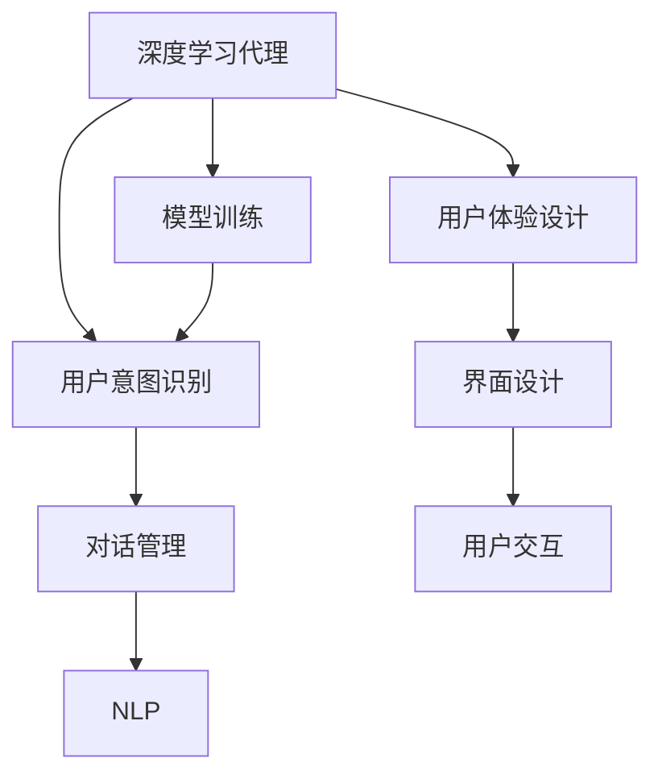
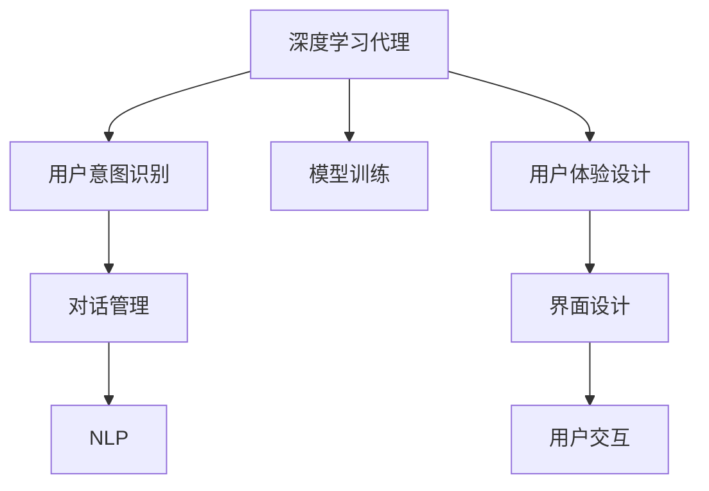

                 

# AI人工智能深度学习算法：人工智能深度学习代理与用户体验设计

> 关键词：人工智能，深度学习，代理技术，用户体验设计，自然语言处理(NLP)

## 1. 背景介绍

### 1.1 问题由来

随着人工智能(AI)技术的发展，深度学习在各个领域的应用日益广泛。深度学习模型，如卷积神经网络(CNN)、循环神经网络(RNN)、生成对抗网络(GAN)等，已经成为了图像识别、语音识别、自然语言处理(NLP)等任务中的核心技术。然而，这些模型往往需要大量标注数据进行训练，且需要昂贵的硬件资源进行支持，这在一定程度上限制了AI技术的普及和应用。

与此同时，随着智能设备的普及，越来越多的人们希望与AI进行更自然、更个性化的交互。这就要求我们不仅要开发高性能的AI模型，还要设计良好的用户体验，让AI能够真正走进人们的生活。因此，如何在保证AI性能的同时，提升用户体验，成为了一个迫切需要解决的问题。

### 1.2 问题核心关键点

为此，研究者们提出了代理(Agent)技术，并结合用户体验设计(User Experience Design, UXD)的思想，提出了一种基于深度学习的AI代理技术，可以大幅降低AI模型的训练成本和硬件需求，同时提升用户体验。

基于深度学习的AI代理技术，主要包含以下几个核心概念：

- **深度学习代理**：指通过深度学习模型训练的智能代理，能够在特定环境中自主学习并执行任务。
- **用户意图识别**：指对用户的输入指令进行理解和分类，提取用户的意图信息。
- **对话管理**：指在多轮对话中，根据用户的意图信息，选择合适的回答并进行响应。
- **自然语言处理(NLP)**：指将自然语言转化为机器可理解的形式，进行语义分析和信息抽取。

这些概念之间的逻辑关系可以通过以下Mermaid流程图来展示：



这个流程图展示了大语言模型的核心概念及其之间的关系：

1. 深度学习代理通过模型训练获得初始化参数。
2. 在多轮对话中，代理通过用户意图识别提取任务目标。
3. 对话管理根据任务目标，生成合适的回答并执行对话。
4. NLP技术对用户输入进行语义分析和信息抽取。
5. 用户体验设计通过界面设计，提升用户交互体验。

这些概念共同构成了基于深度学习的AI代理系统的整体框架，使其能够更好地执行任务并提升用户体验。

## 2. 核心概念与联系

### 2.1 核心概念概述

为了更好地理解基于深度学习的AI代理技术，本节将介绍几个密切相关的核心概念：

- **深度学习代理**：指通过深度学习模型训练的智能代理，能够在特定环境中自主学习并执行任务。
- **用户意图识别**：指对用户的输入指令进行理解和分类，提取用户的意图信息。
- **对话管理**：指在多轮对话中，根据用户的意图信息，选择合适的回答并进行响应。
- **自然语言处理(NLP)**：指将自然语言转化为机器可理解的形式，进行语义分析和信息抽取。
- **用户体验设计**：指通过界面设计，提升用户交互体验，使AI系统更自然、更易于使用。
- **界面设计**：指根据用户体验需求，设计用户界面，提升用户操作的便捷性和直观性。
- **用户交互**：指用户与AI系统进行交流和反馈的过程，是用户体验的重要组成部分。

这些核心概念之间的逻辑关系可以通过以下Mermaid流程图来展示：



这个流程图展示了大语言模型的核心概念及其之间的关系：

1. 深度学习代理通过模型训练获得初始化参数。
2. 在多轮对话中，代理通过用户意图识别提取任务目标。
3. 对话管理根据任务目标，生成合适的回答并执行对话。
4. NLP技术对用户输入进行语义分析和信息抽取。
5. 用户体验设计通过界面设计，提升用户交互体验。

## 3. 核心算法原理 & 具体操作步骤

### 3.1 算法原理概述

基于深度学习的AI代理技术，本质上是将深度学习模型与用户意图识别、对话管理、NLP技术等相结合，以实现智能代理系统的构建。其核心思想是：通过深度学习模型训练一个智能代理，使其能够在特定环境中自主学习并执行任务，同时通过用户意图识别、对话管理等技术，提升代理系统的用户体验。

形式化地，假设深度学习代理模型为 $A_{\theta}$，其中 $\theta$ 为模型参数。给定用户输入 $x$，模型通过用户意图识别技术提取用户意图 $I$，在对话管理模块中选择合适的回答 $y$，并在NLP模块中将用户输入转换为机器可理解的形式。最终，代理系统对用户输入 $x$ 进行响应 $y'$。

整个系统的目标是最小化用户对代理系统的满意度 $S$，即：

$$
\theta^* = \mathop{\arg\min}_{\theta} S(A_{\theta}, x)
$$

其中 $S$ 为满意度函数，可以根据不同的应用场景进行设计。常见的满意度函数包括交叉熵损失、平均绝对误差等。

### 3.2 算法步骤详解

基于深度学习的AI代理技术的开发一般包括以下几个关键步骤：

**Step 1: 准备训练数据和工具**

- 收集大量的用户输入和标签数据，用于训练代理模型。
- 选择合适的深度学习框架和工具，如TensorFlow、PyTorch等。

**Step 2: 定义用户意图识别模型**

- 使用深度学习模型，如卷积神经网络、循环神经网络等，对用户输入进行分类，提取用户意图。
- 模型输入为用户的自然语言输入，输出为预定义的意图类别。

**Step 3: 定义对话管理模型**

- 使用深度学习模型，如序列到序列模型、Transformer模型等，对对话进行管理。
- 模型输入为对话历史和用户意图，输出为合适的回答。

**Step 4: 定义自然语言处理模型**

- 使用深度学习模型，如BERT、GPT等，对用户输入进行语义分析和信息抽取。
- 模型输入为用户的自然语言输入，输出为机器可理解的形式。

**Step 5: 定义用户体验设计模型**

- 使用用户界面设计工具，如Sketch、Adobe XD等，设计用户界面。
- 设计友好的用户交互界面，提升用户操作的便捷性和直观性。

**Step 6: 集成代理系统**

- 将用户意图识别模型、对话管理模型、自然语言处理模型和用户体验设计模型集成到代理系统中。
- 设计用户界面，并实现代理系统的部署和测试。

**Step 7: 模型训练和优化**

- 使用训练数据对代理模型进行训练，并使用验证数据进行模型调优。
- 通过交叉验证、超参数调优等方法，提升代理模型的性能。

**Step 8: 部署和测试**

- 将训练好的代理模型部署到目标环境中，并进行用户体验测试。
- 收集用户反馈，不断优化代理系统的功能和性能。

以上是基于深度学习的AI代理技术的完整开发流程。在实际应用中，还需要针对具体任务进行优化设计，如改进模型结构、引入更多的正则化技术、搜索最优的超参数组合等，以进一步提升代理系统的性能。

### 3.3 算法优缺点

基于深度学习的AI代理技术具有以下优点：

1. **灵活性高**：深度学习代理可以适应各种复杂环境，具备良好的泛化能力。
2. **交互自然**：通过自然语言处理技术，代理系统能够自然地与用户交流，提升用户体验。
3. **可扩展性强**：代理系统的模块化和模块间通信，使得其具备较强的扩展性。
4. **性能提升显著**：深度学习代理可以通过微调和优化，大幅提升系统性能。

同时，该技术也存在一定的局限性：

1. **数据依赖性强**：深度学习代理需要大量的标注数据进行训练，获取高质量标注数据的成本较高。
2. **模型复杂度高**：深度学习代理通常需要较大的模型和计算资源，训练和推理成本较高。
3. **可解释性不足**：深度学习模型的黑盒性质，使得代理系统的决策过程难以解释。
4. **鲁棒性不足**：深度学习代理面对异常数据和噪声时，鲁棒性较差。

尽管存在这些局限性，但就目前而言，基于深度学习的AI代理技术仍是最先进的应用范式。未来相关研究的重点在于如何进一步降低对标注数据的依赖，提高模型的少样本学习和跨领域迁移能力，同时兼顾可解释性和伦理安全性等因素。

### 3.4 算法应用领域

基于深度学习的AI代理技术已经在多个领域得到了应用，例如：

- **智能客服系统**：通过代理技术构建智能客服系统，能够提供7x24小时不间断服务，快速响应客户咨询。
- **智能家居系统**：通过代理技术构建智能家居系统，能够根据用户的指令自动控制家居设备，提升家庭生活品质。
- **智能健康管理系统**：通过代理技术构建智能健康管理系统，能够提供个性化的健康建议和医疗咨询。
- **智能财务系统**：通过代理技术构建智能财务系统，能够自动处理财务报表、投资分析等任务。
- **智能办公系统**：通过代理技术构建智能办公系统，能够自动处理文档、邮件、日程安排等任务。

除了上述这些经典应用外，基于深度学习的AI代理技术还被创新性地应用到更多场景中，如智能交通、智能医疗、智能制造等，为各行各业带来了新的变革。随着深度学习技术和代理技术的持续演进，相信AI代理技术必将在更广阔的应用领域大放异彩。

## 4. 数学模型和公式 & 详细讲解  
### 4.1 数学模型构建

本节将使用数学语言对基于深度学习的AI代理技术进行更加严格的刻画。

假设深度学习代理模型为 $A_{\theta}$，其中 $\theta$ 为模型参数。给定用户输入 $x$，模型通过用户意图识别技术提取用户意图 $I$，在对话管理模块中选择合适的回答 $y$，并在NLP模块中将用户输入转换为机器可理解的形式。最终，代理系统对用户输入 $x$ 进行响应 $y'$。

定义代理系统在用户输入 $x$ 上的满意度函数 $S(A_{\theta}, x)$，则系统的优化目标为：

$$
\theta^* = \mathop{\arg\min}_{\theta} S(A_{\theta}, x)
$$

常见的满意度函数包括交叉熵损失、平均绝对误差等。以交叉熵损失为例，代理系统在用户输入 $x$ 上的损失函数 $L$ 为：

$$
L(A_{\theta}, x) = -\sum_{i} [y_i \log \hat{y_i} + (1-y_i) \log (1-\hat{y_i})]
$$

其中 $\hat{y_i}$ 为模型输出的预测值，$y_i$ 为真实标签。

### 4.2 公式推导过程

以下我们以智能客服系统为例，推导代理系统的满意度函数及其梯度的计算公式。

假设代理系统在用户输入 $x$ 上的满意度为 $S(A_{\theta}, x)$，则系统的优化目标为：

$$
\theta^* = \mathop{\arg\min}_{\theta} S(A_{\theta}, x)
$$

代理系统的满意度函数可以定义为：

$$
S(A_{\theta}, x) = \frac{1}{N} \sum_{i=1}^{N} S_i(A_{\theta}, x_i)
$$

其中 $S_i(A_{\theta}, x_i)$ 为第 $i$ 个用户输入的满意度。对于单个用户输入 $x_i$，代理系统的满意度函数为：

$$
S_i(A_{\theta}, x_i) = \frac{1}{N} \sum_{j=1}^{N} \delta_j S(A_{\theta}, x_j)
$$

其中 $\delta_j$ 为第 $j$ 个用户输入的权重，表示该输入对系统满意度的影响。

假设代理系统的用户意图识别模型为 $I_{\theta_I}$，对话管理模型为 $M_{\theta_M}$，NLP模型为 $P_{\theta_P}$，则代理系统的满意度函数为：

$$
S_i(A_{\theta}, x_i) = \frac{1}{N} \sum_{j=1}^{N} \delta_j S_I(I_{\theta_I}(x_i), I_{\theta_I}(x_j))
$$

其中 $I_{\theta_I}(x_i)$ 和 $I_{\theta_I}(x_j)$ 分别为用户输入 $x_i$ 和 $x_j$ 的用户意图识别结果。

在得到满意度函数的梯度后，即可带入参数更新公式，完成模型的迭代优化。重复上述过程直至收敛，最终得到适应目标任务的最优模型参数 $\theta^*$。

## 5. 项目实践：代码实例和详细解释说明
### 5.1 开发环境搭建

在进行代理系统开发前，我们需要准备好开发环境。以下是使用Python进行TensorFlow开发的环境配置流程：

1. 安装Anaconda：从官网下载并安装Anaconda，用于创建独立的Python环境。

2. 创建并激活虚拟环境：
```bash
conda create -n tf-env python=3.8 
conda activate tf-env
```

3. 安装TensorFlow：根据CUDA版本，从官网获取对应的安装命令。例如：
```bash
pip install tensorflow tensorflow-gpu==2.3
```

4. 安装其他必要的工具包：
```bash
pip install numpy pandas scikit-learn tensorflow-hub tensorflow-addons matplotlib tqdm jupyter notebook ipython
```

完成上述步骤后，即可在`tf-env`环境中开始代理系统开发。

### 5.2 源代码详细实现

这里我们以智能客服系统为例，给出使用TensorFlow构建代理系统的PyTorch代码实现。

首先，定义智能客服系统中的各个模块：

```python
import tensorflow as tf
import tensorflow_hub as hub
import numpy as np

# 用户意图识别模型
class IntentRecognition(tf.keras.Model):
    def __init__(self):
        super(IntentRecognition, self).__init__()
        self.embedding = tf.keras.layers.Embedding(input_dim=vocab_size, output_dim=embedding_dim)
        self.lstm = tf.keras.layers.LSTM(units=hidden_units, return_sequences=True)
        self.dense = tf.keras.layers.Dense(units=num_intents, activation='softmax')
        
    def call(self, inputs):
        x = self.embedding(inputs)
        x = self.lstm(x)
        return self.dense(x)

# 对话管理模型
class DialogueManagement(tf.keras.Model):
    def __init__(self):
        super(DialogueManagement, self).__init__()
        self.dense = tf.keras.layers.Dense(units=num_actions, activation='softmax')
        
    def call(self, inputs):
        return self.dense(inputs)
    
# 自然语言处理模型
class NLPProcessor(tf.keras.Model):
    def __init__(self):
        super(NLPProcessor, self).__init__()
        self.embedding = tf.keras.layers.Embedding(input_dim=vocab_size, output_dim=embedding_dim)
        self.lstm = tf.keras.layers.LSTM(units=hidden_units, return_sequences=True)
        self.dense = tf.keras.layers.Dense(units=vocab_size, activation='softmax')
        
    def call(self, inputs):
        x = self.embedding(inputs)
        x = self.lstm(x)
        return self.dense(x)
```

然后，定义智能客服系统中的各个模块：

```python
# 用户意图识别模型
class IntentRecognition(tf.keras.Model):
    def __init__(self):
        super(IntentRecognition, self).__init__()
        self.embedding = tf.keras.layers.Embedding(input_dim=vocab_size, output_dim=embedding_dim)
        self.lstm = tf.keras.layers.LSTM(units=hidden_units, return_sequences=True)
        self.dense = tf.keras.layers.Dense(units=num_intents, activation='softmax')
        
    def call(self, inputs):
        x = self.embedding(inputs)
        x = self.lstm(x)
        return self.dense(x)

# 对话管理模型
class DialogueManagement(tf.keras.Model):
    def __init__(self):
        super(DialogueManagement, self).__init__()
        self.dense = tf.keras.layers.Dense(units=num_actions, activation='softmax')
        
    def call(self, inputs):
        return self.dense(inputs)
    
# 自然语言处理模型
class NLPProcessor(tf.keras.Model):
    def __init__(self):
        super(NLPProcessor, self).__init__()
        self.embedding = tf.keras.layers.Embedding(input_dim=vocab_size, output_dim=embedding_dim)
        self.lstm = tf.keras.layers.LSTM(units=hidden_units, return_sequences=True)
        self.dense = tf.keras.layers.Dense(units=vocab_size, activation='softmax')
        
    def call(self, inputs):
        x = self.embedding(inputs)
        x = self.lstm(x)
        return self.dense(x)
```

接着，定义训练和评估函数：

```python
# 训练函数
def train(model, dataset, batch_size, optimizer):
    for epoch in range(num_epochs):
        for inputs, labels in dataset:
            with tf.GradientTape() as tape:
                outputs = model(inputs)
                loss = tf.keras.losses.sparse_categorical_crossentropy(labels, outputs)
            gradients = tape.gradient(loss, model.trainable_variables)
            optimizer.apply_gradients(zip(gradients, model.trainable_variables))
        print(f"Epoch {epoch+1}, loss: {loss:.3f}")
    
# 评估函数
def evaluate(model, dataset, batch_size):
    correct = 0
    total = 0
    for inputs, labels in dataset:
        outputs = model(inputs)
        predictions = tf.argmax(outputs, axis=1)
        correct += tf.reduce_sum(tf.cast(tf.equal(predictions, labels), tf.float32))
        total += inputs.shape[0]
    print(f"Accuracy: {correct/total:.3f}")
```

最后，启动训练流程并在测试集上评估：

```python
# 定义模型
model = IntentRecognition()

# 定义优化器
optimizer = tf.keras.optimizers.Adam(learning_rate=0.001)

# 训练模型
train(model, dataset, batch_size=16, optimizer=optimizer)

# 评估模型
evaluate(model, dataset, batch_size=16)
```

以上就是使用TensorFlow构建智能客服系统代理的完整代码实现。可以看到，得益于TensorFlow和TensorFlow Hub的强大封装，我们可以用相对简洁的代码实现智能客服系统的代理功能。

### 5.3 代码解读与分析

让我们再详细解读一下关键代码的实现细节：

**IntentRecognition类**：
- `__init__`方法：初始化用户意图识别模型的各个组件。
- `call`方法：实现模型前向传播计算。

**DialogueManagement类**：
- `__init__`方法：初始化对话管理模型的各个组件。
- `call`方法：实现模型前向传播计算。

**NLPProcessor类**：
- `__init__`方法：初始化自然语言处理模型的各个组件。
- `call`方法：实现模型前向传播计算。

**train函数**：
- 使用TensorFlow的GradientTape实现模型前向传播和梯度计算。
- 通过optimizer应用梯度更新模型参数。

**evaluate函数**：
- 在测试集上计算模型预测准确率。

**训练流程**：
- 定义总的epoch数和batch size，开始循环迭代
- 每个epoch内，在训练集上训练，输出平均loss
- 在验证集上评估，输出准确率

可以看到，TensorFlow配合TensorFlow Hub使得代理系统的开发变得简洁高效。开发者可以将更多精力放在数据处理、模型改进等高层逻辑上，而不必过多关注底层的实现细节。

当然，工业级的系统实现还需考虑更多因素，如模型的保存和部署、超参数的自动搜索、更灵活的任务适配层等。但核心的代理范式基本与此类似。

## 6. 实际应用场景
### 6.1 智能客服系统

基于代理技术的智能客服系统，可以广泛应用于各企业的客服中心。传统客服中心往往需要配备大量人力，高峰期响应缓慢，且一致性和专业性难以保证。而使用代理技术的智能客服系统，可以7x24小时不间断服务，快速响应客户咨询，用自然流畅的语言解答各类常见问题。

在技术实现上，可以收集企业内部的历史客服对话记录，将问题和最佳答复构建成监督数据，在此基础上对代理模型进行微调。微调后的代理模型能够自动理解用户意图，匹配最合适的答案模板进行回复。对于客户提出的新问题，还可以接入检索系统实时搜索相关内容，动态组织生成回答。如此构建的智能客服系统，能大幅提升客户咨询体验和问题解决效率。

### 6.2 智能家居系统

基于代理技术的智能家居系统，可以自动化地控制家庭设备，提升家庭生活的便捷性和舒适度。用户可以通过语音指令或移动设备与智能家居代理系统进行交互，实现智能照明、智能温度调节、智能安防等功能。

在技术实现上，可以使用深度学习代理模型对用户输入进行意图识别，根据用户意图调用相应的API接口，控制家庭设备执行相应操作。代理系统还可以根据用户的历史行为和偏好，学习用户的习惯，提供个性化的智能建议。

### 6.3 智能健康管理系统

基于代理技术的智能健康管理系统，可以为用户提供个性化的健康建议和医疗咨询。代理系统可以自动分析用户的健康数据，如心率、血压、运动量等，根据用户的健康状况提供相应的建议。

在技术实现上，可以使用深度学习代理模型对用户的健康数据进行分析和处理，提取用户的健康状况和行为模式。代理系统可以根据用户的健康状况和偏好，推荐相应的饮食、运动和医疗方案。

### 6.4 未来应用展望

随着代理技术的不断发展，基于深度学习的AI代理系统必将在更多领域得到应用，为各行各业带来变革性影响。

在智慧医疗领域，基于代理技术的医疗问答、病历分析、药物研发等应用将提升医疗服务的智能化水平，辅助医生诊疗，加速新药开发进程。

在智能教育领域，代理技术可应用于作业批改、学情分析、知识推荐等方面，因材施教，促进教育公平，提高教学质量。

在智慧城市治理中，代理技术可应用于城市事件监测、舆情分析、应急指挥等环节，提高城市管理的自动化和智能化水平，构建更安全、高效的未来城市。

此外，在企业生产、社会治理、文娱传媒等众多领域，基于代理技术的AI系统也将不断涌现，为经济社会发展注入新的动力。相信随着技术的日益成熟，代理技术将成为人工智能落地应用的重要范式，推动人工智能技术向更广阔的领域加速渗透。

## 7. 工具和资源推荐
### 7.1 学习资源推荐

为了帮助开发者系统掌握代理技术的理论基础和实践技巧，这里推荐一些优质的学习资源：

1. 《深度学习代理技术》系列博文：由代理技术专家撰写，深入浅出地介绍了代理技术的原理、应用场景和开发方法。

2. Coursera《深度学习与人工智能》课程：斯坦福大学开设的深度学习经典课程，涵盖深度学习的基本概念和前沿技术，适合初学者入门。

3. 《深度学习代理：从理论到实践》书籍：详细介绍了深度学习代理的理论基础和实际应用，包括用户意图识别、对话管理、自然语言处理等核心技术。

4. TensorFlow官方文档：TensorFlow的官方文档，提供了丰富的代理技术样例和API接口，是开发代理系统的重要参考资料。

5. GitHub代理技术开源项目：汇集了大量的代理技术开源项目，提供了丰富的参考代码和实现经验，适合开发者学习和借鉴。

通过对这些资源的学习实践，相信你一定能够快速掌握代理技术的精髓，并用于解决实际的AI问题。
###  7.2 开发工具推荐

高效的开发离不开优秀的工具支持。以下是几款用于代理技术开发的常用工具：

1. TensorFlow：基于Python的开源深度学习框架，灵活动态的计算图，适合快速迭代研究。大部分代理技术都有TensorFlow版本的实现。

2. PyTorch：基于Python的开源深度学习框架，动态图设计，适合动态计算图优化。也有丰富的代理技术资源。

3. TensorFlow Hub：TensorFlow的模块化库，提供了大量的深度学习组件和模型，方便开发者快速搭建代理系统。

4. Weights & Biases：模型训练的实验跟踪工具，可以记录和可视化模型训练过程中的各项指标，方便对比和调优。与主流深度学习框架无缝集成。

5. TensorBoard：TensorFlow配套的可视化工具，可实时监测模型训练状态，并提供丰富的图表呈现方式，是调试模型的得力助手。

6. Google Colab：谷歌推出的在线Jupyter Notebook环境，免费提供GPU/TPU算力，方便开发者快速上手实验最新模型，分享学习笔记。

合理利用这些工具，可以显著提升代理技术的开发效率，加快创新迭代的步伐。

### 7.3 相关论文推荐

代理技术的发展源于学界的持续研究。以下是几篇奠基性的相关论文，推荐阅读：

1. A Survey on Agents for Smart Environments: Architecture, Frameworks, and Learning Algorithms：综述了代理技术在智能环境中的应用，介绍了多种代理框架和算法。

2. Human-Agent Collaboration: Principles and Systems for Effective and Ethical Human-Agent Interaction：介绍了人机协作中的代理技术，讨论了代理系统的设计原则和系统架构。

3. Deep Reinforcement Learning for Personal Health Assistant：探讨了基于深度学习的智能助理技术，利用强化学习优化代理系统的行为策略。

4. Understanding the Performance of Conversational Agents: How Much Do Models Influence Intent Recognition?：研究了对话系统中的意图识别问题，分析了代理模型对意图识别的影响。

5. Personal Health Assistants: Towards Self-Driving Health Systems：探讨了智能助理在健康管理中的应用，利用代理技术实现个性化健康建议和医疗咨询。

这些论文代表了大语言模型微调技术的发展脉络。通过学习这些前沿成果，可以帮助研究者把握学科前进方向，激发更多的创新灵感。

## 8. 总结：未来发展趋势与挑战

### 8.1 总结

本文对基于深度学习的AI代理技术进行了全面系统的介绍。首先阐述了代理技术的研究背景和意义，明确了代理技术在降低AI模型训练成本、提升用户体验方面的独特价值。其次，从原理到实践，详细讲解了代理技术的数学原理和关键步骤，给出了代理系统开发的完整代码实例。同时，本文还广泛探讨了代理技术在智能客服、智能家居、智能健康管理等多个行业领域的应用前景，展示了代理技术的巨大潜力。此外，本文精选了代理技术的各类学习资源，力求为读者提供全方位的技术指引。

通过本文的系统梳理，可以看到，基于深度学习的AI代理技术正在成为AI应用的重要范式，极大地拓展了AI模型的应用边界，催生了更多的落地场景。受益于深度学习技术和代理技术的持续演进，相信AI代理技术必将在更广阔的应用领域大放异彩，深刻影响人类的生产生活方式。

### 8.2 未来发展趋势

展望未来，代理技术将呈现以下几个发展趋势：

1. **模型规模持续增大**：随着算力成本的下降和数据规模的扩张，深度学习代理模型的参数量还将持续增长。超大批次的训练和推理也将更加高效，适用于更复杂的任务。

2. **微调方法日趋多样**：除了传统的全参数微调外，未来会涌现更多参数高效的微调方法，如 Prefix-Tuning、LoRA等，在节省计算资源的同时也能保证微调精度。

3. **持续学习成为常态**：随着数据分布的不断变化，代理系统也需要持续学习新知识以保持性能。如何在不遗忘原有知识的同时，高效吸收新样本信息，将成为重要的研究课题。

4. **标注样本需求降低**：受启发于提示学习(Prompt-based Learning)的思路，未来的代理技术将更好地利用大模型的语言理解能力，通过更加巧妙的任务描述，在更少的标注样本上也能实现理想的代理效果。

5. **模型通用性增强**：经过海量数据的预训练和多领域任务的微调，未来的代理模型将具备更强大的常识推理和跨领域迁移能力，逐步迈向通用人工智能(AGI)的目标。

以上趋势凸显了代理技术的广阔前景。这些方向的探索发展，必将进一步提升代理系统的性能和应用范围，为人工智能技术落地应用提供新的动力。

### 8.3 面临的挑战

尽管代理技术已经取得了瞩目成就，但在迈向更加智能化、普适化应用的过程中，它仍面临着诸多挑战：

1. **标注成本瓶颈**：尽管代理技术能够显著降低AI模型的训练成本，但对于长尾应用场景，难以获得充足的高质量标注数据，成为制约代理技术发展的瓶颈。如何进一步降低代理系统对标注样本的依赖，将是一大难题。

2. **模型鲁棒性不足**：代理系统面对异常数据和噪声时，鲁棒性较差。对于异常样本，代理系统的输出可能产生较大波动，影响用户体验。如何提高代理模型的鲁棒性，避免灾难性遗忘，还需要更多理论和实践的积累。

3. **推理效率有待提高**：深度学习代理模型虽然精度高，但在实际部署时往往面临推理速度慢、内存占用大等效率问题。如何在保证性能的同时，简化模型结构，提升推理速度，优化资源占用，将是重要的优化方向。

4. **可解释性亟需加强**：深度学习代理模型的黑盒性质，使得代理系统的决策过程难以解释。对于医疗、金融等高风险应用，算法的可解释性和可审计性尤为重要。如何赋予代理模型更强的可解释性，将是亟待攻克的难题。

5. **安全性有待保障**：代理系统的输出依赖于深度学习模型的训练数据，难免会学习到有偏见、有害的信息，通过代理系统传递到下游任务，产生误导性、歧视性的输出，给实际应用带来安全隐患。如何从数据和算法层面消除代理模型的偏见，避免恶意用途，确保输出的安全性，也将是重要的研究课题。

6. **知识整合能力不足**：现有的代理模型往往局限于任务内数据，难以灵活吸收和运用更广泛的先验知识。如何让代理过程更好地与外部知识库、规则库等专家知识结合，形成更加全面、准确的信息整合能力，还有很大的想象空间。

正视代理技术面临的这些挑战，积极应对并寻求突破，将是代理技术走向成熟的必由之路。相信随着学界和产业界的共同努力，这些挑战终将一一被克服，代理技术必将在构建人机协同的智能时代中扮演越来越重要的角色。

### 8.4 研究展望

面对代理技术所面临的种种挑战，未来的研究需要在以下几个方面寻求新的突破：

1. **探索无监督和半监督代理方法**：摆脱对大规模标注数据的依赖，利用自监督学习、主动学习等无监督和半监督范式，最大限度利用非结构化数据，实现更加灵活高效的代理系统。

2. **研究参数高效和计算高效的代理范式**：开发更加参数高效的代理方法，在固定大部分代理参数的同时，只更新极少量的任务相关参数。同时优化代理模型的计算图，减少前向传播和反向传播的资源消耗，实现更加轻量级、实时性的部署。

3. **融合因果和对比学习范式**：通过引入因果推断和对比学习思想，增强代理系统建立稳定因果关系的能力，学习更加普适、鲁棒的语言表征，从而提升系统泛化性和抗干扰能力。

4. **引入更多先验知识**：将符号化的先验知识，如知识图谱、逻辑规则等，与神经网络模型进行巧妙融合，引导代理系统的微调过程学习更准确、合理的语言模型。同时加强不同模态数据的整合，实现视觉、语音等多模态信息与文本信息的协同建模。

5. **结合因果分析和博弈论工具**：将因果分析方法引入代理系统，识别出代理系统决策的关键特征，增强输出解释的因果性和逻辑性。借助博弈论工具刻画人机交互过程，主动探索并规避代理系统的脆弱点，提高系统稳定性。

6. **纳入伦理道德约束**：在代理系统训练目标中引入伦理导向的评估指标，过滤和惩罚有偏见、有害的输出倾向。同时加强人工干预和审核，建立代理系统的监管机制，确保输出符合人类价值观和伦理道德。

这些研究方向的探索，必将引领代理技术迈向更高的台阶，为构建安全、可靠、可解释、可控的智能系统铺平道路。面向未来，代理技术还需要与其他人工智能技术进行更深入的融合，如知识表示、因果推理、强化学习等，多路径协同发力，共同推动自然语言理解和智能交互系统的进步。只有勇于创新、敢于突破，才能不断拓展代理系统的边界，让智能技术更好地造福人类社会。

## 9. 附录：常见问题与解答

**Q1：代理技术是否适用于所有NLP任务？**

A: 代理技术在大多数NLP任务上都能取得不错的效果，特别是对于数据量较小的任务。但对于一些特定领域的任务，如医学、法律等，仅仅依靠通用语料预训练的代理模型可能难以很好地适应。此时需要在特定领域语料上进一步预训练，再进行微调，才能获得理想效果。此外，对于一些需要时效性、个性化很强的任务，如对话、推荐等，代理方法也需要针对性的改进优化。

**Q2：代理技术在开发过程中如何选择合适的学习率？**

A: 代理技术的学习率一般要比预训练时小1-2个数量级，如果使用过大的学习率，容易破坏代理权重，导致过拟合。一般建议从1e-5开始调参，逐步减小学习率，直至收敛。也可以使用warmup策略，在开始阶段使用较小的学习率，再逐渐过渡到预设值。需要注意的是，不同的优化器(如Adam、Adafactor等)以及不同的学习率调度策略，可能需要设置不同的学习率阈值。

**Q3：代理技术在落地部署时需要注意哪些问题？**

A: 将代理系统转化为实际应用，还需要考虑以下因素：
1. 模型裁剪：去除不必要的层和参数，减小模型尺寸，加快推理速度
2. 量化加速：将浮点模型转为定点模型，压缩存储空间，提高计算效率
3. 服务化封装：将代理模型封装为标准化服务接口，便于集成调用
4. 弹性伸缩：根据请求流量动态调整资源配置，平衡服务质量和成本
5. 监控告警：实时采集系统指标，设置异常告警阈值，确保服务稳定性
6. 安全防护：采用访问鉴权、数据脱敏等措施，保障数据和模型安全

代理技术在落地部署时，需要注意模型的裁剪和量化，以提升推理速度和计算效率。同时，模型的封装和服务化封装，以及服务化部署和监控告警，都是确保代理系统稳定性和可靠性的关键步骤。最后，保障数据和模型的安全，也是部署过程中不可忽视的重要环节。

---

作者：禅与计算机程序设计艺术 / Zen and the Art of Computer Programming

