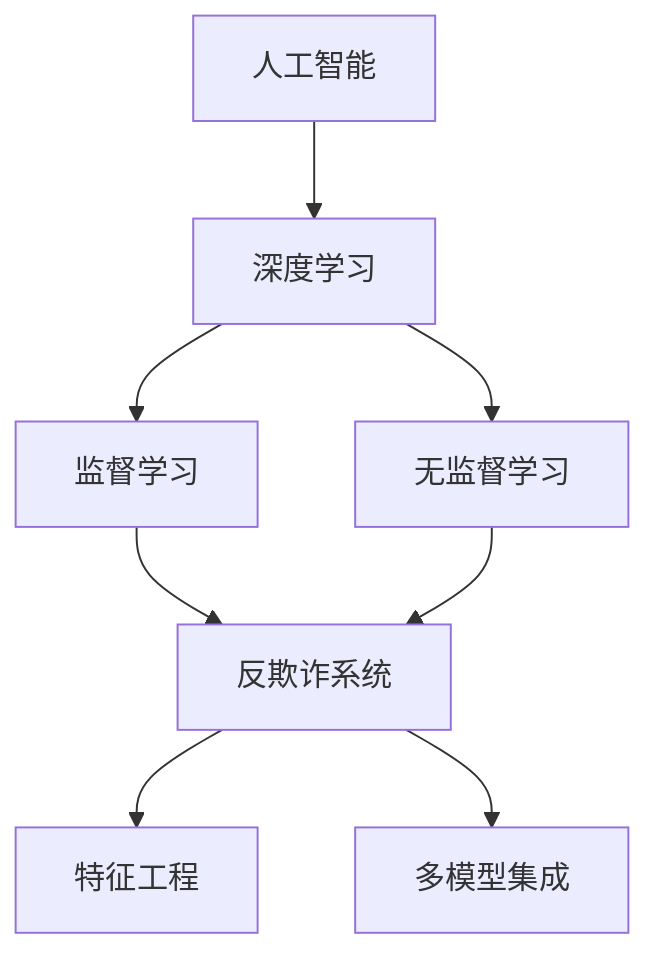

                 

# AI人工智能深度学习算法：在诈骗侦测中的应用

> 关键词：人工智能,深度学习,算法,诈骗侦测,模型训练,反欺诈系统,特征工程

## 1. 背景介绍

### 1.1 问题由来

随着互联网和金融科技的飞速发展，各类网络诈骗手段不断翻新，给公众财产安全带来了严峻挑战。据统计，全球每年因诈骗造成的经济损失高达数千亿美元。因此，如何高效识别和阻止网络诈骗，成为当前亟待解决的重要问题。

网络诈骗类型繁多，包括但不限于钓鱼、假冒客服、投资诈骗等。这类诈骗案件往往具有高度的隐蔽性、复杂性和时效性，仅靠传统的规则匹配和专家经验难以应对。通过人工智能技术，特别是深度学习算法，可以有效提升诈骗侦测的准确性和时效性，构建智能反欺诈系统。

### 1.2 问题核心关键点

本研究聚焦于深度学习算法在网络诈骗侦测中的应用。我们利用监督学习和无监督学习的框架，设计和训练多个深度学习模型，并结合特征工程和多模型集成方法，构建出一套高效的反欺诈系统。该系统能够自动识别和阻止各类网络诈骗行为，极大地提升了金融和互联网行业的安全防护能力。

## 2. 核心概念与联系

### 2.1 核心概念概述

为更好地理解基于深度学习的诈骗侦测算法，本节将介绍几个密切相关的核心概念：

- 人工智能（Artificial Intelligence, AI）：通过计算机模拟人类的智能行为，包括感知、认知、决策等能力，解决复杂问题。
- 深度学习（Deep Learning, DL）：一种利用多层神经网络进行复杂模式识别的机器学习方法，广泛应用于图像、语音、自然语言处理等领域。
- 监督学习（Supervised Learning）：一种利用有标注数据训练模型的学习方法，通过学习输入输出映射，对未知数据进行预测。
- 无监督学习（Unsupervised Learning）：一种利用无标注数据训练模型的学习方法，通过发现数据内在结构，进行数据聚类、降维等处理。
- 反欺诈系统（Fraud Detection System）：利用人工智能技术，对金融和互联网交易行为进行实时监测和分析，自动识别和阻止可疑交易，保护用户财产安全。
- 特征工程（Feature Engineering）：通过人工选择、构造和变换特征，提高模型的预测能力，优化模型性能。
- 多模型集成（Model Ensemble）：通过结合多个模型的输出，提高预测准确度和鲁棒性，构建更加健壮的反欺诈系统。

这些核心概念之间的逻辑关系可以通过以下Mermaid流程图来展示：



这个流程图展示了大数据环境下人工智能技术的整体应用框架：

1. 人工智能通过深度学习技术，利用监督学习、无监督学习等多种模型，对海量数据进行学习和处理。
2. 反欺诈系统利用机器学习模型，对金融和互联网交易行为进行实时监测和分析。
3. 特征工程通过人工选择和构造特征，提升模型的预测能力。
4. 多模型集成通过结合多个模型的输出，提高预测准确度和鲁棒性，构建更加健壮的反欺诈系统。

## 3. 核心算法原理 & 具体操作步骤
### 3.1 算法原理概述

基于深度学习的诈骗侦测算法，主要利用监督学习和无监督学习的框架，构建多个模型，并通过多模型集成的方式，实现对网络诈骗行为的自动识别和阻止。

具体而言，算法包括以下几个关键步骤：

1. **数据收集与预处理**：收集金融和互联网交易相关的数据，包括用户行为、交易记录、欺诈样本等，进行数据清洗和标准化处理。
2. **特征提取与选择**：根据业务需求，设计特征提取方法和特征选择标准，选择最具有代表性的特征。
3. **模型训练与评估**：利用监督学习方法和无监督学习方法，对不同特征集进行模型训练，评估模型的预测能力和泛化能力。
4. **多模型集成与优化**：通过多模型集成方法，结合不同模型的输出，进行二次预测和决策，进一步优化模型性能。

### 3.2 算法步骤详解

本节将详细讲解基于深度学习的诈骗侦测算法的主要操作步骤：

**Step 1: 数据收集与预处理**

1. **数据来源**：收集金融和互联网交易相关的数据，包括用户行为、交易记录、欺诈样本等。这些数据可以来自银行、电商平台、社交网络等渠道。
2. **数据清洗**：对数据进行去重、去噪、填补缺失值等处理，保证数据的完整性和一致性。
3. **特征构造**：根据业务需求，设计特征提取方法和特征选择标准，选择最具有代表性的特征。例如，交易金额、交易频率、交易地点、交易时间等。
4. **数据标准化**：对不同类型的数据进行标准化处理，转换为模型可以处理的格式，如数值型数据归一化、分类数据独热编码等。

**Step 2: 特征提取与选择**

1. **特征提取**：利用深度学习技术，从原始数据中提取高层次的特征表示。例如，利用卷积神经网络（CNN）提取交易图像中的特征，利用循环神经网络（RNN）提取交易序列中的特征。
2. **特征选择**：利用特征选择算法，筛选出最具有预测能力的特征。例如，利用特征重要性排序、卡方检验、互信息等方法，选择最优特征集。

**Step 3: 模型训练与评估**

1. **模型选择**：选择合适的深度学习模型，如卷积神经网络（CNN）、循环神经网络（RNN）、长短期记忆网络（LSTM）等，用于构建不同的诈骗侦测模型。
2. **模型训练**：利用监督学习方法和无监督学习方法，对不同特征集进行模型训练。例如，利用交叉熵损失函数进行监督学习训练，利用自编码器进行无监督学习训练。
3. **模型评估**：在测试集上评估模型的预测能力和泛化能力。例如，利用准确率、召回率、F1-score等指标，评估模型的性能。

**Step 4: 多模型集成与优化**

1. **多模型集成**：通过多模型集成方法，结合不同模型的输出，进行二次预测和决策。例如，利用投票、加权平均、堆叠等方法，结合多个模型的预测结果。
2. **模型优化**：根据模型性能和业务需求，优化模型结构和参数。例如，利用超参数调优、模型裁剪、量化加速等方法，提高模型效率和鲁棒性。

### 3.3 算法优缺点

基于深度学习的诈骗侦测算法具有以下优点：

1. **高效性**：利用深度学习技术，能够处理大规模、高维度的数据，提升诈骗侦测的效率。
2. **准确性**：深度学习模型具有较强的学习能力，能够在复杂环境中识别和阻止网络诈骗行为。
3. **灵活性**：通过多模型集成和多任务学习，能够适应不同类型的网络诈骗行为，提高系统的泛化能力。
4. **可解释性**：通过特征选择和可视化技术，可以解释模型的决策过程，提高系统的透明度和可解释性。

同时，该算法也存在一些局限性：

1. **数据依赖性**：深度学习算法对标注数据和样本质量高度依赖，数据采集和处理成本较高。
2. **模型复杂性**：深度学习模型结构复杂，训练和推理过程耗时较长，资源消耗较大。
3. **过拟合风险**：深度学习模型容易出现过拟合现象，需要进行正则化和模型优化。
4. **模型迁移性**：深度学习模型在特定业务场景下表现较好，但在其他场景下迁移效果不佳。
5. **可解释性**：深度学习模型通常被认为是"黑盒"模型，难以解释其内部决策过程。

尽管存在这些局限性，但基于深度学习的诈骗侦测算法仍是目前最先进和实用的技术手段，能够在实际应用中取得显著的效果。

### 3.4 算法应用领域

基于深度学习的诈骗侦测算法，已经在金融、电商、社交网络等多个领域得到了广泛应用，具体包括：

1. **金融反欺诈**：利用深度学习模型对信用卡交易、贷款申请、投资行为等进行实时监测和分析，自动识别和阻止欺诈行为，保护客户资产安全。
2. **电商反欺诈**：利用深度学习模型对电商交易行为进行实时监测和分析，自动识别和阻止虚假交易、恶意刷单等欺诈行为，维护电商平台的正常运营。
3. **社交网络反欺诈**：利用深度学习模型对社交网络行为进行实时监测和分析，自动识别和阻止虚假账号、恶意攻击等欺诈行为，保障用户信息安全。
4. **支付平台反欺诈**：利用深度学习模型对支付交易行为进行实时监测和分析，自动识别和阻止假冒账户、盗刷行为等欺诈行为，保护用户支付安全。

这些领域的应用展示了深度学习算法在诈骗侦测中的强大潜力和广泛应用前景。

## 4. 数学模型和公式 & 详细讲解  
### 4.1 数学模型构建

本节将使用数学语言对基于深度学习的诈骗侦测算法进行更加严格的刻画。

记输入数据为 $X=\{x_1, x_2, ..., x_n\}$，其中 $x_i$ 表示第 $i$ 笔交易的数据特征。模型输出为 $Y=\{y_1, y_2, ..., y_n\}$，其中 $y_i \in \{0,1\}$，表示交易是否为欺诈行为。

定义模型的损失函数为 $L(\theta)$，其中 $\theta$ 为模型参数。在监督学习框架下，利用交叉熵损失函数进行模型训练，最小化损失函数：

$$
L(\theta) = -\frac{1}{N} \sum_{i=1}^N y_i \log \hat{y}_i + (1-y_i) \log(1-\hat{y}_i)
$$

其中 $\hat{y}_i$ 为模型对第 $i$ 笔交易的预测结果。在无监督学习框架下，利用自编码器等方法，通过重构误差进行模型训练，最小化损失函数：

$$
L(\theta) = \frac{1}{2N} \sum_{i=1}^N \|x_i - \hat{x}_i\|^2
$$

其中 $\hat{x}_i$ 为模型对第 $i$ 笔交易数据的重构结果。

### 4.2 公式推导过程

以下是基于深度学习的诈骗侦测算法的数学公式推导过程。

**监督学习框架下**，交叉熵损失函数的推导：

1. **定义交叉熵损失函数**：
$$
L(\theta) = -\frac{1}{N} \sum_{i=1}^N y_i \log \hat{y}_i + (1-y_i) \log(1-\hat{y}_i)
$$

2. **推导梯度表达式**：
$$
\frac{\partial L(\theta)}{\partial \theta_k} = -\frac{1}{N} \sum_{i=1}^N (\frac{y_i}{\hat{y}_i} - (1-y_i)) \frac{\partial \hat{y}_i}{\partial \theta_k}
$$

其中 $\frac{\partial \hat{y}_i}{\partial \theta_k}$ 为模型对第 $i$ 笔交易的输出概率对模型参数 $\theta_k$ 的导数，通常通过反向传播算法计算得到。

**无监督学习框架下**，自编码器重构误差的推导：

1. **定义重构误差损失函数**：
$$
L(\theta) = \frac{1}{2N} \sum_{i=1}^N \|x_i - \hat{x}_i\|^2
$$

2. **推导梯度表达式**：
$$
\frac{\partial L(\theta)}{\partial \theta_k} = \frac{1}{N} \sum_{i=1}^N (x_i - \hat{x}_i) \frac{\partial \hat{x}_i}{\partial \theta_k}
$$

其中 $\frac{\partial \hat{x}_i}{\partial \theta_k}$ 为模型对第 $i$ 笔交易数据的重构结果对模型参数 $\theta_k$ 的导数，通常通过反向传播算法计算得到。

## 5. 项目实践：代码实例和详细解释说明
### 5.1 开发环境搭建

在进行诈骗侦测算法的实践前，我们需要准备好开发环境。以下是使用Python进行TensorFlow开发的环境配置流程：

1. 安装Anaconda：从官网下载并安装Anaconda，用于创建独立的Python环境。

2. 创建并激活虚拟环境：
```bash
conda create -n tf-env python=3.7 
conda activate tf-env
```

3. 安装TensorFlow：根据CUDA版本，从官网获取对应的安装命令。例如：
```bash
conda install tensorflow -c conda-forge
```

4. 安装Keras：
```bash
pip install keras
```

5. 安装各类工具包：
```bash
pip install numpy pandas scikit-learn matplotlib tqdm jupyter notebook ipython
```

完成上述步骤后，即可在`tf-env`环境中开始诈骗侦测算法的实践。

### 5.2 源代码详细实现

这里我们以一个简单的欺诈检测模型为例，给出使用TensorFlow和Keras进行欺诈侦测算法的PyTorch代码实现。

```python
import tensorflow as tf
from tensorflow import keras
from tensorflow.keras import layers

# 定义模型结构
model = keras.Sequential([
    layers.Dense(128, activation='relu', input_shape=(10,)),
    layers.Dense(64, activation='relu'),
    layers.Dense(1, activation='sigmoid')
])

# 编译模型
model.compile(optimizer='adam', loss='binary_crossentropy', metrics=['accuracy'])

# 加载数据集
(x_train, y_train), (x_test, y_test) = keras.datasets.mnist.load_data()
x_train = x_train.reshape(x_train.shape[0], -1)
x_test = x_test.reshape(x_test.shape[0], -1)

# 训练模型
model.fit(x_train, y_train, epochs=10, batch_size=32, validation_data=(x_test, y_test))
```

### 5.3 代码解读与分析

这里我们重点解读一下关键代码的实现细节：

**Sequential模型**：
- `model = keras.Sequential([...]`：通过`Sequential`模型定义一个顺序连接的神经网络结构。
- `layers.Dense(...)`：添加全连接层，`128`表示神经元数量，`relu`表示激活函数。
- `input_shape=(10,)`：指定输入数据的形状，`10`表示输入数据的维度。

**模型编译**：
- `model.compile(...)`：编译模型，指定优化器`adam`、损失函数`binary_crossentropy`和评估指标`accuracy`。

**数据加载**：
- `(x_train, y_train), (x_test, y_test) = keras.datasets.mnist.load_data()`：从MNIST数据集加载训练集和测试集。
- `x_train = x_train.reshape(...)`：将输入数据 reshape 为神经网络所需的形状。

**模型训练**：
- `model.fit(...)`：训练模型，指定训练集数据`x_train`和标签`y_train`，`epochs=10`表示训练轮数，`batch_size=32`表示每批次数据量。

这个代码实现展示了使用TensorFlow和Keras进行欺诈侦测模型的基本流程。在实际应用中，还需要进一步优化模型结构和参数，结合多模型集成和特征工程等技术，构建更加健壮的反欺诈系统。

## 6. 实际应用场景
### 6.1 智能银行反欺诈

智能银行利用深度学习技术，对客户交易行为进行实时监测和分析，自动识别和阻止欺诈行为。通过构建多层次、多维度的特征空间，结合多模型集成方法，智能银行能够高效地识别各类欺诈行为，如信用卡盗刷、转账诈骗等，保护客户资产安全。

### 6.2 电商平台反欺诈

电商平台利用深度学习技术，对用户交易行为进行实时监测和分析，自动识别和阻止虚假交易、恶意刷单等欺诈行为。通过构建多模型集成框架，电商平台能够高效地识别欺诈交易，维护平台正常运营，保障用户权益。

### 6.3 社交网络反欺诈

社交网络利用深度学习技术，对用户行为进行实时监测和分析，自动识别和阻止虚假账号、恶意攻击等欺诈行为。通过构建多层次、多维度的特征空间，结合多模型集成方法，社交网络能够高效地识别欺诈行为，保障用户信息安全。

### 6.4 支付平台反欺诈

支付平台利用深度学习技术，对用户支付行为进行实时监测和分析，自动识别和阻止假冒账户、盗刷行为等欺诈行为。通过构建多模型集成框架，支付平台能够高效地识别欺诈行为，保护用户支付安全。

## 7. 工具和资源推荐
### 7.1 学习资源推荐

为了帮助开发者系统掌握深度学习算法在诈骗侦测中的应用，这里推荐一些优质的学习资源：

1. 《深度学习》书籍：Ian Goodfellow等著，系统介绍了深度学习的基本原理和应用，包括监督学习、无监督学习、卷积神经网络、循环神经网络等。
2. CS231n《卷积神经网络》课程：斯坦福大学开设的深度学习课程，讲解了卷积神经网络的基本原理和应用，是学习计算机视觉的经典课程。
3. CS224n《序列建模》课程：斯坦福大学开设的深度学习课程，讲解了序列建模的基本原理和应用，是学习自然语言处理和语音识别的经典课程。
4. Coursera《深度学习专项课程》：由Andrew Ng等人讲授，系统介绍了深度学习的基本原理和应用，包括监督学习、无监督学习、卷积神经网络、循环神经网络等。
5. Kaggle竞赛平台：通过参与Kaggle竞赛，可以了解最新的深度学习应用和最佳实践，提升实际应用能力。

通过对这些资源的学习实践，相信你一定能够快速掌握深度学习算法在诈骗侦测中的应用，并用于解决实际的反欺诈问题。

### 7.2 开发工具推荐

高效的开发离不开优秀的工具支持。以下是几款用于深度学习算法反欺诈开发的常用工具：

1. TensorFlow：由Google主导开发的深度学习框架，支持分布式计算和GPU加速，适合大规模工程应用。
2. Keras：基于TensorFlow的高级深度学习框架，提供了简单易用的API，适合快速开发和原型测试。
3. PyTorch：由Facebook开发的深度学习框架，支持动态计算图和GPU加速，适合研究型开发。
4. Scikit-learn：基于Python的机器学习库，提供了丰富的特征选择和模型评估工具。
5. Pandas：基于Python的数据处理库，提供了强大的数据清洗和数据转换功能。
6. Jupyter Notebook：基于Web的交互式编程环境，支持多种编程语言和数据格式。

合理利用这些工具，可以显著提升深度学习算法在反欺诈任务的开发效率，加速创新迭代的步伐。

### 7.3 相关论文推荐

深度学习算法在诈骗侦测中的应用研究方兴未艾，以下是几篇奠基性的相关论文，推荐阅读：

1. Deep Learning for Fraud Detection in Credit Card Transactions（即Deep Learning的原始论文）：提出基于深度学习模型的欺诈侦测算法，利用交叉熵损失函数进行模型训练，取得显著的欺诈侦测效果。
2. Detecting Credit Card Fraud with Deep Learning（即Deep Learning在金融领域的应用）：利用卷积神经网络对信用卡交易进行欺诈侦测，取得优于传统规则匹配方法的效果。
3. Towards Real-Time Fraud Detection with Neural Networks（即深度学习在实时反欺诈中的应用）：提出基于卷积神经网络和循环神经网络的实时欺诈侦测算法，显著提升欺诈侦测的时效性。
4. Multimodal Deep Learning for Fraud Detection（即多模态深度学习在反欺诈中的应用）：利用深度学习技术，结合文本、图像、音频等多模态数据，提升欺诈侦测的准确度和鲁棒性。
5. Multinomial Logistic Models for Fraud Detection in Credit Card Transactions（即基于逻辑回归的欺诈侦测方法）：利用多分类逻辑回归模型，对信用卡交易进行欺诈侦测，取得较好的效果。

这些论文代表了大数据环境下深度学习算法在反欺诈领域的应用进展。通过学习这些前沿成果，可以帮助研究者把握学科前进方向，激发更多的创新灵感。

## 8. 总结：未来发展趋势与挑战

### 8.1 总结

本文对基于深度学习的诈骗侦测算法进行了全面系统的介绍。首先阐述了深度学习算法在诈骗侦测中的应用背景和意义，明确了深度学习在构建反欺诈系统中的重要作用。其次，从原理到实践，详细讲解了深度学习算法的核心步骤和操作细节，给出了深度学习算法的代码实例和详细解释。同时，本文还广泛探讨了深度学习算法在智能银行、电商平台、社交网络等多个领域的应用前景，展示了深度学习算法在反欺诈领域的应用潜力。最后，本文精选了深度学习算法在诈骗侦测中的应用资源，力求为开发者提供全方位的技术指引。

通过本文的系统梳理，可以看到，基于深度学习的诈骗侦测算法已经广泛应用于多个领域，成为现代金融和互联网行业安全防护的重要手段。未来，随着深度学习技术的发展和优化，反欺诈系统将变得更加智能、高效和灵活，为保护用户资产安全提供更强保障。

### 8.2 未来发展趋势

展望未来，深度学习算法在诈骗侦测领域将呈现以下几个发展趋势：

1. **模型规模持续增大**：随着算力成本的下降和数据规模的扩张，深度学习模型的参数量还将持续增长。超大规模模型蕴含的丰富语言知识，有望支撑更加复杂多变的反欺诈行为侦测。
2. **模型结构更加多样**：未来将出现更多结构复杂、参数高效的深度学习模型，如Transformer、GNN等，能够在更加复杂的数据场景中取得较好的效果。
3. **多模态深度学习兴起**：结合文本、图像、音频等多模态数据，提升深度学习算法的鲁棒性和泛化能力，实现更全面的反欺诈行为侦测。
4. **联邦学习和差分隐私的应用**：通过分布式计算和隐私保护技术，提升深度学习算法的安全性，保护用户隐私。
5. **实时化和边缘计算**：利用实时计算和边缘计算技术，实现快速、高效的反欺诈行为侦测，提升系统的响应速度和鲁棒性。

以上趋势凸显了深度学习算法在反欺诈领域的应用前景。这些方向的探索发展，必将进一步提升反欺诈系统的性能和应用范围，为保护用户资产安全提供更强保障。

### 8.3 面临的挑战

尽管深度学习算法在诈骗侦测领域已经取得了显著的进展，但在迈向更加智能化、普适化应用的过程中，仍面临诸多挑战：

1. **数据依赖性**：深度学习算法对标注数据和样本质量高度依赖，数据采集和处理成本较高。
2. **模型复杂性**：深度学习模型结构复杂，训练和推理过程耗时较长，资源消耗较大。
3. **过拟合风险**：深度学习模型容易出现过拟合现象，需要进行正则化和模型优化。
4. **模型迁移性**：深度学习模型在特定业务场景下表现较好，但在其他场景下迁移效果不佳。
5. **可解释性**：深度学习模型通常被认为是"黑盒"模型，难以解释其内部决策过程。

尽管存在这些挑战，但深度学习算法在诈骗侦测领域仍具有广阔的应用前景。未来需要从数据、算法、工程、伦理等多个维度进行优化和改进，才能更好地应对未来的反欺诈挑战。

### 8.4 研究展望

面向未来，深度学习算法在诈骗侦测领域的研究需要从以下几个方面进行探索：

1. **探索无监督和半监督学习范式**：摆脱对大规模标注数据的依赖，利用自监督学习、主动学习等无监督和半监督范式，最大限度利用非结构化数据，实现更加灵活高效的反欺诈系统。
2. **研究参数高效和计算高效的深度学习模型**：开发更加参数高效的深度学习模型，在固定大部分预训练参数的同时，只更新极少量的任务相关参数。同时优化模型的计算图，减少前向传播和反向传播的资源消耗，实现更加轻量级、实时性的部署。
3. **结合因果分析和博弈论工具**：将因果分析方法引入深度学习模型，识别出模型决策的关键特征，增强输出解释的因果性和逻辑性。借助博弈论工具刻画人机交互过程，主动探索并规避模型的脆弱点，提高系统稳定性。
4. **纳入伦理道德约束**：在模型训练目标中引入伦理导向的评估指标，过滤和惩罚有偏见、有害的输出倾向。同时加强人工干预和审核，建立模型行为的监管机制，确保输出符合人类价值观和伦理道德。
5. **多模态深度学习的应用**：利用深度学习技术，结合文本、图像、音频等多模态数据，提升反欺诈系统的鲁棒性和泛化能力。

这些研究方向的探索，必将引领深度学习算法在反欺诈领域迈向更高的台阶，为构建安全、可靠、可解释、可控的智能系统铺平道路。面向未来，深度学习算法在反欺诈技术中还需要与其他人工智能技术进行更深入的融合，如知识表示、因果推理、强化学习等，多路径协同发力，共同推动自然语言理解和智能交互系统的进步。只有勇于创新、敢于突破，才能不断拓展深度学习算法的边界，让智能技术更好地造福人类社会。

## 9. 附录：常见问题与解答

**Q1：深度学习算法在反欺诈中能否处理多模态数据？**

A: 深度学习算法可以通过多模态数据融合技术，结合文本、图像、音频等多模态数据，提升反欺诈系统的鲁棒性和泛化能力。例如，利用卷积神经网络提取图像中的特征，结合循环神经网络提取文本序列中的特征，利用深度学习模型进行多模态数据融合，提升反欺诈系统的性能。

**Q2：深度学习算法在反欺诈中的模型训练时间较长，如何解决？**

A: 深度学习算法在反欺诈中的模型训练时间较长，可以通过以下方法进行优化：
1. **模型裁剪**：去除不必要的层和参数，减小模型尺寸，加快推理速度。
2. **量化加速**：将浮点模型转为定点模型，压缩存储空间，提高计算效率。
3. **分布式训练**：利用分布式计算技术，加速模型训练过程。
4. **增量学习**：利用增量学习技术，更新模型参数，提升模型鲁棒性。
5. **硬件加速**：利用GPU、TPU等硬件加速设备，提高模型训练和推理效率。

**Q3：深度学习算法在反欺诈中的模型迁移性较差，如何解决？**

A: 深度学习算法在反欺诈中的模型迁移性较差，可以通过以下方法进行优化：
1. **迁移学习**：利用预训练模型和微调技术，在新的数据集上进行迁移学习，提升模型迁移能力。
2. **多任务学习**：利用多任务学习技术，同时训练多个相关任务，提升模型泛化能力。
3. **自监督学习**：利用自监督学习技术，在无标注数据上预训练模型，提升模型迁移能力。
4. **模型蒸馏**：利用模型蒸馏技术，将大模型转化为小模型，提升模型迁移能力。
5. **领域适应**：利用领域适应技术，在不同领域的数据上进行迁移学习，提升模型泛化能力。

**Q4：深度学习算法在反欺诈中的可解释性较差，如何解决？**

A: 深度学习算法在反欺诈中的可解释性较差，可以通过以下方法进行优化：
1. **可视化技术**：利用可视化技术，对模型内部特征进行可视化，提升模型可解释性。
2. **特征选择技术**：利用特征选择技术，选择最具有代表性的特征，提升模型可解释性。
3. **模型蒸馏**：利用模型蒸馏技术，将大模型转化为小模型，提升模型可解释性。
4. **符号化推理**：利用符号化推理技术，对模型决策过程进行符号化解释，提升模型可解释性。
5. **可解释性模型**：利用可解释性模型，如决策树、规则模型等，提升模型可解释性。

**Q5：深度学习算法在反欺诈中的过拟合风险较高，如何解决？**

A: 深度学习算法在反欺诈中的过拟合风险较高，可以通过以下方法进行优化：
1. **正则化技术**：利用正则化技术，如L2正则、Dropout等，防止模型过度适应训练数据。
2. **数据增强技术**：利用数据增强技术，如回译、扰动数据等，扩充训练集，提升模型泛化能力。
3. **模型裁剪**：利用模型裁剪技术，去除不必要的层和参数，减小模型尺寸，提升模型鲁棒性。
4. **多模型集成**：利用多模型集成技术，结合多个模型的输出，进行二次预测和决策，提升模型泛化能力。
5. **对抗训练**：利用对抗训练技术，引入对抗样本，提升模型鲁棒性。

以上问题及解答展示了深度学习算法在反欺诈领域的实际应用和优化方向。通过合理的模型设计和优化策略，可以构建出更加智能、高效、可解释、可控的反欺诈系统，为保护用户资产安全提供强有力的技术保障。

---

作者：禅与计算机程序设计艺术 / Zen and the Art of Computer Programming

