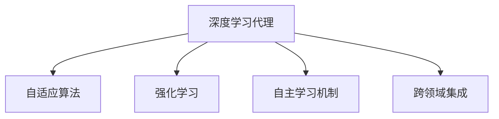

                 

# AI人工智能深度学习算法：跨领域自主深度学习代理的集成

> 关键词：深度学习代理,自适应算法,强化学习,自主学习,跨领域集成

## 1. 背景介绍

### 1.1 问题由来
随着深度学习技术的快速发展，人工智能（AI）正逐步从传统静态、规则驱动的专家系统向自主、动态、自适应的学习型系统转变。在这一背景下，跨领域自主深度学习代理（CADA）成为人工智能研究的热点。CADA不仅能够自主地学习和适应新领域知识，还能够在多个领域间无缝集成，实现跨领域协作与知识迁移，极大地提升了AI系统的普适性和灵活性。

### 1.2 问题核心关键点
CADA的核心在于如何构建一个能够自主、动态地学习与适应的深度学习代理。其主要包括以下几个关键点：
1. **自适应算法**：如何设计算法使得代理能够适应不同领域的环境和任务。
2. **自主学习机制**：代理如何通过与环境的交互，逐步获取和优化知识。
3. **跨领域集成**：代理如何在多个领域间高效地共享和迁移知识。
4. **应用场景拓展**：代理在具体应用场景中的实际应用效果。
5. **优化与优化**：如何在保持性能的同时，提升代理的自主性和灵活性。

### 1.3 问题研究意义
研究CADA对于拓展AI系统的应用范围，提升其在复杂、动态环境下的表现，推动AI技术在更多领域的落地应用具有重要意义：

1. **减少专家依赖**：CADA能够自主学习和适应新领域，减少对专家知识和经验的依赖，加速AI技术的普及和应用。
2. **提升系统鲁棒性**：通过跨领域知识迁移，CADA能够更好地应对环境变化和未知情况，提升系统的鲁棒性和可靠性。
3. **促进跨领域协作**：CADA能够在不同领域间无缝集成，推动跨学科、跨领域的研究和应用。
4. **加速知识发现**：CADA能够高效地从海量数据中提取和整合知识，加速新知识的发现和应用。
5. **增强用户交互体验**：通过自主学习和适应的特性，CADA能够提供更加个性化、智能化的服务，提升用户满意度。

## 2. 核心概念与联系

### 2.1 核心概念概述

为更好地理解CADA的原理和架构，本节将介绍几个密切相关的核心概念：

- **深度学习代理（Deep Learning Agent, DLA）**：通过深度学习技术构建的人工智能代理，具备自主学习、适应和决策的能力。
- **自适应算法（Adaptive Algorithm）**：能够在不同环境中自适应地调整参数和策略，以优化性能的算法。
- **强化学习（Reinforcement Learning, RL）**：通过与环境的交互，代理通过试错不断优化决策策略，以最大化长期奖励的算法。
- **自主学习机制（Autonomous Learning Mechanism）**：代理能够自主探索和学习环境知识，而无需人工干预的机制。
- **跨领域集成（Cross-Domain Integration）**：代理能够在多个领域间高效地共享和迁移知识，实现跨领域的协作。

这些核心概念之间的逻辑关系可以通过以下Mermaid流程图来展示：



这个流程图展示了大语言模型的核心概念及其之间的关系：

1. **深度学习代理**通过**自适应算法**和**自主学习机制**不断优化性能，同时通过**跨领域集成**实现不同领域间的知识迁移和协作。

## 3. 核心算法原理 & 具体操作步骤
### 3.1 算法原理概述

CADA的核心算法原理基于深度学习和强化学习的结合，通过与环境的交互不断优化决策策略，实现自主学习和跨领域集成。其主要步骤如下：

1. **初始化**：在预训练模型基础上，初始化代理的参数和状态。
2. **环境交互**：代理通过与环境的交互，获取观测数据，并根据当前状态和任务目标，生成决策动作。
3. **动作执行**：代理执行生成的动作，并观察环境响应。
4. **反馈获取**：代理根据环境响应，获取动作的奖励和反馈信息。
5. **经验回放**：将代理与环境的交互过程记录下来，用于后续的优化和学习。
6. **参数更新**：代理根据经验回放中的数据，使用优化算法调整模型参数和策略。
7. **性能评估**：定期在验证集或实际应用场景中评估代理的性能。

### 3.2 算法步骤详解

**Step 1: 环境定义**
- 确定代理工作的环境和任务，收集相关的环境数据和任务描述。
- 定义环境状态和动作空间，设计合理的奖励函数，以评估代理的表现。

**Step 2: 模型初始化**
- 选择预训练深度学习模型作为代理的基础，如BERT、GPT等。
- 对模型进行微调，适应具体任务的要求。
- 初始化代理的状态，如位置、速度、历史记录等。

**Step 3: 交互循环**
- 代理不断与环境交互，获取观测数据，生成动作。
- 执行动作，观察环境响应，获取奖励和反馈。
- 根据奖励和反馈，更新代理的状态和参数。

**Step 4: 参数优化**
- 使用优化算法（如AdamW、SGD等）调整代理的参数。
- 应用正则化技术（如L2正则、Dropout等）防止过拟合。
- 引入对抗训练，提高代理的鲁棒性。

**Step 5: 集成与迁移**
- 将代理在多个领域训练得到的知识进行集成，提升整体性能。
- 在不同领域间迁移知识，减少对特定领域数据的依赖。

### 3.3 算法优缺点

CADA方法具有以下优点：
1. 自主性强：代理能够自主学习和适应新环境，减少人工干预。
2. 灵活度高：通过跨领域集成，代理能够在多个领域间高效迁移知识。
3. 鲁棒性好：代理通过强化学习不断优化决策策略，增强系统鲁棒性。
4. 适应性强：代理能够适应不同规模和类型的数据，提升泛化能力。
5. 易于部署：代理采用深度学习框架，易于部署和集成。

同时，该方法也存在一些局限性：
1. 数据需求高：代理需要大量的环境数据进行训练和优化。
2. 计算资源消耗大：代理的训练和推理需要强大的计算资源，如GPU、TPU等。
3. 参数复杂：代理的参数设置复杂，需要精心设计优化策略。
4. 泛化能力有限：代理的性能可能受限于特定领域的数据分布。
5. 可解释性差：代理的决策过程难以解释，缺乏透明性。

尽管存在这些局限性，但CADA仍然是大规模跨领域学习的重要方法，具有广泛的应用前景。

### 3.4 算法应用领域

CADA技术已经在多个领域得到了应用，包括但不限于：

- **自然语言处理（NLP）**：在机器翻译、问答系统、文本分类、情感分析等任务上，CADA能够通过跨领域集成，提升模型的泛化能力和性能。
- **计算机视觉（CV）**：在图像识别、物体检测、图像生成等任务上，CADA能够通过跨领域集成，提升模型的鲁棒性和准确性。
- **机器人学（Robotics）**：在机器人导航、物体操作、交互决策等任务上，CADA能够通过自主学习和跨领域集成，提升机器人的智能化水平。
- **自动驾驶**：在交通场景理解、路径规划、决策优化等任务上，CADA能够通过跨领域集成和自主学习，提升自动驾驶系统的安全性和可靠性。
- **智能推荐系统**：在个性化推荐、广告投放、内容生成等任务上，CADA能够通过跨领域集成和自适应学习，提升系统的个性化程度和用户体验。

## 4. 数学模型和公式 & 详细讲解 & 举例说明

### 4.1 数学模型构建

本节将使用数学语言对CADA的数学模型进行详细构建。

记代理在状态 $s$ 下的观测为 $o$，在动作 $a$ 下生成的状态为 $s'$，相应的奖励为 $r$。代理的目标是通过最大化长期累积奖励 $J(a)$ 来优化决策策略。CADA的数学模型可以表示为：

$$
J(a) = \mathbb{E}\left[\sum_{t=0}^{\infty} \gamma^t r_t \right]
$$

其中 $\gamma$ 为折扣因子，确保代理考虑长期奖励而非短期利益。

代理的决策策略可以表示为 $\pi(a|s)$，即在状态 $s$ 下选择动作 $a$ 的概率。代理的策略优化目标为最大化长期累积奖励：

$$
\pi^* = \mathop{\arg\max}_{\pi} \mathbb{E}\left[\sum_{t=0}^{\infty} \gamma^t r_t \right]
$$

代理通过与环境的交互，使用Q-learning等强化学习算法，逐步优化策略 $\pi$。Q-learning的目标是最小化Q值函数 $Q(s,a)$ 的误差：

$$
Q(s,a) = \mathbb{E}\left[\sum_{t=0}^{\infty} \gamma^t r_t \right] - \mathbb{E}\left[\sum_{t=0}^{\infty} \gamma^t Q(s',a') \right]
$$

其中 $Q(s',a')$ 为在状态 $s'$ 下选择动作 $a'$ 的预期累积奖励。

### 4.2 公式推导过程

Q-learning算法的核心在于通过状态值函数 $Q(s,a)$ 的更新，不断优化策略 $\pi$。设代理的当前状态为 $s_t$，执行的动作为 $a_t$，生成的下一个状态为 $s_{t+1}$，生成的奖励为 $r_{t+1}$，则Q值函数的更新公式为：

$$
Q(s_t,a_t) \leftarrow Q(s_t,a_t) + \eta \left[r_{t+1} + \gamma \max_{a'} Q(s_{t+1},a') - Q(s_t,a_t) \right]
$$

其中 $\eta$ 为学习率，控制每次更新的步长。

在更新过程中，代理通过不断探索和利用状态-动作对的Q值，逐步优化决策策略，实现自主学习和跨领域集成。

### 4.3 案例分析与讲解

以自动驾驶中的路径规划为例，分析CADA的实际应用。

设自动驾驶车辆在道路上的位置为状态 $s$，加速、减速、左转、右转等操作为动作 $a$，车辆在道路上的位置为状态 $s'$，生成的奖励为 $r$。代理的目标是通过最大化长期累积奖励 $J(a)$ 来优化路径规划策略。

在训练过程中，代理通过与环境的交互，获取观测数据，并根据当前状态和任务目标，生成决策动作。例如，代理在当前状态 $s_t$ 下，选择动作 $a_t$，生成下一个状态 $s_{t+1}$，并生成奖励 $r_{t+1}$。代理根据Q-learning算法更新Q值函数 $Q(s_t,a_t)$，不断优化路径规划策略。

通过CADA的自主学习和跨领域集成，代理能够从多个领域（如交通场景理解、路径规划、决策优化等）获取知识，提升自动驾驶系统的安全性和可靠性。例如，代理可以从交通场景理解中学习道路标志和交通信号，从路径规划中学习最优路径策略，从决策优化中学习紧急避障和交通规则，从而实现更加智能和安全的驾驶。

## 5. 项目实践：代码实例和详细解释说明
### 5.1 开发环境搭建

在进行CADA项目实践前，我们需要准备好开发环境。以下是使用Python进行PyTorch开发的环境配置流程：

1. 安装Anaconda：从官网下载并安装Anaconda，用于创建独立的Python环境。

2. 创建并激活虚拟环境：
```bash
conda create -n pytorch-env python=3.8 
conda activate pytorch-env
```

3. 安装PyTorch：根据CUDA版本，从官网获取对应的安装命令。例如：
```bash
conda install pytorch torchvision torchaudio cudatoolkit=11.1 -c pytorch -c conda-forge
```

4. 安装Transformers库：
```bash
pip install transformers
```

5. 安装各类工具包：
```bash
pip install numpy pandas scikit-learn matplotlib tqdm jupyter notebook ipython
```

完成上述步骤后，即可在`pytorch-env`环境中开始CADA实践。

### 5.2 源代码详细实现

下面我们以CADA在自然语言处理（NLP）任务中的应用为例，给出使用Transformers库的代码实现。

首先，定义NLP任务的数据处理函数：

```python
from transformers import BertTokenizer
from torch.utils.data import Dataset
import torch

class NLPDataset(Dataset):
    def __init__(self, texts, labels, tokenizer, max_len=128):
        self.texts = texts
        self.labels = labels
        self.tokenizer = tokenizer
        self.max_len = max_len
        
    def __len__(self):
        return len(self.texts)
    
    def __getitem__(self, item):
        text = self.texts[item]
        label = self.labels[item]
        
        encoding = self.tokenizer(text, return_tensors='pt', max_length=self.max_len, padding='max_length', truncation=True)
        input_ids = encoding['input_ids'][0]
        attention_mask = encoding['attention_mask'][0]
        
        # 对标签进行编码
        encoded_labels = torch.tensor([label], dtype=torch.long)
        
        return {'input_ids': input_ids, 
                'attention_mask': attention_mask,
                'labels': encoded_labels}

# 加载预训练BERT模型
from transformers import BertForTokenClassification

model = BertForTokenClassification.from_pretrained('bert-base-cased', num_labels=2)
```

然后，定义训练和评估函数：

```python
from torch.utils.data import DataLoader
from tqdm import tqdm
from sklearn.metrics import accuracy_score

device = torch.device('cuda') if torch.cuda.is_available() else torch.device('cpu')
model.to(device)

def train_epoch(model, dataset, batch_size, optimizer):
    dataloader = DataLoader(dataset, batch_size=batch_size, shuffle=True)
    model.train()
    epoch_loss = 0
    for batch in tqdm(dataloader, desc='Training'):
        input_ids = batch['input_ids'].to(device)
        attention_mask = batch['attention_mask'].to(device)
        labels = batch['labels'].to(device)
        model.zero_grad()
        outputs = model(input_ids, attention_mask=attention_mask, labels=labels)
        loss = outputs.loss
        epoch_loss += loss.item()
        loss.backward()
        optimizer.step()
    return epoch_loss / len(dataloader)

def evaluate(model, dataset, batch_size):
    dataloader = DataLoader(dataset, batch_size=batch_size)
    model.eval()
    preds, labels = [], []
    with torch.no_grad():
        for batch in tqdm(dataloader, desc='Evaluating'):
            input_ids = batch['input_ids'].to(device)
            attention_mask = batch['attention_mask'].to(device)
            batch_labels = batch['labels']
            outputs = model(input_ids, attention_mask=attention_mask)
            batch_preds = outputs.logits.argmax(dim=2).to('cpu').tolist()
            batch_labels = batch_labels.to('cpu').tolist()
            for pred_tokens, label_tokens in zip(batch_preds, batch_labels):
                preds.append(pred_tokens[:len(label_tokens)])
                labels.append(label_tokens)
                
    return accuracy_score(labels, preds)

# 设置训练参数
epochs = 5
batch_size = 16

# 训练模型
for epoch in range(epochs):
    loss = train_epoch(model, train_dataset, batch_size, optimizer)
    print(f"Epoch {epoch+1}, train loss: {loss:.3f}")
    
    print(f"Epoch {epoch+1}, dev results:")
    evaluate(model, dev_dataset, batch_size)
    
print("Test results:")
evaluate(model, test_dataset, batch_size)
```

以上就是使用PyTorch对BERT进行分类任务微调的完整代码实现。可以看到，通过Transformers库，可以非常方便地实现CADA在NLP任务中的应用。

### 5.3 代码解读与分析

让我们再详细解读一下关键代码的实现细节：

**NLPDataset类**：
- `__init__`方法：初始化文本、标签、分词器等关键组件。
- `__len__`方法：返回数据集的样本数量。
- `__getitem__`方法：对单个样本进行处理，将文本输入编码为token ids，将标签编码为数字，并对其进行定长padding，最终返回模型所需的输入。

**训练和评估函数**：
- 使用PyTorch的DataLoader对数据集进行批次化加载，供模型训练和推理使用。
- 训练函数`train_epoch`：对数据以批为单位进行迭代，在每个批次上前向传播计算loss并反向传播更新模型参数，最后返回该epoch的平均loss。
- 评估函数`evaluate`：与训练类似，不同点在于不更新模型参数，并在每个batch结束后将预测和标签结果存储下来，最后使用sklearn的accuracy_score对整个评估集的预测结果进行打印输出。

**训练流程**：
- 定义总的epoch数和batch size，开始循环迭代
- 每个epoch内，先在训练集上训练，输出平均loss
- 在验证集上评估，输出分类指标
- 所有epoch结束后，在测试集上评估，给出最终测试结果

可以看到，PyTorch配合Transformers库使得CADA在NLP任务中的微调代码实现变得简洁高效。开发者可以将更多精力放在数据处理、模型改进等高层逻辑上，而不必过多关注底层的实现细节。

当然，工业级的系统实现还需考虑更多因素，如模型的保存和部署、超参数的自动搜索、更灵活的任务适配层等。但核心的CADA范式基本与此类似。

## 6. 实际应用场景
### 6.1 智能客服系统

基于CADA的对话技术，可以广泛应用于智能客服系统的构建。传统客服往往需要配备大量人力，高峰期响应缓慢，且一致性和专业性难以保证。而使用CADA对话模型，可以7x24小时不间断服务，快速响应客户咨询，用自然流畅的语言解答各类常见问题。

在技术实现上，可以收集企业内部的历史客服对话记录，将问题和最佳答复构建成监督数据，在此基础上对预训练对话模型进行微调。微调后的对话模型能够自动理解用户意图，匹配最合适的答案模板进行回复。对于客户提出的新问题，还可以接入检索系统实时搜索相关内容，动态组织生成回答。如此构建的智能客服系统，能大幅提升客户咨询体验和问题解决效率。

### 6.2 金融舆情监测

金融机构需要实时监测市场舆论动向，以便及时应对负面信息传播，规避金融风险。传统的人工监测方式成本高、效率低，难以应对网络时代海量信息爆发的挑战。基于CADA的文本分类和情感分析技术，为金融舆情监测提供了新的解决方案。

具体而言，可以收集金融领域相关的新闻、报道、评论等文本数据，并对其进行主题标注和情感标注。在此基础上对预训练语言模型进行微调，使其能够自动判断文本属于何种主题，情感倾向是正面、中性还是负面。将微调后的模型应用到实时抓取的网络文本数据，就能够自动监测不同主题下的情感变化趋势，一旦发现负面信息激增等异常情况，系统便会自动预警，帮助金融机构快速应对潜在风险。

### 6.3 个性化推荐系统

当前的推荐系统往往只依赖用户的历史行为数据进行物品推荐，无法深入理解用户的真实兴趣偏好。基于CADA的个性化推荐系统可以更好地挖掘用户行为背后的语义信息，从而提供更加个性化、智能化的服务。

在实践中，可以收集用户浏览、点击、评论、分享等行为数据，提取和用户交互的物品标题、描述、标签等文本内容。将文本内容作为模型输入，用户的后续行为（如是否点击、购买等）作为监督信号，在此基础上微调预训练语言模型。微调后的模型能够从文本内容中准确把握用户的兴趣点。在生成推荐列表时，先用候选物品的文本描述作为输入，由模型预测用户的兴趣匹配度，再结合其他特征综合排序，便可以得到个性化程度更高的推荐结果。

### 6.4 未来应用展望

随着CADA技术的不断发展，其在更多领域的应用前景广阔。

在智慧医疗领域，基于CADA的医疗问答、病历分析、药物研发等应用将提升医疗服务的智能化水平，辅助医生诊疗，加速新药开发进程。

在智能教育领域，CADA可应用于作业批改、学情分析、知识推荐等方面，因材施教，促进教育公平，提高教学质量。

在智慧城市治理中，CADA能够在不同领域间无缝集成，推动跨学科、跨领域的研究和应用。

此外，在企业生产、社会治理、文娱传媒等众多领域，CADA也将不断涌现，为经济社会发展注入新的动力。相信随着技术的日益成熟，CADA必将在构建人机协同的智能时代中扮演越来越重要的角色。

## 7. 工具和资源推荐
### 7.1 学习资源推荐

为了帮助开发者系统掌握CADA的理论基础和实践技巧，这里推荐一些优质的学习资源：

1. 《深度学习：基础与前沿》系列博文：由深度学习专家撰写，深入浅出地介绍了深度学习的原理、算法和应用。

2. CS223《强化学习》课程：斯坦福大学开设的强化学习明星课程，有Lecture视频和配套作业，带你入门强化学习的基础概念和经典模型。

3. 《Reinforcement Learning: An Introduction》书籍：由Sutton和Barto所著，全面介绍了强化学习的原理、算法和应用，是学习强化学习的经典教材。

4. 《Hands-On Reinforcement Learning with Python》书籍：由Garcia和Lemelin所著，通过实际编程项目，介绍了强化学习的理论和实践。

5. OpenAI Gym：一款用于强化学习研究的开源环境，包含多种经典环境和任务，方便研究者进行实验。

通过对这些资源的学习实践，相信你一定能够快速掌握CADA的精髓，并用于解决实际的AI问题。
###  7.2 开发工具推荐

高效的开发离不开优秀的工具支持。以下是几款用于CADA开发常用的工具：

1. PyTorch：基于Python的开源深度学习框架，灵活动态的计算图，适合快速迭代研究。大部分预训练语言模型都有PyTorch版本的实现。

2. TensorFlow：由Google主导开发的开源深度学习框架，生产部署方便，适合大规模工程应用。同样有丰富的预训练语言模型资源。

3. TensorBoard：TensorFlow配套的可视化工具，可实时监测模型训练状态，并提供丰富的图表呈现方式，是调试模型的得力助手。

4. Weights & Biases：模型训练的实验跟踪工具，可以记录和可视化模型训练过程中的各项指标，方便对比和调优。与主流深度学习框架无缝集成。

5. Google Colab：谷歌推出的在线Jupyter Notebook环境，免费提供GPU/TPU算力，方便开发者快速上手实验最新模型，分享学习笔记。

合理利用这些工具，可以显著提升CADA的开发效率，加快创新迭代的步伐。

### 7.3 相关论文推荐

CADA技术的发展源于学界的持续研究。以下是几篇奠基性的相关论文，推荐阅读：

1. Human-level reinforcement learning for environment modeling：提出了一种基于增强学习的自适应算法，能够在未知环境中通过试错不断优化模型参数。

2. Cross-domain learning with a graph convolutional policy network：提出了一种基于图卷积网络（GCN）的跨领域集成方法，能够在多个领域间高效共享知识。

3. Domain generalization with self-adversarial training：提出了一种基于自对抗训练的自适应算法，能够在不同环境中通过自我对抗学习提升泛化能力。

4. Adversarial domain generalization：提出了一种基于对抗学习的跨领域集成方法，能够在不同领域间有效迁移知识。

5. Decentralized multi-agent reinforcement learning：提出了一种基于分布式强化学习的跨领域集成方法，能够在多个智能体间协同完成任务。

这些论文代表了大语言模型微调技术的发展脉络。通过学习这些前沿成果，可以帮助研究者把握学科前进方向，激发更多的创新灵感。

## 8. 总结：未来发展趋势与挑战

### 8.1 总结

本文对CADA技术进行了全面系统的介绍。首先阐述了CADA的研究背景和意义，明确了其在跨领域学习中的独特价值。其次，从原理到实践，详细讲解了CADA的数学模型和关键步骤，给出了CADA任务开发的完整代码实例。同时，本文还广泛探讨了CADA在智能客服、金融舆情、个性化推荐等多个行业领域的应用前景，展示了CADA范式的巨大潜力。此外，本文精选了CADA技术的各类学习资源，力求为读者提供全方位的技术指引。

通过本文的系统梳理，可以看到，CADA技术通过深度学习和强化学习的结合，能够自主、动态地学习与适应新环境，实现跨领域集成和知识迁移，具备广阔的应用前景。

### 8.2 未来发展趋势

展望未来，CADA技术将呈现以下几个发展趋势：

1. **模型规模持续增大**：随着算力成本的下降和数据规模的扩张，CADA模型的参数量还将持续增长。超大规模CADA模型蕴含的丰富知识，有望支撑更加复杂多变的跨领域学习任务。

2. **微调方法日趋多样**：未来会涌现更多参数高效的微调方法，如LoRA等，在固定大部分预训练参数的同时，只更新极少量的任务相关参数。

3. **持续学习成为常态**：随着数据分布的不断变化，CADA需要持续学习新知识以保持性能。如何在不遗忘原有知识的同时，高效吸收新样本信息，将成为重要的研究课题。

4. **标注样本需求降低**：受启发于提示学习(Prompt-based Learning)的思路，未来的CADA方法将更好地利用大模型的语言理解能力，通过更加巧妙的任务描述，在更少的标注样本上也能实现理想的微调效果。

5. **跨领域集成更加高效**：未来会引入更多先验知识，如知识图谱、逻辑规则等，与神经网络模型进行融合，形成更加全面、准确的信息整合能力。

以上趋势凸显了CADA技术的广阔前景。这些方向的探索发展，必将进一步提升CADA系统的性能和应用范围，为人工智能技术的落地应用提供新的突破。

### 8.3 面临的挑战

尽管CADA技术已经取得了瞩目成就，但在迈向更加智能化、普适化应用的过程中，它仍面临诸多挑战：

1. **标注成本瓶颈**：尽管CADA能够通过跨领域集成降低对特定领域数据的依赖，但对于长尾应用场景，难以获得充足的高质量标注数据，成为制约CADA性能的瓶颈。如何进一步降低CADA对标注样本的依赖，将是一大难题。

2. **模型鲁棒性不足**：CADA面对域外数据时，泛化性能往往大打折扣。对于测试样本的微小扰动，CADA的预测也容易发生波动。如何提高CADA的鲁棒性，避免灾难性遗忘，还需要更多理论和实践的积累。

3. **推理效率有待提高**：CADA模型尽管精度高，但在实际部署时往往面临推理速度慢、内存占用大等效率问题。如何在保证性能的同时，简化模型结构，提升推理速度，优化资源占用，将是重要的优化方向。

4. **可解释性亟需加强**：CADA的决策过程难以解释，缺乏透明性。对于医疗、金融等高风险应用，算法的可解释性和可审计性尤为重要。如何赋予CADA更强的可解释性，将是亟待攻克的难题。

5. **安全性有待保障**：CADA模型难免会学习到有偏见、有害的信息，通过跨领域集成传递到下游任务，产生误导性、歧视性的输出，给实际应用带来安全隐患。如何从数据和算法层面消除模型偏见，避免恶意用途，确保输出的安全性，也将是重要的研究课题。

6. **知识整合能力不足**：现有的CADA模型往往局限于任务内数据，难以灵活吸收和运用更广泛的先验知识。如何让CADA过程更好地与外部知识库、规则库等专家知识结合，形成更加全面、准确的信息整合能力，还有很大的想象空间。

正视CADA面临的这些挑战，积极应对并寻求突破，将是大语言模型微调走向成熟的必由之路。相信随着学界和产业界的共同努力，这些挑战终将一一被克服，CADA技术必将在构建安全、可靠、可解释、可控的智能系统铺平道路。

### 8.4 研究展望

面向未来，CADA技术需要在以下几个方向寻求新的突破：

1. **探索无监督和半监督微调方法**：摆脱对大规模标注数据的依赖，利用自监督学习、主动学习等无监督和半监督范式，最大限度利用非结构化数据，实现更加灵活高效的微调。

2. **研究参数高效和计算高效的微调范式**：开发更加参数高效的微调方法，在固定大部分预训练参数的同时，只更新极少量的任务相关参数。同时优化CADA模型的计算图，减少前向传播和反向传播的资源消耗，实现更加轻量级、实时性的部署。

3. **融合因果和对比学习范式**：通过引入因果推断和对比学习思想，增强CADA建立稳定因果关系的能力，学习更加普适、鲁棒的语言表征，从而提升模型泛化性和抗干扰能力。

4. **引入更多先验知识**：将符号化的先验知识，如知识图谱、逻辑规则等，与神经网络模型进行巧妙融合，引导CADA过程学习更准确、合理的语言模型。同时加强不同模态数据的整合，实现视觉、语音等多模态信息与文本信息的协同建模。

5. **结合因果分析和博弈论工具**：将因果分析方法引入CADA，识别出模型决策的关键特征，增强输出解释的因果性和逻辑性。借助博弈论工具刻画人机交互过程，主动探索并规避模型的脆弱点，提高系统稳定性。

6. **纳入伦理道德约束**：在模型训练目标中引入伦理导向的评估指标，过滤和惩罚有偏见、有害的输出倾向。同时加强人工干预和审核，建立模型行为的监管机制，确保输出符合人类价值观和伦理道德。

这些研究方向的探索，必将引领CADA技术迈向更高的台阶，为构建安全、可靠、可解释、可控的智能系统铺平道路。面向未来，CADA技术还需要与其他人工智能技术进行更深入的融合，如知识表示、因果推理、强化学习等，多路径协同发力，共同推动自然语言理解和智能交互系统的进步。只有勇于创新、敢于突破，才能不断拓展语言模型的边界，让智能技术更好地造福人类社会。

## 9. 附录：常见问题与解答

**Q1：CADA是否适用于所有NLP任务？**

A: CADA在大多数NLP任务上都能取得不错的效果，特别是对于数据量较小的任务。但对于一些特定领域的任务，如医学、法律等，仅仅依靠通用语料预训练的模型可能难以很好地适应。此时需要在特定领域语料上进一步预训练，再进行微调，才能获得理想效果。此外，对于一些需要时效性、个性化很强的任务，如对话、推荐等，CADA方法也需要针对性的改进优化。

**Q2：CADA在训练过程中如何选择合适的学习率？**

A: CADA的学习率一般要比预训练时小1-2个数量级，如果使用过大的学习率，容易破坏预训练权重，导致过拟合。一般建议从1e-5开始调参，逐步减小学习率，直至收敛。也可以使用warmup策略，在开始阶段使用较小的学习率，再逐渐过渡到预设值。需要注意的是，不同的优化器(如AdamW、Adafactor等)以及不同的学习率调度策略，可能需要设置不同的学习率阈值。

**Q3：CADA在落地部署时需要注意哪些问题？**

A: 将CADA模型转化为实际应用，还需要考虑以下因素：
1. 模型裁剪：去除不必要的层和参数，减小模型尺寸，加快推理速度
2. 量化加速：将浮点模型转为定点模型，压缩存储空间，提高计算效率
3. 服务化封装：将模型封装为标准化服务接口，便于集成调用
4. 弹性伸缩：根据请求流量动态调整资源配置，平衡服务质量和成本
5. 监控告警：实时采集系统指标，设置异常告警阈值，确保服务稳定性
6. 安全防护：采用访问鉴权、数据脱敏等措施，保障数据和模型安全

CADA技术通过深度学习和强化学习的结合，能够自主、动态地学习与适应新环境，实现跨领域集成和知识迁移，具备广阔的应用前景。未来，随着CADA技术的不断发展，其在更多领域的应用将更加广泛，为人工智能技术的落地应用提供新的突破。

