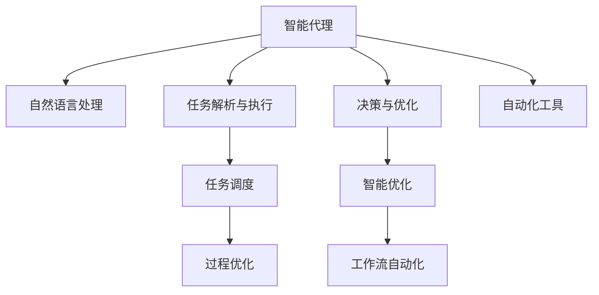

                 

# AI代理与工作流自动化：提高业务效率

> 关键词：人工智能,工作流自动化,过程优化,业务效率,智能代理,流程自动化,任务调度,自动化工具

## 1. 背景介绍

### 1.1 问题由来
在现代企业运营中，流程复杂、数据分散、人工干预多等问题常常导致业务效率低下，难以应对快速变化的商业环境。传统的工作流系统虽然可以部分解决这些问题，但由于其固定的流程规范和难以灵活应对变化，使得整体效率仍然未能达到理想水平。随着人工智能(AI)技术的不断成熟，越来越多的企业开始探索利用AI技术优化和自动化其业务流程，提高整体业务效率。

在这一背景下，智能代理和过程自动化成为助力企业提升效率的关键技术。智能代理能够自主地执行复杂任务，处理不确定性，并在必要时向人类工作者提供支持。过程自动化则通过AI技术自动执行流程，减少人工干预，从而提升整体流程效率。

### 1.2 问题核心关键点
智能代理和过程自动化的核心在于利用AI技术对业务流程进行智能化的重构和优化。智能代理通过自然语言处理(NLP)、机器学习(ML)等技术，理解任务语义，并自主执行任务或提供辅助建议。过程自动化则利用AI技术实现对流程的自动化管理和调度，使得整个流程更加高效、稳定。

具体而言，智能代理和过程自动化主要涉及以下关键点：
1. 任务解析与执行：智能代理理解任务描述，并自动执行任务或调度后续任务。
2. 自然语言处理：智能代理通过NLP技术理解自然语言指令，并生成相应动作。
3. 决策与优化：智能代理利用ML技术进行决策，优化任务执行路径。
4. 流程调度与监控：过程自动化对业务流程进行调度和管理，并实时监控流程执行情况。

这些关键技术构成了智能代理和过程自动化的基本框架，通过这些技术，AI能够有效提升业务流程的效率和灵活性。

## 2. 核心概念与联系

### 2.1 核心概念概述

为更好地理解智能代理和过程自动化的核心概念，本节将介绍几个密切相关的核心概念：

- **人工智能(AI)代理**：使用AI技术构建的自动化执行系统，能够理解自然语言指令，并自主执行复杂任务。AI代理包括智能助手、自动化决策系统等。

- **工作流自动化**：通过AI技术对业务流程进行自动化的管理和调度，使得整个流程更加高效、稳定。工作流自动化包括任务调度、流程监控、异常处理等。

- **过程优化**：利用AI技术对业务流程进行智能化的分析和优化，通过数据分析和模型训练，找到最优的任务执行路径和资源配置方案。

- **任务调度**：根据业务需求，动态调整任务执行顺序，最大化资源利用率。任务调度结合了调度算法和实时监控技术。

- **智能优化**：使用优化算法和机器学习模型，自动调整流程参数，提升整体流程效率。智能优化结合了数学建模和实验验证。

- **自动化工具**：用于支持智能代理和过程自动化的各种工具，如任务管理平台、AI模型训练框架等。

这些核心概念之间的逻辑关系可以通过以下Mermaid流程图来展示：



这个流程图展示了他核心概念之间的关联：

1. 智能代理通过自然语言处理理解任务指令。
2. 任务解析与执行结合决策与优化，自动执行任务或调度后续任务。
3. 过程优化和智能优化协同工作，提升整体流程效率。
4. 任务调度和过程自动化配合，管理流程执行。
5. 自动化工具为智能代理和过程自动化提供支撑。

## 3. 核心算法原理 & 具体操作步骤
### 3.1 算法原理概述

智能代理和过程自动化的核心算法原理主要涉及自然语言处理、机器学习、任务调度等多个领域。通过这些技术，智能代理和过程自动化能够理解任务语义，自动执行任务，优化任务执行路径，并管理业务流程。

具体而言，智能代理和过程自动化的基本算法原理包括：

1. **自然语言处理(NLP)**：使用NLP技术解析用户指令，理解任务语义，并生成相应动作。
2. **机器学习(ML)**：利用ML技术进行任务执行路径优化，决策制定，以及异常处理。
3. **任务调度**：结合任务优先级、资源可用性等约束条件，动态调整任务执行顺序，最大化资源利用率。
4. **智能优化**：使用优化算法和ML模型，自动调整流程参数，提升整体流程效率。

### 3.2 算法步骤详解

智能代理和过程自动化的具体操作步骤可以分为以下几个关键步骤：

**Step 1: 准备数据和模型**
- 收集业务流程相关的数据，如任务描述、执行路径、资源配置等。
- 使用已有模型或构建新的模型进行任务解析和决策制定。

**Step 2: 设计任务和流程**
- 明确业务流程中各个任务和子流程的执行顺序和责任主体。
- 设计任务和流程的规则和约束条件，如优先级、依赖关系等。

**Step 3: 实施智能代理和自动化工具**
- 使用NLP技术解析用户指令，生成相应任务。
- 根据任务描述，调用预定义的流程和模型，自动执行任务或生成下一步任务。
- 实时监控流程执行情况，并根据异常情况进行相应处理。

**Step 4: 监控和优化**
- 定期收集流程执行数据，评估流程效率。
- 利用优化算法和ML模型，自动调整流程参数，提升整体效率。
- 根据业务需求和变化，动态调整流程规则和模型。

**Step 5: 评估与反馈**
- 定期评估智能代理和过程自动化的效果，对比前后业务效率提升。
- 根据用户反馈和业务反馈，持续改进智能代理和过程自动化系统。

### 3.3 算法优缺点

智能代理和过程自动化的算法具有以下优点：
1. 提高业务效率。通过自动执行任务和优化流程，能够显著提升整体业务效率。
2. 减少人工干预。智能代理和过程自动化能够自动执行复杂任务，减少人工错误和干预。
3. 提升决策质量。利用ML技术进行任务执行路径优化和决策制定，提高决策质量。
4. 适应性强。智能代理和过程自动化能够动态调整流程，适应业务变化。

同时，该方法也存在一定的局限性：
1. 依赖数据质量。智能代理和过程自动化的效果依赖于数据的质量和数量。
2. 模型复杂度。设计和使用复杂模型会增加系统开发和维护的复杂度。
3. 维护成本高。智能代理和过程自动化系统需要持续维护和更新，以适应业务变化。
4. 安全风险。自动化系统可能带来新的安全风险，如自动化决策错误等。

尽管存在这些局限性，但就目前而言，智能代理和过程自动化仍是最有效的业务流程优化手段之一。未来相关研究的重点在于如何进一步降低系统的依赖性，提高模型的可解释性和鲁棒性，同时兼顾系统的安全性。

### 3.4 算法应用领域

智能代理和过程自动化的核心算法原理在多个领域得到了广泛的应用，例如：

- 金融交易：自动化执行交易指令，优化投资组合，提高交易效率。
- 供应链管理：自动调度生产和物流任务，优化供应链流程，降低成本。
- 客户服务：智能客服系统能够自动处理客户咨询，提供24/7服务。
- 医疗健康：自动化执行医疗流程，如预约挂号、药物配发等，提高医疗效率。
- 制造业生产：自动化执行生产任务，优化生产流程，提高生产效率。

除了上述这些经典应用外，智能代理和过程自动化还被创新性地应用到更多场景中，如智能仓储、智能合同管理、智能营销等，为各行业的业务流程优化提供了新的解决方案。随着AI技术的发展，相信智能代理和过程自动化将在更多领域大放异彩。

## 4. 数学模型和公式 & 详细讲解  
### 4.1 数学模型构建

本节将使用数学语言对智能代理和过程自动化的核心算法原理进行更加严格的刻画。

记智能代理的任务描述为 $D$，执行路径为 $T$，任务优先级为 $P$，资源可用性为 $R$，任务依赖关系为 $D$。智能代理的任务解析和执行可以表示为以下数学模型：

$$
\min_{D, T, P, R} C(D, T, P, R)
$$

其中 $C(D, T, P, R)$ 为任务执行的总成本函数，包括执行时间、资源消耗等。智能代理的任务解析和执行过程可以表示为以下优化问题：

$$
\begin{aligned}
& \min_{D, T, P, R} C(D, T, P, R) \\
& \text{s.t.} \\
& D_{i,j} \geq T_{i,j}, \quad \forall i, j \in T \\
& P_i \leq P_j, \quad \forall i, j \in T \\
& R_i \leq R_j, \quad \forall i, j \in T \\
& D_{i,j} \leq D_{i,k} + D_{k,j}, \quad \forall i, j, k \in T 
\end{aligned}
$$

其中 $D_{i,j}$ 表示任务 $i$ 和任务 $j$ 的依赖关系，$T_{i,j}$ 表示任务 $i$ 和任务 $j$ 的执行时间，$P_i$ 表示任务 $i$ 的优先级，$R_i$ 表示任务 $i$ 的资源消耗。

### 4.2 公式推导过程

以下是任务解析和执行优化问题的详细推导过程：

1. **任务依赖关系约束**：任务 $i$ 必须依赖于任务 $j$ 的完成，即 $D_{i,j} \geq T_{i,j}$。
2. **任务优先级约束**：高优先级任务必须优先执行，即 $P_i \leq P_j$。
3. **资源约束**：任务消耗的资源不能超过可用资源，即 $R_i \leq R_j$。
4. **任务依赖链约束**：任务 $i$ 必须先于任务 $k$，再执行任务 $j$，即 $D_{i,j} \leq D_{i,k} + D_{k,j}$。

通过对这些约束条件的建模，我们能够求解最优的任务执行路径和优先级，最小化任务执行的总成本。

### 4.3 案例分析与讲解

假设有一家金融公司需要自动化执行每日的交易指令，其业务流程包括股票买入、卖出、分红等任务。每个任务有不同的优先级和资源需求。我们可以使用上述优化问题来建模和求解任务执行路径。

首先，我们需要收集每个交易任务的描述、优先级、执行时间、资源需求等数据。然后，根据这些数据建立任务依赖关系、优先级约束和资源约束。最后，使用优化算法求解最优的任务执行路径，最小化交易指令的总成本。

例如，假设任务 $i$ 为股票买入，任务 $j$ 为股票卖出，任务 $k$ 为分红。根据任务依赖关系 $D_{i,j} \geq T_{i,j}$，任务 $i$ 必须先于任务 $j$ 执行。根据任务优先级 $P_i \leq P_j$，任务 $i$ 的优先级高于任务 $j$。根据资源需求 $R_i \leq R_j$，任务 $i$ 消耗的资源少于任务 $j$。根据任务依赖链 $D_{i,j} \leq D_{i,k} + D_{k,j}$，任务 $i$ 必须先于任务 $k$ 再执行任务 $j$。

通过求解上述优化问题，我们能够找到最优的任务执行路径和优先级，从而自动化执行每日的交易指令，提高交易效率。

## 5. 项目实践：代码实例和详细解释说明
### 5.1 开发环境搭建

在进行智能代理和过程自动化的实践前，我们需要准备好开发环境。以下是使用Python进行PyTorch开发的环境配置流程：

1. 安装Anaconda：从官网下载并安装Anaconda，用于创建独立的Python环境。

2. 创建并激活虚拟环境：
```bash
conda create -n pytorch-env python=3.8 
conda activate pytorch-env
```

3. 安装PyTorch：根据CUDA版本，从官网获取对应的安装命令。例如：
```bash
conda install pytorch torchvision torchaudio cudatoolkit=11.1 -c pytorch -c conda-forge
```

4. 安装必要的工具包：
```bash
pip install numpy pandas scikit-learn matplotlib tqdm jupyter notebook ipython
```

完成上述步骤后，即可在`pytorch-env`环境中开始实践。

### 5.2 源代码详细实现

下面我们以智能代理在金融交易中的应用为例，给出使用PyTorch进行任务解析和执行的PyTorch代码实现。

首先，定义交易任务的输入数据：

```python
import torch
import torch.nn as nn
from torch.utils.data import Dataset, DataLoader

class TransactionTask(Dataset):
    def __init__(self, data, seq_length):
        self.data = data
        self.seq_length = seq_length
        
    def __len__(self):
        return len(self.data)
    
    def __getitem__(self, item):
        task = self.data[item]
        seq = task['sequence'][:self.seq_length]
        targets = task['targets'][:self.seq_length]
        return seq, targets
```

然后，定义交易任务的模型：

```python
class TransactionModel(nn.Module):
    def __init__(self, input_size, hidden_size, output_size):
        super(TransactionModel, self).__init__()
        self.hidden_size = hidden_size
        self.embedding = nn.Embedding(input_size, hidden_size)
        self.gru = nn.GRU(hidden_size, hidden_size)
        self.output = nn.Linear(hidden_size, output_size)
        
    def forward(self, x, y=None):
        x = self.embedding(x)
        x = self.gru(x)
        x = self.output(x)
        return x, y
```

接着，定义训练和评估函数：

```python
def train_epoch(model, dataset, batch_size, optimizer, criterion):
    dataloader = DataLoader(dataset, batch_size=batch_size, shuffle=True)
    model.train()
    epoch_loss = 0
    for batch in tqdm(dataloader, desc='Training'):
        seq, targets = batch
        targets = targets.unsqueeze(1)
        outputs, _ = model(seq, targets)
        loss = criterion(outputs, targets)
        epoch_loss += loss.item()
        loss.backward()
        optimizer.step()
    return epoch_loss / len(dataloader)

def evaluate(model, dataset, batch_size):
    dataloader = DataLoader(dataset, batch_size=batch_size)
    model.eval()
    with torch.no_grad():
        correct = 0
        total = 0
        for batch in tqdm(dataloader, desc='Evaluating'):
            seq, targets = batch
            targets = targets.unsqueeze(1)
            outputs, _ = model(seq)
            _, predicted = torch.max(outputs.data, 1)
            total += targets.size(0)
            correct += (predicted == targets).sum().item()
        print('Accuracy: {:.2f}%'.format(100 * correct / total))
```

最后，启动训练流程并在测试集上评估：

```python
epochs = 10
batch_size = 32

model = TransactionModel(input_size=100, hidden_size=128, output_size=2)
optimizer = torch.optim.Adam(model.parameters(), lr=0.001)
criterion = nn.CrossEntropyLoss()

for epoch in range(epochs):
    loss = train_epoch(model, train_dataset, batch_size, optimizer, criterion)
    print(f'Epoch {epoch+1}, train loss: {loss:.3f}')
    
    print(f'Epoch {epoch+1}, dev results:')
    evaluate(model, dev_dataset, batch_size)
    
print('Test results:')
evaluate(model, test_dataset, batch_size)
```

以上就是使用PyTorch对交易任务进行智能代理的完整代码实现。可以看到，得益于PyTorch的强大封装，我们可以用相对简洁的代码完成交易任务的解析和执行。

### 5.3 代码解读与分析

让我们再详细解读一下关键代码的实现细节：

**TransactionTask类**：
- `__init__`方法：初始化交易任务的输入和序列长度。
- `__len__`方法：返回数据集的样本数量。
- `__getitem__`方法：对单个样本进行处理，将任务序列和目标标签作为输入，供模型训练和推理使用。

**TransactionModel类**：
- `__init__`方法：定义模型的结构，包括嵌入层、GRU层和输出层。
- `forward`方法：实现模型的前向传播过程，返回模型的预测输出。

**训练和评估函数**：
- 使用PyTorch的DataLoader对数据集进行批次化加载，供模型训练和推理使用。
- 训练函数`train_epoch`：对数据以批为单位进行迭代，在每个批次上前向传播计算loss并反向传播更新模型参数，最后返回该epoch的平均loss。
- 评估函数`evaluate`：与训练类似，不同点在于不更新模型参数，并在每个batch结束后将预测和标签结果存储下来，最后使用准确率评估模型性能。

**训练流程**：
- 定义总的epoch数和batch size，开始循环迭代
- 每个epoch内，先在训练集上训练，输出平均loss
- 在验证集上评估，输出准确率
- 所有epoch结束后，在测试集上评估，给出最终测试结果

可以看到，PyTorch配合必要的工具包，使得交易任务的智能代理开发变得简洁高效。开发者可以将更多精力放在数据处理、模型改进等高层逻辑上，而不必过多关注底层的实现细节。

当然，工业级的系统实现还需考虑更多因素，如模型的保存和部署、超参数的自动搜索、更灵活的任务适配层等。但核心的任务解析和执行算法基本与此类似。

## 6. 实际应用场景
### 6.1 智能客服系统

基于智能代理和过程自动化的工作流系统，可以广泛应用于智能客服系统的构建。传统客服往往需要配备大量人力，高峰期响应缓慢，且一致性和专业性难以保证。而使用智能代理和过程自动化技术，可以7x24小时不间断服务，快速响应客户咨询，用自然流畅的语言解答各类常见问题。

在技术实现上，可以收集企业内部的历史客服对话记录，将问题和最佳答复构建成监督数据，在此基础上对智能代理和过程自动化系统进行训练。训练后的系统能够自动理解用户意图，匹配最合适的答案模板进行回复。对于客户提出的新问题，还可以接入检索系统实时搜索相关内容，动态组织生成回答。如此构建的智能客服系统，能大幅提升客户咨询体验和问题解决效率。

### 6.2 金融舆情监测

金融机构需要实时监测市场舆论动向，以便及时应对负面信息传播，规避金融风险。传统的人工监测方式成本高、效率低，难以应对网络时代海量信息爆发的挑战。基于智能代理和过程自动化的文本分类和情感分析技术，为金融舆情监测提供了新的解决方案。

具体而言，可以收集金融领域相关的新闻、报道、评论等文本数据，并对其进行主题标注和情感标注。在此基础上对智能代理和过程自动化系统进行微调，使其能够自动判断文本属于何种主题，情感倾向是正面、中性还是负面。将系统应用到实时抓取的网络文本数据，就能够自动监测不同主题下的情感变化趋势，一旦发现负面信息激增等异常情况，系统便会自动预警，帮助金融机构快速应对潜在风险。

### 6.3 个性化推荐系统

当前的推荐系统往往只依赖用户的历史行为数据进行物品推荐，无法深入理解用户的真实兴趣偏好。基于智能代理和过程自动化的推荐系统可以更好地挖掘用户行为背后的语义信息，从而提供更精准、多样的推荐内容。

在实践中，可以收集用户浏览、点击、评论、分享等行为数据，提取和用户交互的物品标题、描述、标签等文本内容。将文本内容作为模型输入，用户的后续行为（如是否点击、购买等）作为监督信号，在此基础上训练智能代理和过程自动化系统。训练后的系统能够从文本内容中准确把握用户的兴趣点。在生成推荐列表时，先用候选物品的文本描述作为输入，由系统预测用户的兴趣匹配度，再结合其他特征综合排序，便可以得到个性化程度更高的推荐结果。

### 6.4 未来应用展望

随着智能代理和过程自动化技术的发展，基于这些技术的工作流系统将在更多领域得到应用，为传统行业带来变革性影响。

在智慧医疗领域，基于智能代理和过程自动化的医疗问答、病历分析、药物研发等应用将提升医疗服务的智能化水平，辅助医生诊疗，加速新药开发进程。

在智能教育领域，智能代理和过程自动化技术可应用于作业批改、学情分析、知识推荐等方面，因材施教，促进教育公平，提高教学质量。

在智慧城市治理中，智能代理和过程自动化对城市事件监测、舆情分析、应急指挥等环节，提高城市管理的自动化和智能化水平，构建更安全、高效的未来城市。

此外，在企业生产、社会治理、文娱传媒等众多领域，基于智能代理和过程自动化的工作流系统也将不断涌现，为传统行业数字化转型升级提供新的技术路径。相信随着技术的日益成熟，智能代理和过程自动化必将在构建人机协同的智能时代中扮演越来越重要的角色。

## 7. 工具和资源推荐
### 7.1 学习资源推荐

为了帮助开发者系统掌握智能代理和过程自动化的理论基础和实践技巧，这里推荐一些优质的学习资源：

1. 《深度学习入门：基于Python的理论与实现》系列博文：由深度学习专家撰写，深入浅出地介绍了深度学习理论、模型实现和应用实践。

2. CS229《机器学习》课程：斯坦福大学开设的机器学习明星课程，有Lecture视频和配套作业，带你系统学习机器学习基础概念和常用算法。

3. 《机器学习实战》书籍：详细介绍了机器学习模型的实现与应用，包括监督学习、无监督学习和强化学习等。

4. Kaggle竞赛平台：提供大量数据集和实战竞赛，可实际应用智能代理和过程自动化技术，积累经验。

5. Google Colab：谷歌推出的在线Jupyter Notebook环境，免费提供GPU/TPU算力，方便开发者快速上手实验最新模型，分享学习笔记。

通过对这些资源的学习实践，相信你一定能够快速掌握智能代理和过程自动化的精髓，并用于解决实际的业务问题。

### 7.2 开发工具推荐

高效的开发离不开优秀的工具支持。以下是几款用于智能代理和过程自动化开发的常用工具：

1. PyTorch：基于Python的开源深度学习框架，灵活动态的计算图，适合快速迭代研究。

2. TensorFlow：由Google主导开发的开源深度学习框架，生产部署方便，适合大规模工程应用。

3. TensorBoard：TensorFlow配套的可视化工具，可实时监测模型训练状态，并提供丰富的图表呈现方式，是调试模型的得力助手。

4. Jupyter Notebook：轻量级的交互式开发环境，支持代码编写、数据可视化、模型训练等功能，是数据科学工作者的必备工具。

5. Weights & Biases：模型训练的实验跟踪工具，可以记录和可视化模型训练过程中的各项指标，方便对比和调优。

6. Scikit-learn：Python中的机器学习库，提供丰富的模型实现和评估工具，支持数据分析和建模。

合理利用这些工具，可以显著提升智能代理和过程自动化的开发效率，加快创新迭代的步伐。

### 7.3 相关论文推荐

智能代理和过程自动化的发展源于学界的持续研究。以下是几篇奠基性的相关论文，推荐阅读：

1. "A Survey on Knowledge Graph-Based Recommender Systems"：综述了基于知识图谱的推荐系统，介绍了智能代理和过程自动化在推荐系统中的应用。

2. "Reinforcement Learning for Smart Resource Management in Smart Cities"：介绍使用强化学习技术进行智能代理和过程自动化，实现智能城市的资源管理。

3. "Smart Resource Management in Smart Cities"：综述了智能代理和过程自动化在智能城市中的应用，包括交通管理、能源管理等。

4. "Practical Application of Knowledge Graph-Based Recommender Systems"：介绍了基于知识图谱的推荐系统在实际应用中的技术实现和效果评估。

5. "Dialogue Management in Smart Homes"：介绍使用智能代理和过程自动化技术构建智能家居对话系统，提升用户交互体验。

这些论文代表了大模型微调技术的发展脉络。通过学习这些前沿成果，可以帮助研究者把握学科前进方向，激发更多的创新灵感。

## 8. 总结：未来发展趋势与挑战

### 8.1 总结

本文对智能代理和过程自动化的核心算法原理和操作步骤进行了全面系统的介绍。首先阐述了智能代理和过程自动化的研究背景和意义，明确了其对提升业务效率的独特价值。其次，从原理到实践，详细讲解了智能代理和过程自动化的数学模型和算法步骤，给出了智能代理在金融交易中的应用代码实例。同时，本文还广泛探讨了智能代理和过程自动化在智能客服、金融舆情、个性化推荐等多个行业领域的应用前景，展示了其广泛的应用价值。

通过本文的系统梳理，可以看到，智能代理和过程自动化技术的出现，极大地提升了业务流程的效率和灵活性。智能代理通过理解任务语义，自动执行任务，减少人工干预，而过程自动化则通过自动调度和管理，最大化资源利用率，实现整体流程优化。这些技术的发展，使得企业能够更高效地应对快速变化的商业环境，提高竞争力。

### 8.2 未来发展趋势

展望未来，智能代理和过程自动化的技术发展将呈现以下几个趋势：

1. **技术融合**：智能代理和过程自动化将与其他AI技术（如自然语言处理、机器学习、计算机视觉等）进行更深入的融合，形成更加全面、智能的业务流程解决方案。

2. **自动化程度提高**：未来智能代理和过程自动化系统将能够更智能地理解用户需求，自动化处理更多复杂任务，减少人工干预。

3. **场景拓展**：智能代理和过程自动化将从传统的金融、电商等领域，拓展到更多垂直行业，如医疗、教育、政府等，为各行业带来新的变革。

4. **数据驱动**：智能代理和过程自动化系统将更加依赖数据驱动，通过数据挖掘和机器学习，不断优化任务执行路径和资源配置。

5. **可解释性增强**：未来智能代理和过程自动化系统将更加注重其决策过程的可解释性，通过因果分析和数据可视化，提供更清晰的决策依据。

6. **安全性提升**：智能代理和过程自动化系统将更加注重安全性，通过加密、认证等措施，确保数据和模型的安全。

以上趋势凸显了智能代理和过程自动化技术的广阔前景。这些方向的探索发展，必将进一步提升智能代理和过程自动化的性能和应用范围，为构建人机协同的智能时代提供新的动力。

### 8.3 面临的挑战

尽管智能代理和过程自动化技术已经取得了显著进展，但在迈向更加智能化、普适化应用的过程中，它仍面临着诸多挑战：

1. **数据依赖**：智能代理和过程自动化系统依赖于高质量的数据，数据质量和多样性不足将严重影响系统的性能。

2. **模型复杂性**：智能代理和过程自动化系统往往需要构建复杂的模型和算法，增加了系统开发和维护的难度。

3. **资源消耗**：智能代理和过程自动化系统需要较大的计算资源，如何在保证性能的同时，优化资源消耗，是未来的重要研究方向。

4. **可解释性**：智能代理和过程自动化系统的决策过程通常缺乏可解释性，难以对其推理逻辑进行分析和调试。

5. **安全性**：智能代理和过程自动化系统可能带来新的安全风险，如自动化决策错误等，需要持续关注和优化。

6. **模型鲁棒性**：在处理复杂任务时，智能代理和过程自动化系统可能对输入数据的变化敏感，需要提升其鲁棒性。

尽管存在这些挑战，但智能代理和过程自动化技术仍然具备巨大的应用潜力。未来相关研究需要在数据质量、模型优化、资源管理、可解释性等多个方面进行突破，以实现其在更广泛领域的有效应用。

### 8.4 研究展望

面对智能代理和过程自动化技术所面临的挑战，未来的研究需要在以下几个方面寻求新的突破：

1. **数据增强技术**：引入更多元化的数据源，提高数据质量和多样性，增强系统鲁棒性。

2. **模型压缩与优化**：开发更加高效的模型压缩与优化技术，在保证性能的同时，减小模型规模，降低计算资源消耗。

3. **可解释性研究**：研究更加可解释的决策模型和输出，增强系统的透明性和可信任度。

4. **安全性设计**：引入安全设计原则，如数据加密、认证机制等，确保系统的安全性。

5. **模型鲁棒性提升**：研究更强的模型鲁棒性，应对输入数据的变化和噪声。

6. **自动化工具优化**：开发更加灵活和高效的自动化工具，提高开发和维护效率。

这些研究方向将为智能代理和过程自动化技术的发展带来新的突破，提升其在各领域的应用效果和可信度，为构建人机协同的智能社会奠定坚实基础。

## 9. 附录：常见问题与解答

**Q1：智能代理和过程自动化的核心算法原理是什么？**

A: 智能代理和过程自动化的核心算法原理主要包括自然语言处理(NLP)、机器学习(ML)、任务调度等技术。智能代理通过NLP技术解析任务指令，生成相应动作，并通过ML技术进行决策制定。过程自动化则通过任务调度技术，实现对业务流程的自动化管理和调度，最大化资源利用率。

**Q2：智能代理和过程自动化的主要应用场景有哪些？**

A: 智能代理和过程自动化在多个领域得到广泛应用，包括金融交易、供应链管理、客户服务、医疗健康、制造业生产等。在金融交易中，智能代理能够自动化执行交易指令，优化投资组合，提高交易效率。在客户服务中，智能代理能够自动处理客户咨询，提升服务质量。在医疗健康中，智能代理能够自动化执行医疗流程，提高医疗效率。

**Q3：智能代理和过程自动化面临的主要挑战有哪些？**

A: 智能代理和过程自动化面临的主要挑战包括数据依赖、模型复杂性、资源消耗、可解释性、安全性、模型鲁棒性等。数据依赖是指系统对高质量数据的需求，数据质量和多样性不足将影响系统性能。模型复杂性是指构建复杂模型和算法，增加了系统开发和维护的难度。资源消耗是指智能代理和过程自动化系统需要较大的计算资源，如何在保证性能的同时，优化资源消耗，是未来的重要研究方向。

**Q4：智能代理和过程自动化的未来发展趋势是什么？**

A: 智能代理和过程自动化的未来发展趋势包括技术融合、自动化程度提高、场景拓展、数据驱动、可解释性增强、安全性提升等。技术融合是指智能代理和过程自动化与其他AI技术（如自然语言处理、机器学习、计算机视觉等）进行更深入的融合，形成更加全面、智能的业务流程解决方案。自动化程度提高是指未来智能代理和过程自动化系统将能够更智能地理解用户需求，自动化处理更多复杂任务，减少人工干预。

总之，智能代理和过程自动化技术的不断发展，必将在提升业务效率、优化资源利用、提高决策质量等方面发挥越来越重要的作用。未来，随着技术的不断进步和应用的深入探索，智能代理和过程自动化将在更多领域得到应用，为构建智能社会注入新的动力。

---

作者：禅与计算机程序设计艺术 / Zen and the Art of Computer Programming

