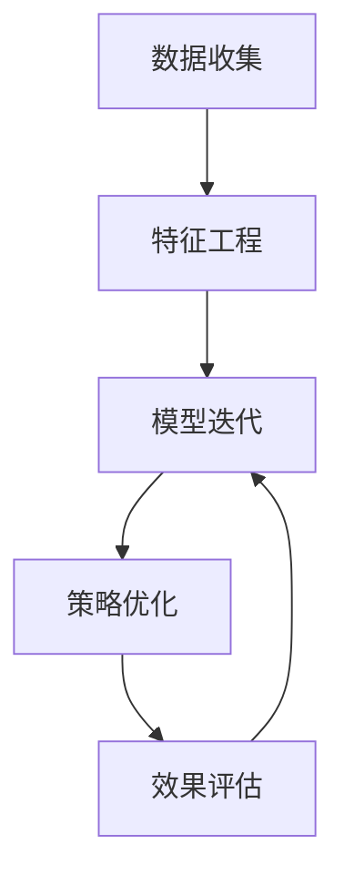

                 

# AI优化促销策略：案例分析与实践

> 关键词：AI促销优化,营销策略,机器学习,算法,案例分析,实践,优化效果

## 1. 背景介绍

### 1.1 问题由来
在当今数字化、信息化的商业环境下，零售商面临日益激烈的竞争压力，如何通过有效的促销策略提升销售额、增强客户粘性成为其核心挑战。传统的促销策略往往依赖经验和直觉，缺乏数据驱动的科学决策。而随着人工智能技术的发展，利用AI优化促销策略成为可能，有望大幅提升促销效果和商业价值。

### 1.2 问题核心关键点
AI优化促销策略的核心在于利用大数据、机器学习等技术手段，对消费者的行为、偏好进行建模分析，并通过预测模型制定更加精准、个性化的促销方案。这一过程包括：

1. 数据收集：获取消费者的历史购买记录、浏览行为、社交媒体互动等数据。
2. 特征工程：从数据中提取影响消费者购买决策的关键特征。
3. 模型训练：构建预测模型，对消费者是否会对促销活动产生反应进行预测。
4. 策略优化：基于预测结果，优化促销方案，最大化ROI。
5. 效果评估：通过A/B测试等手段评估促销效果，不断迭代优化。

### 1.3 问题研究意义
AI优化促销策略对于提升企业市场营销效率、降低成本、增强客户体验具有重要意义：

1. 数据驱动决策：通过科学分析消费者行为，制定更加精准的促销策略，避免传统经验决策的盲目性。
2. 提升ROI：通过个性化促销方案，提高消费者转化率，最大化促销活动的投资回报率。
3. 增强客户粘性：通过精准投放，提升客户满意度，增强客户对品牌的忠诚度。
4. 市场竞争力：借助AI技术，获取数据优势，在竞争中占据有利地位。

## 2. 核心概念与联系

### 2.1 核心概念概述

为更好地理解AI优化促销策略，本节将介绍几个关键概念：

- **AI促销优化**：指利用人工智能技术对促销策略进行优化，通过分析消费者行为，制定个性化、精准的促销方案。
- **机器学习**：一种让机器通过数据学习自动改进算法的能力。在促销策略优化中，机器学习模型通过历史数据训练，预测促销效果，指导策略调整。
- **预测建模**：构建预测模型，对未来消费者行为进行预测，是AI促销优化的核心技术。
- **A/B测试**：一种通过随机分组对比试验评估不同促销策略效果的方法，常用于验证AI模型的优化效果。

### 2.2 核心概念原理和架构的 Mermaid 流程图



这个流程图展示了AI优化促销策略的核心流程：

1. 数据收集：获取消费者行为数据。
2. 特征工程：提取关键特征，如消费金额、购买频率、地理位置等。
3. 模型训练：使用历史数据训练预测模型，评估促销效果。
4. 策略优化：根据预测结果，优化促销方案。
5. 效果评估：通过A/B测试，验证优化效果。
6. 模型迭代：不断迭代优化模型，提升预测准确性。

## 3. 核心算法原理 & 具体操作步骤

### 3.1 算法原理概述

AI优化促销策略主要依赖于机器学习中的预测建模技术。其核心思想是：利用历史促销活动数据，训练一个预测模型，预测某个促销活动对目标消费者群体的效果。然后基于预测结果，优化促销策略，以达到最佳的营销效果。

形式化地，假设促销活动的历史数据集为 $D=\{(x_i,y_i)\}_{i=1}^N, x_i \in \mathcal{X}, y_i \in \{0,1\}$，其中 $x_i$ 表示促销活动描述，$y_i$ 表示促销活动对消费者行为的影响（如购买概率）。预测模型 $M$ 的输入为促销活动描述，输出为促销效果。我们的目标是最小化预测误差：

$$
\hat{y}_i = M(x_i), \quad \min_{M} \frac{1}{N} \sum_{i=1}^N (y_i - \hat{y}_i)^2
$$

### 3.2 算法步骤详解

AI优化促销策略的算法流程包括数据预处理、模型选择与训练、策略优化与效果评估等多个步骤。

#### 3.2.1 数据预处理

数据预处理是AI促销优化的第一步。其核心任务包括数据清洗、特征提取和特征选择等：

1. **数据清洗**：去除异常值、缺失值，确保数据质量。
2. **特征提取**：从原始数据中提取影响消费者行为的关键特征，如购买金额、促销活动类型、广告投放渠道等。
3. **特征选择**：选择对消费者行为影响最大的特征，避免过拟合。

#### 3.2.2 模型选择与训练

模型选择与训练是AI促销优化的核心。其核心任务包括模型选择、参数调整和模型评估等：

1. **模型选择**：选择适合的预测模型，如线性回归、决策树、随机森林、神经网络等。
2. **参数调整**：调整模型参数，如学习率、正则化系数、特征权重等，优化模型性能。
3. **模型评估**：使用交叉验证、留一法等技术评估模型性能，选择合适的模型。

#### 3.2.3 策略优化

策略优化是AI促销优化的关键。其核心任务包括促销方案设计、效果评估和策略调整等：

1. **促销方案设计**：根据模型预测结果，设计个性化、精准的促销方案。
2. **效果评估**：使用A/B测试等手段评估促销效果，分析不同策略的ROI。
3. **策略调整**：根据评估结果，调整促销策略，优化ROI。

### 3.3 算法优缺点

AI优化促销策略的主要优点包括：

1. 数据驱动决策：通过科学分析消费者行为，制定更加精准的促销策略，避免传统经验决策的盲目性。
2. 提升ROI：通过个性化促销方案，提高消费者转化率，最大化促销活动的投资回报率。
3. 增强客户粘性：通过精准投放，提升客户满意度，增强客户对品牌的忠诚度。
4. 市场竞争力：借助AI技术，获取数据优势，在竞争中占据有利地位。

同时，该方法也存在一定的局限性：

1. 数据质量依赖：AI模型的预测效果高度依赖数据质量，需确保数据收集的全面性和准确性。
2. 模型复杂度：模型选择和参数调整过程复杂，需要专业知识。
3. 实时性问题：模型训练和策略调整过程耗时，难以实现实时优化。
4. 隐私问题：数据收集和处理过程中，需确保消费者隐私和数据安全。

尽管存在这些局限性，但AI优化促销策略仍被广泛认为是一种有效的市场决策方法，值得深入研究和应用。

### 3.4 算法应用领域

AI优化促销策略在零售、电商、金融、电信等多个领域都有广泛应用：

1. **零售电商**：电商平台利用AI模型预测消费者行为，设计个性化促销活动，提升销售转化率。
2. **金融服务**：金融机构利用AI模型预测客户流失风险，设计针对性促销方案，提升客户留存率。
3. **电信运营商**：电信运营商利用AI模型预测用户行为，设计定制化套餐和优惠活动，增强用户粘性。
4. **汽车制造**：汽车制造商利用AI模型预测客户偏好，设计个性化营销活动，提高销售效率。
5. **旅游行业**：旅游公司利用AI模型预测消费者需求，设计个性化旅游产品，提升客户满意度。

## 4. 数学模型和公式 & 详细讲解 & 举例说明

### 4.1 数学模型构建

在促销策略优化中，我们通常使用回归模型对促销效果进行预测。以线性回归模型为例，其数学模型为：

$$
y = \beta_0 + \sum_{i=1}^p \beta_i x_i + \epsilon
$$

其中 $y$ 表示促销效果，$x_i$ 表示促销活动描述中的第 $i$ 个特征，$\beta_i$ 表示特征系数，$\epsilon$ 表示误差项。

### 4.2 公式推导过程

线性回归模型的最小二乘法求解过程如下：

1. 假设样本 $D=\{(x_i,y_i)\}_{i=1}^N$，其中 $x_i$ 表示促销活动描述，$y_i$ 表示促销效果。
2. 回归模型为 $y = \beta_0 + \sum_{i=1}^p \beta_i x_i + \epsilon$。
3. 最小化损失函数：$\min_{\beta_0, \beta_i} \sum_{i=1}^N (y_i - (\beta_0 + \sum_{i=1}^p \beta_i x_{i,i}))^2$。
4. 求解 $\beta_0, \beta_i$：

   $$
   \beta_0 = \frac{\sum_{i=1}^N y_i - \sum_{i=1}^N \sum_{j=1}^N x_{i,j} \sum_{j=1}^N x_{j,j}^{-1} \sum_{j=1}^N y_j x_{j,i}}{\sum_{i=1}^N \sum_{j=1}^N x_{i,j} \sum_{j=1}^N x_{j,j}^{-1} \sum_{j=1}^N x_{j,i}}
   $$

   $$
   \beta_i = \frac{\sum_{i=1}^N y_i \sum_{j=1}^N x_{j,i} - \beta_0 \sum_{j=1}^N x_{j,i}}{\sum_{i=1}^N \sum_{j=1}^N x_{i,j} \sum_{j=1}^N x_{j,j}^{-1} \sum_{j=1}^N x_{j,i}}
   $$

### 4.3 案例分析与讲解

假设某电商平台希望通过AI模型优化其促销活动。数据集包括用户的购买历史、浏览记录、社交媒体互动等数据。

1. **数据预处理**：
   - 清洗数据，去除异常值和缺失值。
   - 提取关键特征，如购买金额、浏览次数、点击率等。
   - 选择对促销效果影响最大的特征，如购买金额、浏览时长、评价等。

2. **模型选择与训练**：
   - 选择线性回归模型，训练预测模型。
   - 使用交叉验证评估模型性能，调整参数。

3. **策略优化**：
   - 设计个性化促销方案，如针对高价值客户推出特别优惠。
   - 使用A/B测试评估促销效果，比较不同策略的ROI。
   - 根据评估结果调整促销策略，优化ROI。

## 5. 项目实践：代码实例和详细解释说明

### 5.1 开发环境搭建

在进行促销策略优化实践前，我们需要准备好开发环境。以下是使用Python进行机器学习开发的环境配置流程：

1. 安装Anaconda：从官网下载并安装Anaconda，用于创建独立的Python环境。

2. 创建并激活虚拟环境：
```bash
conda create -n py3env python=3.8 
conda activate py3env
```

3. 安装必要的Python库：
```bash
conda install scikit-learn pandas numpy matplotlib seaborn
```

4. 安装机器学习框架：
```bash
pip install scikit-learn
```

5. 安装数据处理和可视化工具：
```bash
pip install pandas matplotlib seaborn
```

完成上述步骤后，即可在`py3env`环境中开始促销策略优化的实践。

### 5.2 源代码详细实现

这里我们以一个简单的线性回归模型为例，演示如何实现AI促销策略优化。假设我们已经收集到用户的购买历史和促销活动描述数据，代码如下：

```python
import pandas as pd
from sklearn.linear_model import LinearRegression
from sklearn.model_selection import train_test_split
import matplotlib.pyplot as plt

# 读取数据
data = pd.read_csv('promotions.csv')

# 数据预处理
X = data[['purchase_amount', 'purchase_frequency', 'click_rate']]
y = data['promotion_effect']

# 划分训练集和测试集
X_train, X_test, y_train, y_test = train_test_split(X, y, test_size=0.2, random_state=42)

# 模型训练
model = LinearRegression()
model.fit(X_train, y_train)

# 模型评估
train_score = model.score(X_train, y_train)
test_score = model.score(X_test, y_test)

# 预测
y_pred = model.predict(X_test)

# 可视化结果
plt.scatter(X_test, y_test, color='blue')
plt.plot(X_test, y_pred, color='red')
plt.xlabel('Purchase Amount')
plt.ylabel('Promotion Effect')
plt.title('Promotion Effect Prediction')
plt.show()
```

### 5.3 代码解读与分析

让我们再详细解读一下关键代码的实现细节：

**数据预处理**：
- 使用`pandas`库读取数据，进行数据清洗和特征提取。
- 使用`train_test_split`函数将数据集划分为训练集和测试集。

**模型训练**：
- 使用`LinearRegression`类构建线性回归模型，使用`fit`方法训练模型。

**模型评估**：
- 使用`score`方法计算训练集和测试集上的R²分数，评估模型性能。

**预测与可视化**：
- 使用`predict`方法对测试集进行预测，使用`matplotlib`库绘制预测结果与真实值的对比图。

可以看到，通过简单的线性回归模型，我们就可以对促销策略进行初步优化，预测促销效果并可视化结果。这只是一个基本的演示，实际的促销策略优化需要更复杂的模型和更多数据。

### 5.4 运行结果展示

运行上述代码后，将得到促销效果预测结果和可视化图表。通过对比模型预测值和真实值，可以初步评估模型性能。如果需要进一步优化模型，可以考虑引入更多的特征、使用更复杂的模型（如决策树、随机森林等）、调整模型参数等。

## 6. 实际应用场景

### 6.1 智能推荐系统

智能推荐系统利用AI优化促销策略，通过分析用户行为，为用户推荐个性化的商品或服务。这不仅提升了用户体验，还显著提高了转化率。例如，电商平台通过AI模型预测用户是否会购买某商品，并推送个性化优惠券，可以大幅提升销售额。

### 6.2 广告投放优化

广告投放优化利用AI预测广告投放效果，优化广告投放策略。例如，通过分析用户历史点击数据和行为特征，预测用户对不同广告的反应，调整投放时间和频次，提高广告点击率和转化率。

### 6.3 个性化营销

个性化营销利用AI预测用户需求，设计个性化营销方案。例如，通过分析用户浏览和购买记录，预测用户对不同产品的兴趣，推送定制化营销内容，提高用户参与度和转化率。

### 6.4 未来应用展望

随着AI技术的不断发展，AI优化促销策略将在更多领域得到应用，为零售商和品牌商带来新的机遇：

1. **全渠道营销**：通过整合线上线下数据，利用AI预测跨渠道的消费者行为，设计统一的营销策略，提升整体营销效果。
2. **精准营销**：利用AI分析消费者行为数据，设计精准的营销活动，提高营销效率和ROI。
3. **实时营销**：通过AI实时分析数据，快速响应市场变化，调整营销策略，保持市场竞争力。
4. **客户细分**：利用AI进行客户细分，设计针对性营销活动，提高客户粘性和忠诚度。

未来，AI优化促销策略将成为企业市场决策的重要工具，推动营销模式的创新和优化。

## 7. 工具和资源推荐

### 7.1 学习资源推荐

为了帮助开发者系统掌握AI优化促销策略的理论基础和实践技巧，这里推荐一些优质的学习资源：

1. **《机器学习实战》书籍**：介绍机器学习的基本概念和算法，包括回归模型、分类模型等，适合初学者入门。
2. **Coursera《机器学习》课程**：由斯坦福大学开设的机器学习课程，系统讲解机器学习的基本原理和算法，适合深入学习。
3. **Kaggle机器学习竞赛**：提供丰富的数据集和实际问题，帮助开发者实践机器学习算法，提升实战能力。
4. **机器学习开源项目**：如TensorFlow、scikit-learn等，提供多种机器学习算法和模型，适合学习和应用。
5. **在线机器学习社区**：如Kaggle、GitHub等，提供丰富的机器学习资源和交流平台，适合学习和交流。

通过对这些资源的学习实践，相信你一定能够快速掌握AI优化促销策略的精髓，并用于解决实际的营销问题。

### 7.2 开发工具推荐

高效的开发离不开优秀的工具支持。以下是几款用于AI促销策略优化的常用工具：

1. **Python**：作为数据科学和机器学习的主流语言，Python拥有丰富的数据处理和机器学习库，适合开发AI促销策略。
2. **TensorFlow**：由Google主导开发的开源深度学习框架，支持分布式计算和大规模数据处理，适合构建复杂的机器学习模型。
3. **scikit-learn**：一个基于Python的机器学习库，提供简单易用的机器学习算法和模型，适合快速原型开发和实验。
4. **Jupyter Notebook**：一个交互式的开发环境，支持Python代码的交互式执行和可视化，适合数据探索和机器学习实验。
5. **Google Colab**：谷歌提供的免费在线Jupyter Notebook环境，支持GPU计算，适合快速实验和学习。

合理利用这些工具，可以显著提升AI促销策略优化的开发效率，加快创新迭代的步伐。

### 7.3 相关论文推荐

AI优化促销策略的研究源于学界的持续研究。以下是几篇奠基性的相关论文，推荐阅读：

1. **《机器学习》书籍**：周志华所著，全面介绍机器学习的基本概念和算法，适合入门学习。
2. **《深度学习》书籍**：Ian Goodfellow等所著，介绍深度学习的基本概念和算法，适合深入学习。
3. **《强化学习》书籍**：Richard Sutton等所著，介绍强化学习的基本概念和算法，适合进一步学习。

这些论文代表了大数据和机器学习技术的发展脉络，通过学习这些前沿成果，可以帮助研究者把握学科前进方向，激发更多的创新灵感。

## 8. 总结：未来发展趋势与挑战

### 8.1 总结

本文对AI优化促销策略进行了全面系统的介绍。首先阐述了AI促销策略优化的研究背景和意义，明确了其在大数据和机器学习技术驱动下的发展潜力。其次，从原理到实践，详细讲解了促销策略优化的数学模型和核心算法，给出了促销策略优化的完整代码实例。同时，本文还广泛探讨了AI促销策略在智能推荐、广告投放、个性化营销等多个领域的应用前景，展示了AI技术在营销领域的广阔应用。

通过本文的系统梳理，可以看到，AI优化促销策略正在成为零售商和品牌商市场决策的重要工具，极大地提升了营销效率和ROI。未来，伴随AI技术的持续演进，促销策略优化将迎来更多的创新和突破。

### 8.2 未来发展趋势

展望未来，AI优化促销策略将呈现以下几个发展趋势：

1. **数据驱动决策**：通过大数据和机器学习技术，预测消费者行为，制定更加精准的促销策略，避免传统经验决策的盲目性。
2. **实时优化**：利用实时数据分析技术，快速响应市场变化，调整促销策略，保持市场竞争力。
3. **全渠道整合**：通过整合线上线下数据，实现全渠道营销，提升整体营销效果。
4. **个性化营销**：利用AI分析消费者行为数据，设计个性化的营销方案，提高营销效率和ROI。
5. **智能推荐**：利用AI优化推荐系统，提升用户体验和转化率。
6. **跨领域应用**：AI优化促销策略将在更多领域得到应用，推动营销模式的创新和优化。

以上趋势凸显了AI优化促销策略的广阔前景。这些方向的探索发展，必将进一步提升营销系统的性能和应用范围，为零售商和品牌商带来新的机遇。

### 8.3 面临的挑战

尽管AI优化促销策略已经取得了瞩目成就，但在迈向更加智能化、普适化应用的过程中，它仍面临诸多挑战：

1. **数据质量问题**：AI模型的预测效果高度依赖数据质量，需确保数据收集的全面性和准确性。
2. **模型复杂度**：模型选择和参数调整过程复杂，需要专业知识。
3. **实时性问题**：模型训练和策略调整过程耗时，难以实现实时优化。
4. **隐私问题**：数据收集和处理过程中，需确保消费者隐私和数据安全。
5. **技术门槛**：AI优化促销策略的实现需要一定的技术门槛，需具备数据科学和机器学习背景。

尽管存在这些挑战，但AI优化促销策略仍被广泛认为是一种有效的市场决策方法，值得深入研究和应用。

### 8.4 研究展望

未来，AI优化促销策略的研究可以从以下几个方向进行：

1. **多模态数据融合**：利用多模态数据（如视频、图像等）进行营销策略优化，提升模型的准确性和鲁棒性。
2. **深度学习应用**：引入深度学习模型（如神经网络、卷积神经网络等），提升模型的性能和泛化能力。
3. **联邦学习**：利用联邦学习技术，在保护数据隐私的前提下，实现跨企业数据共享和合作。
4. **强化学习**：引入强化学习技术，实现动态策略优化，提升模型的自适应性和灵活性。
5. **数据隐私保护**：开发数据隐私保护技术，确保数据安全和消费者隐私。
6. **实时计算优化**：开发实时计算优化技术，提升模型训练和策略调整的效率，实现实时优化。

这些研究方向将推动AI优化促销策略的进一步发展和应用，为零售商和品牌商带来新的机遇。相信随着技术的不断进步，AI优化促销策略将迎来更多的创新和突破，推动营销模式的创新和优化。

## 9. 附录：常见问题与解答

**Q1：AI促销优化是否适用于所有零售商？**

A: AI促销优化适用于绝大多数零售商，但需要根据实际情况进行定制化开发。对于一些特别定制的促销活动，可能需要额外开发特定算法进行优化。

**Q2：AI促销优化需要多少数据？**

A: AI促销优化的效果高度依赖数据量，一般来说，数据量越大，模型的预测效果越好。建议至少收集1-2年的历史数据，并确保数据的全面性和准确性。

**Q3：AI促销优化是否需要专业技术人员？**

A: AI促销优化需要一定的技术背景，建议零售商配备数据分析师或数据科学家，或与第三方数据公司合作，确保优化效果。

**Q4：AI促销优化是否需要实时数据支持？**

A: AI促销优化需要实时数据支持，以便及时响应市场变化，调整促销策略。建议使用实时数据流处理技术，如Apache Kafka、Apache Flink等。

**Q5：AI促销优化是否需要高算力支持？**

A: AI促销优化需要一定的计算资源，特别是模型训练和预测过程中，需要GPU或TPU等高性能设备支持。建议使用云平台进行分布式计算，降低算力成本。

---

作者：禅与计算机程序设计艺术 / Zen and the Art of Computer Programming

