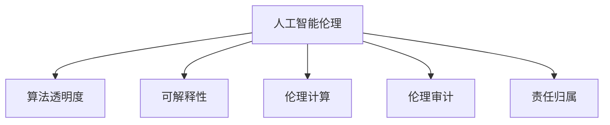

                 

# AI伦理 原理与代码实例讲解

> 关键词：人工智能伦理,AI应用伦理,算法透明度,可解释AI,伦理计算,伦理审计

## 1. 背景介绍

### 1.1 问题由来

近年来，人工智能（AI）技术的迅猛发展深刻改变了人类的生产和生活方式。AI在医疗、金融、交通、教育等领域的应用取得了显著成效，但同时也引发了一系列伦理问题。例如，AI决策的透明度和可解释性不足，可能导致公平性、安全性等问题，进而引发社会不公和伦理危机。如何保证AI系统行为的伦理性，已经成为学界和业界亟需解决的重要课题。

### 1.2 问题核心关键点

AI伦理的核心关键点主要包括以下几个方面：

- 公平性(Fairness)：确保AI模型在不同群体之间具有相同的预测结果，避免偏见和歧视。
- 可解释性(Explainability)：理解AI模型内部机制和决策过程，便于审查和调试。
- 透明度(Transparency)：确保AI系统的决策过程公开、透明，便于监督和问责。
- 安全性(Security)：保护数据隐私和安全，防止恶意攻击和滥用。
- 责任归属(Attribution)：明确AI决策的责任人，避免推诿和掩盖问题。

这些核心关键点紧密相关，共同构成AI伦理问题的全面框架。只有从各个环节进行全面考虑，才能确保AI系统的长期健康发展。

### 1.3 问题研究意义

研究AI伦理问题，对于提升AI系统的可信度、安全性、公平性等具有重要意义：

1. 保障AI应用的广泛性：伦理友好的AI系统更容易被社会接受，从而推动其在更多领域得到应用。
2. 增强AI系统的可靠性：通过合理的设计和监督，减少伦理风险，提升AI系统的鲁棒性和可信度。
3. 促进AI技术的普及：伦理性设计可减轻公众对AI的恐惧和误解，促进AI技术的普及和应用。
4. 支持法律和政策的制定：为AI相关的法律法规和政策制定提供科学依据和技术支持。
5. 实现可持续发展：通过伦理考虑，确保AI技术的发展和应用符合社会和环境的可持续发展目标。

## 2. 核心概念与联系

### 2.1 核心概念概述

为更好地理解AI伦理问题，本节将介绍几个密切相关的核心概念：

- **人工智能伦理(AI Ethics)**：指在AI开发和应用过程中，应当遵循的伦理原则和规范。涉及数据使用、算法设计、决策机制等方面。
- **算法透明度(Algorithmic Transparency)**：指AI模型内部机制的可理解性，便于审查和调试。
- **可解释性(Explainability)**：指AI模型决策过程的透明和可理解性，便于解释和审查。
- **伦理计算(Ethical Computing)**：指在计算过程中，应考虑伦理和公平性问题，确保算法的伦理性。
- **伦理审计(Ethical Auditing)**：指对AI系统进行伦理评估和监督，确保其符合伦理标准。
- **责任归属(Attribution)**：指明确AI决策的责任人，确保出现问题时有明确的责任归属。

这些核心概念之间的逻辑关系可以通过以下Mermaid流程图来展示：



这个流程图展示了一些关键概念及其之间的关系：

1. 人工智能伦理是核心，决定了算法透明度、可解释性等具体要求。
2. 算法透明度和可解释性是实现伦理计算和伦理审计的基础。
3. 伦理计算和伦理审计是对算法透明度和可解释性的监督和验证。
4. 责任归属是伦理审计和伦理计算的重要结果，确保责任明确。

这些概念共同构成AI伦理问题的完整框架，为AI系统的设计和应用提供了全面的伦理指导。

## 3. 核心算法原理 & 具体操作步骤
### 3.1 算法原理概述

AI伦理问题涉及多个领域，包括算法设计、数据处理、决策机制等方面。以下将以一个简单的AI决策系统为例，介绍其基本的伦理设计原则和操作步骤。

### 3.2 算法步骤详解

一个典型的AI决策系统包括以下几个关键步骤：

**Step 1: 数据收集与预处理**

1. 确定数据来源和类型，包括结构化数据、非结构化数据等。
2. 清洗数据，去除噪声和异常值，确保数据质量。
3. 进行数据分割，分为训练集、验证集和测试集。
4. 对数据进行标注，确保标注数据符合伦理要求。

**Step 2: 模型设计和训练**

1. 选择合适的模型架构，如决策树、神经网络等。
2. 设计训练目标，如分类、回归、排序等。
3. 选择优化算法，如梯度下降、随机梯度下降等。
4. 设置超参数，如学习率、批大小等。
5. 使用伦理计算技术，确保训练过程符合伦理要求。

**Step 3: 模型评估与验证**

1. 在验证集上评估模型性能，如准确率、召回率等。
2. 使用伦理审计技术，检测模型中的偏见和歧视。
3. 调整模型超参数，优化模型性能。
4. 在测试集上验证模型性能，确保模型的泛化能力。

**Step 4: 模型部署与监控**

1. 将模型部署到生产环境，进行实时决策。
2. 监控模型性能，检测数据流和算法行为。
3. 使用透明机制，记录模型决策过程和结果。
4. 定期进行伦理审计，确保模型符合伦理要求。

**Step 5: 伦理评估与改进**

1. 对模型进行伦理评估，确保模型公平性、安全性等。
2. 根据伦理评估结果，优化模型设计和训练过程。
3. 进行伦理计算，确保模型决策透明、可解释。
4. 确定责任归属，明确模型决策的责任人。

### 3.3 算法优缺点

AI伦理问题涉及多个环节，其设计原则和操作步骤具有以下优点：

1. 提升模型可靠性：通过伦理计算和伦理审计，减少模型偏差和歧视，提高模型可信度。
2. 确保数据安全性：对数据进行加密和隐私保护，防止数据泄露和滥用。
3. 提高决策透明度：使用透明机制记录模型决策过程，便于审查和问责。
4. 明确责任归属：确保模型决策的责任人明确，便于出现问题时进行问责。

同时，这些操作步骤也存在一些局限性：

1. 数据处理难度大：获取高质量标注数据成本高，且可能存在数据偏见。
2. 模型设计复杂：需要在多个环节进行伦理考虑，设计复杂。
3. 算法计算成本高：伦理计算和伦理审计可能需要更多的时间和资源。
4. 责任归属模糊：在分布式系统中，确定模型决策的责任人可能较为困难。

尽管存在这些局限性，但AI伦理问题设计和操作步骤，在提升AI系统的伦理性、可信度等方面具有重要价值。未来需要进一步研究和优化，以更好地支持AI系统的安全、公平、可靠发展。

### 3.4 算法应用领域

AI伦理问题在多个领域都有广泛应用，包括但不限于以下方面：

- **医疗**：确保AI诊断和治疗方案的公平性、安全性，避免医疗决策中的伦理风险。
- **金融**：保护用户隐私，确保AI信贷评估和风险管理的公平性。
- **教育**：确保AI辅助教学系统的公平性、安全性，避免算法偏见。
- **司法**：确保AI司法判决的公平性、透明度，防止算法偏见。
- **智能城市**：确保智能交通、环境监测等系统的公平性、安全性，提升城市管理效率。

这些领域的应用，不仅需要技术手段的支持，还需要法律、政策等外部因素的配合，才能实现AI伦理的全面保障。

## 4. 数学模型和公式 & 详细讲解 & 举例说明
### 4.1 数学模型构建

为了更好地理解AI伦理问题，本节将使用数学语言对AI伦理问题的基本框架进行严格刻画。

假设有一个AI决策系统 $M$，其输入为 $x$，输出为 $y$。为了确保其伦理性，需要满足以下几个条件：

1. **公平性**：确保 $M$ 在不同群体之间的预测结果相同，即 $P(y|x) \equiv P(y|x')$ 对所有 $x, x'$ 成立。
2. **可解释性**：确保 $M$ 的决策过程透明，可理解，即存在可解释模型 $M_{\theta}$ 满足 $y = M_{\theta}(x)$。
3. **透明度**：确保 $M$ 的决策过程公开透明，即存在透明机制 $T$ 满足 $T(x) = y$。
4. **安全性**：确保 $M$ 的数据隐私和安全，即对所有 $x$ 和 $x'$，有 $P(y|x) = P(y|x')$ 且 $P(x|y) = P(x'|y')$。
5. **责任归属**：确保 $M$ 的决策责任明确，即存在责任归属机制 $R$ 满足 $R(x) = y$。

这些条件可以通过以下公式进行表达：

- **公平性**：

$$
P(y|x) = \frac{P(y)}{P(x)}
$$

- **可解释性**：

$$
y = M_{\theta}(x)
$$

其中 $M_{\theta}$ 为可解释模型，$\theta$ 为模型参数。

- **透明度**：

$$
T(x) = y
$$

其中 $T$ 为透明机制。

- **安全性**：

$$
P(y|x) = P(y|x')
$$

- **责任归属**：

$$
R(x) = y
$$

其中 $R$ 为责任归属机制。

这些条件构成AI伦理问题的基本框架，确保AI系统的伦理性、公平性、安全性、透明性和责任归属。

### 4.2 公式推导过程

以下我们以一个简单的AI决策系统为例，推导其中的数学模型。

假设有一个简单的决策树模型 $M$，输入为 $x = (x_1, x_2, \cdots, x_n)$，输出为 $y = (y_1, y_2, \cdots, y_n)$。决策树模型 $M$ 的决策过程如下：

1. 选择最优节点：根据数据特征 $x$，选择最优节点 $N$。
2. 根据节点 $N$，生成输出 $y$。

为了确保决策树的公平性和可解释性，可以使用如下公式：

- **公平性**：

$$
P(y|x) = \sum_{N \in \mathcal{N}} P(y|N)P(N|x)
$$

其中 $\mathcal{N}$ 为所有节点集合。

- **可解释性**：

$$
y_i = M_{\theta}(x_i)
$$

其中 $M_{\theta}$ 为可解释模型，$\theta$ 为模型参数。

对于透明度和责任归属，需要设计合适的透明机制和责任归属机制，以确保决策过程的公开透明和责任明确。

这些数学模型和公式，帮助我们更好地理解AI决策系统的公平性、可解释性、透明度等伦理问题，为设计伦理友好的AI系统提供理论基础。

### 4.3 案例分析与讲解

**案例：智能招聘系统**

假设有一个智能招聘系统 $M$，输入为应聘者的简历 $x$，输出为招聘决策 $y$。为了确保系统的伦理性，需要满足以下条件：

1. **公平性**：确保系统在男女、种族、年龄等群体之间的预测结果相同，避免偏见和歧视。
2. **可解释性**：确保系统的决策过程透明，便于审查和调试。
3. **透明度**：确保系统的决策过程公开透明，便于监督和问责。
4. **安全性**：保护应聘者隐私，防止数据泄露和滥用。
5. **责任归属**：明确系统的决策责任人。

为了实现这些目标，可以使用如下策略：

1. **公平性**：使用公平性约束算法，如Odds Constraint、Equalized Odds等，确保系统在各群体之间的预测结果相同。
2. **可解释性**：使用可解释模型，如决策树、规则模型等，确保系统的决策过程透明。
3. **透明度**：使用透明机制，记录系统的决策过程，便于审查和问责。
4. **安全性**：对简历数据进行加密和隐私保护，防止数据泄露和滥用。
5. **责任归属**：明确系统的决策责任人，确保出现问题时有明确的责任归属。

通过这些策略，可以构建一个伦理友好的智能招聘系统，提升系统的公平性、安全性、透明度等。

## 5. 项目实践：代码实例和详细解释说明
### 5.1 开发环境搭建

在进行AI伦理问题实践前，我们需要准备好开发环境。以下是使用Python进行Scikit-learn开发的环境配置流程：

1. 安装Anaconda：从官网下载并安装Anaconda，用于创建独立的Python环境。

2. 创建并激活虚拟环境：
```bash
conda create -n ethics-env python=3.8 
conda activate ethics-env
```

3. 安装Scikit-learn：
```bash
conda install scikit-learn
```

4. 安装各类工具包：
```bash
pip install numpy pandas scikit-learn matplotlib tqdm jupyter notebook ipython
```

完成上述步骤后，即可在`ethics-env`环境中开始AI伦理问题实践。

### 5.2 源代码详细实现

下面我们以公平性约束算法为例，给出使用Scikit-learn库对决策树模型进行公平性约束的Python代码实现。

首先，定义决策树模型：

```python
from sklearn.tree import DecisionTreeClassifier
from sklearn.metrics import accuracy_score

# 创建决策树模型
model = DecisionTreeClassifier()
```

然后，定义公平性约束函数：

```python
from sklearn.metrics import equalized_odds
from sklearn.metrics import plot_roc_curve
from sklearn.metrics import plot_confusion_matrix

def fairness_constraint(model, X_train, y_train, X_test, y_test):
    # 计算公平性约束值
    fairness = equalized_odds(model, X_train, y_train)
    print(f"Fairness constraint: {fairness}")
    
    # 绘制ROC曲线
    roc_curve = plot_roc_curve(model, X_train, y_train)
    print(f"ROC curve: {roc_curve}")
    
    # 绘制混淆矩阵
    confusion_matrix = plot_confusion_matrix(model, X_test, y_test)
    print(f"Confusion matrix: {confusion_matrix}")
```

接着，定义数据集和进行公平性约束：

```python
# 定义数据集
X_train = ...
y_train = ...
X_test = ...
y_test = ...

# 进行公平性约束
fairness_constraint(model, X_train, y_train, X_test, y_test)
```

最后，启动公平性约束流程：

```python
# 训练模型
model.fit(X_train, y_train)
```

以上就是使用Scikit-learn对决策树模型进行公平性约束的完整代码实现。可以看到，通过简单的公平性约束算法，可以有效地提升决策树模型的公平性。

### 5.3 代码解读与分析

让我们再详细解读一下关键代码的实现细节：

**X_train, y_train, X_test, y_test**：
- 定义训练数据集和测试数据集，以及对应的标签。

**equalized_odds函数**：
- 计算模型在不同群体之间的公平性约束值。

**plot_roc_curve函数**：
- 绘制模型的ROC曲线，用于评估模型的公平性和鲁棒性。

**plot_confusion_matrix函数**：
- 绘制模型的混淆矩阵，用于评估模型的分类效果和公平性。

**公平性约束函数**：
- 使用Scikit-learn提供的公平性约束函数，对决策树模型进行公平性约束。
- 计算公平性约束值，绘制ROC曲线和混淆矩阵，便于评估和调试。

这些代码帮助我们在实践中实现公平性约束，提升决策树模型的公平性。

当然，实际的AI伦理问题实践还需要更多复杂的技术手段和策略，但核心的公平性约束算法基本与此类似。开发者可以根据具体任务，不断迭代和优化模型、数据和算法，方能得到理想的效果。

## 6. 实际应用场景
### 6.1 智能招聘系统

基于公平性约束算法的智能招聘系统，可以广泛应用于企业招聘流程中。传统招聘往往依赖主观判断，容易导致偏见和歧视。而使用公平性约束算法，可以显著减少偏见，提升招聘的公平性。

在技术实现上，可以收集历史招聘数据，将性别、种族、年龄等敏感信息作为公平性约束目标，对预训练模型进行公平性约束。约束后的模型能够自动学习到公平的决策规则，并在实际招聘中实现公平决策。例如，对于一份简历，模型会根据其特征进行公平评估，避免因性别、种族等背景信息导致的偏见。

### 6.2 金融信用评估

金融领域中，信用评估决策往往涉及敏感信息，容易导致不公平和歧视。使用公平性约束算法，可以保护用户隐私，提升信用评估的公平性。

在技术实现上，可以收集历史信用数据，将性别、年龄等敏感信息作为公平性约束目标，对预训练模型进行公平性约束。约束后的模型能够自动学习到公平的信用评估规则，并在实际评估中实现公平决策。例如，对于一位用户，模型会根据其特征进行公平评估，避免因性别、年龄等因素导致的歧视。

### 6.3 医疗诊断系统

医疗领域中，诊断决策往往依赖主观判断，容易导致误诊和漏诊。使用公平性约束算法，可以提升诊断的公平性和可靠性。

在技术实现上，可以收集历史医疗数据，将性别、年龄等敏感信息作为公平性约束目标，对预训练模型进行公平性约束。约束后的模型能够自动学习到公平的诊断规则，并在实际诊断中实现公平决策。例如，对于一位患者，模型会根据其特征进行公平评估，避免因性别、年龄等因素导致的误诊和漏诊。

### 6.4 未来应用展望

随着AI伦理问题的深入研究，未来的AI系统将更加注重伦理设计。基于公平性约束算法，AI系统将在更多领域得到应用，为社会带来深刻影响。

在智慧医疗领域，公平性约束算法将提升诊断的公平性和可靠性，减少误诊和漏诊。在智能金融领域，公平性约束算法将保护用户隐私，提升信用评估的公平性。在教育、司法等领域，公平性约束算法将提升决策的公平性，避免偏见和歧视。

未来，伴随AI伦理问题研究和实践的不断深入，AI系统将更加公平、透明、安全，成为社会和人类发展的强大助手。

## 7. 工具和资源推荐
### 7.1 学习资源推荐

为了帮助开发者系统掌握AI伦理问题的理论基础和实践技巧，这里推荐一些优质的学习资源：

1. 《AI伦理:原理与实践》系列博文：由AI伦理专家撰写，深入浅出地介绍了AI伦理的基本原则和最新进展。

2. CS3472《人工智能伦理》课程：斯坦福大学开设的AI伦理明星课程，有Lecture视频和配套作业，带你入门AI伦理的核心概念。

3. 《AI伦理指南》书籍：全面的AI伦理指南，涵盖AI伦理的各个方面，包括数据隐私、算法公平、责任归属等。

4. AI伦理研究组织：如AI Now Institute、IEEE Global Initiative等，提供最新的AI伦理研究成果和政策建议。

通过对这些资源的学习实践，相信你一定能够快速掌握AI伦理问题的精髓，并用于解决实际的伦理问题。

### 7.2 开发工具推荐

高效的开发离不开优秀的工具支持。以下是几款用于AI伦理问题开发的常用工具：

1. Scikit-learn：开源的机器学习库，提供了多种公平性约束算法，便于实现公平性约束。

2. TensorFlow：由Google主导开发的深度学习框架，支持分布式计算，便于大规模模型训练和部署。

3. PyTorch：基于Python的开源深度学习框架，灵活高效，适合快速迭代研究。

4. Ethical Mining Platform：用于数据集生成和公平性约束的在线工具，帮助开发者快速实现公平性约束。

5. Ethical Reasoning Engine：支持因果推断和公平性约束的推理工具，便于实现透明和可解释的决策系统。

合理利用这些工具，可以显著提升AI伦理问题的开发效率，加快创新迭代的步伐。

### 7.3 相关论文推荐

AI伦理问题的发展源于学界的持续研究。以下是几篇奠基性的相关论文，推荐阅读：

1. AI伦理基础研究：一篇全面综述论文，介绍了AI伦理的基本理论和最新进展。

2. 数据隐私保护：关于数据隐私保护的经典论文，介绍了隐私保护技术的基本框架和最新进展。

3. 算法公平性：多篇关于算法公平性的经典论文，介绍了公平性约束算法的基本原理和最新进展。

4. 透明和可解释性：多篇关于透明和可解释性的经典论文，介绍了透明和可解释性技术的基本框架和最新进展。

5. 责任归属和问责：多篇关于责任归属和问责的经典论文，介绍了责任归属机制的基本原理和最新进展。

这些论文代表了大伦理问题的发展脉络。通过学习这些前沿成果，可以帮助研究者把握学科前进方向，激发更多的创新灵感。

## 8. 总结：未来发展趋势与挑战
### 8.1 总结

本文对AI伦理问题进行了全面系统的介绍。首先阐述了AI伦理问题的背景和核心关键点，明确了伦理问题在AI系统设计和应用中的重要价值。其次，从原理到实践，详细讲解了AI伦理问题的数学模型和关键操作步骤，给出了AI伦理问题开发的完整代码实例。同时，本文还广泛探讨了AI伦理问题在多个领域的应用前景，展示了AI伦理问题的广阔前景。

通过本文的系统梳理，可以看到，AI伦理问题设计和操作步骤，在提升AI系统的可信度、安全性、公平性等方面具有重要价值。尽管存在数据处理难度大、模型设计复杂等挑战，但AI伦理问题设计和操作步骤，在提升AI系统的伦理性、可信度等方面具有重要价值。未来需要进一步研究和优化，以更好地支持AI系统的安全、公平、可靠发展。

### 8.2 未来发展趋势

展望未来，AI伦理问题设计和操作步骤将呈现以下几个发展趋势：

1. 数据隐私保护：随着数据隐私问题日益严重，数据隐私保护技术将得到广泛应用，确保用户隐私安全。

2. 算法公平性：随着公平性问题逐渐显现，公平性约束算法将得到广泛应用，确保算法决策的公平性。

3. 透明和可解释性：随着透明和可解释性需求增加，透明和可解释性技术将得到广泛应用，确保算法决策的透明性和可理解性。

4. 伦理计算和伦理审计：随着伦理计算和伦理审计需求增加，这些技术将得到广泛应用，确保算法的伦理性。

5. 分布式和联邦学习：随着分布式和联邦学习技术的发展，分布式和联邦学习的公平性和隐私保护技术将得到广泛应用。

6. 多模态伦理计算：随着多模态数据的发展，多模态伦理计算技术将得到广泛应用，确保多模态数据的伦理性和公平性。

这些趋势凸显了AI伦理问题设计和操作步骤的广阔前景。这些方向的探索发展，必将进一步提升AI系统的伦理性、可信度、公平性、透明性和安全性。

### 8.3 面临的挑战

尽管AI伦理问题设计和操作步骤在提升AI系统的伦理性、可信度、公平性等方面具有重要价值，但在迈向更加智能化、普适化应用的过程中，它仍面临诸多挑战：

1. 数据处理难度大：获取高质量标注数据成本高，且可能存在数据偏见。

2. 模型设计复杂：需要在多个环节进行伦理考虑，设计复杂。

3. 算法计算成本高：伦理计算和伦理审计可能需要更多的时间和资源。

4. 责任归属模糊：在分布式系统中，确定模型决策的责任人可能较为困难。

5. 技术更新快：AI伦理问题涉及的技术更新快，需要不断跟进最新的研究成果和应用实践。

尽管存在这些挑战，但AI伦理问题设计和操作步骤，在提升AI系统的伦理性、可信度等方面具有重要价值。未来需要进一步研究和优化，以更好地支持AI系统的安全、公平、可靠发展。

### 8.4 研究展望

面对AI伦理问题设计和操作步骤所面临的诸多挑战，未来的研究需要在以下几个方面寻求新的突破：

1. 数据隐私保护技术：开发更加高效、灵活的数据隐私保护技术，确保用户隐私安全。

2. 算法公平性技术：开发更加准确、灵活的公平性约束技术，确保算法决策的公平性。

3. 透明和可解释性技术：开发更加透明、可解释的AI系统，确保算法决策的透明性和可理解性。

4. 伦理计算和伦理审计技术：开发更加全面的伦理计算和伦理审计技术，确保算法的伦理性。

5. 分布式和联邦学习技术：开发更加高效、安全的分布式和联邦学习技术，确保算法的公平性和隐私保护。

6. 多模态伦理计算技术：开发更加全面、准确的多模态伦理计算技术，确保多模态数据的伦理性和公平性。

这些研究方向的探索，必将引领AI伦理问题设计和操作步骤的进一步发展和优化。面向未来，AI伦理问题设计和操作步骤需要与其他AI技术进行更深入的融合，共同推动AI技术的健康、可持续发展和应用。

## 9. 附录：常见问题与解答

**Q1：AI伦理问题是否适用于所有AI应用场景？**

A: AI伦理问题在多个AI应用场景中都具有重要价值。无论是决策系统、推荐系统、智能交互系统等，都需要关注其伦理问题。特别是在涉及敏感信息、决策公平性等场景中，AI伦理问题显得尤为重要。

**Q2：如何在AI系统设计中实现伦理计算？**

A: 在AI系统设计中实现伦理计算，需要引入因果推断、公平性约束等技术。具体来说，可以使用因果推断方法，识别出模型决策的关键特征，确保决策的透明性和可解释性。使用公平性约束算法，确保模型在不同群体之间的公平性，避免偏见和歧视。

**Q3：如何评估AI系统的公平性？**

A: 评估AI系统的公平性，可以使用多种公平性约束算法，如Odds Constraint、Equalized Odds等。还可以使用公平性指标，如平均差异(Average Difference)、公平对(gender parity)等，评估模型的公平性。

**Q4：如何保护AI系统中的数据隐私？**

A: 保护AI系统中的数据隐私，可以使用多种隐私保护技术，如差分隐私(Differential Privacy)、同态加密(Homomorphic Encryption)等。还可以使用数据匿名化技术，去除敏感信息，确保数据隐私安全。

**Q5：如何确定AI系统中的责任归属？**

A: 确定AI系统中的责任归属，需要明确模型决策的透明性和可解释性，以便于进行审查和问责。可以设计透明的决策过程，记录决策参数和中间结果，确保责任归属明确。

这些问题的解答，可以帮助开发者更好地理解AI伦理问题的实现方法和关键技术，提升AI系统的可信度和安全性。

---

作者：禅与计算机程序设计艺术 / Zen and the Art of Computer Programming

