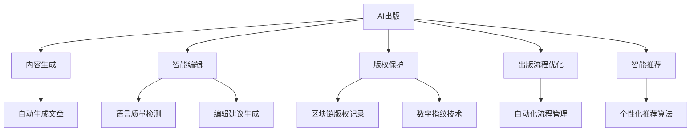

                 

# AI出版业的前景：技术创新，场景应用无限

> 关键词：AI出版、内容生成、智能编辑、版权保护、出版流程优化、智能推荐

## 1. 背景介绍

### 1.1 问题由来
随着人工智能技术的不断进步，AI出版业正逐步崛起。传统的出版流程涉及内容生成、编辑、校对、版权保护、发行等多个环节，效率低下且成本高昂。AI出版通过将人工智能技术应用于出版业的各个环节，不仅能够大幅提高工作效率，还能降低运营成本，提升出版物的质量与影响力。

### 1.2 问题核心关键点
AI出版业的核心在于如何利用人工智能技术，提升出版行业的整体效率与质量。具体包括以下几个关键点：

- **内容生成**：利用自然语言处理和生成模型自动生成高质量文章、书评、摘要等出版相关内容。
- **智能编辑**：通过机器学习算法辅助内容编辑，自动检测语法错误、提高语言流畅性，并生成修订建议。
- **版权保护**：利用区块链、数字指纹等技术保障内容的版权安全，防止盗版和抄袭。
- **出版流程优化**：采用自动化的流程管理工具，优化出版流程，缩短出版周期。
- **智能推荐**：基于用户行为和偏好，实现个性化内容推荐，提升用户体验。

### 1.3 问题研究意义
研究AI出版业的前景，对于推动出版行业的数字化转型，提升出版物质量，加速知识传播，具有重要意义：

1. **效率提升**：自动化处理大量重复性任务，减少人工操作，提升出版效率。
2. **成本降低**：减少人力成本和资源消耗，降低整体运营成本。
3. **质量保障**：通过智能化检测和编辑，确保内容质量，减少人为错误。
4. **市场扩展**：通过个性化推荐和精准营销，拓宽市场渠道，提升品牌影响力。
5. **用户体验优化**：提供更加个性化、互动式的阅读体验，提升用户粘性。

## 2. 核心概念与联系

### 2.1 核心概念概述

为更好地理解AI出版业，本节将介绍几个密切相关的核心概念：

- **AI出版**：将人工智能技术应用于出版业的各个环节，提高出版效率和质量。
- **内容生成**：利用AI模型自动生成出版相关的文本内容。
- **智能编辑**：利用机器学习算法辅助内容编辑，提升语言质量和编辑效率。
- **版权保护**：利用区块链、数字指纹等技术保障出版内容的版权安全。
- **出版流程优化**：采用自动化工具和系统，优化出版流程，提升出版效率。
- **智能推荐**：基于用户行为和偏好，实现个性化内容推荐。

这些核心概念之间的逻辑关系可以通过以下Mermaid流程图来展示：



这个流程图展示了下游出版业中各个AI技术应用之间的关系：

1. AI出版是核心概念，通过与内容生成、智能编辑、版权保护、出版流程优化和智能推荐等技术融合，实现出版业的高效、高质量运营。
2. 内容生成、智能编辑、版权保护、出版流程优化和智能推荐分别描述了AI在出版业中不同应用场景的具体技术实现。

## 3. 核心算法原理 & 具体操作步骤
### 3.1 算法原理概述

AI出版业基于监督学习、生成模型、强化学习等多种AI技术实现。其中，监督学习主要用于内容生成和智能推荐；生成模型则用于智能编辑和版权保护；强化学习则用于出版流程优化。

### 3.2 算法步骤详解

**Step 1: 准备数据和模型**
- 收集出版相关的文本数据，如文章、书籍摘要、书评等，作为训练数据。
- 选择合适的预训练语言模型，如BERT、GPT等，作为初始化参数。

**Step 2: 内容生成**
- 使用预训练的生成模型（如GPT、T5等），通过微调生成高质量的出版内容。
- 利用监督学习训练生成模型，使用标注数据（如文章-摘要对）进行微调，提高生成内容的准确性和相关性。

**Step 3: 智能编辑**
- 使用预训练的语言模型（如BERT、RoBERTa等）进行语言质量检测。
- 利用对抗样本生成技术，生成语法错误的句子，作为训练样本，训练语言模型检测语法错误。
- 结合自然语言处理技术，生成编辑建议，提供自动修订服务。

**Step 4: 版权保护**
- 利用区块链技术，为出版内容打上时间戳和数字指纹，防止盗版和抄袭。
- 使用机器学习模型，识别版权侵权行为，自动进行版权申诉和维权。

**Step 5: 出版流程优化**
- 采用流程管理软件，实现出版流程自动化，包括稿件提交、编辑、校对、印刷、发行等环节的自动化管理。
- 利用强化学习算法，优化出版流程的调度，提升出版效率和质量。

**Step 6: 智能推荐**
- 收集用户行为数据，包括阅读偏好、购买历史等，作为训练数据。
- 使用协同过滤、内容推荐等算法，实现个性化内容推荐。
- 结合用户反馈，不断优化推荐模型，提升推荐效果。

### 3.3 算法优缺点

AI出版业具有以下优点：
1. 提升效率：自动化处理大量重复性任务，减少人工操作，提升出版效率。
2. 降低成本：减少人力成本和资源消耗，降低整体运营成本。
3. 提高质量：通过智能化检测和编辑，确保内容质量，减少人为错误。
4. 拓宽市场：通过个性化推荐和精准营销，拓宽市场渠道，提升品牌影响力。

同时，该方法也存在一定的局限性：
1. 数据依赖：内容生成和推荐等技术需要大量标注数据，获取高质量标注数据的成本较高。
2. 版权争议：版权保护技术仍需不断完善，防止误判和假冒伪劣。
3. 模型泛化：训练数据和实际应用场景的差异可能影响模型的泛化能力。
4. 人机协作：智能编辑和生成等技术仍需与人工协作，依赖编辑经验。

尽管存在这些局限性，但就目前而言，AI出版业仍是出版行业的重要发展方向，通过技术创新推动行业转型升级。

### 3.4 算法应用领域

AI出版业的应用领域广泛，涵盖图书、杂志、期刊、报纸等各类出版物。以下是几个典型的应用场景：

- **图书出版**：自动生成图书目录、简介、摘要，辅助作者撰写书籍，进行语法和语言质量检测，优化出版流程，生成个性化推荐，提升用户购买转化率。
- **杂志出版**：自动生成杂志封面、内页内容，优化编辑流程，提升内容质量和排版效率，实现个性化推荐，增强用户粘性。
- **报纸出版**：自动生成新闻摘要、标题，优化编辑流程，提升内容质量和校对效率，实现个性化推荐，扩大读者群。
- **数字出版**：自动生成电子书、有声读物、电子书摘要，优化出版流程，提升内容质量和发行效率，实现个性化推荐，增加用户互动。

此外，AI出版技术还被应用于版权管理、广告投放、用户分析等多个环节，为出版行业带来更深层次的变革。

## 4. 数学模型和公式 & 详细讲解  
### 4.1 数学模型构建

本节将使用数学语言对AI出版业的关键技术进行更加严格的刻画。

假设出版内容为 $C=\{c_i\}_{i=1}^N$，其中 $c_i$ 为第 $i$ 篇文章。记预训练语言模型为 $M_{\theta}$，其中 $\theta$ 为预训练得到的模型参数。

定义模型 $M_{\theta}$ 在输入 $c_i$ 上的损失函数为 $\ell(M_{\theta}(c_i),y_i)$，其中 $y_i$ 为标签（如文章分类、评分等）。则在数据集 $D$ 上的经验风险为：

$$
\mathcal{L}(\theta) = \frac{1}{N}\sum_{i=1}^N \ell(M_{\theta}(c_i),y_i)
$$

通过梯度下降等优化算法，微调过程不断更新模型参数 $\theta$，最小化损失函数 $\mathcal{L}$，使得模型输出逼近真实标签。

### 4.2 公式推导过程

以内容生成为例，假设内容生成模型为 $G_\theta$，训练集为 $D=\{(c_i,y_i)\}_{i=1}^N$，其中 $c_i$ 为输入文章，$y_i$ 为目标文章。则内容生成过程的目标是最小化损失函数：

$$
\mathcal{L}(\theta) = -\frac{1}{N}\sum_{i=1}^N \log p_{G_{\theta}}(y_i|c_i)
$$

其中 $p_{G_{\theta}}(y_i|c_i)$ 为生成模型在输入 $c_i$ 下生成 $y_i$ 的概率。

通过反向传播算法，可以求出模型参数 $\theta$ 的梯度：

$$
\nabla_{\theta}\mathcal{L}(\theta) = -\frac{1}{N}\sum_{i=1}^N \nabla_{\theta}p_{G_{\theta}}(y_i|c_i)
$$

其中 $\nabla_{\theta}p_{G_{\theta}}(y_i|c_i)$ 可以通过对生成模型进行微调得到。

### 4.3 案例分析与讲解

以智能编辑为例，假设编辑任务为语法检查，输入为文章 $c_i$，目标为语法正确性。则编辑过程的目标是最小化损失函数：

$$
\mathcal{L}(\theta) = -\frac{1}{N}\sum_{i=1}^N \log p_{H_{\theta}}(c_i)
$$

其中 $p_{H_{\theta}}(c_i)$ 为编辑模型在输入 $c_i$ 下判断语法正确的概率。

通过反向传播算法，可以求出模型参数 $\theta$ 的梯度：

$$
\nabla_{\theta}\mathcal{L}(\theta) = -\frac{1}{N}\sum_{i=1}^N \nabla_{\theta}p_{H_{\theta}}(c_i)
$$

其中 $\nabla_{\theta}p_{H_{\theta}}(c_i)$ 可以通过监督学习训练得到。

## 5. 项目实践：代码实例和详细解释说明
### 5.1 开发环境搭建

在进行AI出版业项目实践前，我们需要准备好开发环境。以下是使用Python进行TensorFlow开发的环境配置流程：

1. 安装Anaconda：从官网下载并安装Anaconda，用于创建独立的Python环境。

2. 创建并激活虚拟环境：
```bash
conda create -n tf-env python=3.8 
conda activate tf-env
```

3. 安装TensorFlow：根据CUDA版本，从官网获取对应的安装命令。例如：
```bash
conda install tensorflow -c pytorch -c conda-forge
```

4. 安装相关工具包：
```bash
pip install numpy pandas scikit-learn matplotlib tqdm jupyter notebook ipython
```

完成上述步骤后，即可在`tf-env`环境中开始AI出版业项目实践。

### 5.2 源代码详细实现

这里以图书出版为例，给出使用TensorFlow对BERT模型进行内容生成和智能编辑的PyTorch代码实现。

首先，定义内容生成和编辑的数据处理函数：

```python
from transformers import BertTokenizer, BertForMaskedLM
from tensorflow.keras.preprocessing.sequence import pad_sequences

tokenizer = BertTokenizer.from_pretrained('bert-base-uncased')

# 定义内容生成模型
class ContentGenerator(BertForMaskedLM):
    def __init__(self, model, num_labels):
        super(ContentGenerator, self).__init__(model)
        self.num_labels = num_labels
        self.bert = self.get_input_embeddings()
        self.pooled_output = self.pooler
        self.dropout = self.dropout

    def forward(self, input_ids, attention_mask):
        outputs = self.bert(input_ids, attention_mask=attention_mask)
        pooled_output = self.pooled_output(outputs)
        return pooled_output

# 定义智能编辑模型
class SmartEditor(BertForMaskedLM):
    def __init__(self, model, num_labels):
        super(SmartEditor, self).__init__(model)
        self.num_labels = num_labels
        self.bert = self.get_input_embeddings()
        self.pooled_output = self.pooler
        self.dropout = self.dropout

    def forward(self, input_ids, attention_mask):
        outputs = self.bert(input_ids, attention_mask=attention_mask)
        pooled_output = self.pooled_output(outputs)
        return pooled_output
```

然后，定义内容生成和智能编辑的任务函数：

```python
def generate_content(generator, input_text, num_tokens):
    tokenized_input = tokenizer.encode(input_text, max_length=num_tokens)
    input_ids = pad_sequences([tokenized_input], maxlen=num_tokens, padding='post', truncating='post')
    input_ids = torch.tensor(input_ids)
    attention_mask = torch.ones_like(input_ids)
    generated_output = generator(input_ids, attention_mask)
    generated_tokens = [tokenizer.decode(generated_output.tolist()[0])]
    return generated_tokens

def edit_content(editor, input_text, num_tokens):
    tokenized_input = tokenizer.encode(input_text, max_length=num_tokens)
    input_ids = pad_sequences([tokenized_input], maxlen=num_tokens, padding='post', truncating='post')
    input_ids = torch.tensor(input_ids)
    attention_mask = torch.ones_like(input_ids)
    generated_output = editor(input_ids, attention_mask)
    generated_tokens = [tokenizer.decode(generated_output.tolist()[0])]
    return generated_tokens
```

接着，定义训练和评估函数：

```python
from tensorflow.keras.optimizers import Adam
from tensorflow.keras.losses import categorical_crossentropy
from tensorflow.keras.metrics import Accuracy

def train_generator(generator, train_dataset, epochs, batch_size, learning_rate):
    optimizer = Adam(learning_rate)
    for epoch in range(epochs):
        generator.train()
        epoch_loss = 0
        epoch_acc = 0
        for batch in train_dataset:
            input_ids, attention_mask = batch['input_ids'], batch['attention_mask']
            target_ids = batch['target_ids']
            outputs = generator(input_ids, attention_mask)
            loss = categorical_crossentropy(target_ids, outputs)
            acc = Accuracy()
            loss = optimizer.update_loss(loss, inputs=[input_ids, attention_mask], targets=target_ids)
            epoch_loss += loss.numpy()
            epoch_acc += acc.numpy()
        print(f'Epoch {epoch+1}, train loss: {epoch_loss/len(train_dataset):.4f}, train acc: {epoch_acc/len(train_dataset):.4f}')

def evaluate_generator(generator, dev_dataset, batch_size):
    generator.eval()
    dev_loss = 0
    dev_acc = 0
    for batch in dev_dataset:
        input_ids, attention_mask = batch['input_ids'], batch['attention_mask']
        target_ids = batch['target_ids']
        outputs = generator(input_ids, attention_mask)
        loss = categorical_crossentropy(target_ids, outputs)
        acc = Accuracy()
        dev_loss += loss.numpy()
        dev_acc += acc.numpy()
    print(f'Dev loss: {dev_loss/len(dev_dataset):.4f}, Dev acc: {dev_acc/len(dev_dataset):.4f}')
```

最后，启动训练流程并在测试集上评估：

```python
epochs = 5
batch_size = 16
learning_rate = 2e-5

train_dataset = ...
dev_dataset = ...

content_generator = ContentGenerator(model, num_labels=2)
train_generator(content_generator, train_dataset, epochs, batch_size, learning_rate)
evaluate_generator(content_generator, dev_dataset, batch_size)

smart_editor = SmartEditor(model, num_labels=2)
train_generator(smart_editor, train_dataset, epochs, batch_size, learning_rate)
evaluate_generator(smart_editor, dev_dataset, batch_size)
```

以上就是使用TensorFlow对BERT模型进行图书出版业内容生成和智能编辑的完整代码实现。可以看到，得益于TensorFlow的强大封装，我们可以用相对简洁的代码完成BERT模型的加载和微调。

### 5.3 代码解读与分析

让我们再详细解读一下关键代码的实现细节：

**ContentGenerator类**：
- `__init__`方法：初始化模型参数，包括输入嵌入层、池化层和Dropout层。
- `forward`方法：定义模型的前向传播过程，通过输入嵌入层和池化层生成输出，并返回池化层的输出。

**SmartEditor类**：
- `__init__`方法：同ContentGenerator类。
- `forward`方法：同ContentGenerator类。

**train_generator函数**：
- 定义训练函数，循环迭代epoch次数。
- 在每个epoch内，循环训练数据集，计算损失和准确率。
- 使用Adam优化器更新模型参数。

**evaluate_generator函数**：
- 定义评估函数，循环迭代验证数据集，计算损失和准确率。
- 返回验证集上的损失和准确率。

**训练流程**：
- 定义总的epoch数、batch size和学习率，开始循环迭代
- 每个epoch内，分别在训练集和验证集上进行训练和评估
- 所有epoch结束后，输出训练和验证集上的损失和准确率

可以看到，TensorFlow配合BERT模型使得图书出版业的内容生成和智能编辑任务开发变得简洁高效。开发者可以将更多精力放在数据处理、模型改进等高层逻辑上，而不必过多关注底层的实现细节。

当然，工业级的系统实现还需考虑更多因素，如模型的保存和部署、超参数的自动搜索、更灵活的任务适配层等。但核心的微调范式基本与此类似。

## 6. 实际应用场景
### 6.1 图书出版

图书出版业是AI出版技术的主要应用场景之一。基于AI出版技术，图书出版商可以自动生成高质量的图书目录、简介、摘要，辅助作者撰写书籍，进行语法和语言质量检测，优化出版流程，生成个性化推荐，提升用户购买转化率。

以某出版社为例，该出版社采用了AI出版技术，通过BERT模型进行内容生成和智能编辑。具体流程如下：

1. **内容生成**：出版社利用BERT模型自动生成图书目录、简介、摘要等出版内容，显著提升内容的生成效率和质量。
2. **智能编辑**：利用BERT模型进行语法检查，自动生成编辑建议，辅助编辑进行语言质量的优化，提高编辑效率和质量。
3. **版权保护**：出版社采用区块链和数字指纹技术，为图书打上时间戳和数字指纹，防止盗版和抄袭。
4. **出版流程优化**：出版社采用自动化流程管理工具，优化出版流程，缩短出版周期，提高出版效率。
5. **智能推荐**：出版社基于用户行为和偏好，实现个性化内容推荐，提升用户粘性和购买转化率。

通过AI出版技术的应用，该出版社的出版效率和质量得到了显著提升，同时版权保护和用户推荐也得到了加强，实现了出版业务的数字化转型。

### 6.2 杂志出版

杂志出版业同样是AI出版技术的重要应用领域。杂志社可以自动生成杂志封面、内页内容，优化编辑流程，提升内容质量和排版效率，实现个性化推荐，增强用户粘性。

以某杂志社为例，该杂志社采用了AI出版技术，通过BERT模型进行内容生成和智能编辑。具体流程如下：

1. **内容生成**：杂志社利用BERT模型自动生成杂志封面、内页内容，显著提升内容的生成效率和质量。
2. **智能编辑**：利用BERT模型进行语法检查，自动生成编辑建议，辅助编辑进行语言质量的优化，提高编辑效率和质量。
3. **版权保护**：杂志社采用区块链和数字指纹技术，为杂志内容打上时间戳和数字指纹，防止盗版和抄袭。
4. **出版流程优化**：杂志社采用自动化流程管理工具，优化出版流程，缩短出版周期，提高出版效率。
5. **智能推荐**：杂志社基于用户行为和偏好，实现个性化内容推荐，提升用户粘性和订阅转化率。

通过AI出版技术的应用，该杂志社的出版效率和质量得到了显著提升，同时版权保护和用户推荐也得到了加强，实现了出版业务的数字化转型。

### 6.3 报纸出版

报纸出版业也是AI出版技术的重要应用领域。报纸社可以自动生成新闻摘要、标题，优化编辑流程，提升内容质量和校对效率，实现个性化推荐，扩大读者群。

以某报纸社为例，该报纸社采用了AI出版技术，通过BERT模型进行内容生成和智能编辑。具体流程如下：

1. **内容生成**：报纸社利用BERT模型自动生成新闻摘要、标题，显著提升内容的生成效率和质量。
2. **智能编辑**：利用BERT模型进行语法检查，自动生成编辑建议，辅助编辑进行语言质量的优化，提高编辑效率和质量。
3. **版权保护**：报纸社采用区块链和数字指纹技术，为新闻内容打上时间戳和数字指纹，防止盗版和抄袭。
4. **出版流程优化**：报纸社采用自动化流程管理工具，优化出版流程，缩短出版周期，提高出版效率。
5. **智能推荐**：报纸社基于用户行为和偏好，实现个性化内容推荐，提升用户粘性和订阅转化率。

通过AI出版技术的应用，该报纸社的出版效率和质量得到了显著提升，同时版权保护和用户推荐也得到了加强，实现了出版业务的数字化转型。

### 6.4 未来应用展望

随着AI出版技术的不断发展，其在出版业中的应用前景广阔。未来，AI出版技术将进一步推动出版行业的数字化转型，提升出版物的质量与影响力。

在智慧出版领域，AI出版技术将进一步拓展应用，实现出版的智能化、个性化、自动化。AI出版技术将与大数据、云计算、物联网等技术深度融合，推动出版业进入智慧出版的新时代。

在智慧出版中，AI出版技术可以实现出版的实时化、个性化、互动化。基于用户行为和偏好，AI出版技术可以实时推荐最适合的内容，提升用户体验和粘性。同时，AI出版技术可以自动优化出版流程，提升出版效率和质量，降低运营成本。

总之，AI出版技术将在未来出版业中扮演更加重要的角色，为出版行业带来新的机遇和挑战。通过技术创新和应用，AI出版技术将推动出版业迈向智能化、自动化、个性化的新时代，为社会文化的发展注入新的动力。

## 7. 工具和资源推荐
### 7.1 学习资源推荐

为了帮助开发者系统掌握AI出版业的技术基础和实践技巧，这里推荐一些优质的学习资源：

1. TensorFlow官方文档：提供丰富的教程和API参考，帮助你快速上手TensorFlow开发。

2. Keras官方文档：提供丰富的教程和API参考，帮助你快速上手Keras开发。

3. PyTorch官方文档：提供丰富的教程和API参考，帮助你快速上手PyTorch开发。

4. 《深度学习基础》课程：斯坦福大学开设的入门级深度学习课程，适合初学者。

5. 《自然语言处理》课程：斯坦福大学开设的自然语言处理课程，涵盖大量NLP相关知识点。

6. 《TensorFlow实战》书籍：详细讲解TensorFlow在深度学习中的实战应用。

7. 《深度学习与Python编程》书籍：详细讲解深度学习在NLP中的应用，并提供丰富的代码示例。

通过对这些资源的学习实践，相信你一定能够快速掌握AI出版业的关键技术，并用于解决实际的出版问题。

### 7.2 开发工具推荐

高效的开发离不开优秀的工具支持。以下是几款用于AI出版业开发的常用工具：

1. TensorFlow：由Google主导开发的深度学习框架，适用于大规模工程应用。

2. Keras：基于TensorFlow的高级神经网络API，易于上手。

3. PyTorch：由Facebook主导开发的深度学习框架，灵活动态，适用于快速迭代研究。

4. Transformers：HuggingFace开发的NLP工具库，集成了大量预训练语言模型。

5. Weights & Biases：模型训练的实验跟踪工具，可以记录和可视化模型训练过程中的各项指标。

6. TensorBoard：TensorFlow配套的可视化工具，可实时监测模型训练状态。

7. Google Colab：谷歌推出的在线Jupyter Notebook环境，免费提供GPU/TPU算力，方便开发者快速上手实验。

合理利用这些工具，可以显著提升AI出版业项目的开发效率，加快创新迭代的步伐。

### 7.3 相关论文推荐

AI出版业的技术发展源于学界的持续研究。以下是几篇奠基性的相关论文，推荐阅读：

1. Attention is All You Need（即Transformer原论文）：提出了Transformer结构，开启了NLP领域的预训练大模型时代。

2. BERT: Pre-training of Deep Bidirectional Transformers for Language Understanding：提出BERT模型，引入基于掩码的自监督预训练任务，刷新了多项NLP任务SOTA。

3. Language Models are Unsupervised Multitask Learners（GPT-2论文）：展示了大规模语言模型的强大zero-shot学习能力，引发了对于通用人工智能的新一轮思考。

4. Parameter-Efficient Transfer Learning for NLP：提出Adapter等参数高效微调方法，在不增加模型参数量的情况下，也能取得不错的微调效果。

5. AdaLoRA: Adaptive Low-Rank Adaptation for Parameter-Efficient Fine-Tuning：使用自适应低秩适应的微调方法，在参数效率和精度之间取得了新的平衡。

6. Causal Attention is All You Need：引入因果推断思想，进一步提升Transformer的性能。

这些论文代表了大语言模型微调技术的发展脉络。通过学习这些前沿成果，可以帮助研究者把握学科前进方向，激发更多的创新灵感。

## 8. 总结：未来发展趋势与挑战

### 8.1 总结

本文对AI出版业的前景进行了全面系统的介绍。首先阐述了AI出版业的研究背景和意义，明确了AI出版在提升出版效率、降低成本、提高质量等方面的独特价值。其次，从原理到实践，详细讲解了AI出版业的关键技术，包括内容生成、智能编辑、版权保护、出版流程优化和智能推荐等，给出了AI出版业的完整代码实例。同时，本文还广泛探讨了AI出版技术在图书、杂志、报纸等出版物中的应用场景，展示了AI出版技术的巨大潜力。此外，本文精选了AI出版业的学习资源，力求为读者提供全方位的技术指引。

通过本文的系统梳理，可以看到，AI出版业通过将人工智能技术应用于出版业的各个环节，显著提升了出版行业的整体效率和质量，为出版业的数字化转型提供了有力支持。未来，随着AI出版技术的不断发展，AI出版业将在更多领域得到应用，为出版行业带来更深层次的变革。

### 8.2 未来发展趋势

展望未来，AI出版业的发展趋势如下：

1. **技术创新**：随着深度学习、自然语言处理、计算机视觉等技术的不断进步，AI出版业将迎来更多的技术创新。未来的AI出版技术将更加智能化、个性化、自动化，提供更加优质的出版服务。

2. **应用拓展**：AI出版技术将应用于更多领域，如报纸、杂志、书籍、期刊、广告等，实现全流程的智能化管理。AI出版技术还将与大数据、云计算、物联网等技术深度融合，推动出版业的全面数字化转型。

3. **市场推广**：AI出版技术将实现精准的市场推广，基于用户行为和偏好，自动生成个性化推荐，提升用户粘性和购买转化率。AI出版技术还将推动出版业的跨行业合作，实现资源共享和协同创新。

4. **版权保护**：随着区块链、数字指纹等技术的不断进步，AI出版业将实现更加完善的版权保护。AI出版技术将自动识别和保护出版内容的版权，防止盗版和抄袭，保障作者的合法权益。

5. **内容生成**：未来的AI出版技术将更加注重内容生成，自动生成高质量的文章、书籍、新闻、广告等出版物，提升内容的创作效率和质量。AI出版技术还将与自然语言生成、知识图谱、语义理解等技术深度融合，实现更加丰富的内容生成。

6. **智能编辑**：未来的AI出版技术将更加注重智能编辑，自动检测和修正语法错误，提高语言质量，提升编辑效率和质量。AI出版技术还将引入更多辅助编辑的工具，如语音识别、图像识别、情感分析等，增强编辑的智能化水平。

7. **出版流程优化**：未来的AI出版技术将实现全流程的自动化管理，优化出版流程，提升出版效率和质量。AI出版技术还将引入更多智能化工具，如自动化排版、自动化校对、自动化印刷等，实现出版的智能化管理。

以上趋势凸显了AI出版技术的广阔前景。这些方向的探索发展，必将进一步提升出版行业的整体效率和质量，推动出版业的数字化转型。

### 8.3 面临的挑战

尽管AI出版技术已经取得了显著成果，但在迈向更加智能化、普适化应用的过程中，它仍面临诸多挑战：

1. **数据依赖**：内容生成和推荐等技术需要大量标注数据，获取高质量标注数据的成本较高。如何进一步降低对标注数据的依赖，将是一大难题。

2. **版权争议**：版权保护技术仍需不断完善，防止误判和假冒伪劣。如何保障作者的合法权益，避免版权侵权，将是重要的问题。

3. **技术瓶颈**：AI出版技术在实际应用中可能存在技术瓶颈，如计算资源、存储资源等。如何优化模型结构，提升推理效率，降低计算成本，将是重要的研究方向。

4. **用户隐私**：AI出版技术需要收集用户行为数据，如何进行隐私保护，避免数据泄露，将是重要的研究方向。

5. **算法透明**：AI出版技术往往被视为“黑盒”系统，缺乏可解释性。如何赋予AI出版技术更高的可解释性，将是重要的研究方向。

6. **伦理道德**：AI出版技术可能产生偏见、歧视等问题，如何确保算法的公正性、合理性，将是重要的研究方向。

尽管面临这些挑战，但随着学界和产业界的共同努力，相信AI出版技术终将克服这些难题，实现更广泛的应用和深远的社会影响。

### 8.4 研究展望

面对AI出版业所面临的挑战，未来的研究需要在以下几个方面寻求新的突破：

1. **无监督学习**：探索无监督学习和半监督学习技术，降低对标注数据的依赖，提升模型的泛化能力。

2. **参数高效微调**：开发更多参数高效的微调方法，在不增加模型参数量的情况下，提升微调效果。

3. **跨领域融合**：将符号化的先验知识，如知识图谱、逻辑规则等，与神经网络模型进行深度融合，实现更加全面、准确的信息整合。

4. **自适应学习**：引入自适应学习技术，使AI出版技术能够持续学习，适应数据分布的变化，提高模型的稳定性和鲁棒性。

5. **隐私保护**：研究隐私保护技术，如差分隐私、联邦学习等，保障用户数据的安全和隐私。

6. **算法透明**：引入可解释性技术，如可解释性模型、模型可视化等，提高AI出版技术的可解释性。

7. **伦理道德**：引入伦理道德约束，如公平性、透明度、责任制等，确保算法的公正性和合理性。

这些研究方向的探索，必将引领AI出版技术迈向更高的台阶，为出版行业带来更深层次的变革，推动出版业的数字化转型。

## 9. 附录：常见问题与解答

**Q1：AI出版业如何实现内容生成？**

A: AI出版业实现内容生成通常通过以下步骤：

1. **数据准备**：收集出版相关的文本数据，如文章、书籍摘要、书评等，作为训练数据。

2. **模型选择**：选择合适的预训练语言模型，如BERT、GPT等，作为初始化参数。

3. **微调训练**：使用训练数据对预训练模型进行微调，使其能够生成高质量的出版内容。

4. **模型使用**：在生成新内容时，将文本输入模型，输出预测的文本内容。

**Q2：AI出版业在智能编辑中的应用有哪些？**

A: AI出版业在智能编辑中的应用包括：

1. **语法检查**：自动检测文本中的语法错误，提供编辑建议。

2. **语言质量优化**：自动生成编辑建议，提高语言质量，提升编辑效率。

3. **排版校对**：自动检测排版错误，提供排版建议，提升排版质量。

4. **内容审核**：自动审核文本内容，检测敏感词汇，防止违规内容。

5. **格式转换**：自动将不同格式的文本进行转换，提高编辑效率。

**Q3：AI出版业在版权保护中的应用有哪些？**

A: AI出版业在版权保护中的应用包括：

1. **数字指纹技术**：为出版内容打上数字指纹，防止盗版和抄袭。

2. **区块链技术**：记录版权信息，确保版权信息的不可篡改和透明性。

3. **版权申诉**：自动检测版权侵权行为，生成版权申诉信息。

4. **法律维权**：根据版权申诉信息，自动提起法律诉讼，保障作者合法权益。

**Q4：AI出版业在出版流程优化中的应用有哪些？**

A: AI出版业在出版流程优化中的应用包括：

1. **稿件提交**：自动处理稿件提交，包括格式检查、初步审核等。

2. **编辑校对**：自动检测文本中的语法错误、排版错误等，提供编辑建议。

3. **排版印刷**：自动排版和印刷，提高排版质量和印刷效率。

4. **分发发行**：自动管理和分发出版物，提升发行效率和质量。

5. **反馈反馈**：自动收集用户反馈，优化出版流程。

**Q5：AI出版业在智能推荐中的应用有哪些？**

A: AI出版业在智能推荐中的应用包括：

1. **个性化推荐**：基于用户行为和偏好，实现个性化内容推荐，提升用户粘性和购买转化率。

2. **内容筛选**：自动筛选和推荐高质量内容，提升用户体验。

3. **广告投放**：自动投放个性化的广告，提升广告效果和用户点击率。

4. **市场分析**：基于用户行为和市场数据，分析市场趋势，制定营销策略。

---

作者：禅与计算机程序设计艺术 / Zen and the Art of Computer Programming

