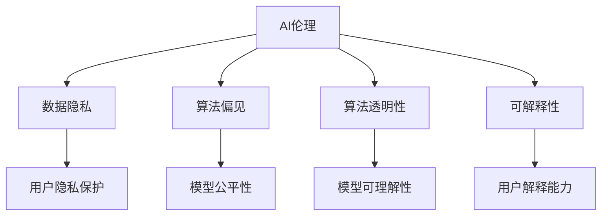

                 

# AI创业公司如何应对伦理挑战?

> 关键词：AI伦理,隐私保护,偏见消除,算法透明,可解释性

## 1. 背景介绍

### 1.1 问题由来
随着人工智能技术的快速发展，AI创业公司在医疗、金融、教育、交通等众多领域取得了显著的进展，推动了各行各业的数字化转型。然而，伴随着这些技术突破，AI系统在数据隐私、偏见、可解释性等方面的伦理问题也日益凸显。这些问题不仅威胁到技术的可持续发展，还可能给社会带来负面影响。如何妥善应对这些伦理挑战，成为AI创业公司必须面对的重要课题。

### 1.2 问题核心关键点
AI伦理问题的核心关键点主要包括以下几点：

- **数据隐私**：如何保障用户数据的安全性和隐私性，避免数据泄露和滥用。
- **算法偏见**：如何消除AI模型中的固有偏见，确保模型输出公平、无歧视。
- **算法透明性**：如何提高AI系统的可解释性，让用户理解模型决策过程。
- **可解释性**：如何确保AI系统的输出具有足够的解释能力，方便调试和优化。
- **人机协作**：如何在AI与人类之间建立信任关系，避免AI系统的滥用。

这些问题不仅涉及技术实现，还涉及法规政策、社会认知等多方面的考量，需要多学科、多领域的协同合作。

### 1.3 问题研究意义
正确应对AI伦理问题，不仅能够提升AI系统的可信度和可接受性，还能确保技术的健康发展，避免社会对其的过度恐惧和抵触，促进AI技术的普及和应用。具体来说：

- 提升用户体验：通过合理的隐私保护和算法透明，增强用户对AI系统的信任感，提高用户使用率。
- 保障公平正义：消除算法偏见，避免歧视性输出，推动社会公平和正义。
- 促进产业转型：通过透明性、可解释性等措施，提高AI系统的可靠性和稳定性，加速AI技术在各行各业的应用。
- 构建信任关系：在AI与人类之间建立信任机制，防止AI系统被滥用，保障人类安全。

## 2. 核心概念与联系

### 2.1 核心概念概述

为了更好地理解AI系统中的伦理问题及其应对方法，本节将介绍几个核心概念及其相互关系。

- **AI伦理（AI Ethics）**：涉及AI技术的伦理原则和道德规范，旨在指导AI系统的设计、开发和应用，确保其公正、透明、可解释。
- **数据隐私（Data Privacy）**：指保护个人数据免遭未经授权的收集、使用、存储、处理、转移和公开。
- **算法偏见（Algorithm Bias）**：指AI模型由于数据偏差、算法设计等原因，导致在预测或决策中存在系统性偏差，影响模型的公平性。
- **算法透明性（Algorithm Transparency）**：指AI系统的决策过程和原理是否清晰明了，是否能够被用户或开发者理解。
- **可解释性（Explainability）**：指AI系统是否能够提供清晰的解释，说明其决策或输出的原因。

这些概念之间的联系可以通过以下Mermaid流程图来展示：



这个流程图展示了AI伦理与其他核心概念之间的逻辑关系：

1. AI伦理为数据隐私、算法偏见、算法透明性、可解释性等提供原则和指导。
2. 数据隐私、算法偏见等问题是AI伦理的重要组成部分。
3. 算法透明性和可解释性是实现AI伦理目标的重要手段。
4. 数据隐私和算法透明性有助于增强用户信任，提升可解释性。
5. 算法偏见和可解释性问题直接影响AI模型的公平性和可靠性。

## 3. 核心算法原理 & 具体操作步骤
### 3.1 算法原理概述

AI创业公司应对伦理挑战的核心算法原理，主要包括隐私保护、偏见消除、透明性和可解释性。这些技术手段通过不同的算法机制，实现对伦理问题的有效管理和应对。

- **隐私保护（Privacy Preservation）**：指通过技术手段，保护用户数据的安全性和隐私性。
- **偏见消除（Bias Mitigation）**：指在模型训练和应用过程中，识别和消除固有偏见，确保模型输出公平。
- **算法透明性（Algorithm Transparency）**：指提高模型决策过程的透明性，让用户理解和信任AI系统。
- **可解释性（Explainability）**：指提高模型的可解释性，帮助用户理解模型决策逻辑。

### 3.2 算法步骤详解

基于上述原理，AI创业公司在应对伦理挑战时，通常需要采取以下具体步骤：

**Step 1: 数据隐私保护**
- 数据匿名化：通过去标识化、脱敏等手段，保护用户隐私。
- 数据加密：采用加密算法对数据进行保护，防止数据泄露。
- 差分隐私：在数据分析过程中加入噪声，保护数据隐私。

**Step 2: 偏见消除**
- 数据预处理：通过数据清洗、平衡处理等方法，消除数据集中的固有偏见。
- 偏见检测：使用公平性指标（如均值差异、方差比等）检测模型中的偏见。
- 偏差修正：通过调整模型参数、引入正则化等方法，消除模型中的偏见。

**Step 3: 算法透明性**
- 模型可视化：使用可视化工具，展示模型内部结构和工作原理。
- 输入输出解释：提供对输入特征和输出结果的解释，让用户理解模型决策。
- 决策路径说明：记录和解释模型决策路径，提高模型的透明性。

**Step 4: 可解释性**
- 模型简化：通过模型剪枝、特征选择等方法，简化模型结构，提高可解释性。
- 特征解释：对输入特征进行解释，说明其在模型决策中的作用。
- 模型说明文档：编写详细的模型说明文档，解释模型架构和决策逻辑。

### 3.3 算法优缺点

AI创业公司应对伦理挑战的算法具有以下优点：

- **增强可信度**：通过隐私保护、偏见消除等措施，增强用户和监管机构对AI系统的信任。
- **提升公平性**：消除算法偏见，确保AI系统输出公平、无歧视。
- **提高透明性**：通过算法透明性和可解释性，增强用户对AI系统的理解，提高系统的可接受度。
- **确保合规性**：遵循法律法规，保障数据隐私和安全。

但这些算法也存在一定的局限性：

- **技术复杂性**：隐私保护、偏见消除等技术往往复杂度高，实现成本较高。
- **用户理解难度**：模型透明性和可解释性虽然有助于理解，但仍可能过于复杂，用户难以理解。
- **数据依赖性强**：算法依赖于高质量的数据集，数据偏差可能影响算法效果。
- **误判风险**：过分简化模型可能增加误判风险，影响系统性能。

### 3.4 算法应用领域

AI伦理算法在多个领域都有广泛应用，以下是几个典型场景：

- **医疗健康**：在医疗AI系统中，保障患者数据隐私，确保模型输出无偏见，提高医疗决策的公平性和透明度。
- **金融服务**：在金融AI系统中，保护客户隐私，消除算法偏见，提高金融决策的公正性和可信度。
- **教育培训**：在教育AI系统中，保障学生数据隐私，消除算法偏见，提高教育决策的公平性和透明性。
- **智能交通**：在智能交通系统中，保护车辆和行人数据隐私，消除算法偏见，提高交通安全和公平性。
- **公共安全**：在公共安全AI系统中，保护个人隐私，消除算法偏见，提高公共决策的公平性和透明性。

这些领域的应用展示了AI伦理算法在实际场景中的广泛适用性和重要性。

## 4. 数学模型和公式 & 详细讲解 & 举例说明

### 4.1 数学模型构建

为了更好地理解AI伦理算法，本节将介绍几个核心数学模型及其构建方法。

- **差分隐私（Differential Privacy）**：差分隐私是一种保护用户隐私的数学模型。通过在查询中加入噪声，使得模型无法准确识别特定用户的隐私信息。差分隐私的数学定义如下：

$$
\delta-\text{DP} \triangleq \bigg\{ \epsilon > 0, \forall Q \subseteq \mathcal{X}, \forall x, y \in \mathcal{X} \bigg( \mathbb{P}[Q(X) = 1 | X = x] \leq e^{\epsilon} \mathbb{P}[Q(X) = 1 | X = y] + \frac{\delta}{\epsilon} \bigg)
$$

其中，$X$ 为输入数据，$Q$ 为查询函数，$\epsilon$ 为隐私保护参数，$\delta$ 为隐私保护阈值。

- **公平性检测（Fairness Detection）**：公平性检测旨在检测AI模型是否存在系统性偏见。常用的公平性检测指标包括均值差异、方差比等。均值差异定义为不同群体之间的输出均值之差：

$$
\text{mean\_difference} = \frac{1}{N} \sum_{i=1}^N (y_i - \hat{y}_i)
$$

其中，$y_i$ 为真实标签，$\hat{y}_i$ 为模型预测标签，$N$ 为样本数量。

- **模型简化（Model Simplification）**：模型简化旨在提高模型的可解释性。常用的方法包括特征选择、模型剪枝等。以模型剪枝为例，其基本思想是通过删除不重要的神经元或层，减小模型规模，提高可解释性。

### 4.2 公式推导过程

以下我们以差分隐私和公平性检测为例，推导相关的数学公式及其推导过程。

**差分隐私推导**

在差分隐私中，查询函数 $Q$ 通常表示为模型对输入数据的预测。为了保护用户隐私，需要在查询结果中加入噪声 $\epsilon$。假设原始查询结果为 $Q(X)$，加入噪声后的结果为 $\tilde{Q}(X)$，则有：

$$
\tilde{Q}(X) = Q(X) + \epsilon
$$

其中，$\epsilon$ 为服从拉普拉斯分布的噪声，即 $\epsilon \sim \mathcal{L}(1)$。

差分隐私的数学定义可以表示为：

$$
\delta-\text{DP} \triangleq \bigg\{ \epsilon > 0, \forall Q \subseteq \mathcal{X}, \forall x, y \in \mathcal{X} \bigg( \mathbb{P}[Q(X) = 1 | X = x] \leq e^{\epsilon} \mathbb{P}[Q(X) = 1 | X = y] + \frac{\delta}{\epsilon} \bigg)
$$

其中，$X$ 为输入数据，$Q$ 为查询函数，$\epsilon$ 为隐私保护参数，$\delta$ 为隐私保护阈值。

**公平性检测推导**

公平性检测通过计算不同群体之间的均值差异和方差比，来检测模型是否存在偏见。假设模型输出为 $y$，真实标签为 $y^*$，则均值差异 $\Delta$ 定义为：

$$
\Delta = \frac{1}{N} \sum_{i=1}^N (y_i - y^*_i)
$$

其中，$y_i$ 为模型预测标签，$y^*_i$ 为真实标签，$N$ 为样本数量。

方差比 $\sigma$ 定义为：

$$
\sigma = \frac{\text{Var}(y|x_1) + \text{Var}(y|x_2)}{\text{Var}(y|x_3) + \text{Var}(y|x_4)}
$$

其中，$x_1$、$x_2$ 表示不同的群体，$y$ 为模型输出。

### 4.3 案例分析与讲解

**案例一：差分隐私在医疗数据中的应用**

在医疗AI系统中，保护患者隐私至关重要。假设某医院收集了大量的患者数据，包括疾病诊断、治疗方案等敏感信息。为了保护患者隐私，可以采用差分隐私技术，在查询数据时加入噪声。具体步骤如下：

1. 对原始数据进行去标识化，去除敏感信息。
2. 在查询时，对结果加入拉普拉斯分布的噪声。
3. 对查询结果进行噪声化处理，保护患者隐私。

**案例二：公平性检测在招聘系统中的应用**

招聘系统中，存在招聘偏见的问题，需要检测并消除这些偏见。假设某公司的招聘系统使用AI模型对求职者进行筛选，模型输出为候选人的评分。通过计算不同性别、种族等群体之间的均值差异和方差比，可以检测模型是否存在偏见。具体步骤如下：

1. 收集求职者的数据，包括性别、种族、评分等。
2. 计算不同群体之间的均值差异和方差比。
3. 如果均值差异和方差比过大，说明模型存在偏见，需要调整模型参数或重新训练模型。

## 5. 项目实践：代码实例和详细解释说明
### 5.1 开发环境搭建

在进行AI伦理算法开发前，我们需要准备好开发环境。以下是使用Python进行TensorFlow开发的环境配置流程：

1. 安装Anaconda：从官网下载并安装Anaconda，用于创建独立的Python环境。

2. 创建并激活虚拟环境：
```bash
conda create -n pytorch-env python=3.8 
conda activate pytorch-env
```

3. 安装TensorFlow：根据CUDA版本，从官网获取对应的安装命令。例如：
```bash
conda install tensorflow -c tf
```

4. 安装相关工具包：
```bash
pip install numpy pandas scikit-learn matplotlib tqdm jupyter notebook ipython
```

完成上述步骤后，即可在`pytorch-env`环境中开始AI伦理算法开发。

### 5.2 源代码详细实现

这里我们以差分隐私为例，给出使用TensorFlow实现差分隐私的PyTorch代码实现。

```python
import tensorflow as tf
import numpy as np

# 定义差分隐私函数
def differential_privacy(query, noise_std=1.0, epsilon=1.0, delta=0.1):
    # 查询结果加入拉普拉斯噪声
    noisy_query = query + tf.random.normal(shape=tf.shape(query), stddev=noise_std)
    # 计算隐私保护参数
    alpha = epsilon / (delta + tf.reduce_mean(tf.exp(-noisy_query / epsilon)))
    return noisy_query, alpha

# 测试差分隐私函数
x = tf.constant([1.0, 2.0, 3.0], dtype=tf.float32)
y = differential_privacy(x)
print(y)
```

### 5.3 代码解读与分析

让我们再详细解读一下关键代码的实现细节：

**differential_privacy函数**：
- 定义差分隐私函数，接受查询结果 `query` 和噪声标准差 `noise_std` 作为输入。
- 在查询结果中加入拉普拉斯噪声，得到 `noisy_query`。
- 计算隐私保护参数 `alpha`，用于衡量隐私保护强度。

**测试差分隐私函数**：
- 定义输入数据 `x`，表示查询结果。
- 调用 `differential_privacy` 函数，得到噪声化后的查询结果 `y` 和隐私保护参数 `alpha`。
- 输出 `y`，即差分隐私化的查询结果。

可以看到，差分隐私算法的实现相对简单，但实际应用中需要综合考虑查询结果的隐私保护强度，确保隐私保护的合理性和有效性。

## 6. 实际应用场景
### 6.1 医疗健康

在医疗健康领域，AI伦理算法主要用于保护患者隐私和确保模型公平。具体应用场景包括：

- **患者隐私保护**：医疗数据通常包含敏感的个人信息，如姓名、身份证号码等。为了保护患者隐私，可以采用差分隐私技术，在查询数据时加入噪声，防止数据泄露。
- **模型公平性**：医疗AI模型可能会对不同种族、性别等群体存在偏见。通过公平性检测，可以识别并消除这些偏见，确保模型输出公平、无歧视。
- **可解释性**：医疗AI模型的决策过程往往复杂，难以理解。通过可解释性技术，可以将模型决策过程可视化，帮助医生和患者理解模型输出。

### 6.2 金融服务

在金融服务领域，AI伦理算法主要用于保护客户隐私和确保模型公平。具体应用场景包括：

- **客户隐私保护**：金融数据通常包含敏感的个人信息，如信用卡号码、账户余额等。为了保护客户隐私，可以采用差分隐私技术，在查询数据时加入噪声，防止数据泄露。
- **模型公平性**：金融AI模型可能会对不同收入、性别等群体存在偏见。通过公平性检测，可以识别并消除这些偏见，确保模型输出公平、无歧视。
- **可解释性**：金融AI模型的决策过程往往复杂，难以理解。通过可解释性技术，可以将模型决策过程可视化，帮助客户和监管机构理解模型输出。

### 6.3 教育培训

在教育培训领域，AI伦理算法主要用于保护学生隐私和确保模型公平。具体应用场景包括：

- **学生隐私保护**：教育数据通常包含敏感的个人信息，如姓名、学号等。为了保护学生隐私，可以采用差分隐私技术，在查询数据时加入噪声，防止数据泄露。
- **模型公平性**：教育AI模型可能会对不同性别、种族等群体存在偏见。通过公平性检测，可以识别并消除这些偏见，确保模型输出公平、无歧视。
- **可解释性**：教育AI模型的决策过程往往复杂，难以理解。通过可解释性技术，可以将模型决策过程可视化，帮助学生和教师理解模型输出。

### 6.4 智能交通

在智能交通领域，AI伦理算法主要用于保护用户隐私和确保模型公平。具体应用场景包括：

- **用户隐私保护**：智能交通数据通常包含敏感的个人信息，如车辆位置、行驶轨迹等。为了保护用户隐私，可以采用差分隐私技术，在查询数据时加入噪声，防止数据泄露。
- **模型公平性**：智能交通AI模型可能会对不同性别、种族等群体存在偏见。通过公平性检测，可以识别并消除这些偏见，确保模型输出公平、无歧视。
- **可解释性**：智能交通AI模型的决策过程往往复杂，难以理解。通过可解释性技术，可以将模型决策过程可视化，帮助用户和监管机构理解模型输出。

## 7. 工具和资源推荐
### 7.1 学习资源推荐

为了帮助开发者系统掌握AI伦理算法的理论基础和实践技巧，这里推荐一些优质的学习资源：

1. **《AI伦理与隐私保护》课程**：由Coursera推出的在线课程，涵盖AI伦理、数据隐私、公平性检测等核心概念，适合初学者入门。

2. **《差分隐私原理与实践》书籍**：详解差分隐私算法的原理和实现方法，适合深入学习差分隐私技术。

3. **《AI系统公平性检测与修正》论文**：介绍公平性检测和修正的基本方法，适合研究者了解当前前沿技术。

4. **《TensorFlow差分隐私》官方文档**：TensorFlow提供的差分隐私实现，适合开发者参考实践。

5. **《AI伦理与社会责任》课程**：由Udacity推出的在线课程，涵盖AI伦理的基本原则和实际应用，适合从业者提升职业素养。

通过对这些资源的学习实践，相信你一定能够快速掌握AI伦理算法的精髓，并用于解决实际的AI系统问题。

### 7.2 开发工具推荐

高效的开发离不开优秀的工具支持。以下是几款用于AI伦理算法开发的常用工具：

1. **TensorFlow**：由Google主导开发的开源深度学习框架，生产部署方便，适合大规模工程应用。

2. **PyTorch**：基于Python的开源深度学习框架，灵活动态的计算图，适合快速迭代研究。

3. **Pandas**：数据处理库，支持多种数据格式，适用于数据清洗和处理。

4. **Scikit-learn**：机器学习库，支持多种算法和模型，适用于公平性检测和模型简化。

5. **Jupyter Notebook**：交互式编程环境，方便开发者调试和展示代码。

6. **Python**：通用的编程语言，灵活性强，适合开发AI伦理算法。

合理利用这些工具，可以显著提升AI伦理算法的开发效率，加快创新迭代的步伐。

### 7.3 相关论文推荐

AI伦理问题的发展源于学界的持续研究。以下是几篇奠基性的相关论文，推荐阅读：

1. **《差分隐私原理》（Differential Privacy）**：Differential Privacy是差分隐私算法的核心论文，提出差分隐私的定义和基本原理。

2. **《公平性检测与修正》（Fairness Detection and Correction）**：介绍公平性检测和修正的基本方法，提供公平性指标和算法实现。

3. **《可解释性AI》（Explainable AI）**：介绍可解释性AI的原理和应用，探讨如何提高模型的可解释性。

4. **《隐私保护技术综述》（Privacy Preservation Techniques）**：综述隐私保护技术的基本方法和应用场景，提供隐私保护的最新进展。

5. **《公平性与透明度在AI中的重要性》（Importance of Fairness and Transparency in AI）**：探讨AI伦理的基本原则和实际应用，强调公平性和透明性的重要性。

这些论文代表了大规模语言模型微调技术的发展脉络。通过学习这些前沿成果，可以帮助研究者把握学科前进方向，激发更多的创新灵感。

## 8. 总结：未来发展趋势与挑战
### 8.1 总结

本文对AI创业公司如何应对伦理挑战进行了全面系统的介绍。首先阐述了AI伦理问题的背景和意义，明确了隐私保护、偏见消除、透明性和可解释性等核心概念。其次，从原理到实践，详细讲解了差分隐私、公平性检测、模型简化等核心算法的实现方法和具体步骤。同时，本文还广泛探讨了AI伦理算法在医疗健康、金融服务、教育培训、智能交通等多个领域的应用前景，展示了AI伦理算法在实际场景中的广泛适用性和重要性。

通过本文的系统梳理，可以看到，AI伦理算法在保障用户隐私、消除算法偏见、提高模型透明性和可解释性等方面，具有重要的作用。这些算法能够显著提升AI系统的可信度和可接受性，推动AI技术的健康发展，确保技术的社会效益最大化。

### 8.2 未来发展趋势

展望未来，AI伦理算法的发展趋势主要包括以下几个方面：

1. **隐私保护技术创新**：随着数据量不断增大，隐私保护技术将不断创新，保障用户数据的安全性和隐私性。
2. **公平性检测与修正**：随着模型复杂度的提高，公平性检测与修正技术将进一步发展，确保模型输出公平、无歧视。
3. **可解释性技术突破**：随着深度学习模型的不断发展，可解释性技术将不断创新，提高模型的透明性和可理解性。
4. **多领域应用拓展**：AI伦理算法将在更多领域得到应用，如医疗、金融、教育、智能交通等，推动AI技术在这些领域的普及和应用。
5. **跨学科融合**：AI伦理算法将与其他人工智能技术进行更深度的融合，如知识表示、因果推理、强化学习等，多路径协同发力，共同推动AI技术的发展。

这些趋势将推动AI伦理算法不断创新和演进，提升AI系统的可信度和可接受性，推动AI技术的广泛应用和普及。

### 8.3 面临的挑战

尽管AI伦理算法在应对伦理挑战方面取得了一定的进展，但仍面临诸多挑战：

1. **技术复杂性**：隐私保护、偏见消除等技术往往复杂度高，实现成本较高。
2. **用户理解难度**：模型透明性和可解释性虽然有助于理解，但仍可能过于复杂，用户难以理解。
3. **数据依赖性强**：算法依赖于高质量的数据集，数据偏差可能影响算法效果。
4. **误判风险**：过分简化模型可能增加误判风险，影响系统性能。
5. **法规政策**：各国对AI伦理问题的法规政策不同，AI系统需要在多法规环境下运行，增加了实现的复杂性。

### 8.4 研究展望

面对AI伦理算法所面临的挑战，未来的研究需要在以下几个方面寻求新的突破：

1. **隐私保护技术创新**：开发更加高效的隐私保护技术，降低技术实现成本，提高隐私保护的效率和效果。
2. **公平性检测与修正**：研究更加公平、高效的检测与修正方法，确保模型输出公平、无歧视。
3. **可解释性技术突破**：开发更加简洁、易懂的可解释性技术，提高模型的透明性和可理解性。
4. **多领域应用拓展**：将AI伦理算法推广到更多领域，提升AI系统在各行业的可信度和可接受性。
5. **跨学科融合**：将AI伦理算法与其他人工智能技术进行更深入的融合，提升AI系统的性能和效果。

这些研究方向的探索，将推动AI伦理算法不断创新和演进，提升AI系统的可信度和可接受性，推动AI技术的广泛应用和普及。

## 9. 附录：常见问题与解答

**Q1：AI伦理算法是否适用于所有AI系统？**

A: AI伦理算法在大多数AI系统中都能取得一定的效果，但具体应用效果还需根据系统特点进行调整。例如，对于隐私要求极高的系统，差分隐私算法可能不是最佳选择；对于模型复杂度较高的系统，可解释性算法需要进一步优化。

**Q2：如何确保AI伦理算法的公平性？**

A: 确保AI伦理算法的公平性，需要综合考虑数据预处理、模型训练、评估等多个环节。首先，在数据预处理阶段，需要进行数据清洗和平衡处理，消除数据集中的固有偏见。其次，在模型训练阶段，需要选择合适的公平性指标，检测并修正模型中的偏见。最后，在模型评估阶段，需要进行公平性检测，确保模型输出公平、无歧视。

**Q3：如何实现AI伦理算法的可解释性？**

A: 实现AI伦理算法的可解释性，需要从模型架构、特征选择、输出解释等多个方面进行优化。首先，在模型架构设计时，应选择结构简单、易于理解的模型。其次，在特征选择时，应选择具有明显特征的输入，减少冗余特征。最后，在输出解释时，应提供清晰、易懂的解释，帮助用户理解模型决策过程。

**Q4：AI伦理算法在实际应用中是否安全可靠？**

A: AI伦理算法在保障用户隐私、消除算法偏见、提高模型透明性和可解释性等方面，具有重要的作用。但需要严格遵循法律法规，确保算法的合法合规。同时，需要进行系统测试和评估，确保算法的安全可靠。

**Q5：AI伦理算法在多法规环境下如何运行？**

A: 在多法规环境下，AI伦理算法需要遵循各国的法律法规，确保算法符合各国的隐私保护、公平性检测、可解释性要求。同时，需要在系统设计中考虑法规变化，具备一定的灵活性和可扩展性。

通过本文的系统梳理，相信你能够更好地理解AI伦理算法的基本原理和实践方法，并用于解决实际的AI系统问题。

---

作者：禅与计算机程序设计艺术 / Zen and the Art of Computer Programming

