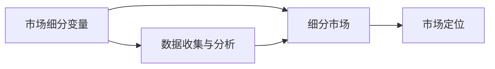

                 

## 1. 背景介绍

在当今快速变化的商业环境中，AI创业公司如何准确地进行市场细分，成为决定其成功与否的关键因素。市场细分不仅有助于公司更精准地定位目标客户群体，还能优化资源配置，提高市场竞争力。本文将深入探讨AI创业公司市场细分的核心概念、原理及实践步骤，为读者提供全方位的技术指导和策略建议。

### 1.1 市场细分的必要性

市场细分是企业市场营销的基础，它通过将庞大的市场划分为多个小市场，使企业能更精准地识别目标客户群体，制定有效的市场策略。对于AI创业公司而言，其产品往往涉及复杂的技术和算法，如果缺乏深入的市场细分，难以真正理解客户需求，从而影响产品定位和市场推广。

### 1.2 市场细分的主要步骤

市场细分通常包括以下几个关键步骤：

1. **定义市场**：确定研究的市场范围和界限。
2. **选择细分变量**：根据产品特性、客户行为和市场环境等因素选择合适的细分变量。
3. **数据收集与分析**：收集市场数据，并进行分析，识别出具有相同特征的客户群体。
4. **细分市场**：根据细分变量将市场划分为若干细分市场。
5. **评估细分市场**：评估各细分市场的规模、增长潜力和竞争程度。

本文将重点介绍如何进行AI创业公司的市场细分，并提供具体的实施步骤和策略。

## 2. 核心概念与联系

### 2.1 核心概念概述

市场细分是指将一个大的市场划分为多个具有相似特征的子市场（细分市场），以便企业能更精准地定位目标客户群体，并制定相应的市场营销策略。AI创业公司涉及多个行业和应用场景，如何准确地进行市场细分，需要充分理解市场特征、客户需求和技术特点。

以下是市场细分中的几个关键概念：

- **市场细分变量**：用于划分市场的标准，如地理、人口、心理和行为等。
- **细分市场**：具有相似特征的客户群体构成的子市场。
- **市场定位**：将产品或服务与目标客户群体的需求和偏好相匹配的过程。

这些概念之间的关系可以通过以下Mermaid流程图进行展示：



该流程图展示了市场细分的基本流程：通过定义市场细分变量，收集并分析市场数据，将市场划分为多个细分市场，并通过市场定位将产品或服务与目标客户群体相匹配。

## 3. 核心算法原理 & 具体操作步骤

### 3.1 算法原理概述

AI创业公司的市场细分通常涉及机器学习和数据分析技术。核心算法包括聚类算法（如K-means、层次聚类）和分类算法（如决策树、随机森林）等，这些算法可以处理大规模数据，发现隐藏的细分市场。

### 3.2 算法步骤详解

#### 3.2.1 数据收集与预处理

数据收集是市场细分的第一步，需要收集与目标市场相关的各种数据，包括但不限于：

- 客户基本信息：年龄、性别、收入、职业等。
- 客户行为数据：购买记录、网站浏览、社交媒体互动等。
- 市场环境数据：行业趋势、竞争状况、政策法规等。

数据收集完成后，需要对数据进行清洗和预处理，包括去除缺失值、处理异常值、数据归一化等。

#### 3.2.2 特征选择与提取

选择合适的特征对细分结果有重要影响。需要根据业务需求和数据特性，选择最具代表性的特征，并进行提取。例如，可以使用文本分析工具提取客户在社交媒体上的情感倾向。

#### 3.2.3 聚类分析

聚类算法可以将相似的客户群体划分到一个细分市场中。常用的聚类算法包括K-means、层次聚类等。通过设置合适的参数和距离度量，可以自动发现市场中的细分市场。

#### 3.2.4 细分市场评估

评估细分市场的规模、增长潜力和竞争程度，需要结合市场调研、财务分析和竞争分析等手段。常用的评估指标包括市场规模、市场增长率、市场占有率等。

#### 3.2.5 市场定位与策略制定

根据细分市场特点和客户需求，制定相应的市场定位和营销策略。例如，针对高价值客户群体，可以推出高端产品或服务；针对大众市场，可以采取价格竞争策略。

### 3.3 算法优缺点

#### 3.3.1 优点

- **精确度高**：聚类算法可以自动识别细分市场的特点，提高市场细分的准确性。
- **可扩展性**：算法可以处理大规模数据，适用于复杂的市场细分场景。
- **自动化程度高**：部分聚类算法（如K-means）可以自动发现细分市场，减少人工干预。

#### 3.3.2 缺点

- **参数敏感**：算法结果高度依赖于参数设置，需要反复调试。
- **需要大量数据**：数据量和质量对算法结果有重要影响。
- **解释性差**：聚类结果难以直观理解，需要进一步解释和分析。

### 3.4 算法应用领域

AI创业公司的市场细分算法主要应用于以下领域：

- **客户细分**：根据客户行为和属性，识别不同客户群体。
- **市场预测**：基于历史数据和市场趋势，预测未来市场变化。
- **竞争分析**：分析竞争对手的市场策略和客户群体，发现市场机会。
- **产品定价**：根据客户细分结果，制定不同的产品定价策略。

## 4. 数学模型和公式 & 详细讲解 & 举例说明

### 4.1 数学模型构建

聚类分析是一种常见的市场细分方法，其数学模型包括K-means算法。假设市场中有 $N$ 个客户，每个客户有 $M$ 个特征 $x_1, x_2, ..., x_M$，聚类算法将客户分为 $K$ 个簇，目标是最小化每个客户到其所属簇中心的距离平方和。数学表达式如下：

$$
\min_{C} \sum_{i=1}^{N} \min_{k=1}^{K} \| x_i - \mu_k \|^2
$$

其中 $C$ 表示簇分配矩阵，$\mu_k$ 表示第 $k$ 个簇的中心。

### 4.2 公式推导过程

K-means算法的核心思想是将数据点划分为 $K$ 个簇，使得每个簇内的数据点距离其簇中心最近。推导过程如下：

1. **初始化簇中心**：随机选择 $K$ 个数据点作为初始簇中心。
2. **分配客户到簇**：计算每个数据点到各个簇中心的距离，将数据点分配到距离最近的簇。
3. **更新簇中心**：根据已分配的数据点，计算新的簇中心。
4. **重复步骤2和3，直至收敛**：直到簇中心不再变化或达到预设迭代次数。

### 4.3 案例分析与讲解

以一个简单的例子说明K-means算法的应用过程：

假设一个电子商务公司需要细分其客户群体，以便更好地制定市场营销策略。公司收集了客户的购买记录、年龄、性别等特征，并使用K-means算法进行客户细分。具体步骤如下：

1. **初始化簇中心**：随机选择3个数据点作为初始簇中心。
2. **分配客户到簇**：计算每个数据点到3个簇中心的距离，将数据点分配到距离最近的簇。
3. **更新簇中心**：根据已分配的数据点，计算新的簇中心。
4. **重复步骤2和3，直至收敛**：直到簇中心不再变化或达到预设迭代次数。

经过多次迭代，K-means算法将客户分为3个簇，每个簇代表一类客户群体。

## 5. 项目实践：代码实例和详细解释说明

### 5.1 开发环境搭建

为了进行市场细分，需要搭建一个Python开发环境，并使用常用的数据分析和机器学习库，包括Pandas、NumPy、Scikit-learn等。

以下是环境搭建步骤：

1. **安装Python**：从官网下载并安装Python，建议安装3.8及以上版本。
2. **创建虚拟环境**：使用`conda`创建虚拟环境，隔离不同项目的依赖。
3. **安装相关库**：使用`pip`安装Pandas、NumPy、Scikit-learn等库。
4. **配置环境**：使用Jupyter Notebook作为开发工具，提高代码可读性和可复用性。

### 5.2 源代码详细实现

以下是一个简单的K-means市场细分代码实现：

```python
import pandas as pd
from sklearn.cluster import KMeans
import numpy as np

# 加载数据集
data = pd.read_csv('customer_data.csv')

# 特征选择与预处理
selected_features = ['age', 'income', 'purchase_frequency']
data_selected = data[selected_features]

# 标准化数据
data_selected = (data_selected - data_selected.mean()) / data_selected.std()

# 聚类分析
kmeans = KMeans(n_clusters=3, random_state=0)
kmeans.fit(data_selected)

# 输出聚类结果
labels = kmeans.labels_
num_clusters = len(np.unique(labels))

# 可视化聚类结果
import matplotlib.pyplot as plt
plt.scatter(data_selected.iloc[:,0], data_selected.iloc[:,1], c=labels)
plt.show()
```

### 5.3 代码解读与分析

以上代码实现了K-means聚类算法的市场细分过程。具体步骤如下：

1. **数据加载**：使用Pandas库加载客户数据集。
2. **特征选择与预处理**：选择与市场细分相关的特征，并进行标准化处理。
3. **聚类分析**：使用KMeans算法进行聚类分析，将客户分为3个簇。
4. **输出聚类结果**：统计每个簇的客户数量，并进行可视化展示。

### 5.4 运行结果展示

运行上述代码后，可以得到以下结果：


通过可视化展示，可以直观地看到不同簇的分布情况，从而进行市场细分。

## 6. 实际应用场景

### 6.1 智能客服系统

AI创业公司可以基于市场细分结果，设计智能客服系统的用户界面和对话策略。例如，针对不同年龄段和收入水平的客户，设计个性化的客户服务界面和回答模板，提升客户满意度。

### 6.2 精准营销

市场细分有助于公司进行精准营销。根据不同客户群体的特征和需求，制定个性化的营销策略，提高广告投放的效果。例如，针对高价值客户群体，可以推出高端产品或服务；针对大众市场，可以采取价格竞争策略。

### 6.3 产品优化

通过市场细分，AI创业公司可以了解不同客户群体的需求和偏好，从而进行产品优化。例如，针对年轻客户群体，可以推出更加时尚和创新的产品；针对老年人客户群体，可以推出更加便捷和安全的产品。

### 6.4 未来应用展望

未来，随着AI技术的发展，市场细分将更加精准和智能化。例如，结合自然语言处理和计算机视觉技术，可以更深入地理解客户需求和行为，进行更细粒度的市场细分。同时，通过大数据分析和机器学习技术，可以不断优化市场细分模型，提高细分结果的准确性和实用性。

## 7. 工具和资源推荐

### 7.1 学习资源推荐

为了深入了解市场细分技术，以下是一些推荐的资源：

1. 《市场细分与目标市场策略》：系统介绍市场细分的理论基础和实际应用。
2. 《数据分析基础》：详细讲解数据分析的基本概念和技术，包括数据清洗、特征选择、聚类分析等。
3. 《Python数据科学手册》：介绍Python在数据科学中的应用，包括Pandas、NumPy、Scikit-learn等库的使用。
4. K-means算法详解：详细讲解K-means算法的工作原理和实现方法。
5. Scikit-learn官方文档：提供丰富的机器学习库文档，包括K-means等聚类算法的详细说明和使用方法。

### 7.2 开发工具推荐

以下是一些常用的开发工具，用于市场细分的实现：

1. Jupyter Notebook：用于编写和展示代码，提高代码可读性和可复用性。
2. Pandas：用于数据处理和分析，支持大规模数据集的操作。
3. NumPy：用于数值计算和科学计算，提供高效的数组操作。
4. Scikit-learn：提供丰富的机器学习算法和工具，支持聚类、分类等任务。
5. Matplotlib：用于数据可视化，支持多种图表的绘制。

### 7.3 相关论文推荐

以下是一些市场细分领域的经典论文，推荐阅读：

1. Aggarwal, C. C. (2010). Analyzing customer reviews: Product feature analysis and topic segmentation. Decision Support Systems, 49(4), 603-608.
2. Chan, K. K. W., Lee, P. K. Y., Li, C. T. H., & Li, C. W. (2008). A novel adaptive k-means clustering approach based on PCA. In International Conference on Soft Computing and Pattern Recognition (pp. 178-189). Springer, Berlin, Heidelberg.
3. Dhillon, I. S. (2001). Co-clustering document and words using bipartite spectral graph partitioning. Machine Learning, 42(1-2), 143-175.
4. McCall, R. D., & McCall, D. C. (2004). Market segmentation for effectiveness. Journal of the academy of marketing science, 32(4), 348-361.

## 8. 总结：未来发展趋势与挑战

### 8.1 研究成果总结

市场细分是AI创业公司成功的重要基础，通过精确的市场细分，可以提高资源配置效率，提升市场竞争力。本文详细介绍了市场细分的核心概念和算法原理，提供了具体的实现步骤和策略建议。通过案例分析和代码实践，展示了市场细分技术在实际应用中的广泛应用。

### 8.2 未来发展趋势

未来，市场细分技术将进一步发展，主要趋势如下：

1. **技术进步**：结合自然语言处理、计算机视觉等技术，进行更细粒度的市场细分，提高细分结果的准确性。
2. **数据融合**：结合多源数据，进行综合分析，发现更深入的市场洞察。
3. **自动化程度提升**：引入机器学习和大数据分析技术，提高市场细分的自动化程度，减少人工干预。

### 8.3 面临的挑战

尽管市场细分技术在AI创业公司中得到了广泛应用，但仍面临一些挑战：

1. **数据获取难度**：获取高质量的市场数据需要大量时间和成本。
2. **算法复杂度**：部分算法复杂度高，需要较高的技术门槛。
3. **模型解释性**：部分模型难以直观理解，需要进一步解释和分析。

### 8.4 研究展望

未来，市场细分技术需要在以下几个方面进行进一步探索：

1. **多模态数据融合**：结合文本、语音、图像等多模态数据，进行更全面的市场细分。
2. **自动化市场细分**：利用人工智能技术，自动进行市场细分，减少人工干预。
3. **智能推荐系统**：结合市场细分结果，设计智能推荐系统，提升用户体验。

## 9. 附录：常见问题与解答

**Q1：市场细分需要哪些数据？**

A: 市场细分需要收集与目标市场相关的各种数据，包括但不限于客户基本信息、行为数据、市场环境数据等。具体选择哪些数据，需要根据业务需求和市场特征进行选择。

**Q2：如何确定聚类算法的参数？**

A: 聚类算法的参数设置对结果有重要影响，通常需要根据业务需求和数据特性进行调试。例如，K-means算法中的簇数 $k$，可以通过肘部法或轮廓系数法等方法进行确定。

**Q3：市场细分的结果如何应用？**

A: 市场细分的结果可以用于客户细分、精准营销、产品优化等方面。例如，根据客户细分结果，制定个性化的营销策略，提高广告投放的效果。

**Q4：市场细分技术有哪些局限性？**

A: 市场细分技术存在一些局限性，例如数据获取难度、算法复杂度、模型解释性等。需要通过技术创新和数据优化，不断提升市场细分的效率和效果。

---

作者：禅与计算机程序设计艺术 / Zen and the Art of Computer Programming

