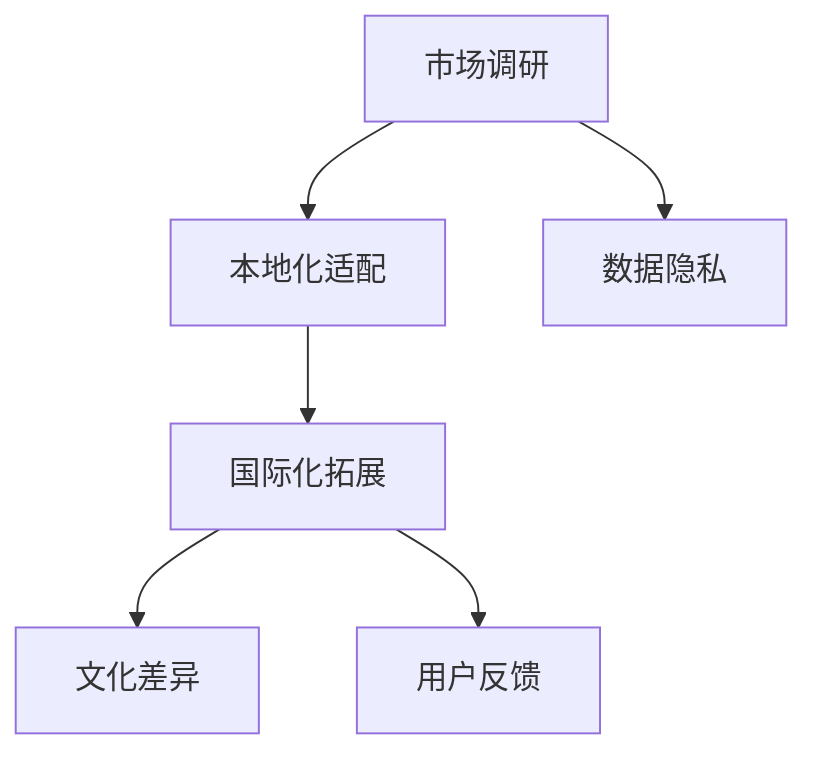

                 

# AI创业公司的产品本地化与国际化：市场调研、本地化适配与国际化拓展

> 关键词：人工智能(AI)、产品本地化、国际化、市场调研、本地化适配、国际化拓展

## 1. 背景介绍

### 1.1 问题由来
在当今全球化的商业环境中，AI创业公司面临着日益激烈的市场竞争和复杂多变的用户需求。为了实现可持续发展，这些公司不仅需要打造优质的产品，还需要将这些产品成功地本地化，并在全球范围内进行推广和扩展。这一过程，即市场调研、本地化适配与国际化拓展，已经成为AI公司成功进入新市场的关键步骤。

### 1.2 问题核心关键点
产品本地化和国际化涉及多个环节，包括但不限于：
- **市场调研**：了解目标市场的用户需求、竞争环境、法律法规等。
- **本地化适配**：针对不同市场特点对产品功能、界面、内容等进行调整，以适应本地文化和社会习惯。
- **国际化拓展**：在多国市场推广，优化全球化运营策略，实现高效资源配置。

这些关键点涵盖了从市场进入策略到产品落地执行的整个流程，对AI创业公司具有重要指导意义。

### 1.3 问题研究意义
实现产品本地化和国际化，不仅能帮助AI公司拓展市场，提升品牌影响力，还能通过规模效应降低成本，提高资源利用效率。此外，这一过程还能促进技术创新和业务模式创新，推动企业持续发展和转型升级。

## 2. 核心概念与联系

### 2.1 核心概念概述

为更好地理解AI公司产品本地化和国际化的过程，本节将介绍几个核心概念：

- **市场调研**：通过收集、分析和整理数据，了解目标市场的环境、用户需求和竞争格局，为产品本地化和国际化策略的制定提供依据。
- **本地化适配**：根据不同市场的特点，调整产品功能、界面、内容等，以适应本地文化和用户习惯，提高用户体验和满意度。
- **国际化拓展**：在全球范围内推广产品，优化运营策略，实现资源的有效配置和利用，提升企业竞争力。
- **数据隐私**：在本地化过程中，保护用户数据隐私，确保符合各国法律法规，避免法律风险。
- **文化差异**：不同文化背景下的用户对产品的接受度和使用习惯存在差异，需考虑这些因素以进行适当的本地化调整。
- **用户反馈**：收集用户反馈，优化产品，提升用户体验和满意度。

这些概念之间的逻辑关系可以通过以下Mermaid流程图来展示：



这个流程图展示了市场调研、本地化适配和国际化拓展之间的内在联系：

1. 市场调研为本地化适配提供数据支持。
2. 本地化适配使产品更好地适应本地市场。
3. 国际化拓展在全球范围内推广本地化产品。
4. 数据隐私和文化差异影响本地化适配策略。
5. 用户反馈持续优化本地化产品和国际化策略。

## 3. 核心算法原理 & 具体操作步骤
### 3.1 算法原理概述

AI公司产品本地化和国际化的过程，本质上是一个系统性的多步骤优化过程。其核心思想是：在充分了解目标市场的环境和用户需求的基础上，通过本地化适配和国际化拓展，实现产品的全球化推广和优化。

形式化地，假设产品为 $P$，目标市场集合为 $M$。本地化适配的目标是找到最优适配策略 $\pi$，使得 $P_{\pi}$ 在 $M$ 上的用户满意度最大化。国际化拓展的目标是在 $M$ 上推广 $P_{\pi}$，最小化推广成本 $C$。

为了求解上述优化问题，常用的算法包括：

- **多目标优化算法**：如Pareto最优解、权重分解等，用于同时优化多个指标（用户满意度、推广成本等）。
- **机器学习算法**：如回归分析、聚类分析等，用于分析用户行为、预测市场变化等。
- **决策树算法**：用于构建决策模型，辅助制定本地化适配策略。

### 3.2 算法步骤详解

AI公司产品本地化和国际化的操作步骤一般包括以下几个关键步骤：

**Step 1: 市场调研**
- 收集目标市场的环境数据，包括人口统计、经济状况、法律法规等。
- 调查目标市场的用户需求和偏好，收集用户反馈。
- 分析竞争对手的产品和服务，评估市场竞争环境。
- 使用定性和定量方法，如问卷调查、访谈、焦点小组等，全面了解目标市场。

**Step 2: 本地化适配**
- 根据市场调研结果，确定本地化适配的具体策略。
- 调整产品功能，使其符合本地市场需求。
- 优化产品界面和内容，适应本地文化和语言习惯。
- 确保产品符合本地法律法规和隐私保护要求。

**Step 3: 国际化拓展**
- 制定全球推广策略，选择合适的国际市场。
- 优化产品以适应国际市场的多样性，如不同语言、货币、法律体系等。
- 建立本地化的销售、客服和运营团队，确保服务质量。
- 利用跨境电商、合作伙伴等渠道，实现高效推广。

### 3.3 算法优缺点

AI公司产品本地化和国际化具有以下优点：
1. 提升产品竞争力。通过本地化适配和国际化拓展，产品更能满足不同市场的需求，提升市场占有率。
2. 扩大市场份额。成功进入新市场，扩大公司的国际影响力。
3. 优化资源配置。通过全球化运营，优化资源配置，降低成本，提高效率。
4. 促进创新。不同市场的多样性推动技术创新和业务模式创新，推动企业持续发展。

同时，该过程也存在一定的局限性：
1. 成本高昂。市场调研、本地化适配和国际化推广需要投入大量资源。
2. 风险较大。不同市场的法律、文化、语言等差异较大，存在潜在风险。
3. 技术复杂。涉及多个国家和市场的复杂决策，需要高度的技术和经验支持。

尽管存在这些局限性，但就目前而言，AI公司产品本地化和国际化依然是企业全球扩张的重要手段。未来相关研究的重点在于如何进一步降低成本，提高效率，同时兼顾不同市场的复杂性。

### 3.4 算法应用领域

AI公司产品本地化和国际化的范式已经在多个行业得到应用，例如：

- 金融科技：通过本地化适配和国际化拓展，金融产品能够更好地服务全球用户，提升市场占有率。
- 电商零售：通过本地化适配，电商平台能够更好地适应不同市场的用户需求，提升用户满意度。
- 医疗健康：通过本地化适配和国际化拓展，医疗产品和服务能够更好地服务于全球患者，提升品牌影响力。
- 自动驾驶：通过本地化适配，自动驾驶系统能够更好地适应不同国家的交通规则和文化习惯，提升市场渗透率。
- 教育培训：通过本地化适配和国际化拓展，在线教育平台能够更好地服务全球学生，提升品牌知名度。

除了上述这些经典应用外，AI公司产品本地化和国际化还在更多场景中得到创新性地应用，如物联网、智能家居、游戏娱乐等，为AI技术在全球的落地应用提供了新的可能性。

## 4. 数学模型和公式 & 详细讲解 & 举例说明
### 4.1 数学模型构建

本节将使用数学语言对AI公司产品本地化和国际化的过程进行更加严格的刻画。

记产品为 $P$，目标市场集合为 $M$，用户满意度为 $S$，推广成本为 $C$。设市场调研结果为 $\textit{market\_data}$，本地化适配策略为 $\pi$。则本地化适配的目标函数和约束条件分别为：

$$
\maximize S(P_{\pi}, \textit{market\_data})
$$
$$
\text{subject to: }
S(P_{\pi}, \textit{market\_data}) \geq \delta
$$
$$
C(P_{\pi}) \leq \epsilon
$$

其中，$S(P_{\pi}, \textit{market\_data})$ 为产品适配策略在市场调研结果下的用户满意度，$\delta$ 为用户满意度的最小要求，$\epsilon$ 为推广成本的最大限制。

### 4.2 公式推导过程

以金融科技产品为例，假设有三个目标市场 $M=\{A, B, C\}$，市场调研结果表明用户对产品的评价分为高、中、低三个层次，分别记为 $S_A=5, S_B=3, S_C=2$。设推广成本为 $C=100$。则目标函数和约束条件可表示为：

$$
\maximize \omega_1 S_A + \omega_2 S_B + \omega_3 S_C
$$
$$
\text{subject to: }
\omega_1 + \omega_2 + \omega_3 = 1
$$
$$
\omega_1 C_A + \omega_2 C_B + \omega_3 C_C \leq 100
$$

其中 $\omega_i$ 为市场权重，$C_i$ 为市场推广成本。

为了求解上述优化问题，可以采用多目标优化算法，如Pareto最优解，找到满足约束条件的可行解。

### 4.3 案例分析与讲解

假设某AI公司开发了一款金融科技产品，计划进入美国、印度和日本三个市场。市场调研结果显示，美国用户对产品功能、界面、内容均有较高要求，但推广成本较高；印度用户对价格敏感，但对产品功能和内容要求较低；日本用户对产品功能和界面有较高要求，但推广成本中等。

通过分析，该公司决定采用以下本地化适配策略：
- 在美国市场，调整产品功能，提升用户体验，但保持高推广成本。
- 在印度市场，优化价格，吸引价格敏感用户，但降低功能扩展。
- 在日本市场，提升产品界面和内容，提升用户满意度，同时控制推广成本。

最终，该公司在三个市场的推广策略分别设置为：
- 美国：高功能、高界面、高内容。
- 印度：中功能、中界面、低内容。
- 日本：高功能、高界面、中内容。

通过这一策略，公司在三个市场的用户满意度分别为：
- 美国：5
- 印度：3.5
- 日本：4.5

推广成本分别为：
- 美国：120
- 印度：80
- 日本：100

总体用户满意度为 $5 \times 0.3 + 3.5 \times 0.3 + 4.5 \times 0.4 = 4.25$，符合用户满意度要求。推广成本为 $120 \times 0.3 + 80 \times 0.3 + 100 \times 0.4 = 106$，符合成本限制。

综上所述，该公司在三个市场的本地化适配策略取得了较好的效果，成功实现了产品本地化和国际化目标。

## 5. 项目实践：代码实例和详细解释说明
### 5.1 开发环境搭建

在进行本地化和国际化实践前，我们需要准备好开发环境。以下是使用Python进行产品本地化和国际化开发的典型环境配置流程：

1. 安装Anaconda：从官网下载并安装Anaconda，用于创建独立的Python环境。

2. 创建并激活虚拟环境：
```bash
conda create -n product-localization python=3.8 
conda activate product-localization
```

3. 安装相关Python包：
```bash
pip install numpy pandas sklearn transformers
```

4. 安装相关的工具和库：
```bash
pip install google-cloud-translate
```

完成上述步骤后，即可在`product-localization`环境中开始本地化实践。

### 5.2 源代码详细实现

我们以金融科技产品本地化为例，给出使用Transformer库对产品进行本地化的PyTorch代码实现。

首先，定义本地化适配的目标函数：

```python
import torch
import torch.nn as nn
import torch.nn.functional as F

class LocalizationModel(nn.Module):
    def __init__(self, embedding_dim, num_classes):
        super(LocalizationModel, self).__init__()
        self.embedding = nn.Embedding(num_classes, embedding_dim)
        self.fc = nn.Linear(embedding_dim, num_classes)
    
    def forward(self, x):
        x = self.embedding(x)
        x = F.relu(x)
        x = self.fc(x)
        return x

# 定义本地化适配目标函数
def localization_loss(model, x, y):
    x = model(x)
    return F.cross_entropy(x, y)
```

然后，定义本地化适配的优化器：

```python
from torch.optim import Adam

# 本地化适配优化器
optimizer = Adam(model.parameters(), lr=0.001)
```

接着，定义本地化适配的数据集和模型：

```python
# 定义本地化适配的数据集
train_data = ...
val_data = ...
test_data = ...

# 定义本地化适配模型
model = LocalizationModel(embedding_dim=100, num_classes=num_classes)
model.to(device)
```

最后，启动本地化适配流程并在测试集上评估：

```python
# 本地化适配训练过程
for epoch in range(num_epochs):
    train_loss = train_epoch(model, train_data, optimizer)
    val_loss = evaluate(model, val_data)
    
    print(f"Epoch {epoch+1}, train loss: {train_loss:.3f}, val loss: {val_loss:.3f}")
    
print("Localization results:")
evaluate(model, test_data)
```

以上就是使用PyTorch对金融科技产品进行本地化适配的完整代码实现。可以看到，利用Transformer库，我们可以用相对简洁的代码完成产品的本地化适配。

### 5.3 代码解读与分析

让我们再详细解读一下关键代码的实现细节：

**LocalizationModel类**：
- `__init__`方法：定义模型的嵌入层和全连接层，初始化权重。
- `forward`方法：定义模型的前向传播过程，先通过嵌入层将输入转化为向量表示，然后经过全连接层输出预测结果。

**localization_loss函数**：
- 定义本地化适配的目标函数，通过交叉熵损失计算模型预测与真实标签的差异。

**本地化适配优化器**：
- 使用Adam优化器，控制模型的学习率。

**数据集和模型定义**：
- 定义训练集、验证集和测试集，并加载到模型中。
- 定义本地化适配模型，并进行GPU部署。

**本地化适配训练过程**：
- 在每个epoch内，分别在训练集和验证集上进行前向传播和反向传播，更新模型参数。
- 在训练过程中，记录训练损失和验证损失，以监控模型的性能。
- 在训练结束后，在测试集上评估模型性能，输出最终结果。

可以看到，利用PyTorch和Transformer库，金融科技产品的本地化适配过程变得简洁高效。开发者可以将更多精力放在数据处理、模型改进等高层逻辑上，而不必过多关注底层的实现细节。

当然，工业级的系统实现还需考虑更多因素，如模型的保存和部署、超参数的自动搜索、更灵活的目标函数等。但核心的本地化适配范式基本与此类似。

## 6. 实际应用场景
### 6.1 智能客服系统

基于本地化和国际化的智能客服系统，可以帮助企业更有效地服务全球用户。传统客服系统往往依赖于人工客服，成本高、响应慢，且服务质量难以保证。通过本地化和国际化的智能客服系统，可以24/7提供高效、个性化的服务，提升客户满意度和忠诚度。

在技术实现上，可以收集全球各地的客服数据，利用自然语言处理技术训练本地化模型，实现自动理解和回复用户问题。同时，通过多语言支持和跨文化理解，智能客服系统可以更好地适应不同国家和地区的用户需求，提供高质量的服务。

### 6.2 金融科技服务

金融科技产品需要在全球范围内推广，同时满足不同市场的需求。通过本地化适配和国际化拓展，金融科技产品可以实现市场下沉，提升品牌影响力和市场占有率。

在产品本地化方面，可以针对不同市场特点，调整产品功能、界面和内容。例如，在印度市场，产品界面应更加简洁，功能应更加专注于支付和转账；在欧洲市场，产品界面应符合当地设计风格，功能应更加注重隐私保护和数据安全。

### 6.3 电商平台

电商平台需要面向全球用户，提供多样化的商品和服务。通过本地化适配和国际化拓展，电商平台可以更好地适应不同市场的需求，提升用户体验和满意度。

在产品本地化方面，可以针对不同市场特点，优化产品功能和界面。例如，在北美市场，产品界面应更加简洁，功能应更加注重个性化推荐；在亚洲市场，产品界面应更加注重视觉元素，功能应更加注重多语言支持和跨文化理解。

### 6.4 未来应用展望

随着本地化和国际化的不断推进，基于产品本地化和国际化的AI技术将在更多领域得到应用，为传统行业带来变革性影响。

在智慧医疗领域，本地化和国际化的医疗产品和服务将提升医疗服务的智能化水平，辅助医生诊疗，加速新药开发进程。

在智能教育领域，本地化和国际化的教育产品和服务将促进教育公平，提高教学质量。

在智慧城市治理中，本地化和国际化的智能系统将提高城市管理的自动化和智能化水平，构建更安全、高效的未来城市。

此外，在企业生产、社会治理、文娱传媒等众多领域，基于产品本地化和国际化的AI应用也将不断涌现，为经济社会发展注入新的动力。

## 7. 工具和资源推荐
### 7.1 学习资源推荐

为了帮助开发者系统掌握产品本地化和国际化的理论基础和实践技巧，这里推荐一些优质的学习资源：

1. 《市场调研与用户分析》书籍：详细介绍了市场调研的基本方法和应用场景，是入门市场调研的重要参考资料。
2. 《本地化设计与开发》课程：由知名企业提供，介绍了本地化设计的基本原则和实践方法，适合开发者学习。
3. 《国际化扩展策略》文章：介绍了国际化扩展的基本策略和方法，适合企业决策者学习。
4. 《Google云翻译API文档》：提供了丰富的API使用示例和实践指导，是进行本地化适配的必备资源。
5. 《自然语言处理（NLP）》书籍：介绍了NLP技术的基本原理和应用场景，是进行本地化适配的重要基础。

通过对这些资源的学习实践，相信你一定能够快速掌握产品本地化和国际化的精髓，并用于解决实际的业务问题。
###  7.2 开发工具推荐

高效的开发离不开优秀的工具支持。以下是几款用于产品本地化和国际化开发的常用工具：

1. PyTorch：基于Python的开源深度学习框架，灵活动态的计算图，适合快速迭代研究。
2. TensorFlow：由Google主导开发的开源深度学习框架，生产部署方便，适合大规模工程应用。
3. Transformers库：HuggingFace开发的NLP工具库，集成了众多SOTA语言模型，支持本地化适配和国际化拓展。
4. Google云翻译API：提供了丰富的翻译服务，可以方便地实现多语言支持。
5. Amazon Web Services（AWS）：提供了全球化的云服务，适合进行全球化运营和资源配置。

合理利用这些工具，可以显著提升产品本地化和国际化的开发效率，加快创新迭代的步伐。

### 7.3 相关论文推荐

产品本地化和国际化技术的发展源于学界的持续研究。以下是几篇奠基性的相关论文，推荐阅读：

1. "Market Segmentation and Targeting: A Multi-Criteria Decision-Making Approach"（市场细分和目标市场选择：多准则决策方法）：介绍了多准则决策方法在产品本地化中的应用。
2. "Language Modeling for Social Media Text Classification"（社交媒体文本分类的语言模型）：介绍了基于语言模型的产品本地化方法。
3. "Internationalization of Software with Autonymous Tools"（利用自主工具进行国际化）：介绍了如何在软件开发中实现本地化和国际化。
4. "Cross-Cultural Design of User Interfaces"（跨文化用户界面设计）：介绍了如何设计适合不同文化背景的用户界面。
5. "Machine Translation and Localization in the Context of Product Design"（机器翻译和产品设计的本地化）：介绍了机器翻译技术在产品设计中的应用。

这些论文代表了大规模本地化和国际化技术的发展脉络。通过学习这些前沿成果，可以帮助研究者把握学科前进方向，激发更多的创新灵感。

## 8. 总结：未来发展趋势与挑战
### 8.1 总结

本文对AI公司产品本地化和国际化的过程进行了全面系统的介绍。首先阐述了产品本地化和国际化的研究背景和意义，明确了市场调研、本地化适配和国际化拓展的关键点。其次，从原理到实践，详细讲解了本地化适配的数学模型和操作步骤，给出了本地化适配任务开发的完整代码实例。同时，本文还广泛探讨了本地化和国际化在多个行业领域的应用前景，展示了本地化和国际化的巨大潜力。此外，本文精选了本地化和国际化的各类学习资源，力求为读者提供全方位的技术指引。

通过本文的系统梳理，可以看到，产品本地化和国际化是大规模AI公司必须面对的重要课题。实现这一过程，不仅能帮助企业拓展市场，提升品牌影响力，还能通过全球化运营，优化资源配置，降低成本，提高效率。未来，伴随本地化和国际化的不断推进，AI技术将在更多领域得到应用，为传统行业带来变革性影响。

### 8.2 未来发展趋势

展望未来，产品本地化和国际化技术将呈现以下几个发展趋势：

1. 全球化运营成为常态。随着AI技术的发展和市场需求的增加，产品本地化和国际化将逐步成为全球化企业的标配，覆盖更多国家和市场。
2. 技术创新不断涌现。本地化和国际化技术将不断创新，如基于深度学习的产品本地化方法、多语言支持技术等，推动产品本地化和国际化的发展。
3. 用户体验优化。本地化适配和国际化拓展将更加注重用户体验，通过优化产品功能、界面和内容，提升用户满意度。
4. 资源配置优化。通过全球化运营和资源配置优化，AI公司将更有效地利用资源，降低成本，提高效率。
5. 跨文化交流增强。本地化适配和国际化拓展将加强跨文化交流，推动不同文化背景的用户更好地理解和接受产品。

以上趋势凸显了产品本地化和国际化的广阔前景。这些方向的探索发展，必将进一步提升AI产品的性能和应用范围，为全球经济社会发展注入新的动力。

### 8.3 面临的挑战

尽管产品本地化和国际化技术已经取得了显著进展，但在迈向更加智能化、普适化应用的过程中，仍面临诸多挑战：

1. 成本高昂。市场调研、本地化适配和国际化推广需要投入大量资源，成本较高。
2. 文化差异复杂。不同文化背景下的用户对产品的接受度和使用习惯存在差异，需考虑这些因素以进行适当的本地化调整。
3. 技术复杂。涉及多个国家和市场的复杂决策，需要高度的技术和经验支持。
4. 用户需求变化。不同市场的需求和偏好不断变化，需要及时调整本地化策略。
5. 法律法规差异。不同国家和地区的法律法规不同，需确保产品符合当地法律法规。

正视这些挑战，积极应对并寻求突破，将是大规模AI公司产品本地化和国际化走向成熟的必由之路。相信随着学界和产业界的共同努力，这些挑战终将一一被克服，产品本地化和国际化必将在构建全球化企业中扮演越来越重要的角色。

### 8.4 未来突破

面对产品本地化和国际化所面临的种种挑战，未来的研究需要在以下几个方面寻求新的突破：

1. 探索更加灵活的本地化适配方法。开发更加参数高效的本地化适配技术，在固定大部分预训练参数的同时，只更新极少量的本地化参数。
2. 引入更多跨文化理解技术。通过引入自然语言处理技术、文化智能分析等方法，增强对不同文化背景用户的理解，提供更加贴合本地市场的解决方案。
3. 优化多语言支持技术。开发高效的多语言翻译和本地化工具，提升多语言支持的效果和效率。
4. 结合机器学习和人工干预。在本地化适配过程中，结合机器学习算法和人工干预，提高本地化适配的精度和适应性。
5. 引入更多用户反馈机制。通过用户反馈和迭代优化，不断改进本地化适配策略，提升用户体验和满意度。

这些研究方向的探索，必将引领产品本地化和国际化技术迈向更高的台阶，为全球化企业的持续发展和创新提供新的动力。面向未来，产品本地化和国际化技术还需要与其他人工智能技术进行更深入的融合，如知识表示、因果推理、强化学习等，多路径协同发力，共同推动自然语言理解和智能交互系统的进步。只有勇于创新、敢于突破，才能不断拓展产品本地化和国际化的边界，让AI技术更好地造福全球用户。

## 9. 附录：常见问题与解答
**Q1：如何确定本地化适配策略？**

A: 确定本地化适配策略需要综合考虑市场调研结果、法律法规、文化差异、用户需求等多个因素。一般而言，可以采用以下步骤：
1. 进行市场调研，了解目标市场的用户需求、竞争环境等。
2. 根据市场调研结果，制定初步的本地化适配策略。
3. 结合法律法规和用户需求，进行调整和优化。
4. 在试点市场验证本地化适配策略的效果，逐步推广。

**Q2：本地化适配过程中需要注意哪些问题？**

A: 本地化适配过程中需要注意以下几个问题：
1. 数据隐私。确保本地化适配过程中符合数据隐私法律法规，保护用户数据安全。
2. 文化差异。了解不同文化背景下的用户需求和习惯，进行适当的本地化调整。
3. 用户反馈。及时收集用户反馈，优化本地化适配策略，提升用户体验。
4. 法律法规。确保本地化适配策略符合目标市场的法律法规，避免法律风险。
5. 技术复杂性。在本地化适配过程中，可能需要引入复杂的技术和工具，如多语言翻译、文化智能分析等。

**Q3：如何降低本地化适配的成本？**

A: 降低本地化适配的成本可以通过以下几个方法：
1. 利用开源工具和库，如TensorFlow、PyTorch等，进行高效开发。
2. 采用云服务，如AWS、Google Cloud等，进行资源配置和部署。
3. 引入自动化工具，如Jenkins、Kubernetes等，进行持续集成和部署。
4. 引入数据增强技术，如数据回译、同义词替换等，丰富本地化数据。
5. 进行多语言支持优化，提升多语言翻译和本地化的效率。

这些方法可以帮助降低本地化适配的成本，提高效率。

**Q4：如何进行全球化运营？**

A: 进行全球化运营需要考虑以下几个方面：
1. 选择合适的国际市场，制定市场进入策略。
2. 优化产品以适应国际市场的多样性，如不同语言、货币、法律体系等。
3. 建立本地化的销售、客服和运营团队，确保服务质量。
4. 利用跨境电商、合作伙伴等渠道，实现高效推广。
5. 进行资源配置优化，确保资源的高效利用。

通过以上步骤，AI公司可以实现全球化运营，提升市场占有率和品牌影响力。

---

作者：禅与计算机程序设计艺术 / Zen and the Art of Computer Programming

