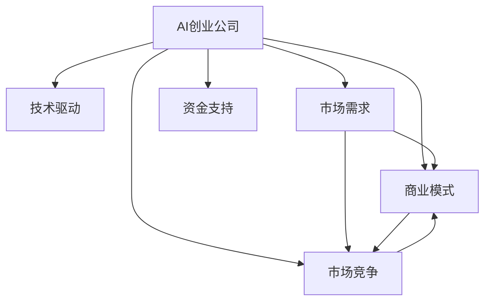

                 

# AI创业公司的市场前景

> 关键词：AI创业, 市场前景, 技术驱动, 业务模式, 技术瓶颈, 投资机遇

## 1. 背景介绍

### 1.1 问题由来
近年来，人工智能(AI)技术在各个行业领域的广泛应用，催生了大量AI创业公司的诞生。从智能客服、个性化推荐到医疗诊断、金融风控，AI技术正以前所未有的速度和广度，深入各行各业。那么，AI创业公司的市场前景到底如何？它们在成长过程中面临哪些关键问题？本文将从多个角度深入探讨这些重要问题，以期为AI创业公司的健康发展提供一些见解。

### 1.2 问题核心关键点
AI创业公司的发展前景涉及多个维度，包括技术创新、市场需求、商业模式、市场竞争、资金支持等方面。了解这些关键点，可以帮助我们全面分析AI创业公司所处的市场环境，以及未来的发展趋势。

## 2. 核心概念与联系

### 2.1 核心概念概述

为更好地理解AI创业公司的市场前景，本节将介绍几个密切相关的核心概念：

- **AI创业公司**：专注于人工智能技术的开发和应用，通过研发新技术或优化现有技术来提升业务效率或创造新商业模式的公司。
- **技术驱动**：AI创业公司以技术创新为核心驱动力，通过持续研发新技术，解决行业难题，提升产品性能。
- **市场需求**：指市场中对AI技术的需求量和规模，包括企业内部需求和外部市场需求。
- **商业模式**：AI创业公司运营的商业模式，如SaaS、B2B、B2C等，不同商业模式对市场拓展、收入来源、客户关系管理等都有不同影响。
- **市场竞争**：AI创业公司在市场中面临的竞争对手，包括传统企业、初创公司、跨行业竞争者等。
- **资金支持**：AI创业公司获取资金的渠道，包括风险投资、政府基金、众筹等。

这些核心概念之间的逻辑关系可以通过以下Mermaid流程图来展示：



这个流程图展示了一个AI创业公司市场前景的多个影响因素，包括技术、需求、商业模式、竞争和资金。

## 3. 核心算法原理 & 具体操作步骤
### 3.1 算法原理概述

AI创业公司的成功与否，在很大程度上取决于其技术创新能力。核心算法原理包括但不限于以下几个方面：

- **机器学习与深度学习**：AI创业公司往往利用机器学习、深度学习等技术，通过大量数据训练模型，提升模型性能和泛化能力。
- **自然语言处理(NLP)**：在文本分析、智能客服、情感分析等应用中，NLP技术至关重要。
- **计算机视觉(CV)**：在图像识别、视频分析等场景中，CV技术能够提供强大的视觉感知能力。
- **强化学习**：在机器人控制、游戏AI等应用中，强化学习能够实现智能决策和自适应优化。
- **联邦学习**：通过分布式协同训练，联邦学习能够在保护隐私的前提下，利用多源数据提升模型性能。

### 3.2 算法步骤详解

以下是AI创业公司技术驱动的典型步骤：

**Step 1: 技术预研与可行性分析**
- 确定技术方向和应用场景，进行市场调研和技术可行性分析。
- 识别现有技术和待解决的问题，确定技术突破点。

**Step 2: 核心算法设计**
- 选择合适的算法框架和模型架构，如TensorFlow、PyTorch等。
- 设计算法原型，进行小规模实验验证算法效果。

**Step 3: 模型训练与调优**
- 构建训练环境，收集并准备训练数据集。
- 使用GPU或TPU等高性能计算资源，进行模型训练。
- 通过交叉验证等技术手段，进行模型调优，提升模型性能。

**Step 4: 模型部署与优化**
- 将训练好的模型部署到目标平台上，如云服务器、嵌入式设备等。
- 对模型进行性能测试和优化，提高模型响应速度和准确率。

### 3.3 算法优缺点

AI创业公司的技术驱动模式具有以下优点：
1. 持续创新：AI技术的快速发展，为创业公司提供了源源不断的创新机会。
2. 业务价值高：AI技术能够大幅提升业务效率和用户体验，创造巨大商业价值。
3. 市场潜力大：AI技术在多个行业领域的应用前景广阔，市场潜力巨大。

同时，该模式也存在一定的局限性：
1. 研发投入高：AI技术的研发周期长，需要大量资金和人力投入。
2. 技术复杂度高：AI技术往往涉及多个学科知识，研发难度大。
3. 数据依赖性强：AI技术依赖大量高质量数据进行训练，数据获取难度大。
4. 模型复杂度高：大规模模型往往需要高性能计算资源支持，对硬件要求高。

### 3.4 算法应用领域

AI创业公司的技术驱动模式广泛应用于多个领域，例如：

- **智能客服**：利用NLP和机器学习技术，提供智能语音、文本客服服务，提升客户满意度。
- **金融风控**：利用机器学习和大数据技术，进行信用评估、欺诈检测、风险预警等。
- **医疗诊断**：利用深度学习和计算机视觉技术，进行图像识别、病理分析等，辅助医生诊断。
- **自动驾驶**：利用计算机视觉和强化学习技术，开发自动驾驶汽车，提升交通安全。
- **推荐系统**：利用机器学习算法，进行个性化推荐，提升用户体验和销售转化率。
- **工业智能**：利用AI技术，优化生产流程，提高生产效率和产品质量。
- **智慧城市**：利用AI技术，进行城市管理、交通优化、环境监测等，提升城市智能化水平。

这些应用场景展示了AI技术的广泛应用前景，也为AI创业公司提供了丰富的市场机会。

## 4. 数学模型和公式 & 详细讲解 & 举例说明
### 4.1 数学模型构建

为了更好地理解AI创业公司的技术驱动模式，本节将使用数学语言对模型训练和优化过程进行更严格的刻画。

假设AI创业公司的核心算法为 $F_{\theta}(X)$，其中 $\theta$ 为模型参数，$X$ 为输入数据。模型的目标是最小化损失函数 $L(\theta)$：

$$
L(\theta) = \frac{1}{N}\sum_{i=1}^N \ell(F_{\theta}(x_i),y_i)
$$

其中 $\ell$ 为损失函数，$x_i$ 和 $y_i$ 分别为输入和标签。

### 4.2 公式推导过程

以二分类任务为例，假设模型输出为 $y' = F_{\theta}(x)$，损失函数为交叉熵损失，则：

$$
L(\theta) = -\frac{1}{N}\sum_{i=1}^N [y_i\log y' + (1-y_i)\log (1-y')]
$$

模型参数 $\theta$ 的更新公式为：

$$
\theta \leftarrow \theta - \eta \nabla_{\theta}L(\theta)
$$

其中 $\eta$ 为学习率，$\nabla_{\theta}L(\theta)$ 为损失函数对参数 $\theta$ 的梯度，通过反向传播算法计算得到。

### 4.3 案例分析与讲解

以智能客服系统为例，分析模型训练和优化的过程。

**Step 1: 数据准备**
- 收集历史客户咨询记录，提取问题和答案对，作为训练数据集。
- 对文本数据进行预处理，如分词、去停用词、标准化等，提高数据质量。

**Step 2: 模型训练**
- 使用预训练的NLP模型作为特征提取器，提取客户咨询问题的特征。
- 在训练集上，使用交叉熵损失函数进行模型训练，优化模型参数 $\theta$。
- 通过早停法(Early Stopping)等技术手段，避免过拟合。

**Step 3: 模型优化**
- 在验证集上评估模型性能，调整模型参数 $\theta$，提升模型泛化能力。
- 部署优化模型到生产环境，进行性能测试和调优，确保模型稳定运行。

## 5. 项目实践：代码实例和详细解释说明
### 5.1 开发环境搭建

在进行AI创业公司的技术驱动模式实践前，我们需要准备好开发环境。以下是使用Python进行TensorFlow开发的环境配置流程：

1. 安装Anaconda：从官网下载并安装Anaconda，用于创建独立的Python环境。

2. 创建并激活虚拟环境：
```bash
conda create -n tf-env python=3.8 
conda activate tf-env
```

3. 安装TensorFlow：根据CUDA版本，从官网获取对应的安装命令。例如：
```bash
conda install tensorflow tensorflow-estimator tensorflow-gpu==2.8.0
```

4. 安装各类工具包：
```bash
pip install numpy pandas scikit-learn matplotlib tqdm jupyter notebook ipython
```

完成上述步骤后，即可在`tf-env`环境中开始技术驱动模式实践。

### 5.2 源代码详细实现

这里我们以智能客服系统为例，给出使用TensorFlow进行模型训练的PyTorch代码实现。

首先，定义模型和损失函数：

```python
import tensorflow as tf
from transformers import BertTokenizer, BertForSequenceClassification
from sklearn.model_selection import train_test_split
import numpy as np

# 定义模型
class Model(tf.keras.Model):
    def __init__(self, num_classes):
        super(Model, self).__init__()
        self.bert = BertForSequenceClassification.from_pretrained('bert-base-cased', num_labels=num_classes)
    
    def call(self, inputs, training=False):
        return self.bert(inputs)

# 定义损失函数
loss_fn = tf.keras.losses.SparseCategoricalCrossentropy(from_logits=True)

# 加载预训练模型和数据集
tokenizer = BertTokenizer.from_pretrained('bert-base-cased')
train_data, test_data = train_test_split(train_dataset, test_size=0.2)
```

然后，定义训练和评估函数：

```python
# 定义训练函数
def train_epoch(model, dataset, batch_size, optimizer):
    for batch in dataset:
        input_ids = batch['input_ids']
        attention_mask = batch['attention_mask']
        labels = batch['labels']
        with tf.GradientTape() as tape:
            logits = model(input_ids, attention_mask=attention_mask)
            loss = loss_fn(labels, logits)
        gradients = tape.gradient(loss, model.trainable_variables)
        optimizer.apply_gradients(zip(gradients, model.trainable_variables))

# 定义评估函数
def evaluate(model, dataset, batch_size):
    evaluator = tf.keras.metrics.SparseCategoricalAccuracy()
    for batch in dataset:
        input_ids = batch['input_ids']
        attention_mask = batch['attention_mask']
        labels = batch['labels']
        logits = model(input_ids, attention_mask=attention_mask)
        evaluator(labels, logits)
    return evaluator.result().numpy()
```

最后，启动训练流程并在测试集上评估：

```python
# 定义模型和优化器
model = Model(num_classes)
optimizer = tf.keras.optimizers.Adam(learning_rate=2e-5)

# 训练模型
for epoch in range(epochs):
    train_epoch(model, train_data, batch_size, optimizer)
    accuracy = evaluate(model, test_data, batch_size)
    print(f"Epoch {epoch+1}, test accuracy: {accuracy:.3f}")
```

以上就是使用TensorFlow进行智能客服系统训练的完整代码实现。可以看到，TensorFlow提供了丰富的API和工具，使得模型训练过程变得简洁高效。

### 5.3 代码解读与分析

让我们再详细解读一下关键代码的实现细节：

**Model类**：
- `__init__`方法：初始化预训练的BERT模型，并定义模型结构。
- `call`方法：定义模型前向传播过程，输入特征通过BERT模型提取特征后输出。

**损失函数**：
- 使用SparseCategoricalCrossentropy作为交叉熵损失函数，适用于多分类任务。
- 从_logits参数设置为True，表示直接输出模型logits，不用softmax处理。

**数据集加载**：
- 使用预训练的BertTokenizer对输入文本进行编码，转换为模型可处理的格式。
- 使用train_test_split函数将数据集分为训练集和测试集，用于模型训练和评估。

**训练函数**：
- 定义训练过程，对每个批次数据进行前向传播、计算损失、反向传播和参数更新。
- 使用tf.GradientTape记录梯度，利用Adam优化器更新模型参数。

**评估函数**：
- 定义评估过程，对每个批次数据进行前向传播，计算准确率并返回最终评估结果。

**训练流程**：
- 循环迭代，每个epoch在训练集上进行一次训练，在测试集上进行一次评估。
- 在每个epoch结束后，输出测试集上的准确率。

可以看到，TensorFlow使得模型训练过程变得简单快捷，开发者可以专注于模型的设计和训练优化。

## 6. 实际应用场景
### 6.1 智能客服系统

智能客服系统是AI创业公司常见的应用场景之一。传统客服方式需要大量人力支持，难以满足企业24/7服务需求。通过智能客服系统，AI技术能够自动理解客户咨询内容，并给出准确回复，显著提升客户体验和服务效率。

在技术实现上，可以利用预训练的NLP模型作为特征提取器，对客户咨询文本进行编码，再通过全连接层输出分类结果。通过微调优化模型参数，提升模型在具体场景下的性能。例如，使用智能客服系统处理金融、电商、医疗等领域的客户咨询，能够显著降低企业运营成本，提升服务质量。

### 6.2 金融风控

金融风控是AI创业公司重要的应用领域之一。传统风控方法依赖人工审核，效率低、成本高。通过AI技术，可以实现自动化风险评估和预警，提升风控效果和效率。

在实际应用中，可以利用深度学习模型对客户历史交易数据进行分析和预测，判断其信用风险和欺诈风险。例如，使用金融风控系统对客户信用评估、交易监控、欺诈检测等任务进行自动化处理，能够显著降低金融风险，提高决策效率。

### 6.3 医疗诊断

AI创业公司在医疗诊断领域也具有广阔应用前景。传统医疗诊断依赖医生经验和大量数据积累，效率和准确率难以保证。通过AI技术，可以实现自动化的病理分析和诊断，提升诊断效率和准确率。

在技术实现上，可以利用计算机视觉技术对医学影像进行分析和识别，结合自然语言处理技术对病历进行信息提取和分析，最终辅助医生进行诊断决策。例如，使用医疗诊断系统处理影像诊断、病历分析、药物推荐等任务，能够显著提高医生工作效率，降低误诊率。

### 6.4 未来应用展望

随着AI技术的不断进步，AI创业公司的应用场景将更加广泛。未来的发展趋势可能包括：

1. **跨领域融合**：AI技术将更多地与其他领域技术结合，如区块链、物联网、边缘计算等，形成更强大的技术生态。
2. **联邦学习**：在分布式环境中，利用联邦学习技术进行模型训练和优化，提升模型隐私保护和鲁棒性。
3. **自适应学习**：引入自适应学习算法，如强化学习、元学习等，使模型具备自学习能力和动态优化能力。
4. **跨模态应用**：将视觉、听觉、语言等多种模态数据结合，提升模型的感知能力和泛化能力。
5. **边缘计算**：在物联网等边缘设备上，实现AI模型的轻量化部署，提升实时性和响应速度。
6. **低成本应用**：通过模型压缩、量化等技术，降低AI应用成本，实现更广泛的市场覆盖。

## 7. 工具和资源推荐
### 7.1 学习资源推荐

为了帮助开发者系统掌握AI创业公司的技术驱动模式，这里推荐一些优质的学习资源：

1. **TensorFlow官方文档**：提供了TensorFlow的全面介绍和详细教程，适合初学者和进阶开发者。
2. **Transformers官方文档**：提供了TensorFlow中Transformer模型的详细介绍和代码示例，适合从事NLP等任务的开发者。
3. **深度学习课程**：斯坦福大学、Coursera等平台提供了多个深度学习课程，涵盖从基础到高级的各类内容。
4. **TensorFlow实战书籍**：如《TensorFlow实战》、《TensorFlow从入门到精通》等，提供了实战案例和代码实现。
5. **AI创业公司案例**：如《AI创业公司崛起之路》、《AI公司如何成功》等书籍，提供了多个成功的AI创业公司案例和经验总结。

通过对这些资源的学习实践，相信你一定能够快速掌握AI创业公司的技术驱动模式，并用于解决实际的业务问题。

### 7.2 开发工具推荐

高效的开发离不开优秀的工具支持。以下是几款用于AI创业公司技术驱动模式开发的常用工具：

1. **TensorFlow**：基于Python的开源深度学习框架，灵活动态的计算图，适合快速迭代研究。
2. **TensorFlow Serving**：用于模型部署和推理的框架，支持多种模型格式和计算平台。
3. **TensorBoard**：模型训练的可视化工具，可以实时监测模型训练状态，提供丰富的图表呈现方式。
4. **PyTorch**：基于Python的开源深度学习框架，灵活性高，适合进行深度学习研究。
5. **Keras**：高层次的深度学习API，易于使用，适合快速搭建模型。
6. **Anaconda**：用于创建和管理Python环境的工具，便于管理和分享项目。

合理利用这些工具，可以显著提升AI创业公司技术驱动模式开发效率，加快创新迭代的步伐。

### 7.3 相关论文推荐

AI创业公司的技术驱动模式涉及广泛的技术领域，以下是几篇奠基性的相关论文，推荐阅读：

1. **TensorFlow论文**：TensorFlow的创始团队撰写的论文，介绍了TensorFlow的架构和实现细节。
2. **Transformer论文**：Google团队撰写的论文，介绍了Transformer的原理和应用。
3. **深度学习论文**：如《Deep Learning》、《Deep Reinforcement Learning》等书籍，提供了深度学习的理论基础和实践经验。
4. **联邦学习论文**：如《A Survey on Federated Learning》、《Byzantine Robustness in Federated Learning》等论文，提供了联邦学习的理论框架和应用案例。

这些论文代表了大规模AI创业公司技术驱动模式的理论基础，通过学习这些前沿成果，可以帮助研究者把握学科前进方向，激发更多的创新灵感。

## 8. 总结：未来发展趋势与挑战
### 8.1 总结

本文对AI创业公司的技术驱动模式进行了全面系统的介绍。首先阐述了AI创业公司的背景、核心概念和关键问题，明确了技术驱动模式在AI创业公司中的重要性。其次，从原理到实践，详细讲解了技术驱动模式的数学模型和核心算法，给出了技术驱动模式开发的具体代码实现。同时，本文还广泛探讨了技术驱动模式在智能客服、金融风控、医疗诊断等多个领域的应用前景，展示了技术驱动模式的市场潜力。此外，本文精选了技术驱动模式的相关学习资源，力求为开发者提供全方位的技术指引。

通过本文的系统梳理，可以看到，AI创业公司的技术驱动模式正在成为主流AI技术应用的重要范式，为AI创业公司提供了丰富的技术手段和应用场景。未来，随着技术不断演进和市场需求的持续变化，技术驱动模式必将迎来更多创新和突破，推动AI技术在各行各业的深入应用。

### 8.2 未来发展趋势

展望未来，AI创业公司的技术驱动模式将呈现以下几个发展趋势：

1. **技术创新加速**：AI技术的不断突破，将为创业公司提供更多创新机会，提升竞争力。
2. **业务模式多样化**：AI技术将应用于更多行业，形成多样化业务模式，拓展市场空间。
3. **跨领域融合**：AI技术与各领域的深度融合，将带来更多创新应用，提升业务价值。
4. **联邦学习普及**：联邦学习技术的普及，将使更多企业能够在大规模分布式环境中进行模型训练，提升数据利用效率。
5. **自适应学习提升**：引入自适应学习算法，提升模型的动态优化能力和泛化能力。
6. **跨模态应用广泛**：将多种模态数据结合，提升模型的感知能力和应用范围。
7. **低成本应用普及**：通过模型压缩、量化等技术，降低AI应用成本，推动AI技术更广泛的应用。

这些趋势凸显了AI创业公司技术驱动模式的广阔前景。未来，技术驱动模式将与更多前沿技术结合，推动AI技术向更加智能化、普适化的方向发展，带来更多的市场机遇和业务创新。

### 8.3 面临的挑战

尽管AI创业公司的技术驱动模式已经取得了瞩目成就，但在成长过程中仍面临诸多挑战：

1. **技术复杂度高**：AI技术的研发难度大，需要大量技术积累和经验支持。
2. **数据依赖性强**：AI模型训练依赖高质量数据，数据获取和标注成本高。
3. **模型复杂度高**：大规模模型对硬件要求高，计算资源消耗大。
4. **市场竞争激烈**：AI创业公司面临来自传统企业和跨行业公司的激烈竞争。
5. **商业化难度高**：技术驱动模式需要更多市场验证和用户反馈，商业化难度大。
6. **人才短缺**：AI技术需要高水平人才支持，人才短缺成为制约发展的瓶颈。
7. **监管合规**：AI技术的应用需要符合各行业法规和标准，监管合规难度大。

### 8.4 研究展望

面对技术驱动模式的挑战，未来的研究需要在以下几个方面寻求新的突破：

1. **降低数据依赖**：探索无监督学习和半监督学习等方法，降低对标注数据的需求，提升模型泛化能力。
2. **优化模型结构**：研究模型压缩、量化等技术，提升模型效率和可部署性。
3. **提升模型鲁棒性**：引入对抗训练、联邦学习等技术，提升模型的鲁棒性和泛化能力。
4. **增强可解释性**：引入可解释性技术，提升模型决策的透明性和可解释性。
5. **探索新业务模式**：结合区块链、物联网等新兴技术，探索新型的AI商业模式。
6. **提高人才引进能力**：加强人才培养和引进，建立完善的人才激励机制。
7. **增强法规合规**：加强合规研究，制定符合各行业法规和标准的AI应用方案。

这些研究方向将为AI创业公司的技术驱动模式带来新的突破，推动AI技术向更广泛的应用领域发展。

## 9. 附录：常见问题与解答
**Q1: AI创业公司如何获取高质量数据？**

A: AI创业公司可以通过多种方式获取高质量数据，如：
1. 购买公开数据集，如ImageNet、COCO等。
2. 进行数据标注和采集，如通过众包平台、爬虫等方式获取数据。
3. 合作数据提供商，获取行业数据和专业数据。
4. 利用联邦学习技术，在分布式环境中获取数据。

**Q2: 如何优化模型参数？**

A: 优化模型参数是AI创业公司技术驱动模式的关键环节。以下是一些常见的优化方法：
1. 使用Adam、SGD等优化器，调整学习率、动量等超参数。
2. 引入正则化技术，如L2正则、Dropout等，避免过拟合。
3. 进行模型剪枝、量化等技术，提升模型效率和可部署性。
4. 使用早停法、学习率衰减等技术，提升模型泛化能力。
5. 引入对抗训练、联邦学习等技术，提升模型鲁棒性。

**Q3: AI创业公司如何提高模型可解释性？**

A: 提高模型可解释性是AI创业公司技术驱动模式的重要任务。以下是一些常见的方法：
1. 使用可解释性技术，如LIME、SHAP等，生成模型的决策路径。
2. 引入符号化知识，如知识图谱、规则库等，提升模型决策的透明性和可解释性。
3. 利用多模态数据，结合视觉、语音、文本等多种信息，提高模型的综合解释能力。
4. 加强人工干预和审核，建立模型行为的监管机制，确保输出符合人类价值观和伦理道德。

通过这些方法，可以提升AI创业公司技术驱动模式的可解释性和可信度，增强用户对AI技术的信任感。

**Q4: AI创业公司如何提升市场竞争力？**

A: 提升市场竞争力是AI创业公司技术驱动模式的重要目标。以下是一些常见的策略：
1. 持续技术创新，推出具有创新性的技术产品。
2. 加强市场推广和品牌建设，提升品牌影响力和市场认可度。
3. 寻找战略合作伙伴，扩展市场资源和影响力。
4. 优化用户体验和服务质量，提升用户满意度和忠诚度。
5. 加强团队建设和人才培养，提高团队的核心竞争力。

通过这些策略，AI创业公司可以不断提升市场竞争力，实现可持续发展。

**Q5: AI创业公司如何降低运营成本？**

A: 降低运营成本是AI创业公司技术驱动模式的重要考虑因素。以下是一些常见的方法：
1. 引入云计算和分布式计算技术，降低计算资源成本。
2. 优化模型结构，减少模型参数量和计算量。
3. 引入联邦学习等技术，降低数据获取和标注成本。
4. 利用开源技术和工具，降低技术研发和部署成本。
5. 引入自动化和智能化管理技术，提升运营效率和降低人力成本。

通过这些方法，AI创业公司可以降低运营成本，提升盈利能力。

---

作者：禅与计算机程序设计艺术 / Zen and the Art of Computer Programming

