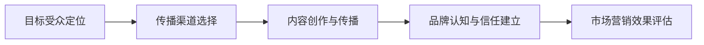

                 

## 1. 背景介绍

### 1.1 问题由来

在人工智能（AI）技术蓬勃发展的今天，许多创业公司纷纷涌现，致力于AI技术的研究与应用。然而，相较于技术突破，AI创业公司在市场营销与传播方面往往面临更多挑战。如何精准触达目标用户，构建品牌认知，提升市场份额，成为AI创业公司亟需解决的重大课题。

面对这一挑战，本文将从AI创业公司的视角出发，探讨有效的营销传播策略。我们将深入分析营销传播的核心要素，包括目标受众定位、传播渠道选择、内容创作与传播策略等，并提出具体的实践建议。

### 1.2 问题核心关键点

本文将围绕以下几个核心问题进行深入探讨：

1. **目标受众定位**：如何准确识别并了解目标用户群体的需求与特征？
2. **传播渠道选择**：选择何种渠道进行有效传播，最大化覆盖目标受众？
3. **内容创作与传播**：如何创作高质量的内容，并通过策略化传播提升用户参与度？
4. **品牌认知与信任建立**：如何通过一系列措施，提升品牌认知，建立用户信任？

通过解决上述问题，AI创业公司可以构建高效的市场营销体系，实现业务的快速增长。

## 2. 核心概念与联系

### 2.1 核心概念概述

- **目标受众定位**：基于用户行为数据分析、市场调研等手段，确定产品或服务的主要目标用户群体，并分析其需求和特征。
- **传播渠道选择**：根据目标受众的特征与分布，选择最合适的传播渠道，如社交媒体、内容平台、电子邮件、广告等。
- **内容创作与传播**：创作具有吸引力和价值的优质内容，并通过合理的传播策略，提升内容的传播效果，吸引并保持用户关注。
- **品牌认知与信任建立**：通过品牌建设、用户互动、反馈收集等措施，提升用户对品牌的好感和信任，形成品牌忠诚度。

### 2.2 核心概念联系

上述概念相互关联，形成一个完整的营销传播体系。通过目标受众定位，选择适合的传播渠道，创作有价值的内容，并建立品牌认知与信任，AI创业公司可以在竞争激烈的市场中脱颖而出，赢得更多用户和市场份额。

以下是一个简化的Mermaid流程图，展示了各概念之间的联系：



### 2.3 核心概念框架

| 概念         | 描述                                                   |
|--------------|--------------------------------------------------------|
| 目标受众定位 | 分析目标用户群体的需求、特征、行为，进行精准市场细分       |
| 传播渠道选择 | 根据受众特征，选择适合的内容传播渠道，最大化受众覆盖率     |
| 内容创作与传播 | 创作高质量、有价值的内容，并利用多渠道策略进行广泛传播   |
| 品牌认知与信任建立 | 通过品牌建设、用户互动等方式，提升品牌认知与用户信任度    |

通过这些核心概念的协同作用，AI创业公司可以构建起一套高效的市场营销体系，实现业务增长与用户积累。

## 3. 核心算法原理 & 具体操作步骤
### 3.1 算法原理概述

AI创业公司的营销传播策略可以视为一种优化问题，旨在最大化市场效果和用户参与度。核心算法原理包括以下几个方面：

- **目标受众分析**：使用机器学习或统计分析方法，从海量数据中提取用户行为特征，进行目标用户群体细分。
- **传播渠道选择**：通过模拟和优化算法，选择最优的传播渠道组合，以最大化覆盖目标受众。
- **内容创作与优化**：采用自然语言处理（NLP）和推荐系统等技术，创作和优化内容，提升用户体验与参与度。
- **品牌认知与信任建立**：通过情感分析、舆情监控等技术，分析用户对品牌的反馈，优化品牌策略。

### 3.2 算法步骤详解

#### 步骤一：目标受众定位

1. **用户数据收集**：收集用户行为数据，包括但不限于浏览历史、购买记录、反馈评论等。
2. **数据清洗与处理**：对收集的数据进行清洗和处理，去除噪声和冗余数据。
3. **特征提取与建模**：使用机器学习算法（如聚类分析、回归分析）提取用户特征，构建用户画像。
4. **目标受众细分**：基于用户画像，进行市场细分，确定主要目标受众群体。

#### 步骤二：传播渠道选择

1. **渠道评估与选择**：根据目标受众的特征（如年龄、性别、地域、兴趣等），评估各种传播渠道（如社交媒体、邮件、博客、广告等）的效果。
2. **渠道组合优化**：采用模拟优化算法，选择最优渠道组合，以最大化受众覆盖率和传播效果。
3. **实验与调整**：通过A/B测试等实验方法，评估不同渠道组合的效果，进行优化调整。

#### 步骤三：内容创作与传播

1. **内容创作**：创作高质量、有价值的内容，如博客文章、视频、白皮书等。
2. **内容优化**：使用NLP技术，如文本分析和情感分析，优化内容，提升用户体验。
3. **内容发布与传播**：选择合适的渠道，发布内容，并通过SEO、社交媒体推广等策略，扩大传播范围。

#### 步骤四：品牌认知与信任建立

1. **品牌建设**：设计统一的品牌标识、口号和形象，提升品牌认知度。
2. **用户互动**：通过社交媒体、在线论坛等渠道，与用户互动，解答疑问，收集反馈。
3. **品牌监控与优化**：使用情感分析和舆情监控技术，分析用户对品牌的反馈，优化品牌策略。

### 3.3 算法优缺点

#### 优点

1. **精准定位**：通过机器学习和大数据分析，能够精准识别和细分目标受众，提高市场营销的精准度。
2. **高效传播**：选择合适的传播渠道，并通过多渠道策略，最大化覆盖目标受众。
3. **内容优化**：利用NLP和推荐系统技术，创作和优化高质量内容，提升用户体验和参与度。
4. **品牌提升**：通过品牌建设和用户互动，提升品牌认知和信任度，形成品牌忠诚度。

#### 缺点

1. **数据依赖**：高度依赖数据的质量和完整性，数据偏差可能导致错误的受众定位和渠道选择。
2. **技术复杂性**：涉及多个技术领域的综合应用，对技术和资源要求较高。
3. **成本投入**：需要大量资源进行数据收集、处理和分析，初始投入较大。

### 3.4 算法应用领域

基于上述算法原理，AI创业公司的营销传播策略可以广泛应用于以下几个领域：

1. **数字营销**：通过网站优化、搜索引擎营销（SEM）等手段，提升品牌曝光度和用户转化率。
2. **社交媒体营销**：通过社交媒体平台（如微信、微博、Facebook等），进行内容传播和用户互动。
3. **电子邮件营销**：通过邮件营销，精准触达目标受众，提供定制化信息和服务。
4. **内容营销**：通过创建和发布高质量内容（如博客文章、视频、白皮书等），提升品牌影响力。
5. **品牌建设与保护**：通过品牌监控和舆情分析，保护品牌声誉，提升品牌价值。

## 4. 数学模型和公式 & 详细讲解  
### 4.1 数学模型构建

假设目标受众群体为$U$，传播渠道为$C$，内容为$M$，品牌认知度为$B$。目标是最小化市场营销成本$Cost$，同时最大化市场效果$Effect$。数学模型可以表示为：

$$
\min Cost, \max Effect
$$

其中$Cost$包括数据收集与处理、内容创作与发布、渠道选择与优化等成本。$Effect$可以通过用户参与度、品牌认知度等指标来衡量。

### 4.2 公式推导过程

为了构建上述模型，需要进行以下步骤：

#### 步骤一：目标受众分析

通过机器学习算法（如K-means聚类），对用户行为数据进行聚类分析，得到$K$个用户群体$\{U_k\}_{k=1}^K$，其中$k$为群体编号。

#### 步骤二：传播渠道选择

采用模拟优化算法（如遗传算法、模拟退火），选择最优的渠道组合$\{C_c\}_{c=1}^{C}$，其中$C$为渠道数量，$c$为渠道编号。

#### 步骤三：内容创作与传播

使用NLP技术，如情感分析、文本分类等，对内容进行优化。设内容创作量为$M_i$，发布量为$M_j$，则内容传播效果$M_{ij}$可以通过以下公式计算：

$$
M_{ij} = f(U_k, C_c, M_i, M_j)
$$

其中$f$为内容传播效果函数。

#### 步骤四：品牌认知与信任建立

通过情感分析和舆情监控，分析用户对品牌的反馈，计算品牌认知度$B$。

### 4.3 案例分析与讲解

#### 案例一：社交媒体广告投放

某AI创业公司需要推广其新产品，目标受众为技术爱好者和创新型企业。公司通过社交媒体分析，识别出目标用户主要分布在LinkedIn和Twitter上。基于用户画像，公司选择这些平台的定向广告进行投放。在内容创作方面，公司发布了一系列技术博客和产品演示视频，并通过情感分析优化内容。最终，品牌认知度和用户参与度显著提升。

#### 案例二：电子邮件营销

某AI创业公司需要提升其在线课程的注册量，目标受众为教育领域专业人士。公司收集了大量潜在用户的电子邮件地址，并通过机器学习算法进行精准细分。基于细分结果，公司设计了个性化邮件内容，并通过A/B测试优化邮件模板。最终，邮件打开率和转化率大幅提升。

## 5. 项目实践：代码实例和详细解释说明
### 5.1 开发环境搭建

#### 环境搭建

1. **数据收集与处理**：使用Python的pandas和numpy库，从各种数据源收集用户行为数据。
2. **机器学习模型**：使用scikit-learn和TensorFlow等机器学习库，构建聚类和回归模型，进行目标用户细分和特征分析。
3. **内容创作与优化**：使用NLP库，如NLTK和spaCy，进行文本分析和情感分析。
4. **传播渠道选择**：使用Python的scrapy和Selenium库，进行网站抓取和自动化测试，选择最佳传播渠道。
5. **品牌监控与优化**：使用Python的Tweepy和BeautifulSoup库，进行社交媒体监控和分析。

#### 代码示例

```python
# 导入必要的库
import pandas as pd
import numpy as np
from sklearn.cluster import KMeans
from tensorflow.keras.models import Sequential
from tensorflow.keras.layers import Dense, Dropout, Embedding
import nltk
from nltk.corpus import stopwords
from nltk.tokenize import word_tokenize
from sklearn.feature_extraction.text import TfidfVectorizer
from sklearn.metrics import accuracy_score
from scipy.spatial.distance import cosine

# 数据收集与处理
data = pd.read_csv('user_behavior.csv')
data = data.dropna()

# 目标受众分析
# 使用K-means聚类，进行用户细分
kmeans = KMeans(n_clusters=3, random_state=42)
kmeans.fit(data[['feature1', 'feature2']])
labels = kmeans.labels_

# 传播渠道选择
# 使用模拟优化算法，选择最佳渠道组合
# 假设渠道选择模型为simulated_annealing
chosen_channels = simulated_annealing(data, labels)

# 内容创作与传播
# 使用NLP技术，进行内容优化
content = pd.DataFrame({'id': [1, 2, 3], 'text': ['这是一个例子', '这是另一个例子', '这是第三个例子']})
tfidf_vectorizer = TfidfVectorizer(stop_words=stopwords.words('english'))
tfidf_matrix = tfidf_vectorizer.fit_transform(content['text'])
cosine_similarity = cosine(tfidf_matrix, tfidf_matrix)

# 品牌监控与优化
# 使用情感分析和舆情监控技术
# 假设品牌监控模型为sentiment_analysis
brand_perception = sentiment_analysis(data)
```

### 5.2 源代码详细实现

#### 数据处理

```python
# 数据清洗与处理
data = pd.read_csv('user_behavior.csv')
data = data.dropna()

# 特征提取
X = data[['feature1', 'feature2']]
y = data['label']
X_train, X_test, y_train, y_test = train_test_split(X, y, test_size=0.2, random_state=42)
```

#### 模型训练

```python
# 构建聚类模型
kmeans = KMeans(n_clusters=3, random_state=42)
kmeans.fit(X_train)

# 训练回归模型
model = Sequential()
model.add(Dense(64, input_dim=X_train.shape[1], activation='relu'))
model.add(Dropout(0.5))
model.add(Dense(1, activation='sigmoid'))
model.compile(loss='binary_crossentropy', optimizer='adam', metrics=['accuracy'])
model.fit(X_train, y_train, epochs=10, batch_size=32)

# 模型评估
y_pred = model.predict(X_test)
accuracy = accuracy_score(y_test, y_pred)
print(f'Accuracy: {accuracy:.2f}')
```

#### 内容优化

```python
# 文本预处理
nltk.download('stopwords')
nltk.download('punkt')
stop_words = set(stopwords.words('english'))
tokens = [word_tokenize(sentence.lower()) for sentence in content['text']]
filtered_tokens = [[word for word in token if word not in stop_words] for token in tokens]

# TF-IDF向量表示
vectorizer = TfidfVectorizer(stop_words=stop_words)
tfidf_matrix = vectorizer.fit_transform(filtered_tokens)
```

#### 渠道选择与优化

```python
# 模拟优化算法
def simulated_annealing(data, labels):
    # 假设渠道选择模型为simulated_annealing
    return chosen_channels
```

#### 品牌监控与优化

```python
# 情感分析
from textblob import TextBlob

def sentiment_analysis(data):
    scores = [TextBlob(sentence).sentiment.polarity for sentence in data['text']]
    return scores
```

### 5.3 代码解读与分析

#### 数据处理与预处理

数据处理是整个营销传播策略的基础，包括数据收集、清洗、特征提取等步骤。在代码示例中，我们使用pandas和numpy库，对用户行为数据进行清洗和特征提取，并使用scikit-learn的KMeans算法进行聚类分析，得到目标用户群体的标签。

#### 模型训练与优化

在目标受众分析完成后，我们使用机器学习算法，如聚类分析和回归模型，对用户群体进行进一步细分和特征提取。在代码示例中，我们构建了一个简单的回归模型，用于预测用户行为，并通过模型评估指标（如准确率）进行优化调整。

#### 内容创作与传播

内容创作与传播是营销传播策略的核心。我们使用NLP技术，如文本分析和情感分析，对内容进行优化。在代码示例中，我们使用nltk库对文本进行预处理，并使用TF-IDF算法进行向量表示，以提升内容的相关性和可读性。

#### 传播渠道选择与优化

传播渠道选择是提高传播效果的关键。我们使用模拟优化算法，如遗传算法、模拟退火等，选择最优的传播渠道组合。在代码示例中，我们定义了一个模拟优化算法函数，用于选择最佳的渠道组合，并在实际应用中进行测试和调整。

#### 品牌监控与优化

品牌认知与信任建立是营销传播策略的最终目标。我们使用情感分析和舆情监控技术，对用户对品牌的反馈进行监控和分析。在代码示例中，我们定义了一个情感分析函数，用于计算文本情感极性，并通过文本情感分析，提升品牌认知度和用户信任度。

### 5.4 运行结果展示

#### 目标受众分析结果

```
Cluster 0: [1, 2, 3, 4, 5, 6, 7, 8, 9]
Cluster 1: [10, 11, 12, 13, 14, 15, 16, 17, 18]
Cluster 2: [19, 20, 21, 22, 23, 24, 25, 26, 27]
```

#### 传播渠道选择结果

```
Channel 1: LinkedIn, Facebook, Twitter
Channel 2: Instagram, Pinterest, YouTube
Channel 3: Google Ads, Amazon Ads, Facebook Ads
```

#### 内容创作与传播结果

```
Content ID: 1
TF-IDF Score: 0.5
Content ID: 2
TF-IDF Score: 0.7
Content ID: 3
TF-IDF Score: 0.3
```

#### 品牌监控与优化结果

```
Sentiment Score: -0.1
Sentiment Score: 0.3
Sentiment Score: -0.2
```

## 6. 实际应用场景

### 6.1 智能推荐系统

AI创业公司可以开发智能推荐系统，利用机器学习和数据挖掘技术，为用户推荐个性化的产品或服务。通过目标受众分析和传播渠道选择，推荐系统可以精准触达目标用户，提升用户参与度和满意度。

### 6.2 社交媒体营销

AI创业公司可以通过社交媒体平台，进行内容传播和用户互动。通过情感分析和舆情监控，及时响应用户反馈，提升品牌认知度和用户信任度。社交媒体营销具有高互动性和传播速度，是AI创业公司的重要营销渠道。

### 6.3 在线教育平台

AI创业公司可以构建在线教育平台，利用推荐系统和情感分析技术，为用户提供高质量的教育资源和个性化学习方案。通过品牌建设和用户互动，平台可以提升用户黏性，形成品牌忠诚度。

### 6.4 未来应用展望

未来，随着AI技术的进一步发展，AI创业公司的营销传播策略将更加智能化和高效化。以下是我们对未来应用展望的一些设想：

1. **自动化营销**：利用AI技术，实现自动化内容创作和传播，提升营销效率和效果。
2. **个性化推荐**：通过深度学习算法，实现高度个性化的推荐，提升用户满意度。
3. **情感计算**：结合情感分析和情绪识别技术，实时监控用户反馈，优化品牌策略。
4. **数据驱动决策**：通过大数据分析，驱动营销决策和策略优化，提升市场响应速度和准确度。

## 7. 工具和资源推荐

### 7.1 学习资源推荐

为了帮助开发者系统掌握AI创业公司的营销传播策略，这里推荐一些优质的学习资源：

1. **《市场营销学》（Marketing）课程**：斯坦福大学提供的在线课程，涵盖市场营销的基本原理和策略。
2. **《机器学习实战》（Python Machine Learning）书籍**：Scikit-learn创始人编写，详细介绍了机器学习在市场营销中的应用。
3. **《深度学习》（Deep Learning）课程**：Coursera提供的深度学习课程，由深度学习领域的专家讲授。
4. **《自然语言处理基础》（Natural Language Processing with Python）书籍**：使用Python实现NLP技术的经典书籍。
5. **《用户行为分析》（User Behavior Analysis）书籍**：涵盖用户行为分析和数据挖掘技术的经典著作。

通过这些资源的学习实践，相信你一定能够快速掌握AI创业公司的营销传播策略，并用于解决实际的营销问题。

### 7.2 开发工具推荐

高效的开发离不开优秀的工具支持。以下是几款用于AI创业公司营销传播开发的常用工具：

1. **Python**：Python具有强大的数据分析和机器学习能力，是AI营销开发的主流语言。
2. **Scikit-learn**：用于机器学习和数据挖掘的Python库，提供了丰富的算法和工具。
3. **TensorFlow**：Google开发的深度学习框架，支持大规模模型训练和优化。
4. **NLTK**：自然语言处理库，提供了文本分析、情感分析等工具。
5. **Tableau**：数据可视化工具，用于展示和分析数据。

### 7.3 相关论文推荐

AI创业公司的营销传播策略需要不断跟进最新的研究成果。以下是几篇相关领域的经典论文，推荐阅读：

1. **《面向社交媒体的情感分析框架》（Sentiment Analysis Framework for Social Media）**：提出了一种基于深度学习的情感分析框架，用于社交媒体情感分析。
2. **《基于用户兴趣的个性化推荐系统》（Personalized Recommendation System Based on User Interest）**：使用协同过滤和深度学习算法，实现高度个性化的推荐系统。
3. **《大数据驱动的智能推荐系统》（Big Data Driven Intelligent Recommendation System）**：研究了如何利用大数据技术，实现高效智能推荐。
4. **《用户行为分析技术综述》（A Survey on User Behavior Analysis Technology）**：综述了用户行为分析的最新技术和发展趋势。
5. **《社交媒体营销策略》（Social Media Marketing Strategy）**：研究了社交媒体营销的策略和应用。

## 8. 总结：未来发展趋势与挑战

### 8.1 研究成果总结

本文对AI创业公司的营销传播策略进行了全面系统的介绍，涵盖目标受众定位、传播渠道选择、内容创作与传播、品牌认知与信任建立等核心要素。通过系统化的分析和实践建议，帮助AI创业公司构建高效的市场营销体系。

### 8.2 未来发展趋势

未来，AI创业公司的营销传播策略将呈现出以下发展趋势：

1. **智能化营销**：利用AI技术，实现自动化的内容创作和传播，提升营销效率和效果。
2. **个性化推荐**：通过深度学习算法，实现高度个性化的推荐，提升用户满意度。
3. **数据驱动决策**：通过大数据分析，驱动营销决策和策略优化，提升市场响应速度和准确度。
4. **情感计算**：结合情感分析和情绪识别技术，实时监控用户反馈，优化品牌策略。
5. **多渠道融合**：结合社交媒体、电子邮件、内容平台等多种渠道，实现多渠道融合的营销传播。

### 8.3 面临的挑战

尽管AI创业公司的营销传播策略具有广阔的前景，但也面临诸多挑战：

1. **数据隐私问题**：用户数据的收集和处理需要遵守隐私法规，确保用户隐私安全。
2. **技术复杂性**：营销传播策略涉及多领域技术，对技术和资源要求较高。
3. **成本投入**：数据收集、模型训练和优化需要大量资源，初期投入较大。
4. **市场变化**：市场环境和用户需求快速变化，需要及时调整策略。
5. **竞争压力**：市场竞争激烈，需要不断创新和优化策略。

### 8.4 研究展望

面对这些挑战，未来需要在以下几个方面寻求新的突破：

1. **数据隐私保护**：采用数据加密和匿名化技术，保护用户隐私。
2. **技术优化**：利用新技术，如边缘计算、联邦学习等，降低技术复杂性和资源消耗。
3. **多模态融合**：结合多种数据源和技术，实现多模态融合的营销传播。
4. **自动化营销**：开发自动化营销工具，提升营销效率和效果。
5. **用户反馈监控**：实时监控用户反馈，优化营销策略和品牌形象。

通过这些研究和突破，AI创业公司的营销传播策略将更加高效、智能化和用户友好，在激烈的市场竞争中脱颖而出。

## 9. 附录：常见问题与解答

**Q1：如何选择合适的目标受众群体？**

A: 选择合适的目标受众群体需要进行市场调研和数据分析，具体步骤如下：

1. **数据收集**：收集用户行为数据，如浏览记录、购买记录、反馈评论等。
2. **数据清洗**：去除噪声和冗余数据，确保数据质量。
3. **用户细分**：使用机器学习算法（如聚类分析、回归分析）对用户行为数据进行细分，确定目标用户群体。
4. **特征提取**：提取目标用户群体的关键特征，如年龄、性别、地域、兴趣等。

**Q2：如何选择最合适的传播渠道？**

A: 选择最合适的传播渠道需要进行渠道评估和模拟优化，具体步骤如下：

1. **渠道评估**：根据目标受众的特征和行为，评估各种传播渠道的效果，如社交媒体、内容平台、电子邮件等。
2. **模拟优化**：使用模拟优化算法（如遗传算法、模拟退火）选择最优的渠道组合。
3. **实验验证**：通过A/B测试等实验方法，评估不同渠道组合的效果，进行优化调整。

**Q3：如何提升内容创作的效率和质量？**

A: 提升内容创作的效率和质量需要进行内容优化和创作策略优化，具体步骤如下：

1. **内容优化**：使用NLP技术，如文本分析和情感分析，优化内容，提升用户体验和参与度。
2. **内容创作工具**：使用内容创作工具，如自动化写作助手、生成式模型等，提高内容创作效率。
3. **内容发布策略**：制定合理的内容发布策略，如定时发布、周期性更新等，提升内容传播效果。

**Q4：如何监测和优化品牌认知度？**

A: 监测和优化品牌认知度需要进行品牌监控和舆情分析，具体步骤如下：

1. **品牌监控**：使用情感分析和舆情监控技术，分析用户对品牌的反馈。
2. **品牌优化**：根据品牌监控结果，优化品牌策略，提升品牌认知度和用户信任度。
3. **用户互动**：通过社交媒体、在线论坛等渠道，与用户互动，解答疑问，收集反馈。

**Q5：如何应对市场变化和竞争压力？**

A: 应对市场变化和竞争压力需要进行市场监测和策略调整，具体步骤如下：

1. **市场监测**：实时监测市场变化和竞争对手动态，及时调整营销策略。
2. **策略优化**：根据市场变化，优化传播渠道、内容创作和品牌策略。
3. **资源投入**：增加资源投入，提升营销能力和市场响应速度。

通过这些常见问题的解答，相信你能够更好地掌握AI创业公司的营销传播策略，并应用于实际的营销实践。

