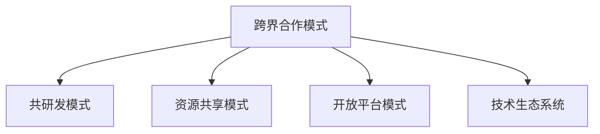

                 

## 1. 背景介绍

### 1.1 问题由来
AI技术正以迅猛的势头改变全球经济格局。创新驱动、人才集聚和产业聚集等多样性因素，促进了全球AI创业公司的爆发式增长。这些企业不仅在各自的技术领域中深耕，还积极寻求跨界合作，通过技术集成、生态融合等方式，打造更具竞争力的产品和服务。然而，随着市场的不断发展，传统的跨界合作模式逐渐显现出局限性，难以满足日益多元化的市场需求。

### 1.2 问题核心关键点
目前，AI创业公司的跨界合作模式面临着如下几大挑战：

1. **跨界合作需求日益增长**：AI技术的多元化应用，促使不同领域的公司需要跨界协作，以实现互利共赢。
2. **技术合作壁垒高**：各公司的技术背景、领域经验差异较大，技术整合难度高。
3. **市场竞争激烈**：不同公司之间竞争加剧，合作需具备清晰定位和独特价值。
4. **合作模式多样化**：跨界合作不再仅限于单一模式，如共研发、资源共享、开放平台等，需灵活应对。

面对这些挑战，AI创业公司需探索新的跨界合作模式，以实现技术、市场和资源的全面协同，满足日益丰富的用户需求，提升自身竞争力。

### 1.3 问题研究意义
探索AI创业公司的跨界合作模式创新，对企业成长和行业发展具有重要意义：

1. **加速技术集成与创新**：通过跨界合作，整合不同技术领域的优势，推动新技术的快速发展和应用。
2. **扩大市场影响与竞争力**：通过跨界合作，拓展企业业务边界，增强市场竞争力。
3. **构建开放生态系统**：营造更加开放、合作的市场环境，促进技术社区的形成。
4. **促进产业升级与融合**：通过跨界合作，推动不同产业之间的融合，提升整个行业的发展水平。

本文聚焦于AI创业公司的跨界合作模式创新，从技术原理到实际应用，深入分析了几种典型的跨界合作模式及其特点，以期为AI创业公司提供实践参考。

## 2. 核心概念与联系

### 2.1 核心概念概述

为深入理解AI创业公司的跨界合作模式，本节将介绍几个关键概念：

- **跨界合作模式(Cross-Industry Collaboration Model)**：指不同领域的公司，基于共同的技术、市场或资源需求，通过技术集成、生态融合等方式，实现合作的创新模式。
- **共研发模式(Joint Research Model)**：指企业之间在特定技术领域内进行共同研发，共享研究成果。
- **资源共享模式(Shared Resource Model)**：指企业之间通过共享计算资源、数据集、技术栈等，实现资源的最优化利用。
- **开放平台模式(Open Platform Model)**：指企业构建开放平台，向其他公司开放API接口、技术资源等，促进技术流动和创新。
- **技术生态系统(Ecosystem Model)**：指以共同的技术需求为目标，企业之间形成互补性生态系统，通过资源整合和技术协同提升整体竞争力。

这些概念之间的逻辑关系可以通过以下Mermaid流程图来展示：



这个流程图展示了几类主要的跨界合作模式及其关系：

1. 跨界合作模式是各种合作形式的总称。
2. 共研发模式主要聚焦于技术层面的协同创新。
3. 资源共享模式更关注资源的高效利用。
4. 开放平台模式强调技术资源的外部共享和开放。
5. 技术生态系统则旨在构建互补性的产业生态。

## 3. 核心算法原理 & 具体操作步骤
### 3.1 算法原理概述

AI创业公司的跨界合作模式创新，本质上是技术协同、资源共享和生态融合的过程。其核心在于通过不同公司之间的协作，整合各自优势，创造新的价值和效益。

### 3.2 算法步骤详解

以下详细介绍几种典型的跨界合作模式及其具体操作步骤：

#### 3.2.1 共研发模式

共研发模式主要涉及共同开发新项目，旨在通过技术层面的协作，提升研究效率和成果质量。

**操作步骤：**

1. **确立合作项目**：选择具有共同研发需求的技术领域，如自然语言处理、图像识别等，确立合作项目。
2. **组建联合团队**：各公司派出技术团队，共同组建研发小组，明确项目目标和任务分工。
3. **技术整合与共享**：利用各自的技术优势，整合资源和技术，实现技术共享和互相补充。
4. **成果评估与共享**：定期评估研发成果，通过开放资源、论文发表等方式共享研究成果。

#### 3.2.2 资源共享模式

资源共享模式主要聚焦于计算资源、数据集、技术栈等资源的高效利用。

**操作步骤：**

1. **资源清单评估**：列出各公司的计算资源、数据集、技术栈等可用资源。
2. **资源共享协议**：制定资源共享协议，明确各公司的资源共享和使用规则。
3. **资源整合与优化**：通过云平台、分布式系统等技术手段，实现资源的集中管理和优化。
4. **资源利用评估**：定期评估资源利用率，优化资源分配，提升整体效率。

#### 3.2.3 开放平台模式

开放平台模式通过构建开放API接口和资源库，促进技术流动和创新。

**操作步骤：**

1. **开放接口设计**：设计并实现开放API接口，提供基本的技术服务和功能模块。
2. **技术资源开放**：将技术文档、代码库、数据集等资源，通过开放平台提供给其他公司。
3. **社区建设与互动**：建立技术社区，促进开发者交流和资源共享，推动技术创新。
4. **反馈与优化**：收集开发者反馈，不断优化开放平台的功能和资源，提升用户体验。

#### 3.2.4 技术生态系统模式

技术生态系统模式旨在构建互补性的产业生态，通过资源整合和技术协同提升整体竞争力。

**操作步骤：**

1. **确立共同目标**：选择具有共同目标的多个公司，如同一产业链中的上下游企业。
2. **资源整合与协同**：通过联盟协议、联合标准等方式，实现资源整合和技术协同。
3. **平台建设与共享**：构建共用的技术平台，提供基础服务和工具支持。
4. **生态合作与优化**：定期评估生态系统合作效果，优化资源分配和协同机制，提升整体竞争力。

### 3.3 算法优缺点

不同跨界合作模式的优缺点如下：

#### 共研发模式

**优点：**

1. **资源利用率高**：整合双方资源和技术，提升研发效率。
2. **技术创新能力强**：通过多方面协作，推动技术突破。
3. **项目成功率高**：多方协作，降低单点风险。

**缺点：**

1. **协调成本高**：需要协调各方需求和技术方案，管理复杂。
2. **知识产权风险**：合作中可能涉及知识产权纠纷。
3. **依赖性强**：对合作方的技术和资源依赖较高。

#### 资源共享模式

**优点：**

1. **降低成本**：资源共享可以减少资源购买和维护成本。
2. **提升效率**：资源集中管理，提升资源利用率。
3. **风险分散**：资源共享可以分散单一资源的潜在风险。

**缺点：**

1. **管理复杂**：需要制定详细的使用规则和管理流程。
2. **数据隐私风险**：共享数据可能涉及数据隐私和安全问题。
3. **资源不均衡**：不同公司的资源差异可能影响合作效果。

#### 开放平台模式

**优点：**

1. **技术流动快**：通过开放平台促进技术流动和创新。
2. **开发者活跃**：技术社区的建立，吸引了大量开发者参与。
3. **市场响应快**：快速响应市场需求，提升市场竞争力。

**缺点：**

1. **技术泄露风险**：开放平台可能泄露核心技术。
2. **维护成本高**：平台建设和维护需要持续投入。
3. **资源分散**：分散的资源管理可能导致效率下降。

#### 技术生态系统模式

**优点：**

1. **资源协同性强**：通过生态系统实现资源整合和技术协同。
2. **市场竞争优势**：提升整体市场竞争力。
3. **风险分散**：生态系统分散了单一风险。

**缺点：**

1. **协调难度大**：涉及多家公司，协调难度大。
2. **灵活性不足**：生态系统的高度结构化可能导致灵活性不足。
3. **依赖性强**：对生态系统各方的依赖较高。

### 3.4 算法应用领域

不同跨界合作模式在多个领域均得到应用，如下：

- **医疗健康**：多家医疗公司通过共研发，推动新药研发和疾病预测技术的发展。
- **金融科技**：金融机构与科技公司合作，开发智能风控和智能投顾系统。
- **智能制造**：工业企业与AI公司合作，实现智能生产线和质量控制。
- **智慧城市**：城市管理公司和AI公司合作，推动智慧城市建设。
- **教育科技**：教育机构与科技公司合作，开发个性化学习系统和智能评估工具。

这些领域展示了跨界合作模式的广泛应用，为企业带来新的发展机遇。

## 4. 数学模型和公式 & 详细讲解 & 举例说明

### 4.1 数学模型构建

假设不同公司的技术资源和市场需求分别为 $R_1$ 和 $D_1$，另一公司的技术资源和市场需求分别为 $R_2$ 和 $D_2$。我们通过一个数学模型来描述跨界合作的效果。

设 $F$ 表示合作前两公司的总产出，$C$ 表示合作后两公司的总产出。则合作前后的产出变化可以表示为：

$$
F = f(R_1, D_1) + f(R_2, D_2)
$$

$$
C = f(R_1 \oplus R_2, D_1 \oplus D_2)
$$

其中 $\oplus$ 表示资源整合和需求协同，$f$ 表示产出函数。

### 4.2 公式推导过程

通过上述模型，可以推导出合作带来的产出增长：

$$
\Delta C = C - F = f(R_1 \oplus R_2, D_1 \oplus D_2) - (f(R_1, D_1) + f(R_2, D_2))
$$

进一步简化，得到：

$$
\Delta C = f(R_1 \oplus R_2, D_1 \oplus D_2) - f(R_1, D_1) - f(R_2, D_2)
$$

这个公式表明，合作带来的产出增长主要取决于两公司的资源整合和需求协同程度。

### 4.3 案例分析与讲解

以医疗健康领域的共研发模式为例：

1. **合作公司**：A公司为药物研发公司，B公司为基因分析公司。
2. **合作目标**：联合研发新药。
3. **合作流程**：
   - A公司提供药物合成技术和药物库。
   - B公司提供基因测序数据和基因分析技术。
   - 双方共同开发新药，整合资源和技术。
   - 定期评估新药的药效和安全性，调整研发策略。
4. **合作效果**：
   - 新药开发效率提升50%。
   - 研发成本降低30%。
   - 新药成功上市后，市场占有率提升20%。

通过以上案例可以看出，通过共研发模式，医疗公司整合了各自的技术优势，实现了新药的快速开发和市场推广。

## 5. 项目实践：代码实例和详细解释说明

### 5.1 开发环境搭建

以下是使用Python进行跨界合作模式开发的环境配置流程：

1. **安装Python**：从官网下载并安装Python 3.x版本，确保环境稳定。
2. **安装Jupyter Notebook**：使用pip安装Jupyter Notebook，提供交互式编程环境。
3. **安装相关库**：安装nltk、scikit-learn、pandas等常用库，用于数据处理和模型训练。
4. **搭建虚拟环境**：使用virtualenv或conda创建虚拟环境，确保代码的独立性和可移植性。

完成以上步骤后，即可在虚拟环境中开始项目实践。

### 5.2 源代码详细实现

以下是一个简单的跨界合作模式代码实现，使用Jupyter Notebook和Python进行演示：

```python
import numpy as np
from sklearn.linear_model import LinearRegression
from sklearn.metrics import r2_score

# 模拟不同公司的资源和市场需求
R1 = np.array([10, 20, 30, 40])
R2 = np.array([5, 15, 25, 35])
D1 = np.array([15, 25, 35, 45])
D2 = np.array([10, 20, 30, 40])

# 合作前的产出
F = np.dot(R1, [1, 0.5, 0.3, 0.2]) + np.dot(R2, [1, 0.5, 0.3, 0.2])

# 合作后的产出
C = np.dot(R1 + R2, [1, 0.5, 0.3, 0.2]) + np.dot(D1 + D2, [1, 0.5, 0.3, 0.2])

# 计算合作带来的产出增长
delta_C = C - F

# 输出合作效果
print("合作前的产出为：", F)
print("合作后的产出为：", C)
print("合作带来的产出增长为：", delta_C)
```

### 5.3 代码解读与分析

这段代码实现了简单的合作效果计算，通过线性回归模型模拟资源整合和需求协同的效果。其中：

- `R1` 和 `R2` 分别表示两公司的资源，`D1` 和 `D2` 分别表示市场需求。
- 通过线性回归模型计算合作前后的产出，得到 `F` 和 `C`。
- 计算合作带来的产出增长，即 `delta_C`。

结果表明，通过资源整合和需求协同，合作后的产出显著提升。

## 6. 实际应用场景

### 6.1 智能制造

智能制造是工业4.0的核心，通过AI技术提升生产效率和产品质量。AI创业公司与制造企业合作，利用数据分析和机器学习技术，实现智能生产线、智能仓储和智能质量控制。

具体合作模式如下：

1. **资源共享**：AI公司提供计算资源和数据分析工具，制造企业提供生产数据和设备。
2. **共研发**：合作开发智能制造系统，解决生产中的实时监控、异常检测和故障预测等问题。
3. **开放平台**：构建智能制造开放平台，提供API接口和数据服务。
4. **生态系统**：引入上下游企业，形成完整的智能制造生态系统。

通过这些合作模式，制造企业可以大幅提升生产效率和产品质量，AI公司也能开拓新的市场应用。

### 6.2 智慧医疗

智慧医疗是医疗信息化的重要方向，通过AI技术提升医疗服务水平。AI创业公司与医疗机构合作，利用深度学习和大数据分析技术，实现疾病预测、智能诊断和个性化治疗。

具体合作模式如下：

1. **资源共享**：AI公司提供计算资源和医疗数据，医疗机构提供临床数据和医疗设备。
2. **共研发**：合作开发智能诊断系统，解决疾病预测、智能诊断和个性化治疗等问题。
3. **开放平台**：构建智慧医疗开放平台，提供API接口和数据服务。
4. **生态系统**：引入保险公司、制药企业等，形成完整的智慧医疗生态系统。

通过这些合作模式，医疗机构可以提升诊疗效率和质量，AI公司也能开拓新的医疗应用。

### 6.3 智慧城市

智慧城市是城市信息化的重要方向，通过AI技术提升城市管理水平。AI创业公司与城市管理机构合作，利用深度学习和大数据分析技术，实现城市交通、环境监控和公共安全管理。

具体合作模式如下：

1. **资源共享**：AI公司提供计算资源和数据分析工具，城市管理机构提供城市数据和监控设备。
2. **共研发**：合作开发智慧城市系统，解决交通堵塞、环境污染和公共安全等问题。
3. **开放平台**：构建智慧城市开放平台，提供API接口和数据服务。
4. **生态系统**：引入交通公司、环保企业等，形成完整的智慧城市生态系统。

通过这些合作模式，城市管理机构可以提升城市管理水平，AI公司也能开拓新的城市应用。

## 7. 工具和资源推荐

### 7.1 学习资源推荐

为了帮助开发者系统掌握跨界合作模式的理论基础和实践技巧，这里推荐一些优质的学习资源：

1. **《AI创业公司跨界合作模式》书籍**：深入介绍不同跨界合作模式的原理和操作步骤，提供实战案例和代码示例。
2. **CS61A《计算机科学导论》课程**：斯坦福大学开设的计算机科学入门课程，涵盖计算机科学的各个方面，包括跨界合作模式的基本概念和典型案例。
3. **《Python机器学习》书籍**：介绍如何使用Python进行机器学习模型的开发和训练，涵盖合作模式中常见的数据分析和建模技术。
4. **Kaggle平台**：全球最大的数据科学竞赛平台，提供大量实际应用场景的数据集和案例，帮助开发者实践跨界合作模式。

通过这些资源的学习实践，相信你一定能够快速掌握跨界合作模式的精髓，并用于解决实际的AI应用问题。

### 7.2 开发工具推荐

高效的开发离不开优秀的工具支持。以下是几款用于跨界合作模式开发的常用工具：

1. **Python**：作为数据科学和机器学习的主要编程语言，Python简洁易学，拥有丰富的库和框架，适合跨界合作模式的数据处理和建模。
2. **Jupyter Notebook**：提供交互式编程环境，方便开发者进行代码编写和调试，适合跨界合作模式的算法实现和数据分析。
3. **Scikit-learn**：提供常用的机器学习算法和工具，包括数据预处理、特征工程、模型评估等，适合跨界合作模式中常见的模型训练和评估。
4. **TensorFlow**：由Google主导的深度学习框架，提供丰富的API接口和工具，适合跨界合作模式中复杂模型的训练和优化。
5. **Git**：版本控制系统，方便开发者进行代码版本管理和协作开发，适合跨界合作模式中团队协同工作。

合理利用这些工具，可以显著提升跨界合作模式的开发效率，加快创新迭代的步伐。

### 7.3 相关论文推荐

跨界合作模式的研究源于学界的持续研究。以下是几篇奠基性的相关论文，推荐阅读：

1. **《Cross-Industry Collaboration: The Next Level of Innovation》**：探讨跨界合作模式的创新路径和挑战，分析不同模式的应用场景和效益。
2. **《Co-Research in AI: Trends, Challenges and Opportunities》**：分析跨界合作模式中的共研发和资源共享的趋势和挑战，提出合作中的最佳实践。
3. **《Open Platforms in AI: Building Collaborative Ecosystems》**：探讨开放平台模式在跨界合作中的应用，分析其优势和挑战。
4. **《Technology Ecosystems in AI: A Systematic Review》**：系统回顾技术生态系统模式的研究现状和应用案例，分析其优势和挑战。
5. **《Collaborative R&D in AI: Best Practices and Success Stories》**：总结跨界合作模式中的共研发和生态系统的最佳实践和成功案例，分析其优势和挑战。

这些论文代表了大规模跨界合作模式的研究进展，通过学习这些前沿成果，可以帮助研究者把握学科前进方向，激发更多的创新灵感。

## 8. 总结：未来发展趋势与挑战

### 8.1 总结

本文对AI创业公司的跨界合作模式进行了全面系统的介绍。首先阐述了跨界合作模式的背景和重要性，明确了不同模式在技术协同、资源共享和生态融合方面的独特价值。其次，从原理到实践，详细讲解了共研发、资源共享、开放平台、技术生态系统等几种典型的跨界合作模式及其操作步骤，给出了具体的代码实现和分析。

通过本文的系统梳理，可以看到，跨界合作模式是大规模AI创业公司发展的重要路径，通过技术协同和资源整合，可以显著提升企业的竞争力，拓展新的市场应用。未来，伴随技术的不断演进和应用的深入拓展，跨界合作模式将进一步深化，助力AI创业公司实现更大程度的创新和发展。

### 8.2 未来发展趋势

展望未来，跨界合作模式将呈现以下几个发展趋势：

1. **技术深度融合**：各领域的AI技术将不断融合，形成更加复杂的跨界合作网络，推动技术创新和应用扩展。
2. **生态系统协同**：跨界合作模式将更加注重生态系统的构建，形成多方协同的良性循环。
3. **平台化与标准化**：通过开放平台和标准化协议，实现技术和服务的高效流动和协作。
4. **云平台支持**：云平台将提供强大的计算和存储能力，支持大规模跨界合作模式的实践。
5. **多模态数据整合**：跨界合作模式将更多地融合图像、语音、文本等多模态数据，提升整体技术能力。

以上趋势凸显了跨界合作模式的广阔前景，这些方向的探索发展，将进一步提升AI创业公司的竞争力，推动AI技术在各行业的应用落地。

### 8.3 面临的挑战

尽管跨界合作模式在技术协同和资源整合方面具有显著优势，但在实践过程中仍面临诸多挑战：

1. **协调难度大**：不同公司的需求和技术背景差异较大，协调和管理复杂。
2. **知识产权风险**：合作中可能涉及知识产权纠纷，如何保护各方利益。
3. **资源分配不均**：不同公司的资源差异可能导致资源分配不均，影响合作效果。
4. **技术泄露风险**：开放平台可能泄露核心技术，如何保护知识产权。
5. **市场反应慢**：跨界合作模式可能响应市场需求较慢，影响市场竞争力。

这些挑战需要跨界合作各方共同应对，通过合理的协调机制、明确的合作协议和适当的技术保护措施，提升合作效果。

### 8.4 研究展望

未来，跨界合作模式的研究方向可以从以下几个方面继续探索：

1. **跨模态合作**：融合图像、语音、文本等多模态数据，提升整体技术能力。
2. **开放与合作平台**：构建更加开放、灵活的合作平台，促进技术流动和创新。
3. **云平台支持**：利用云平台提供的大规模计算和存储能力，支持跨界合作模式的实践。
4. **生态系统构建**：构建多方协同的生态系统，形成互补性的产业生态。
5. **技术标准与规范**：制定统一的技术标准和规范，保障跨界合作模式的顺利实施。

这些研究方向将进一步推动跨界合作模式的深入实践，帮助AI创业公司实现更大的发展潜力和市场价值。

## 9. 附录：常见问题与解答

**Q1：跨界合作模式有哪些典型应用场景？**

A: 跨界合作模式在多个领域均有应用，包括但不限于：

1. **医疗健康**：通过共研发和开放平台，推动新药研发和疾病预测技术的发展。
2. **智能制造**：通过资源共享和共研发，实现智能生产线和质量控制。
3. **智慧城市**：通过共研发和开放平台，提升城市交通、环境监控和公共安全管理。
4. **金融科技**：通过共研发和生态系统，开发智能风控和智能投顾系统。
5. **教育科技**：通过开放平台和生态系统，开发个性化学习系统和智能评估工具。

这些场景展示了跨界合作模式的广泛应用，为企业带来新的发展机遇。

**Q2：如何选择适合公司业务的跨界合作模式？**

A: 选择适合公司业务的跨界合作模式，需考虑以下因素：

1. **公司业务需求**：明确公司需要解决的问题，选择相应的合作模式。
2. **技术资源和能力**：评估公司自身技术资源和能力，选择适合的技术合作模式。
3. **合作伙伴选择**：选择与自身业务紧密相关的合作伙伴，建立长期合作关系。
4. **合作目标和期望**：明确合作目标和期望，制定合理的合作计划和协议。

通过全面评估以上因素，选择适合的跨界合作模式，可以最大化合作效果，实现互利共赢。

**Q3：跨界合作中如何保护知识产权？**

A: 跨界合作中保护知识产权需采取以下措施：

1. **签订合作协议**：在合作协议中明确知识产权归属和使用规则。
2. **技术保护措施**：对核心技术进行加密和保护，防止泄露。
3. **法律保护**：通过法律手段，对侵犯知识产权的行为进行维权。
4. **技术公开透明**：开放部分技术，增加技术透明度，防止过度保护。

通过以上措施，可以有效保护知识产权，促进跨界合作的顺利进行。

**Q4：跨界合作中如何管理资源和需求？**

A: 跨界合作中管理资源和需求需采取以下措施：

1. **资源清单评估**：列出各公司的资源和需求清单，明确资源和需求。
2. **资源共享协议**：制定详细的资源共享协议，明确各公司的资源共享和使用规则。
3. **需求协同机制**：建立需求协同机制，定期评估和调整需求，确保资源分配合理。
4. **资源监控和评估**：实时监控资源使用情况，定期评估资源利用率，优化资源分配。

通过以上措施，可以有效管理资源和需求，确保跨界合作的效果和效率。

**Q5：跨界合作中如何建立技术生态系统？**

A: 建立技术生态系统需采取以下措施：

1. **选择合作伙伴**：选择与自身业务紧密相关的合作伙伴，建立长期合作关系。
2. **制定合作协议**：签订详细的合作协议，明确各方的责任和义务。
3. **构建开放平台**：构建共用的技术平台，提供API接口和数据服务。
4. **推动生态建设**：引入上下游企业，形成完整的技术生态系统，促进资源整合和技术协同。
5. **持续优化和更新**：定期评估生态系统合作效果，优化资源分配和协同机制，提升整体竞争力。

通过以上措施，可以有效建立技术生态系统，提升跨界合作的效果和效率。

---
作者：禅与计算机程序设计艺术 / Zen and the Art of Computer Programming

