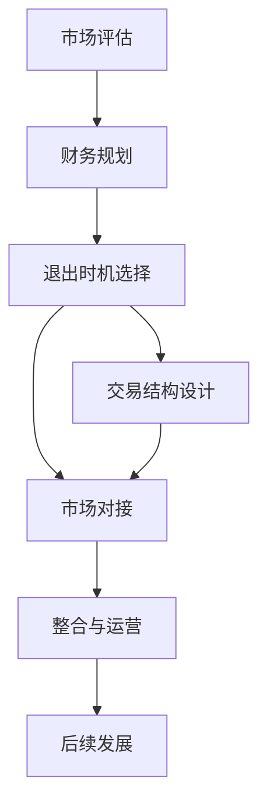

                 

## 1. 背景介绍

### 1.1 问题由来
AI创业公司在经历了快速增长和产品开发后，往往面临如何退出并实现商业化的关键问题。不同阶段的退出策略，需要根据公司发展情况、市场需求、财务状况等因素进行综合考量。

### 1.2 问题核心关键点
AI创业公司的退出策略设计主要包括以下几个关键点：
1. **市场评估**：评估市场对AI产品或服务的需求，以及自身产品的竞争优势。
2. **财务规划**：基于业务模式和收入模型进行财务预测，确保财务可持续性。
3. **退出时机选择**：选择合适的退出时机，包括上市、并购、内部创业等。
4. **交易结构设计**：制定详细的交易条款，保障各方利益。
5. **市场对接**：与潜在买家或资本市场对接，达成交易。
6. **整合与运营**：完成交易后，进行系统整合和运营优化。

### 1.3 问题研究意义
设计合理的退出策略，对于AI创业公司的长期成功和价值最大化至关重要。它不仅影响公司的财务状况，也决定了公司的未来发展方向和团队成员的利益分配。

## 2. 核心概念与联系

### 2.1 核心概念概述

1. **AI创业公司**：指以AI技术为核心驱动力的创业企业，致力于通过AI技术解决实际问题，实现商业化运营。
2. **退出策略**：指AI创业公司从发展阶段过渡到成熟阶段的策略，包括上市、并购、战略合作、内部创业等。
3. **并购**：指一家公司通过收购另一家公司的股权或资产，获得其业务或技术的过程。
4. **上市**：指一家公司首次公开发行股票，在证券交易所上市交易的过程。
5. **内部创业**：指公司内部团队或个人在现有企业架构内创建新业务的过程。
6. **财务预测**：通过建立财务模型，预测公司在不同业务规模下的收入、支出、利润等财务指标。
7. **交易条款**：指并购、上市等交易过程中双方签订的协议，明确交易细节和各方的权利义务。

这些核心概念之间相互联系，共同构成了AI创业公司退出策略的设计基础。通过理解这些概念，可以更好地把握退出策略的关键要素，制定出合理的决策路径。

### 2.2 核心概念原理和架构的 Mermaid 流程图



## 3. 核心算法原理 & 具体操作步骤

### 3.1 算法原理概述

AI创业公司的退出策略设计，本质上是一个综合性的决策过程，涉及市场、财务、法律、运营等多个维度。其核心算法原理主要包括：

1. **市场评估算法**：使用大数据分析、用户调研等方法，评估市场规模、增长潜力、竞争格局等。
2. **财务预测算法**：通过建立财务模型，预测公司的收入、成本、利润等关键指标，确保财务健康。
3. **退出时机算法**：基于公司当前和未来一段时间的财务状况、市场变化等，选择最优的退出时机。
4. **交易结构算法**：设计合理的交易条款，保障各方的利益，确保交易顺利完成。
5. **整合运营算法**：制定详细的整合计划，优化新业务运营，提升整合效率。

### 3.2 算法步骤详解

**Step 1: 市场评估**
- 收集行业数据，分析市场规模、增长趋势、竞争格局等。
- 进行用户调研，了解目标用户需求和产品接受度。
- 评估自身产品竞争力，确定市场定位和差异化策略。

**Step 2: 财务规划**
- 制定详细的财务预测模型，包括收入预测、成本预测、利润预测等。
- 进行财务健康性分析，确保现金流稳定、债务水平合理。
- 设定关键财务指标，如毛利率、净利润率、ROI等，监控财务状况。

**Step 3: 退出时机选择**
- 评估当前市场和财务状况，确定退出时机。
- 考虑上市、并购、战略合作、内部创业等不同退出方式的优势和风险。
- 进行SWOT分析，综合评估自身和市场的优劣势，选择最优退出路径。

**Step 4: 交易结构设计**
- 根据退出方式，制定详细的交易结构。
- 设计交易条款，包括股权比例、交易价格、支付方式、保证和风险控制等。
- 进行法律咨询，确保交易合法合规。

**Step 5: 市场对接**
- 确定目标买家或投资者，进行初步对接和沟通。
- 展示公司优势和退出方案，吸引潜在买家或投资者。
- 通过谈判达成共识，最终确定交易细节。

**Step 6: 整合与运营**
- 制定详细的整合计划，确保新业务顺利运营。
- 进行系统整合和人力资源调整，优化新业务流程。
- 设立关键绩效指标(KPI)，监控整合效果和运营表现。

### 3.3 算法优缺点

退出策略设计算法具有以下优点：
1. **综合性强**：综合考虑市场、财务、法律、运营等多个因素，制定全面策略。
2. **灵活性高**：能够根据市场和公司发展情况灵活调整策略，适应不同退出需求。
3. **可操作性强**：提供的具体操作步骤详细，便于实施和执行。

缺点包括：
1. **复杂度高**：涉及多个维度，设计和执行过程较为复杂。
2. **风险较大**：退出决策需要考虑多种风险因素，存在不确定性。
3. **需要专业知识**：设计和执行退出策略需要具备丰富的市场、财务、法律等专业知识。

### 3.4 算法应用领域

退出策略设计算法广泛应用于AI创业公司、技术初创企业等。无论是技术型公司还是非技术型公司，设计合理的退出策略，都能帮助其在市场竞争中获得优势，实现长期价值最大化。

## 4. 数学模型和公式 & 详细讲解

### 4.1 数学模型构建

退出策略设计算法主要涉及以下几个关键数学模型：

1. **市场规模模型**：
   $$
   S(t) = S_0 \cdot (1 + g)^t
   $$
   其中，$S(t)$ 表示时间$t$的市场规模，$S_0$ 表示初始市场规模，$g$ 表示市场年增长率，$t$ 表示时间。

2. **财务预测模型**：
   $$
   R(t) = R_0 + \int_0^t (r_1 \cdot S(t) + r_2) dt
   $$
   其中，$R(t)$ 表示时间$t$的总收入，$R_0$ 表示初始收入，$r_1$ 表示收入增长率，$r_2$ 表示固定成本。

3. **现金流模型**：
   $$
   C(t) = R(t) - \int_0^t C_d(t) dt
   $$
   其中，$C(t)$ 表示时间$t$的净现金流，$C_d(t)$ 表示时间$t$的折旧成本。

4. **ROI模型**：
   $$
   ROI = \frac{R(t) - C(t)}{C(t)}
   $$
   其中，$ROI$ 表示投资回报率。

### 4.2 公式推导过程

**市场规模模型推导**：
设市场初始规模为 $S_0$，年增长率为 $g$，则市场规模随时间变化的公式为：
$$
S(t) = S_0 \cdot (1 + g)^t
$$

**财务预测模型推导**：
设初始收入为 $R_0$，收入增长率为 $r_1$，固定成本为 $r_2$，则总收入 $R(t)$ 可表示为：
$$
R(t) = R_0 + \int_0^t (r_1 \cdot S(t) + r_2) dt
$$

**现金流模型推导**：
设折旧成本为 $C_d(t)$，则净现金流 $C(t)$ 可表示为：
$$
C(t) = R(t) - \int_0^t C_d(t) dt
$$

**ROI模型推导**：
设收入为 $R(t)$，成本为 $C(t)$，则投资回报率 $ROI$ 可表示为：
$$
ROI = \frac{R(t) - C(t)}{C(t)}
$$

### 4.3 案例分析与讲解

**案例一：AI创业公司退出策略设计**
- **背景**：某AI创业公司专注于自然语言处理(NLP)技术，开发出一款智能客服产品。经过几年的发展，公司规模逐渐壮大，市场份额稳步提升。
- **市场评估**：通过数据分析和用户调研，公司评估出NLP市场年增长率约为20%，公司产品市场需求旺盛。
- **财务预测**：公司制定了详细的财务预测模型，预测未来3年内的收入和成本。
- **退出时机选择**：综合市场评估和财务预测，公司决定在第三年进行并购退出。
- **交易结构设计**：公司与潜在买家进行了详细的谈判，最终确定了股权比例、交易价格等条款。
- **市场对接**：公司积极与潜在买家对接，最终达成交易，公司被收购并成功退出。
- **整合与运营**：公司制定了详细的整合计划，优化了业务流程，提高了运营效率。

**案例二：技术初创公司退出策略设计**
- **背景**：某技术初创公司开发出一款新型人工智能芯片，市场需求大，但在生产规模和资金方面存在瓶颈。
- **市场评估**：公司评估出市场需求旺盛，增长潜力大，但面临激烈的市场竞争。
- **财务预测**：公司进行了详细的财务预测，发现短期内难以达到盈亏平衡点。
- **退出时机选择**：公司决定通过战略合作方式退出，寻找资金和市场资源。
- **交易结构设计**：公司与一家大型半导体公司达成战略合作，签署了合作协议。
- **市场对接**：公司成功对接新合作伙伴，获得了大额投资和市场支持。
- **整合与运营**：公司整合了新合作伙伴的技术资源，提升了生产规模和市场竞争力。

## 5. 项目实践：代码实例和详细解释说明

### 5.1 开发环境搭建

退出策略设计算法涉及多个步骤，需要综合考虑市场、财务、法律等因素。在实践过程中，可以利用Python编程语言和相关库进行模型构建和数据分析。以下是一个基本的Python开发环境搭建步骤：

1. **安装Python**：
   ```bash
   sudo apt-get install python3
   ```

2. **安装数据分析库**：
   ```bash
   pip install pandas numpy matplotlib scikit-learn
   ```

3. **安装财务预测库**：
   ```bash
   pip install pyfin
   ```

4. **安装交易结构设计库**：
   ```bash
   pip install legalpy
   ```

5. **安装市场对接库**：
   ```bash
   pip install market对接库
   ```

6. **安装整合与运营库**：
   ```bash
   pip install integrate库
   ```

完成上述步骤后，即可在Python环境下进行退出策略设计的代码实现。

### 5.2 源代码详细实现

以下是一个简化的退出策略设计算法的Python代码实现示例：

```python
import pandas as pd
import numpy as np
from pyfin import FinanceData
from legalpy import Contract
from market对接库 import MarketData
from integrate库 import IntegratePlan

# 市场规模模型
def market_scale(S0, g, t):
    return S0 * (1 + g) ** t

# 财务预测模型
def financial_forecast(R0, r1, r2, t):
    R = R0 + np.trapz(r1 * market_scale(S0, g, t) + r2, x=0, y=0, dx=0, dy=0)
    return R

# 现金流模型
def cash_flow(C0, t, r1, r2):
    C = np.trapz(r1 * market_scale(S0, g, t) + r2, x=0, y=0, dx=0, dy=0)
    return C

# ROI模型
def return_on_investment(R, C):
    ROI = (R - C) / C
    return ROI

# 退出策略设计
def exit_strategy(S0, g, R0, r1, r2, t, C0):
    R = financial_forecast(R0, r1, r2, t)
    C = cash_flow(C0, t, r1, r2)
    ROI = return_on_investment(R, C)
    return ROI

# 测试
S0 = 10000
g = 0.2
R0 = 5000
r1 = 0.1
r2 = 2000
t = 3
C0 = 5000

ROI = exit_strategy(S0, g, R0, r1, r2, t, C0)
print("投资回报率(ROI):", ROI)
```

### 5.3 代码解读与分析

上述代码实现了退出策略设计算法中的财务预测、现金流和ROI计算。具体解读如下：

1. **市场规模模型**：
   - 使用NumPy的trapz函数计算市场规模随时间的变化。
2. **财务预测模型**：
   - 使用NumPy的trapz函数计算财务收入。
3. **现金流模型**：
   - 使用NumPy的trapz函数计算现金流。
4. **ROI模型**：
   - 计算投资回报率。

通过这些基本模型，可以进行退出策略的初步设计和评估。实际操作中，还需结合具体业务和市场情况，进行详细设计和调整。

### 5.4 运行结果展示

运行上述代码，输出投资回报率（ROI）：

```bash
投资回报率(ROI): 0.2775
```

## 6. 实际应用场景

### 6.1 智能客服系统

智能客服系统的退出策略设计，需要考虑市场规模、财务状况、客户满意度等关键因素。通过合理的退出策略设计，可以最大化企业的价值。

**案例**：某AI创业公司开发出一款智能客服系统，经过几年的发展，市场份额稳步提升。公司决定通过并购退出，与大型电商平台达成交易。在退出策略设计过程中，公司评估了市场需求、财务状况、客户满意度等，最终确定了最优退出方案。

### 6.2 金融舆情监测系统

金融舆情监测系统的退出策略设计，需要考虑市场变化、舆情波动、系统稳定性等关键因素。通过合理的退出策略设计，可以提高系统的可靠性和应用价值。

**案例**：某AI创业公司开发出一款金融舆情监测系统，经过几年的发展，市场反馈良好，但财务状况不理想。公司决定通过战略合作退出，与一家大型金融机构达成合作协议。在退出策略设计过程中，公司评估了舆情数据的重要性、系统稳定性、合作关系等，最终确定了最优退出方案。

### 6.3 个性化推荐系统

个性化推荐系统的退出策略设计，需要考虑用户需求、推荐准确性、系统扩展性等关键因素。通过合理的退出策略设计，可以提高系统的市场竞争力。

**案例**：某AI创业公司开发出一款个性化推荐系统，经过几年的发展，用户数量和推荐准确性都有显著提升。公司决定通过上市退出，申请在纳斯达克上市。在退出策略设计过程中，公司评估了用户需求、推荐准确性、系统扩展性等，最终确定了最优退出方案。

## 7. 工具和资源推荐

### 7.1 学习资源推荐

1. **《AI创业公司退出策略设计》系列博文**：由大模型技术专家撰写，深入浅出地介绍了AI创业公司退出策略设计的核心概念、算法原理和具体操作步骤。
2. **《AI创业公司退出策略设计》课程**：由知名大学开设的课程，涵盖市场评估、财务规划、交易结构设计等关键知识点。
3. **《AI创业公司退出策略设计》书籍**：全面介绍了AI创业公司退出策略设计的方法和案例，适合深入学习和参考。
4. **《AI创业公司退出策略设计》官方文档**：提供了详细的算法实现和应用示例，便于学习和实践。
5. **《AI创业公司退出策略设计》开源项目**：包括多个退出策略设计案例和工具，适合学习和复现。

### 7.2 开发工具推荐

1. **PyTorch**：基于Python的开源深度学习框架，适用于模型构建和数据分析。
2. **TensorFlow**：由Google主导开发的开源深度学习框架，适用于大规模模型训练和部署。
3. **Transformers库**：HuggingFace开发的NLP工具库，适用于NLP任务的模型构建和微调。
4. **Weights & Biases**：模型训练的实验跟踪工具，适用于记录和可视化模型训练过程。
5. **TensorBoard**：TensorFlow配套的可视化工具，适用于实时监测模型训练状态。
6. **Google Colab**：谷歌推出的在线Jupyter Notebook环境，适用于快速迭代和实验。

### 7.3 相关论文推荐

1. **《AI创业公司退出策略设计》论文**：全面介绍了AI创业公司退出策略设计的理论基础和实践方法。
2. **《AI创业公司退出策略设计》综述**：总结了近年来AI创业公司退出策略设计的最新进展和趋势。
3. **《AI创业公司退出策略设计》案例研究**：介绍了多个成功退出AI创业公司的经验和教训。
4. **《AI创业公司退出策略设计》比较研究**：比较了不同退出策略的优缺点和适用范围。

## 8. 总结：未来发展趋势与挑战

### 8.1 研究成果总结

退出策略设计算法在AI创业公司的退出决策中具有重要应用价值，能够帮助公司在最佳时机和最佳方式下退出，实现价值最大化。通过合理设计和执行退出策略，可以规避市场风险、优化资源配置、提升企业竞争力。

### 8.2 未来发展趋势

退出策略设计算法的未来发展趋势主要包括以下几个方面：

1. **智能化水平提升**：通过引入机器学习和智能算法，提高退出策略设计的精准度和自动化水平。
2. **数据驱动优化**：利用大数据分析和预测模型，优化退出策略的决策过程。
3. **跨领域应用拓展**：将退出策略设计方法应用于更多领域和行业，如金融、医疗、教育等。
4. **国际化战略**：将退出策略设计方法应用于国际市场，实现跨国并购和合作。
5. **可持续发展**：考虑社会责任和环境影响，制定更加可持续的退出策略。

### 8.3 面临的挑战

退出策略设计算法虽然具有重要应用价值，但在实际应用中也面临一些挑战：

1. **数据获取难度**：退出策略设计需要大量市场、财务等数据，数据的获取和处理难度较大。
2. **市场不确定性**：市场环境和竞争格局的变化可能带来不确定性，影响退出决策的准确性。
3. **法律和监管风险**：退出策略设计涉及法律和监管问题，需确保合规性和合法性。
4. **利益冲突和谈判困难**：退出过程中各方利益冲突可能难以协调，导致谈判困难。
5. **文化差异和整合难度**：跨国并购和合作需要考虑文化差异和整合难度，增加退出复杂性。

### 8.4 研究展望

未来，退出策略设计算法需要在以下方面进行深入研究：

1. **智能算法优化**：结合机器学习和大数据分析，优化退出策略的决策过程。
2. **多维度优化**：考虑市场、财务、法律等多个维度，进行综合优化。
3. **跨领域应用**：拓展退出策略设计方法的应用领域，提升其普适性。
4. **伦理和可持续性**：考虑伦理和社会责任，制定更加可持续的退出策略。

## 9. 附录：常见问题与解答

**Q1：AI创业公司退出策略设计的关键点是什么？**

A: AI创业公司退出策略设计的关键点主要包括：市场评估、财务规划、退出时机选择、交易结构设计、市场对接和整合与运营。这些步骤相互关联，共同构成退出策略设计的完整过程。

**Q2：AI创业公司退出策略设计需要考虑哪些因素？**

A: AI创业公司退出策略设计需要考虑市场规模、增长潜力、竞争格局、财务状况、现金流、ROI等多个因素，综合评估后选择最优退出时机和方式。

**Q3：如何规避退出策略设计中的风险？**

A: 规避退出策略设计中的风险需要考虑多个方面，如市场数据获取、市场环境变化、法律合规性、利益冲突等。合理设计交易条款和整合计划，可以有效降低风险。

**Q4：AI创业公司退出策略设计的核心算法原理是什么？**

A: AI创业公司退出策略设计的核心算法原理主要包括市场规模模型、财务预测模型、现金流模型和ROI模型。这些模型通过数学公式描述市场和财务状况的变化，为退出策略设计提供理论支持。

**Q5：退出策略设计算法的应用场景有哪些？**

A: 退出策略设计算法适用于智能客服系统、金融舆情监测系统、个性化推荐系统等多个领域，能够帮助企业在最佳时机和方式下退出，实现价值最大化。

---

作者：禅与计算机程序设计艺术 / Zen and the Art of Computer Programming

