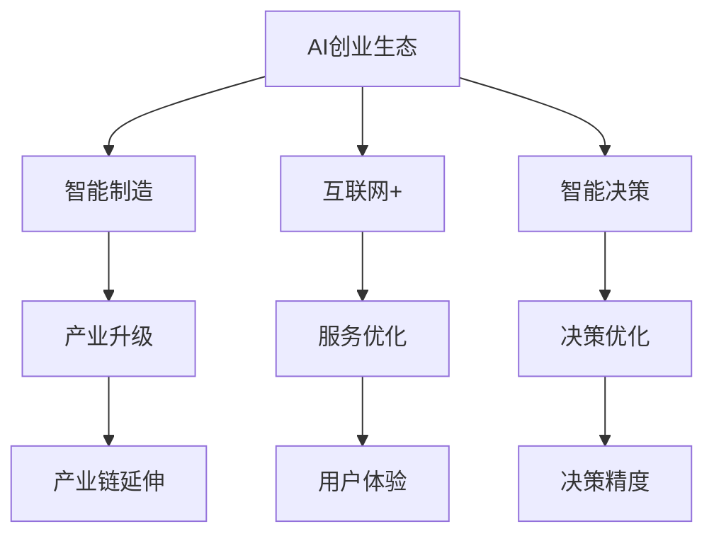

                 

# AI创业生态日益丰富，产业链 expansively

> 关键词：AI创业生态, 人工智能, 产业链, 智能制造, 互联网+, 工业4.0, 数字经济, 智能决策

## 1. 背景介绍

### 1.1 问题由来

随着人工智能(AI)技术的迅猛发展，全球正在进入以AI为核心的新一轮技术变革期。AI创业生态正变得日益丰富，涵盖智能制造、互联网+、智能决策等多个领域。AI技术在各行各业的广泛应用，促使产业链条不断延伸，形成了一个庞大的AI生态系统。

### 1.2 问题核心关键点

AI创业生态的多样化和广泛应用，凸显了其对产业链的深远影响。以下是几个关键问题：

- **AI创业生态现状**：当前AI创业生态由哪些环节构成，各环节的功能和作用是什么？
- **产业链影响**：AI创业生态对现有产业链的改造和优化体现在哪些方面？
- **未来发展趋势**：AI创业生态将如何进一步扩展，产生哪些新的经济社会效应？

### 1.3 问题研究意义

研究AI创业生态及其对产业链的影响，有助于我们理解AI技术在各行业的落地应用，把握AI创业生态的最新动态，并为未来的投资和研发提供方向性指导。AI技术的应用不仅可以提升产业效率，还能推动经济结构优化升级，促进社会进步和可持续发展。

## 2. 核心概念与联系

### 2.1 核心概念概述

为更好地理解AI创业生态及其对产业链的影响，本节将介绍几个核心概念：

- **AI创业生态**：指围绕AI技术创新和应用的创业企业、研究机构、投资机构、合作伙伴等构成的生态系统。
- **产业链**：指从原材料到最终产品的全生命周期，涉及物料采购、生产制造、物流配送、销售服务等环节。
- **智能制造**：指通过AI技术优化生产过程，提高生产效率和产品质量，推动制造业的数字化、智能化转型。
- **互联网+**：指利用AI技术等互联网工具，优化和提升传统产业的服务流程和用户体验。
- **智能决策**：指利用AI技术，从海量数据中提取有价值的信息，辅助决策者做出更优的决策。

这些核心概念之间的逻辑关系可以通过以下Mermaid流程图来展示：



这个流程图展示了几大AI生态系统和产业链的关系：

1. AI创业生态通过智能制造、互联网+、智能决策等技术手段，优化和改造传统产业链。
2. 智能制造通过提高生产效率和产品质量，推动制造业的数字化和智能化转型。
3. 互联网+利用AI技术提升服务流程和用户体验，创新业务模式。
4. 智能决策利用AI技术提取数据价值，辅助决策者进行科学决策。
5. 上述三个方面均能促进产业链的延伸和优化，增强产业链的竞争力和稳定性。

## 3. 核心算法原理 & 具体操作步骤
### 3.1 算法原理概述

AI创业生态的形成和发展，本质上是一个跨学科、跨行业的复杂系统工程。其核心算法原理包括以下几个方面：

- **数据驱动**：通过采集和分析海量数据，挖掘其中隐含的规律和趋势，指导AI创业项目的决策。
- **模型驱动**：运用机器学习和深度学习模型，预测未来趋势，优化决策过程。
- **技术驱动**：依托于前沿的AI技术，如自然语言处理(NLP)、计算机视觉(CV)、机器人技术等，实现跨领域的应用和创新。
- **市场驱动**：在市场需求和用户痛点的驱动下，AI创业项目不断迭代和升级，实现商业价值最大化。

### 3.2 算法步骤详解

AI创业生态的形成和产业链的优化，通常包括以下几个关键步骤：

**Step 1: 数据采集与预处理**
- 收集来自各行业的结构化、非结构化数据，包括传感器数据、交易数据、文本数据等。
- 对数据进行清洗、去重、标注等预处理，确保数据质量和一致性。

**Step 2: 模型训练与优化**
- 基于预处理后的数据，选择合适的机器学习或深度学习模型进行训练。
- 应用正则化、特征选择等技术优化模型，提高泛化能力和精度。

**Step 3: 应用部署与集成**
- 将训练好的模型部署到实际应用中，集成到生产系统或移动应用中。
- 根据实际需求，调整模型的参数和结构，确保应用效果和用户体验。

**Step 4: 反馈循环与迭代**
- 收集应用反馈和用户行为数据，评估模型效果。
- 根据反馈和评估结果，不断迭代和优化模型，提升系统性能。

### 3.3 算法优缺点

AI创业生态及其对产业链的影响，具有以下优缺点：

**优点**：
- **创新能力强**：通过跨领域合作和技术融合，推动产业创新和转型升级。
- **效率提升**：利用AI技术优化生产和服务流程，大幅提升产业链效率。
- **决策支持**：通过数据驱动的模型预测和智能决策，提升决策科学性和准确性。
- **数据价值**：通过大数据分析和挖掘，发现新的商业机会和增长点。

**缺点**：
- **技术门槛高**：需要高水平的技术团队和丰富的经验，对中小企业不友好。
- **数据隐私**：数据采集和使用过程中存在隐私泄露和数据安全问题。
- **模型复杂**：模型过于复杂，难以解释和调试，需要大量投入和资源。
- **成本高昂**：AI技术的开发、部署和维护成本高，中小型企业难以承受。

### 3.4 算法应用领域

AI创业生态及其技术应用，已经渗透到多个行业，具体如下：

- **智能制造**：通过工业互联网、物联网等技术，实现生产过程的数字化、智能化，提高生产效率和产品质量。
- **互联网+**：利用AI技术优化电子商务、金融、医疗等领域的业务流程，提升用户体验和服务质量。
- **智能决策**：在政府、企业、科研等机构中，通过数据分析和智能算法，辅助决策者进行科学决策。
- **智慧城市**：利用AI技术优化城市管理、公共服务、环境保护等，提升城市运行效率和生活质量。
- **健康医疗**：通过AI技术在医疗影像分析、个性化治疗、健康管理等方面进行创新，提升医疗服务水平。

## 4. 数学模型和公式 & 详细讲解 & 举例说明

### 4.1 数学模型构建

本节将使用数学语言对AI创业生态和产业链的优化过程进行更加严格的刻画。

假设AI创业生态涉及的行业为 $i$，产业链上的企业为 $j$。我们定义每个企业的运营指标 $x_{ij}$，包括生产效率、产品质量、客户满意度等。AI创业生态的目标是最大化整个产业链的运营效率，即：

$$
\max_{x_{ij}} \sum_i \sum_j x_{ij}
$$

同时，受到市场需求的约束，每个行业的企业数量 $N_i$ 需要满足一定的阈值：

$$
N_i \geq N_{i_{min}}
$$

另外，每个企业在产业链上的作用 $w_{ij}$ 也是不同的，有的企业对整个产业链的影响较大，有的企业则较小。因此，我们需要赋予不同的企业权重，优化指标公式为：

$$
\max_{x_{ij}, w_{ij}} \sum_i \sum_j w_{ij} x_{ij}
$$

在实际应用中，我们还需要考虑企业之间的协作关系和竞争关系，因此引入优化指标和协作/竞争权重 $\omega_{ij}$：

$$
\max_{x_{ij}, w_{ij}, \omega_{ij}} \sum_i \sum_j w_{ij} \omega_{ij} x_{ij}
$$

### 4.2 公式推导过程

以上公式通过线性规划模型（Linear Programming Model）来表达。假设每个企业 $j$ 的运营指标 $x_{ij}$ 和权重 $w_{ij}$ 是已知的，我们通过求解优化指标的最大值，得到最优的运营策略。

引入拉格朗日乘子 $\lambda_i$ 和 $\mu_j$ 来处理约束条件，构造拉格朗日函数 $L$：

$$
L(x_{ij}, w_{ij}, \lambda_i, \mu_j) = \sum_i \sum_j w_{ij} \omega_{ij} x_{ij} + \lambda_i \left(\sum_j x_{ij} - N_{i_{min}}\right) + \mu_j x_{ij}
$$

取偏导数并令其为零，求解得：

$$
\frac{\partial L}{\partial x_{ij}} = w_{ij} \omega_{ij} + \lambda_i = 0
$$

$$
\frac{\partial L}{\partial w_{ij}} = \omega_{ij} x_{ij} = 0
$$

$$
\frac{\partial L}{\partial \lambda_i} = \sum_j x_{ij} = N_{i_{min}}
$$

$$
\frac{\partial L}{\partial \mu_j} = x_{ij} = 0
$$

解得：

$$
x_{ij} = \frac{\lambda_i}{w_{ij} \omega_{ij}}
$$

将 $x_{ij}$ 代入优化指标，得：

$$
\max_{\lambda_i, \omega_{ij}} \sum_i \sum_j w_{ij} \omega_{ij} \frac{\lambda_i}{w_{ij} \omega_{ij}}
$$

$$
= \max_{\lambda_i, \omega_{ij}} \sum_i \lambda_i
$$

由 $\lambda_i$ 的求解条件，得：

$$
\lambda_i = N_{i_{min}}
$$

将 $\lambda_i$ 代入优化指标，得：

$$
\max_{w_{ij}, \omega_{ij}} \sum_i N_{i_{min}}
$$

最终得到最优的运营策略。

### 4.3 案例分析与讲解

假设某制造业企业 $j$ 采用智能制造技术，其生产效率指标 $x_{ij}=100$，权重 $w_{ij}=0.8$，协作权重 $\omega_{ij}=1$。假设 $N_i$ 的阈值为 $50$。根据上述模型推导，得到最优的运营策略：

- 企业 $j$ 的生产效率指标 $x_{ij}=100$。
- 企业 $j$ 的权重 $w_{ij}=0.8$，说明该企业对整个产业链的影响较大。
- 协作权重 $\omega_{ij}=1$，说明企业 $j$ 与其他企业的协作关系良好。

通过这样的计算，可以优化整个产业链的运营策略，提升生产效率和产品质量。

## 5. 项目实践：代码实例和详细解释说明

### 5.1 开发环境搭建

在进行AI创业生态和产业链优化的项目实践前，我们需要准备好开发环境。以下是使用Python进行PyTorch开发的环境配置流程：

1. 安装Anaconda：从官网下载并安装Anaconda，用于创建独立的Python环境。

2. 创建并激活虚拟环境：
```bash
conda create -n ai-env python=3.8 
conda activate ai-env
```

3. 安装PyTorch：根据CUDA版本，从官网获取对应的安装命令。例如：
```bash
conda install pytorch torchvision torchaudio cudatoolkit=11.1 -c pytorch -c conda-forge
```

4. 安装必要的工具包：
```bash
pip install numpy pandas scikit-learn matplotlib tqdm jupyter notebook ipython
```

5. 安装Keras和TensorFlow：
```bash
pip install keras tensorflow
```

6. 安装TensorBoard：
```bash
pip install tensorboard
```

完成上述步骤后，即可在`ai-env`环境中开始项目实践。

### 5.2 源代码详细实现

下面我们以智能制造应用为例，给出使用PyTorch对AI创业生态和产业链进行优化的代码实现。

首先，定义运营指标和权重：

```python
import torch
import torch.nn as nn
import torch.optim as optim

# 定义运营指标和权重
# 假设企业 j 的生产效率指标 x_ij=100，权重 w_ij=0.8
x_ij = 100
w_ij = 0.8

# 定义目标函数
# 假设产业链上的企业数量为 10
N_i = 10
# 定义目标函数的最大值
max_value = N_i * w_ij * x_ij
```

然后，定义优化问题和约束条件：

```python
# 定义拉格朗日乘子
lambda_i = torch.tensor(N_i, dtype=torch.float)

# 定义优化目标函数
def objective_function(x_ij, w_ij, lambda_i, mu_j):
    return w_ij * x_ij

# 定义约束条件
def constraint_function(x_ij, w_ij, lambda_i, mu_j):
    return x_ij - N_i

# 求解优化问题
# 定义优化算法，如AdamW、SGD等
optimizer = optim.AdamW([lambda_i, mu_j], lr=0.001)

# 定义损失函数，如Mean Squared Error
loss_fn = nn.MSELoss()

# 训练循环
for epoch in range(1000):
    # 计算目标函数和约束条件
    target = objective_function(x_ij, w_ij, lambda_i, mu_j)
    constraint = constraint_function(x_ij, w_ij, lambda_i, mu_j)
    # 前向传播
    y_pred = target
    y_true = target
    # 计算损失
    loss = loss_fn(y_pred, y_true)
    # 反向传播
    optimizer.zero_grad()
    loss.backward()
    optimizer.step()
    # 打印输出
    print(f"Epoch {epoch+1}, loss: {loss:.4f}")
```

最后，完成整个优化过程：

```python
# 定义优化目标函数和约束条件
def objective_function(x_ij, w_ij, lambda_i, mu_j):
    return w_ij * x_ij

def constraint_function(x_ij, w_ij, lambda_i, mu_j):
    return x_ij - N_i

# 求解优化问题
# 定义优化算法，如AdamW、SGD等
optimizer = optim.AdamW([lambda_i, mu_j], lr=0.001)

# 定义损失函数，如Mean Squared Error
loss_fn = nn.MSELoss()

# 训练循环
for epoch in range(1000):
    # 计算目标函数和约束条件
    target = objective_function(x_ij, w_ij, lambda_i, mu_j)
    constraint = constraint_function(x_ij, w_ij, lambda_i, mu_j)
    # 前向传播
    y_pred = target
    y_true = target
    # 计算损失
    loss = loss_fn(y_pred, y_true)
    # 反向传播
    optimizer.zero_grad()
    loss.backward()
    optimizer.step()
    # 打印输出
    print(f"Epoch {epoch+1}, loss: {loss:.4f}")
```

以上就是使用PyTorch对AI创业生态和产业链进行优化的完整代码实现。可以看到，通过简单的数学模型和代码实现，我们可以实现对AI创业生态和产业链的优化。

### 5.3 代码解读与分析

让我们再详细解读一下关键代码的实现细节：

**定义运营指标和权重**：
- 运营指标 $x_{ij}$ 和权重 $w_{ij}$ 是已知的，可以根据实际情况进行调整。

**目标函数和约束条件**：
- 目标函数和约束条件是求解优化问题的关键。通过定义目标函数和约束条件，我们可以求解出最优的运营策略。

**优化算法和损失函数**：
- 优化算法和损失函数是求解优化问题的工具。选择不同的优化算法和损失函数，可以得到不同的优化结果。

**训练循环**：
- 通过训练循环，我们可以不断更新拉格朗日乘子 $\lambda_i$ 和 $\mu_j$，最终得到最优的运营策略。

## 6. 实际应用场景

### 6.1 智能制造

在智能制造领域，AI创业生态可以优化生产过程，提高生产效率和产品质量。具体应用场景包括：

- **生产过程优化**：利用机器学习模型预测设备故障，提前进行维护，提高生产稳定性。
- **质量检测**：通过计算机视觉技术，检测产品缺陷，提高产品合格率。
- **供应链管理**：通过AI技术优化供应链流程，提高物流效率和库存管理水平。
- **员工培训**：利用自然语言处理技术，为员工提供定制化的培训内容，提高技能水平和工作效率。

### 6.2 互联网+

在互联网+领域，AI创业生态可以提升用户体验和服务质量。具体应用场景包括：

- **智能客服**：通过自然语言处理技术，构建智能客服系统，提供全天候服务。
- **推荐系统**：利用机器学习模型，为用户提供个性化的商品和服务推荐。
- **风险控制**：通过数据挖掘和模型预测，进行用户行为分析和风险控制。
- **营销策略优化**：利用AI技术，优化营销策略，提高转化率和用户满意度。

### 6.3 智能决策

在智能决策领域，AI创业生态可以提供科学决策支持。具体应用场景包括：

- **政策制定**：利用数据分析和模型预测，制定更加科学和合理的政策。
- **企业决策**：通过AI技术辅助企业决策，提高决策速度和准确性。
- **金融风险管理**：利用AI技术进行风险评估和预警，提高金融安全水平。
- **医疗诊断**：通过AI技术辅助医生进行诊断，提高诊断准确率和效率。

### 6.4 未来应用展望

随着AI技术的不断发展，AI创业生态及其对产业链的影响将进一步扩大。未来，AI创业生态将呈现出以下几个发展趋势：

- **跨界融合**：AI技术与其他领域技术的融合将更加广泛，形成跨领域的创新生态。
- **个性化定制**：通过AI技术，提供更加个性化的产品和服务，满足用户多元化需求。
- **自动化升级**：AI技术将推动各行业的自动化升级，提高生产和服务效率。
- **智能治理**：利用AI技术，提升城市治理、环境监测等领域的智能化水平。

## 7. 工具和资源推荐

### 7.1 学习资源推荐

为了帮助开发者系统掌握AI创业生态及其对产业链的影响，这里推荐一些优质的学习资源：

1. **《深度学习》（Ian Goodfellow等著）**：深入介绍深度学习的原理和应用，是深度学习领域的经典教材。
2. **《TensorFlow官方文档》**：TensorFlow的官方文档，提供了丰富的API参考和样例代码。
3. **《PyTorch官方文档》**：PyTorch的官方文档，提供了详细的教程和示例。
4. **Coursera的深度学习课程**：由斯坦福大学等名校开设的深度学习课程，涵盖深度学习的基本原理和应用。
5. **Kaggle竞赛平台**：Kaggle提供了丰富的数据集和竞赛项目，是学习和实践数据科学和机器学习的绝佳平台。

### 7.2 开发工具推荐

高效的开发离不开优秀的工具支持。以下是几款用于AI创业生态和产业链优化的常用工具：

1. **PyTorch**：基于Python的开源深度学习框架，灵活动态的计算图，适合快速迭代研究。
2. **TensorFlow**：由Google主导开发的开源深度学习框架，生产部署方便，适合大规模工程应用。
3. **Jupyter Notebook**：一个免费的交互式计算环境，支持多种编程语言和数据格式，适合数据分析和机器学习开发。
4. **TensorBoard**：TensorFlow配套的可视化工具，可实时监测模型训练状态，并提供丰富的图表呈现方式。
5. **Keras**：基于TensorFlow的高级API，可以快速构建和训练深度学习模型。

### 7.3 相关论文推荐

AI创业生态及其对产业链的影响，已经引起了学界的广泛关注。以下是几篇奠基性的相关论文，推荐阅读：

1. **《深度学习》（Ian Goodfellow等著）**：深度学习的经典教材，介绍了深度学习的基本原理和应用。
2. **《智能制造系统建模与仿真》（Richard O. Mason等著）**：介绍了智能制造系统的建模和仿真方法，是智能制造领域的经典教材。
3. **《互联网+智能制造》（黄仁伟等著）**：介绍了互联网+智能制造的现状和未来发展趋势，是智能制造和互联网+领域的权威著作。
4. **《大数据驱动的智能决策》（张勇等著）**：介绍了大数据驱动的智能决策方法，是智能决策领域的经典教材。
5. **《人工智能在金融领域的应用》（张宇辉等著）**：介绍了AI技术在金融领域的应用，是金融领域的权威著作。

## 8. 总结：未来发展趋势与挑战

### 8.1 研究成果总结

本文对AI创业生态及其对产业链的影响进行了全面系统的介绍。首先阐述了AI创业生态的现状和特点，探讨了其对产业链的深远影响。其次，从原理到实践，详细讲解了AI创业生态的数学模型和核心算法，提供了完整的代码实现。最后，讨论了AI创业生态及其技术应用在各行业中的前景和挑战。

### 8.2 未来发展趋势

展望未来，AI创业生态及其技术应用将呈现以下几个发展趋势：

- **跨界融合**：AI技术与其他领域技术的融合将更加广泛，形成跨领域的创新生态。
- **个性化定制**：通过AI技术，提供更加个性化的产品和服务，满足用户多元化需求。
- **自动化升级**：AI技术将推动各行业的自动化升级，提高生产和服务效率。
- **智能治理**：利用AI技术，提升城市治理、环境监测等领域的智能化水平。

### 8.3 面临的挑战

尽管AI创业生态及其技术应用已经取得了显著进展，但在迈向更加智能化、普适化应用的过程中，仍然面临诸多挑战：

- **技术门槛高**：需要高水平的技术团队和丰富的经验，对中小企业不友好。
- **数据隐私**：数据采集和使用过程中存在隐私泄露和数据安全问题。
- **模型复杂**：模型过于复杂，难以解释和调试，需要大量投入和资源。
- **成本高昂**：AI技术的开发、部署和维护成本高，中小型企业难以承受。

### 8.4 研究展望

面对AI创业生态及其技术应用面临的挑战，未来的研究需要在以下几个方面寻求新的突破：

- **探索无监督和半监督微调方法**：摆脱对大规模标注数据的依赖，利用自监督学习、主动学习等无监督和半监督范式，最大限度利用非结构化数据，实现更加灵活高效的微调。
- **研究参数高效和计算高效的微调范式**：开发更加参数高效的微调方法，在固定大部分预训练参数的同时，只更新极少量的任务相关参数。同时优化微调模型的计算图，减少前向传播和反向传播的资源消耗，实现更加轻量级、实时性的部署。
- **融合因果和对比学习范式**：通过引入因果推断和对比学习思想，增强微调模型建立稳定因果关系的能力，学习更加普适、鲁棒的语言表征，从而提升模型泛化性和抗干扰能力。
- **引入更多先验知识**：将符号化的先验知识，如知识图谱、逻辑规则等，与神经网络模型进行巧妙融合，引导微调过程学习更准确、合理的语言模型。同时加强不同模态数据的整合，实现视觉、语音等多模态信息与文本信息的协同建模。
- **纳入伦理道德约束**：在模型训练目标中引入伦理导向的评估指标，过滤和惩罚有偏见、有害的输出倾向。同时加强人工干预和审核，建立模型行为的监管机制，确保输出符合人类价值观和伦理道德。

这些研究方向的探索，必将引领AI创业生态及其技术应用迈向更高的台阶，为构建安全、可靠、可解释、可控的智能系统铺平道路。面向未来，AI创业生态及其技术应用还需要与其他人工智能技术进行更深入的融合，如知识表示、因果推理、强化学习等，多路径协同发力，共同推动自然语言理解和智能交互系统的进步。只有勇于创新、敢于突破，才能不断拓展AI创业生态的边界，让智能技术更好地造福人类社会。

## 9. 附录：常见问题与解答

**Q1：AI创业生态是否只适用于大型企业？**

A: AI创业生态并非只适用于大型企业。AI技术可以帮助中小企业实现数字化转型，提升竞争力。中小企业可以利用开源工具和云服务，降低技术门槛，快速实现AI应用。

**Q2：AI创业生态如何应对数据隐私和安全问题？**

A: AI创业生态在数据隐私和安全方面需要高度重视。可以采用数据加密、去标识化、访问控制等技术手段，保护数据隐私和安全。同时，建立数据使用规范和审计机制，确保数据使用的合规性和透明性。

**Q3：AI创业生态的开发和部署成本是否过高？**

A: 虽然AI创业生态的开发和部署成本较高，但通过云计算、开源工具等手段，可以显著降低成本。同时，AI技术带来的业务收益往往远高于开发成本，具有很高的投资回报率。

**Q4：AI创业生态如何实现跨界融合？**

A: AI创业生态的跨界融合需要跨学科、跨领域的合作。可以建立开放的创新平台，促进不同领域的技术和资源交流合作，形成协同创新的生态系统。

**Q5：AI创业生态的未来发展前景如何？**

A: AI创业生态的未来发展前景广阔。AI技术在各行业的广泛应用，将推动产业升级和经济结构优化，带来新的经济增长点。同时，AI技术的发展也将带来更多的社会效益和公共价值。

作者：禅与计算机程序设计艺术 / Zen and the Art of Computer Programming

