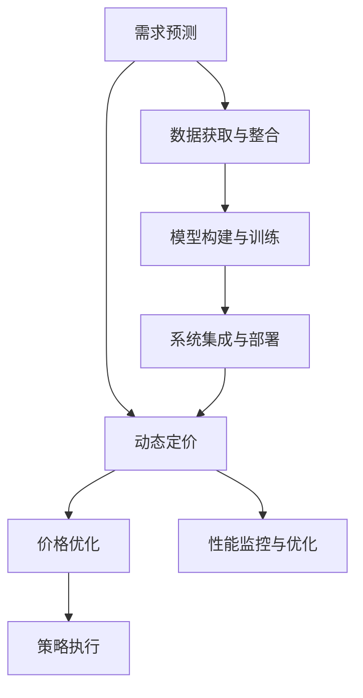

                 

# AI动态定价策略的实现

> 关键词：动态定价, 人工智能, 机器学习, 需求预测, 价格优化, 策略执行

## 1. 背景介绍

### 1.1 问题由来

在激烈的市场竞争中，企业需要不断调整产品或服务的定价策略，以应对动态市场需求变化，确保最大化利润。传统定价方法如成本加成定价、市场份额定价等，已经难以应对复杂多变的市场环境。基于大数据和人工智能技术的动态定价策略，能够实时调整价格，灵活应对市场变化，优化资源配置，提高企业的市场竞争力。

近年来，人工智能在价格优化、需求预测、实时定价等方面展现出了巨大潜力。通过深度学习等先进算法，动态定价模型可以高效分析海量历史数据，预测市场需求，实时动态调整价格，以适应市场波动。

### 1.2 问题核心关键点

大企业通常面临的定价问题包括：

1. **价格弹性分析**：评估不同产品或服务的市场需求对价格的敏感度，以确定价格调整方向。
2. **需求预测**：利用历史销售数据和市场趋势，预测未来的市场需求。
3. **价格优化**：根据需求预测结果，实时调整产品或服务的价格，以最大化利润。
4. **策略执行**：确保定价策略能够快速准确地部署到各个销售渠道和平台。

大企业在实施动态定价策略时，通常需要解决以下几个挑战：

1. **数据获取和整合**：收集和整合来自不同渠道的销售数据、市场趋势、竞争对手信息等。
2. **模型构建和训练**：开发和训练动态定价模型，如基于深度学习的预测模型和优化模型。
3. **系统集成与部署**：将定价策略集成到现有业务系统中，确保实时响应市场变化。
4. **性能监控与优化**：监测定价策略的实际效果，根据实际效果不断优化模型和策略。

## 2. 核心概念与联系

### 2.1 核心概念概述

为了深入理解动态定价策略的实现，本节将介绍几个密切相关的核心概念：

- **动态定价**：根据市场环境实时调整产品或服务的价格，以实现利润最大化。
- **深度学习**：一种基于人工神经网络的机器学习方法，可以处理复杂的非线性关系和海量数据。
- **需求预测**：使用机器学习模型预测未来的市场需求，作为动态定价的依据。
- **价格优化**：在给定约束条件下，通过数学优化方法确定最佳价格。
- **策略执行**：将定价策略快速准确地部署到销售渠道和平台，确保实时性。

这些概念之间的逻辑关系可以通过以下Mermaid流程图来展示：



这个流程图展示了动态定价策略从数据整合到策略执行的完整流程，每个环节都至关重要。

## 3. 核心算法原理 & 具体操作步骤

### 3.1 算法原理概述

动态定价策略的核心在于结合需求预测和价格优化，实时调整产品或服务的价格。其中，需求预测和价格优化是两个主要环节。

需求预测通过机器学习模型，从历史销售数据和市场趋势中学习，预测未来的市场需求。常见的需求预测模型包括ARIMA、SARIMA、Prophet等时间序列模型，以及深度学习模型如LSTM、GRU、Transformer等。

价格优化通过数学优化算法，在给定约束条件下（如库存、成本等），找到最优价格。常见的优化算法包括线性规划、整数规划、二次规划等，以及启发式算法如遗传算法、粒子群算法等。

### 3.2 算法步骤详解

动态定价策略的实现通常包括以下几个关键步骤：

**Step 1: 数据获取与整合**

- 收集历史销售数据、市场趋势、竞争对手信息等，整合到一个统一的数据仓库中。
- 对数据进行清洗和预处理，包括去除噪声、处理缺失值、特征工程等。

**Step 2: 模型构建与训练**

- 选择合适的时间序列模型或深度学习模型，构建需求预测模型。
- 使用历史数据训练模型，调整超参数，确保模型具有较高的预测精度。

**Step 3: 价格优化**

- 定义价格优化目标，如最大化利润、最小化库存成本等。
- 设定优化约束，如库存水平、成本限制、市场份额等。
- 使用数学优化算法，求解最优价格。

**Step 4: 策略执行**

- 将优化后的价格部署到各个销售渠道和平台。
- 实时监控市场变化，根据最新数据调整定价策略。

**Step 5: 性能监控与优化**

- 监测定价策略的实际效果，包括销售额、利润率、库存水平等。
- 根据实际效果反馈，不断优化模型和策略，提升效果。

### 3.3 算法优缺点

动态定价策略基于人工智能和机器学习技术，具有以下优点：

1. **实时响应**：能够实时动态调整价格，快速适应市场变化。
2. **数据驱动**：通过分析历史数据，预测未来需求，提高定价的科学性和准确性。
3. **自动化**：自动化处理大量数据，减少人工干预，提高效率。

但同时，动态定价策略也存在一些局限性：

1. **数据依赖性**：模型依赖于高质量的历史数据，数据偏差或缺失可能导致预测误差。
2. **复杂性**：模型构建和训练复杂，需要大量的数据和计算资源。
3. **实施难度**：策略执行需要与现有业务系统集成，技术门槛较高。
4. **风险管理**：价格调整可能影响品牌形象和市场份额，需做好风险管理。

## 4. 数学模型和公式 & 详细讲解 & 举例说明

### 4.1 数学模型构建

动态定价策略的数学模型主要包括以下两个部分：

1. **需求预测模型**：使用时间序列模型或深度学习模型，预测未来的市场需求。常见的模型有ARIMA、LSTM、Prophet等。
2. **价格优化模型**：使用数学优化算法，确定最优价格。常见的算法有线性规划、整数规划、二次规划等。

### 4.2 公式推导过程

以LSTM模型为例，其数学推导过程如下：

1. 时间序列模型
   - ARIMA模型：
   \[
   \Delta y_t = \alpha_1\Delta y_{t-1} + \cdots + \alpha_p\Delta y_{t-p} + \epsilon_t
   \]
   \[
   y_t = \beta_0 + \beta_1y_{t-1} + \cdots + \beta_dy_{t-d} + \epsilon_t
   \]
   其中，$\Delta y_t$表示第$t$期的变化量，$y_t$表示第$t$期的需求量，$p$和$d$为时间序列模型参数。

2. 深度学习模型
   - LSTM模型：
   \[
   h_t = \tanh(W_h[h_{t-1}, x_t] + b_h)
   \]
   \[
   c_t = \sigma(W_c[h_{t-1}, x_t] + b_c)
   \]
   \[
   \tilde{h}_t = \tanh(W_h[h_{t-1}, x_t] + b_h)
   \]
   \[
   i_t = \sigma(W_i[h_{t-1}, x_t] + b_i)
   \]
   \[
   c_t = c_{t-1} \otimes i_t + \tilde{c}_t \otimes f_t
   \]
   \[
   h_t = \tilde{h}_t \otimes i_t
   \]
   其中，$h_t$和$c_t$分别为LSTM的隐藏状态和细胞状态，$x_t$为输入数据，$W_h$、$W_c$等表示权重矩阵，$\otimes$表示逐元素相乘，$f_t$表示遗忘门。

3. 数学优化模型
   - 线性规划模型：
   \[
   \min \sum_{i=1}^n c_i x_i
   \]
   \[
   \text{s.t.} \quad A_{i,j}x_j + b_i \leq c_i \quad (i=1,\cdots,m)
   \]
   \[
   x_j \geq 0 \quad (j=1,\cdots,n)
   \]
   其中，$c_i$和$x_j$表示目标函数和约束条件，$A_{i,j}$和$b_i$表示约束矩阵和向量。

### 4.3 案例分析与讲解

以某电商平台的动态定价策略为例，介绍需求预测和价格优化过程。

**需求预测**：

1. 收集电商平台的历史销售数据，包括日期、产品ID、销量等。
2. 对数据进行预处理，包括去除异常值、处理缺失值等。
3. 构建LSTM模型，设定时间步长为1天，隐层单元数为64，训练3个epoch。
4. 使用验证集评估模型性能，调整超参数，确保预测精度。

**价格优化**：

1. 定义优化目标为最大化利润，约束条件包括库存水平、成本限制等。
2. 使用线性规划模型，根据预测需求和库存情况求解最优价格。
3. 将最优价格部署到电商平台，实时调整产品价格。

## 5. 项目实践：代码实例和详细解释说明

### 5.1 开发环境搭建

在进行动态定价策略的实现时，需要搭建相应的开发环境。以下是使用Python进行TensorFlow开发的流程：

1. 安装Anaconda：从官网下载并安装Anaconda，用于创建独立的Python环境。

2. 创建并激活虚拟环境：
```bash
conda create -n tf-env python=3.8 
conda activate tf-env
```

3. 安装TensorFlow：根据CUDA版本，从官网获取对应的安装命令。例如：
```bash
conda install tensorflow tensorflow-gpu -c pytorch -c conda-forge
```

4. 安装相关库：
```bash
pip install pandas numpy sklearn matplotlib tensorboard
```

完成上述步骤后，即可在`tf-env`环境中开始项目实践。

### 5.2 源代码详细实现

以下是一个简单的动态定价项目代码示例，介绍如何使用TensorFlow进行需求预测和价格优化：

```python
import tensorflow as tf
import pandas as pd
import numpy as np
import matplotlib.pyplot as plt

# 读取历史销售数据
df = pd.read_csv('sales_data.csv')

# 数据预处理
#...

# 构建LSTM模型
model = tf.keras.Sequential([
    tf.keras.layers.LSTM(64, input_shape=(1, 1), return_sequences=True),
    tf.keras.layers.Dense(64, activation='relu'),
    tf.keras.layers.Dense(1)
])
model.compile(loss='mse', optimizer='adam')

# 训练模型
model.fit(X_train, y_train, epochs=3, validation_data=(X_val, y_val))

# 预测未来需求
future_sales = model.predict(future_data)

# 价格优化
#...
```

### 5.3 代码解读与分析

让我们再详细解读一下关键代码的实现细节：

**需求预测**：

1. 使用Pandas读取历史销售数据，并进行数据预处理。
2. 使用TensorFlow的Keras API构建LSTM模型，设定隐层单元数为64，并编译模型。
3. 使用训练数据拟合模型，并在验证集上评估模型性能。
4. 使用预测模型预测未来需求。

**价格优化**：

1. 定义优化目标，如最大化利润，约束条件如库存水平等。
2. 使用数学优化算法，如线性规划，求解最优价格。
3. 将最优价格部署到电商平台的销售系统中，实时调整产品价格。

## 6. 实际应用场景

### 6.1 电商平台动态定价

电商平台的动态定价策略可以显著提高销售效率和利润。通过预测未来的市场需求，动态调整商品价格，可以最大化利润。例如，电商平台可以针对促销活动和季节性需求，调整商品价格，以提升销售量。

### 6.2 酒店动态定价

酒店行业面临的季节性和突发性需求变化较大，动态定价策略可以帮助酒店优化定价，提升客房销售率。例如，可以根据季节、天气、节假日等因素，实时调整房间价格，以匹配市场需求。

### 6.3 航空业动态定价

航空业的需求波动较大，动态定价策略可以帮助航空公司优化机票价格，提高收益。例如，可以根据航线、时间段、预订情况等因素，实时调整机票价格，以适应市场需求。

### 6.4 未来应用展望

随着大数据和人工智能技术的发展，动态定价策略的应用范围将不断扩大。未来，动态定价策略将在更多行业得到应用，为传统行业带来变革性影响。

## 7. 工具和资源推荐

### 7.1 学习资源推荐

为了帮助开发者系统掌握动态定价技术，这里推荐一些优质的学习资源：

1. Coursera的《机器学习》课程：斯坦福大学开设的经典课程，涵盖机器学习的基本概念和算法。

2. Kaggle竞赛：参加Kaggle的机器学习竞赛，实践数据预处理、模型构建、优化等技能。

3. 《Python深度学习》书籍：Francois Chollet所著的深度学习入门书籍，适合初学者快速上手。

4. TensorFlow官方文档：TensorFlow的官方文档，提供了丰富的API和样例代码。

5. ARIMA、SARIMA、Prophet等时间序列模型文档：详细介绍了这些模型的使用方法和参数调整。

通过对这些资源的学习实践，相信你一定能够快速掌握动态定价技术的精髓，并用于解决实际的业务问题。

### 7.2 开发工具推荐

高效的开发离不开优秀的工具支持。以下是几款用于动态定价开发的常用工具：

1. TensorFlow：由Google主导开发的深度学习框架，生产部署方便，适合大规模工程应用。

2. Keras：TensorFlow的高层API，简单易用，适合快速开发原型。

3. Scikit-learn：Python的机器学习库，提供了丰富的算法和工具。

4. Prophet：Facebook开发的高级时间序列预测库，适合处理多周期数据。

5. TensorBoard：TensorFlow配套的可视化工具，可实时监测模型训练状态，并提供丰富的图表呈现方式。

合理利用这些工具，可以显著提升动态定价任务的开发效率，加快创新迭代的步伐。

### 7.3 相关论文推荐

动态定价技术的发展源于学界的持续研究。以下是几篇奠基性的相关论文，推荐阅读：

1. "Dynamic Pricing Strategies: Theory and Practice" by Rajasingham Iyer：系统介绍了动态定价策略的理论基础和实际应用。

2. "Demand Response via Real-Time Pricing: An Empirical Evaluation" by Michael Arbib：展示了基于实时定价的需求响应策略的效果。

3. "A Neural Network Approach to Time Series Prediction" by Michael L. Stone, George E. Hines：介绍了一种基于神经网络的时间序列预测模型。

4. "Machine Learning: A Probabilistic Perspective" by Kevin P. Murphy：介绍了机器学习的基本概念和算法。

5. "Optimization with Scalable Distributed Density Modeling" by Max Chen, Jie Tang, Yue Wu：介绍了分布式优化算法在动态定价中的应用。

这些论文代表了大动态定价技术的发展脉络。通过学习这些前沿成果，可以帮助研究者把握学科前进方向，激发更多的创新灵感。

## 8. 总结：未来发展趋势与挑战

### 8.1 总结

本文对基于深度学习的动态定价策略进行了全面系统的介绍。首先阐述了动态定价策略的研究背景和意义，明确了需求预测和价格优化在定价过程中的关键作用。其次，从原理到实践，详细讲解了动态定价的数学模型和关键步骤，给出了动态定价项目开发的完整代码实例。同时，本文还广泛探讨了动态定价策略在电商平台、酒店、航空等众多行业领域的应用前景，展示了动态定价策略的巨大潜力。此外，本文精选了动态定价技术的各类学习资源，力求为读者提供全方位的技术指引。

通过本文的系统梳理，可以看到，基于深度学习的动态定价策略正在成为电商、酒店、航空等众多行业的重要定价工具，极大地提高了企业的市场竞争力。未来，伴随深度学习、大数据等技术的持续演进，动态定价策略必将在更广泛的领域得到应用，为传统行业带来变革性影响。

### 8.2 未来发展趋势

展望未来，动态定价策略将呈现以下几个发展趋势：

1. **多模态数据融合**：除了时间序列数据，动态定价策略将融合多种数据模态，如语音、图像、文本等，实现更全面、准确的需求预测和价格优化。

2. **跨行业应用**：动态定价策略将在更多行业得到应用，如金融、医疗、教育等，为各行业带来新的业务机会。

3. **自动化决策**：通过机器学习模型的不断优化，动态定价策略将实现自动化决策，减少人工干预，提高效率。

4. **智能化服务**：动态定价策略将结合自然语言处理、图像识别等技术，提供更加智能化、个性化的服务体验。

5. **安全与隐私**：在应用动态定价策略时，需考虑数据安全和用户隐私问题，确保数据使用的合规性。

以上趋势凸显了动态定价技术的广阔前景。这些方向的探索发展，必将进一步提升企业定价的科学性和准确性，为企业的业务创新提供新的动力。

### 8.3 面临的挑战

尽管动态定价策略已经取得了瞩目成就，但在迈向更加智能化、普适化应用的过程中，它仍面临着诸多挑战：

1. **数据质量问题**：历史数据的质量直接影响预测模型的效果，低质量数据可能导致预测误差。

2. **模型复杂性**：深度学习模型具有较高的复杂性，模型构建和训练需要大量的数据和计算资源。

3. **实施难度**：动态定价策略的实施需要与现有业务系统集成，技术门槛较高。

4. **风险管理**：价格调整可能影响品牌形象和市场份额，需做好风险管理。

5. **伦理与法律问题**：需考虑数据使用、隐私保护等伦理和法律问题，确保使用的合规性。

6. **模型可解释性**：深度学习模型的复杂性可能导致其难以解释，需加强可解释性研究。

这些挑战需要企业与技术开发者共同努力，不断优化技术，提升应用效果。只有从数据、算法、业务等多个维度协同发力，才能真正实现动态定价策略在各行业的广泛应用。

### 8.4 研究展望

面对动态定价策略所面临的挑战，未来的研究需要在以下几个方面寻求新的突破：

1. **增强数据质量**：采用先进的预处理技术，提高历史数据的质量和完整性，确保预测模型的效果。

2. **简化模型结构**：开发更加简洁、高效的模型架构，降低模型复杂性，提升训练和推理效率。

3. **提升可解释性**：加强可解释性研究，确保模型的决策过程透明、可理解，便于业务理解和应用。

4. **优化模型性能**：结合多种算法和技术，如神经网络、强化学习等，提升模型的预测和优化性能。

5. **强化风险管理**：开发基于机器学习的风险管理模型，动态调整定价策略，确保风险可控。

6. **确保数据安全**：采用先进的数据加密和安全技术，保护用户隐私和数据安全。

这些研究方向的探索，必将引领动态定价技术迈向更高的台阶，为企业的业务创新和智能决策提供新的动力。面向未来，动态定价策略需要与其他人工智能技术进行更深入的融合，如自然语言处理、图像识别等，多路径协同发力，共同推动企业定价的智能化和精准化。只有勇于创新、敢于突破，才能不断拓展动态定价策略的边界，让智能技术更好地服务于企业发展。

## 9. 附录：常见问题与解答

**Q1：动态定价是否适用于所有产品或服务？**

A: 动态定价适用于大部分产品或服务，特别是需求波动较大的行业。但对于某些特殊行业，如政府服务、公益事业等，动态定价可能存在局限性。

**Q2：如何选择合适的定价模型？**

A: 选择合适的定价模型需要考虑行业特性、数据可用性、技术成熟度等因素。常用的模型包括ARIMA、LSTM、Prophet等时间序列模型，以及基于神经网络的深度学习模型。

**Q3：如何处理数据质量问题？**

A: 数据质量直接影响定价模型的效果，需采取数据清洗、缺失值处理、异常值检测等技术，确保数据的完整性和准确性。

**Q4：如何应对市场波动？**

A: 动态定价策略需要实时监测市场变化，根据最新数据调整定价策略，确保价格敏感性分析准确。同时，可以引入预测模型，提前预判市场变化，及时调整价格。

**Q5：如何确保定价策略的安全性和合规性？**

A: 在应用动态定价策略时，需考虑数据安全和隐私保护问题，确保使用的合规性。采用数据加密、隐私保护等技术，保护用户隐私和数据安全。

---

作者：禅与计算机程序设计艺术 / Zen and the Art of Computer Programming

