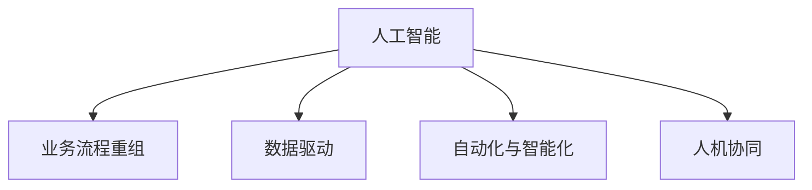

                 

## 1. 背景介绍

在数字化转型的浪潮下，人工智能(AI)技术正逐步渗透到各行各业的业务流程中，成为推动企业升级改造的重要引擎。AI不仅能够显著提高业务效率，还能带来深刻的管理变革，助力企业重塑竞争优势。本文将深入探讨AI在业务流程重组中的角色，从原理、实施步骤、应用领域等多个维度展开详细讨论，并提供典型案例和工具资源推荐，旨在帮助企业更好地理解和应用AI技术，实现业务流程的优化与重构。

## 2. 核心概念与联系

### 2.1 核心概念概述

为全面理解AI在业务流程重组中的作用，本节将介绍几个关键概念及其相互联系：

- **人工智能(AI)**：涵盖机器学习(ML)、深度学习(DL)、自然语言处理(NLP)等技术，能够模仿人类智能完成复杂任务。
- **业务流程重组(BPR)**：指通过重新设计业务流程，优化资源配置，提高效率和灵活性的过程。
- **数据驱动**：利用大数据和AI技术进行决策和优化，而非传统经验主导。
- **自动化与智能化**：将AI技术应用于业务流程的各个环节，实现自动化操作和智能化决策。
- **人机协同**：结合人的智能和AI的能力，共同完成复杂任务。

这些概念之间的关系可以通过以下Mermaid流程图来展示：



这个流程图展示了AI技术与BPR之间的紧密联系：

1. AI技术通过数据驱动的方式，帮助BPR优化流程，提高效率。
2. 自动化与智能化是AI技术的核心应用，是实现BPR的重要手段。
3. 人机协同体现了AI技术与人的智慧的结合，使得BPR更加智能和高效。

## 3. 核心算法原理 & 具体操作步骤

### 3.1 算法原理概述

AI在业务流程重组中的核心算法原理，主要基于机器学习和深度学习的理论，通过数据驱动、模型训练和优化算法，逐步实现业务流程的自动化和智能化。

在业务流程重组中，AI的作用包括但不限于以下几个方面：

- **流程优化**：通过分析历史数据，找出流程中的瓶颈和改进点，进行优化。
- **智能决策**：利用机器学习模型，在复杂情境下做出最优决策。
- **自动化操作**：使用自然语言处理(NLP)和计算机视觉(CV)技术，自动完成繁琐、重复的任务。
- **智能监控与预警**：通过实时数据分析，及时发现异常情况，发出预警。

### 3.2 算法步骤详解

基于AI的业务流程重组步骤通常包括以下几个关键环节：

1. **需求分析与目标设定**：明确业务流程重组的目标和预期效果，梳理现有流程的痛点。
2. **数据收集与预处理**：从历史数据中提取有价值的信息，并进行清洗、标注等预处理工作。
3. **模型选择与训练**：根据业务需求选择合适的模型，如回归、分类、聚类等，进行模型训练。
4. **模型部署与测试**：将训练好的模型部署到实际业务流程中，进行测试和优化。
5. **持续监控与迭代**：实时监控模型性能，根据反馈不断优化和迭代。

### 3.3 算法优缺点

AI在业务流程重组中的应用，具有以下优点：

- **提升效率**：自动化处理任务，减少人工干预，提高流程效率。
- **降低成本**：减少人力和纸质文档，降低运营成本。
- **提高准确性**：通过机器学习模型，减少人为错误。
- **灵活性增强**：AI模型可以快速适应变化，灵活应对新需求。

同时，AI技术在应用中也存在一些局限：

- **依赖数据质量**：AI模型依赖于高质量的数据，数据不足或质量差会导致效果不佳。
- **模型复杂性**：一些复杂的业务流程可能需要多种模型的组合，增加了设计和维护的复杂性。
- **技术门槛高**：需要专业的数据科学家和工程师团队进行模型开发和部署。
- **安全与隐私**：处理敏感数据时，需要确保数据的安全与隐私。

### 3.4 算法应用领域

AI在业务流程重组中的应用广泛，涵盖以下几个主要领域：

- **金融服务**：利用AI优化信贷审批流程、风险管理、欺诈检测等。
- **医疗健康**：通过AI提升诊断、治疗、健康管理等流程的效率和精度。
- **制造业**：利用AI优化生产计划、库存管理、质量控制等流程。
- **零售电商**：利用AI提高销售预测、库存管理、客户服务等的智能化水平。
- **物流运输**：通过AI优化货物调度、路线规划、配送管理等流程。

## 4. 数学模型和公式 & 详细讲解  
### 4.1 数学模型构建

在进行AI在业务流程重组的建模时，通常包括以下几个关键组件：

- **输入层**：包括原始数据和预处理后的特征。
- **隐藏层**：负责数据的转换和提取特征，是模型核心的计算单元。
- **输出层**：根据具体业务需求，输出决策或预测结果。

### 4.2 公式推导过程

以一个简单的回归模型为例，公式推导如下：

$$
\hat{y} = w_0 + \sum_{i=1}^{n} w_i x_i + \epsilon
$$

其中，$w_0, w_1, ..., w_n$ 是模型的权重参数，$x_i$ 是输入特征，$\epsilon$ 是误差项。通过最小化均方误差损失函数，更新权重参数：

$$
\min_{w} \sum_{i=1}^{m} (y_i - \hat{y}_i)^2
$$

### 4.3 案例分析与讲解

以制造业的库存管理为例，利用AI进行预测和优化：

1. **数据准备**：收集历史销售数据、库存数据、市场趋势等。
2. **特征提取**：使用时间序列分析，提取日销售量、库存水平、季节性因素等特征。
3. **模型训练**：使用ARIMA或LSTM等模型，训练预测库存需求。
4. **优化决策**：根据预测结果，调整库存水平和订货策略，降低缺货和过剩库存的风险。

## 5. 项目实践：代码实例和详细解释说明

### 5.1 开发环境搭建

在开始实践前，我们需要配置好开发环境：

1. **安装Python**：下载并安装最新版本的Python，建议使用Anaconda进行环境管理。
2. **安装依赖库**：
   ```bash
   pip install pandas numpy scikit-learn tensorflow
   ```
3. **设置虚拟环境**：
   ```bash
   conda create --name myenv python=3.8
   conda activate myenv
   ```

### 5.2 源代码详细实现

以一个简单的销售预测项目为例，使用TensorFlow进行建模和训练：

```python
import tensorflow as tf
import pandas as pd
import numpy as np

# 加载数据
df = pd.read_csv('sales_data.csv')
features = df.drop('sales', axis=1)
target = df['sales']

# 数据预处理
features = np.array(features)
target = np.array(target)

# 划分训练集和测试集
train_features = features[:800]
test_features = features[800:]
train_target = target[:800]
test_target = target[800:]

# 定义模型
model = tf.keras.Sequential([
    tf.keras.layers.Dense(64, activation='relu'),
    tf.keras.layers.Dense(32, activation='relu'),
    tf.keras.layers.Dense(1)
])

# 编译模型
model.compile(optimizer=tf.keras.optimizers.Adam(learning_rate=0.01),
              loss='mse',
              metrics=['mae'])

# 训练模型
model.fit(train_features, train_target, epochs=100, validation_data=(test_features, test_target))

# 预测并评估
predictions = model.predict(test_features)
print('Mean Absolute Error:', np.mean(np.abs(predictions - test_target)))
```

### 5.3 代码解读与分析

本示例展示了如何使用TensorFlow构建一个简单的线性回归模型，进行销售预测：

- **数据加载**：从CSV文件中读取销售数据，分为特征和目标变量。
- **数据预处理**：将数据转换为NumPy数组，并划分训练集和测试集。
- **模型定义**：构建一个包含两个隐藏层的神经网络模型。
- **模型编译**：定义优化器、损失函数和评估指标，编译模型。
- **模型训练**：使用训练集对模型进行迭代训练，设置验证集进行性能评估。
- **模型预测**：使用训练好的模型对测试集进行预测，计算预测误差。

## 6. 实际应用场景

### 6.1 金融服务

在金融服务领域，AI被广泛应用于风险管理、信贷审批、欺诈检测等流程。通过分析客户的信用历史、交易记录等数据，AI模型能够自动生成信用评分，评估风险水平，优化审批流程。

例如，银行可以利用AI对贷款申请进行自动化审批，通过分析历史数据和客户行为，快速判断申请的信用风险。AI还可以监测交易行为，识别异常交易，及时防范欺诈风险。

### 6.2 医疗健康

AI在医疗健康领域的应用同样广泛，如影像诊断、药物研发、患者管理等。通过深度学习模型，AI可以分析医学影像，辅助医生进行精准诊断。

例如，AI可以对X光片、CT影像进行分析，自动检测出肿瘤、肺结节等异常情况，提供初步诊断结果。此外，AI还可以预测患者病情发展趋势，制定个性化治疗方案，提升医疗服务质量。

### 6.3 制造业

AI在制造业中的应用包括生产调度、质量控制、设备维护等。通过预测分析，AI可以优化生产计划，降低库存水平，提高生产效率。

例如，利用AI对历史生产数据进行分析，可以预测机器设备的使用寿命，提前进行维护和更换。AI还可以实时监控生产线，识别生产过程中的异常情况，减少停机时间和损失。

### 6.4 零售电商

AI在零售电商中的应用主要集中在销售预测、库存管理、客户服务等。通过数据分析，AI可以预测销售趋势，优化库存水平，提升客户满意度。

例如，AI可以对历史销售数据进行分析，预测未来的销售量，优化库存配置。AI还可以分析客户行为，个性化推荐商品，提升客户体验和销售额。

### 6.5 物流运输

AI在物流运输中的应用包括路线规划、货物调度、配送管理等。通过优化算法，AI可以降低运输成本，提高配送效率。

例如，利用AI进行路线规划，优化配送路径，减少运输距离和时间。AI还可以实时监控货物状态，及时调整配送计划，提高物流效率。

## 7. 工具和资源推荐

### 7.1 学习资源推荐

1. **《Python深度学习》**：涵盖深度学习的基础知识、常用算法和实际应用。
2. **《TensorFlow实战》**：介绍TensorFlow的架构和实践案例，适合入门学习。
3. **Coursera上的《机器学习》课程**：由斯坦福大学教授Andrew Ng主讲的免费课程，系统学习机器学习理论。
4. **Kaggle**：数据科学竞赛平台，提供丰富的数据集和社区资源，适合实践和竞赛。

### 7.2 开发工具推荐

1. **TensorFlow**：开源深度学习框架，支持GPU加速，适合大规模模型训练。
2. **Scikit-learn**：Python的科学计算库，提供多种机器学习算法。
3. **Jupyter Notebook**：交互式编程环境，适合数据探索和模型开发。
4. **PyCharm**：功能强大的IDE，支持Python和TensorFlow开发。

### 7.3 相关论文推荐

1. **《深度学习在金融服务中的应用》**：探讨深度学习在信用评分、欺诈检测等方面的应用。
2. **《AI在医疗影像中的应用》**：分析AI在影像诊断、疾病预测等方面的研究成果。
3. **《AI在制造业的优化与预测》**：介绍AI在生产调度、质量控制、设备维护等方面的应用。
4. **《智能物流与配送的AI应用》**：探讨AI在路线规划、货物调度、配送管理等方面的优化方法。

## 8. 总结：未来发展趋势与挑战

### 8.1 研究成果总结

AI在业务流程重组中的应用取得了显著成效，提升了企业效率，优化了资源配置，实现了智能化转型。然而，AI技术的引入也带来了新的挑战，如数据质量、模型复杂性、技术门槛等问题。

### 8.2 未来发展趋势

未来，AI在业务流程重组中的应用将更加广泛和深入，主要趋势包括：

1. **AI与大数据的融合**：利用大数据技术，增强AI模型的泛化能力和预测准确性。
2. **多模态融合**：结合图像、语音、文本等多种数据源，提升业务流程的智能化水平。
3. **智能决策引擎**：构建集成多种AI模型的决策引擎，实现更智能的决策支持。
4. **人机协同增强**：利用AI辅助人类决策，提升业务流程的灵活性和可控性。
5. **实时监控与优化**：通过实时数据分析，优化业务流程，提升运营效率。

### 8.3 面临的挑战

AI在业务流程重组中的应用仍面临以下挑战：

1. **数据质量问题**：数据不完整、不一致、不准确会影响AI模型的效果。
2. **模型复杂性**：复杂的业务流程可能需要多种AI模型的组合，增加了设计和维护的复杂性。
3. **技术门槛高**：需要专业的数据科学家和工程师团队进行模型开发和部署。
4. **安全与隐私**：处理敏感数据时，需要确保数据的安全与隐私。

### 8.4 研究展望

未来，需要在以下方面进行深入研究：

1. **自动化数据清洗**：开发自动化数据预处理工具，提高数据质量。
2. **轻量级模型**：研究轻量级模型和算法，降低技术门槛，提高部署效率。
3. **模型解释性**：提升AI模型的解释性，便于理解和调试。
4. **联邦学习**：利用联邦学习技术，保护数据隐私，提升模型泛化能力。
5. **持续学习**：构建持续学习机制，使模型能够不断学习和适应新数据。

## 9. 附录：常见问题与解答

**Q1：AI在业务流程重组中如何降低成本？**

A: AI可以自动化处理繁琐、重复的任务，减少人力和纸质文档，降低运营成本。例如，利用AI进行销售预测，优化库存管理，减少库存积压和缺货风险。

**Q2：AI在业务流程重组中如何提高效率？**

A: AI可以通过自动化和智能化操作，快速处理大量数据，提高业务流程的效率。例如，利用AI进行订单处理和客户服务，减少人工干预，提高响应速度。

**Q3：AI在业务流程重组中如何确保数据安全与隐私？**

A: 在处理敏感数据时，需要采取严格的加密和安全措施，确保数据的安全与隐私。例如，利用联邦学习技术，保护数据隐私，同时提升模型的泛化能力。

**Q4：AI在业务流程重组中如何应对复杂的业务场景？**

A: 需要结合多种AI模型和算法，构建集成化的决策支持系统。例如，利用深度学习、规则引擎和专家知识库，综合优化业务流程。

**Q5：AI在业务流程重组中如何提高模型的泛化能力？**

A: 通过引入更多数据和知识，提升模型的泛化能力。例如，利用多源数据和多模态融合技术，增强模型的泛化能力，减少过拟合风险。

通过本文的系统梳理，可以看到，AI在业务流程重组中的角色越来越重要。AI技术通过自动化和智能化操作，优化了资源配置，提升了业务效率和灵活性，推动了企业的智能化转型。随着AI技术的不断进步和应用领域的不断拓展，相信AI在业务流程重组中将发挥更大的作用，带来更深远的影响。

