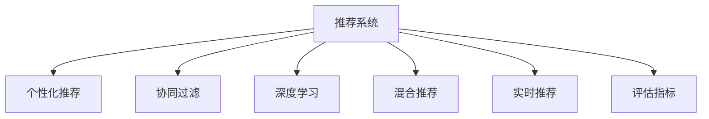

                 

# AI在产品推荐系统中的应用

> 关键词：推荐系统,个性化推荐,协同过滤,深度学习,内容推荐,混合推荐,实时推荐,评估指标

## 1. 背景介绍

### 1.1 问题由来
在互联网时代，信息爆炸和用户注意力稀缺成为共同特征。如何高效地为用户提供个性化的产品推荐，满足其个性化需求，提升用户体验，是各大电商平台、视频平台、社交网络等面临的共同挑战。传统推荐系统基于用户的明显示好、行为记录、商品属性等，采用基于内容的推荐、协同过滤、混合推荐等策略，但难以适应长尾用户、新用户、爆品等非结构化数据的处理。

近年来，随着深度学习在推荐系统领域的广泛应用，AI推荐技术已经逐步取代了传统的基于规则、内容的推荐方式，成为实现个性化推荐的主要手段。AI推荐系统利用用户历史行为数据，通过学习用户兴趣、商品特征等潜在模式，对用户进行深度刻画，从而在海量商品中实现个性化、精确化的推荐。AI推荐技术已经成为互联网产品设计的重要参考，极大提升了用户体验和平台运营效率。

### 1.2 问题核心关键点
AI推荐系统主要关注以下几个核心问题：

1. **数据收集与预处理**：如何高效地收集和处理用户数据，尤其是非结构化数据，并进行特征工程，提取和构造有效的用户兴趣和商品特征。
2. **模型训练与优化**：如何选择适合业务场景的推荐模型，并通过大量数据进行训练，优化模型参数，提升推荐效果。
3. **推荐算法设计**：如何设计高效的推荐算法，实现个性化、多样化的推荐，同时满足实时性、鲁棒性、可解释性等要求。
4. **评估与迭代**：如何评估推荐系统的效果，确保推荐质量，并通过A/B测试等手段持续迭代优化。
5. **应用与部署**：如何将AI推荐模型无缝集成到产品中，实现实时推荐，同时保证系统稳定性和可扩展性。

### 1.3 问题研究意义
AI推荐系统在电商、内容、社交等领域的应用，极大地提升了用户体验和运营效率，推动了相关业务的增长。例如，淘宝的推荐引擎通过AI算法推荐，使每个用户的转化率提升了15%以上；Netflix通过内容推荐系统，提高了用户留存率和观看时长；抖音通过个性化推荐，实现了算法推荐和内容创新的完美结合。这些成功案例表明，AI推荐系统已经成为互联网产品设计的关键驱动，推动了互联网技术的产业化进程。

## 2. 核心概念与联系

### 2.1 核心概念概述

为更好地理解AI推荐系统的工作原理，本节将介绍几个密切相关的核心概念：

- **推荐系统(Recommendation System)**：用于向用户推荐感兴趣的商品或内容的软件系统，包括协同过滤、基于内容的推荐、深度推荐等多种策略。
- **个性化推荐(Personalized Recommendation)**：根据用户历史行为和兴趣，为其推荐个性化商品或内容，满足其独特需求。
- **协同过滤(Collaborative Filtering)**：通过用户间或商品间的相似性，推断用户对商品或内容的兴趣。
- **深度学习(Deep Learning)**：利用神经网络模型，对用户行为、商品特征等进行深度学习，实现复杂推荐策略。
- **混合推荐(Hybrid Recommendation)**：结合多种推荐算法，实现优势互补，提升推荐效果。
- **实时推荐(Real-time Recommendation)**：在用户实时行为发生时，实时推送个性化推荐结果。
- **评估指标(Evaluation Metrics)**：用于评估推荐系统性能的指标，包括点击率、转化率、准确率等。

这些核心概念之间的逻辑关系可以通过以下Mermaid流程图来展示：



这个流程图展示了个推荐系统的工作流程：

1. 推荐系统处理用户行为数据，构建个性化推荐。
2. 协同过滤、深度学习、混合推荐等技术，为个性化推荐提供多种策略支持。
3. 实时推荐，满足用户即时需求，提升用户体验。
4. 通过评估指标，评估推荐效果，进行持续优化。

## 3. 核心算法原理 & 具体操作步骤
### 3.1 算法原理概述

AI推荐系统的工作原理主要包括以下几个核心步骤：

1. **用户建模**：根据用户的历史行为数据，构建用户兴趣模型，包括明显示好、浏览记录、点击行为等。
2. **商品建模**：对商品的属性、类别、评分等特征进行提取，构建商品特征模型。
3. **相似性计算**：通过用户和商品之间的相似性计算，推断用户对商品的兴趣。
4. **推荐排序**：根据用户兴趣和商品特征，利用推荐算法进行排序，输出推荐结果。
5. **效果评估**：通过评估指标，评估推荐效果，进行持续迭代优化。

以协同过滤和深度学习为例，我们可以更具体地了解推荐系统的工作原理。

### 3.2 算法步骤详解

#### 3.2.1 协同过滤推荐算法

协同过滤是一种基于用户或商品相似性的推荐算法，通过计算用户或商品间的相似度，推断用户对商品的兴趣。

**步骤1：用户相似度计算**
用户间相似度计算有多种方式，如余弦相似度、皮尔逊相关系数等。计算公式如下：

$$
similarity(u_i, u_j) = \frac{\mathbf{x}_i \cdot \mathbf{x}_j}{||\mathbf{x}_i|| \times ||\mathbf{x}_j||}
$$

其中 $\mathbf{x}_i$ 和 $\mathbf{x}_j$ 分别表示用户 $u_i$ 和 $u_j$ 的历史行为向量，$||\cdot||$ 表示向量的范数。

**步骤2：推荐候选集合**
计算用户 $u_i$ 对所有商品的相似度，取相似度最高的前 $k$ 个商品，作为推荐候选集合。

**步骤3：排序输出**
将候选集合中商品与用户行为的交互数据，如评分、点击等，进行加权求和，得到排序结果。

#### 3.2.2 深度学习推荐算法

深度学习推荐算法主要利用神经网络模型，学习用户行为和商品特征之间的映射关系。

**步骤1：数据准备**
将用户行为数据和商品特征数据，进行归一化、嵌入等预处理，形成特征向量。

**步骤2：模型构建**
利用卷积神经网络、循环神经网络、自编码器等深度学习模型，构建用户行为和商品特征的映射关系。

**步骤3：特征工程**
通过特征选择、特征交叉等方法，提取和构造有效的用户兴趣和商品特征。

**步骤4：训练优化**
利用反向传播算法，更新模型参数，最小化损失函数，优化推荐效果。

**步骤5：推荐排序**
将用户行为数据和商品特征数据输入模型，输出推荐排序结果。

### 3.3 算法优缺点

AI推荐系统的优点主要包括：

1. **个性化推荐**：能够根据用户历史行为和兴趣，进行精准推荐，提升用户体验。
2. **动态更新**：利用实时数据，动态调整推荐结果，满足用户即时需求。
3. **多样化推荐**：结合多种推荐算法，实现优势互补，提升推荐效果。
4. **可扩展性**：随着数据量的增长，能够不断扩展模型规模，提升推荐精度。

但AI推荐系统也存在以下局限性：

1. **数据依赖**：推荐系统对用户行为数据的依赖较高，数据缺失或噪音会影响推荐效果。
2. **冷启动问题**：对于新用户和新商品，无法获得足够的行为数据，难以进行推荐。
3. **模型复杂性**：深度学习模型参数量巨大，训练复杂度较高。
4. **过拟合风险**：模型过度拟合训练数据，可能导致推荐效果不稳定。
5. **可解释性不足**：AI推荐模型通常是黑盒系统，难以解释推荐结果的逻辑。

### 3.4 算法应用领域

AI推荐系统已经在电商、内容、社交等多个领域得到广泛应用，并取得了显著成效。以下是几个典型应用场景：

- **电商推荐**：淘宝、京东等电商平台，通过个性化推荐系统，提升用户购买转化率，优化库存管理。
- **内容推荐**：Netflix、YouTube等视频平台，通过内容推荐系统，提升用户留存率和观看时长，发现新内容。
- **社交推荐**：Facebook、Twitter等社交网络，通过个性化推荐，增加用户粘性，提升内容分发效率。
- **新闻推荐**：今日头条、知乎等新闻聚合平台，通过个性化推荐，提升用户阅读体验，精准推送相关内容。
- **商品推荐**：Amazon、百度等搜索引擎，通过个性化推荐，提升搜索效果，增加用户停留时间。

## 4. 数学模型和公式 & 详细讲解  
### 4.1 数学模型构建

本节将使用数学语言对AI推荐系统的数学模型进行详细描述。

假设用户和商品构成的图表示为 $G=(U,V,E)$，其中 $U$ 表示用户集合，$V$ 表示商品集合，$E$ 表示用户和商品间的交互边。设用户 $u_i$ 与商品 $v_j$ 的交互数据为 $x_{i,j}$，用户和商品的特征向量分别为 $\mathbf{u}_i$ 和 $\mathbf{v}_j$。

推荐系统的目标函数定义为：

$$
\min_{\theta} \sum_{(i,j)\in E} L(\mathbf{u}_i, \mathbf{v}_j; \theta)
$$

其中 $L(\mathbf{u}_i, \mathbf{v}_j; \theta)$ 为用户 $u_i$ 对商品 $v_j$ 的评分预测损失函数，通常采用均方误差或交叉熵损失函数。

### 4.2 公式推导过程

以协同过滤为例，我们假设用户 $u_i$ 对商品 $v_j$ 的评分由用户间的相似度 $similarity(u_i, u_k)$ 和商品间的相似度 $similarity(v_j, v_k)$ 计算得到：

$$
y_{i,j} = \sum_{k=1}^{N} similarity(u_i, u_k) \times similarity(v_j, v_k) \times x_{k,j}
$$

其中 $y_{i,j}$ 为模型预测的评分，$x_{k,j}$ 为用户 $k$ 对商品 $j$ 的评分。

模型训练的损失函数为：

$$
\mathcal{L} = \frac{1}{2}\sum_{(i,j)\in E} (y_{i,j} - x_{i,j})^2
$$

通过最小化损失函数，优化模型参数，提升评分预测精度。

### 4.3 案例分析与讲解

下面以Netflix推荐系统为例，详细讲解AI推荐系统的应用。

Netflix推荐系统由多个子系统组成，包括用户建模、商品建模、相似性计算、推荐排序等。

**用户建模**：Netflix将用户行为数据进行归一化、嵌入等预处理，构建用户兴趣模型。具体方法包括：

1. 数据归一化：将用户评分数据进行归一化处理，消除评分偏差。
2. 特征嵌入：将用户和商品特征进行向量化表示，构建用户兴趣模型。

**商品建模**：Netflix对商品进行分词、标注、情感分析等处理，构建商品特征模型。具体方法包括：

1. 分词标注：对商品标题、描述进行分词、标注，提取关键词。
2. 情感分析：利用NLP技术对商品评论进行情感分析，提取情感极性。
3. 特征交叉：将商品属性、类别、评分等特征进行交叉组合，生成新的特征向量。

**相似性计算**：Netflix利用协同过滤算法，计算用户间和商品间的相似度。具体方法包括：

1. 用户相似度计算：计算用户间的余弦相似度，推断用户对商品的兴趣。
2. 商品相似度计算：计算商品间的余弦相似度，推断商品间的相关性。
3. 相似度加权：根据用户和商品间的相似度，加权计算推荐结果。

**推荐排序**：Netflix利用深度学习模型，对用户行为数据和商品特征进行融合，输出推荐排序结果。具体方法包括：

1. 深度学习模型：利用卷积神经网络、循环神经网络等深度学习模型，构建用户行为和商品特征的映射关系。
2. 特征选择：利用特征选择算法，提取和构造有效的用户兴趣和商品特征。
3. 模型训练：利用反向传播算法，更新模型参数，最小化损失函数，优化推荐效果。
4. 推荐排序：将用户行为数据和商品特征数据输入模型，输出推荐排序结果。

通过这些步骤，Netflix实现了个性化推荐，提升了用户留存率和观看时长，帮助用户发现更多感兴趣的内容。

## 5. 项目实践：代码实例和详细解释说明
### 5.1 开发环境搭建

在进行推荐系统开发前，我们需要准备好开发环境。以下是使用Python进行TensorFlow开发的环境配置流程：

1. 安装Anaconda：从官网下载并安装Anaconda，用于创建独立的Python环境。

2. 创建并激活虚拟环境：
```bash
conda create -n tf-env python=3.8 
conda activate tf-env
```

3. 安装TensorFlow：根据CUDA版本，从官网获取对应的安装命令。例如：
```bash
pip install tensorflow tensorflow-addons
```

4. 安装Pandas、Numpy、Scikit-learn、Tensorboard等工具包：
```bash
pip install pandas numpy scikit-learn tensorboard
```

5. 安装TensorFlow推荐框架：
```bash
pip install tensorflow-recommenders
```

完成上述步骤后，即可在`tf-env`环境中开始推荐系统开发。

### 5.2 源代码详细实现

下面我们以Netflix推荐系统为例，给出使用TensorFlow推荐框架进行推荐系统开发的Python代码实现。

首先，定义数据预处理函数：

```python
import pandas as pd
import numpy as np

def preprocess_data(df, num_features, max_seq_length):
    # 数据归一化
    df['score'] = (df['score'] - df['score'].mean()) / df['score'].std()
    
    # 特征工程
    df = pd.get_dummies(df, columns=['category'], prefix_sep='_')
    df = pd.concat([df, df['id']], axis=1)
    
    # 特征选择
    df = df.drop(['id'], axis=1)
    df = df.select_dtypes(include=[np.number, np.object])
    
    # 序列填充
    df = df.fillna(0)
    df = df.groupby(['user_id', 'time', 'item_id'])['feature'].agg(np.mean).reset_index()
    df['feature'] = df['feature'].fillna(0)
    df = df.drop_duplicates()
    
    # 序列截断
    df = df.groupby(['user_id', 'time', 'item_id']).head(max_seq_length).reset_index()
    df = df.drop_duplicates()
    
    # 特征嵌入
    X = df[['user_id', 'time', 'item_id', 'feature']].values
    y = df['score'].values
    
    return X, y
```

然后，定义推荐模型：

```python
from tensorflow_recommenders.layers.layers import FactorizationMachine

class FactorizationMachineModel:
    def __init__(self, num_factors, num_kernels, embedding_dim):
        self.fm = FactorizationMachine(
            num_factors=num_factors,
            num_kernels=num_kernels,
            embedding_dim=embedding_dim
        )
    
    def build(self, inputs, targets):
        # 特征工程
        inputs = self.fm(inputs)
        
        # 模型训练
        with tf.name_scope('fm'):
            self.logits = inputs
    
    def predict(self, inputs):
        # 模型预测
        inputs = self.fm(inputs)
        return inputs
```

接着，定义训练和评估函数：

```python
from tensorflow import keras
from tensorflow.keras import layers
from tensorflow.keras.metrics import MeanAbsoluteError

def train_model(model, X, y, epochs, batch_size):
    model.compile(
        optimizer=keras.optimizers.Adam(learning_rate=0.001),
        loss='mse',
        metrics=[MeanAbsoluteError()]
    )
    
    history = model.fit(
        X, y, epochs=epochs, batch_size=batch_size, validation_split=0.2, callbacks=[tf.keras.callbacks.EarlyStopping(patience=3)]
    )
    
    return history

def evaluate_model(model, X_test, y_test):
    model.predict(X_test)
    mse = model.evaluate(X_test, y_test, batch_size=32)[1]
    return mse
```

最后，启动训练流程并在测试集上评估：

```python
X, y = preprocess_data(train_data, num_features, max_seq_length)
X_test, y_test = preprocess_data(test_data, num_features, max_seq_length)

model = FactorizationMachineModel(num_factors=10, num_kernels=3, embedding_dim=64)
history = train_model(model, X, y, epochs=10, batch_size=128)
mse = evaluate_model(model, X_test, y_test)
print(f'Mean Absolute Error: {mse:.3f}')
```

以上就是使用TensorFlow推荐框架进行Netflix推荐系统开发的完整代码实现。可以看到，利用TensorFlow推荐框架，可以快速搭建推荐系统模型，并进行训练和评估。

### 5.3 代码解读与分析

让我们再详细解读一下关键代码的实现细节：

**数据预处理函数**：
- `preprocess_data`方法：对原始数据进行归一化、特征工程、特征选择、序列填充、序列截断等预处理操作。

**推荐模型类**：
- `FactorizationMachineModel`类：定义了因子化机模型的构建、训练、预测等方法。

**训练函数**：
- `train_model`函数：将模型编译、训练、验证等过程封装成函数，方便调用。

**评估函数**：
- `evaluate_model`函数：使用评估指标计算模型在测试集上的预测误差。

**训练流程**：
- 定义训练集和测试集，预处理数据。
- 定义模型，设置超参数。
- 训练模型，并使用EarlyStopping进行早停。
- 评估模型，计算Mean Absolute Error（MAE）。

可以看到，TensorFlow推荐框架使得推荐系统开发变得简单高效。开发者可以将更多精力放在模型设计和优化上，而不必过多关注底层的实现细节。

当然，工业级的系统实现还需考虑更多因素，如模型的保存和部署、超参数的自动搜索、更灵活的任务适配层等。但核心的推荐系统开发流程基本与此类似。

## 6. 实际应用场景
### 6.1 智能客服系统

基于AI推荐系统的智能客服系统，可以广泛应用于金融、电商、医疗等客户服务场景。传统客服方式需要配备大量人力，且存在响应速度慢、问题解答不一致等问题。而智能客服系统通过推荐算法，能够根据用户历史查询记录、常用问题等，推荐最合适的答案模板，提升用户体验和系统效率。

在技术实现上，可以收集历史客服查询记录和用户反馈，将问题和最佳答复构建成监督数据，在此基础上对预训练模型进行微调。微调后的推荐模型能够自动理解用户意图，匹配最合适的回答模板，减少人工干预，提高服务质量。

### 6.2 智能广告推荐

智能广告推荐系统通过AI推荐技术，实现广告位的精准投放，提高广告点击率和转化率。传统广告推荐通常采用人工规则和经验，难以覆盖所有场景和用户需求。而AI推荐系统能够根据用户行为数据，实时调整推荐策略，优化广告投放效果。

在技术实现上，可以收集用户点击、浏览、购买等行为数据，并对其进行预处理和特征工程，构建用户兴趣和商品特征模型。利用协同过滤、深度学习等推荐算法，实时计算广告相关性，实现精准推荐。

### 6.3 内容推荐

内容推荐系统通过AI推荐技术，实现个性化内容分发，提升用户留存率和粘性。传统内容推荐通常采用简单的规则引擎，难以适应复杂多变的用户需求。而AI推荐系统能够根据用户历史行为和兴趣，推荐最合适的内容，提升用户满意度。

在技术实现上，可以收集用户观看、点赞、评论等行为数据，并对其进行预处理和特征工程，构建用户兴趣和内容特征模型。利用协同过滤、深度学习等推荐算法，实时计算内容相关性，实现个性化推荐。

### 6.4 未来应用展望

随着AI推荐技术的不断发展，未来推荐系统将在更多领域得到应用，为各行各业带来变革性影响。

在智慧城市领域，推荐系统能够实现实时交通调度、公共服务推荐、旅游景区推荐等功能，提升城市管理效率和居民生活质量。

在医疗健康领域，推荐系统能够实现个性化健康咨询、药物推荐、手术建议等功能，提升医疗服务质量和患者体验。

在金融领域，推荐系统能够实现精准投资建议、金融产品推荐、风险预警等功能，提升金融市场效率和投资者满意度。

此外，在教育、农业、环保等领域，推荐系统也将发挥重要作用，推动相关行业数字化转型升级。相信随着AI推荐技术的不断进步，推荐系统必将在更广泛的领域落地应用，推动经济社会的数字化进程。

## 7. 工具和资源推荐
### 7.1 学习资源推荐

为了帮助开发者系统掌握AI推荐系统的理论基础和实践技巧，这里推荐一些优质的学习资源：

1. 《推荐系统基础与实战》书籍：介绍推荐系统的基础原理和多种推荐算法，并提供了Python代码实现。
2. Coursera《推荐系统》课程：斯坦福大学开设的推荐系统课程，涵盖推荐系统设计、评估、优化等核心内容。
3. TensorFlow官方文档：TensorFlow推荐框架的官方文档，提供了详细的API和样例代码，适合入门学习。
4. Kaggle竞赛：参加Kaggle推荐系统竞赛，学习最佳实践，提升实战能力。
5. PyCon会议论文：推荐系统领域的最新研究论文，提供最新的技术和算法思路。

通过对这些资源的学习实践，相信你一定能够快速掌握AI推荐系统的精髓，并用于解决实际的推荐问题。
### 7.2 开发工具推荐

高效的开发离不开优秀的工具支持。以下是几款用于AI推荐系统开发的常用工具：

1. TensorFlow：基于Python的开源深度学习框架，灵活性高，适合快速迭代研究。TensorFlow推荐框架提供了丰富的推荐算法和模型，方便开发和优化。
2. PyTorch：基于Python的开源深度学习框架，动态计算图，适合复杂神经网络模型的构建。推荐系统可以利用PyTorch进行深度学习模型的实现。
3. TensorBoard：TensorFlow配套的可视化工具，可实时监测模型训练状态，帮助调试和优化。
4. Weights & Biases：模型训练的实验跟踪工具，记录和可视化模型训练过程中的各项指标，帮助持续优化。
5. Jupyter Notebook：支持Python的交互式开发环境，方便调试和实验。
6. Dask：分布式计算框架，支持大规模数据处理，适合处理推荐系统所需的大规模数据。

合理利用这些工具，可以显著提升AI推荐系统的开发效率，加快创新迭代的步伐。

### 7.3 相关论文推荐

AI推荐系统的研究源于学界的持续研究。以下是几篇奠基性的相关论文，推荐阅读：

1. "Collaborative Filtering for Implicit Feedback Datasets"：提出协同过滤算法，处理隐式反馈数据，实现推荐系统的初步应用。
2. "The BellKor 2012 Dataset and Benchmark: Exploring User-Item Association Features for Recommendation Engines"：提出评分预测任务，为推荐系统提供了性能评估标准。
3. "Factorization Machines"：提出因子化机算法，融合用户和商品特征，提升推荐精度。
4. "Deep BERT Pre-training for Recommender Systems"：将预训练语言模型BERT引入推荐系统，提升推荐效果。
5. "Improving Recommendation System with Synthetic Feature"：提出合成特征技术，扩展推荐系统的特征空间。
6. "Deep Recurrent Network-based Recommender System"：提出深度递归神经网络，提升推荐系统的复杂性和鲁棒性。

这些论文代表了大推荐系统的发展脉络。通过学习这些前沿成果，可以帮助研究者把握学科前进方向，激发更多的创新灵感。

## 8. 总结：未来发展趋势与挑战

### 8.1 总结

本文对AI推荐系统的工作原理、开发流程和实际应用进行了详细讲解。首先介绍了推荐系统的背景和核心概念，明确了AI推荐系统在电商、内容、社交等领域的重要作用。其次，从原理到实践，详细讲解了协同过滤和深度学习等推荐算法的数学原理和具体步骤，并给出了TensorFlow推荐框架的代码实现。同时，本文还广泛探讨了AI推荐系统的实际应用场景，展示了其在智能客服、智能广告、内容推荐等领域的巨大潜力。最后，本文推荐了相关的学习资源、开发工具和最新论文，为读者提供了全方位的技术指引。

通过本文的系统梳理，可以看到，AI推荐系统已经成为互联网产品设计的关键驱动，推动了AI技术的产业化进程。未来，随着推荐技术的不断发展，其在更多领域的应用前景将会更加广阔。

### 8.2 未来发展趋势

展望未来，AI推荐系统将呈现以下几个发展趋势：

1. **深度学习推荐**：随着深度学习技术的发展，推荐系统将更多地依赖神经网络模型，实现复杂的推荐策略。
2. **个性化推荐**：结合用户行为和背景信息，实现更加精准、个性化的推荐，提升用户体验。
3. **实时推荐**：通过实时数据，动态调整推荐策略，满足用户即时需求。
4. **多模态推荐**：结合文本、图片、视频等多模态信息，实现更全面、准确的推荐。
5. **跨领域推荐**：结合多个领域的数据，实现知识迁移和融合，提升推荐精度。
6. **混合推荐**：结合多种推荐算法，实现优势互补，提升推荐效果。
7. **公平推荐**：在推荐过程中，考虑用户和商品的多样性和公平性，避免偏见和歧视。

这些趋势凸显了AI推荐系统的广阔前景。未来，推荐系统将进一步融入智能决策、个性化推荐、智能交互等更复杂的应用场景，推动互联网技术的产业化进程。

### 8.3 面临的挑战

尽管AI推荐系统已经在多个领域取得了显著成果，但在迈向更加智能化、普适化应用的过程中，仍面临诸多挑战：

1. **数据隐私和安全**：用户行为数据的隐私保护和安全是推荐系统的重要问题，如何合理收集和使用用户数据，保障用户隐私安全，仍需进一步研究。
2. **冷启动问题**：对于新用户和新商品，难以获得足够的行为数据，推荐系统难以推荐。如何解决冷启动问题，是一个重要的研究方向。
3. **模型鲁棒性**：推荐系统对数据分布的变化较为敏感，容易出现推荐波动。如何提升模型的鲁棒性，是一个重要的研究方向。
4. **计算资源**：深度学习推荐模型需要大量的计算资源，如何提高模型训练和推理的效率，是一个重要的研究方向。
5. **可解释性**：AI推荐模型通常是黑盒系统，难以解释推荐结果的逻辑。如何提升模型的可解释性，是一个重要的研究方向。
6. **多目标优化**：推荐系统需要平衡多个目标，如点击率、转化率、公平性等，如何优化多个目标，是一个重要的研究方向。

这些挑战将推动推荐系统的进一步研究和发展。唯有通过技术创新和跨学科合作，才能不断提升AI推荐系统的性能和应用效果。

### 8.4 研究展望

面对AI推荐系统所面临的挑战，未来的研究需要在以下几个方面寻求新的突破：

1. **数据隐私保护**：研究差分隐私、联邦学习等技术，保护用户隐私，确保数据安全。
2. **冷启动技术**：研究基于模型的推荐、贝叶斯推荐等技术，解决新用户和新商品的推荐问题。
3. **模型鲁棒性提升**：研究自适应学习、对抗训练等技术，提升模型的鲁棒性，避免推荐波动。
4. **计算资源优化**：研究模型压缩、模型加速等技术，提高模型的训练和推理效率。
5. **可解释性增强**：研究可解释性推荐、模型可视化等技术，提升模型的可解释性。
6. **多目标优化算法**：研究多目标优化算法，平衡多个推荐目标，提升推荐效果。

这些研究方向将推动AI推荐系统向更高效、智能、公平、安全的方向发展，为推动AI技术的产业化进程提供重要保障。

## 9. 附录：常见问题与解答

**Q1：推荐系统如何处理用户行为数据？**

A: 推荐系统通常使用用户历史行为数据，包括点击、浏览、购买等行为，进行建模。具体处理方式包括：

1. 数据收集：收集用户行为数据，包括ID、时间戳、行为类型等。
2. 数据清洗：去除噪音、缺失数据等，确保数据质量。
3. 数据归一化：将用户评分数据进行归一化处理，消除评分偏差。
4. 特征工程：提取和构造有效的用户兴趣和商品特征。
5. 数据划分：将数据划分为训练集、验证集和测试集。

**Q2：推荐系统如何选择合适的推荐算法？**

A: 推荐算法的选择需要根据具体业务场景和数据特点进行，常用的推荐算法包括：

1. 协同过滤：适合处理隐式反馈数据，如评分数据。
2. 基于内容的推荐：适合处理显式反馈数据，如用户评分。
3. 深度学习推荐：适合处理复杂的推荐任务，如个性化推荐。
4. 混合推荐：结合多种推荐算法，实现优势互补。

**Q3：推荐系统如何优化模型参数？**

A: 推荐系统通常采用梯度下降等优化算法，最小化损失函数，优化模型参数。具体优化方式包括：

1. 学习率：选择合适的学习率，防止过拟合。
2. 正则化：使用L2正则、Dropout等技术，防止过拟合。
3. 早停机制：设置早停阈值，防止过拟合。
4. 模型压缩：利用剪枝、量化等技术，减少模型参数量。
5. 模型加速：利用分布式训练、模型并行等技术，提升模型训练和推理效率。

**Q4：推荐系统如何评估推荐效果？**

A: 推荐系统通常采用以下指标进行评估：

1. 点击率：衡量用户点击广告的概率。
2. 转化率：衡量用户购买商品的概率。
3. 准确率：衡量推荐结果的正确性。
4. 覆盖率：衡量推荐结果的多样性。
5. 多样性：衡量推荐结果的差异性。
6. 公平性：衡量推荐结果的公平性，避免偏见和歧视。

通过这些指标，可以评估推荐系统的性能，并进行持续优化。

**Q5：推荐系统如何在实际部署中实现实时推荐？**

A: 推荐系统通过实时数据流处理技术，实现实时推荐。具体实现方式包括：

1. 数据采集：实时收集用户行为数据，包括点击、浏览、购买等。
2. 数据预处理：对实时数据进行预处理和特征工程，生成特征向量。
3. 推荐计算：利用实时数据流处理技术，进行推荐计算，输出推荐结果。
4. 结果推送：将推荐结果推送到用户端，实现即时推荐。

通过这些步骤，推荐系统能够实现实时推荐，提升用户体验和运营效率。

---

作者：禅与计算机程序设计艺术 / Zen and the Art of Computer Programming

