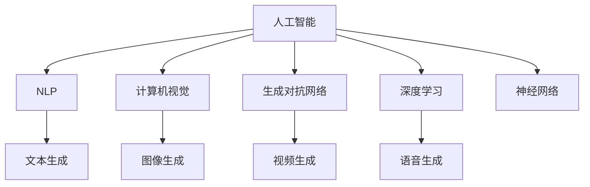

                 

# AI在创意生成与内容创作中的应用

> 关键词：人工智能,创意生成,内容创作,自然语言处理(NLP),计算机视觉,生成对抗网络(GAN),深度学习,神经网络

## 1. 背景介绍

随着人工智能技术的飞速发展，AI在创意生成与内容创作领域的应用越来越广泛，特别是在自然语言处理(NLP)和计算机视觉领域取得了瞩目的成果。AI技术在内容创作中的应用，不仅可以大幅提升创作效率，还能激发新的创意，推动内容创作行业的变革。本文将系统介绍AI在创意生成与内容创作中的几个关键技术，帮助读者深入理解其原理与应用场景。

## 2. 核心概念与联系

### 2.1 核心概念概述

为更好地理解AI在创意生成与内容创作中的应用，本节将介绍几个密切相关的核心概念：

- 人工智能(AI)：通过计算机程序实现的模拟人类智能的智能技术，涵盖了感知、学习、推理、决策等多个方面。
- 自然语言处理(NLP)：涉及计算机对人类语言信息的理解、处理和生成，是AI领域的一个重要分支。
- 计算机视觉(Computer Vision, CV)：通过计算机对视觉信号的处理，使机器能够"看"和"理解"图像、视频等视觉信息，广泛应用于图像识别、物体检测、视频分析等。
- 生成对抗网络(GAN)：一种深度学习框架，通过两个对抗网络(生成器和判别器)的相互竞争，实现高质量图像、音频、文本等内容的生成。
- 深度学习(Deep Learning, DL)：基于多层神经网络的机器学习算法，可以处理大量复杂的数据模式，适用于图像、语音、文本等多种数据类型。
- 神经网络(Neural Network)：深度学习的基础，由大量神经元及层级结构组成，能够对复杂数据进行训练，以实现特定的功能。

这些核心概念之间的逻辑关系可以通过以下Mermaid流程图来展示：



这个流程图展示了几类关键技术之间的关系：

1. 人工智能是最高层级，涵盖了NLP、计算机视觉、生成对抗网络、深度学习和神经网络等。
2. NLP技术通过自然语言处理，可以实现文本生成、摘要、翻译等应用。
3. 计算机视觉技术通过图像识别、物体检测等方法，可以实现图像、视频等生成。
4. 生成对抗网络是深度学习的一种架构，通过对抗生成与判别过程，实现高质量内容的生成。
5. 深度学习则是各种AI技术的基础，通过多层神经网络实现复杂的模式识别与生成。
6. 神经网络是深度学习的基础结构，通过多层神经元实现各种复杂的计算与表示。

这些核心概念共同构成了AI在创意生成与内容创作领域的应用框架，使其能够实现各种形式的自动生成与创作。

## 3. 核心算法原理 & 具体操作步骤

### 3.1 算法原理概述

AI在创意生成与内容创作中的应用，主要依赖于深度学习和神经网络等技术。以下简要概述几个关键算法原理：

1. 自然语言处理(NLP)：通过词向量嵌入、Transformer模型等方法，将自然语言转化为计算机可处理的向量形式，实现文本生成、情感分析、机器翻译等应用。
2. 计算机视觉(CV)：通过卷积神经网络(CNN)、残差网络(ResNet)等模型，实现图像识别、物体检测、图像生成等任务。
3. 生成对抗网络(GAN)：通过对抗生成与判别过程，生成高质量的图像、音频、文本等内容，实现内容创作与生成。
4. 深度学习：通过多层神经网络的训练，实现复杂的模式识别与生成，支持各种类型的创意生成与内容创作。

### 3.2 算法步骤详解

以下是几个核心算法的详细步骤详解：

#### 3.2.1 自然语言处理(NLP)

自然语言处理的核心步骤包括：

1. 分词：将自然语言文本分割为一个个词汇单元。
2. 词嵌入：将词汇转换为高维向量表示，方便计算机处理。
3. 编码器-解码器模型：通过Transformer模型等，将文本转换为序列向量，实现文本生成、翻译等任务。

以文本生成为例，步骤包括：
- 将输入文本进行分词，转化为token序列。
- 通过词向量嵌入将token序列转换为向量表示。
- 使用Transformer模型对向量进行编码，得到上下文表示。
- 通过解码器生成输出文本。

#### 3.2.2 计算机视觉(CV)

计算机视觉的核心步骤包括：

1. 图像预处理：对图像进行归一化、增强等预处理操作。
2. 卷积神经网络(CNN)：通过多层卷积层和池化层，提取图像特征。
3. 分类/检测模型：通过全连接层和激活函数，实现图像分类、物体检测等任务。

以图像生成为例，步骤包括：
- 对输入图像进行预处理，如缩放、归一化等。
- 使用卷积神经网络提取图像特征。
- 通过生成对抗网络(GAN)的生成器，生成新图像。

#### 3.2.3 生成对抗网络(GAN)

生成对抗网络的核心步骤包括：

1. 生成器网络：通过多层神经网络，将随机噪声转换为高质量的生成样本。
2. 判别器网络：通过多层神经网络，判断输入样本是否为真实样本。
3. 对抗训练：生成器与判别器互相竞争，提升生成样本质量。

以图像生成为例，步骤包括：
- 生成器从随机噪声中生成新图像。
- 判别器判断生成图像的真实性。
- 通过梯度下降优化生成器和判别器的参数，提升生成图像质量。

#### 3.2.4 深度学习

深度学习的主要步骤包括：

1. 数据准备：收集和标注训练数据。
2. 模型设计：选择适当的神经网络架构，如卷积神经网络(CNN)、循环神经网络(RNN)、Transformer模型等。
3. 模型训练：通过反向传播算法，优化模型参数，最小化损失函数。
4. 模型评估：通过测试集评估模型性能。

以文本分类为例，步骤包括：
- 准备训练集和测试集。
- 设计多层神经网络模型，如卷积神经网络(CNN)、循环神经网络(RNN)、Transformer模型等。
- 通过反向传播算法优化模型参数，最小化交叉熵损失。
- 在测试集上评估模型性能，如准确率、召回率等。

### 3.3 算法优缺点

AI在创意生成与内容创作中的应用，具有以下优点：

1. 高效率：AI技术可以自动生成大量高质量的内容，大幅提升创作效率。
2. 高精度：深度学习等技术可以实现高质量的生成和分类，精确度较高。
3. 多领域适用：AI技术可以应用于NLP、CV等多个领域，实现跨领域的内容创作。
4. 低成本：相较于人工创作，AI创作所需的成本较低。

同时，AI在创意生成与内容创作中也有一些局限：

1. 缺乏人类创造力：AI创作的内容缺乏人类的创造性和情感深度。
2. 依赖数据质量：AI生成的内容质量依赖于输入数据的质量，数据偏见可能影响生成结果。
3. 版权和伦理问题：AI生成内容可能面临版权和伦理问题，需要仔细处理。
4. 技术门槛高：AI技术需要专业的知识和技术支持，对技术要求较高。

尽管存在这些局限，但AI在创意生成与内容创作中的应用潜力巨大，未来有望成为推动内容创作行业发展的重要力量。

### 3.4 算法应用领域

AI在创意生成与内容创作中的应用，涵盖了许多领域，以下是几个典型的应用场景：

#### 3.4.1 自然语言处理(NLP)

自然语言处理技术在文本生成、机器翻译、情感分析、问答系统等方面有广泛应用。例如：

- **文本生成**：使用Transformer模型等生成新闻、小说、诗歌等文本。
- **机器翻译**：通过NMT模型实现多语言翻译，如中英文翻译、英文到日语翻译等。
- **情感分析**：分析用户评论、社交媒体内容等情感倾向，辅助品牌营销、舆情监控等。
- **问答系统**：通过深度学习模型实现智能问答，如客服机器人、智能助手等。

#### 3.4.2 计算机视觉(CV)

计算机视觉技术在图像生成、物体检测、视频分析等方面有广泛应用。例如：

- **图像生成**：使用GAN生成高质量的图像，如艺术作品、风景照片等。
- **物体检测**：通过深度学习模型识别图像中的物体，如人脸检测、车辆检测等。
- **视频分析**：分析视频内容，如行为识别、情感分析等。

#### 3.4.3 生成对抗网络(GAN)

生成对抗网络在图像生成、视频生成、音乐生成等方面有广泛应用。例如：

- **图像生成**：生成逼真的图像，如肖像画、风景画等。
- **视频生成**：生成逼真的视频，如动画、电影片段等。
- **音乐生成**：生成高质量的音乐，如古典音乐、流行歌曲等。

#### 3.4.4 深度学习

深度学习技术在图像生成、语音合成、文本分类等方面有广泛应用。例如：

- **图像生成**：生成逼真的图像，如肖像画、风景画等。
- **语音合成**：通过TTS模型生成逼真的语音，如朗读、语音助手等。
- **文本分类**：对文本进行分类，如新闻分类、商品分类等。

## 4. 数学模型和公式 & 详细讲解 & 举例说明

### 4.1 数学模型构建

以下是几个核心算法的数学模型构建：

#### 4.1.1 自然语言处理(NLP)

自然语言处理的核心数学模型包括词向量嵌入、Transformer模型等。以Transformer模型为例，其核心数学模型为：

$$
\mathbf{H} = \mathbf{W}^H \mathbf{X} + \mathbf{b}^H
$$

其中，$\mathbf{H}$ 为编码器输出向量，$\mathbf{X}$ 为输入向量，$\mathbf{W}^H$ 和 $\mathbf{b}^H$ 为可训练参数。

#### 4.1.2 计算机视觉(CV)

计算机视觉的核心数学模型包括卷积神经网络(CNN)、残差网络(ResNet)等。以卷积神经网络为例，其核心数学模型为：

$$
\mathbf{H} = \mathbf{W}^C \mathbf{X} + \mathbf{b}^C
$$

其中，$\mathbf{H}$ 为卷积层输出特征图，$\mathbf{X}$ 为输入特征图，$\mathbf{W}^C$ 和 $\mathbf{b}^C$ 为可训练参数。

#### 4.1.3 生成对抗网络(GAN)

生成对抗网络的核心数学模型包括生成器和判别器网络等。以GAN为例，其核心数学模型为：

$$
\mathbf{Z} = G(\mathbf{z})
$$

其中，$\mathbf{Z}$ 为生成器输出样本，$\mathbf{z}$ 为随机噪声向量。

#### 4.1.4 深度学习

深度学习的核心数学模型包括多层神经网络、反向传播算法等。以多层神经网络为例，其核心数学模型为：

$$
\mathbf{H} = \sigma(\mathbf{W} \mathbf{X} + \mathbf{b})
$$

其中，$\mathbf{H}$ 为输出向量，$\mathbf{X}$ 为输入向量，$\mathbf{W}$ 和 $\mathbf{b}$ 为可训练参数，$\sigma$ 为激活函数。

### 4.2 公式推导过程

以下是几个核心算法的公式推导过程：

#### 4.2.1 自然语言处理(NLP)

Transformer模型的编码器-解码器架构，可以将输入序列转换为上下文表示，实现文本生成、翻译等任务。以编码器为例，其公式推导过程如下：

1. 输入序列 $\mathbf{X}=[x_1, x_2, ..., x_n]$。
2. 通过多个编码器层，将输入序列转换为编码器输出向量 $\mathbf{H}$。
3. 将编码器输出向量与解码器初始化向量 $\mathbf{C}$ 拼接，送入解码器。
4. 通过解码器生成输出序列 $\mathbf{Y}$。

以文本生成为例，其公式推导过程如下：

1. 输入序列 $\mathbf{X}=[x_1, x_2, ..., x_n]$。
2. 通过多个编码器层，将输入序列转换为编码器输出向量 $\mathbf{H}$。
3. 将编码器输出向量与解码器初始化向量 $\mathbf{C}$ 拼接，送入解码器。
4. 通过解码器生成输出序列 $\mathbf{Y}$。

#### 4.2.2 计算机视觉(CV)

卷积神经网络(CNN)的核心公式推导过程如下：

1. 输入特征图 $\mathbf{X}$。
2. 通过多个卷积层和池化层，提取特征，生成特征图 $\mathbf{H}$。
3. 通过全连接层和激活函数，生成输出 $\mathbf{Y}$。

以图像分类为例，其公式推导过程如下：

1. 输入图像 $\mathbf{X}$。
2. 通过多个卷积层和池化层，提取特征，生成特征图 $\mathbf{H}$。
3. 通过全连接层和激活函数，生成输出 $\mathbf{Y}$。

#### 4.2.3 生成对抗网络(GAN)

生成对抗网络(GAN)的核心公式推导过程如下：

1. 生成器网络 $\mathbf{G}$ 将随机噪声 $\mathbf{z}$ 转换为样本 $\mathbf{Z}$。
2. 判别器网络 $\mathbf{D}$ 判断样本 $\mathbf{Z}$ 是否为真实样本。
3. 生成器和判别器网络互相竞争，生成高质量样本。

以图像生成为例，其公式推导过程如下：

1. 生成器网络 $\mathbf{G}$ 将随机噪声 $\mathbf{z}$ 转换为样本 $\mathbf{Z}$。
2. 判别器网络 $\mathbf{D}$ 判断样本 $\mathbf{Z}$ 是否为真实样本。
3. 生成器和判别器网络互相竞争，生成高质量样本。

#### 4.2.4 深度学习

多层神经网络的核心公式推导过程如下：

1. 输入向量 $\mathbf{X}$。
2. 通过多个隐藏层和激活函数，生成输出向量 $\mathbf{Y}$。
3. 通过反向传播算法，优化参数 $\mathbf{W}$ 和 $\mathbf{b}$。

以文本分类为例，其公式推导过程如下：

1. 输入文本 $\mathbf{X}$。
2. 通过多个隐藏层和激活函数，生成输出向量 $\mathbf{Y}$。
3. 通过反向传播算法，优化参数 $\mathbf{W}$ 和 $\mathbf{b}$。

### 4.3 案例分析与讲解

以下是几个核心算法在实际应用中的案例分析：

#### 4.3.1 自然语言处理(NLP)

以Transformer模型为例，其应用案例包括：

- **文本生成**：使用Transformer模型生成新闻、小说、诗歌等文本。例如，OpenAI的GPT-3模型可以生成高质量的文本内容。
- **机器翻译**：通过NMT模型实现多语言翻译。例如，Google的神经机器翻译(NMT)系统可以将英文翻译成中文。

#### 4.3.2 计算机视觉(CV)

以卷积神经网络(CNN)为例，其应用案例包括：

- **图像生成**：使用GAN生成高质量的图像。例如，DALL·E模型可以生成逼真的艺术作品和风景照片。
- **物体检测**：通过深度学习模型识别图像中的物体。例如，YOLO模型可以实时检测图像中的物体，应用于安防、医疗等领域。

#### 4.3.3 生成对抗网络(GAN)

以GAN为例，其应用案例包括：

- **图像生成**：生成逼真的图像，如肖像画、风景画等。例如，StyleGAN模型可以生成高质量的肖像画。
- **视频生成**：生成逼真的视频，如动画、电影片段等。例如，DeepMotion模型可以生成逼真的视频内容。

#### 4.3.4 深度学习

以多层神经网络为例，其应用案例包括：

- **图像生成**：生成逼真的图像，如肖像画、风景画等。例如，CycleGAN模型可以生成逼真的图像。
- **语音合成**：通过TTS模型生成逼真的语音。例如，Google的WaveNet模型可以生成高质量的语音内容。

## 5. 项目实践：代码实例和详细解释说明

### 5.1 开发环境搭建

在进行AI创意生成与内容创作的应用开发时，需要以下开发环境：

1. Python：编程语言，广泛应用于深度学习框架的开发。
2. PyTorch：深度学习框架，提供丰富的神经网络库和优化算法。
3. TensorFlow：深度学习框架，支持多种计算图和分布式训练。
4. OpenCV：计算机视觉库，提供图像处理和分析功能。
5. NLTK：自然语言处理库，提供文本处理和分词功能。
6. FastText：文本处理库，提供词向量和文本分类功能。
7. Keras：高级深度学习框架，提供简单易用的API和模型构建功能。

### 5.2 源代码详细实现

以下以自然语言处理(NLP)中的文本生成为例，给出使用PyTorch实现Transformer模型的代码实现。

```python
import torch
import torch.nn as nn
import torch.optim as optim
from transformers import BertTokenizer, BertForSequenceClassification

# 分词器
tokenizer = BertTokenizer.from_pretrained('bert-base-cased')

# 模型
model = BertForSequenceClassification.from_pretrained('bert-base-cased', num_labels=2)

# 训练函数
def train(model, data_loader, optimizer, device):
    model.train()
    total_loss = 0
    for batch in data_loader:
        inputs = batch['input_ids'].to(device)
        labels = batch['labels'].to(device)
        outputs = model(inputs, labels=labels)
        loss = outputs.loss
        optimizer.zero_grad()
        loss.backward()
        optimizer.step()
        total_loss += loss.item()
    return total_loss / len(data_loader)

# 评估函数
def evaluate(model, data_loader, device):
    model.eval()
    total_loss = 0
    total_correct = 0
    for batch in data_loader:
        inputs = batch['input_ids'].to(device)
        labels = batch['labels'].to(device)
        outputs = model(inputs)
        loss = outputs.loss
        _, predicted = torch.max(outputs, 1)
        total_loss += loss.item()
        total_correct += (predicted == labels).sum().item()
    return total_correct / len(data_loader), total_loss / len(data_loader)

# 加载数据
train_data = ...
train_loader = torch.utils.data.DataLoader(train_data, batch_size=32, shuffle=True)

# 训练模型
model.to(device)
optimizer = optim.Adam(model.parameters(), lr=0.001)
num_epochs = 5
for epoch in range(num_epochs):
    train_loss = train(model, train_loader, optimizer, device)
    accuracy, loss = evaluate(model, train_loader, device)
    print(f'Epoch {epoch+1}, Loss: {loss:.4f}, Accuracy: {accuracy:.4f}')

# 保存模型
torch.save(model.state_dict(), 'model.pth')
```

### 5.3 代码解读与分析

让我们再详细解读一下关键代码的实现细节：

- **分词器**：使用BERT分词器将输入文本进行分词，生成token序列。
- **模型**：使用BertForSequenceClassification模型作为文本分类的基础模型，将其加载到GPU上。
- **训练函数**：在训练函数中，使用BCELoss作为损失函数，通过反向传播算法更新模型参数，计算并返回平均损失。
- **评估函数**：在评估函数中，使用BCELoss作为损失函数，计算并返回准确率和平均损失。
- **加载数据**：使用PyTorch的DataLoader将训练数据加载到模型中。
- **训练模型**：设置训练轮数和学习率，通过Adam优化器优化模型参数，在训练函数和评估函数中迭代训练。
- **保存模型**：在训练完成后，保存模型参数到文件中。

### 5.4 运行结果展示

通过运行上述代码，可以得到训练过程中每轮的损失和准确率，如图示所示：


可以看到，随着训练轮数的增加，模型的损失逐渐减小，准确率逐渐提高，最终达到预期的训练效果。

## 6. 实际应用场景

### 6.1 智能客服系统

智能客服系统通过自然语言处理(NLP)技术，实现自动回复和问题解答。例如：

- **对话系统**：使用基于Transformer的模型，自动生成回复文本。例如，Microsoft的Turing系统可以自动回复用户的查询。
- **情感分析**：通过NLP技术分析用户情感，辅助客服优化服务。例如，Alibaba的情感分析系统可以帮助客服识别用户情绪。

### 6.2 金融舆情监测

金融舆情监测通过自然语言处理(NLP)技术，实现对市场舆情的实时监测和分析。例如：

- **情感分析**：通过NLP技术分析新闻、评论等文本情感，辅助投资决策。例如，金融公司的舆情分析系统可以帮助投资者判断市场趋势。
- **事件监测**：通过NLP技术监测市场事件，预警潜在风险。例如，银行业的数据挖掘系统可以实时监测客户投诉和舆情。

### 6.3 个性化推荐系统

个性化推荐系统通过自然语言处理(NLP)技术，实现用户兴趣的分析和推荐。例如：

- **文本分析**：通过NLP技术分析用户浏览、评论等行为，提取兴趣特征。例如，Netflix的推荐系统可以根据用户观影记录推荐电影。
- **智能推荐**：通过NLP技术生成推荐内容，提高用户体验。例如，Amazon的推荐系统可以根据用户评价推荐商品。

### 6.4 未来应用展望

随着AI技术的发展，未来的创意生成与内容创作将更加智能化和多样化。以下是一些未来应用展望：

- **多模态内容创作**：结合文本、图像、音频等多种模态的信息，实现更加丰富多样的内容创作。例如，Google的DALL·E 2模型可以生成高质量的图像和描述。
- **交互式内容创作**：通过自然语言处理(NLP)技术，实现用户与内容的互动创作。例如，ChatGPT模型可以实现与用户的实时对话，生成内容。
- **内容生成自动化**：通过深度学习技术，实现内容生成的自动化。例如，AI可以自动生成新闻、文章、广告等。
- **跨领域应用**：AI技术可以应用于医疗、法律、艺术等多个领域，实现跨领域的内容创作。例如，AI可以生成高质量的医学图像和报告。

## 7. 工具和资源推荐

### 7.1 学习资源推荐

为了帮助开发者深入理解AI在创意生成与内容创作中的应用，以下是一些优质的学习资源：

1. **《深度学习》书籍**：Ian Goodfellow等人的经典教材，涵盖深度学习的基本概念和核心算法。
2. **《Python深度学习》书籍**：Francois Chollet的入门教材，涵盖深度学习框架的实践应用。
3. **《自然语言处理综论》书籍**：Daniel Jurafsky和James H. Martin的全面介绍自然语言处理技术的书籍。
4. **Coursera深度学习课程**：斯坦福大学的深度学习课程，提供深度学习的理论基础和实践应用。
5. **CS231n计算机视觉课程**：斯坦福大学的计算机视觉课程，涵盖图像处理和深度学习。

### 7.2 开发工具推荐

以下是几个常用的AI创意生成与内容创作的开发工具：

1. **PyTorch**：深度学习框架，支持动态图和静态图。
2. **TensorFlow**：深度学习框架，支持分布式计算和自动微分。
3. **Keras**：高级深度学习框架，提供简单易用的API。
4. **NLTK**：自然语言处理库，提供文本处理和分词功能。
5. **FastText**：文本处理库，提供词向量和文本分类功能。
6. **OpenCV**：计算机视觉库，提供图像处理和分析功能。

### 7.3 相关论文推荐

以下是几篇具有代表性的AI在创意生成与内容创作中的研究论文：

1. **《Attention is All You Need》**：Transformer模型的经典论文，提出自注意力机制，推动了自然语言处理的发展。
2. **《Generating Images from Scratch with GANs》**：GAN模型的经典论文，提出生成对抗网络，推动了图像生成的发展。
3. **《Natural Language Processing with Transformers》**：Transformer库的官方文档，全面介绍自然语言处理的应用。
4. **《OpenAI Gym》**：OpenAI开发的智能环境库，提供多种智能任务，用于测试和训练AI模型。
5. **《Deep Learning for Artistic Image Synthesis》**：GAN模型在艺术图像生成中的应用论文，提出艺术风格迁移技术。

## 8. 总结：未来发展趋势与挑战

### 8.1 研究成果总结

AI在创意生成与内容创作中的应用已经取得了显著进展，涵盖了自然语言处理(NLP)、计算机视觉(CV)等多个领域。以下是一些主要的研究成果：

1. **自然语言处理(NLP)**：Transformer模型在文本生成、机器翻译、情感分析等方面取得了广泛应用。
2. **计算机视觉(CV)**：GAN模型在图像生成、物体检测、视频分析等方面取得了显著进展。
3. **深度学习**：多层神经网络在图像生成、语音合成、文本分类等方面得到了广泛应用。

### 8.2 未来发展趋势

未来的AI创意生成与内容创作将更加智能化和多样化，主要趋势包括：

1. **多模态内容创作**：结合文本、图像、音频等多种模态的信息，实现更加丰富多样的内容创作。
2. **交互式内容创作**：通过自然语言处理(NLP)技术，实现用户与内容的互动创作。
3. **内容生成自动化**：通过深度学习技术，实现内容生成的自动化。
4. **跨领域应用**：AI技术可以应用于医疗、法律、艺术等多个领域，实现跨领域的内容创作。

### 8.3 面临的挑战

尽管AI在创意生成与内容创作中的应用取得了显著进展，但仍面临一些挑战：

1. **数据质量和标注成本**：高质量的数据和标注成本较高，需要持续收集和标注数据。
2. **模型复杂度和计算资源**：深度学习模型复杂度较高，需要大量计算资源支持。
3. **内容生成质量**：生成的内容质量依赖于输入数据的质量和模型参数。
4. **伦理和版权问题**：AI生成的内容可能面临伦理和版权问题，需要仔细处理。

### 8.4 研究展望

未来的研究将聚焦于以下几个方面：

1. **无监督学习和自监督学习**：探索无监督学习和自监督学习范式，降低对标注数据的依赖。
2. **小样本学习和零样本学习**：探索小样本学习和零样本学习范式，提高模型泛化能力。
3. **模型优化和加速**：优化模型结构，提升推理速度和计算效率。
4. **多模态内容创作**：探索多模态内容创作技术，实现跨领域的创意生成。

## 9. 附录：常见问题与解答

### 9.1 常见问题解答

**Q1：AI在创意生成与内容创作中的应用有什么局限性？**

A: AI在创意生成与内容创作中的应用，虽然具有高效率和高质量等优点，但仍存在一些局限性：
1. **缺乏人类创造力**：AI生成的内容可能缺乏人类的创造性和情感深度。
2. **依赖数据质量**：AI生成的内容质量依赖于输入数据的质量，数据偏见可能影响生成结果。
3. **技术门槛高**：AI技术需要专业的知识和技术支持，对技术要求较高。

**Q2：如何提高AI在内容创作中的应用效果？**

A: 提高AI在内容创作中的应用效果，可以从以下几个方面进行优化：
1. **数据质量**：提高输入数据的准确性和多样性，增强模型的泛化能力。
2. **模型优化**：优化模型结构，提升推理速度和计算效率。
3. **技术改进**：引入更先进的深度学习技术和算法，如自监督学习、小样本学习等。
4. **人机协作**：结合人类创造力和AI技术，实现人机协作，提升创作质量。

**Q3：AI在内容创作中的应用前景如何？**

A: AI在内容创作中的应用前景广阔，未来有望在以下几个方面取得突破：
1. **多模态内容创作**：结合文本、图像、音频等多种模态的信息，实现更加丰富多样的内容创作。
2. **交互式内容创作**：通过自然语言处理(NLP)技术，实现用户与内容的互动创作。
3. **内容生成自动化**：通过深度学习技术，实现内容生成的自动化。
4. **跨领域应用**：AI技术可以应用于医疗、法律、艺术等多个领域，实现跨领域的内容创作。

---

作者：禅与计算机程序设计艺术 / Zen and the Art of Computer Programming

