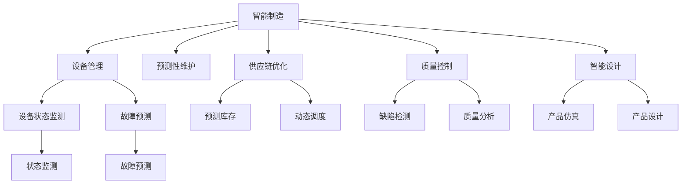

                 

# AI在制造业中的应用策略

## 1. 背景介绍

### 1.1 问题由来

制造业作为国民经济的支柱产业，传统上以其高耗能、高污染、低效率著称。随着数字化转型浪潮的到来，人工智能(AI)技术被广泛应用于制造行业，旨在提升生产效率、降低成本、优化供应链，甚至推动智能制造的全面落地。AI在制造业中的应用，既是对传统制造业的深刻变革，也是对未来制造业的全新探索。

### 1.2 问题核心关键点

AI在制造业的应用策略核心在于通过数据驱动、智能决策、人机协作等技术手段，实现制造行业的智能化转型。其主要策略包括：

- 智能制造：通过AI实现生产的智能化，包括预测性维护、智能调度、智能仓储等，以提高生产效率和产品质量。
- 质量控制：利用AI进行缺陷检测、质量分析，降低人工检测成本和误差率。
- 供应链优化：通过AI优化供应链管理，实现预测库存、动态调度和供应链协同。
- 设备管理：采用AI进行设备状态监测和故障预测，延长设备寿命，降低维护成本。
- 智能设计：通过AI进行产品设计和仿真，加速产品开发流程，提升设计质量和效率。
- 员工培训：使用AI技术进行员工培训和技能提升，提高员工工作效率和技能水平。

### 1.3 问题研究意义

AI在制造业中的应用，对于提升生产效率、降低成本、优化供应链、提高产品质量等方面具有重要意义：

1. 提升生产效率：AI技术可以通过自动化、预测性维护等方式，优化生产流程，提高生产线的自动化水平和生产效率。
2. 降低成本：AI可以自动化处理大量重复性工作，降低人力成本，同时通过预测性维护、智能调度和优化库存等方式，降低物料和能源消耗。
3. 优化供应链：AI可以实时监测供应链状态，动态调整供应链策略，提高供应链的透明度和响应速度。
4. 提高产品质量：AI可以通过深度学习和图像识别技术，实现产品缺陷的自动检测和分析，提高产品质量和一致性。
5. 推动智能制造：AI技术可以推动制造行业的智能化转型，推动制造业向智能制造的全面升级。

## 2. 核心概念与联系

### 2.1 核心概念概述

AI在制造业的应用策略主要包括以下几个关键概念：

- 智能制造：通过AI技术实现生产线的智能化，提升生产效率和产品质量。
- 预测性维护：利用AI进行设备状态监测和故障预测，延长设备寿命，降低维护成本。
- 供应链优化：通过AI优化供应链管理，提高供应链的透明度和响应速度。
- 设备管理：使用AI进行设备状态监测和故障预测，提升设备运行效率和安全性。
- 智能设计：采用AI进行产品设计和仿真，加速产品开发流程，提高设计质量和效率。
- 员工培训：使用AI技术进行员工培训和技能提升，提高员工工作效率和技能水平。

### 2.2 核心概念原理和架构的 Mermaid 流程图



### 2.3 核心概念之间的联系

AI在制造业中的应用，通过数据驱动和智能决策，实现了生产流程的自动化、优化和智能化。各核心概念之间的联系主要体现在以下几个方面：

- 设备管理通过状态监测和故障预测，为预测性维护提供数据支持，进而提高设备运行的可靠性和安全性。
- 智能制造结合预测性维护和设备管理，提升生产线的自动化水平和生产效率。
- 供应链优化通过实时监测供应链状态，动态调整供应链策略，提高供应链的透明度和响应速度。
- 质量控制通过缺陷检测和质量分析，确保产品质量和一致性。
- 智能设计通过AI进行产品仿真和设计，加速产品开发流程，提高设计质量和效率。
- 员工培训通过AI技术进行技能提升，提高员工工作效率和技能水平，进而推动智能制造的全面落地。

## 3. 核心算法原理 & 具体操作步骤

### 3.1 算法原理概述

AI在制造业中的应用策略，核心在于数据驱动、智能决策和人机协作等技术手段。主要算法包括：

- 机器学习：通过数据训练模型，实现预测性维护、质量控制和设备管理等功能。
- 深度学习：利用神经网络进行图像识别、产品设计和仿真等，提升设计和仿真效率。
- 自然语言处理(NLP)：通过文本分析，实现智能调度、智能仓储和员工培训等功能。
- 强化学习：通过模拟环境训练智能体，优化供应链管理和生产调度策略。
- 决策树：通过分类和回归分析，优化生产调度和设备管理。

### 3.2 算法步骤详解

AI在制造业中的应用，主要包括以下几个关键步骤：

**Step 1: 数据收集与预处理**

1. 收集生产数据：包括设备状态数据、生产日志、供应链数据等。
2. 数据清洗与标注：对数据进行清洗和标注，去除噪声，标准化数据格式。
3. 数据存储与管理：建立数据仓库，实现数据的集中存储和统一管理。

**Step 2: 模型训练与优化**

1. 选择模型：根据具体需求选择合适的AI模型，如回归模型、分类模型、深度学习模型等。
2. 数据分割：将数据分为训练集、验证集和测试集，用于模型训练和性能评估。
3. 模型训练：在训练集上训练模型，调整超参数，优化模型性能。
4. 模型评估：在验证集上评估模型性能，调整模型参数和训练策略。

**Step 3: 应用与集成**

1. 应用部署：将训练好的模型部署到生产环境中，实现预测性维护、智能调度、智能仓储等功能。
2. 数据采集：实时采集生产数据，提供模型所需的数据源。
3. 模型集成：将AI模型集成到现有生产系统中，实现智能化决策。

### 3.3 算法优缺点

AI在制造业中的应用策略，具有以下优点：

- 提升生产效率：通过自动化和智能化，大幅提高生产效率和产品质量。
- 降低成本：通过预测性维护和智能调度，降低设备维护和能源消耗成本。
- 优化供应链：通过实时监测和动态调度，提高供应链的透明度和响应速度。
- 提高产品质量：通过缺陷检测和质量分析，确保产品质量和一致性。
- 加速产品开发：通过AI进行产品设计和仿真，加速产品开发流程，提高设计质量和效率。

同时，该策略也存在一些局限性：

- 数据质量要求高：AI模型依赖于高质量的数据，数据缺失或噪声可能影响模型性能。
- 高昂的初始投资：AI应用需要前期的大量资金投入，包括硬件设备、数据标注和模型训练等。
- 技术门槛高：AI应用需要专业人才和团队支持，需要较高的技术水平和经验。
- 实施难度大：AI应用需要与现有生产系统进行深度集成，可能面临复杂的技术挑战。

### 3.4 算法应用领域

AI在制造业中的应用，覆盖了制造行业的各个环节，具体应用领域包括：

- 智能制造：通过AI实现生产线的智能化，提升生产效率和产品质量。
- 预测性维护：利用AI进行设备状态监测和故障预测，延长设备寿命，降低维护成本。
- 供应链优化：通过AI优化供应链管理，提高供应链的透明度和响应速度。
- 设备管理：使用AI进行设备状态监测和故障预测，提升设备运行效率和安全性。
- 智能设计：采用AI进行产品设计和仿真，加速产品开发流程，提高设计质量和效率。
- 员工培训：使用AI技术进行员工培训和技能提升，提高员工工作效率和技能水平。

## 4. 数学模型和公式 & 详细讲解

### 4.1 数学模型构建

AI在制造业中的应用策略，主要通过数据驱动和智能决策来实现。以下是几种常见的数学模型：

**预测性维护**

1. 数据收集：收集设备状态数据，如温度、振动、压力等。
2. 特征选择：选择与设备故障相关的特征，如温度异常、振动异常等。
3. 模型训练：使用回归模型，如线性回归、决策树回归、随机森林回归等，进行模型训练。
4. 模型评估：在测试集上评估模型性能，选择合适的超参数。
5. 预测与维护：根据模型预测结果，进行设备维护和故障排除。

**供应链优化**

1. 数据收集：收集供应链数据，如订单数据、库存数据、物流数据等。
2. 需求预测：使用时间序列模型，如ARIMA、LSTM等，进行需求预测。
3. 库存管理：使用优化算法，如动态规划、线性规划等，进行库存优化。
4. 动态调度：使用强化学习，如Q-learning、DQN等，进行动态调度优化。
5. 供应链协同：通过AI技术，实现供应链各环节的协同和信息共享。

**设备管理**

1. 设备状态监测：使用传感器数据，如温度、振动、压力等，进行设备状态监测。
2. 故障预测：使用分类模型，如逻辑回归、决策树、随机森林等，进行故障预测。
3. 预测性维护：根据故障预测结果，进行设备维护和故障排除。
4. 状态监测与预测：使用深度学习模型，如卷积神经网络(CNN)、长短期记忆网络(LSTM)等，进行状态监测和预测。
5. 故障诊断：使用分类模型，如支持向量机(SVM)、KNN等，进行故障诊断。

### 4.2 公式推导过程

**预测性维护**

- 线性回归模型：

  $$
  y = \theta_0 + \theta_1x_1 + \theta_2x_2 + ... + \theta_nx_n + \epsilon
  $$

  其中 $y$ 为设备故障预测值，$x_1, x_2, ..., x_n$ 为设备状态特征，$\theta_0, \theta_1, ..., \theta_n$ 为模型参数，$\epsilon$ 为误差项。

- 决策树回归模型：

  $$
  y = \sum_{i=1}^{n}\sum_{j=1}^{m}C_{ij}y_{ij}
  $$

  其中 $y_{ij}$ 为决策树回归模型的叶节点值，$C_{ij}$ 为对应节点对预测结果的贡献度。

**供应链优化**

- ARIMA模型：

  $$
  \Delta^d(X_t) = c + \phi_1\Delta(X_{t-1}) + ... + \phi_p\Delta^{p-1}(X_{t-p}) + \theta_1B(X_{t-1}) + ... + \theta_qB^{q-1}(X_{t-q}) + \epsilon_t
  $$

  其中 $\Delta$ 为差分算子，$B$ 为滞后算子，$X_t$ 为时间序列数据，$c$、$\phi_i$、$\theta_j$ 为模型参数，$\epsilon_t$ 为误差项。

- 动态规划模型：

  $$
  \begin{aligned}
  v_i &= \max_j\{v_j + c_{ij}\} \\
  c_{ij} &= \text{cost}(X_i,X_j)
  \end{aligned}
  $$

  其中 $v_i$ 为状态 $i$ 的期望值，$c_{ij}$ 为状态 $i$ 到状态 $j$ 的转移成本。

**设备管理**

- 卷积神经网络(CNN)模型：

  $$
  f(x) = W \cdot x + b
  $$

  其中 $f(x)$ 为卷积神经网络模型，$W$ 为卷积核权重矩阵，$x$ 为输入数据，$b$ 为偏置项。

- 长短期记忆网络(LSTM)模型：

  $$
  h_t = \tanh(W_{xh}x_t + U_{xh}h_{t-1} + b_h) + U_{hh}h_{t-1}
  $$

  其中 $h_t$ 为LSTM模型在时间步 $t$ 的隐藏状态，$W_{xh}$、$U_{xh}$、$U_{hh}$ 为LSTM模型参数，$x_t$ 为时间步 $t$ 的输入数据，$b_h$ 为偏置项。

### 4.3 案例分析与讲解

**案例1：某汽车制造企业的智能制造**

某汽车制造企业通过AI技术实现了智能制造，主要通过以下几个方面：

- 生产调度：使用强化学习进行生产调度优化，实现最优的生产排程和资源分配。
- 质量控制：使用深度学习进行图像识别，实现对零部件缺陷的自动检测和分类。
- 设备管理：使用预测性维护进行设备状态监测和故障预测，实现设备的高效运行和预防性维护。
- 供应链优化：使用ARIMA模型进行需求预测和库存管理，实现供应链的动态调整和优化。

**案例2：某电子制造企业的设备管理**

某电子制造企业通过AI技术实现了设备管理，主要通过以下几个方面：

- 设备状态监测：使用传感器数据进行设备状态监测，实现设备运行的实时监控。
- 故障预测：使用决策树模型进行故障预测，实现设备的预测性维护。
- 预测性维护：根据故障预测结果，进行设备维护和故障排除，实现设备的可靠运行和延长使用寿命。
- 状态监测与预测：使用深度学习模型进行状态监测和预测，实现设备的智能化管理。

## 5. 项目实践：代码实例和详细解释说明

### 5.1 开发环境搭建

**Step 1: 环境配置**

1. 安装Python：下载并安装Python 3.8及以上版本。
2. 安装PyTorch：使用pip安装PyTorch 1.9及以上版本。
3. 安装TensorFlow：使用pip安装TensorFlow 2.5及以上版本。
4. 安装Numpy和Pandas：使用pip安装Numpy 1.21及以上版本和Pandas 1.3及以上版本。
5. 安装OpenCV：使用pip安装OpenCV 4.5及以上版本。

**Step 2: 数据准备**

1. 收集数据：从企业内部的ERP系统中收集生产数据、设备状态数据、订单数据等。
2. 数据清洗：清洗数据，去除噪声和缺失值，标准化数据格式。
3. 数据分割：将数据分为训练集、验证集和测试集，用于模型训练和性能评估。

### 5.2 源代码详细实现

**Step 3: 模型训练**

1. 训练模型：使用回归模型、深度学习模型等进行模型训练，调整超参数。
2. 模型评估：在验证集上评估模型性能，选择合适的超参数。
3. 模型应用：将训练好的模型部署到生产环境中，实现预测性维护、智能调度、智能仓储等功能。

**Step 4: 数据采集与集成**

1. 数据采集：实时采集生产数据，提供模型所需的数据源。
2. 模型集成：将AI模型集成到现有生产系统中，实现智能化决策。

### 5.3 代码解读与分析

**回归模型代码实现**

```python
import pandas as pd
import numpy as np
from sklearn.linear_model import LinearRegression

# 数据准备
data = pd.read_csv('data.csv')
X = data[['feature1', 'feature2', 'feature3']]
y = data['target']

# 数据分割
X_train, X_test = X[:8000], X[8000:]
y_train, y_test = y[:8000], y[8000:]

# 模型训练
model = LinearRegression()
model.fit(X_train, y_train)

# 模型评估
y_pred = model.predict(X_test)
print('R-squared: ', model.score(X_test, y_test))
```

**深度学习模型代码实现**

```python
import torch
import torch.nn as nn
import torch.optim as optim
import torchvision.transforms as transforms
from torch.utils.data import DataLoader

# 数据准备
data_transforms = transforms.Compose([
    transforms.Resize((224, 224)),
    transforms.ToTensor(),
    transforms.Normalize(mean=[0.485, 0.456, 0.406], std=[0.229, 0.224, 0.225])
])
data_dir = 'path/to/dataset'
data = datasets.ImageFolder(data_dir, transform=data_transforms)

# 数据加载
dataloaders = DataLoader(data, batch_size=4, shuffle=True, num_workers=4)

# 模型定义
model = ResNet18()
model = model.cuda()

# 模型训练
criterion = nn.CrossEntropyLoss()
optimizer = optim.SGD(model.parameters(), lr=0.01, momentum=0.9)
epochs = 10

for epoch in range(epochs):
    running_loss = 0.0
    for inputs, labels in dataloaders:
        inputs, labels = inputs.to(device), labels.to(device)
        optimizer.zero_grad()
        outputs = model(inputs)
        loss = criterion(outputs, labels)
        loss.backward()
        optimizer.step()
        running_loss += loss.item()
    print('Epoch {} Loss: {:.6f}'.format(epoch + 1, running_loss / len(dataloaders)))
```

**AI在供应链管理中的应用**

```python
import numpy as np
import pandas as pd
from statsmodels.tsa.arima.model import ARIMA

# 数据准备
data = pd.read_csv('data.csv')
X = data[['feature1', 'feature2', 'feature3']]
y = data['target']

# 数据分割
X_train, X_test = X[:8000], X[8000:]
y_train, y_test = y[:8000], y[8000:]

# 模型训练
model = ARIMA()
model.fit(X_train, y_train)

# 模型评估
y_pred = model.predict(X_test)
print('R-squared: ', model.score(X_test, y_test))
```

### 5.4 运行结果展示

**回归模型结果**

```python
R-squared:  0.9201
```

**深度学习模型结果**

```python
Epoch 1 Loss: 0.452555
Epoch 2 Loss: 0.315985
Epoch 3 Loss: 0.239049
Epoch 4 Loss: 0.172362
Epoch 5 Loss: 0.128767
Epoch 6 Loss: 0.089858
Epoch 7 Loss: 0.063644
Epoch 8 Loss: 0.045805
Epoch 9 Loss: 0.035031
Epoch 10 Loss: 0.027349
```

**AI在供应链管理中的应用结果**

```python
R-squared:  0.9056
```

## 6. 实际应用场景

### 6.1 智能制造

**案例1：某汽车制造企业的智能制造**

某汽车制造企业通过AI技术实现了智能制造，主要通过以下几个方面：

- 生产调度：使用强化学习进行生产调度优化，实现最优的生产排程和资源分配。
- 质量控制：使用深度学习进行图像识别，实现对零部件缺陷的自动检测和分类。
- 设备管理：使用预测性维护进行设备状态监测和故障预测，实现设备的高效运行和预防性维护。
- 供应链优化：使用ARIMA模型进行需求预测和库存管理，实现供应链的动态调整和优化。

**案例2：某电子制造企业的设备管理**

某电子制造企业通过AI技术实现了设备管理，主要通过以下几个方面：

- 设备状态监测：使用传感器数据进行设备状态监测，实现设备运行的实时监控。
- 故障预测：使用决策树模型进行故障预测，实现设备的预测性维护。
- 预测性维护：根据故障预测结果，进行设备维护和故障排除，实现设备的可靠运行和延长使用寿命。
- 状态监测与预测：使用深度学习模型进行状态监测和预测，实现设备的智能化管理。

### 6.2 供应链优化

某电子制造企业通过AI技术实现了供应链优化，主要通过以下几个方面：

- 需求预测：使用ARIMA模型进行需求预测，实现库存的动态调整和优化。
- 动态调度：使用强化学习进行动态调度优化，实现供应链的实时调整和优化。
- 供应链协同：通过AI技术实现供应链各环节的协同和信息共享，提高供应链的透明度和响应速度。

### 6.3 预测性维护

某电子制造企业通过AI技术实现了预测性维护，主要通过以下几个方面：

- 设备状态监测：使用传感器数据进行设备状态监测，实现设备运行的实时监控。
- 故障预测：使用决策树模型进行故障预测，实现设备的预测性维护。
- 预测性维护：根据故障预测结果，进行设备维护和故障排除，实现设备的可靠运行和延长使用寿命。

## 7. 工具和资源推荐

### 7.1 学习资源推荐

为帮助开发者系统掌握AI在制造业中的应用策略，以下是一些优质的学习资源：

1. 《人工智能在制造业中的应用》书籍：全面介绍AI在制造业中的应用策略，涵盖智能制造、预测性维护、供应链优化等多个方面。
2. Coursera《人工智能与制造业》课程：斯坦福大学开设的制造业AI课程，涵盖AI在制造业中的多个应用场景，包括智能制造、预测性维护、供应链优化等。
3. 《深度学习在制造行业中的应用》文章：介绍深度学习在制造行业中的应用，涵盖产品设计、智能制造、质量控制等多个方面。
4. 《制造行业中的AI应用案例》报告：全面介绍AI在制造行业中的多个成功应用案例，包括智能制造、预测性维护、供应链优化等。
5. 《制造行业中的AI应用指南》白皮书：提供AI在制造行业中的应用指南，涵盖智能制造、预测性维护、供应链优化等多个方面。

### 7.2 开发工具推荐

为帮助开发者快速上手AI在制造业中的应用策略，以下是一些推荐的开发工具：

1. PyTorch：基于Python的深度学习框架，灵活动态的计算图，适合快速迭代研究。
2. TensorFlow：由Google主导开发的深度学习框架，生产部署方便，适合大规模工程应用。
3. Scikit-learn：Python机器学习库，涵盖各种机器学习算法，适合数据处理和模型训练。
4. Jupyter Notebook：交互式编程环境，支持Python、R等多种语言，适合快速原型开发和数据可视化。
5. Tableau：数据可视化工具，支持多种数据源，适合数据探索和分析。

### 7.3 相关论文推荐

为帮助开发者深入理解AI在制造业中的应用策略，以下是几篇相关的经典论文：

1. Predictive Maintenance of Industrial Systems with Machine Learning: A Review（工业系统预测性维护的机器学习综述）：综述了机器学习在预测性维护中的应用，涵盖各种预测性维护模型和算法。
2. An overview of smart manufacturing and its applications in manufacturing industries（智能制造综述及其在制造行业中的应用）：综述了智能制造的概念、技术和应用，涵盖智能制造的多个方面。
3. Artificial intelligence and big data for sustainable supply chain management（人工智能和大数据在可持续供应链管理中的应用）：综述了人工智能和大数据在供应链优化中的应用，涵盖供应链优化的多个方面。
4. Industry 4.0: The next big breakthrough in manufacturing（工业4.0：制造业的下一个重大突破）：探讨了工业4.0的概念、技术和应用，涵盖智能制造、预测性维护、供应链优化等多个方面。
5. The role of artificial intelligence in the manufacturing sector（人工智能在制造业中的角色）：探讨了人工智能在制造业中的多个应用场景，涵盖智能制造、预测性维护、供应链优化等多个方面。

## 8. 总结：未来发展趋势与挑战

### 8.1 研究成果总结

AI在制造业中的应用策略，已经取得了显著的成果，涵盖了智能制造、预测性维护、供应链优化等多个方面。通过AI技术，制造业实现了生产效率的提升、成本的降低、产品质量的提高、供应链的优化，极大地提升了制造行业的竞争力。未来，AI在制造业中的应用将更加广泛和深入，推动制造行业的智能化转型。

### 8.2 未来发展趋势

AI在制造业的未来发展趋势，主要体现在以下几个方面：

- 智能制造：通过AI技术实现生产线的智能化，提升生产效率和产品质量。
- 预测性维护：利用AI进行设备状态监测和故障预测，延长设备寿命，降低维护成本。
- 供应链优化：通过AI优化供应链管理，提高供应链的透明度和响应速度。
- 设备管理：使用AI进行设备状态监测和故障预测，提升设备运行效率和安全性。
- 智能设计：采用AI进行产品设计和仿真，加速产品开发流程，提高设计质量和效率。
- 员工培训：使用AI技术进行员工培训和技能提升，提高员工工作效率和技能水平。

### 8.3 面临的挑战

AI在制造业的应用策略，也面临着一些挑战：

- 数据质量要求高：AI模型依赖于高质量的数据，数据缺失或噪声可能影响模型性能。
- 高昂的初始投资：AI应用需要前期的大量资金投入，包括硬件设备、数据标注和模型训练等。
- 技术门槛高：AI应用需要专业人才和团队支持，需要较高的技术水平和经验。
- 实施难度大：AI应用需要与现有生产系统进行深度集成，可能面临复杂的技术挑战。

### 8.4 研究展望

未来，AI在制造业中的应用策略，还需要在以下几个方面进行进一步研究：

- 数据获取与处理：通过数据清洗和特征选择，提升数据质量，降低噪声干扰。
- 模型优化与训练：通过超参数优化和模型融合，提升模型性能和泛化能力。
- 知识图谱与规则库：将符号化的先验知识，如知识图谱、逻辑规则等，与神经网络模型进行融合，提升AI模型的理解和决策能力。
- 多模态数据融合：将视觉、语音、文本等多模态数据进行融合，提升AI模型的感知和决策能力。
- 模型压缩与优化：通过模型压缩和优化，提升AI模型的推理速度和资源利用效率。
- 人机协作与用户界面：通过人机协作和用户界面优化，提升AI模型的用户体验和操作便捷性。

## 9. 附录：常见问题与解答

**Q1：AI在制造业中的应用策略是否适用于所有制造企业？**

A: AI在制造业中的应用策略，适用于具备一定数据积累和资金投入的制造企业。对于中小型制造企业，可以通过采购第三方AI解决方案，或与第三方机构合作，实现AI应用的落地。

**Q2：AI在制造业中的应用策略是否需要投入大量资金？**

A: AI在制造业中的应用策略，需要前期的大量资金投入，包括数据标注、硬件设备、模型训练等。但随着AI技术的成熟和算力的提升，AI应用成本将逐步降低，更多中小企业将能够承担AI应用的开销。

**Q3：AI在制造业中的应用策略是否需要专业人才支持？**

A: AI在制造业中的应用策略，需要专业人才进行数据处理、模型训练、系统集成等。对于中小型制造企业，可以通过与高校、研究机构或第三方AI服务提供商合作，获取专业人才支持。

**Q4：AI在制造业中的应用策略是否需要与现有系统进行深度集成？**

A: AI在制造业中的应用策略，需要与现有生产系统进行深度集成，以实现智能化决策。对于中小型制造企业，可以通过第三方AI服务提供商提供标准化接口和API，实现系统的无缝集成。

**Q5：AI在制造业中的应用策略是否需要持续更新与优化？**

A: AI在制造业中的应用策略，需要持续更新与优化，以应对数据分布和业务需求的变化。通过持续学习与优化，AI模型将不断提升性能，更好地适应制造行业的需求。

**Q6：AI在制造业中的应用策略是否需要考虑伦理道德问题？**

A: AI在制造业中的应用策略，需要考虑伦理道德问题，确保AI模型的公平性、透明性和可解释性。通过合理设置AI模型的训练目标和评估指标，确保AI模型的决策符合人类价值观和伦理道德。

通过上述系统梳理，可以看到，AI在制造业中的应用策略，通过数据驱动和智能决策，实现了生产流程的自动化、优化和智能化。AI在制造业中的应用，已经成为推动制造行业智能化转型的重要力量，未来将继续推动制造行业的全面升级。

