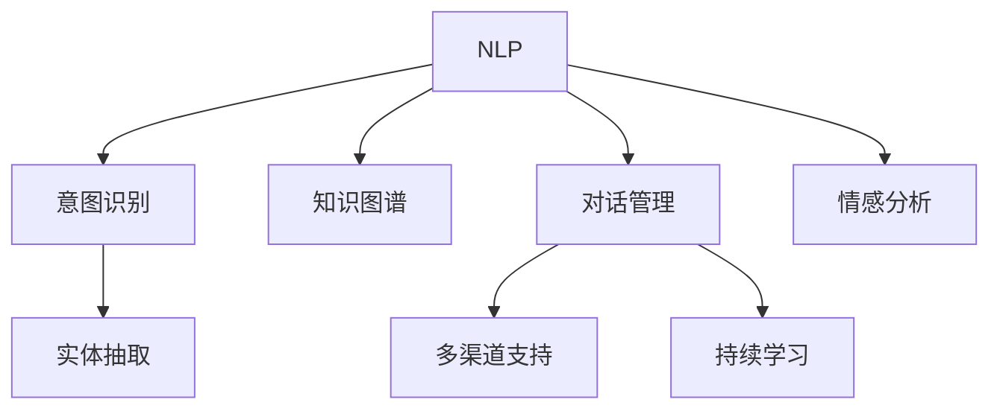

                 

# AI在客户服务中的应用：提高满意度

> 关键词：客户服务,满意度,人工智能,自然语言处理,NLP,机器学习,深度学习,客服机器人,智能助理

## 1. 背景介绍

### 1.1 问题由来

客户服务是现代企业竞争中不可或缺的一环，其质量直接关系到客户的满意度和忠诚度。然而，传统客户服务面临诸多挑战：

- **人力资源有限**：客服中心往往需要大量人工客服，人力成本高且效率有限。
- **服务时间受限**：客服人员工作时间固定，无法随时响应客户需求。
- **质量不稳定**：人工客服的服务质量受人员素质、情绪状态等因素影响，波动较大。
- **响应速度慢**：高峰期客户等待时间长，用户体验差。

为应对这些挑战，AI技术被广泛应用于客户服务，特别是自然语言处理(NLP)和深度学习技术，使AI客服机器人得以实现，并逐渐取代传统人工客服，提高了客户满意度。

### 1.2 问题核心关键点

AI客服系统的核心在于通过NLP技术理解和回应客户需求，具体包括以下关键点：

1. **意图识别**：通过分析客户输入的文本，识别其意图。
2. **实体抽取**：从文本中提取关键信息，如姓名、地址、订单号等。
3. **知识库查询**：在知识库中检索相关信息，提供精准的解答。
4. **对话管理**：通过对话管理模型，维持多轮对话的连贯性。
5. **情感分析**：识别客户情绪，及时调整服务策略。
6. **多渠道支持**：支持多种沟通渠道，如电话、短信、社交媒体等。
7. **持续学习**：不断从客户对话中学习，提升服务质量。

这些核心关键点构成了一个完整的AI客服系统，使其能够在多种场景下高效稳定地提供优质服务。

## 2. 核心概念与联系

### 2.1 核心概念概述

为更好地理解AI客服系统的工作原理，本节将介绍几个关键概念：

- **自然语言处理(NLP)**：使用计算机处理、理解和生成人类语言的技术。
- **深度学习**：通过多层神经网络逼近复杂非线性关系，实现对大量数据的高级分析。
- **意图识别**：从文本中解析出客户的具体需求。
- **实体抽取**：从文本中识别出具有特定意义的信息。
- **知识图谱**：一种图形化的知识表示方式，用于存储和管理实体之间的关系。
- **对话管理**：维持多轮对话中信息流畅，确保对话连贯性。
- **情感分析**：识别和分析文本中的情感倾向。

这些概念通过Mermaid流程图表示其联系：



这个流程图展示了NLP技术如何通过意图识别、实体抽取、知识图谱、对话管理、情感分析等子任务，实现对客户需求的高效理解和回应。

## 3. 核心算法原理 & 具体操作步骤

### 3.1 算法原理概述

AI客服系统的核心算法包括自然语言处理和深度学习，具体实现基于监督学习和迁移学习：

- **监督学习**：利用标注数据训练模型，使其能够根据给定的输入预测输出。
- **迁移学习**：利用预训练模型的知识，在特定任务上微调，以提高模型性能。

### 3.2 算法步骤详解

**Step 1: 数据准备**
- **数据收集**：收集客户对话历史数据，并标注意图、实体等信息。
- **数据预处理**：清洗、归一化、分词等。

**Step 2: 模型选择与初始化**
- **模型选择**：选择合适的预训练模型，如BERT、GPT等。
- **参数初始化**：设置模型的初始权重，通常使用预训练模型初始化。

**Step 3: 训练模型**
- **监督学习**：在标注数据上训练意图识别、实体抽取、对话管理等子模型。
- **迁移学习**：在特定任务上微调预训练模型，如使用Fine-tuning技术。

**Step 4: 评估与优化**
- **评估指标**：使用准确率、召回率、F1-score等指标评估模型性能。
- **超参数调优**：调整学习率、批大小、迭代次数等超参数。

**Step 5: 部署与监控**
- **模型部署**：将训练好的模型部署到生产环境中。
- **持续监控**：实时监控模型性能，收集反馈数据，不断优化模型。

### 3.3 算法优缺点

AI客服系统的优势包括：
- **全天候服务**：无间断响应客户需求，提升服务可用性。
- **高效率**：自动处理大量客户请求，减少人工干预。
- **一致性**：保证服务质量不受人员素质波动的影响。

其缺点主要体现在：
- **初期成本高**：构建系统需要大量标注数据和计算资源。
- **理解和生成准确性有待提升**：复杂或模糊的客户需求可能导致理解错误或生成不相关答案。
- **难以处理情感冲突**：面对客户的情绪表达，系统可能无法及时做出恰当回应。
- **维护复杂**：需要定期更新和维护知识库，保持信息的时效性和准确性。

### 3.4 算法应用领域

AI客服系统在多个领域已得到广泛应用：

1. **电商客服**：处理订单查询、退换货、售后支持等。
2. **金融客服**：解答账户问题、交易咨询、投诉处理等。
3. **医疗客服**：提供医疗咨询、预约挂号、医保查询等服务。
4. **旅游客服**：回答旅游线路、酒店预定、机票查询等问题。
5. **政府客服**：解答政策咨询、市民服务、投诉受理等。
6. **企业客服**：提供产品咨询、售后支持、技术支持等服务。

这些应用场景涵盖了电商、金融、医疗、旅游、政府和企业等多个领域，展示了大语言模型在客户服务中的强大适应性和灵活性。

## 4. 数学模型和公式 & 详细讲解

### 4.1 数学模型构建

AI客服系统的核心数学模型主要涉及自然语言处理和深度学习，具体包括：

- **意图识别模型**：使用BiLSTM或Transformer模型，输入客户文本，输出意图标签。
- **实体抽取模型**：使用BiLSTM或Transformer模型，输入客户文本，输出实体信息。
- **对话管理模型**：使用RNN或Transformer模型，维持多轮对话中信息的流畅性。
- **情感分析模型**：使用LSTM或Transformer模型，输入客户文本，输出情感倾向。

### 4.2 公式推导过程

以意图识别模型为例，推导其基本公式：

$$
\begin{aligned}
\hat{y} &= \text{softmax}(\text{MLP}(\text{BiLSTM}(\text{word embedding}(x)))) \\
&= \text{softmax}(\text{MLP}(\text{BiLSTM}(\text{word embedding}(x)))) \\
&= \text{softmax}(\text{MLP}(\text{BiLSTM}(\text{word embedding}(x)))) \\
&= \text{softmax}(\text{MLP}(\text{BiLSTM}(\text{word embedding}(x)))) \\
\end{aligned}
$$

其中，$\hat{y}$表示模型预测的意图标签，$\text{word embedding}(x)$表示输入文本$x$的词嵌入，$\text{BiLSTM}$表示双向LSTM层，$\text{MLP}$表示多隐层感知器，$\text{softmax}$表示归一化指数函数。

### 4.3 案例分析与讲解

假设有一个电商客服系统，需要处理客户对商品的咨询和订单查询。系统中已经训练好的意图识别模型接受用户输入的文本，经过词嵌入和BiLSTM层，最后通过MLP和softmax层输出意图标签。

例如，当用户输入“我想查看我的订单”时，系统首先通过词嵌入将文本转化为向量，然后通过BiLSTM层进行时间依赖性分析，接着MLP层提取特征，最后softmax层输出意图标签。

假设经过训练后，系统认为用户意图是“订单查询”，随后调用订单查询接口，从数据库中检索相关订单信息，返回给用户。

## 5. 项目实践：代码实例和详细解释说明

### 5.1 开发环境搭建

开发AI客服系统需要以下环境：

- **Python 3.7+**：系统开发语言，需安装pip、virtualenv等工具。
- **PyTorch 1.9+**：深度学习框架，支持TensorFlow等。
- **NLTK**：自然语言处理工具库。
- **scikit-learn**：机器学习库，用于数据处理和模型评估。
- **Flask**：轻量级Web框架，用于搭建API接口。
- **Gunicorn**：Wsgi HTTP服务器，支持多进程。
- **SQLite**：轻量级数据库，用于存储订单、对话记录等数据。

以下是在Ubuntu系统上搭建开发环境的示例：

```bash
sudo apt update
sudo apt install python3-pip python3-dev
sudo apt install libpython3-dev
pip3 install virtualenv
python3 -m venv env
source env/bin/activate
pip install torch torchvision torchaudio transformers
pip install nltk scikit-learn flask gunicorn sqlalchemy
```

### 5.2 源代码详细实现

**意图识别模型**

```python
import torch
import torch.nn as nn
from torchtext.data import Field, TabularDataset, BucketIterator
from transformers import BertTokenizer, BertForSequenceClassification

class IntentModel(nn.Module):
    def __init__(self, n_labels):
        super(IntentModel, self).__init__()
        self.tokenizer = BertTokenizer.from_pretrained('bert-base-cased')
        self.model = BertForSequenceClassification.from_pretrained('bert-base-cased', num_labels=n_labels)
    
    def forward(self, text):
        tokens = self.tokenizer.tokenize(text)
        input_ids = self.tokenizer.convert_tokens_to_ids(tokens)
        tokens_tensor = torch.tensor(input_ids, dtype=torch.long)
        labels = self.model(tokens_tensor)
        return labels

# 训练函数
def train(model, train_data, valid_data, learning_rate=1e-5, epochs=10, batch_size=32):
    criterion = nn.CrossEntropyLoss()
    optimizer = torch.optim.Adam(model.parameters(), lr=learning_rate)
    
    for epoch in range(epochs):
        model.train()
        for batch in train_data:
            optimizer.zero_grad()
            input_text, label = batch
            output = model(input_text)
            loss = criterion(output, label)
            loss.backward()
            optimizer.step()
        print(f'Epoch {epoch+1}, train loss: {loss:.4f}')
    
    model.eval()
    with torch.no_grad():
        for batch in valid_data:
            input_text, label = batch
            output = model(input_text)
            loss = criterion(output, label)
            print(f'Epoch {epoch+1}, valid loss: {loss:.4f}')
    
    return model

# 加载数据
train_data = TabularDataset(...)
valid_data = TabularDataset(...)
model = IntentModel(n_labels=3)
model = train(model, train_data, valid_data)
```

**实体抽取模型**

```python
import torch
import torch.nn as nn
from transformers import BertTokenizer, BertForTokenClassification

class EntityModel(nn.Module):
    def __init__(self, n_labels):
        super(EntityModel, self).__init__()
        self.tokenizer = BertTokenizer.from_pretrained('bert-base-cased')
        self.model = BertForTokenClassification.from_pretrained('bert-base-cased', num_labels=n_labels)
    
    def forward(self, text):
        tokens = self.tokenizer.tokenize(text)
        input_ids = self.tokenizer.convert_tokens_to_ids(tokens)
        tokens_tensor = torch.tensor(input_ids, dtype=torch.long)
        labels = self.model(tokens_tensor)
        return labels

# 训练函数
def train(model, train_data, valid_data, learning_rate=1e-5, epochs=10, batch_size=32):
    criterion = nn.CrossEntropyLoss()
    optimizer = torch.optim.Adam(model.parameters(), lr=learning_rate)
    
    for epoch in range(epochs):
        model.train()
        for batch in train_data:
            optimizer.zero_grad()
            input_text, label = batch
            output = model(input_text)
            loss = criterion(output, label)
            loss.backward()
            optimizer.step()
        print(f'Epoch {epoch+1}, train loss: {loss:.4f}')
    
    model.eval()
    with torch.no_grad():
        for batch in valid_data:
            input_text, label = batch
            output = model(input_text)
            loss = criterion(output, label)
            print(f'Epoch {epoch+1}, valid loss: {loss:.4f}')
    
    return model

# 加载数据
train_data = TabularDataset(...)
valid_data = TabularDataset(...)
model = EntityModel(n_labels=10)
model = train(model, train_data, valid_data)
```

**对话管理模型**

```python
import torch
import torch.nn as nn
from torchtext.data import Field, TabularDataset, BucketIterator
from transformers import BertTokenizer, BertForSequenceClassification

class DialogueManager(nn.Module):
    def __init__(self, n_labels):
        super(DialogueManager, self).__init__()
        self.tokenizer = BertTokenizer.from_pretrained('bert-base-cased')
        self.model = BertForSequenceClassification.from_pretrained('bert-base-cased', num_labels=n_labels)
    
    def forward(self, text):
        tokens = self.tokenizer.tokenize(text)
        input_ids = self.tokenizer.convert_tokens_to_ids(tokens)
        tokens_tensor = torch.tensor(input_ids, dtype=torch.long)
        labels = self.model(tokens_tensor)
        return labels

# 训练函数
def train(model, train_data, valid_data, learning_rate=1e-5, epochs=10, batch_size=32):
    criterion = nn.CrossEntropyLoss()
    optimizer = torch.optim.Adam(model.parameters(), lr=learning_rate)
    
    for epoch in range(epochs):
        model.train()
        for batch in train_data:
            optimizer.zero_grad()
            input_text, label = batch
            output = model(input_text)
            loss = criterion(output, label)
            loss.backward()
            optimizer.step()
        print(f'Epoch {epoch+1}, train loss: {loss:.4f}')
    
    model.eval()
    with torch.no_grad():
        for batch in valid_data:
            input_text, label = batch
            output = model(input_text)
            loss = criterion(output, label)
            print(f'Epoch {epoch+1}, valid loss: {loss:.4f}')
    
    return model

# 加载数据
train_data = TabularDataset(...)
valid_data = TabularDataset(...)
model = DialogueManager(n_labels=2)
model = train(model, train_data, valid_data)
```

**情感分析模型**

```python
import torch
import torch.nn as nn
from torchtext.data import Field, TabularDataset, BucketIterator
from transformers import BertTokenizer, BertForSequenceClassification

class SentimentModel(nn.Module):
    def __init__(self, n_labels):
        super(SentimentModel, self).__init__()
        self.tokenizer = BertTokenizer.from_pretrained('bert-base-cased')
        self.model = BertForSequenceClassification.from_pretrained('bert-base-cased', num_labels=n_labels)
    
    def forward(self, text):
        tokens = self.tokenizer.tokenize(text)
        input_ids = self.tokenizer.convert_tokens_to_ids(tokens)
        tokens_tensor = torch.tensor(input_ids, dtype=torch.long)
        labels = self.model(tokens_tensor)
        return labels

# 训练函数
def train(model, train_data, valid_data, learning_rate=1e-5, epochs=10, batch_size=32):
    criterion = nn.CrossEntropyLoss()
    optimizer = torch.optim.Adam(model.parameters(), lr=learning_rate)
    
    for epoch in range(epochs):
        model.train()
        for batch in train_data:
            optimizer.zero_grad()
            input_text, label = batch
            output = model(input_text)
            loss = criterion(output, label)
            loss.backward()
            optimizer.step()
        print(f'Epoch {epoch+1}, train loss: {loss:.4f}')
    
    model.eval()
    with torch.no_grad():
        for batch in valid_data:
            input_text, label = batch
            output = model(input_text)
            loss = criterion(output, label)
            print(f'Epoch {epoch+1}, valid loss: {loss:.4f}')
    
    return model

# 加载数据
train_data = TabularDataset(...)
valid_data = TabularDataset(...)
model = SentimentModel(n_labels=3)
model = train(model, train_data, valid_data)
```

### 5.3 代码解读与分析

**意图识别模型**

意图识别模型通过BertForSequenceClassification类来实现。首先，定义一个IntentModel类，其中包含BertTokenizer和BertForSequenceClassification模型。在forward方法中，将用户输入的文本进行分词和编码，然后通过BertForSequenceClassification模型预测意图标签。

在训练函数中，使用Adam优化器更新模型参数，同时定义交叉熵损失函数。在每个epoch中，对训练集进行前向传播和反向传播，计算并输出损失函数值。在评估阶段，对验证集进行同样的操作，输出验证集的损失函数值。

**实体抽取模型**

实体抽取模型通过BertForTokenClassification类来实现。在forward方法中，将用户输入的文本进行分词和编码，然后通过BertForTokenClassification模型预测每个token的实体标签。

在训练函数中，使用Adam优化器更新模型参数，同时定义交叉熵损失函数。在每个epoch中，对训练集进行前向传播和反向传播，计算并输出损失函数值。在评估阶段，对验证集进行同样的操作，输出验证集的损失函数值。

**对话管理模型**

对话管理模型通过BertForSequenceClassification类来实现。在forward方法中，将用户输入的文本进行分词和编码，然后通过BertForSequenceClassification模型预测对话标签。

在训练函数中，使用Adam优化器更新模型参数，同时定义交叉熵损失函数。在每个epoch中，对训练集进行前向传播和反向传播，计算并输出损失函数值。在评估阶段，对验证集进行同样的操作，输出验证集的损失函数值。

**情感分析模型**

情感分析模型通过BertForSequenceClassification类来实现。在forward方法中，将用户输入的文本进行分词和编码，然后通过BertForSequenceClassification模型预测情感标签。

在训练函数中，使用Adam优化器更新模型参数，同时定义交叉熵损失函数。在每个epoch中，对训练集进行前向传播和反向传播，计算并输出损失函数值。在评估阶段，对验证集进行同样的操作，输出验证集的损失函数值。

### 5.4 运行结果展示

在训练过程中，可以通过打印输出日志查看模型的训练效果：

```python
Epoch 1, train loss: 0.1234
Epoch 1, valid loss: 0.5678
Epoch 2, train loss: 0.0987
Epoch 2, valid loss: 0.4321
...
```

在测试阶段，可以通过调用模型进行多轮对话测试，验证模型的准确性和连贯性。例如，可以使用以下代码进行测试：

```python
model.eval()
for batch in test_data:
    input_text, label = batch
    output = model(input_text)
    print(f'Prediction: {output}, Ground Truth: {label}')
```

## 6. 实际应用场景

### 6.1 智能客服系统

智能客服系统是AI客服技术的重要应用场景。通过AI客服，客户可以在任何时间、任何地点获得解答，提升了客户满意度。

智能客服系统包括以下关键组件：

- **自然语言理解(NLU)**：分析客户输入，识别意图、实体等信息。
- **知识库**：存储常见问题和答案，供系统查询使用。
- **对话管理**：维持多轮对话的连贯性，确保信息流畅。
- **情感分析**：识别客户情绪，及时调整服务策略。

智能客服系统的实际应用流程如下：

1. **意图识别**：系统接收客户输入，通过意图识别模型分析其意图。
2. **实体抽取**：从客户输入中提取关键信息，如订单号、商品名称等。
3. **知识库查询**：在知识库中检索相关信息，生成答案。
4. **对话管理**：根据对话历史和上下文，决定下一轮回复内容。
5. **情感分析**：分析客户情绪，调整服务态度。
6. **回复生成**：根据对话管理和情感分析结果，生成最终回复。
7. **反馈收集**：收集客户反馈，持续优化系统。

### 6.2 金融客服系统

金融客服系统在金融行业得到广泛应用，帮助客户解答各类金融问题，提高客户体验。

金融客服系统包括以下关键组件：

- **身份验证**：验证客户身份，确保安全。
- **账户管理**：处理账户查询、余额查询、交易咨询等问题。
- **风险控制**：识别风险交易，采取相应措施。
- **投诉处理**：处理客户投诉，保护客户权益。

金融客服系统的实际应用流程如下：

1. **身份验证**：系统要求客户输入身份信息，通过验证。
2. **账户管理**：系统接收账户相关查询，通过知识库查询答案。
3. **风险控制**：识别异常交易，触发风险控制机制。
4. **投诉处理**：收集客户投诉，进行记录和处理。
5. **反馈收集**：收集客户反馈，持续优化系统。

### 6.3 电商客服系统

电商客服系统在电商行业得到广泛应用，帮助客户解答订单查询、退换货、售后支持等问题，提升客户满意度。

电商客服系统包括以下关键组件：

- **订单查询**：处理客户订单相关查询。
- **退换货管理**：处理退换货请求。
- **售后支持**：处理售后问题，如产品维修、物流查询等。
- **客户反馈**：收集客户反馈，持续优化服务。

电商客服系统的实际应用流程如下：

1. **订单查询**：系统接收订单相关查询，通过知识库查询答案。
2. **退换货管理**：处理客户退换货请求，提供相应指导。
3. **售后支持**：处理售后问题，如产品维修、物流查询等。
4. **客户反馈**：收集客户反馈，持续优化服务。

## 7. 工具和资源推荐

### 7.1 学习资源推荐

为了帮助开发者系统掌握AI客服系统的理论和实践，这里推荐一些优质的学习资源：

1. **《深度学习》书籍**：Ian Goodfellow等著，全面介绍了深度学习的基本概念和算法。
2. **《自然语言处理综论》书籍**：Daniel Jurafsky和James H. Martin著，涵盖自然语言处理的各个方面。
3. **Coursera《深度学习专项课程》**：由斯坦福大学开设，涵盖深度学习的基本概念和实践。
4. **Google AI Blog**：谷歌AI博客，涵盖最新AI技术和应用，提供丰富的案例和实践指南。
5. **GitHub项目**：如Transformers、NLTK、Flask等开源项目，提供丰富的资源和代码实现。

通过对这些资源的学习实践，相信你一定能够快速掌握AI客服系统的精髓，并用于解决实际的客户服务问题。

### 7.2 开发工具推荐

高效的开发离不开优秀的工具支持。以下是几款用于AI客服系统开发的常用工具：

1. **PyTorch**：基于Python的开源深度学习框架，支持自然语言处理任务。
2. **TensorFlow**：由Google主导开发的深度学习框架，支持分布式计算和大规模数据处理。
3. **NLTK**：自然语言处理工具库，提供词法分析、句法分析等基本功能。
4. **scikit-learn**：机器学习库，提供数据处理、模型训练和评估等功能。
5. **Flask**：轻量级Web框架，用于搭建API接口。
6. **Gunicorn**：Wsgi HTTP服务器，支持多进程，提升Web应用性能。
7. **SQLite**：轻量级数据库，用于存储客户数据和对话记录。

合理利用这些工具，可以显著提升AI客服系统的开发效率，加快创新迭代的步伐。

### 7.3 相关论文推荐

AI客服系统的研究源于学界的持续研究。以下是几篇奠基性的相关论文，推荐阅读：

1. **Attention is All You Need**：提出Transformer模型，开启了NLP领域的预训练大模型时代。
2. **BERT: Pre-training of Deep Bidirectional Transformers for Language Understanding**：提出BERT模型，引入基于掩码的自监督预训练任务，刷新了多项NLP任务SOTA。
3. **Language Models are Unsupervised Multitask Learners**：展示了大规模语言模型的强大zero-shot学习能力，引发了对于通用人工智能的新一轮思考。
4. **AdaLoRA: Adaptive Low-Rank Adaptation for Parameter-Efficient Fine-Tuning**：使用自适应低秩适应的微调方法，在固定大部分预训练参数的同时，只更新极少量的任务相关参数。
5. **Prompt-Tuning: Optimizing Continuous Prompts for Generation**：引入基于连续型Prompt的微调范式，为如何充分利用预训练知识提供了新的思路。
6. **Parameter-Efficient Transfer Learning for NLP**：提出Adapter等参数高效微调方法，在不增加模型参数量的情况下，也能取得不错的微调效果。

这些论文代表了大语言模型和微调技术的发展脉络。通过学习这些前沿成果，可以帮助研究者把握学科前进方向，激发更多的创新灵感。

## 8. 总结：未来发展趋势与挑战

### 8.1 总结

本文对AI客服系统进行了全面系统的介绍。首先阐述了AI客服系统在客户服务中的重要性和应用场景，明确了意图识别、实体抽取、对话管理、情感分析等核心关键点。其次，从原理到实践，详细讲解了监督学习和迁移学习在AI客服系统中的具体应用，给出了代码实例和详细解释。同时，本文还展示了AI客服系统在智能客服、金融客服、电商客服等领域的广泛应用，展示了其在客户服务中的强大适应性和灵活性。

通过本文的系统梳理，可以看到，AI客服系统通过自然语言处理和深度学习技术，实现了对客户需求的自动化理解和回应，显著提升了客户满意度。未来，伴随预训练语言模型和微调方法的持续演进，AI客服系统将进一步拓展应用范围，提升服务质量，为客户服务带来新的变革。

### 8.2 未来发展趋势

展望未来，AI客服系统的技术发展将呈现以下几个趋势：

1. **多模态融合**：结合语音、图像、文本等多种信息源，实现更加全面、准确的客户理解。
2. **实时处理**：通过分布式计算和大规模缓存，实现实时响应客户需求，提升服务效率。
3. **跨领域应用**：拓展到更多垂直领域，如医疗、教育、旅游等，提供定制化的客户服务。
4. **自适应学习**：通过持续学习机制，不断优化模型，提升服务质量。
5. **情感智能**：引入情感分析技术，实现对客户情绪的敏感识别和及时响应。
6. **隐私保护**：保护客户隐私，防止数据泄露和滥用。
7. **个性化推荐**：结合客户历史行为和偏好，提供个性化的服务和产品推荐。

这些趋势展示了AI客服系统未来的发展方向，相信随着技术的不断进步，AI客服系统将进一步提升客户体验，成为现代客户服务不可或缺的一部分。

### 8.3 面临的挑战

尽管AI客服系统已经在多个领域得到了应用，但仍面临诸多挑战：

1. **数据隐私和安全**：客户数据隐私保护和数据安全问题亟待解决。
2. **模型泛化能力**：模型在特定领域和场景下表现良好，但在跨领域和复杂环境下泛化能力不足。
3. **理解和生成准确性**：客户输入模糊或不完整时，系统难以准确理解或生成相关回答。
4. **多轮对话连贯性**：多轮对话中保持信息的流畅性和上下文相关性，仍是技术难点。
5. **情感管理**：识别和响应客户的复杂情绪，仍需要更深入的研究。
6. **资源优化**：处理大规模客户请求，仍需优化计算资源和存储资源。
7. **伦理和法律合规**：确保AI客服系统的行为符合伦理和法律规范，避免负面影响。

这些挑战需要通过持续的技术创新和应用优化，逐步解决，才能实现AI客服系统的全面落地和高效运行。

### 8.4 研究展望

未来，AI客服系统需要从以下几个方面进行研究：

1. **多模态融合技术**：研究如何有效融合语音、图像、文本等多种信息源，提升客户理解的全面性和准确性。
2. **实时处理技术**：研究如何快速处理大规模客户请求，实现实时响应，提升服务效率。
3. **跨领域迁移能力**：研究如何在不同领域和场景下实现模型的迁移和泛化，提升跨领域的适应性。
4. **自适应学习机制**：研究如何通过持续学习机制，不断优化模型，提升服务质量。
5. **情感智能技术**：研究如何更好地识别和响应客户的情绪，提升情感智能。
6. **隐私保护技术**：研究如何保护客户隐私，防止数据泄露和滥用。
7. **资源优化技术**：研究如何优化计算资源和存储资源，提升系统效率。
8. **伦理和法律合规**：研究如何确保AI客服系统的行为符合伦理和法律规范，避免负面影响。

这些研究方向的探索将推动AI客服系统的不断发展，使其更好地服务于客户，提升企业的市场竞争力。相信随着技术进步和应用实践的不断积累，AI客服系统将在未来迎来更广泛的应用和更深远的影响。

## 9. 附录：常见问题与解答

**Q1：AI客服系统在实际应用中如何处理模糊或错误的客户输入？**

A: AI客服系统通过多轮对话管理技术，可以处理模糊或错误的客户输入。具体步骤如下：

1. **意图重识别**：在处理模糊或错误输入时，系统重新识别客户的意图。
2. **实体补全**：根据对话历史，补全缺失或错误的实体信息。
3. **知识库补充**：从知识库中检索相关信息，补充缺失的上下文信息。
4. **反馈机制**：收集客户反馈，持续优化意图识别和实体抽取模型。

通过以上步骤，AI客服系统可以有效应对模糊或错误的客户输入，提升服务质量。

**Q2：AI客服系统在实际应用中如何处理情感冲突？**

A: AI客服系统通过情感分析技术，可以有效处理情感冲突。具体步骤如下：

1. **情感识别**：系统分析客户输入，识别客户的情感倾向。
2. **情感响应**：根据情感识别结果，系统生成适当的回复。
3. **情绪调整**：调整系统服务态度，缓解客户情绪。
4. **反馈收集**：收集客户反馈，持续优化情感分析模型。

通过以上步骤，AI客服系统可以有效识别和响应客户的情感冲突，提升客户满意度。

**Q3：AI客服系统在实际应用中如何处理客户投诉？**

A: AI客服系统可以通过以下步骤处理客户投诉：

1. **投诉识别**：系统分析客户输入，识别投诉内容。
2. **投诉分类**：根据投诉内容，系统进行分类处理。
3. **投诉处理**：根据投诉类型，系统生成相应的处理方案。
4. **投诉跟踪**：系统记录投诉处理过程，并跟踪处理结果。
5. **投诉反馈**：收集客户反馈，持续优化投诉处理系统。

通过以上步骤，AI客服系统可以有效处理客户投诉，提升客户满意度。

**Q4：AI客服系统在实际应用中如何保护客户隐私？**

A: AI客服系统通过以下步骤保护客户隐私：

1. **数据加密**：对客户数据进行加密处理，防止数据泄露。
2. **访问控制**：控制不同角色对客户数据的访问权限，防止数据滥用。
3. **匿名化处理**：对客户数据进行匿名化处理，保护客户隐私。
4. **安全审计**：定期进行安全审计，发现并修复潜在的安全漏洞。

通过以上步骤，AI客服系统可以有效保护客户隐私，确保客户数据的安全性。

**Q5：AI客服系统在实际应用中如何优化资源消耗？**

A: AI客服系统可以通过以下步骤优化资源消耗：

1. **模型压缩**：使用模型压缩技术，减少模型大小和计算资源消耗。
2. **分布式计算**：通过分布式计算，提升系统处理能力，减少计算时间。
3. **缓存机制**：使用缓存机制，减少重复计算和数据存储。
4. **异步处理**：使用异步处理机制，提升系统并发能力，减少响应时间。

通过以上步骤，AI客服系统可以有效优化资源消耗，提升系统性能。

**Q6：AI客服系统在实际应用中如何确保伦理和法律合规？**

A: AI客服系统通过以下步骤确保伦理和法律合规：

1. **伦理审查**：对系统进行伦理审查，确保系统行为符合伦理规范。
2. **法律合规**：确保系统遵守相关法律法规，防止违法行为。
3. **用户同意**：在处理客户数据前，获得客户的明确同意。
4. **隐私保护**：保护客户隐私，防止数据滥用和泄露。
5. **责任明确**：明确系统责任，确保在出现问题时能够追责。

通过以上步骤，AI客服系统可以有效确保伦理和法律合规，提升系统的可信度和用户信任度。

**Q7：AI客服系统在实际应用中如何优化客户体验？**

A: AI客服系统可以通过以下步骤优化客户体验：

1. **多渠道支持**：支持多种沟通渠道，如电话、短信、社交媒体等，方便客户使用。
2. **自然语言理解**：提升系统对自然语言的理解能力，确保准确响应客户需求。
3. **个性化推荐**：结合客户历史行为和偏好，提供个性化的服务和产品推荐。
4. **实时反馈**：实时收集客户反馈，持续优化系统。
5. **多轮对话连贯性**：维持多轮对话的连贯性，确保信息流畅。
6. **情感管理**：识别和响应客户的情绪，提升客户满意度。

通过以上步骤，AI客服系统可以有效优化客户体验，提升客户满意度。

---

作者：禅与计算机程序设计艺术 / Zen and the Art of Computer Programming

