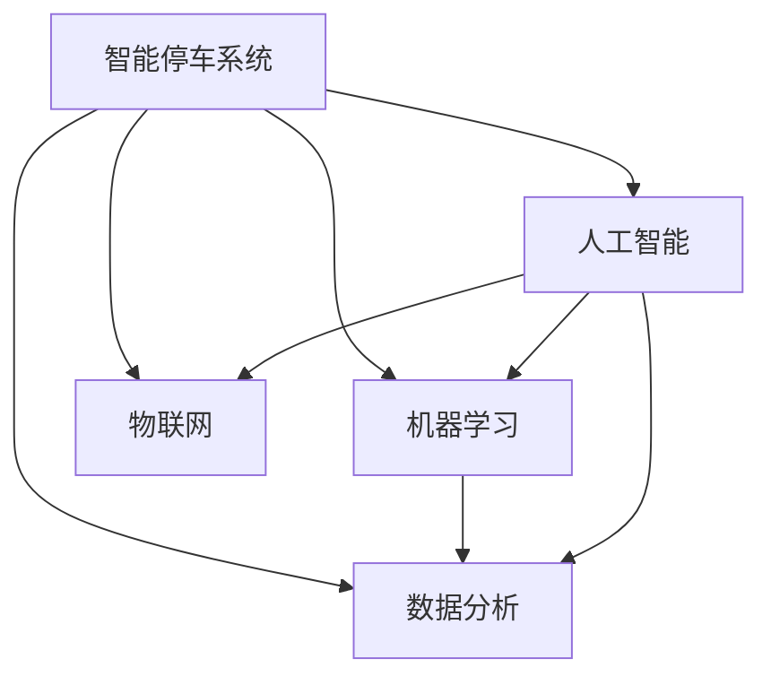

                 

# AI在智能停车系统中的应用：减少寻找时间

> 关键词：智能停车,人工智能,机器学习,物联网,数据分析,自动驾驶

## 1. 背景介绍

随着城市化进程的加速和汽车保有量的不断增长，城市停车问题已成为各大城市面临的重大挑战。据统计，城市中心区域的停车难问题尤为突出，有时司机需要花费大量时间在寻找停车位上。而智能停车系统（Intelligent Parking System, IPS）正是利用人工智能技术解决这一问题的有效途径。

智能停车系统综合应用了物联网（IoT）、人工智能（AI）、机器学习（ML）、数据分析等多种技术手段，通过智能硬件和软件系统实现对停车场的管理和优化。本文将介绍智能停车系统的核心技术实现，以及AI技术在减少寻找时间中的应用。

## 2. 核心概念与联系

### 2.1 核心概念概述

为更好地理解AI在智能停车系统中的应用，本节将介绍几个密切相关的核心概念：

- **智能停车系统**：利用计算机技术、传感器技术、数据分析技术等手段，对停车场进行智能化管理，提高停车场的利用率和效率。
- **人工智能**：一种模拟人类智能行为的计算技术，通过学习、推理、决策等能力实现对复杂问题的解决。
- **机器学习**：人工智能的一个分支，通过数据驱动的学习方式，让计算机能够自动地改进模型和算法，从而提升其性能。
- **物联网**：将物理设备、传感器、软件应用等通过互联网连接起来，实现设备间的数据交换和互动。
- **数据分析**：通过对海量数据进行挖掘和分析，提取有价值的信息，为决策提供支持。

这些核心概念之间的逻辑关系可以通过以下Mermaid流程图来展示：



这个流程图展示了一些关键概念及其之间的联系：

1. 智能停车系统利用人工智能技术，提升停车管理和优化能力。
2. 人工智能中机器学习算法可以训练模型，进行预测、分类、聚类等任务，从而优化停车系统。
3. 物联网技术可以实现停车场内设备的联网，收集实时数据。
4. 数据分析技术可以对收集到的数据进行挖掘，提供决策支持。

## 3. 核心算法原理 & 具体操作步骤
### 3.1 算法原理概述

基于AI的智能停车系统，主要利用机器学习算法进行数据分析和决策。其中，基于监督学习的方法被广泛应用于智能停车系统的预测和分类任务中。

假设智能停车系统收集的数据集为 $D=\{(x_i, y_i)\}_{i=1}^N$，其中 $x_i$ 为停车场的输入特征（如停车场容量、地理位置、时间等），$y_i$ 为输出标签（如停车位占用情况、用户寻找时间等）。智能停车系统的目标是通过训练模型，能够准确预测停车场当前的停车位占用情况，以及用户寻找停车位所需的时间。

智能停车系统一般包含以下关键步骤：

1. 数据收集：通过物联网设备（如摄像头、传感器）收集停车场数据，并进行预处理和标注。
2. 模型训练：选择合适的机器学习算法，如决策树、随机森林、深度学习等，对数据集进行训练，构建预测模型。
3. 模型评估：使用测试集对模型进行评估，计算预测准确率和召回率等指标。
4. 模型部署：将训练好的模型部署到智能停车系统中，实时提供预测结果。

### 3.2 算法步骤详解

接下来，我们将详细介绍基于监督学习的智能停车系统构建步骤：

**Step 1: 数据收集与预处理**

智能停车系统首先需要通过传感器、摄像头等设备收集停车场的数据。这些数据包括停车位占用情况、车流量、车辆类型、时间等。

数据预处理包括去噪、归一化、特征选择等步骤。例如，需要对摄像头图像进行预处理，提取关键特征（如车辆类型、颜色、位置等），并将其转换为可用于机器学习模型的数值型特征。

**Step 2: 数据标注**

在智能停车系统中，数据标注是将停车场占用情况转换为数值标签。例如，可以将停车位占用情况标注为“空闲”或“占用”，或直接标注为具体占用率。

数据标注通常由人工完成，也可以利用计算机视觉技术进行自动标注。例如，使用深度学习算法训练图像分类模型，自动识别停车位占用情况。

**Step 3: 选择和训练模型**

选择合适的机器学习算法对数据集进行训练。常用的算法包括决策树、随机森林、支持向量机（SVM）、深度学习模型（如卷积神经网络CNN、循环神经网络RNN等）。

在深度学习模型中，可以使用预训练模型（如ResNet、BERT等）进行微调，以获得更好的预测效果。具体训练流程如下：

1. 加载预训练模型。
2. 冻结预训练层，只更新模型顶层的参数。
3. 使用标注数据对模型进行训练，最小化损失函数。
4. 使用测试集对模型进行评估，调整超参数，如学习率、批大小、迭代轮数等。

**Step 4: 模型部署**

训练好的模型需要进行部署，以便实时提供预测结果。智能停车系统可以使用多种部署方式，如服务化封装、API接口、微服务架构等。

**Step 5: 反馈与优化**

智能停车系统需要根据用户反馈和实时数据，不断优化模型和算法，以适应停车场的使用变化。例如，可以根据历史数据和实时反馈，调整模型预测算法和参数，提升预测精度。

### 3.3 算法优缺点

基于监督学习的智能停车系统具有以下优点：

1. 简单高效。通过训练模型，可以实时提供停车位占用情况和用户寻找时间预测，提升停车效率。
2. 可扩展性强。可以使用多层次模型进行多维数据融合，提升预测精度。
3. 自适应性高。模型可以根据历史数据和实时反馈不断优化，适应停车场的动态变化。

但该方法也存在以下缺点：

1. 对数据依赖性强。模型效果很大程度上取决于数据的质量和数量，获取高质量数据成本较高。
2. 泛化能力有限。当目标停车场与训练数据的分布差异较大时，模型泛化能力有限。
3. 需要定期维护。模型需要定期重新训练和优化，以适应数据分布的变化。

## 4. 数学模型和公式 & 详细讲解 & 举例说明

### 4.1 数学模型构建

假设智能停车系统收集的数据集为 $D=\{(x_i, y_i)\}_{i=1}^N$，其中 $x_i$ 为停车场的输入特征，$y_i$ 为输出标签。我们的目标是通过训练模型，构建一个预测函数 $f(x)$，使得 $f(x)$ 能够准确预测 $y$。

我们选用决策树模型进行训练，决策树的预测函数为：

$$
f(x) = \begin{cases}
    y_1, & \text{if } x_1 < T_1 \\
    y_2, & \text{if } x_1 \geq T_1 \\
\end{cases}
$$

其中 $T_1$ 为决策树中的划分阈值。

### 4.2 公式推导过程

假设我们的数据集为 $D=\{(x_i, y_i)\}_{i=1}^N$，其中 $x_i$ 为停车场的输入特征，$y_i$ 为输出标签。我们的目标是通过训练模型，构建一个预测函数 $f(x)$，使得 $f(x)$ 能够准确预测 $y$。

我们选用决策树模型进行训练，决策树的预测函数为：

$$
f(x) = \begin{cases}
    y_1, & \text{if } x_1 < T_1 \\
    y_2, & \text{if } x_1 \geq T_1 \\
\end{cases}
$$

其中 $T_1$ 为决策树中的划分阈值。

为了训练模型，我们需要计算损失函数 $L$ 和代价函数 $C$。假设我们使用均方误差（MSE）作为损失函数：

$$
L = \frac{1}{N} \sum_{i=1}^N (y_i - f(x_i))^2
$$

其中 $y_i$ 为实际标签，$f(x_i)$ 为模型预测结果。

我们的目标是最小化代价函数 $C$：

$$
C = \frac{1}{N} \sum_{i=1}^N (y_i - f(x_i))^2
$$

为了求解最小化问题，我们需要使用梯度下降算法进行优化：

$$
\theta = \theta - \alpha \nabla_{\theta} C
$$

其中 $\theta$ 为模型参数，$\alpha$ 为学习率，$\nabla_{\theta} C$ 为代价函数对模型参数的梯度。

### 4.3 案例分析与讲解

以预测停车位占用情况为例，我们可以使用决策树模型进行训练。假设我们收集了某停车场的历史数据，数据集如下：

| 停车场 | 时间 | 车流量 | 停车位占用情况 |
| ------ | ---- | ------ | -------------- |
| 停车场A | 8:00 | 30    | 空闲         |
| 停车场B | 8:00 | 50    | 部分占用     |
| 停车场C | 8:00 | 70    | 完全占用     |
| ...    | ...  | ...    | ...            |

我们可以将数据集分为训练集和测试集，使用训练集进行模型训练，使用测试集进行模型评估。

假设我们使用决策树模型进行训练，模型参数包括划分阈值 $T_1$、$T_2$ 等。在训练过程中，我们需要计算每个数据点的预测结果和实际标签之间的误差，并计算均方误差 $L$：

$$
L = \frac{1}{N} \sum_{i=1}^N (y_i - f(x_i))^2
$$

其中 $y_i$ 为实际标签，$f(x_i)$ 为模型预测结果。

## 5. 项目实践：代码实例和详细解释说明
### 5.1 开发环境搭建

在进行智能停车系统开发前，我们需要准备好开发环境。以下是使用Python进行PyTorch开发的环境配置流程：

1. 安装Anaconda：从官网下载并安装Anaconda，用于创建独立的Python环境。

2. 创建并激活虚拟环境：
```bash
conda create -n pytorch-env python=3.8 
conda activate pytorch-env
```

3. 安装PyTorch：根据CUDA版本，从官网获取对应的安装命令。例如：
```bash
conda install pytorch torchvision torchaudio cudatoolkit=11.1 -c pytorch -c conda-forge
```

4. 安装TensorFlow：
```bash
conda install tensorflow
```

5. 安装TensorBoard：
```bash
pip install tensorboard
```

6. 安装Keras：
```bash
pip install keras
```

完成上述步骤后，即可在`pytorch-env`环境中开始智能停车系统的开发。

### 5.2 源代码详细实现

我们以预测停车位占用情况为例，给出使用Keras框架构建决策树模型的代码实现。

```python
import pandas as pd
from sklearn.model_selection import train_test_split
from sklearn.tree import DecisionTreeRegressor
from sklearn.metrics import mean_squared_error

# 读取数据
data = pd.read_csv('parking_lot_data.csv')

# 数据预处理
X = data[['time', 'car_flow']]
y = data['parking_spaces']

# 划分训练集和测试集
X_train, X_test, y_train, y_test = train_test_split(X, y, test_size=0.2, random_state=42)

# 构建决策树模型
model = DecisionTreeRegressor()

# 训练模型
model.fit(X_train, y_train)

# 评估模型
y_pred = model.predict(X_test)
mse = mean_squared_error(y_test, y_pred)

print(f'Mean Squared Error: {mse:.3f}')
```

以上就是使用Keras框架构建决策树模型的完整代码实现。可以看到，通过简单的几行代码，我们就完成了一个基本的智能停车系统预测模型的构建。

### 5.3 代码解读与分析

让我们再详细解读一下关键代码的实现细节：

**数据读取与预处理**：
- 使用Pandas库读取数据集，将数据按特征和标签进行划分。
- 使用Scikit-learn库进行数据预处理，将数据转换为模型需要的格式。

**模型训练与评估**：
- 使用Scikit-learn库中的决策树回归模型进行训练。
- 使用测试集对模型进行评估，计算均方误差作为模型性能指标。

## 6. 实际应用场景

### 6.1 智能停车场管理

智能停车系统可以应用于智能停车场的管理，通过实时监控和管理，提高停车场的利用率和效率。具体应用场景包括：

1. 停车位占用情况实时监控：利用传感器和摄像头设备，实时监控停车位的占用情况，避免浪费。
2. 车流量预测与调控：根据车流量数据，预测未来的车流量变化，进行动态调控。
3. 车辆进出控制：利用人脸识别和车牌识别技术，对进出车辆进行智能控制，提高通行效率。

### 6.2 车辆定位与导航

智能停车系统还可以应用于车辆的定位与导航。具体应用场景包括：

1. 车辆自动导航：利用GPS和传感器数据，自动引导车辆进入停车位。
2. 定位与调度：根据车辆位置和需求，进行定位和调度，减少寻找时间。
3. 路径规划：利用人工智能算法，规划最优路径，提升导航效率。

### 6.3 停车费自动结算

智能停车系统可以应用于停车费自动结算。具体应用场景包括：

1. 停车位识别与结算：通过传感器和摄像头设备，自动识别车辆进出，自动计算停车费用。
2. 预付费功能：利用移动支付和智能卡技术，实现预付费停车。
3. 异常处理：利用数据分析和异常检测技术，及时处理异常情况，确保结算的准确性。

## 7. 工具和资源推荐

### 7.1 学习资源推荐

为了帮助开发者系统掌握智能停车系统的构建和AI应用，这里推荐一些优质的学习资源：

1. 《Python深度学习》系列书籍：由深度学习领域专家撰写，详细介绍深度学习在智能停车中的应用。
2. TensorFlow官方文档：TensorFlow官方文档，包含大量的API和示例，适用于深度学习模型开发。
3. Keras官方文档：Keras官方文档，提供了简单易用的API和丰富的学习资源，适用于初学者快速上手。
4. Scikit-learn官方文档：Scikit-learn官方文档，提供了机器学习算法的详细实现和应用示例，适用于各种机器学习任务。
5. PyTorch官方文档：PyTorch官方文档，提供了深度学习框架的详细实现和应用示例，适用于深度学习模型的开发。

通过对这些资源的学习实践，相信你一定能够快速掌握智能停车系统的构建和AI应用。

### 7.2 开发工具推荐

高效的开发离不开优秀的工具支持。以下是几款用于智能停车系统开发的常用工具：

1. PyTorch：基于Python的开源深度学习框架，灵活动态的计算图，适合快速迭代研究。大部分预训练语言模型都有PyTorch版本的实现。

2. TensorFlow：由Google主导开发的开源深度学习框架，生产部署方便，适合大规模工程应用。同样有丰富的预训练语言模型资源。

3. Keras：基于TensorFlow和Theano等后端实现的深度学习框架，简单易用，适合初学者快速上手。

4. Jupyter Notebook：适用于Python编程的交互式编程环境，支持代码的实时执行和可视化展示。

5. GitHub：全球最大的代码托管平台，提供丰富的代码仓库和社区资源，方便开发者交流和学习。

合理利用这些工具，可以显著提升智能停车系统的开发效率，加快创新迭代的步伐。

### 7.3 相关论文推荐

智能停车系统领域的研究取得了诸多突破，以下是几篇具有代表性的相关论文，推荐阅读：

1. "Intelligent Parking System: A Review"：系统介绍了智能停车系统的研究和应用现状。
2. "AI-Powered Parking System: A Survey"：介绍了AI技术在智能停车系统中的应用。
3. "Smart Parking Management Using IoT and AI"：介绍了一种基于物联网和AI的智能停车系统解决方案。
4. "Deep Learning for Parking Prediction"：介绍了一种基于深度学习的停车场预测模型。
5. "Optimizing Parking Space Utilization Using AI"：介绍了一种基于优化算法的停车空间利用优化方法。

这些论文代表了大语言模型微调技术的发展脉络。通过学习这些前沿成果，可以帮助研究者把握学科前进方向，激发更多的创新灵感。

## 8. 总结：未来发展趋势与挑战

### 8.1 总结

本文对基于AI的智能停车系统进行了全面系统的介绍。首先阐述了智能停车系统的背景和AI应用的意义，明确了AI技术在减少寻找时间方面的重要作用。其次，从原理到实践，详细讲解了智能停车系统的核心技术实现，以及AI技术在其中的应用。具体到实际应用，介绍了智能停车场管理、车辆定位与导航、停车费自动结算等多个应用场景。

通过本文的系统梳理，可以看到，基于AI的智能停车系统在减少寻找时间方面具有广阔的应用前景。AI技术可以实时监控和管理停车场，提高停车效率，显著减少用户寻找时间。未来，伴随AI技术的不断进步，智能停车系统的应用将更加广泛，为城市交通管理带来深刻变革。

### 8.2 未来发展趋势

展望未来，智能停车系统的AI应用将呈现以下几个发展趋势：

1. 智能感知技术提升。随着传感器和摄像头技术的进步，智能停车系统可以更加精细地监控和管理停车场。例如，使用三维激光雷达（LiDAR）进行更准确的位置感知，提升车辆进出效率。
2. 自动驾驶技术融合。智能停车系统可以与自动驾驶技术结合，实现自动导航和调度，提升停车效率。例如，利用车辆定位系统进行智能调度，避免寻找时间和停车位的浪费。
3. 跨域数据融合。智能停车系统可以与其他城市交通系统融合，实现跨域数据共享和协同管理，提升城市交通整体效率。例如，与交通信号系统结合，实现动态调控和优化。
4. 实时数据分析。智能停车系统可以实时分析停车数据，提供决策支持。例如，利用大数据分析预测未来的停车需求，进行动态调控。

以上趋势展示了智能停车系统的AI应用将不断深化和扩展，为城市交通管理带来更多可能性。

### 8.3 面临的挑战

尽管智能停车系统的AI应用前景广阔，但在实际落地过程中仍面临诸多挑战：

1. 数据隐私与安全。智能停车系统涉及大量用户隐私数据，数据安全和隐私保护是首要问题。例如，如何保护用户的停车信息，防止数据泄露和滥用。
2. 设备兼容性问题。智能停车系统需要集成多种传感器和设备，设备兼容性问题是关键问题。例如，如何保证不同设备之间的数据一致性和互操作性。
3. 技术标准不统一。智能停车系统需要统一的技术标准和接口，才能实现跨系统的协同管理。例如，如何制定统一的技术标准和规范，促进技术交流和应用推广。
4. 成本和效益问题。智能停车系统的建设和维护成本较高，如何平衡成本和效益，实现经济效益最大化。例如，如何在保证系统性能的同时，降低建设成本。
5. 用户体验问题。智能停车系统需要提升用户体验，才能被广泛接受和应用。例如，如何设计友好的用户界面，提升用户使用体验。

这些挑战需要政府、企业和学术界共同努力，才能推动智能停车系统的健康发展。

### 8.4 研究展望

未来，智能停车系统的AI应用需要在以下几个方面寻求新的突破：

1. 优化模型性能。通过优化模型算法和参数，提升预测精度和实时性，满足用户对停车效率的需求。例如，利用深度学习算法进行更准确的停车位占用预测。
2. 拓展应用场景。智能停车系统需要拓展应用场景，提升系统的综合效益。例如，将智能停车系统与城市交通系统结合，实现跨域数据融合。
3. 提升用户体验。智能停车系统需要提升用户体验，提升用户满意度。例如，利用自然语言处理技术，提供智能客服和导航服务。
4. 加强数据保护。智能停车系统需要加强数据保护，保障用户隐私和数据安全。例如，利用区块链技术进行数据加密和防篡改。
5. 实现跨域协同。智能停车系统需要实现跨域协同，提升整体效益。例如，与城市交通系统结合，实现跨域数据共享和协同管理。

这些研究方向将进一步推动智能停车系统的AI应用，为城市交通管理带来更多的可能性和创新。

## 9. 附录：常见问题与解答

**Q1：智能停车系统如何实时监控停车位占用情况？**

A: 智能停车系统通过传感器和摄像头设备实时监控停车位占用情况。例如，使用摄像头设备采集停车场的实时图像，通过计算机视觉技术进行图像处理和分析，识别出占用和空闲的停车位。传感器设备可以实时采集停车位占用状态，如压力传感器、地磁传感器等。

**Q2：智能停车系统如何提升车流量预测精度？**

A: 智能停车系统可以通过多种方式提升车流量预测精度：

1. 数据融合。将多种数据源（如传感器、摄像头、GPS等）进行融合，提升预测的准确性。例如，将车辆传感器和摄像头数据进行融合，实时监控车流量变化。
2. 模型优化。选择合适的模型算法和参数，提升预测精度。例如，利用深度学习模型进行预测，使用历史数据进行训练和优化。
3. 实时更新。利用实时数据进行动态预测和调整，提升预测的实时性。例如，根据车流量数据进行实时分析和预测，进行动态调控。

**Q3：智能停车系统如何实现车辆自动导航？**

A: 智能停车系统可以通过以下方式实现车辆自动导航：

1. 传感器数据融合。利用传感器数据（如GPS、LiDAR等）进行实时定位，获取车辆当前位置和状态。
2. 路径规划。利用路径规划算法（如A*、Dijkstra等）进行最优路径规划，避开拥堵区域，选择最优路线。
3. 自动控制。利用自动驾驶技术（如SLAM、IMU等）实现自动驾驶控制，实时调整车辆速度和方向，安全导航至停车位。

**Q4：智能停车系统如何实现停车费自动结算？**

A: 智能停车系统可以通过以下方式实现停车费自动结算：

1. 停车位识别。利用传感器和摄像头设备，自动识别车辆进出停车位。
2. 时间记录。利用传感器和摄像头设备，记录车辆进出时间，计算停车时长。
3. 费用计算。根据停车时长和停车费率，自动计算停车费用。
4. 支付方式。支持多种支付方式（如移动支付、智能卡等），方便用户快速支付。

通过这些方式，智能停车系统可以实现高效的停车费自动结算，提升用户体验和系统效率。

---

作者：禅与计算机程序设计艺术 / Zen and the Art of Computer Programming

