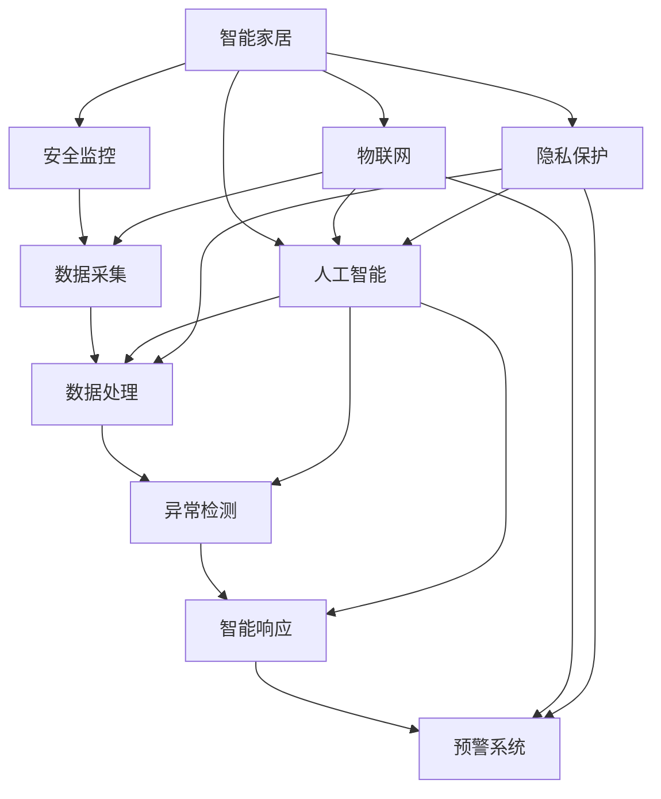

                 

# AI在智能家居安防中的应用:提高安全性

> 关键词：智能家居,安全监控,人工智能,机器学习,深度学习,物联网(IoT),隐私保护

## 1. 背景介绍

### 1.1 问题由来

随着科技的发展和生活水平的提高，智能家居逐渐成为现代家庭的重要组成部分。智能家居通过互联网技术将家居设备连接起来，实现智能化控制，极大地提升了生活的便利性和舒适性。然而，智能家居设备的广泛应用也带来了新的安全风险。黑客攻击、数据泄露、设备损坏等问题层出不穷，给用户的家庭生活带来了诸多不便甚至危险。

针对这一问题，人工智能（AI）技术在智能家居安防领域的应用，为提升家庭安全水平提供了新的解决路径。AI技术，尤其是深度学习和机器学习，可以在数据驱动下，从海量家庭安全数据中学习安全威胁的模式和特征，从而帮助实现家庭安全的智能化监控和防范。

### 1.2 问题核心关键点

智能家居安防的AI应用主要关注以下几个核心关键点：

1. **数据收集与处理**：智能家居设备可以实时采集家庭环境数据，如视频监控、门窗状态、烟雾探测等。如何将这些数据转化为可用于AI分析的格式，是实现家庭安防智能化监控的基础。

2. **异常检测与识别**：AI算法能够识别出家庭环境中的异常行为，如陌生人入侵、火灾、水浸等。如何高效准确地检测这些异常，并及时响应，是家庭安防的关键技术。

3. **智能响应与预警**：一旦检测到异常，AI系统需要能够自动触发安全设备（如警报、报警系统），并向用户发送预警信息。如何设计高效的响应策略，确保家庭安全得到及时保障，是智能家居安防的最终目标。

4. **隐私保护与数据安全**：智能家居设备收集的各类家庭数据涉及隐私保护问题。如何确保数据在传输、存储和处理过程中不被泄露或滥用，是AI技术在智能家居安防中必须考虑的重要因素。

5. **系统集成与交互**：智能家居安防系统需要与家庭其他智能设备（如智能音箱、智能门锁等）无缝集成，实现多设备协同工作。如何设计开放、灵活的系统架构，提高系统集成度，是智能家居安防的实际应用要求。

## 2. 核心概念与联系

### 2.1 核心概念概述

在讨论智能家居安防的AI应用时，涉及以下核心概念：

- **智能家居**：通过互联网技术将家居设备连接起来，实现智能化控制，提升生活便利性。
- **安全监控**：通过摄像头、传感器等设备，实时监控家庭环境，及时发现异常情况。
- **人工智能**：包括机器学习、深度学习等技术，通过数据驱动，实现自动化决策和智能推理。
- **机器学习**：通过对历史数据的学习，模型可以预测未来的行为，如异常检测、用户行为识别等。
- **深度学习**：利用神经网络模型，处理大规模、高维度的数据，实现复杂的模式识别和图像处理。
- **物联网(IoT)**：将各类智能设备通过互联网连接起来，实现数据共享和设备联动。
- **隐私保护**：确保家庭数据在采集、处理和传输过程中的安全性，避免数据泄露和滥用。

这些核心概念构成了智能家居安防AI应用的基础，各概念之间通过数据、算法、设备等环节相互联系，共同实现家庭安全的智能化监控和管理。

### 2.2 核心概念原理和架构的 Mermaid 流程图



这个流程图展示了智能家居安防AI应用的核心流程和架构：

1. 智能家居设备通过传感器采集家庭环境数据。
2. 数据经过预处理，输入到人工智能模型中进行异常检测和智能响应。
3. 异常检测结果触发预警系统，并通知用户。
4. 人工智能模型使用机器学习和深度学习技术，从历史数据中学习行为模式。
5. 物联网技术实现设备之间的互联互通，提升系统集成度。
6. 隐私保护措施确保数据安全，避免隐私泄露。

## 3. 核心算法原理 & 具体操作步骤

### 3.1 算法原理概述

智能家居安防的AI应用主要基于机器学习和深度学习技术，从海量的家庭安全数据中学习行为模式和异常特征。

具体而言，AI系统通过以下步骤实现家庭安全的智能化监控和防范：

1. **数据收集与处理**：智能家居设备实时采集家庭环境数据，如视频监控、门窗状态、烟雾探测等。
2. **特征提取与表示**：将收集到的数据转换为可用于AI分析的格式，如将视频数据转化为图像序列，门窗状态转化为开关状态。
3. **异常检测与识别**：通过机器学习或深度学习算法，学习异常行为的模式和特征，识别出潜在的安全威胁。
4. **智能响应与预警**：一旦检测到异常，系统自动触发安全设备（如警报、报警系统），并向用户发送预警信息。

### 3.2 算法步骤详解

#### 3.2.1 数据收集与处理

智能家居设备采集的数据包括但不限于：

- 视频监控数据：通过摄像头获取的视频帧，记录家庭环境的变化。
- 门窗状态数据：门窗开关状态、位置信息等。
- 烟雾探测数据：烟雾探测器检测到的烟雾浓度和位置。
- 温度湿度数据：室内外温度和湿度传感器记录的环境数据。
- 环境声学数据：环境噪声和声源信息。

数据处理包括预处理、特征提取和数据标准化等步骤，以便于后续的AI分析。

#### 3.2.2 特征提取与表示

特征提取是将原始数据转换为可用于AI分析的特征向量。常用的方法包括：

- **图像处理**：通过图像分割、边缘检测等技术，将视频帧转换为图像序列，提取关键特征点。
- **时间序列分析**：对门窗开关状态、烟雾探测数据等时间序列数据进行特征提取，如均值、方差、梯度等。
- **声音处理**：对环境声学数据进行频谱分析、语音识别等处理，提取音频特征。
- **深度学习特征提取**：使用预训练的深度学习模型（如CNN、RNN等），提取高层次的抽象特征。

#### 3.2.3 异常检测与识别

异常检测是识别家庭环境中的异常行为，如陌生人入侵、火灾、水浸等。常用的方法包括：

- **基于统计的方法**：通过计算数据的时序统计特征（如均值、方差、标准差等），判断数据的异常性。
- **基于机器学习的方法**：使用监督学习或无监督学习算法，训练异常检测模型，如SVM、K-means、Gaussian Mixture Model等。
- **基于深度学习的方法**：使用神经网络模型，如CNN、RNN、LSTM等，学习异常行为的模式和特征。

#### 3.2.4 智能响应与预警

一旦检测到异常，系统需要能够自动触发安全设备，并向用户发送预警信息。常用的方法包括：

- **本地处理与响应**：在本地设备上处理异常检测结果，直接触发警报、报警系统等。
- **云端处理与响应**：将异常检测结果上传到云端，由云服务器进行集中处理，触发远程警报或通知用户。
- **多模态协同响应**：结合视频监控、门窗状态等多种数据源，进行综合分析，设计更高效的响应策略。

### 3.3 算法优缺点

智能家居安防的AI应用主要具有以下优点：

- **高效实时**：通过AI技术，可以实现对家庭环境的实时监控和异常检测，快速响应安全威胁。
- **精准识别**：深度学习算法能够从海量数据中学习复杂的模式和特征，提高异常检测的准确性。
- **自适应性**：AI模型能够根据新的数据不断更新和优化，提高系统的适应性和鲁棒性。

但同时，该应用也存在一些缺点：

- **数据依赖**：AI模型的性能依赖于高质量、大规模的数据集，数据采集和处理的成本较高。
- **隐私风险**：智能家居设备收集的各类数据涉及隐私保护问题，需要严格的数据管理和隐私保护措施。
- **技术复杂性**：AI技术的应用需要较高的技术门槛，需要专业的知识和技能。
- **误报率**：尽管AI模型能够提高异常检测的准确性，但在复杂环境下仍可能出现误报，需要人为干预和人工审核。

### 3.4 算法应用领域

智能家居安防的AI应用已经覆盖了多个领域，包括：

- **视频监控**：通过智能摄像头，实现对家庭环境的实时监控，识别异常行为。
- **门窗监控**：监测门窗状态，防范非法入侵。
- **烟雾探测**：检测烟雾浓度，预防火灾。
- **环境监测**：监测室内外环境数据，保障家庭健康和安全。
- **智能报警**：结合多种数据源，自动触发报警系统，保障家庭安全。

## 4. 数学模型和公式 & 详细讲解 & 举例说明

### 4.1 数学模型构建

智能家居安防的AI应用主要涉及以下数学模型：

- **异常检测模型**：通过统计特征或机器学习模型，识别家庭环境中的异常行为。
- **响应决策模型**：根据异常检测结果，设计合理的响应策略，自动触发安全设备或通知用户。

### 4.2 公式推导过程

#### 4.2.1 异常检测模型

以基于深度学习的异常检测模型为例，可以使用如下的数学模型：

- **输入数据**：$x_t = (x_{t-1}, x_{t-2}, ..., x_{t-T})$，表示时间序列中前$T$个数据点。
- **输出数据**：$y_t$，表示当前时间点的异常检测结果（0表示正常，1表示异常）。
- **特征表示**：$f_t = \text{CNN}(x_t)$，使用卷积神经网络提取特征。
- **异常检测模型**：$y_t = \sigma(Wf_t + b)$，使用sigmoid函数进行二分类预测。

其中，$W$和$b$为模型的权重和偏置。

#### 4.2.2 响应决策模型

以基于规则的响应决策模型为例，可以使用如下的数学模型：

- **输入数据**：$y_t$，表示当前时间点的异常检测结果。
- **输出数据**：$z_t$，表示响应决策（0表示不响应，1表示触发警报、报警系统）。
- **响应规则**：$r(y_t)$，根据异常检测结果，设计响应规则。
- **响应决策模型**：$z_t = r(y_t)$，根据响应规则进行决策。

#### 4.2.3 案例分析与讲解

以视频监控为例，展示AI在智能家居安防中的应用：

- **数据收集**：智能摄像头实时采集视频帧数据。
- **特征提取**：使用卷积神经网络（CNN）对视频帧进行特征提取，得到关键特征点。
- **异常检测**：使用深度学习模型（如LSTM），对特征序列进行时间序列分析，学习异常行为的模式和特征。
- **智能响应**：根据异常检测结果，自动触发本地或云端的警报系统，向用户发送预警信息。

## 5. 项目实践：代码实例和详细解释说明

### 5.1 开发环境搭建

在智能家居安防AI应用的开发中，需要搭建如下的开发环境：

- **Python环境**：Python 3.x版本，推荐使用Anaconda或Miniconda。
- **深度学习框架**：TensorFlow或PyTorch，用于实现深度学习模型。
- **机器学习库**：Scikit-learn，用于实现统计学习和机器学习模型。
- **数据处理库**：Pandas、NumPy，用于数据预处理和分析。
- **物联网框架**：IoT Gateway，用于实现设备之间的互联互通。
- **安全系统库**：OpenCV、PyAudio，用于实现视频监控和音频处理。

### 5.2 源代码详细实现

以下是一个基于TensorFlow的异常检测模型的代码实现示例：

```python
import tensorflow as tf
from tensorflow.keras.layers import LSTM, Dense, Conv2D, MaxPooling2D
from tensorflow.keras.models import Sequential
from sklearn.model_selection import train_test_split

# 数据预处理
def preprocess_data(data):
    # 数据标准化
    data = (data - data.mean()) / data.std()
    # 数据分割
    train_data, test_data = train_test_split(data, test_size=0.2)
    return train_data, test_data

# 模型构建
def build_model(input_shape):
    model = Sequential()
    model.add(LSTM(64, input_shape=input_shape))
    model.add(Dense(32, activation='relu'))
    model.add(Dense(1, activation='sigmoid'))
    model.compile(optimizer='adam', loss='binary_crossentropy', metrics=['accuracy'])
    return model

# 数据加载与模型训练
def train_model(model, train_data, test_data):
    model.fit(train_data, epochs=10, batch_size=32, validation_data=test_data)

# 模型评估与预测
def evaluate_model(model, test_data):
    loss, accuracy = model.evaluate(test_data)
    print(f'Test loss: {loss}, Test accuracy: {accuracy}')

# 主函数
if __name__ == '__main__':
    # 加载数据
    data = load_data()
    train_data, test_data = preprocess_data(data)
    
    # 构建模型
    model = build_model(train_data.shape[1:])
    
    # 训练模型
    train_model(model, train_data, test_data)
    
    # 评估模型
    evaluate_model(model, test_data)
```

### 5.3 代码解读与分析

上述代码实现了基于LSTM的异常检测模型的训练和评估：

1. **数据预处理**：对原始数据进行标准化处理，并分割为训练集和测试集。
2. **模型构建**：使用LSTM层和全连接层构建异常检测模型，使用sigmoid函数进行二分类预测。
3. **模型训练**：使用训练集数据对模型进行训练，并使用验证集数据进行性能评估。
4. **模型评估**：在测试集上评估模型的性能，输出测试损失和准确率。

## 6. 实际应用场景

### 6.1 智能家居安全监控

智能家居安全监控是AI在智能家居安防中的主要应用场景之一。通过智能摄像头、门窗传感器等设备，实时监控家庭环境，及时发现异常行为。例如，当检测到陌生人入侵时，系统可以自动触发警报，并向用户发送预警信息。

### 6.2 火灾预防与预警

智能家居AI系统可以实时监测家庭环境中的烟雾浓度，预防火灾发生。当烟雾探测器检测到烟雾浓度异常时，系统可以自动触发报警系统，并向用户发送预警信息，同时自动关闭电源和门窗，防止火势蔓延。

### 6.3 水质检测与预警

智能家居AI系统可以监测家庭的水质状况，如水的酸碱度、硬度等。当水质异常时，系统可以自动提醒用户，并进行相应的水质处理。例如，当检测到水质硬度超标时，系统可以提醒用户更换水软化设备。

### 6.4 医疗监护

智能家居AI系统可以为老年人、慢性病患者提供实时健康监护。通过智能穿戴设备，系统可以监测用户的生命体征（如心率、血压等），及时发现异常情况，并通知用户或家属进行紧急处理。

### 6.5 智慧农业

智能家居AI系统可以应用于智慧农业，监测农田环境（如土壤湿度、气温等），实现精准农业。例如，当检测到土壤湿度不足时，系统可以自动调节灌溉系统，保障农作物的健康生长。

### 6.6 智能交通

智能家居AI系统可以应用于智能交通，监测道路交通状况，实现智能导航和预警。例如，当检测到交通拥堵时，系统可以自动调整路线，并提供实时交通状况信息。

## 7. 工具和资源推荐

### 7.1 学习资源推荐

为了帮助开发者系统掌握智能家居安防AI应用的技术基础和实践技巧，这里推荐一些优质的学习资源：

1. **《深度学习》书籍**：深度学习领域的经典教材，涵盖深度学习的基本原理和应用。
2. **《机器学习实战》书籍**：介绍了机器学习的基本算法和实现方法，适合初学者入门。
3. **《TensorFlow官方文档》**：TensorFlow的官方文档，提供了详细的API和样例代码，适合深度学习应用开发。
4. **《PyTorch官方文档》**：PyTorch的官方文档，提供了丰富的API和样例代码，适合深度学习应用开发。
5. **《OpenCV官方文档》**：OpenCV的官方文档，提供了计算机视觉相关的API和样例代码，适合视频监控应用开发。
6. **《IoT Gateway官方文档》**：IoT Gateway的官方文档，提供了物联网相关的API和样例代码，适合设备互联应用开发。

### 7.2 开发工具推荐

在智能家居安防AI应用的开发中，推荐使用以下开发工具：

- **TensorFlow**：用于实现深度学习模型，支持GPU加速，适合大规模数据训练。
- **PyTorch**：用于实现深度学习模型，支持动态图和静态图，适合灵活的数据处理和模型优化。
- **Scikit-learn**：用于实现统计学习算法，支持多种机器学习模型和数据预处理功能。
- **OpenCV**：用于实现视频监控和图像处理功能，支持GPU加速和多种图像处理算法。
- **IoT Gateway**：用于实现设备互联功能，支持多种通信协议和数据传输方式。
- **Jupyter Notebook**：用于数据处理和模型训练，支持Python和多种第三方库的集成。

### 7.3 相关论文推荐

智能家居安防AI应用涉及多个研究领域，以下是几篇代表性的相关论文，推荐阅读：

1. **《深度学习在视频监控中的应用》**：介绍深度学习在视频监控中的实际应用案例，如异常行为检测和目标跟踪。
2. **《基于机器学习的水质监测系统》**：介绍机器学习在水质监测中的应用，如水质参数预测和异常检测。
3. **《智能家居安防系统设计与实现》**：介绍智能家居安防系统的整体设计和实现方法，涵盖视频监控、门窗监控等多个应用场景。
4. **《基于物联网的智能农业系统》**：介绍物联网在智能农业中的应用，如环境监测和精准农业。
5. **《智能交通系统的设计与实现》**：介绍智能交通系统的整体设计和实现方法，涵盖交通状况监测和智能导航等功能。

## 8. 总结：未来发展趋势与挑战

### 8.1 总结

本文对AI在智能家居安防中的应用进行了全面系统的介绍。首先阐述了智能家居安防的AI应用背景和核心关键点，明确了AI技术在提升家庭安全水平中的重要作用。其次，从原理到实践，详细讲解了智能家居安防AI应用的数学模型和关键步骤，给出了智能家居安防的代码实现示例。同时，本文还广泛探讨了AI技术在智能家居安防中的实际应用场景，展示了AI技术在智能家居安防中的广阔前景。此外，本文精选了智能家居安防AI应用的学习资源，力求为读者提供全方位的技术指引。

通过本文的系统梳理，可以看到，AI技术在智能家居安防中的应用已经展现出巨大的潜力和广阔的发展前景。AI技术能够从海量家庭安全数据中学习行为模式和异常特征，实现家庭安全的智能化监控和防范，极大地提升了家庭生活的安全性和便利性。未来，伴随AI技术的不断进步，智能家居安防系统的智能化水平将进一步提升，为家庭安全带来更加全面的保障。

### 8.2 未来发展趋势

展望未来，智能家居安防的AI应用将呈现以下几个发展趋势：

1. **多模态融合**：未来的智能家居安防系统将结合视频监控、门窗状态、烟雾探测等多种数据源，实现多模态数据的融合，提升系统的准确性和鲁棒性。
2. **深度学习与强化学习的结合**：结合深度学习和强化学习，实现智能系统的自主学习和优化，提高系统的适应性和决策能力。
3. **边缘计算与云端协同**：将智能家居安防系统的部分计算任务从云端转移到边缘设备，减少数据传输延迟，提升系统响应速度。
4. **隐私保护与数据安全**：未来的智能家居安防系统将更加注重隐私保护和数据安全，采用加密技术、差分隐私等手段，确保家庭数据的安全性。
5. **人性化设计**：未来的智能家居安防系统将更加注重人性化设计，如自然语言交互、多设备协同等，提升用户体验。
6. **智能家居生态系统的构建**：未来的智能家居安防系统将更加注重与其他智能家居设备的集成，形成开放、灵活的智能家居生态系统。

以上趋势凸显了智能家居安防AI应用的发展方向，这些方向的探索发展，必将进一步提升智能家居系统的智能化水平，为家庭安全带来更加全面的保障。

### 8.3 面临的挑战

尽管AI在智能家居安防中的应用已经取得了显著进展，但在迈向更加智能化、普适化应用的过程中，仍面临诸多挑战：

1. **数据隐私和安全**：智能家居安防系统涉及大量的家庭数据，数据隐私和安全问题不容忽视。如何确保数据在采集、存储和传输过程中不被泄露或滥用，是智能家居安防系统必须解决的重大问题。
2. **计算资源消耗**：智能家居安防系统需要处理大量的实时数据，计算资源消耗较大。如何在保证系统性能的同时，优化资源利用，减少计算开销，是未来智能家居安防系统需要关注的重要问题。
3. **设备集成与兼容性**：智能家居安防系统需要与各类智能家居设备进行集成，设备兼容性问题时有发生。如何设计开放、灵活的系统架构，提高系统集成度，是智能家居安防系统的实际应用要求。
4. **模型性能优化**：智能家居安防系统需要高效准确的模型进行异常检测和智能响应。如何优化模型结构，提高模型的准确性和泛化能力，是未来智能家居安防系统需要关注的重要问题。
5. **用户接受度**：智能家居安防系统需要用户的主动参与和配合，如何提高用户对智能家居安防系统的接受度，是系统推广和应用的重要挑战。
6. **系统可靠性和稳定性**：智能家居安防系统需要稳定可靠的系统架构，避免因硬件故障或网络问题导致系统瘫痪。如何提高系统的可靠性和稳定性，是未来智能家居安防系统需要关注的重要问题。

### 8.4 研究展望

面对智能家居安防AI应用所面临的挑战，未来的研究需要在以下几个方面寻求新的突破：

1. **数据隐私保护技术**：开发高效的数据加密和差分隐私技术，确保家庭数据的安全性。
2. **边缘计算与数据融合技术**：开发高效的边缘计算技术，减少数据传输延迟，提升系统响应速度。
3. **智能系统优化算法**：开发高效的智能系统优化算法，提高模型的准确性和泛化能力。
4. **多设备协同技术**：开发高效的多设备协同技术，实现设备的无缝集成和高效协作。
5. **用户交互技术**：开发高效的用户交互技术，提高用户对智能家居安防系统的接受度。
6. **系统可靠性技术**：开发高效的系统可靠性技术，保障智能家居安防系统的稳定性和可靠性。

这些研究方向的探索，必将引领智能家居安防AI应用迈向更高的台阶，为家庭安全带来更加全面和可靠的保障。总之，智能家居安防AI应用需要从技术、应用和用户体验等多个维度进行全面的优化和改进，方能真正实现家庭安全的智能化监控和防范。

## 9. 附录：常见问题与解答

**Q1: 智能家居安防系统需要采集哪些数据？**

A: 智能家居安防系统需要采集以下数据：

- 视频监控数据：通过智能摄像头实时采集的视频帧数据。
- 门窗状态数据：门窗开关状态、位置信息等。
- 烟雾探测数据：烟雾探测器检测到的烟雾浓度和位置。
- 温度湿度数据：室内外温度和湿度传感器记录的环境数据。
- 环境声学数据：环境噪声和声源信息。

**Q2: 智能家居安防系统如何进行异常检测？**

A: 智能家居安防系统通过以下方式进行异常检测：

1. **统计方法**：通过计算数据的时序统计特征（如均值、方差、标准差等），判断数据的异常性。
2. **机器学习方法**：使用监督学习或无监督学习算法，训练异常检测模型，如SVM、K-means、Gaussian Mixture Model等。
3. **深度学习方法**：使用神经网络模型，如CNN、RNN、LSTM等，学习异常行为的模式和特征。

**Q3: 智能家居安防系统的安全性如何保障？**

A: 智能家居安防系统通过以下方式保障安全性：

1. **数据加密**：使用数据加密技术，确保数据在传输、存储和处理过程中的安全性。
2. **访问控制**：通过访问控制技术，限制系统访问权限，防止未授权访问。
3. **异常检测**：通过异常检测技术，及时发现异常行为，并进行相应的处理。
4. **用户认证**：通过用户认证技术，确保系统操作者的合法性和可信度。
5. **隐私保护**：采用隐私保护技术，如差分隐私、联邦学习等，确保用户隐私的安全性。

**Q4: 智能家居安防系统如何进行多设备协同？**

A: 智能家居安防系统通过以下方式进行多设备协同：

1. **边缘计算**：将部分计算任务从云端转移到边缘设备，减少数据传输延迟，提升系统响应速度。
2. **协议集成**：采用多种通信协议，实现设备之间的互联互通。
3. **云边协同**：结合云边计算技术，实现设备和云端的协同工作，提升系统性能和扩展性。

**Q5: 智能家居安防系统如何实现智能响应与预警？**

A: 智能家居安防系统通过以下方式实现智能响应与预警：

1. **本地处理**：在本地设备上处理异常检测结果，直接触发警报、报警系统等。
2. **云端处理**：将异常检测结果上传到云端，由云服务器进行集中处理，触发远程警报或通知用户。
3. **多模态协同**：结合视频监控、门窗状态等多种数据源，进行综合分析，设计更高效的响应策略。

以上常见问题的解答，希望对读者有所帮助，进一步理解智能家居安防AI应用的核心技术和实际应用。

---

作者：禅与计算机程序设计艺术 / Zen and the Art of Computer Programming

