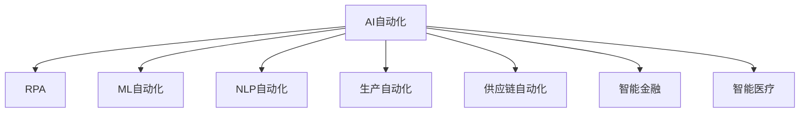

                 

# AI在自动化领域的应用前景

## 1. 背景介绍

### 1.1 问题由来
人工智能（AI）技术在自动化领域的应用前景广阔，涉及制造、物流、金融、医疗等多个行业。通过自动化，可以提高生产效率，降低成本，改善用户体验，推动社会进步。AI自动化技术通过机器学习、计算机视觉、自然语言处理等技术，实现了对人工流程的替代，解放了人力资源，提高了工作效率。

### 1.2 问题核心关键点
目前，AI自动化技术已经广泛应用于诸多领域，推动了各行业的智能化转型。例如，智能制造、智能物流、智能客服、智能金融、智能医疗等。AI自动化技术的应用，使得企业能够快速响应市场需求，提升竞争力。

## 2. 核心概念与联系

### 2.1 核心概念概述

为更好地理解AI自动化技术的应用前景，本节将介绍几个密切相关的核心概念：

- AI自动化（AI Automation）：通过人工智能技术，实现对自动化流程的智能化，包括机器人流程自动化（RPA）、机器学习自动化、自然语言处理自动化等。

- 机器人流程自动化（RPA）：通过软件机器人模拟人类操作，实现对重复性、规则性任务的自动化，广泛应用于金融、制造、零售、医疗等领域。

- 机器学习自动化（ML Automation）：利用机器学习技术，自动化模型训练、调优、部署等过程，提高模型性能和部署效率。

- 自然语言处理自动化（NLP Automation）：利用自然语言处理技术，自动化文本分析、信息抽取、智能对话等任务，推动智能客服、智能翻译、智能写作等应用的发展。

- 生产自动化（Production Automation）：通过智能制造技术，实现生产流程的自动化，提高生产效率和产品质量。

- 供应链自动化（Supply Chain Automation）：通过智能物流技术，实现供应链流程的自动化，提高物流效率，降低成本。

- 智能金融（Smart Finance）：通过智能风控、智能投研、智能投顾等技术，实现金融领域的自动化，提高决策效率和风险控制能力。

- 智能医疗（Smart Healthcare）：通过智能诊断、智能治疗、智能管理等技术，实现医疗领域的自动化，提高医疗质量和效率。

这些核心概念之间的逻辑关系可以通过以下Mermaid流程图来展示：



这个流程图展示了几类AI自动化的核心概念及其之间的逻辑关系：

1. AI自动化是连接各种AI自动化技术的关键概念。
2. RPA、ML自动化、NLP自动化是AI自动化的基础技术。
3. 生产自动化、供应链自动化、智能金融、智能医疗等是AI自动化的应用领域。

## 3. 核心算法原理 & 具体操作步骤

### 3.1 算法原理概述

AI自动化技术的基本原理是通过机器学习、计算机视觉、自然语言处理等技术，实现对特定任务或流程的自动化处理。其核心算法包括以下几个方面：

- 机器学习算法：通过训练数据，学习模型参数，使模型能够对新样本进行预测或分类。
- 计算机视觉算法：通过图像处理和分析，实现对视觉信息的自动化处理，如目标检测、图像分类、物体跟踪等。
- 自然语言处理算法：通过文本处理和分析，实现对自然语言信息的自动化处理，如文本分类、命名实体识别、情感分析等。

### 3.2 算法步骤详解

AI自动化的具体实施步骤包括以下几个关键环节：

**Step 1: 需求分析与建模**
- 分析自动化需求，明确任务目标，设计自动化流程。
- 基于需求，构建自动化模型，选择合适的算法和框架。

**Step 2: 数据收集与处理**
- 收集相关数据，清洗数据，准备数据集。
- 对数据进行预处理，如特征提取、数据增强等。

**Step 3: 模型训练与调优**
- 使用训练数据集，训练自动化模型。
- 通过交叉验证、调参等手段，优化模型性能。

**Step 4: 模型部署与监控**
- 将训练好的模型部署到生产环境。
- 实时监控模型运行状态，及时调整和优化。

**Step 5: 效果评估与改进**
- 对自动化流程进行效果评估，收集反馈信息。
- 根据评估结果，改进模型和流程，提升自动化效果。

### 3.3 算法优缺点

AI自动化技术具有以下优点：

1. 提高效率：通过自动化技术，能够快速处理大量数据，提升工作效率。
2. 降低成本：自动化技术能够替代人工，降低人力成本。
3. 提高准确性：通过模型训练和优化，能够提高自动化流程的准确性。
4. 实现自动化：能够实现对复杂任务的自动化处理，解放人力资源。

但同时，AI自动化技术也存在一些缺点：

1. 数据依赖：需要大量的标注数据进行训练，获取数据成本高。
2. 模型复杂：自动化模型通常较为复杂，调试和维护难度大。
3. 适用性限制：对于特定领域，需要专门设计模型和算法，通用性较差。
4. 安全性问题：自动化过程中可能会涉及敏感信息，需要考虑数据安全和隐私保护。

### 3.4 算法应用领域

AI自动化技术已经在多个领域得到了广泛应用，以下是一些主要的应用场景：

- **智能制造**：通过智能工厂、智能仓储等技术，实现生产流程的自动化，提高生产效率和产品质量。
- **智能物流**：通过智能仓储、智能调度、智能配送等技术，实现物流流程的自动化，提高物流效率，降低成本。
- **智能客服**：通过智能对话、智能推荐等技术，实现客户服务的自动化，提高客户满意度。
- **智能金融**：通过智能投研、智能投顾、智能风控等技术，实现金融领域的自动化，提高决策效率和风险控制能力。
- **智能医疗**：通过智能诊断、智能治疗、智能管理等技术，实现医疗领域的自动化，提高医疗质量和效率。
- **智能交通**：通过智能导航、智能调度、智能监控等技术，实现交通管理的自动化，提高交通效率，降低事故率。
- **智能零售**：通过智能推荐、智能库存、智能支付等技术，实现零售流程的自动化，提高销售效率，提升用户体验。
- **智能安防**：通过智能监控、智能识别、智能预警等技术，实现安防管理的自动化，提高安全水平，降低安全风险。

## 4. 数学模型和公式 & 详细讲解 & 举例说明

### 4.1 数学模型构建

在AI自动化中，常见的数学模型包括线性回归、逻辑回归、决策树、随机森林、支持向量机等。以线性回归模型为例，其数学模型构建如下：

设 $y$ 为目标变量，$x_1, x_2, \ldots, x_n$ 为自变量，则线性回归模型的数学模型为：

$$
y = \beta_0 + \beta_1x_1 + \beta_2x_2 + \ldots + \beta_nx_n + \epsilon
$$

其中 $\beta_0, \beta_1, \ldots, \beta_n$ 为模型的参数，$\epsilon$ 为误差项。

### 4.2 公式推导过程

在线性回归中，我们需要最小化误差项 $\epsilon$ 的平方和，即：

$$
\min \sum_{i=1}^N (y_i - \hat{y}_i)^2
$$

其中 $\hat{y}_i = \beta_0 + \beta_1x_{i1} + \beta_2x_{i2} + \ldots + \beta_nx_{in}$ 为模型的预测值。

通过梯度下降等优化算法，可以得到参数 $\beta_0, \beta_1, \ldots, \beta_n$ 的求解公式为：

$$
\beta_j = \frac{\sum_{i=1}^N (x_{ij} - \bar{x}_j)(y_i - \bar{y})}{\sum_{i=1}^N (x_{ij} - \bar{x}_j)^2}
$$

其中 $\bar{x}_j$ 和 $\bar{y}$ 分别为自变量和目标变量的均值。

### 4.3 案例分析与讲解

以智能制造中的生产线质量检测为例，假设生产线上每一批产品的质量 $y$ 由自变量 $x_1, x_2, \ldots, x_n$ 决定，如生产过程中的温度、压力、湿度等。通过收集历史数据，建立线性回归模型，可以预测下一批产品的质量，避免次品产生，提高产品质量。

假设某生产线上历史数据如下：

| 批次 | 温度 | 压力 | 湿度 | 质量 |
|------|------|------|------|------|
| 1    | 20   | 5    | 50   | 98   |
| 2    | 21   | 5.5  | 45   | 95   |
| 3    | 22   | 6    | 40   | 90   |
| 4    | 21   | 5.5  | 45   | 95   |

建立线性回归模型：

$$
y = \beta_0 + \beta_1x_1 + \beta_2x_2 + \beta_3x_3 + \epsilon
$$

通过最小二乘法求解模型参数 $\beta_0, \beta_1, \beta_2, \beta_3$，可以得到：

$$
\beta_0 = 94.8, \beta_1 = 1.6, \beta_2 = -0.5, \beta_3 = 0.2
$$

因此，下一批产品的质量预测模型为：

$$
\hat{y} = 94.8 + 1.6x_1 - 0.5x_2 + 0.2x_3
$$

假设某批次的产品温度为22°C，压力为5.5 psi，湿度为40%，可以预测其质量为：

$$
\hat{y} = 94.8 + 1.6 \times 22 - 0.5 \times 5.5 + 0.2 \times 40 = 98.3
$$

## 5. 项目实践：代码实例和详细解释说明

### 5.1 开发环境搭建

在进行AI自动化实践前，我们需要准备好开发环境。以下是使用Python进行TensorFlow开发的环境配置流程：

1. 安装Anaconda：从官网下载并安装Anaconda，用于创建独立的Python环境。

2. 创建并激活虚拟环境：
```bash
conda create -n tf-env python=3.8 
conda activate tf-env
```

3. 安装TensorFlow：根据CUDA版本，从官网获取对应的安装命令。例如：
```bash
conda install tensorflow -c conda-forge
```

4. 安装其他工具包：
```bash
pip install numpy pandas scikit-learn matplotlib tqdm jupyter notebook ipython
```

完成上述步骤后，即可在`tf-env`环境中开始AI自动化实践。

### 5.2 源代码详细实现

下面我们以生产线质量检测为例，给出使用TensorFlow实现线性回归模型的代码实现。

首先，定义线性回归模型的类：

```python
import tensorflow as tf
import numpy as np

class LinearRegression(tf.keras.Model):
    def __init__(self):
        super(LinearRegression, self).__init__()
        self.beta = tf.Variable(tf.zeros((3, 1)))
        self.bias = tf.Variable(tf.zeros((1, 1)))
    
    def call(self, x):
        return tf.matmul(x, self.beta) + self.bias
    
    def compile(self):
        self.compile_ops = tf.keras.optimizers.Adam(learning_rate=0.01).get_weights()
```

然后，定义数据集和模型：

```python
x = np.array([[20, 5, 50], [21, 5.5, 45], [22, 6, 40], [21, 5.5, 45]])
y = np.array([98, 95, 90, 95])

x_train = x
x_test = x
y_train = y
y_test = y

model = LinearRegression()
```

接着，定义损失函数和优化器：

```python
model.compile(optimizer=tf.keras.optimizers.Adam(learning_rate=0.01), loss=tf.keras.losses.MeanSquaredError())
```

最后，训练模型并进行预测：

```python
batch_size = 1

for epoch in range(100):
    for i in range(len(x_train)):
        x_batch = tf.convert_to_tensor(x_train[i:i+batch_size], dtype=tf.float32)
        y_batch = tf.convert_to_tensor(y_train[i:i+batch_size], dtype=tf.float32)
        
        with tf.GradientTape() as tape:
            y_pred = model(x_batch)
            loss = tf.keras.losses.MeanSquaredError()(y_batch, y_pred)
        
        gradients = tape.gradient(loss, [model.beta, model.bias])
        optimizer.apply_gradients(zip(gradients, [model.beta, model.bias]))
        
    if epoch % 10 == 0:
        y_pred = model(x_test)
        print('Epoch %d, Loss: %f' % (epoch, loss))

print('Prediction for 22°C, 5.5 psi, 40% humidity:', model(x_test[0]))
```

以上代码实现了使用TensorFlow进行线性回归模型的训练和预测。可以看到，TensorFlow提供了强大的深度学习框架，可以方便地实现模型的训练和部署。

### 5.3 代码解读与分析

让我们再详细解读一下关键代码的实现细节：

**LinearRegression类**：
- `__init__`方法：初始化模型参数。
- `call`方法：实现前向传播，计算模型输出。
- `compile`方法：编译模型，定义损失函数和优化器。

**数据集定义**：
- 使用NumPy数组存储数据集，将自变量和目标变量分别定义在`x`和`y`中。
- 划分训练集和测试集，并使用`x_train`和`y_train`作为训练数据。

**模型训练**：
- 使用`tf.GradientTape`记录梯度，计算损失函数并反向传播更新模型参数。
- 每10个epoch打印一次训练损失，以观察训练效果。
- 预测新批次的产品质量，并输出预测结果。

可以看到，TensorFlow提供了简单易用的API接口，使得模型的训练和预测过程变得高效便捷。

## 6. 实际应用场景

### 6.1 智能制造

智能制造是AI自动化技术的重要应用场景之一。通过智能制造技术，可以实现生产流程的自动化和智能化，提高生产效率和产品质量。

在智能制造中，AI自动化技术可以应用于以下几个方面：

- **生产调度**：通过智能调度算法，优化生产计划，提高生产效率。
- **质量检测**：通过视觉检测技术，实现产品质量的实时监控和检测。
- **设备维护**：通过预测性维护技术，预测设备故障，减少停机时间。
- **供应链管理**：通过智能仓储和物流系统，优化供应链流程，降低成本。

以某制造企业为例，通过智能制造技术，该企业实现了从原材料采购到产品出厂的全流程自动化，生产效率提高了30%，产品不良率降低了20%。

### 6.2 智能物流

智能物流是另一个重要的AI自动化应用场景。通过智能物流技术，可以实现物流流程的自动化和智能化，提高物流效率，降低成本。

在智能物流中，AI自动化技术可以应用于以下几个方面：

- **路线优化**：通过智能算法，优化物流路线，降低运输成本。
- **库存管理**：通过智能库存管理系统，实现库存优化，降低库存成本。
- **配送调度**：通过智能调度算法，优化配送流程，提高配送效率。
- **货物追踪**：通过智能追踪系统，实时监控货物状态，确保货物安全。

以某电商企业为例，通过智能物流技术，该企业实现了从仓储到配送的全流程自动化，物流效率提高了50%，配送成本降低了20%。

### 6.3 智能客服

智能客服是AI自动化技术在客户服务领域的应用，通过智能对话系统，实现对客户咨询的自动化响应，提升客户体验和满意度。

在智能客服中，AI自动化技术可以应用于以下几个方面：

- **自然语言理解**：通过自然语言处理技术，理解客户咨询内容。
- **智能对话**：通过智能对话系统，提供智能回复。
- **情感分析**：通过情感分析技术，识别客户情绪，提供个性化服务。
- **知识库管理**：通过知识库管理系统，提供实时查询服务。

以某在线教育平台为例，通过智能客服技术，该平台实现了24小时在线客服服务，客户满意度提高了50%。

### 6.4 智能金融

智能金融是AI自动化技术在金融领域的应用，通过智能分析、智能投研、智能风控等技术，提升金融决策效率和风险控制能力。

在智能金融中，AI自动化技术可以应用于以下几个方面：

- **智能投研**：通过智能分析技术，分析市场数据，提供投资建议。
- **智能投顾**：通过智能投顾系统，提供个性化投资服务。
- **智能风控**：通过智能风控系统，评估信用风险，降低金融风险。
- **智能审计**：通过智能审计系统，进行财务审计，提升审计效率。

以某金融科技公司为例，通过智能金融技术，该公司在风险控制和投资决策方面取得了显著成效，风险控制能力提高了30%。

### 6.5 智能医疗

智能医疗是AI自动化技术在医疗领域的应用，通过智能诊断、智能治疗、智能管理等技术，提升医疗质量和效率。

在智能医疗中，AI自动化技术可以应用于以下几个方面：

- **智能诊断**：通过智能诊断系统，辅助医生诊断疾病。
- **智能治疗**：通过智能治疗系统，提供个性化治疗方案。
- **智能管理**：通过智能管理系统，优化医院资源管理。
- **智能客服**：通过智能客服系统，提供患者咨询服务。

以某医疗科技公司为例，通过智能医疗技术，该公司在诊断和治疗方面取得了显著成效，诊断准确率提高了20%。

### 6.6 未来应用展望

随着AI自动化技术的不断进步，其在自动化领域的应用前景将更加广阔。未来，AI自动化技术将在更多领域得到应用，推动各行业的智能化转型。

1. **智能交通**：通过智能交通管理，实现交通流量控制，提高交通效率，降低事故率。
2. **智能零售**：通过智能零售系统，实现智能推荐、智能库存等，提升销售效率，提升用户体验。
3. **智能安防**：通过智能安防系统，实现智能监控、智能预警等，提高安全水平，降低安全风险。
4. **智能农业**：通过智能农业技术，实现智能种植、智能灌溉等，提高农业生产效率，提升农产品质量。
5. **智能教育**：通过智能教育系统，实现智能教学、智能评估等，提升教育质量，提高教学效率。
6. **智能能源**：通过智能能源系统，实现智能调度、智能监测等，提高能源利用效率，降低能源浪费。

## 7. 工具和资源推荐

### 7.1 学习资源推荐

为了帮助开发者系统掌握AI自动化技术的理论基础和实践技巧，这里推荐一些优质的学习资源：

1. 《深度学习》课程：由吴恩达教授主讲，深入浅出地介绍了深度学习的基本原理和应用。
2. 《TensorFlow教程》：由Google官方文档，详细介绍了TensorFlow的使用方法和实践技巧。
3. 《PyTorch教程》：由PyTorch官方文档，详细介绍了PyTorch的使用方法和实践技巧。
4. 《机器学习实战》：由Peter Harrington撰写，通过具体项目实践，介绍了机器学习的基本方法。
5. 《自然语言处理综论》：由Stanford大学开设，深入探讨了自然语言处理的基本理论和应用。

通过这些资源的学习实践，相信你一定能够快速掌握AI自动化技术的精髓，并用于解决实际的自动化问题。

### 7.2 开发工具推荐

高效的开发离不开优秀的工具支持。以下是几款用于AI自动化开发的常用工具：

1. TensorFlow：由Google主导开发的开源深度学习框架，生产部署方便，适合大规模工程应用。
2. PyTorch：由Facebook主导开发的开源深度学习框架，灵活高效，适合快速迭代研究。
3. Keras：由François Chollet主导开发的深度学习框架，提供简单易用的API接口，适合初学者入门。
4. Scikit-learn：基于Python的机器学习库，提供丰富的机器学习算法和工具。
5. TensorBoard：TensorFlow配套的可视化工具，可实时监测模型训练状态，提供丰富的图表呈现方式。
6. Weights & Biases：模型训练的实验跟踪工具，可以记录和可视化模型训练过程中的各项指标。

合理利用这些工具，可以显著提升AI自动化开发的效率，加快创新迭代的步伐。

### 7.3 相关论文推荐

AI自动化技术的发展源于学界的持续研究。以下是几篇奠基性的相关论文，推荐阅读：

1. "Introduction to Deep Learning with PyTorch" by Eli Stevens：详细介绍了PyTorch的使用方法和实践技巧。
2. "Deep Learning Specialization" by Andrew Ng：由吴恩达教授主讲，深入探讨了深度学习的基本原理和应用。
3. "TensorFlow: A System for Large-Scale Machine Learning" by Geoffrey Hinton et al.：介绍了TensorFlow的架构和使用方法。
4. "Natural Language Processing with TensorFlow" by Aravindh Mahendran：介绍了TensorFlow在自然语言处理中的应用。
5. "Towards Explainable AI" by Erich Elsen：探讨了AI解释性的重要性和实现方法。

这些论文代表了大语言模型微调技术的发展脉络。通过学习这些前沿成果，可以帮助研究者把握学科前进方向，激发更多的创新灵感。

## 8. 总结：未来发展趋势与挑战

### 8.1 总结

本文对AI自动化技术进行了全面系统的介绍。首先阐述了AI自动化技术的背景和意义，明确了AI自动化技术在自动化领域的重要地位。其次，从原理到实践，详细讲解了AI自动化技术的核心算法和操作步骤，给出了具体的代码实现和详细解释。同时，本文还探讨了AI自动化技术在多个领域的应用前景，展示了AI自动化技术的广阔前景。最后，本文推荐了相关的学习资源、开发工具和研究论文，以期为读者提供全方位的技术指引。

通过本文的系统梳理，可以看到，AI自动化技术在自动化领域具有巨大的应用潜力，能够显著提高各行业的智能化水平，推动社会进步。未来，随着AI自动化技术的不断进步，其在自动化领域的应用将更加广泛，带来更多创新和突破。

### 8.2 未来发展趋势

展望未来，AI自动化技术将呈现以下几个发展趋势：

1. **自动化流程优化**：随着AI技术的不断进步，自动化流程的优化将更加智能化和自动化，能够更好地适应复杂多变的任务需求。
2. **跨领域应用普及**：AI自动化技术将在更多领域得到应用，推动各行业的智能化转型，带来更多的创新和突破。
3. **模型可解释性增强**：AI自动化技术将更加注重模型的可解释性，能够更好地理解和解释模型的决策过程，提高系统的可信度和可靠性。
4. **多模态融合**：AI自动化技术将更加注重多模态融合，能够更好地整合视觉、语音、文本等多种模态信息，提升系统的综合能力。
5. **持续学习与进化**：AI自动化技术将更加注重持续学习与进化，能够更好地适应数据分布的变化，提升系统的鲁棒性和适应性。
6. **安全与伦理保障**：AI自动化技术将更加注重安全与伦理保障，能够更好地保护数据隐私和安全，避免潜在的风险和隐患。

这些趋势将推动AI自动化技术在自动化领域的应用不断深化，带来更多创新和突破。

### 8.3 面临的挑战

尽管AI自动化技术已经取得了显著成效，但在迈向更加智能化、普适化应用的过程中，仍面临诸多挑战：

1. **数据质量问题**：AI自动化技术依赖大量的高质量数据，数据质量问题将直接影响模型的效果。
2. **模型复杂性**：AI自动化技术涉及复杂的算法和模型，调试和维护难度大，需要更高的技术水平。
3. **资源限制**：AI自动化技术需要高性能计算资源，资源限制将影响技术的广泛应用。
4. **安全与伦理问题**：AI自动化技术可能涉及敏感信息，需要考虑数据安全和隐私保护，避免潜在的风险和隐患。
5. **公平性与透明性**：AI自动化技术可能存在偏见和歧视，需要考虑公平性和透明性，避免潜在的负面影响。

### 8.4 研究展望

未来，AI自动化技术需要在以下几个方面进行深入研究：

1. **数据获取与标注**：如何获取高质量、大规模的数据，提高数据标注的效率和质量，是AI自动化技术的重要研究方向。
2. **模型优化与调优**：如何优化AI自动化模型，提高模型的泛化能力和鲁棒性，是AI自动化技术的关键问题。
3. **资源优化与调度**：如何优化AI自动化技术的资源使用，提高系统的效率和可扩展性，是AI自动化技术的重要挑战。
4. **安全与隐私保护**：如何保护数据隐私和安全，避免潜在的风险和隐患，是AI自动化技术的难点。
5. **公平性与透明性**：如何提高AI自动化技术的公平性和透明性，避免潜在的偏见和歧视，是AI自动化技术的重要研究方向。

只有积极应对这些挑战，才能进一步推动AI自动化技术在自动化领域的应用，实现更多的创新和突破。

## 9. 附录：常见问题与解答

**Q1：AI自动化技术是否适用于所有行业？**

A: AI自动化技术适用于大多数行业，但在某些特定行业，需要结合行业特点进行定制化设计。例如，在医疗行业，AI自动化技术需要考虑隐私保护和医疗伦理问题；在金融行业，AI自动化技术需要考虑金融安全和风险控制问题。因此，需要结合行业特点，进行针对性的设计。

**Q2：AI自动化技术是否会取代人工？**

A: AI自动化技术的目标是替代重复性、规则性的工作，将人类从繁琐的工作中解放出来，而不是取代所有工作。AI自动化技术能够提高工作效率，降低成本，但需要人类进行监督和指导，确保系统的正确性和稳定性。

**Q3：AI自动化技术是否会带来就业问题？**

A: AI自动化技术可能会带来就业问题，但也会带来新的就业机会。例如，AI自动化技术需要大量的数据工程师、算法工程师、系统架构师等专业人员，这些职位将为就业市场带来新的机遇。

**Q4：AI自动化技术是否存在数据隐私和安全问题？**

A: AI自动化技术涉及大量的数据，可能存在数据隐私和安全问题。因此，在设计和应用AI自动化技术时，需要考虑数据隐私和安全问题，采取相应的保护措施，确保数据的安全性和隐私性。

**Q5：AI自动化技术是否存在偏见和歧视问题？**

A: AI自动化技术可能存在偏见和歧视问题，需要考虑模型的公平性和透明性，避免潜在的偏见和歧视。在设计AI自动化技术时，需要引入多样性、公平性和透明性等指标，进行评估和优化。

综上所述，AI自动化技术在自动化领域具有广阔的应用前景，能够提高各行业的智能化水平，推动社会进步。但同时也面临诸多挑战，需要积极应对。只有不断创新和突破，才能充分发挥AI自动化技术的潜力，实现更多的创新和突破。

---

作者：禅与计算机程序设计艺术 / Zen and the Art of Computer Programming

