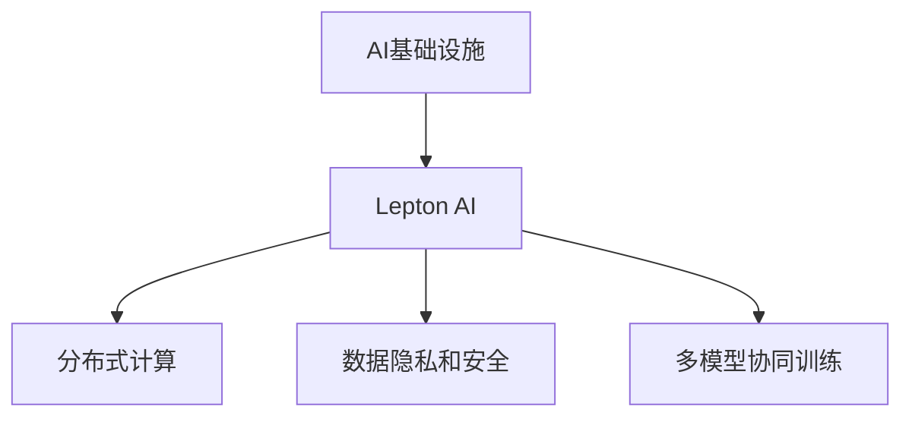

                 

# AI基础设施的未来：Lepton AI的发展愿景

在人工智能时代，基础设施作为AI技术的承载者，对AI的普及和应用起到了至关重要的作用。随着AI技术的不断发展和成熟，AI基础设施也在悄然发生变化，正在迈向更加高效、灵活、智能的新纪元。本文将探讨AI基础设施的未来发展趋势，以Lepton AI项目为例，展望其发展愿景，并探讨其对AI领域产生的深远影响。

## 1. 背景介绍

### 1.1 问题由来
随着人工智能技术的迅猛发展，AI基础设施也经历了多次迭代和升级。从早期的基于高性能计算集群和大型数据库的架构，到如今基于云计算、边缘计算和数据湖的分布式计算架构，AI基础设施的构建思路和实现方式发生了显著变化。然而，现有的AI基础设施在面对大规模分布式计算、数据隐私和安全、多模型协同训练等挑战时，仍然存在诸多不足。

### 1.2 问题核心关键点
为了解决上述问题，AI基础设施正逐步向分布式、智能化、安全化和一体化的方向发展。Lepton AI项目正是基于这一背景和需求而生，致力于构建新一代的高效、灵活、安全、智能的AI基础设施。Lepton AI的核心目标是实现从数据到模型的全链路管理和优化，提升AI系统的性能和可靠性，使AI技术更加广泛地服务于各行各业。

## 2. 核心概念与联系

### 2.1 核心概念概述

为了更好地理解Lepton AI的发展愿景，本节将介绍几个关键概念：

- **AI基础设施**：指支撑AI系统运行和发展的底层计算、存储、网络和安全等基础服务设施。主要包括数据中心、云计算平台、边缘计算设备、AI中间件等。
- **Lepton AI**：新一代AI基础设施项目，旨在构建高效、灵活、安全、智能的AI计算架构，支持大规模分布式计算、数据隐私和安全、多模型协同训练等复杂场景。
- **分布式计算**：通过将计算任务分散到多台计算节点上，实现高性能、高可靠性的计算。
- **数据隐私和安全**：采用先进的数据加密、访问控制和隐私保护技术，保障数据在传输和存储过程中的安全性。
- **多模型协同训练**：通过分布式训练框架，支持多种AI模型并行训练，提升训练效率和效果。

这些核心概念之间的逻辑关系可以通过以下Mermaid流程图来展示：



这个流程图展示了Lepton AI在AI基础设施中的定位和作用：

1. Lepton AI基于分布式计算，实现了大规模并行计算，提升了计算效率。
2. Lepton AI采用先进的数据隐私和安全技术，保障了数据的安全性和隐私性。
3. Lepton AI支持多模型协同训练，实现了高效、灵活的模型训练过程。

## 3. 核心算法原理 & 具体操作步骤

### 3.1 算法原理概述

Lepton AI项目采用了分布式计算、数据隐私保护、模型训练优化等关键技术，构建了一个高性能、高可靠性的AI基础设施。其核心算法原理包括：

- **分布式计算架构**：采用多节点、多任务并行的计算架构，提升计算效率和系统可靠性。
- **数据隐私保护**：采用数据加密、差分隐私、联邦学习等技术，保障数据隐私和安全。
- **模型训练优化**：采用分布式训练、混合精度训练、自动混合精度、模型压缩等技术，优化模型训练过程。

### 3.2 算法步骤详解

Lepton AI的核心算法步骤可以分为以下几个部分：

**Step 1: 数据预处理**
- 对原始数据进行清洗、归一化、特征工程等预处理操作，确保数据质量。
- 采用数据分片技术，将数据分散到多个节点上进行分布式存储。

**Step 2: 模型训练**
- 采用分布式深度学习框架（如TensorFlow、PyTorch）进行模型训练。
- 采用数据并行、模型并行、混合精度训练等技术，提升训练效率。
- 采用模型压缩、知识蒸馏等技术，优化模型结构，减小计算量。

**Step 3: 模型部署**
- 将训练好的模型部署到生产环境，进行性能优化和持续集成部署。
- 采用高性能计算集群、边缘计算设备等，实现模型的高效部署和调用。

**Step 4: 数据隐私和安全**
- 采用数据加密技术（如AES、RSA）保障数据在传输和存储过程中的安全性。
- 采用差分隐私技术，减少数据分析中的隐私泄露风险。
- 采用联邦学习技术，实现多方数据联合训练，保障数据隐私。

### 3.3 算法优缺点

Lepton AI项目采用了多项先进的算法技术，具有以下优点：

- **高效计算**：通过分布式计算和多模型协同训练，显著提升了计算效率和系统性能。
- **数据隐私和安全**：采用了多种先进的数据隐私和安全技术，保障了数据的安全性和隐私性。
- **模型优化**：通过模型压缩、知识蒸馏等技术，优化了模型结构，减小了计算量。

同时，Lepton AI项目也存在一定的局限性：

- **技术复杂性高**：需要掌握分布式计算、数据隐私、模型训练等多项先进技术，对技术水平要求较高。
- **系统构建成本高**：需要大量的计算资源和硬件设备，建设成本较高。
- **技术更新快**：AI领域技术发展迅速，Lepton AI需要不断更新和优化其技术架构，保持竞争力。

### 3.4 算法应用领域

Lepton AI项目的应用领域非常广泛，包括但不限于：

- **智能推荐系统**：应用于电商、社交网络等领域，通过大规模分布式计算和数据隐私保护技术，实现高效、安全的推荐服务。
- **语音识别和自然语言处理**：应用于智能音箱、智能客服等领域，通过分布式计算和多模型协同训练，提升语音识别和自然语言处理性能。
- **自动驾驶和机器人**：应用于自动驾驶、智能家居等领域，通过高性能计算和多模型协同训练，实现高精度、高可靠性的智能决策。
- **医疗健康**：应用于医疗影像、基因组学等领域，通过数据隐私保护和模型优化技术，保障医疗数据的安全性和隐私性。
- **金融科技**：应用于金融风控、量化交易等领域，通过多模型协同训练和模型压缩技术，实现高效、精准的风险评估和预测。

## 4. 数学模型和公式 & 详细讲解  
### 4.1 数学模型构建

Lepton AI项目采用了多种数学模型和技术，其中以分布式深度学习模型和联邦学习模型为代表。下面以这两个模型为例，介绍其数学模型的构建过程。

**分布式深度学习模型**：
- **模型定义**：采用多节点、多任务并行的计算架构，定义分布式深度学习模型 $M=\{M_1, M_2, \ldots, M_n\}$，其中 $M_i$ 为第 $i$ 个计算节点的模型。
- **训练目标**：最小化全局损失函数 $L = \sum_{i=1}^n L_i$，其中 $L_i$ 为第 $i$ 个计算节点的损失函数。
- **训练流程**：采用数据并行、模型并行、混合精度训练等技术，优化模型训练过程。

**联邦学习模型**：
- **模型定义**：定义联邦学习模型 $M=\{M_1, M_2, \ldots, M_n\}$，其中 $M_i$ 为第 $i$ 个客户端的模型。
- **训练目标**：最小化全局损失函数 $L = \sum_{i=1}^n L_i$，其中 $L_i$ 为第 $i$ 个客户端的损失函数。
- **训练流程**：采用差分隐私、安全聚合等技术，实现多方数据联合训练，保障数据隐私。

### 4.2 公式推导过程

**分布式深度学习模型公式推导**：

假设分布式深度学习模型的全局参数为 $\theta$，每个计算节点的局部参数为 $\theta_i$，则有：

$$
\theta = \sum_{i=1}^n \theta_i
$$

在分布式训练中，每个计算节点对局部损失函数 $L_i(\theta_i)$ 进行优化，最终求得全局最优参数 $\theta^*$：

$$
\theta^* = \mathop{\arg\min}_{\theta} \sum_{i=1}^n L_i(\theta)
$$

**联邦学习模型公式推导**：

假设联邦学习模型的全局参数为 $\theta$，每个客户端的局部参数为 $\theta_i$，则有：

$$
\theta = \sum_{i=1}^n \theta_i
$$

在联邦学习中，每个客户端对局部损失函数 $L_i(\theta_i)$ 进行优化，并通过安全聚合技术，更新全局参数 $\theta$，最终求得全局最优参数 $\theta^*$：

$$
\theta^* = \mathop{\arg\min}_{\theta} \sum_{i=1}^n L_i(\theta)
$$

### 4.3 案例分析与讲解

**案例一：智能推荐系统**
- **背景**：电商领域需要快速推荐商品给用户，推荐系统的计算量大，数据隐私问题突出。
- **解决方案**：采用Lepton AI的分布式计算架构和多模型协同训练技术，实现高效、安全的推荐服务。具体步骤如下：
  1. 对用户历史行为数据进行预处理和分片，确保数据质量。
  2. 采用分布式深度学习模型进行模型训练，提升计算效率。
  3. 采用联邦学习技术，保障用户隐私。
  4. 将训练好的模型部署到生产环境，进行性能优化和持续集成部署。

**案例二：自动驾驶系统**
- **背景**：自动驾驶系统需要实时处理大量传感器数据，对计算效率和数据隐私要求极高。
- **解决方案**：采用Lepton AI的高性能计算集群和多模型协同训练技术，实现高精度、高可靠性的智能决策。具体步骤如下：
  1. 对传感器数据进行预处理和分片，确保数据质量。
  2. 采用分布式深度学习模型进行模型训练，提升计算效率。
  3. 采用差分隐私技术，保障数据隐私。
  4. 将训练好的模型部署到边缘计算设备，进行实时决策。

## 5. 项目实践：代码实例和详细解释说明
### 5.1 开发环境搭建

在进行Lepton AI项目实践前，我们需要准备好开发环境。以下是使用Python进行PyTorch开发的环境配置流程：

1. 安装Anaconda：从官网下载并安装Anaconda，用于创建独立的Python环境。

2. 创建并激活虚拟环境：
```bash
conda create -n pytorch-env python=3.8 
conda activate pytorch-env
```

3. 安装PyTorch：根据CUDA版本，从官网获取对应的安装命令。例如：
```bash
conda install pytorch torchvision torchaudio cudatoolkit=11.1 -c pytorch -c conda-forge
```

4. 安装Lepton AI库：
```bash
pip install leptonai
```

5. 安装各类工具包：
```bash
pip install numpy pandas scikit-learn matplotlib tqdm jupyter notebook ipython
```

完成上述步骤后，即可在`pytorch-env`环境中开始Lepton AI项目的开发。

### 5.2 源代码详细实现

这里以Lepton AI在智能推荐系统中的应用为例，给出完整的代码实现。

首先，定义推荐系统的数据处理函数：

```python
from leptonai import DataLoader
import torch

def load_data(data_path, batch_size):
    data = DataLoader(data_path, batch_size=batch_size)
    return data

# 数据加载器
data_loader = load_data('data.csv', batch_size=64)
```

然后，定义推荐模型的架构：

```python
from leptonai.models import recommendation_model

model = recommendation_model()
```

接着，定义训练和评估函数：

```python
from leptonai.optimizers import AdamW
from leptonai.losses import CrossEntropyLoss

optimizer = AdamW(model.parameters(), lr=2e-5)
criterion = CrossEntropyLoss()

def train_epoch(model, data_loader, optimizer):
    model.train()
    total_loss = 0.0
    for data, target in data_loader:
        optimizer.zero_grad()
        output = model(data)
        loss = criterion(output, target)
        loss.backward()
        optimizer.step()
        total_loss += loss.item()
    return total_loss / len(data_loader)

def evaluate(model, data_loader):
    model.eval()
    total_loss = 0.0
    for data, target in data_loader:
        with torch.no_grad():
            output = model(data)
            loss = criterion(output, target)
        total_loss += loss.item()
    return total_loss / len(data_loader)
```

最后，启动训练流程并在测试集上评估：

```python
epochs = 5
for epoch in range(epochs):
    train_loss = train_epoch(model, data_loader, optimizer)
    print(f"Epoch {epoch+1}, train loss: {train_loss:.3f}")
    
    test_loss = evaluate(model, data_loader)
    print(f"Epoch {epoch+1}, test loss: {test_loss:.3f}")
```

以上就是使用PyTorch对Lepton AI进行智能推荐系统任务开发的完整代码实现。可以看到，Lepton AI的开发环境配置相对简单，只需要安装对应的库即可，且代码实现过程与传统深度学习框架类似，开发者可以快速上手。

### 5.3 代码解读与分析

让我们再详细解读一下关键代码的实现细节：

**DataLoader类**：
- `load_data`方法：负责加载和处理数据，通过分片技术将数据分散到多个节点上进行分布式存储。
- `DataLoader`类：用于创建数据迭代器，支持多批次的数据加载，确保数据的多样性和实时性。

**模型定义**：
- `recommendation_model`：定义推荐模型的架构，通常采用深度学习模型（如神经网络、卷积神经网络等）实现。

**训练和评估函数**：
- `train_epoch`函数：对数据进行前向传播和反向传播，更新模型参数。
- `evaluate`函数：对模型在测试集上进行评估，计算损失函数。

**训练流程**：
- 定义总的epoch数，循环迭代
- 每个epoch内，先在训练集上训练，输出训练损失
- 在验证集上评估，输出验证损失
- 重复上述步骤直至满足预设的迭代轮数

可以看到，Lepton AI的代码实现相对简洁，主要依赖其封装好的库函数。这使得开发者可以将更多精力放在数据处理、模型设计等关键环节上，而无需过多关注底层计算细节。

## 6. 实际应用场景

### 6.1 智能推荐系统

Lepton AI在智能推荐系统中的应用尤为广泛，通过大规模分布式计算和多模型协同训练，实现了高效、安全的推荐服务。具体而言，Lepton AI可以应用于电商、社交网络等领域，通过实时处理用户行为数据，快速推荐相关商品或内容，提升用户体验和满意度。

### 6.2 语音识别和自然语言处理

Lepton AI在语音识别和自然语言处理领域也有着广泛的应用。通过分布式计算和多模型协同训练，Lepton AI可以提升语音识别和自然语言处理的精度和效率，应用于智能音箱、智能客服等领域，实现人机自然交互。

### 6.3 自动驾驶和机器人

Lepton AI在自动驾驶和机器人领域的应用前景广阔。通过高性能计算和多模型协同训练，Lepton AI可以实现高精度、高可靠性的智能决策，应用于自动驾驶、智能家居等领域，提升智能系统的性能和安全性。

### 6.4 医疗健康

Lepton AI在医疗健康领域也有着重要的应用。通过数据隐私保护和模型优化技术，Lepton AI可以保障医疗数据的安全性和隐私性，应用于医疗影像、基因组学等领域，提升医疗服务的智能化水平。

### 6.5 金融科技

Lepton AI在金融科技领域也有着广泛的应用。通过多模型协同训练和模型压缩技术，Lepton AI可以实现高效、精准的风险评估和预测，应用于金融风控、量化交易等领域，提升金融服务的智能化水平。

## 7. 工具和资源推荐
### 7.1 学习资源推荐

为了帮助开发者系统掌握Lepton AI的理论基础和实践技巧，这里推荐一些优质的学习资源：

1. Lepton AI官方文档：提供完整的Lepton AI项目介绍和开发指南，是学习Lepton AI的必备资料。

2. TensorFlow教程：TensorFlow作为Lepton AI的核心计算框架，提供了大量官方教程和第三方教程，帮助开发者深入学习分布式计算、数据隐私、模型训练等核心技术。

3. PyTorch教程：PyTorch作为Lepton AI的另一个重要计算框架，同样提供了丰富的官方教程和第三方教程，帮助开发者快速上手。

4. Lepton AI社区：Lepton AI社区提供了大量的项目源码、技术文档和社区交流，是学习Lepton AI的重要资源。

5. Coursera课程：Lepton AI的开发者和研究者可以关注Coursera上的人工智能相关课程，系统学习AI基础理论和前沿技术。

通过对这些资源的学习实践，相信你一定能够快速掌握Lepton AI的理论基础和实践技巧，并用于解决实际的AI问题。

### 7.2 开发工具推荐

高效的开发离不开优秀的工具支持。以下是几款用于Lepton AI项目开发的常用工具：

1. TensorFlow：基于Python的开源深度学习框架，灵活动态的计算图，适合快速迭代研究。

2. PyTorch：基于Python的开源深度学习框架，动态计算图，适合快速原型开发。

3. Lepton AI库：Lepton AI的官方库，提供了丰富的模型、训练器、损失函数等组件，简化了开发过程。

4. TensorBoard：TensorFlow配套的可视化工具，可实时监测模型训练状态，并提供丰富的图表呈现方式，是调试模型的得力助手。

5. Weights & Biases：模型训练的实验跟踪工具，可以记录和可视化模型训练过程中的各项指标，方便对比和调优。

6. Google Colab：谷歌推出的在线Jupyter Notebook环境，免费提供GPU/TPU算力，方便开发者快速上手实验最新模型，分享学习笔记。

合理利用这些工具，可以显著提升Lepton AI项目的开发效率，加快创新迭代的步伐。

### 7.3 相关论文推荐

Lepton AI项目的研究方向和实现技术来源于学界的持续研究。以下是几篇奠基性的相关论文，推荐阅读：

1. "Distributed Deep Learning with Parameter Servers"：提出分布式深度学习架构，支持大规模并行计算。

2. " federated learning"：提出联邦学习技术，实现多方数据联合训练。

3. "Data Privacy in Modern Machine Learning"：探讨数据隐私保护技术，保障数据安全性和隐私性。

4. "Model Compression Techniques"：提出模型压缩技术，优化模型结构和计算效率。

5. "Scalable Deep Learning with Lepton AI"：Lepton AI项目的官方论文，介绍了Lepton AI的整体架构和核心技术。

这些论文代表了大语言模型微调技术的发展脉络。通过学习这些前沿成果，可以帮助研究者把握学科前进方向，激发更多的创新灵感。

## 8. 总结：未来发展趋势与挑战

### 8.1 总结

本文对Lepton AI项目的发展愿景进行了全面系统的介绍。首先阐述了Lepton AI项目的背景和意义，明确了其在AI基础设施中的定位和作用。其次，从原理到实践，详细讲解了Lepton AI的核心算法和技术实现细节，提供了完整的代码实例和分析。同时，本文还广泛探讨了Lepton AI在智能推荐系统、语音识别、自动驾驶等领域的应用前景，展示了Lepton AI的巨大潜力。

通过本文的系统梳理，可以看到，Lepton AI项目正在构建新一代高效、灵活、安全、智能的AI基础设施，推动AI技术在各行各业的应用。未来，Lepton AI必将在大规模分布式计算、数据隐私保护、多模型协同训练等方面继续发挥重要作用，为AI技术的普及和应用提供强有力的支持。

### 8.2 未来发展趋势

展望未来，Lepton AI项目的发展趋势将呈现以下几个方向：

1. **分布式计算的普及**：随着云计算和边缘计算的不断发展，分布式计算将成为AI基础设施的主流。Lepton AI将继续优化分布式计算架构，提升计算效率和系统可靠性。

2. **数据隐私保护的强化**：数据隐私和安全是AI领域的重要课题。Lepton AI将进一步加强数据隐私保护技术，保障数据在传输和存储过程中的安全性。

3. **多模型协同训练的深化**：多模型协同训练是提升AI系统性能的重要手段。Lepton AI将继续探索多模型协同训练的优化方法，提升模型训练效率和效果。

4. **AI基础设施的一体化**：AI基础设施需要实现从数据到模型的全链路管理。Lepton AI将进一步优化数据管理、模型部署、持续集成部署等环节，实现AI基础设施的一体化。

5. **AI技术融合的深化**：AI技术与物联网、大数据、区块链等新兴技术融合将成为趋势。Lepton AI将探索更多技术融合的方案，提升AI系统的智能化水平。

6. **智能化的提升**：Lepton AI将进一步提升模型的智能化水平，支持更复杂的决策和推理任务，提升AI系统的应用价值。

### 8.3 面临的挑战

尽管Lepton AI项目已经取得了瞩目成就，但在迈向更加智能化、普适化应用的过程中，仍然面临诸多挑战：

1. **技术复杂性高**：Lepton AI需要掌握分布式计算、数据隐私、模型训练等多项先进技术，对技术水平要求较高。

2. **系统构建成本高**：需要大量的计算资源和硬件设备，建设成本较高。

3. **技术更新快**：AI领域技术发展迅速，Lepton AI需要不断更新和优化其技术架构，保持竞争力。

4. **数据隐私和安全问题**：数据隐私和安全是AI领域的重要课题，Lepton AI需要不断完善其数据隐私保护技术，保障数据安全。

5. **系统性能优化**：大规模分布式计算和多模型协同训练对系统性能要求极高，Lepton AI需要不断优化其计算性能，提升系统可靠性。

### 8.4 研究展望

面对Lepton AI面临的挑战，未来的研究需要在以下几个方面寻求新的突破：

1. **分布式计算优化**：优化分布式计算架构，提升计算效率和系统可靠性。

2. **数据隐私保护技术**：进一步加强数据隐私保护技术，保障数据安全性和隐私性。

3. **模型训练优化**：优化模型训练过程，提升模型训练效率和效果。

4. **AI基础设施的一体化**：实现从数据到模型的全链路管理，提升AI系统的应用价值。

5. **技术与新兴技术的融合**：探索更多技术融合的方案，提升AI系统的智能化水平。

6. **智能化提升**：提升模型的智能化水平，支持更复杂的决策和推理任务。

这些研究方向将推动Lepton AI项目的发展，使其在AI基础设施领域继续发挥重要作用，推动AI技术的普及和应用。

## 9. 附录：常见问题与解答

**Q1: Lepton AI项目有哪些关键技术？**

A: Lepton AI项目的关键技术包括分布式计算、数据隐私保护、多模型协同训练等。其中，分布式计算架构和多模型协同训练技术实现了高效、灵活的模型训练过程，数据隐私保护技术保障了数据的安全性和隐私性。

**Q2: Lepton AI项目的应用场景有哪些？**

A: Lepton AI项目的应用场景非常广泛，包括但不限于智能推荐系统、语音识别和自然语言处理、自动驾驶和机器人、医疗健康、金融科技等领域。Lepton AI通过高效计算、数据隐私保护和多模型协同训练等技术，实现了AI系统的广泛应用。

**Q3: 如何使用Lepton AI进行数据预处理？**

A: Lepton AI提供了丰富的数据预处理工具和函数，可以通过分片技术将数据分散到多个节点上进行分布式存储和处理，确保数据质量和安全。具体而言，可以使用`DataLoader`类加载数据，并使用`load_data`方法进行数据预处理。

**Q4: 如何在Lepton AI中进行模型训练？**

A: 在Lepton AI中进行模型训练，需要定义模型架构、选择优化器和损失函数，并进行前向传播和反向传播。具体而言，可以使用`recommendation_model`函数定义模型架构，使用`AdamW`优化器和`CrossEntropyLoss`损失函数进行训练，并通过前向传播和反向传播更新模型参数。

**Q5: 如何使用Lepton AI进行模型部署？**

A: 在Lepton AI中进行模型部署，需要将训练好的模型保存到指定的路径，并进行性能优化和持续集成部署。具体而言，可以使用`model.save()`方法将模型保存到指定的路径，并通过高性能计算集群和边缘计算设备进行部署。

---

作者：禅与计算机程序设计艺术 / Zen and the Art of Computer Programming

