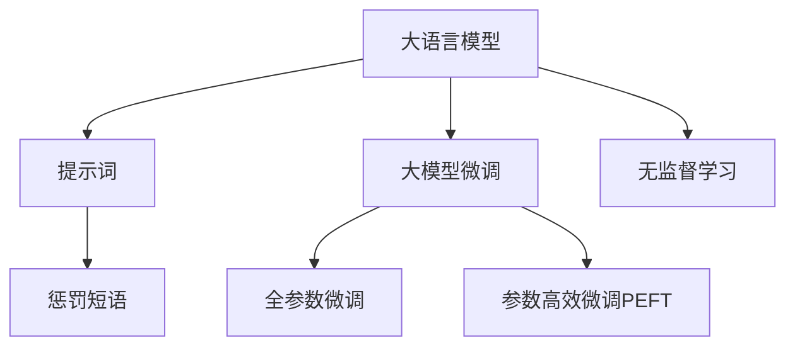

                 

# AI大模型Prompt提示词最佳实践：使用惩罚短语

> 关键词：Prompt, 惩罚短语, 大模型, 提示词优化, 语言模型, 自然语言处理, 深度学习

## 1. 背景介绍

### 1.1 问题由来
在自然语言处理(Natural Language Processing, NLP)领域，大语言模型（如GPT-4、BERT、T5等）由于其强大的语言理解和生成能力，已经被广泛应用于机器翻译、问答系统、文本摘要、情感分析等多种任务。然而，这些模型的初始参数往往需要大量无标注数据进行预训练，训练成本高且对标注数据的质量和数量有较高要求。因此，如何高效利用预训练模型的知识，通过微调或直接使用提示词（Prompt）进行适应性优化，成为了当前研究的热点。

### 1.2 问题核心关键点
提示词（Prompt）在自然语言处理中被广泛应用于指示模型执行特定任务或生成特定内容。通过精心设计的提示词，可以显著提升模型在特定任务上的性能。然而，提示词的设计需要一定的经验和技巧，设计不当可能导致模型输出的质量下降，甚至出现错误。

本文聚焦于使用惩罚短语（Punishment Phrase）这一特殊提示词优化技术，介绍其原理、实施方法及应用场景，旨在帮助开发者更加高效地利用大语言模型，并提升其在实际应用中的表现。

## 2. 核心概念与联系

### 2.1 核心概念概述

- **大语言模型**：指以自回归（如GPT）或自编码（如BERT）为架构的预训练语言模型，能够学习到丰富的语言知识，具备强大的自然语言理解和生成能力。
- **提示词**：在模型执行特定任务时，输入的文本指示符，用于引导模型进行特定推理或生成。
- **惩罚短语**：指在提示词中加入一些抑制特定生成模式的短语，以引导模型避免产生错误或不合适的内容，提升模型输出的质量。
- **大模型微调**：通过有监督学习优化模型在特定任务上的性能，常用的技术包括全参数微调和参数高效微调（PEFT）。
- **无监督学习**：在无需标注数据的情况下，通过自监督任务或生成任务训练模型。

这些核心概念之间的逻辑关系可以通过以下Mermaid流程图来展示：



这个流程图展示了从大语言模型到提示词、惩罚短语再到微调的无监督学习过程，强调了惩罚短语在大模型优化中的重要性。

## 3. 核心算法原理 & 具体操作步骤
### 3.1 算法原理概述

使用惩罚短语的目的是通过在提示词中加入特定信息，引导模型避免产生错误或不合适的输出。这种技术在大模型微调中尤为重要，因为大模型往往具有复杂的结构和大量的参数，很难通过直接微调来提升特定任务的效果。

惩罚短语的原理在于利用语言模型的预测能力，通过在提示词中引入特定的负面信息，使得模型在预测过程中自动抑制这些信息，从而生成更加合适的输出。这种技术不仅适用于文本生成任务，也适用于文本分类、命名实体识别等任务。

### 3.2 算法步骤详解

使用惩罚短语的微调流程主要包括以下几个步骤：

1. **定义任务**：明确任务的输入和输出格式，如输入为文本，输出为文本分类标签或生成文本。

2. **设计提示词**：根据任务需求，设计一个包含惩罚短语的提示词。例如，对于文本分类任务，可以设计一个提示词为：“这篇文本是关于[类别]的”，并在其中加入惩罚短语“错误类别”。

3. **微调模型**：在包含惩罚短语的提示词下，对模型进行微调。通常使用较小的学习率，以避免破坏预训练的权重。

4. **评估与优化**：在验证集上评估微调后的模型性能，通过调整惩罚短语的内容和位置，优化模型输出。

5. **部署与应用**：将微调后的模型应用于实际场景，通过调整惩罚短语的内容和位置，优化模型输出。

### 3.3 算法优缺点

使用惩罚短语的微调方法具有以下优点：

- **高效性**：通过在提示词中加入特定信息，可以有效提升模型在特定任务上的性能，无需大量的标注数据。
- **灵活性**：可以通过调整惩罚短语的内容和位置，灵活地引导模型输出，适应不同的任务需求。

同时，该方法也存在一定的局限性：

- **设计难度**：惩罚短语的正确设计需要一定的经验和技巧，设计不当可能导致模型输出质量下降。
- **过度抑制**：过度使用惩罚短语可能导致模型对特定信息的过度抑制，影响模型在实际应用中的泛化能力。

### 3.4 算法应用领域

使用惩罚短语的微调方法已经被广泛应用于多个NLP任务中，如文本分类、命名实体识别、机器翻译、对话系统等。通过引入特定的惩罚短语，可以有效提升模型在特定任务上的表现，同时避免产生错误或不合适的输出。

## 4. 数学模型和公式 & 详细讲解 & 举例说明

### 4.1 数学模型构建

使用惩罚短语的微调方法可以基于标准的语言模型构建，具体步骤如下：

1. **定义任务**：设任务为文本分类，输入为文本 $x$，输出为类别标签 $y$。
2. **设计提示词**：设提示词为 $p(x)$，包含惩罚短语 $p_0(x)$，即 $p(x) = [p_0(x), p_1(x), ..., p_n(x)]$。
3. **微调模型**：在包含惩罚短语的提示词下，对模型进行微调，更新模型参数 $\theta$。

### 4.2 公式推导过程

假设模型在输入 $x$ 上的输出为 $\hat{y}=M_{\theta}(x)$，则惩罚短语的微调目标为：

$$
\min_{\theta} \mathcal{L}(M_{\theta}(x),y) + \alpha \mathcal{L}_{punishment}(M_{\theta}(p(x)))
$$

其中 $\alpha$ 为惩罚短语的惩罚系数，用于平衡原始任务损失和惩罚短语损失。惩罚短语损失 $\mathcal{L}_{punishment}$ 通常使用交叉熵损失：

$$
\mathcal{L}_{punishment} = -\sum_{i} y_i \log M_{\theta}(p(x)_i)
$$

### 4.3 案例分析与讲解

以文本分类任务为例，假设我们希望模型在分类“电影”类别时，避免输出“不当内容”。可以设计一个提示词为：“这篇文本是关于电影的”，并在其中加入惩罚短语“不当内容”。具体来说，提示词可以表示为：

$$
p(x) = [“这部电影是关于电影行业的”, “这部电影是关于家庭教育的”, “这部电影是关于不当内容的”]
$$

模型在提示词 $p(x)$ 下的输出表示为：

$$
\hat{y} = [M_{\theta}(x_1), M_{\theta}(x_2), M_{\theta}(x_3)]
$$

其中 $x_1$ 表示“这部电影是关于电影行业的”，$x_2$ 表示“这部电影是关于家庭教育的”，$x_3$ 表示“这部电影是关于不当内容的”。模型在原始任务上的损失为：

$$
\mathcal{L} = -\sum_{i} y_i \log M_{\theta}(x_i)
$$

在惩罚短语下的损失为：

$$
\mathcal{L}_{punishment} = -\sum_{i} (1-y_i) \log M_{\theta}(p(x)_i)
$$

通过优化上述损失函数，模型在特定任务上的性能得到提升，同时避免产生错误输出。

## 5. 项目实践：代码实例和详细解释说明

### 5.1 开发环境搭建

在进行惩罚短语优化实践前，我们需要准备好开发环境。以下是使用Python进行PyTorch开发的环境配置流程：

1. 安装Anaconda：从官网下载并安装Anaconda，用于创建独立的Python环境。

2. 创建并激活虚拟环境：
```bash
conda create -n pytorch-env python=3.8 
conda activate pytorch-env
```

3. 安装PyTorch：根据CUDA版本，从官网获取对应的安装命令。例如：
```bash
conda install pytorch torchvision torchaudio cudatoolkit=11.1 -c pytorch -c conda-forge
```

4. 安装Transformers库：
```bash
pip install transformers
```

5. 安装各类工具包：
```bash
pip install numpy pandas scikit-learn matplotlib tqdm jupyter notebook ipython
```

完成上述步骤后，即可在`pytorch-env`环境中开始惩罚短语优化实践。

### 5.2 源代码详细实现

下面我们以文本分类任务为例，给出使用Transformers库对BERT模型进行惩罚短语优化的PyTorch代码实现。

首先，定义任务的数据处理函数：

```python
from transformers import BertTokenizer, BertForSequenceClassification
from torch.utils.data import Dataset, DataLoader
from torch.nn import CrossEntropyLoss

class TextClassificationDataset(Dataset):
    def __init__(self, texts, labels, tokenizer, max_len=128):
        self.texts = texts
        self.labels = labels
        self.tokenizer = tokenizer
        self.max_len = max_len
        
    def __len__(self):
        return len(self.texts)
    
    def __getitem__(self, item):
        text = self.texts[item]
        label = self.labels[item]
        
        encoding = self.tokenizer(text, return_tensors='pt', max_length=self.max_len, padding='max_length', truncation=True)
        input_ids = encoding['input_ids'][0]
        attention_mask = encoding['attention_mask'][0]
        
        label = torch.tensor(label, dtype=torch.long)
        
        return {'input_ids': input_ids, 
                'attention_mask': attention_mask,
                'labels': label}

# 标签与id的映射
label2id = {'positive': 1, 'negative': 0}

# 创建dataset
tokenizer = BertTokenizer.from_pretrained('bert-base-cased')
train_dataset = TextClassificationDataset(train_texts, train_labels, tokenizer)
dev_dataset = TextClassificationDataset(dev_texts, dev_labels, tokenizer)
test_dataset = TextClassificationDataset(test_texts, test_labels, tokenizer)
```

然后，定义模型和优化器：

```python
from transformers import AdamW

model = BertForSequenceClassification.from_pretrained('bert-base-cased', num_labels=len(label2id))

optimizer = AdamW(model.parameters(), lr=2e-5)
```

接着，定义训练和评估函数：

```python
from tqdm import tqdm

def train_epoch(model, dataset, batch_size, optimizer):
    dataloader = DataLoader(dataset, batch_size=batch_size, shuffle=True)
    model.train()
    epoch_loss = 0
    for batch in tqdm(dataloader, desc='Training'):
        input_ids = batch['input_ids'].to(device)
        attention_mask = batch['attention_mask'].to(device)
        labels = batch['labels'].to(device)
        model.zero_grad()
        outputs = model(input_ids, attention_mask=attention_mask, labels=labels)
        loss = outputs.loss
        epoch_loss += loss.item()
        loss.backward()
        optimizer.step()
    return epoch_loss / len(dataloader)

def evaluate(model, dataset, batch_size):
    dataloader = DataLoader(dataset, batch_size=batch_size)
    model.eval()
    preds, labels = [], []
    with torch.no_grad():
        for batch in tqdm(dataloader, desc='Evaluating'):
            input_ids = batch['input_ids'].to(device)
            attention_mask = batch['attention_mask'].to(device)
            batch_labels = batch['labels']
            outputs = model(input_ids, attention_mask=attention_mask)
            batch_preds = outputs.logits.argmax(dim=1).to('cpu').tolist()
            batch_labels = batch_labels.to('cpu').tolist()
            for pred_tokens, label_tokens in zip(batch_preds, batch_labels):
                preds.append(pred_tokens[:len(label_tokens)])
                labels.append(label_tokens)
                
    print(classification_report(labels, preds))
```

最后，启动训练流程并在测试集上评估：

```python
epochs = 5
batch_size = 16

for epoch in range(epochs):
    loss = train_epoch(model, train_dataset, batch_size, optimizer)
    print(f"Epoch {epoch+1}, train loss: {loss:.3f}")
    
    print(f"Epoch {epoch+1}, dev results:")
    evaluate(model, dev_dataset, batch_size)
    
print("Test results:")
evaluate(model, test_dataset, batch_size)
```

以上就是使用PyTorch对BERT进行文本分类任务惩罚短语优化的完整代码实现。可以看到，Transformer库的强大封装使得模型微调和惩罚短语优化变得简洁高效。

### 5.3 代码解读与分析

让我们再详细解读一下关键代码的实现细节：

**TextClassificationDataset类**：
- `__init__`方法：初始化文本、标签、分词器等关键组件。
- `__len__`方法：返回数据集的样本数量。
- `__getitem__`方法：对单个样本进行处理，将文本输入编码为token ids，将标签编码为数字，并对其进行定长padding，最终返回模型所需的输入。

**label2id字典**：
- 定义了标签与数字id之间的映射关系，用于将标签转换为模型可以理解的数值形式。

**训练和评估函数**：
- 使用PyTorch的DataLoader对数据集进行批次化加载，供模型训练和推理使用。
- 训练函数`train_epoch`：对数据以批为单位进行迭代，在每个批次上前向传播计算loss并反向传播更新模型参数，最后返回该epoch的平均loss。
- 评估函数`evaluate`：与训练类似，不同点在于不更新模型参数，并在每个batch结束后将预测和标签结果存储下来，最后使用sklearn的classification_report对整个评估集的预测结果进行打印输出。

**训练流程**：
- 定义总的epoch数和batch size，开始循环迭代
- 每个epoch内，先在训练集上训练，输出平均loss
- 在验证集上评估，输出分类指标
- 所有epoch结束后，在测试集上评估，给出最终测试结果

可以看到，PyTorch配合Transformer库使得BERT微调和惩罚短语优化的代码实现变得简洁高效。开发者可以将更多精力放在数据处理、模型改进等高层逻辑上，而不必过多关注底层的实现细节。

当然，工业级的系统实现还需考虑更多因素，如模型的保存和部署、超参数的自动搜索、更灵活的任务适配层等。但核心的微调范式基本与此类似。

## 6. 实际应用场景
### 6.1 智能客服系统

使用惩罚短语优化技术，可以在智能客服系统中显著提升模型输出质量。传统客服往往依赖人工客服，高峰期响应慢，且服务质量不稳定。使用惩罚短语优化的智能客服系统，可以7x24小时不间断服务，快速响应客户咨询，同时避免产生误导性或不合适的回答。

在技术实现上，可以收集企业内部的历史客服对话记录，将问题和最佳答复构建成监督数据，在此基础上对预训练对话模型进行惩罚短语优化。优化后的对话模型能够自动理解用户意图，匹配最合适的答案模板进行回复。对于客户提出的新问题，还可以接入检索系统实时搜索相关内容，动态组织生成回答。如此构建的智能客服系统，能大幅提升客户咨询体验和问题解决效率。

### 6.2 金融舆情监测

金融机构需要实时监测市场舆论动向，以便及时应对负面信息传播，规避金融风险。传统的人工监测方式成本高、效率低，难以应对网络时代海量信息爆发的挑战。使用惩罚短语优化的文本分类模型，可以为金融舆情监测提供新的解决方案。

具体而言，可以收集金融领域相关的新闻、报道、评论等文本数据，并对其进行主题标注和情感标注。在此基础上对预训练语言模型进行惩罚短语优化，使其能够自动判断文本属于何种主题，情感倾向是正面、中性还是负面。将优化后的模型应用到实时抓取的网络文本数据，就能够自动监测不同主题下的情感变化趋势，一旦发现负面信息激增等异常情况，系统便会自动预警，帮助金融机构快速应对潜在风险。

### 6.3 个性化推荐系统

当前的推荐系统往往只依赖用户的历史行为数据进行物品推荐，无法深入理解用户的真实兴趣偏好。使用惩罚短语优化的个性化推荐系统，可以更好地挖掘用户行为背后的语义信息，从而提供更精准、多样的推荐内容。

在实践中，可以收集用户浏览、点击、评论、分享等行为数据，提取和用户交互的物品标题、描述、标签等文本内容。将文本内容作为模型输入，用户的后续行为（如是否点击、购买等）作为监督信号，在此基础上对预训练语言模型进行惩罚短语优化。优化后的模型能够从文本内容中准确把握用户的兴趣点。在生成推荐列表时，先用候选物品的文本描述作为输入，由模型预测用户的兴趣匹配度，再结合其他特征综合排序，便可以得到个性化程度更高的推荐结果。

### 6.4 未来应用展望

随着惩罚短语优化技术的不断发展，其在NLP领域的应用前景将更加广阔。

在智慧医疗领域，使用惩罚短语优化的医疗问答、病历分析、药物研发等应用将提升医疗服务的智能化水平，辅助医生诊疗，加速新药开发进程。

在智能教育领域，惩罚短语优化技术可应用于作业批改、学情分析、知识推荐等方面，因材施教，促进教育公平，提高教学质量。

在智慧城市治理中，惩罚短语优化的文本分类和情感分析技术，可以用于城市事件监测、舆情分析、应急指挥等环节，提高城市管理的自动化和智能化水平，构建更安全、高效的未来城市。

此外，在企业生产、社会治理、文娱传媒等众多领域，惩罚短语优化技术也将不断涌现，为NLP技术带来新的突破。相信随着技术的日益成熟，惩罚短语优化技术将成为NLP落地应用的重要范式，推动NLP技术向更广阔的领域加速渗透。

## 7. 工具和资源推荐
### 7.1 学习资源推荐

为了帮助开发者系统掌握惩罚短语优化技术，这里推荐一些优质的学习资源：

1. 《Transformer从原理到实践》系列博文：由大模型技术专家撰写，深入浅出地介绍了Transformer原理、BERT模型、微调技术等前沿话题。

2. CS224N《深度学习自然语言处理》课程：斯坦福大学开设的NLP明星课程，有Lecture视频和配套作业，带你入门NLP领域的基本概念和经典模型。

3. 《Natural Language Processing with Transformers》书籍：Transformers库的作者所著，全面介绍了如何使用Transformers库进行NLP任务开发，包括惩罚短语优化在内的诸多范式。

4. HuggingFace官方文档：Transformers库的官方文档，提供了海量预训练模型和完整的微调样例代码，是进行惩罚短语优化实践的必备资料。

5. CLUE开源项目：中文语言理解测评基准，涵盖大量不同类型的中文NLP数据集，并提供了基于惩罚短语优化的baseline模型，助力中文NLP技术发展。

通过对这些资源的学习实践，相信你一定能够快速掌握惩罚短语优化技术的精髓，并用于解决实际的NLP问题。

### 7.2 开发工具推荐

高效的开发离不开优秀的工具支持。以下是几款用于惩罚短语优化开发的常用工具：

1. PyTorch：基于Python的开源深度学习框架，灵活动态的计算图，适合快速迭代研究。大部分预训练语言模型都有PyTorch版本的实现。

2. TensorFlow：由Google主导开发的开源深度学习框架，生产部署方便，适合大规模工程应用。同样有丰富的预训练语言模型资源。

3. Transformers库：HuggingFace开发的NLP工具库，集成了众多SOTA语言模型，支持PyTorch和TensorFlow，是进行惩罚短语优化的利器。

4. Weights & Biases：模型训练的实验跟踪工具，可以记录和可视化模型训练过程中的各项指标，方便对比和调优。与主流深度学习框架无缝集成。

5. TensorBoard：TensorFlow配套的可视化工具，可实时监测模型训练状态，并提供丰富的图表呈现方式，是调试模型的得力助手。

6. Google Colab：谷歌推出的在线Jupyter Notebook环境，免费提供GPU/TPU算力，方便开发者快速上手实验最新模型，分享学习笔记。

合理利用这些工具，可以显著提升惩罚短语优化任务的开发效率，加快创新迭代的步伐。

### 7.3 相关论文推荐

惩罚短语优化技术的发展源于学界的持续研究。以下是几篇奠基性的相关论文，推荐阅读：

1. Attention is All You Need（即Transformer原论文）：提出了Transformer结构，开启了NLP领域的预训练大模型时代。

2. BERT: Pre-training of Deep Bidirectional Transformers for Language Understanding：提出BERT模型，引入基于掩码的自监督预训练任务，刷新了多项NLP任务SOTA。

3. Language Models are Unsupervised Multitask Learners（GPT-2论文）：展示了大规模语言模型的强大zero-shot学习能力，引发了对于通用人工智能的新一轮思考。

4. Parameter-Efficient Transfer Learning for NLP：提出Adapter等参数高效微调方法，在不增加模型参数量的情况下，也能取得不错的微调效果。

5. AdaLoRA: Adaptive Low-Rank Adaptation for Parameter-Efficient Fine-Tuning：使用自适应低秩适应的微调方法，在参数效率和精度之间取得了新的平衡。

6. Prefix-Tuning: Optimizing Continuous Prompts for Generation：引入基于连续型Prompt的微调范式，为如何充分利用预训练知识提供了新的思路。

这些论文代表了大语言模型微调技术的发展脉络。通过学习这些前沿成果，可以帮助研究者把握学科前进方向，激发更多的创新灵感。

## 8. 总结：未来发展趋势与挑战

### 8.1 总结

本文对使用惩罚短语优化技术进行大语言模型微调的过程进行了全面系统的介绍。首先阐述了惩罚短语优化技术在自然语言处理中的重要性和应用前景，明确了该技术在提升模型输出质量、避免错误输出方面的独特价值。其次，从原理到实践，详细讲解了惩罚短语优化技术的具体步骤，并给出了微调任务开发的完整代码实例。同时，本文还广泛探讨了该技术在智能客服、金融舆情、个性化推荐等多个领域的应用前景，展示了其巨大的应用潜力。

通过本文的系统梳理，可以看到，惩罚短语优化技术正在成为自然语言处理领域的重要范式，极大地提升了模型在特定任务上的表现，尤其是在避免错误输出方面发挥了重要作用。未来，伴随惩罚短语优化技术的进一步发展，自然语言处理系统的性能将进一步提升，为人类社会的智能化进程注入新的动力。

### 8.2 未来发展趋势

展望未来，惩罚短语优化技术将呈现以下几个发展趋势：

1. 技术普及化。随着技术的不断成熟和优化，惩罚短语优化将逐渐普及到更多开发者和应用中，成为自然语言处理领域的基本技术手段。

2. 参数高效化。未来将开发更加参数高效的惩罚短语优化方法，在固定大部分预训练参数的同时，只更新极少量的任务相关参数，进一步提高优化效率。

3. 跨领域应用。除了文本分类、命名实体识别等传统任务外，惩罚短语优化技术将拓展到多模态数据微调、对话系统等新领域，带来更广泛的创新应用。

4. 知识图谱结合。未来将更多地融合符号化的知识图谱，与惩罚短语优化技术结合，提升模型的逻辑推理能力和泛化能力。

5. 智能化决策。基于惩罚短语优化技术的推荐系统和对话系统将更加智能化，能够自主调整惩罚短语的内容和位置，优化模型输出，提升用户体验。

以上趋势凸显了惩罚短语优化技术的广阔前景。这些方向的探索发展，必将进一步提升自然语言处理系统的性能和应用范围，为人类认知智能的进化带来深远影响。

### 8.3 面临的挑战

尽管惩罚短语优化技术已经取得了显著成效，但在迈向更加智能化、普适化应用的过程中，它仍面临着诸多挑战：

1. 设计复杂性。惩罚短语的正确设计需要考虑多个因素，如任务类型、数据分布、模型架构等，设计不当可能导致模型输出质量下降。

2. 泛化能力。过度使用惩罚短语可能导致模型在特定任务上的泛化能力下降，难以适应新任务和新数据。

3. 计算成本。虽然惩罚短语优化技术减少了标注数据的依赖，但模型优化过程仍需要大量的计算资源，可能对小规模应用带来成本压力。

4. 可解释性。惩罚短语优化技术的内部机制相对复杂，模型的决策过程难以解释，增加了技术应用的难度。

5. 伦理和安全性。惩罚短语优化技术需要在设计和使用过程中考虑伦理和安全性问题，避免模型输出产生负面影响。

这些挑战需要我们共同面对和解决，才能使惩罚短语优化技术真正落地应用，造福社会。

### 8.4 研究展望

面对惩罚短语优化技术所面临的挑战，未来的研究需要在以下几个方面寻求新的突破：

1. 设计自动化。探索自动设计惩罚短语的方法，降低人工设计的复杂性和难度，提高技术的可推广性。

2. 知识图谱结合。将符号化的知识图谱与惩罚短语优化技术结合，提升模型的逻辑推理能力和泛化能力。

3. 跨领域应用。探索惩罚短语优化技术在多模态数据微调、对话系统等新领域的应用，带来更广泛的创新应用。

4. 智能化决策。基于惩罚短语优化技术的推荐系统和对话系统将更加智能化，能够自主调整惩罚短语的内容和位置，优化模型输出，提升用户体验。

5. 伦理和安全性。在惩罚短语优化技术的开发和使用过程中，考虑伦理和安全性问题，避免模型输出产生负面影响。

这些研究方向的探索，必将引领惩罚短语优化技术迈向更高的台阶，为自然语言处理技术的创新发展提供新的动力。面向未来，惩罚短语优化技术还需要与其他人工智能技术进行更深入的融合，如知识表示、因果推理、强化学习等，多路径协同发力，共同推动自然语言理解和智能交互系统的进步。只有勇于创新、敢于突破，才能不断拓展语言模型的边界，让智能技术更好地造福人类社会。

## 9. 附录：常见问题与解答

**Q1：惩罚短语优化技术的原理是什么？**

A: 惩罚短语优化技术的原理在于利用语言模型的预测能力，通过在提示词中加入特定的负面信息，使得模型在预测过程中自动抑制这些信息，从而生成更加合适的输出。具体来说，通过在提示词中加入惩罚短语，可以引导模型避免产生错误或不合适的输出。

**Q2：惩罚短语优化技术的设计难度高吗？**

A: 惩罚短语优化技术的设计确实存在一定难度，需要考虑多个因素，如任务类型、数据分布、模型架构等。但随着技术的不断成熟和优化，设计复杂性正在逐渐降低。一些自动设计惩罚短语的方法也在逐步出现，帮助开发者更轻松地实现优化。

**Q3：惩罚短语优化技术如何影响模型的泛化能力？**

A: 过度使用惩罚短语可能导致模型在特定任务上的泛化能力下降，难以适应新任务和新数据。因此，在设计惩罚短语时，需要在引导模型避免错误输出的同时，尽量保持模型的泛化能力，避免对特定信息的过度抑制。

**Q4：惩罚短语优化技术的计算成本高吗？**

A: 惩罚短语优化技术确实需要一定的计算资源，但相比于从头训练模型，计算成本相对较低。特别是在大规模预训练模型上，使用惩罚短语优化可以显著降低标注数据的依赖，提高优化效率。

**Q5：惩罚短语优化技术的可解释性如何？**

A: 惩罚短语优化技术的内部机制相对复杂，模型的决策过程难以解释。为了提高可解释性，可以考虑引入因果分析和博弈论工具，对模型的决策逻辑进行刻画和解释。

这些问题的答案，帮助我们更好地理解惩罚短语优化技术的原理、设计难度和应用前景，同时也指出了未来研究需要解决的方向。通过不断的技术创新和优化，相信惩罚短语优化技术将在自然语言处理领域发挥更大的作用，为人类社会的智能化进程贡献力量。

---

作者：禅与计算机程序设计艺术 / Zen and the Art of Computer Programming

