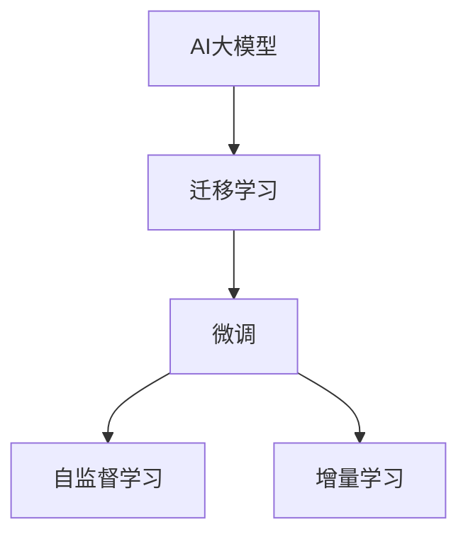

                 

# AI大模型创业：如何实现未来盈利？

## 1. 背景介绍

在AI大模型如火如荼发展的当下，许多创业者渴望通过大模型创业实现盈利。然而，大模型技术落地应用并非易事，创业者需充分理解其核心价值和商业模式，才能确保未来成功盈利。本文将系统介绍AI大模型的核心概念与架构，探讨其实现盈利的方法和策略。

## 2. 核心概念与联系

### 2.1 核心概念概述

为了帮助读者更好地理解大模型，本节首先介绍相关核心概念及其联系。

- **AI大模型**：指基于深度学习框架训练的大型模型，如BERT、GPT-3等，具有处理大规模文本、图像、语音等多模态数据的能力。
- **迁移学习**：指将一个领域学到的知识迁移到另一个领域，通过微调等方法提升新任务的表现。
- **微调**：在大模型的基础上，使用少量标注数据进行有监督学习，调整模型参数以适应特定任务。
- **自监督学习**：利用无标签数据训练模型，自动生成监督信号，如掩码语言模型、自回归模型等。
- **增量学习**：指模型在原有知识的基础上，持续学习新的任务，保持模型知识和性能的提升。

这些概念之间通过如下Mermaid流程图建立联系：



这个流程图清晰地展示了AI大模型如何通过迁移学习和微调等方法，在自监督学习的基础上实现增量学习，逐步提升模型性能。

### 2.2 核心概念原理和架构的 Mermaid 流程图


该流程图简要描述了AI大模型的训练流程，从数据预处理到增量学习的全过程。

## 3. 核心算法原理 & 具体操作步骤

### 3.1 算法原理概述

AI大模型的核心算法原理基于深度学习和神经网络。以BERT为例，其基本架构由Transformer网络组成，包括自注意力机制、前馈神经网络等。BERT通过预训练和微调，能够在各种NLP任务上取得优异表现。

### 3.2 算法步骤详解

1. **数据准备**：收集和清洗大量文本数据，如维基百科、新闻文章等，作为预训练数据。
2. **模型预训练**：使用自监督学习方法（如掩码语言模型、下一句预测等）在预训练数据上训练大模型，学习到通用的语言表示。
3. **任务微调**：根据具体任务需求，设计相应的输出层和损失函数，使用少量标注数据对模型进行微调，使其适应特定任务。
4. **增量学习**：在实际应用过程中，持续收集新的数据，使用增量学习方法不断提升模型性能。

### 3.3 算法优缺点

**优点**：
- **处理能力强**：大模型能够处理大规模文本数据，适用于复杂语义理解任务。
- **泛化能力强**：通过迁移学习，大模型能够快速适应新任务，提升任务性能。
- **模型压缩能力强**：增量学习方法使得大模型可以持续学习和优化，保持高性能。

**缺点**：
- **训练成本高**：大模型训练需要大量计算资源和数据。
- **部署成本高**：大模型需要高性能硬件支持，部署成本较高。
- **过拟合风险**：在微调和增量学习过程中，可能出现过拟合现象，需要精心设计学习策略。

### 3.4 算法应用领域

AI大模型在多个领域都有广泛应用，包括：

- **自然语言处理**：文本分类、情感分析、机器翻译、问答系统等。
- **计算机视觉**：图像分类、目标检测、图像生成等。
- **语音识别**：语音转文本、语音情感识别等。
- **医疗健康**：疾病诊断、健康咨询、医疗影像分析等。
- **金融服务**：信用评估、风险管理、市场分析等。

## 4. 数学模型和公式 & 详细讲解 & 举例说明

### 4.1 数学模型构建

以BERT为例，其预训练模型由Transformer网络组成，通过掩码语言模型和下一句预测任务进行训练。

### 4.2 公式推导过程

以掩码语言模型为例，公式推导如下：

$$
\mathcal{L} = -\frac{1}{N}\sum_{i=1}^N \sum_{j=1}^M \log\left(\frac{e^{z_{ij}}}{\sum_{k=1}^V e^{z_{ik}}}\right)
$$

其中 $z_{ij}$ 表示模型对第 $j$ 个位置的预测概率，$V$ 为词汇表大小。

### 4.3 案例分析与讲解

以BERT在情感分析任务中的应用为例。首先将数据集中的句子进行预处理，然后使用BERT进行编码，最后设计交叉熵损失函数进行微调。

## 5. 项目实践：代码实例和详细解释说明

### 5.1 开发环境搭建

1. 安装Python 3.8。
2. 安装PyTorch、TensorFlow等深度学习框架。
3. 下载预训练模型和训练数据。
4. 搭建训练环境。

### 5.2 源代码详细实现

以下是一个基于BERT进行情感分析任务的Python代码实现：

```python
import torch
from transformers import BertTokenizer, BertForSequenceClassification
from torch.utils.data import DataLoader
from sklearn.metrics import accuracy_score

# 准备数据集
tokenizer = BertTokenizer.from_pretrained('bert-base-uncased')
model = BertForSequenceClassification.from_pretrained('bert-base-uncased', num_labels=2)
train_dataset = ...
test_dataset = ...

# 定义模型参数
optimizer = torch.optim.Adam(model.parameters(), lr=2e-5)
loss_fn = torch.nn.CrossEntropyLoss()

# 训练模型
for epoch in range(epochs):
    for batch in DataLoader(train_dataset, batch_size=32):
        inputs = tokenizer(batch.text, padding=True, truncation=True, return_tensors='pt')
        outputs = model(**inputs)
        loss = loss_fn(outputs.logits, batch.label)
        optimizer.zero_grad()
        loss.backward()
        optimizer.step()

# 评估模型
for batch in DataLoader(test_dataset, batch_size=32):
    inputs = tokenizer(batch.text, padding=True, truncation=True, return_tensors='pt')
    outputs = model(**inputs)
    predictions = torch.argmax(outputs.logits, dim=1)
    accuracy = accuracy_score(batch.label, predictions)
    print('Accuracy:', accuracy)
```

### 5.3 代码解读与分析

这段代码首先下载并加载预训练的BERT模型和分词器，然后定义了训练和评估函数。在训练过程中，使用Adam优化器进行参数更新，通过交叉熵损失函数进行训练。在评估阶段，计算准确率来评估模型性能。

### 5.4 运行结果展示

模型训练完成后，我们可以在测试集上进行评估，得到模型在不同数据集上的准确率。

## 6. 实际应用场景

### 6.1 医疗健康

AI大模型在医疗领域有广泛应用，如疾病诊断、健康咨询等。通过微调，可以提升模型的诊断准确率，帮助医生做出更准确的诊断。

### 6.2 金融服务

在金融领域，AI大模型可以用于信用评估、风险管理等。通过微调，可以提升模型的预测准确率，帮助金融机构更好地管理风险。

### 6.3 智能制造

在智能制造领域，AI大模型可以用于设备故障预测、生产过程优化等。通过微调，可以提升模型的预测准确率，帮助企业提高生产效率。

### 6.4 未来应用展望

未来，AI大模型将应用于更多领域，如智能城市、智能交通等。通过增量学习，AI大模型可以不断提升性能，服务于更广泛的用户群体。

## 7. 工具和资源推荐

### 7.1 学习资源推荐

1. 《深度学习》课程。
2. 《自然语言处理综述》。
3. 《TensorFlow实战》。

### 7.2 开发工具推荐

1. PyTorch。
2. TensorFlow。
3. Jupyter Notebook。

### 7.3 相关论文推荐

1. "Attention is All You Need"。
2. "BERT: Pre-training of Deep Bidirectional Transformers for Language Understanding"。
3. "Deep Residual Learning for Image Recognition"。

## 8. 总结：未来发展趋势与挑战

### 8.1 研究成果总结

AI大模型的研究取得了显著成果，在多个领域实现了高效应用。未来，AI大模型将继续深化在各领域的应用，推动各行各业的数字化转型。

### 8.2 未来发展趋势

1. **模型规模不断增大**：未来的AI大模型将更加庞大，能够处理更复杂的数据和任务。
2. **应用领域不断扩展**：AI大模型将在更多领域实现应用，推动各行各业的智能化进程。
3. **自动化程度不断提高**：自动化学习和微调技术将进一步提高，减少人工干预。

### 8.3 面临的挑战

1. **训练成本高**：AI大模型的训练需要大量计算资源和数据。
2. **部署成本高**：AI大模型的部署需要高性能硬件支持。
3. **数据隐私和安全**：AI大模型处理大量敏感数据，需要严格的数据隐私和安全保障。

### 8.4 研究展望

未来的研究将关注以下几个方向：

1. **自监督学习**：进一步提高自监督学习的性能，降低对标注数据的需求。
2. **微调技术**：开发更高效的微调方法，提高模型在新任务上的性能。
3. **增量学习**：探索增量学习的新方法，实现模型的持续优化和更新。

## 9. 附录：常见问题与解答

**Q1：AI大模型的训练需要多少数据？**

A: AI大模型的训练需要大量的数据，通常是数十万到数百万条记录。数据越多，模型的泛化能力越强。

**Q2：AI大模型在微调时需要注意什么？**

A: 在微调时，需要注意选择合适的学习率和优化器，避免过拟合，合理设计任务适配层等。

**Q3：AI大模型如何部署？**

A: AI大模型通常使用高性能硬件进行部署，如GPU、TPU等。使用容器化技术可以方便部署和扩展。

**Q4：AI大模型如何保护数据隐私？**

A: 可以通过数据匿名化、差分隐私等技术保护数据隐私，确保数据安全和合规性。

**Q5：AI大模型的未来发展方向是什么？**

A: 未来AI大模型将更加智能化、普适化，能够处理更多复杂任务，应用于更多领域。

---

作者：禅与计算机程序设计艺术 / Zen and the Art of Computer Programming

